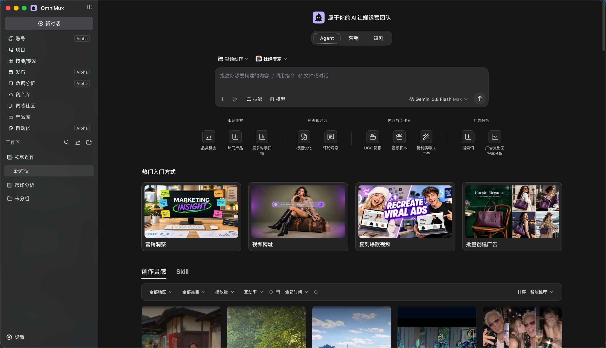

# OmniMux

  <strong>角色生成与视频复刻</strong> 
  用文字或照片建立角色，结合参考视频制作角色视频

  
  
  
  
  
  
  
  

  

---

## 简介

**OmniMux 聚焦角色生成与视频复刻。** 从文字描述或有权使用的照片建立角色，结合参考视频制作角色视频，核心创作能力为生图与生视频。现行定位与表述边界见[产品定位](docs/contracts/product-positioning.md)。

本仓是基于 [DeepSeek Harness](https://github.com/deepseek-ai/deepseek-harness) 的桌面插件工程，不是官网工作台源码。官网的角色创建旅程不等于本仓已经逐项完成；实际能力须核对[能力记录](docs/capabilities.md)、当前代码及对应版本证据。

灵感、素材、画布与必要剪辑服务于角色视频成片。多账号矩阵、自动排期和独立运营分析不是默认产品主线；不承诺固定降本比例、零抽成或素材始终只留本地。

## AI 应用：历史目标与审计边界

以下通用应用是历史方案，不是当前产品扩展任务；现行范围见[产品定位](docs/contracts/product-positioning.md)。历史目标是 schema 驱动的通用应用，而非写死业务页面：唯一宿主入口，视频/图片/音频三类二级栏，选应用后收起且可重开；compact tabs 后单个左右大卡片，左表单、右历史/示例。空历史默认示例但不得伪造历史；发布者自主上传/选择多图、多视频与封面并保存 Demo 输入快照。

**纠正此前不实宣称**：针对固定审计基线 `e416238631cc78ef8caeab7b5313d9571947ef5a` 至目标 `a1ecf7bddc110992d870efd3b4e56511dfe43c9e`，Production Ready、零缺陷、端到端闭环、Apps 持久化、CI 已接入、11 组对抗测试、完整团队 TDD 均不成立。仅有 4 个 Apps 单测与 1 个 mock seam 单测通过、弱静态扫描通过；原区间 `git diff --check` 因行尾空白失败。上述结果不能替代真实宿主、媒体播放与执行验收。

固定目标 SHA 的原型仍为未挂载向导、内存 Registry、硬编码表单、4 秒 mock 成功、无真实播放器/上传选择器；原型代码留在 `omnimux-dsh-wt-contracts`，不代表 main、Dev 或生产已具备这些能力。本次仅将已审计文档融合到 main 基线，不合入原型代码，没有修复代码、接入 CI 或完成运行验收。

具体目标与需求—验收—实现状态见 [AI 应用 UI 规范](docs/contracts/ai-app-ui-spec.md)；目标职责、技术约束与已验证源码缺口见 [Canvas / Apps 边界](docs/contracts/workflow-app-boundary.md)。Canvas 调度，Hub 管凭证、provider HTTP 与模型路由，Apps 管表单、发布规范和域存储；Apps 不重造执行器。计费/退款/算力、评分、第四类 agent、VS SYNC/wipe、冗余回填及工作流源链接不属于本次 AI 应用需求。

## 工程结构与能力状态

执行中枢负责身份、凭证、模型路由与媒体执行；领域插件管理各自的素材、灵感、画布和剪辑职责。结构与术语见 [CONTEXT.md](CONTEXT.md)，调用边界见[中枢合同](docs/contracts/hub.md)。

已有账号、发布、运营分析等插件保留其技术职责，但不因存在源码而成为当前对外承诺。安装阶段以[插件生命周期清单](plugins/omnimux/src/plugin-lifecycle.json)为准，真实可用性以[能力记录](docs/capabilities.md)及当前验收为准，不维护第二份正式可用徽章或素材数量表。

## 文档入口

| 需要了解什么 | 入口 |
| --- | --- |
| 当前产品方向与宣传边界 | [产品定位](docs/contracts/product-positioning.md) |
| 角色视频制作的目标与验收 | [角色生成与视频复刻指南](docs/guides/ecommerce-video-replication.md) |
| 开发文档与适用合同 | [文档导航](docs/README.md)、[智能体约束](AGENTS.md) |
| 中枢接口目录快照 | [接口面板](docs/tools/hub-interfaces.html)，不是部署状态或上游能力真源 |
| 软件使用与商业授权 | [许可原文](LICENSE)、[商业授权说明](COMMERCIAL.md)，不等于生成免费 |
| 第三方来源与许可 | [致谢与第三方声明](ACKNOWLEDGEMENTS.md) |

## 💼 版本许可 (Community vs Enterprise)

OmniMux 采用标准的 **Open-Core** 模式与 **Sustainable Source** 许可：

以下保留既有许可说明；不以许可版本推导生成费用或企业功能已经交付。

| 特性 | Community Edition (社区开源自托管) | Commercial / Enterprise (商业企业版) |
| :--- | :---: | :---: |
| **源码完全开放与二次开发** | ✅ 自由修改与本地扩展 | ✅ 支持私有化源码交付与定制 |
| **个人使用 / 学术研究** | ✅ 永久免费 | ✅ 永久免费 |
| **企业内部业务自用 (Self-Hosted)** | ✅ 永久免费 (无限制) | ✅ 免费 (提供专属部署技术支持) |
| **商业转售与白标 OEM 贴牌** | ❌ (明确禁止) | ✅ 官方授权 OEM 品牌独立售卖 |
| **托管云服务运营 (Cloud SaaS)** | ❌ (明确禁止) | ✅ 官方商业 SaaS 运营授权 |

*详细说明与授权流程请查阅 [COMMERCIAL.md](COMMERCIAL.md)。*

## 🚀 快速启动 (Quickstart)

### 环境要求
* **Node.js**：`^22.19 || >=24`
* **pnpm**：`>=9`
* **DeepSeek Harness (DSH)**：通过 `npx @deepseek-ai/dsh` 或本地 DSH 环境运行。

### 本地开发与交付

从 [AGENTS.md](AGENTS.md) 和[仓库 workflow](.agents/skills/omnimux-repo-workflow/SKILL.md)进入开发流程：

1. 在仓内隔离 worktree 实施，运行与变更面相关的自动化测试、静态检查和独立评审；选择依据见[插件 QA](docs/contracts/plugin-qa.md)。例如在当前任务 worktree 执行 `pnpm --filter <package> test`，文档变更执行 `git diff --check` 与 `pnpm doc:lint`。
2. PR 满足 required CI，经 Merge Queue 合入 `main`。CI `qa:pass` 只证明合入前静态与测试，不证明 Dev 已通过。
3. 界面变更在任务隔离工作树内取得实际功能路径浏览器证据；合入后仅影响已安装运行时的改动物化 Dev `~/.omnimux-dev`。45120 的开发版验收由人工负责；纯文档无需安装或重启应用。完整规则见[插件 QA](docs/contracts/plugin-qa.md)。

没有合并前独立 App/Host 测试环境。不得将未合并 worktree link 或物化到 Dev/Prod；生产 `~/.omnimux`、`--prod`、`--all` 与正式发布仍需独立授权。完整边界见[开发环境合同](docs/contracts/dev-pipeline.md)。

---

## 💬 社区交流与开发者群 (Community)

可选择常用的平台参与讨论，交流 AI 视频出片技巧、探讨插件二次开发、反馈需求与跟踪最新进展：

<table>
  <thead>
    <tr>
      <th align="center" width="50%">微信 / 企业微信开发者交流群</th>
      <th align="center" width="50%">全球社交媒体与开发者频道</th>
    </tr>
  </thead>
  <tbody>
    <tr>
      <td align="center" valign="middle">
         
        扫码加入 <strong>OmniMux 开发者交流群</strong> （微信或企业微信均可扫码进入）
      </td>
      <td align="center" valign="middle">
        

          
        

        

          
        

        

          
        

        欢迎提交 Issue、参与功能共建或在 Discord / X 与全球开发者互动！
      </td>
    </tr>
  </tbody>
</table>

---

## 🤝 贡献与共建 (Contributing)

我们非常欢迎开发者参与共建！无论是修复 Bug、编写文档，还是为 OmniMux 贡献新的 Agent Skills 或插件：
1. 查阅 [CONTRIBUTING.md](CONTRIBUTING.md) 了解代码规范与 PR 提交流程。
2. 遵守 [CODE_OF_CONDUCT.md](CODE_OF_CONDUCT.md) 行为准则。
3. 发现安全问题请按照 [SECURITY.md](SECURITY.md) 私密通报。

---

## 🙏 开源公示与致谢 (Acknowledgements & Third-Party Credits)

OmniMux 的构建与演进站在了开源巨人的肩膀上，我们对以下直接 Fork、深度二开或集成的开源先锋项目致以由衷的敬意与感谢：

* **[@cocofhu/skillhub](https://github.com/cocofhu/skillhub)** (MIT License, by [@cocofhu](https://github.com/cocofhu))：`omnimux-market` 插件市场（技能/插件/专家/连接器四 Tab 架构）的 Fork 二开真源。
* **[Augani/openreel-video](https://github.com/Augani/openreel-video)** (MIT License, by Augani)：`omnimux-clip` 剪辑工坊全套 WebCodecs/WebGPU 时间轴与微应用 Vendorize 真源。
* **[liustack/dsh-viewer](https://github.com/liustack/dsh-viewer)** (MIT License, by [@liustack](https://github.com/liustack))：`omnimux-viewer` 全能媒体渲染器插件真源，提供 36 种媒体与文档格式的就地内联播放能力。
* **[Lum1104/dsh-browser](https://github.com/Lum1104/dsh-browser)** (MIT License, by [@Lum1104](https://github.com/Lum1104))：`omnimux-browser` 浏览器伴侣插件与 Chrome 扩展底座真源，打通网页媒体感知与双向桥接。
* **[deepseek-ai/deepseek-harness](https://github.com/deepseek-ai/deepseek-harness)** (MIT License, by DeepSeek AI)：官方核心 Agent 运行底座与 Harness 插件规范。
* **[anywhere-labs/deepseek-harness-desktop](https://github.com/anywhere-labs/deepseek-harness-desktop)** (MIT License, by Anywhere Labs)：OmniMux 桌面端 Electron Shell 的 Fork 底座。
* **[@xyflow/react (React Flow)](https://github.com/xyflow/xyflow)** (MIT License, by xyflow)：`omnimux-workflow` 无限画布 DAG 节点连接与编排引擎。
* **[Umami Analytics](https://github.com/umami-software/umami)** (MIT License)：`omnimux-analytics` 隐私友好的插件指标与社媒运营分析。
* **[Blobatar](https://github.com/joshglendenning/blobatar)** (MIT License, by Josh Glendenning)：`omnimux` 账号与 Agent 动态色彩头像生成。
* **模式致敬**：感谢 **[n8n](https://n8n.io)**（可视化节点编排与可持续源码许可）的产品与商业化启发。

*完整第三方开源项目清单与许可证声明详见 **[ACKNOWLEDGEMENTS.md](ACKNOWLEDGEMENTS.md)**。*

---

## 📄 开源许可与商业授权 (License & Commercial)

* **开源自托管许可**：本项目遵循 **[OmniMux Sustainable Source License (Version 1.0)](LICENSE)**（Source-Available 模式）。个人使用、科研学术及企业内部自建业务完全免费。
* **商业授权**：若您需要将 OmniMux 包装成商业产品转售（OEM 贴牌）、搭建收费 SaaS 云服务或采购 Enterprise 企业版，请联系 `hello@omnimux.ai` 或查阅 **[COMMERCIAL.md](COMMERCIAL.md)**。

---

  Copyright © 2026 OmniMux Project. All rights reserved.

