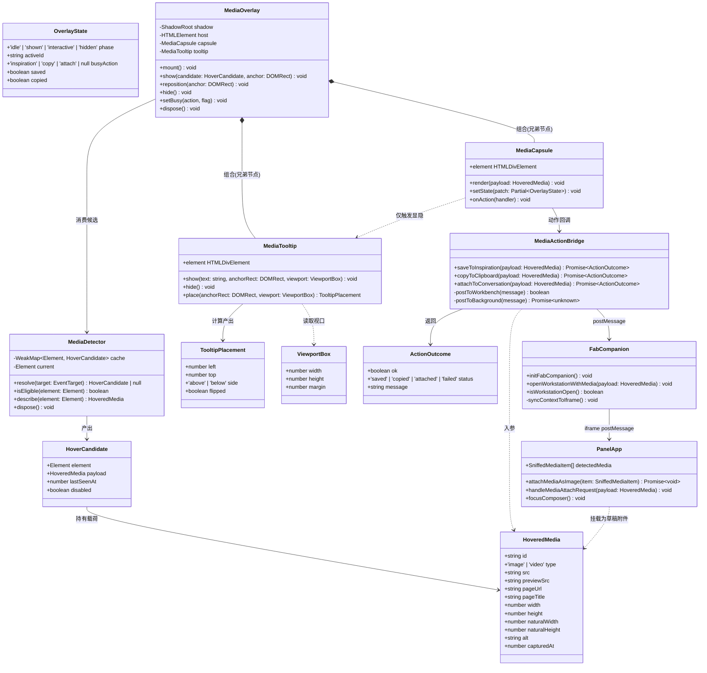
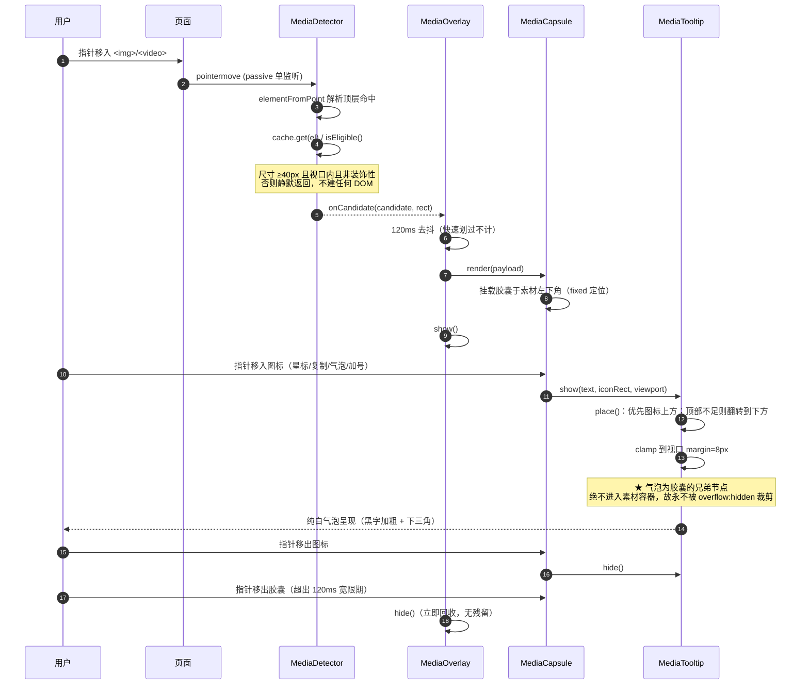
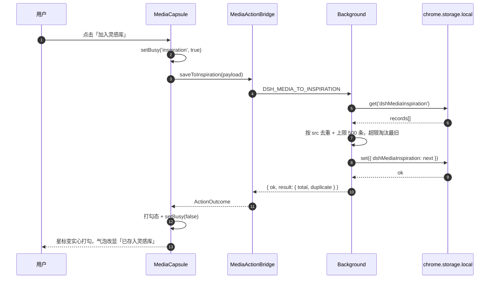
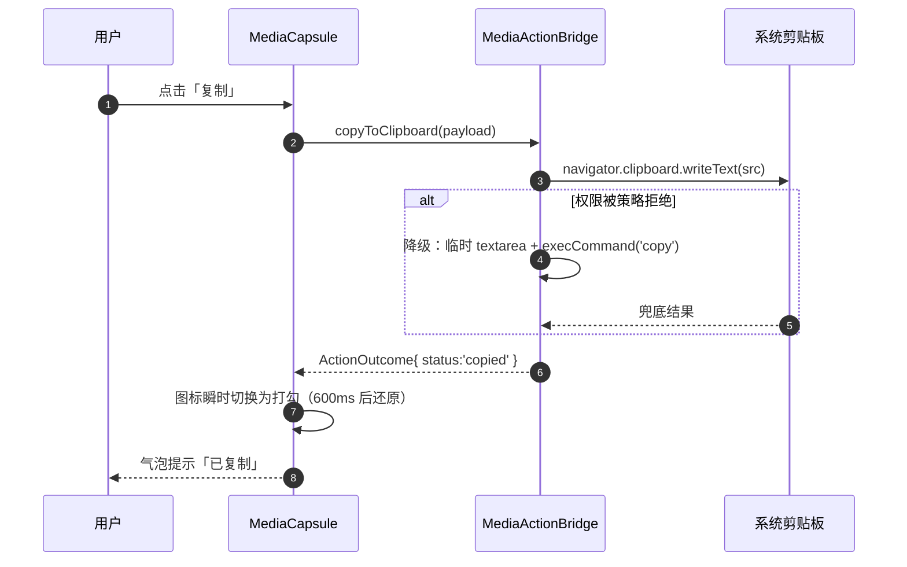
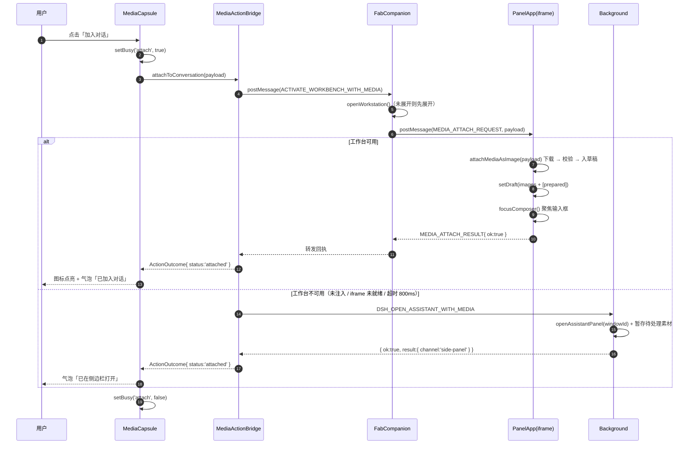
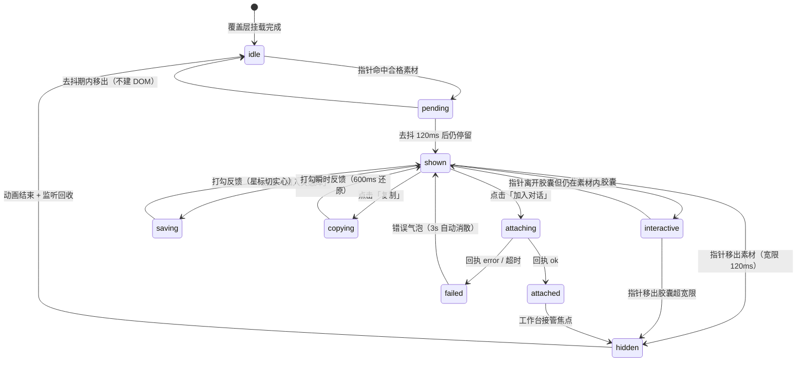
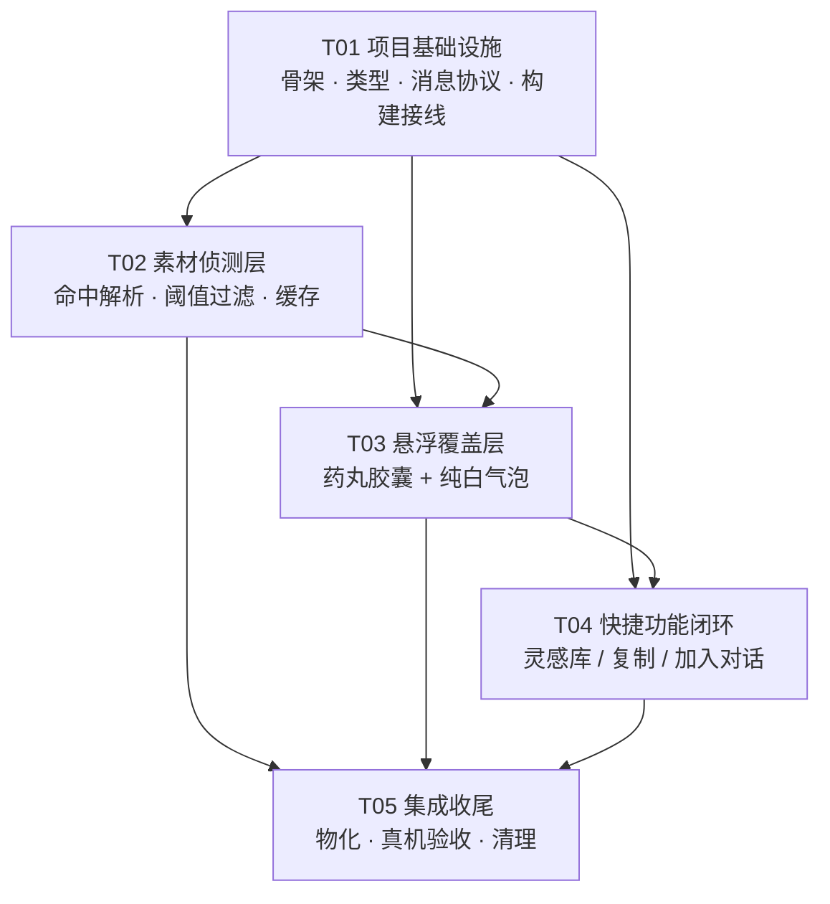

# 浏览器插件页面素材悬停感知与上层气泡快捷功能 — 系统设计

> 权威等级：L2 实现契约（受 `design.md` L1 约束）
> 工作区：`/Users/x/Desktop/Project/dsh-plugin/product/omnimux-dsh-wt-media-hover-assistant`
> 扩展根：`plugins/omnimux-browser/extension`
> 分支：`agent/omnimux-browser-media-hover-assistant`

---

## Part A：系统设计

### 1. 实现方案

#### 1.1 核心难点与结论

| 难点 | 风险 | 结论 |
|---|---|---|
| **气泡被素材容器裁剪** | 素材常处于 `overflow:hidden` 卡片内，任何"胶囊的子元素"都必被截断 | **气泡与胶囊必须平级**，同为 Shadow DOM 里 `fixed` 定位的独立节点，互不为父子。这是本需求的**唯一硬性架构约束** |
| **页面 CSS 污染胶囊/气泡** | 任意网页的 `* {}`、`button {}` 全局样式会打穿普通注入 | 全部 UI 挂载在**单一 `attachShadow({mode:'open'})` 根**内，样式全内联在 shadow 中；宿主页面无法穿透 |
| **宿主 z-index 竞争** | 页面弹窗、广告层可能压住胶囊 | host 使用 `position:fixed; z-index:2147483647`，与既有 `fab-companion` 同级；气泡再叠一层 |
| **悬停侦测唤醒 MV3 Service Worker** | 既有 `selection.ts` 明确纪律：不在页面事件里唤起 SW，否则每次鼠标移动都会冷启后台 | **悬停路径零 runtime 消息**。侦测→显隐→气泡全部在 Content Script 内闭环；**仅用户点击图标时**才发 1 条消息 |
| **`` 数量爆炸** | 电商/瀑布流页面数百张图，逐元素挂监听 = 内存泄漏 | `pointermove` 全局**单监听**（`{passive:true}`）+ `elementFromPoint` 顶层命中 + `WeakMap` 缓存，只在命中候选时挂元素级监听 |
| **面板状态呈现链路断裂** | 现网 `App.tsx:712` 的 `detectedMedia` **只被写入、从未被渲染**（死分支），"感知"能力当前对用户不可见 | 本设计**复用该 state** 作为草稿挂载的响应侧，不新建并行通道 |

#### 1.2 框架与库选型

| 层 | 选型 | 理由 |
|---|---|---|
| 悬停侦测 | 原生 DOM API（`pointermove` / `elementFromPoint` / `IntersectionObserver`） | 零依赖、零构建成本；Content Script 为 IIFE 产物，不能引入 React |
| 浮层 UI | **原生 DOM + Shadow DOM**（非 React） | `vite.content.config.ts` 产出 `iife/content.js`，无 React 运行时；且 Shadow DOM 是唯一可靠的样式隔离手段 |
| 图标 | **内联 SVG 字符串**（`innerHTML` 注入） | 满足宿主 UI04 硬门禁"纯矢量 SVG、禁 Emoji/字符"。`SvgIcon` 为 React 组件不可用，故在 `overlay-icons.ts` 内维护 SVG 字符串常量表，**与 `icons.tsx` 保持图形语言一致** |
| 灵感库持久化 | `chrome.storage.local`（`storage` 权限已声明） | 跨站点、跨标签页共享；Content Script 可直读，无需后台中转 |
| 剪贴板 | `navigator.clipboard.writeText` + `document.execCommand('copy')` 兜底 | 权限策略差异下的双通道降级 |
| 工程栈 | 沿用 Vite 6 + TypeScript 5.6（`strict` / `noUnusedLocals` / `noUnusedParameters`） | 已就绪，无新增构建目标 |

#### 1.3 三层架构

```
┌──────────────────────────────────────────────────────────────────┐
│ L1 素材侦测层（Content Script · 页面世界 · 无 UI）                │
│   media/detector.ts  指针→素材元素解析、阈值过滤、WeakMap 缓存     │
│   media/payload.ts   归一化载荷（绝对 URL、尺寸、类型）            │
│   ★ 零 runtime 消息：侦测过程绝不唤起 Service Worker               │
└───────────────────────────┬──────────────────────────────────────┘
                            │ 纯函数回调（同进程内）
┌───────────────────────────▼──────────────────────────────────────┐
│ L2 悬浮覆盖层（Shadow DOM · 唯一 UI 出口）                        │
│   media/overlay.ts        host + shadow 生命周期、定位、显隐       │
│   media/capsule.ts        深黑磨砂药丸（4 图标 + 分割 + 品牌微标） │
│   media/tooltip.ts        ★ 纯白气泡（胶囊的兄弟节点，非子节点）   │
│   media/overlay-icons.ts  SVG 字符串常量（禁 Emoji）              │
│   media/actions.ts        加入灵感库 / 复制 / 加入对话             │
│   media/styles.ts         全部内联 CSS（#1e2026、22px、白气泡）    │
└───────────────────────────┬──────────────────────────────────────┘
                            │ 仅点击时：1 条消息
┌───────────────────────────▼──────────────────────────────────────┐
│ L3 通信与集成层                                                   │
│   fab-companion.ts    悬浮工作台 postMessage ↔ panel iframe       │
│   background/index.ts 侧边栏通道（工作台不可用时的兜底）           │
│   panel/App.tsx       MEDIA_ATTACH_REQUEST → 草稿挂载 + 聚焦      │
└──────────────────────────────────────────────────────────────────┘
```

**分层纪律**：L2 不得直接 `chrome.runtime.sendMessage`；所有对外通信经 `media/actions.ts` 单一出口，便于测试替身注入与审计。

---

### 2. 文件清单

#### 2.1 新增

| 相对路径（`plugins/omnimux-browser/extension/` 下） | 职责 |
|---|---|
| `src/content/media/payload.ts` | 悬停素材载荷类型、归一化、尺寸阈值判定 |
| `src/content/media/messages.ts` | 消息 `type` 常量、`source` 标识、层级与视觉规格常量（唯一真源） |
| `src/content/media/detector.ts` | 指针→素材元素解析、候选缓存、视口/可见性过滤 |
| `src/content/media/overlay-icons.ts` | 纯矢量 SVG 字符串常量表（星标、复制、气泡、加号、品牌微标） |
| `src/content/media/capsule.ts` | 药丸胶囊的 DOM 构建与图标交互态 |
| `src/content/media/tooltip.ts` | **纯白气泡**的 DOM 构建、贴边算法、显隐 |
| `src/content/media/overlay.ts` | Shadow DOM 根生命周期、定位、防抖、防误触、销毁清理 |
| `src/content/media/actions.ts` | 三功能的 L3 通信出口（灵感库/复制/加入对话） |
| `src/content/media/styles.ts` | 覆盖层全部 CSS 文本（内联注入 shadow） |
| `tests/media-detector.spec.ts` | 侦测层单测（阈值、缓存、命中解析） |
| `tests/media-tooltip.spec.ts` | 气泡贴边算法与兄弟节点结构单测 |
| `tests/media-actions.spec.ts` | 三功能消息契约与降级路径单测 |
| `tests/media-overlay-integration.spec.ts` | 覆盖层挂载/销毁与重复注入回归 |

> 说明：覆盖层样式必须内联在 `styles.ts`——Content Script **没有 CSS 外链加载通道**，`vite.content.config.ts` 只产出 JS。

#### 2.2 修改

| 相对路径 | 修改点 |
|---|---|
| `src/content/index.ts` | 挂载 `initMediaHoverOverlay()`，与 `initFabCompanion()` 并列；沿用 `globalThis.__dshBrowser*` 的**重复注入清理**约定 |
| `src/content/media-sniffer.ts` | 抽出 40px 视口阈值判定为共享函数，避免两套阈值漂移 |
| `src/content/fab-companion.ts` | ① 新增 `MEDIA_ATTACH_REQUEST` 转发；② 新增 `ACTIVATE_WORKBENCH_WITH_MEDIA` 处理器；③ 导出 `openWorkstationWithMedia()` 供覆盖层调用；④ 修复 `detectedMedia` 呈现链路 |
| `src/background/index.ts` | 新增 `DSH_MEDIA_TO_INSPIRATION`（灵感库写入）与 `DSH_OPEN_ASSISTANT_WITH_MEDIA`（侧边栏兜底 + 素材暂存） |
| `src/panel/App.tsx` | ① 接收 `MEDIA_ATTACH_REQUEST`；② 挂载媒体条渲染（修复死分支）；③ 挂载后聚焦输入框；④ 回执 `MEDIA_ATTACH_RESULT` |
| `src/panel/components/icons.tsx` | 补充星标、复制、气泡图标，供面板侧复用同一图形语言 |
| `src/panel/components/MediaSnifferBar.tsx` | 将 `'✓' / '+'` 字符改为 SVG（消除既有 UI04 违规） |
| `src/panel/styles.css` | 草稿素材"点亮"态样式（与既有 `.draft-image` 一致） |

---

### 3. 数据结构与接口



#### 3.1 素材载荷

```ts
/** 归一化后的悬停素材载荷。所有 URL 必须为绝对地址。 */
export interface HoveredMedia {
  id: string
  type: 'image' | 'video'
  /** 绝对资源地址；相对路径在此层完成解析 */
  src: string
  /** 缩略图地址（视频取 poster，缺失时回退 src） */
  previewSrc: string
  pageUrl: string
  pageTitle: string
  /** 渲染尺寸（CSS 像素） */
  width: number
  height: number
  /** 固有尺寸；用于下游像素上限校验 */
  naturalWidth: number
  naturalHeight: number
  alt: string
  capturedAt: number
}
```

**关键约束**：`src` 必须经 `new URL(raw, location.href).href` 归一化。面板侧 `attachMediaAsImage()` 直接 `fetch(item.src)`，相对路径会以 **iframe 自身 origin** 解析而失败——这是现网已存在的隐性缺陷，本设计在此层一次性消除。

#### 3.2 消息协议契约

**通道 A：Content Script ↔ 工作台 iframe（`window.postMessage`）**

| `type` | 方向 | `payload` | 说明 |
|---|---|---|---|
| `PAGE_CONTEXT_UPDATE` | Content → iframe | `{…context, media}` | 既有 |
| `MEDIA_SNIFFED_RESULT` | Content → iframe | `HoveredMedia[]` | 既有 |
| `GET_PAGE_CONTEXT` | iframe → Content | — | 既有 |
| **`MEDIA_ATTACH_REQUEST`** | **Content → iframe** | **`HoveredMedia`** | **新增：挂载为草稿附件并聚焦输入框** |
| **`MEDIA_ATTACH_RESULT`** | **iframe → Content** | **`{ id, ok, reason? }`** | **新增：回执，驱动胶囊打勾/错误态** |
| **`ACTIVATE_WORKBENCH_WITH_MEDIA`** | **面板/内部 → Content** | **`HoveredMedia`** | **新增：展开工作台 + 投递素材** |

**通道 B：Content Script ↔ 后台 Service Worker（`chrome.runtime.sendMessage`）**

| `type` | 方向 | `payload` | 说明 |
|---|---|---|---|
| `DSH_CONTENT_READY` | Content → BG | — | 既有 |
| `DSH_SELECTION` | Content → BG | `selection` | 既有 |
| **`DSH_MEDIA_TO_INSPIRATION`** | **Content → BG → `chrome.storage.local`** | **`HoveredMedia`** | **新增：加入灵感库（去重、封顶、配额回收）** |
| **`DSH_OPEN_ASSISTANT_WITH_MEDIA`** | **Content → BG** | **`HoveredMedia`** | **新增：工作台不可用时的侧边栏兜底 + 素材暂存** |

**契约纪律**（与仓库既有约定一致）

- 每条 `postMessage` 带 `source: 'omnimux-content-script'` 标识，接收侧校验，拒绝外来消息注入。
- 所有响应统一 `{ ok: boolean; result?: T; error?: { code: string; message: string } }` 形态。
- `targetOrigin = '*'`（iframe 为 `chrome-extension://` 自身源），但**接收侧必须校验 `e.source === expectedWindow`**。

#### 3.3 视觉与层级契约（唯一真源，禁止散落魔数）

```ts
/** 覆盖层层级。与既有 fab-companion host 同级，气泡再叠一层。 */
export const OVERLAY_Z = {
  host: 2147483647,
  capsule: 2147483646,
  tooltip: 2147483645,
} as const

/** 纯白气泡（需求第 3 条核心视觉） */
export const TOOLTIP_SPEC = {
  background: '#FFFFFF',
  color: '#0A0A0B',
  fontWeight: 600,
  fontSize: 12,
  lineHeight: '16px',
  padding: '6px 10px',
  borderRadius: '8px',
  maxWidth: 220,
  arrow: { size: 5, offsetX: 14, side: 'bottom' }, // 底部向下小三角
  shadow: '0 6px 20px rgba(0,0,0,0.28), 0 1px 2px rgba(0,0,0,0.18)',
  offsetY: 8,        // 与图标上沿的间距
  viewportMargin: 8, // 离视口边缘最小距离
} as const

/** 深黑磨砂药丸胶囊 */
export const CAPSULE_SPEC = {
  background: 'rgba(30,32,38,0.95)', // #1e2026 / 0.95
  borderRadius: 22,
  height: 44,
  paddingX: 6,
  blur: 'blur(18px) saturate(140%)',
  border: '1px solid rgba(255,255,255,0.14)',
  sheen: 'inset 0 1px 0 rgba(255,255,255,0.20)', // 磨砂光泽上边
  shadow: '0 8px 26px rgba(0,0,0,0.42), inset 0 0 0 0.5px rgba(255,255,255,0.06)',
  inset: 10,     // 距素材左下角内边距
  iconSize: 30,
} as const
```

---

### 4. 程序调用流程

#### 4.1 悬停感知与展示



#### 4.2 加入灵感库



#### 4.3 复制



#### 4.4 加入对话并点亮（核心闭环）



#### 4.5 状态流转



---

### 5. 待澄清项

| # | 项 | 本设计的假设与理由 |
|---|---|---|
| 1 | 「加入灵感库」的落点 | **假设为扩展本地库**（`chrome.storage.local`）。理由：`plugins/omnimux-inspiration/src/local-store.js` 运行在 **Node 宿主进程**，数据落在宿主本机路径，浏览器扩展沙箱**无法直接写入**。因此扩展侧先落地本地库并给出打勾反馈；与宿主灵感库的同步属**独立后续能力**（需宿主侧开放写入接口），**不在本次交付范围**。若用户期望"直接进宿主灵感库"，需主理人确认后另开任务 |
| 2 | 「复制」的目标内容 | **假设复制绝对资源地址**（`src`）。理由：剪贴板写入位图需 `ClipboardItem` 且跨浏览器支持不一致。若需复制图片本身，作为增强项 |
| 3 | 视频素材的 `src` | **假设优先取 `<video>` 的 `poster`，缺失时回退首个 `<source>` 地址**。理由：`media-sniffer.ts` 现网口径即 poster；直接取 `.src` 在流媒体场景下常为空 |
| 4 | 阈值口径 | **假设沿用 `≥40px`**，与 `media-sniffer.ts` 既有实现一致（该文件注释已注明"过滤微小追踪像素或头像"）。两者必须共用同一判定函数，禁止各写一套 |
| 5 | `overflow:hidden` 的彻底规避 | **假设胶囊与气泡均使用 `position:fixed`**，挂载于 `document.documentElement` 直属的 Shadow host，**不使用任何 `position:absolute` + offsetParent 方案**。这是需求第 3 条的硬性实现前提 |
| 6 | 与既有悬浮工作台的关系 | **假设沿用 `fab-companion` 的 430px 浮动工作台**（`mode=float` iframe），不新建第二个工作台 |

---

## Part B：任务分解

### 6. 依赖包

**无新增第三方依赖。** 全部能力由既有栈与浏览器原生 API 承载：

```
- 悬停侦测：pointermove / elementFromPoint / IntersectionObserver（浏览器原生）
- 浮层 UI：原生 DOM + Shadow DOM（content.js 为 IIFE，无 React 运行时）
- 图标：内联 SVG 字符串（不把 lucide-react 引入 content 包）
- 持久化：chrome.storage.local（manifest 已声明 storage 权限，无需改动）
- 复用既有：vite@^6.0.0 / typescript@^5.6.2 / vitest@^4.1.11 / jsdom@^26.1.0
```

> 原则：Content Script 产物为 IIFE，引入任何 UI 框架都会成倍放大页面注入体积。本设计坚持零新增依赖。

---

### 7. 任务列表（按依赖排序，工程师须顺序执行）

#### T01 · 项目基础设施与消息协议契约

| 项 | 内容 |
|---|---|
| **任务 ID** | T01 |
| **任务名** | 媒体悬停模块骨架、共享类型、消息协议常量与构建接线 |
| **源文件** | 新增 `src/content/media/payload.ts`、`src/content/media/messages.ts`、`src/content/media/styles.ts`<br>修改 `src/content/index.ts`（挂载接线 + 重复注入清理）<br>修改 `src/content/media-sniffer.ts`（抽出共享 40px 判定） |
| **依赖** | 无 |
| **优先级** | P0 |

**交付标准**

- `payload.ts` 导出 `HoveredMedia`、`normalizeMedia()`、`isEligibleMediaSize()`；URL 归一化必须产出绝对地址。
- `messages.ts` 导出全部消息 `type` 常量、`source` 标识常量、`OVERLAY_Z`、`TOOLTIP_SPEC`、`CAPSULE_SPEC`。**禁止在其它文件重复硬编码这些值**。
- `styles.ts` 导出覆盖层完整 CSS 文本单字符串。
- `index.ts` 中 `initMediaHoverOverlay()` 与既有 `initFabCompanion()` 并列挂载，并写入 `globalThis.__dshBrowserMediaOverlay` 句柄，重复注入时先 `dispose()` 旧的（对齐既有 `CONTENT_SELECTION_WATCHER` 清理约定）。
- 验证：`pnpm typecheck` 通过（`strict` + `noUnusedLocals` + `noUnusedParameters` 全开）。

---

#### T02 · 素材侦测层

| 项 | 内容 |
|---|---|
| **任务 ID** | T02 |
| **任务名** | 指针命中解析、阈值过滤、候选缓存与生命周期 |
| **源文件** | 新增 `src/content/media/detector.ts`、`tests/media-detector.spec.ts`<br>修改 `src/content/media/payload.ts`（补齐 `<video>` poster / `<source>` 回退解析） |
| **依赖** | T01 |
| **优先级** | P0 |

**交付标准**

- 全局**单** `pointermove` 监听（`{ passive: true }`），**禁止为每个 `` 挂监听**；命中解析用 `elementFromPoint` 取顶层元素后向上寻找最近的 `img`/`video`。
- `WeakMap` 缓存候选，同一元素不重复计算尺寸与 URL。
- 过滤链：尺寸 `<40px` → 视口外 → `src` 为空或 `data:` → 命中即拒（静默返回 `null`，不产生任何 DOM）。
- 滚动 / `resize` 时重算锚点矩形；元素被移除时释放缓存。
- `dispose()` 完整解绑，`tests/content-index.spec.ts` 的重复注入用例不回归。
- 验证：`pnpm --filter dsh-browser-extension test` 通过，新增用例覆盖阈值边界（39px 拒 / 40px 收）、相对 URL 归一化、`data:` 拒绝、缓存命中。

---

#### T03 · Shadow DOM 悬浮覆盖层（胶囊 + 纯白气泡）

| 项 | 内容 |
|---|---|
| **任务 ID** | T03 |
| **任务名** | 药丸胶囊与纯白气泡浮层：结构、定位、贴边、防误触 |
| **源文件** | 新增 `src/content/media/overlay-icons.ts`、`src/content/media/capsule.ts`、`src/content/media/tooltip.ts`、`src/content/media/overlay.ts`、`tests/media-tooltip.spec.ts` |
| **依赖** | T01、T02 |
| **优先级** | P0 |

**交付标准**

- 单一 host：`position:fixed; top:0; left:0; width:0; height:0; overflow:visible; z-index:2147483647`，`attachShadow({mode:'open'})`，`styles.ts` 内容全量内联注入。
- 胶囊：`rgba(30,32,38,0.95)`、圆角 `22px`、高 `44px`、`backdrop-filter` 磨砂 + `inset` 上边光泽，定位**素材左下角内侧 10px**。
- 胶囊内容顺序固定：`[星标] [复制] [气泡] [竖线分割] [+] [品牌微标]`。
- 图标全部来自 `overlay-icons.ts` 的 `innerHTML` SVG 字符串，**零 Emoji、零 Unicode 字符**（UI04 精神，即使 guard 不扫描 content 目录也必须遵守）。
- **气泡（关键验收点）**：
  - 气泡节点是**胶囊的兄弟节点**，同为 `position:fixed`，**绝不作为胶囊或素材容器的子元素**。
  - 白底 `#FFFFFF`、黑字加粗（`font-weight:600`）、`8px` 圆角、**向下小三角**、柔和阴影。
  - `place()`：优先显示在图标**上方**（`offsetY: 8px`）；上方空间不足时翻转到下方并翻转三角方向；最终 `clamp` 到视口 `8px` 边距内，左右同样贴边。
  - 在带 `overflow:hidden` 的容器内、以及贴近视口顶部/左/右边缘的素材上，气泡**必须完整可见不被裁剪**（用例断言：气泡 rect 完全落在视口内）。
- 防误触：素材 `mouseleave` 后保留 **120ms 宽限期**，指针在此期间进入胶囊则不隐藏；点击胶囊图标不触发页面默认行为（`preventDefault` + `stopPropagation`）。
- 验证：`tests/media-tooltip.spec.ts` 覆盖中心定位、顶部翻转、四向视口钳制、兄弟节点结构断言（`tooltip.parentNode === capsule.parentNode`）。

---

#### T04 · 快捷功能与深度闭环

| 项 | 内容 |
|---|---|
| **任务 ID** | T04 |
| **任务名** | 加入灵感库、复制、加入对话并点亮草稿附件 |
| **源文件** | 新增 `src/content/media/actions.ts`、`tests/media-actions.spec.ts`<br>修改 `src/background/index.ts`、`src/content/fab-companion.ts`、`src/panel/App.tsx`、`src/panel/components/icons.tsx`、`src/panel/components/MediaSnifferBar.tsx`、`src/panel/styles.css` |
| **依赖** | T01、T03 |
| **优先级** | P0 |

**交付标准**

- **加入灵感库**：写入 `chrome.storage.local` 键 `dshMediaInspiration`，按 `src` 去重、上限 500 条、超限淘汰最旧；成功后星标切换为**实心打勾态**并弹出「已存入灵感库」气泡。
- **复制**：`navigator.clipboard.writeText` 主通道，`execCommand` 兜底；图标瞬时打勾（600ms 还原），气泡提示「已复制」。
- **加入对话（核心闭环）**：
  1. 工作台未展开 → 先展开（复用既有 `openWorkstation()`）。
  2. `postMessage(MEDIA_ATTACH_REQUEST)` 投递素材。
  3. `App.tsx` 侧复用既有 `attachMediaAsImage()` → 入 `draftImages` → **素材在输入框上方点亮呈现为附件** → `focusComposer()` 聚焦输入框。
  4. **修复 `App.tsx:712` 的 `detectedMedia` 死分支**：该 state 必须真正渲染出来（挂载 `MediaSnifferBar` 或等价呈现），否则"感知"能力对用户永远不可见。
  5. 回执 `MEDIA_ATTACH_RESULT` 驱动胶囊点亮/错误态。
  6. **兜底**：800ms 内未收到回执 → 走 `DSH_OPEN_ASSISTANT_WITH_MEDIA` 打开原生侧边栏并暂存素材。
- 验证：`pnpm --filter dsh-browser-extension test` 全绿；`tests/media-actions.spec.ts` 覆盖三功能的成功路径、去重、配额淘汰、剪贴板降级、回执超时兜底。

---

#### T05 · 集成收尾与实机验收

| 项 | 内容 |
|---|---|
| **任务 ID** | T05 |
| **任务名** | 端到端集成、构建物化、真机交互验收与清理 |
| **源文件** | 修改 `src/content/index.ts`（最终挂载顺序与时序收敛）、`tests/content-index.spec.ts`<br>新增 `tests/media-overlay-integration.spec.ts`<br>仅在确需时修改 `manifest.json`（预期**无需修改**，`storage` 权限已声明） |
| **依赖** | T01、T02、T03、T04 |
| **优先级** | P0 |

**交付标准**

- `pnpm build` 产出 `dist/content.js`，**IIFE 体积不得因本功能翻倍**（记录实测字节数）。
- 真机验证（必须走 ego-browser，禁止以内置浏览器替代）：在含 `overflow:hidden` 卡片与视口边缘素材的真实站点上，逐项确认 ① 胶囊出现在素材左下角 ② **四个图标的气泡全部在图标上方完整呈现、无一被裁剪** ③ 三功能各自闭环 ④「加入对话」后工作台展开、素材在上方点亮、输入框已聚焦。
- 重复注入回归：扩展重载后旧覆盖层被 `dispose()`，页面无残留节点与监听（`document.querySelectorAll('#omnimux-media-hover-root').length === 1`）。
- 清理：删除本任务创建的临时文件与验证脚本。
- 验证：`pnpm typecheck` + `pnpm --filter dsh-browser-extension test` + `pnpm build` 三绿，并留存 ego-browser 截图证据。

---

### 8. 共享知识

#### 8.1 硬性纪律（违反即返工）

1. **气泡与胶囊必须是兄弟节点**。任何"把气泡塞进胶囊/素材容器"的实现都会触发 `overflow:hidden` 裁剪，直接违背需求第 3 条。
2. **悬停路径零 runtime 消息**。侦测、显隐、气泡全部在 Content Script 内闭环；只有**用户点击**才产生 1 条消息。这是 `selection.ts` 已确立的纪律（避免每次鼠标移动冷启 MV3 Service Worker），必须延续。
3. **零 Emoji / 零 Unicode 字符充当图标**。`overlay-icons.ts` 内全部为 SVG 字符串。注意 `MediaSnifferBar.tsx:60` 现有 `{isAttached ? '✓' : '+'}` 属既有 UI04 违规（该路径不在 guard 扫描范围内），**本次改动到该文件时必须一并改为 SVG**。
4. **URL 一律绝对化**。`src` 在 `payload.ts` 归一化，下游禁止再拼接。
5. **常量唯一真源**。`OVERLAY_Z` / `TOOLTIP_SPEC` / `CAPSULE_SPEC` 只在 `messages.ts` 定义。
6. **零新增第三方依赖**。Content Script 为 IIFE 产物，引入框架会成倍放大注入体积。

#### 8.2 数值契约

| 项 | 值 |
|---|---|
| 素材尺寸阈值 | `≥40 × 40` CSS px |
| 悬停去抖 | `120ms` |
| 离开宽限期（进胶囊不隐藏） | `120ms` |
| 气泡与图标间距 | `8px` |
| 气泡视口最小边距 | `8px` |
| 胶囊距素材左下角内边距 | `10px` |
| 加入对话回执超时 | `800ms` |
| 复制打勾瞬时反馈 | `600ms` |
| 错误气泡自动消散 | `3000ms` |
| 灵感库条目上限 | `500` |
| 单页扫描素材上限 | `8`（对齐 `media-sniffer.ts` 现网口径） |

#### 8.3 语义与命名

- 覆盖层 host id：`omnimux-media-hover-root`
- 重复注入句柄：`globalThis.__dshBrowserMediaOverlay`
- 灵感库存储键：`dshMediaInspiration`
- 消息 `source` 标识：`omnimux-content-script`
- 面向用户文案走 `src/i18n.ts` / `_locales/*`，中英双语齐备（`_locales` 现有 en / zh_CN / zh_TW 三份）

#### 8.4 边界防错清单（逐条必须在 T05 验证）

| 场景 | 期望行为 |
|---|---|
| 素材处于 `overflow:hidden` 卡片内 | 气泡完整可见，无裁剪 |
| 素材贴近视口顶部 | 气泡自动翻转到图标**下方**，三角方向同步翻转 |
| 素材贴近视口左 / 右边缘 | 气泡水平 `clamp`，不溢出视口 |
| 素材小于 40px | 完全不响应，不建任何 DOM |
| 快速划过多个素材 | 去抖拦截，只有停留超 120ms 的才展示 |
| 指针从素材移向胶囊 | 宽限期内不隐藏，用户可顺畅点击 |
| 页面滚动中 | 锚点矩形实时重算，胶囊跟随；素材滚出视口即隐藏 |
| 页面自身弹窗层 | 覆盖层 `z-index` 最高，胶囊不被压住 |
| 点击胶囊图标 | 不触发页面自身点击行为（`preventDefault` + `stopPropagation`） |
| 工作台 iframe 未就绪 | 800ms 超时后自动降级到原生侧边栏 |
| `clipboard.writeText` 被策略拒绝 | 走 `execCommand` 兜底，仍失败则气泡提示失败 |
| 扩展重载 / 内容脚本重复注入 | 旧实例 `dispose()`，页面仅存 1 个 host，无监听泄漏 |
| 视频无 poster | 回退取首个 `<source>` 地址 |
| 跨域素材 | 复制链接正常；入草稿若 `fetch` 失败则气泡提示失败（不静默） |

---

### 9. 任务依赖图



**执行序**：T01 → T02 → T03 → T04 → T05（严格串行）。T02 与 T03 存在先后依赖（覆盖层消费侦测层候选），不并行。

---

## 附：设计决策记录

| 决策 | 备选方案 | 选择理由 |
|---|---|---|
| 气泡用兄弟节点而非子节点 | 气泡作为胶囊子元素 | 子元素必被素材容器 `overflow:hidden` 裁剪，**直接违背需求第 3 条**。兄弟节点 + `fixed` 是唯一可靠解 |
| 覆盖层用原生 DOM 而非 React | 在 content 包引入 React | `content.js` 为 IIFE 产物，引入 React 将放大注入体积数倍；且 Shadow DOM 已满足隔离需求 |
| 图标用 SVG 字符串而非组件 | 复用 `icons.tsx` | `icons.tsx` 是 React 组件，IIFE 环境不可用。改为字符串常量表并保持图形语言一致 |
| 灵感库落 `chrome.storage.local` | 直写宿主灵感库 | 宿主灵感库运行于 Node 宿主进程，扩展沙箱无写入通道；跨进程同步需宿主侧开放接口，超出本次范围 |
| 侧边栏降级而非唯一通道 | 只做侧边栏 | 用户明确要求"激活/展开浮动工作台"，侧边栏仅作为 iframe 不可用时的兜底 |
