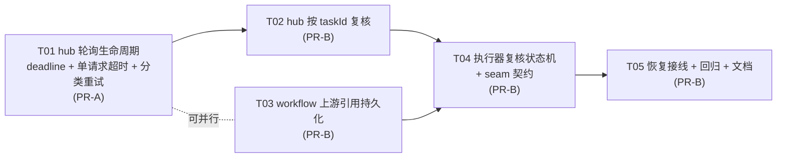

# Issue #1382 实现方案与任务分解 · 跨代任务生命周期（轮询截止 + 重试 + 重启后复核）

- **Issue**: #1382（P1 + P2），承接 #1379 / PR #1380 明确列为非目标的两项
- **Worktree**: `.worktrees/cross-generation-task-lifecycle`
- **分支**: `agent/cross-generation-task-lifecycle-issue-1382`
- **基线**: `origin/main` = `3a88a53b7`
- **状态**: 已实施（T01–T05 全部落地）。§2–§5 的设计正文已按最终代码回填；与设计的偏离集中在 **§11 实施回填**，那里是判断「设计 vs 代码」的唯一入口。

---

## 0. 基线事实核验（本次在设计前实测）

| # | 结论 | 证据 |
|---|---|---|
| 1 | worktree 初始无 `node_modules`；软链到主检出后可用 | `ln -sfn <main>/node_modules node_modules` + 每个 `plugins/*/node_modules` |
| 2 | 跑 pnpm 必须加 `--config.verify-deps-before-run=false` | 不加时实测中止：`ERR_PNPM_ABORTED_REMOVE_MODULES_DIR_NO_TTY`（`confirmModulesPurge`） |
| 3 | **仅 build-host 不够**；`routes.smoke` / `execution-routes` 依赖 canvas bundle | 只跑 `build-host.mjs` 时 `canvasHash === 'missing'` → 2 个测试失败；跑全量 `pnpm --filter omnimux-workflow build`（host+client+canvas）后 **1593 pass / 0 fail** |
| 4 | hub 侧 worktree 测试基线 | `pnpm --filter omnimux test` → **1594 pass / 0 fail** |
| 5 | workflow `typecheck` 脚本含 canvas，**canvas 有 8 个既有错误**（主检出同样 8 个） | 本次改动的门禁应看 `tsc -p tsconfig.host.json --noEmit` → **基线 exit 0（干净）** |
| 6 | 轮询确实无上限 | 探针：`status:'processing'` 固定响应下 600ms 内已发出 **252450 次** GET，`for(;;)` 无出口 |
| 7 | **`signal.throwIfAborted()` 后置检查不能约束挂死请求** | 探针：`await sleep(5000)` 后 `throwIfAborted()`，仍耗时 5002ms 才抛 → 后置检查只覆盖「已返回」情形 |
| 8 | **唯一有效约束是把 signal 传进 `fetch`** | 探针：挂死 HTTP server（永不响应）下 `fetch(url,{signal:AbortSignal.timeout(300)})` → **302ms 抛 TimeoutError**；不加 signal 则永久挂起 |
| 9 | 取消归因可靠 | `AbortSignal.any([caller,timer])` 后：仅 timer 触发 → `caller.aborted===false && timer.aborted===true`；仅 caller 触发 → `caller.aborted===true`。两条探针均验证通过 |
| 10 | 错误码已在工作流侧透传为 `[omnimux:<code>] <message>` | `SeamGatewayError` 构造即 `super(\`[omnimux:${code}] ${message}\`)`；`toSeamError` 保留 `error.code` |

> 第 7/8 条是本设计的**关键发现**：D2 若只做「组合 signal + 事后判断」，无法解决「上游挂死不响应」这一最典型的无限等待成因。必须把组合 signal 传入 `fetch`。

---

## 1. 方案总览

### 1.1 现状缺陷

**P1（hub，`plugins/omnimux/src/media/`）**
- `protocols/openai-media.js:22-44` 的 `pollOpenAiMediaTask` 是无上限 `for(;;)`：出口只有 completed / failed / `signal.aborted`；无 deadline、无尝试上限、固定 1500ms 退避。
- `job.js:12` 的 `getJson` 是裸 `fetcher(url,{signal})`，**没有单请求超时**。上游挂死不响应时，`fetch` 永不 settle，循环连 `aborted` 检查都到不了 → 节点永久「生成中…」。
- 提交阶段的候选切换（`execute.js:172-206`）在**提交成功后即失效**：轮询阶段的瞬态 GET 失败（连接抖动 / 可重试 5xx / 429）零重试，直接判节点失败。
- 与语音路径不一致：`speech.js:23` 有 `AbortSignal.timeout(10*60_000)`，媒体轮询路径没有。

**P2（workflow seam，`plugins/omnimux-workflow/src/workflow/`）**
- 上游 `taskId` 只活在接缝客户端进程内存 `Map`（`seam/omnimuxGateway.ts:82` 的 `tasks`），仅 `awaitTask` 使用（:131-157）；进程重启后 `:133` 抛「未知任务…需重新提交」。
- `PersistedExecutionRecord`（`execution/executionStore.ts:35-60`）持久化 nodeStates / nodeOutputs / mediaAssets / nodes / edges，**没有任何上游任务引用**。
- 恢复路径 `execution/executionRecovery.ts` 把在飞节点 `resetInFlightNodeStates()`（:69-83）重置为 pending 后**盲目重投** → 已在上游完成但未下载的产物被丢弃，且可能重复生成计费。

### 1.2 设计结论一句话

**hub 给轮询加「deadline + 单请求超时 + 分类重试」并把 taskId 变成可按 id 复核的能力；workflow 把上游任务引用随节点状态持久化，恢复时先复核、再决定下载/续等/标错/重投。**

### 1.3 时序图（提交 → 轮询 → 截止/重试 → 下载；以及重启后复核分支）

图见同目录 `2026-09-12-cross-generation-task-lifecycle-sequence.mermaid`（类图另见 `…-class-diagram.mermaid`）。
这里不再内嵌一份 mermaid：同一张图在文档与独立文件里各存一份就会各自漂移，独立文件是唯一真源。

---

## 2. 八项设计决策（逐条结论 + 理由）

### D1 截止参数 → **媒体 20 分钟（主理人拍板）、语音保持 10 分钟，锚定方式改为「不得跨重启重置」**

**结论**

| 参数 | 默认值 | 单位 | 落点 | 可配置方式 |
|---|---|---|---|---|
| `DEFAULT_TASK_DEADLINE_MS` | `20 * 60 * 1000`（1200000） | ms | `plugins/omnimux/src/media/task-deadline.js` 导出常量 | 每请求覆盖（`options.deadlineMs`）；**不读环境变量** |
| `SPEECH_TASK_DEADLINE_MS` | `10 * 60 * 1000`（600000） | ms | 同上 | 语音同步路径既有值，仅为消除硬编码而集中 |
| `DEFAULT_POLL_INTERVAL_MS` | `1500`（保持现值） | ms | 同上 | 每请求覆盖（`options.pollIntervalMs`） |
| `DEFAULT_MAX_POLL_ATTEMPTS` | 不设（见理由） | — | 仅 `deadlineMs` 派生 | — |
| `DEFAULT_REQUEST_TIMEOUT_MS` | `10_000` | ms | `media/job.js` 导出常量 | 每请求覆盖 |
| `DEFAULT_RETRY_BUDGET_MS` | `7_000` | ms | `media/task-deadline.js` | 每请求覆盖 |

**理由**
1. **媒体 20 分钟**：慢视频模型常态超过 10 分钟；把媒体也压到语音的 10 分钟会让「昨天能完成的任务今天超时」，是本次改动最需要避免的回归。语音路径保持既有 10 分钟不动（`speech.js` 改为引用 `SPEECH_TASK_DEADLINE_MS`），媒体走 20 分钟，两条路径的超时值只在这一个模块里定义。**比较关系：hub deadline（20min）严格小于 `EXECUTION_TIMEOUT_MS`（30min）**——由两侧各自的测试断言（hub 侧 `poll-lifecycle.test.js`、workflow 侧 `upstreamTask.test.mjs`）。⚠️ **该比较的粒度见 §11.6：它只保证「单节点运行」不被整轮超时掩盖，多节点下整轮预算会先到。**
2. **按能力区分（视频更长）的选项被否决**：`execute.js:182` 已向 runtime 传 `timeoutMs: 10*60_000`，30 分钟这类长尾应由 catalog / 每请求覆盖承担，而不是在轮询层硬编码一套按能力的旁路表——那会成为第二个真相源。
3. **不读环境变量**：hub 的 `omnimux tokens exec` 与 Settings seat 才是配置面；轮询 deadline 属实现细节，暴露成 env 会污染部署面且难以在跨插件契约里表达。**需要变更时走每请求覆盖**（`finishMediaTask` / `executeOmnimuxMedia` 的 `deadlineMs`），由上游（工作流 / 工具）决定。
4. **不设独立尝试上限**：deadline 与尝试上限是同一件事的两种表达，同时设两个会互相掩盖。**唯一权威是 deadline**；`sleep` 以「距 deadline 的剩余时间」为上限，使循环在 `deadline/interval ≈ 400` 次（默认参数）时自然终止，无需第二个计数器。若调用方注入的 `sleep` 抛错（既有测试用此招，见 `h3-contract.test.js:60`），循环照旧以该错误退出——与现状兼容。

**超时错误码命名 → `omnimux-task-timeout`**（采纳建议值）

- 与既有命名族一致（`omnimux-aborted` / `omnimux-failed` / `omnimux-request-failed` / `omnimux-download-failed`），前缀 `omnimux-` + 领域词。
- **不按成因拆码**（不设 `omnimux-task-deadline` 与 `omnimux-task-attempts` 两个码）：上层（工作流节点、Agent 工具）只需一个可判定的「任务超时」语义；成因写在 `message` 里（`… exceeded the 1200000ms poll deadline`，最后一个瞬态失败挂在该错误的 `cause` 上）。拆码会让 canvas 侧文案与重试判定分叉。
- **对上层节点错误的呈现**：工作流 `SeamGatewayError` 已经是 `[omnimux:${code}] ${message}`，hub 的 `OmnimuxError.code` 经 `toSeamError`（`seam/omnimuxGateway.ts:63-75`）保留 → 节点错误自然显示为 `[omnimux:omnimux-task-timeout] …`。**无需改动工作流的错误格式化链路**。

### D2 单请求超时 → **必须做，且必须把组合 signal 传进 `fetch`；用「谁的 signal 被 abort」归因**

**结论**
1. `getJson` 内部构造 `AbortSignal.timeout(DEFAULT_REQUEST_TIMEOUT_MS)`，与调用方 signal 组合：
   `const signal = caller ? AbortSignal.any([caller, timer]) : timer`，**并把它放进 `fetcher(url, { method, headers, signal })`**。
2. 归因方式（**已实测**）：`timer.aborted === true && caller?.aborted !== true` → 本次请求超时；`caller?.aborted === true` → 调用方取消。
3. 超时抛 `TimeoutError`（`timer.reason`）而非 `OmnimuxError`：由**轮询层**决定它算「可重试」还是「计入 deadline」。`getJson` 保持「一次请求」的薄语义，不自行重试。
4. 调用方取消仍抛 `OmnimuxError('omnimux-aborted', …)`，与现状一致，**不可重试**。

**理由**
- 第 7/8 条实测证明：**只做事后 `throwIfAborted` 是无效的**（挂死请求下后置检查要等到 fetch 真正 settle 才执行）。`job.js` 今天正是「裸 fetch + 无 timeout」，所以这是 P1 里真正会导致永久挂起的那一半缺陷。
- 归因必须用两个 signal 的 `aborted` 状态：`AbortSignal.any` 的 `reason` 是「首个 abort 者的 reason」，仅凭 `reason.name === 'TimeoutError'` 无法区分「调用方恰好也用 TimeoutError 取消」的边界情形；双状态判断是精确且零成本的。
- 与 runtime-kit 的做法一致（`openai-compatible.js` 的 `postJson` 同款 `AbortSignal.any([signal, timeoutSignal])`），只是在**轮询 GET** 这条 hub 自有的路径上补齐。

### D3 重试分类与退避 → **复用 runtime-kit `withRetry`，但只在轮询层；`getJson` 层绝不重试（避免叠加放大）**

**结论**

| 类别 | 判定依据 | 是否重试 |
|---|---|---|
| 调用方取消 | `caller.aborted === true` | **绝不** |
| 上游终态 failed / error / failure | `pickTaskStatus` 命中 | **绝不**（走既有 `classifyQuotaFailure` 分支） |
| 配额 | `OmnimuxError.code === 'quota-exceeded'` | **绝不** |
| 认证 | `OmnimuxError.code === 'needs-omnimux'` | **绝不** |
| 渠道不可用 | `OmnimuxError.code === 'CHANNEL_UNAVAILABLE'` | **绝不**（注：`channel-classifier` 标了 `retryable:true`，但那是**提交阶段的候选切换**语义。轮询没有「换候选」动作，taskId 已绑定在某个渠道上，重试同一个 taskId 不会改变结果 → 直接抛给上层） |
| 连接抖动 / 单请求超时 | `TimeoutError` 或无 status 的 `omnimux-request-failed` | **可重试** |
| 429 | `status === 429` | **可重试** |
| 408 / 409 | `status === 408 \|\| status === 409` | **可重试** |
| 可重试 5xx | `status === 500 \| 502 \| 503 \| 504` | **可重试** |
| 其余 4xx（400/403/404/422…） | 其他 status | **绝不**（重试同一请求不会变好） |

**退避曲线**（复用 runtime-kit 默认量级，显式写死以便测试）

| 项 | 值 |
|---|---|
| `maxAttempts` | 4 |
| `baseDelayMs` | 500 |
| `maxDelayMs` | 4000 |
| `factor` | 2 |
| `jitter` | 0.2 |
| 重试总预算 `retryBudgetMs` | 7000 |

**为什么复用 `withRetry`**
- `aigc-provider-runtime-kit` **已在 hub 的 dependencies 里**（`plugins/omnimux/package.json:25`），零新增依赖。
- `withRetry` 的签名与本需求**精确对齐**：`{ maxAttempts, baseDelayMs, maxDelayMs, factor, jitter, signal, shouldRetry, onRetry, random }` —— 含抖动、含「重试前 `throwIfAborted`」、含可注入 `random`（可测）。
- 自己实现会重复「指数退避 + 抖动 + 取消感知」这三段已经存在的逻辑，与仓库「优先复用既有依赖」的约定冲突。
- 唯一需要的补强：包内 `withRetry` 的 `wait()` 只认 `signal`，因此**传入组合后的 signal**，这样 `requestTimeout` 与 `caller` 取消都能中断退避等待。

**为什么不在 `getJson` 层做重试（避免叠加放大）**
- runtime-kit 的 `openai-compatible.js:32-34` 在 hub 未传 `retry` 时**直接执行**，所以**提交阶段今天没有重试**；如果我在 `getJson` 层加重试、轮询层也加，则一次逻辑失败最坏 = `轮询层次数 × getJson 层次数`（默认 4×4=16），退避时间被平方放大且难以观测。
- 因此定为：**轮询层是唯一重试权威**（它持有 deadline，能正确记账）；`getJson` 只负责「一次请求 + 单请求超时 + 错误分类 + `retryable` 标记」。
- 代价可接受：`finishMediaTask` 的轮询天然会重试；`execute.js` 的提交路径重试留给后续（提交阶段重试需处理「可能已计费」的歧义，属 Issue 非目标）。

**为避免放大，另加两条边界**
- `getJson` 的 `retryable` 标记是**纯数据**（`OmnimuxError.retryable`），不产生行为。
- 轮询层每次 `withRetry` 调用前先校验 `Date.now() < deadline`；`retryBudgetMs` 保证「单次 GET 含其重试」的墙钟开销 ≤ 7000 + 4×(≤10000) ，远小于 1200000ms deadline，不会让一次 GET 吃掉整个 deadline。

### D4 taskId 持久化 → **放进 `NodeStateSnapshot.upstreamTask`，不升 `schemaVersion`，由执行器经 `ctx` 写入，submit 成功后立即落盘**

**形态与落点（结论）**

```ts
export interface UpstreamTaskRef {
  /** 上游任务 id（hub 侧 submit 返回的 taskId）。 */
  taskId: string;
  /** 该任务的能力域，决定复核走哪个 seam。 */
  capability: GenerationCapability;
  /** 首次提交时刻（epoch ms）——复核的 deadline 锚点，不得因重启重置。 */
  submittedAt: number;
}

export interface NodeStateSnapshot {
  status: NodeStatusValue;
  startedAt: number | null;
  completedAt: number | null;
  error: string | null;
  skipReason?: string;
  /** #1382：本节点当前在飞的上游任务引用，终态时清除。 */
  upstreamTask?: UpstreamTaskRef;
}
```

**为什么是 `NodeStateSnapshot`（而不是新顶层字段 / 复用 `variables`）**

| 候选 | 判断 |
|---|---|
| 新顶层字段 `upstreamTasks: Record<nodeId, Ref>` 于 `PersistedExecutionRecord` | ❌ 需要同时改 `SerializedContext`、`ExecutionContext`、`buildExecutionRecord`、`fromJSON`、记录装载器共 5 处；而 `nodeStates` 已经自动流经 `toJSON`/`fromJSON`/`buildExecutionRecord`/`loadExecutionRecord` 全链路 |
| 复用 `context.variables` | ❌ `variables` 是**模型可见的执行变量**（`toJSON().variables` 会进快照与 UI）；把内部任务簿记塞进去会污染用户可见变量并与之命名冲突 |
| **`NodeStateSnapshot.upstreamTask`** | ✅ 生命周期天然绑定节点「在飞 → 终态」；零新增 plumbing 字段；与 P0 的节点状态收敛语义是同一处权威 |

**`schemaVersion`：不递增（保持 `1`），兼容读法为「缺字段即旧记录」**

- 理由：`loadExecutionRecord` 是**宽容填充**式装载（`nodeStates: raw.nodeStates ?? {}`），且全仓**没有任何消费者分支 `schemaVersion`**（已 grep 确认仅定义与赋值处出现）。递增一个无人判读的版本号只会制造「看起来需要迁移」的假象。
- 兼容读法：老记录没有 `upstreamTask` → 复核判定为「无引用」→ 走既有**盲目重投**路径（与今天行为一致，不劣化）。新记录被老版本代码读取时该字段被忽略，同样不劣化。
- 仅同步更新注释：`/** Record schema discriminator (migration hook). */` 旁标注「#1382 起 `nodeStates[].upstreamTask` 为可选增量字段，旧记录缺失即视为无引用」。

**由谁写入 → 执行器经 executor `ctx` 回调（`recordUpstreamTask`）**

```ts
// plugins/omnimux-workflow/src/workflow/executors/registry.ts
export interface ExecutionContext {
  // …既有字段…
  /**
   * #1382：登记本节点当前在飞的上游任务引用，随节点状态持久化，
   * 供重启后复核（reconcile）而不是盲目重投。
   */
  recordUpstreamTask?: (ref: {
    taskId: string;
    capability: 'text' | 'image' | 'video' | 'audio';
    submittedAt: number;
  }) => void;
}
```

- 这是一条**已存在的同类通道**：`ctx.persistGenerated`（`registry.ts:42-55`）就是把执行期事实写回 workflow 状态的既定做法。新增 `recordUpstreamTask` 与它同级、同风格，不引入新范式。
- 通路：`nodeExecutors.ts` 构造 `ExecutorContext` 时注入（`DispatchingExecutorOptions` 增加一个可选回调，与 `persistGenerated` 并列）→ 落到 `ExecutionContext.setNodeUpstreamTask(nodeId, ref)` + 立即 `persistRecord`。
- **不选 gateway 返回值承载**：`SubmitResult` 只回 `taskId`，工作流需要的是「taskId + capability + submittedAt」这一整套，且 `submit` 的调用点在执行器（`materialGatewayExecutor.ts:178`），由执行器在**同一处**登记最自然，避免让 gateway 契约承担状态写入职责（违反 D6 的边界取向）。

**写入时机**
1. **`submit` 成功后立即写**（`materialGatewayExecutor.ts:178` 之后）：这是最关键的一次。若在「submit 成功」与「轮询」之间崩溃而没落盘，恢复只能重投 → 重复计费。写后立即 `persistRecord`，不等 500ms 同步定时器。
2. **节点进入终态（complete / error / skipped）时清除**：避免过期引用在下次恢复时被误复核。
3. **恢复后复核出「未知任务」时清除**（判定不可复核，回退重投）。

### D5 重启后复核语义 → **三态映射 + 「无引用 / 未知任务」→ 回退重投；复核共用同一条 deadline，其锚点为持久化的 `submittedAt`**

**三种上游状态 → 本地动作**

| 上游状态 | 本地动作 | 节点状态 |
|---|---|---|
| `completed` / `success` / `succeeded` | 用返回的产物 URL 走既有 `downloadMediaFile` → `persistGenerated` → 回填 `mediaAssets` | `completed`（清除引用） |
| 未完成（`processing` / `in_progress` / `pending` / 其它非终态） | 在**剩余 deadline 内继续等待**；节点保持 `running`（不退回 pending） | `running` → 完成后 `completed` |
| `failed` / `error` / `failure` | 经既有 `classifyQuotaFailure` 分流：quota → `quota-exceeded`；渠道 → `CHANNEL_UNAVAILABLE`；否则 `omnimux-failed` | `error`（清除引用） |

**「无法复核」的判定 → 两种情况，均回退重投**
1. **无引用**：`nodeStates[id].upstreamTask` 缺失（老记录 / 未登记）。
2. **hub 返回未知任务**：复核请求得到 `omnimux-invalid-request`（hub 侧无此 task、或上游已丢弃该 id）。

两种情况下都**清除引用**并按现状重投——这是「无法复核」下唯一能推进的选择，且与既有语义一致。

**复核是否设上限 → 设，且复用同一条 deadline，不新开窗口**

- **锚点规则（本设计的关键）**：复核的截止时刻 = `ref.submittedAt + deadlineMs`，**不是** `recoveryTime + deadlineMs`。
- 推论：
  - 若 `Date.now() - ref.submittedAt >= deadlineMs`（重启耗时已越过截止）→ **立即**判 `omnimux-task-timeout`，不再等待。这直接防止「恢复后又无限等待一次」。
  - 若还有剩余时间（例：20 分钟窗口下，提交后 2 分钟崩溃，10 分钟后重启 → 剩 8 分钟；提交后 2 分钟崩溃，3 分钟后重启 → 剩 15 分钟）→ 在剩余时间内继续等。
- 这使 hub 的重启前后总等待**严格等于一次 deadline**，而 `submittedAt` 恰好是 `NodeStateSnapshot.startedAt` 的语义邻居——但从 `upstreamTask` 自带更精确（同节点多次提交时 `startedAt` 会变）。

**与 P0 `resetInFlightNodeStates` 共存（不破坏「重启后继续跑」既有语义）**

现状（`executionRecovery.ts:76-90`）：
```ts
context.nodeStates.set(nodeId, { status:'pending', startedAt:null, completedAt:null, error:null });
```
**该替换会丢掉 `upstreamTask`** —— 这是必须修改的点。改为在保留引用前提下重置：
```ts
const previous = context.nodeStates.get(nodeId);          // 既有 state（含 upstreamTask）
context.nodeStates.set(nodeId, {
  status: 'pending', startedAt: null, completedAt: null, error: null,
  ...(previous?.upstreamTask ? { upstreamTask: previous.upstreamTask } : {}),
});
```
- **为什么仍重置为 `pending`**：P0 已确立「重启后不残留永久 running，节点回 pending 由调度器重新调度」的语义；本次**不回改**该语义。引用被保留后，节点被重新调度时，执行器看到「有引用」就走复核分支——**对调度器完全透明**（它看到的仍然只是一个 pending 节点）。
- **为什么必须保留引用**：否则 `resetInFlightNodeStates` 一执行，P2 的全部依据都被抹掉，复核无从发生。
- 复核期间节点状态是 `running`（由调度器正常 `startNode` 置入），与「未完成 → 继续等待」的映射一致。

### D6 接缝接口变更 → **`GenerationGateway` 新增 `reconcileTask`；`awaitTask` 语义不变；mock 与 `gatewaySelection` 同步兜底**

**结论：新增方法而不是扩展 `awaitTask`**

```ts
export interface GenerationGateway {
  submit(req: SubmitRequest): Promise<SubmitResult>;
  /** 轮询一个本进程内已登记的任务并下载产物到 dest。语义不变。 */
  awaitTask(taskId: string, dest: string, signal?: AbortSignal): Promise<AwaitTaskResult>;
  /**
   * #1382：按**已持久化**的上游任务引用复核并完成（或继续等待）该任务，
   * 不要求本进程内存里有登记记录。用于宿主重启后的恢复路径。
   */
  reconcileTask(ref: UpstreamTaskRef, dest: string, signal?: AbortSignal): Promise<AwaitTaskResult>;
  capabilities(): Promise<import('../../shared/api.ts').CapabilityCatalog>;
}
```

**理由**
1. **`awaitTask` 语义不能承载复核**：它在接缝客户端里以 `tasks.get(taskId)` 为前置（`omnimuxGateway.ts:132-133`），「未知任务」是它的**契约性错误**（现状正是靠它提示「需重新提交」）。把复核塞进去会让「未知任务」既可能表示「该重投」又可能表示「可继续等待」，语义塌陷。
2. **复核需要的输入比 `awaitTask` 多**：`capability`（决定 `seamNameFor` 走哪个 seam）与 `submittedAt`（deadline 锚点）。`awaitTask(taskId, dest, signal)` 无位置放这两者；`reconcileTask(ref, dest, signal)` 天然承载。
3. **可测/可 mock**：新方法是**可选实现**——`mockGateway` 可以明确声明「mock 任务不跨进程存活」，从而让恢复路径回退重投（正确语义），而不是伪装成功。

**`mockGateway.ts` 需要同步什么**
- 新增 `reconcileTask(ref)`：对 `mock_*` 前缀的 id **抛错**（`mock gateway: task ${id} is not reconcilable across restarts`）。
- 理由：mock 任务只活在内存 `tasks` Map（`mockGateway.ts:28`）。让 `reconcileTask` 抛错比返回伪造产物更诚实，也让恢复路径走「无法复核 → 回投」这条**与 mock 语义一致**的路径（mock 下重投是零成本的）。
- `MockTask` 结构不变（无需持久化）。

**`gatewaySelection.ts` 需要同步什么**
- `createAutoSwitchGateway` 返回对象补 `reconcileTask`，路由规则：**先查 `taskOwners`**（在飞任务可能由 mock 或 omnimux 拥有），无归属时**固定路由到 `omnimux`**。
- 理由：复核只发生在**重启后**，重启后 `taskOwners` 必为空；此时任务必然由 hub 侧真实提交，路由到 omnimux 是对的。若路由到 `backendOf()`（auto 模式在 hub 缺席时会返回 mock），复核会得到 mock 的「不可复核」→ 回退重投，也是可接受的降级，但不如固定 omnimux 明确。
- 复核成功后从 `taskOwners` 清理，与 `awaitTask` 的 `finally` 一致。

**边界契约（`docs/contracts/hub.md`）**
- **不新增 hub seam 方法**：复核走的是既有的 `ctx.get('videoGenerate'|'imageGenerate'|'audioGenerate').execute({ taskId, dest })` 路径——hub 今天已支持「只给 taskId、跳过 submit」的语义（见 `plugins/omnimux/README.md`「`{ dest, taskId }` skips submit and only polls then downloads」，hub 侧对应 `finishMediaTask`）。因此 hub 对本能力的贡献是**让这条既有路径变得有界**（T01），而不是新开接口。
- 保持「domain 插件不 import hub 内部、hub 不 import 插件内部」：`UpstreamTaskRef` 定义在 **workflow 的 `seam/gateway.ts`**（domain 侧），hub 侧不认识该类型；hub 只认识 `{ taskId, dest }`。✅ 方向正确。

### D7 工作流侧是否还需要节点级超时 → **不新增节点级超时；hub deadline 是唯一权威，`EXECUTION_TIMEOUT_MS` 只负责「整轮执行」，且复核必须用持久化锚点以免两层互相掩盖**

**职责边界（结论）**

| 超时 | 归属 | 值 | 覆盖范围 | 触发后果 |
|---|---|---|---|---|
| hub 轮询 `deadlineMs` | hub | 1200000ms（媒体默认，可每请求覆盖） | **单个上游任务**从 submit 到终态 | 该任务以 `omnimux-task-timeout` 失败 → 对应节点 error（受 `failStrategy` 支配） |
| `EXECUTION_TIMEOUT_MS` | workflow | 1800000ms（30min，`executionTypes.ts:13`） | **整轮执行**（含多节点、多任务、并行） | 整轮 cancel + 在飞节点收敛（P0 语义） |
| 轮询单次 GET `requestTimeoutMs` | hub | 10000ms | 一次 HTTP 请求 | 计入轮询层重试预算 |

**为什么工作流侧不需要再加节点级超时**
1. hub deadline（20min，见 §11.1 与 `plugins/omnimux/src/media/task-deadline.js`）**严格短于** `EXECUTION_TIMEOUT_MS`（30min），所以**单节点运行**下该任务必然先于整轮执行超时被 hub 截断并给出**任务级**错误码。工作流再套一层只会得到一个语义更弱的「节点超时」错误，掩盖真实原因（`omnimux-task-timeout` / `quota-exceeded`）。⚠️ 这里比较的是两个**不同粒度**的预算（单任务窗口 vs 整轮预算），**多节点 / 并行**下整轮 30 分钟会先到、任务级错误码不出现——完整表述见 §11.6。
2. 工作流的 `ExecutionScheduler` **今天没有节点超时**（已 grep 确认：`ExecutionScheduler.ts` 里只有 `dagStateFlushTimer` 与 `COMPLETION_POLL_MS`，没有 per-node timeout），新增会是一处**推测性抽象**。
3. `maxParallel` 并发下多节点共享 `EXECUTION_TIMEOUT_MS` 预算，节点级超时必须重算剩余预算才能有意义——复杂且收益低。

**为避免两层互相掩盖，设计上加两条约束**
- **约束 1（锚点）**：复核的 deadline 锚点是持久化的 `ref.submittedAt`，**不是恢复时刻**（见 D5）。否则「重启」会把 hub 的 20 分钟预算重置一次，让 30 分钟的整轮超时成为无意义的上界。
- **约束 2（D1 已含）**：hub deadline 必须严格小于 `EXECUTION_TIMEOUT_MS`。在 `task-deadline.js` 里以注释固定该不变式，并在测试中断言 `DEFAULT_TASK_DEADLINE_MS < 30*60_000`（防止未来有人把 deadline 调到 40 分钟而静默让整轮超时先触发）。⚠️ **该不变式只在「单节点运行」下有保证**：多节点 / `maxParallel` 共享整轮 30 分钟预算，整轮超时可以先到，此时任务级错误码不出现（完整表述见 §11.6）。

### D8 文档影响 → **有影响，属主为两个插件的 README/CHANGELOG；`docs/contracts/` 无需改动**

| 文档 | 需要的改动 | 属主理由 |
|---|---|---|
| `plugins/omnimux/README.md` | 在「`{ dest, taskId }` skips submit and only polls then downloads」附近补一句：媒体轮询有 20 分钟 deadline（语音路径 10 分钟）、单请求 10 秒超时、瞬态失败有限重试，超时以 `omnimux-task-timeout` 失败；`{ taskId, submittedAt }` 可跨进程复核 | 该文件正是「hub seam 用法」的属主，且这句原文就是本行为的最近邻描述 |
| `plugins/omnimux-workflow/README.md` | 修改「运维注意」第 199 行现状描述「**跨进程任务恢复为重新提交**……进程重启后在途节点回置 pending 重新提交」→ 改为「优先按已持久化的上游任务引用复核（completed→下载回填 / 未完成→续等 / failed→标错），无法复核时才重新提交」 | 该行是对本缺陷行为的**逐字记录**，不改就会立即过期 |
| `plugins/omnimux-workflow/docs/CHANGELOG.md` | 追加一条：重启恢复从「盲目重投」升级为「上游任务复核」 | 该文件是 workflow 行为变更的属主日志 |
| `docs/contracts/hub.md` | **无需改动** | 本次不改 hub seam 的**方法集**，只是让既有 `{taskId}` 路径有界；边界（domain 不 import hub 内部）未被触碰 |
| `docs/sequence-diagram.mermaid`、`docs/class-diagram.mermaid` | **无需改动** | 两者描述的是 SubmitGuard / AspectRatioOp 主链路（已核实头部内容），与轮询生命周期无关。本 Issue 的图另存为 `docs/design/2026-09-12-cross-generation-task-lifecycle-*.mermaid`，不覆盖仓库级图 |

---

## 3. 文件清单

### 3.1 新增

| 路径（仓库相对） | 职责 |
|---|---|
| `plugins/omnimux/src/media/task-deadline.js` | 轮询生命周期常量与策略单一真相源：`DEFAULT_TASK_DEADLINE_MS` / `DEFAULT_POLL_INTERVAL_MS` / `DEFAULT_REQUEST_TIMEOUT_MS` / `DEFAULT_RETRY_BUDGET_MS` / `isRetryablePollError()` / `resolveDeadline()`；并固定「deadline < 30min」不变式注释（**仅单节点运行**成立：多节点 / `maxParallel` 下整轮预算可能先到，见 §11.6） |
| `plugins/omnimux/src/media/poll-lifecycle.test.js` | P1 回归：deadline 到点、单请求超时被约束（挂死 server）、重试分类、终态不重试、取消不重试、「修复前失败」复现 |
| `plugins/omnimux-workflow/src/workflow/execution/upstreamTask.ts` | `UpstreamTaskRef` 读写工具：`setNodeUpstreamTask()` / `clearNodeUpstreamTask()` / `readNodeUpstreamTask()` |
| `plugins/omnimux-workflow/src/workflow/execution/upstreamReconcile.ts` | 复核状态机：按 `ref` 决定「下载回填 / 续等 / 标错 / 回退重投」，含剩余 deadline 计算 |
| `plugins/omnimux-workflow/src/workflow/execution/upstreamReconcile.test.mjs` | P2 回归：三态映射、无引用回退、未知任务回退、跨重启 deadline 不重置、与 `resetInFlightNodeStates` 共存 |
| `plugins/omnimux-workflow/src/workflow/seam/reconcileContract.test.mjs` | 三个 gateway 实现（omnimux / mock / auto-switch）的 `reconcileTask` 契约一致性 |
| `docs/design/2026-09-12-cross-generation-task-lifecycle.md` | 本设计文档 |
| `docs/design/2026-09-12-cross-generation-task-lifecycle-sequence.mermaid` | 本设计时序图（独立文件，不覆盖仓库级 `docs/sequence-diagram.mermaid`） |
| `docs/design/2026-09-12-cross-generation-task-lifecycle-class-diagram.mermaid` | 本设计类图（独立文件，不覆盖仓库级 `docs/class-diagram.mermaid`） |

### 3.2 修改

| 路径 | 改动 |
|---|---|
| `plugins/omnimux/src/media/job.js` | `getJson` 增加可选 `{ requestTimeoutMs }`，构造 `AbortSignal.timeout` 并与调用方 signal `AbortSignal.any` 组合、**传入 fetch**；超时抛 `TimeoutError`；对 429/408/409/可重试 5xx 标记 `retryable` |
| `plugins/omnimux/src/media/protocols/openai-media.js` | `pollOpenAiMediaTask` 改为有界循环：deadline 检查 + 可重试错误经 runtime-kit `withRetry` 有限重试 + 到点抛 `omnimux-task-timeout`；`sleep` 以剩余时间为上限；接纳 `deadlineMs` / `pollIntervalMs` / `requestTimeoutMs` 每请求覆盖 |
| `plugins/omnimux/src/media/errors.js` | `OmnimuxError` 增加可选 `retryable?: boolean` 字段（纯数据，不产生行为） |
| `plugins/omnimux/src/media/execute.js` | `finishMediaTask` 透传 `deadlineMs`；`executeOmnimuxMedia` 把 deadline 一并用于轮询阶段 |
| `plugins/omnimux/src/media/speech.js` | 用 `DEFAULT_TASK_DEADLINE_MS` 替换硬编码的 `10 * 60_000`，统一两路径 |
| `plugins/omnimux/src/media/video.js`、`plugins/omnimux/src/media/audio.js` | JSDoc 补 `deadlineMs` / `pollIntervalMs` / `requestTimeoutMs`（转发层签名已用 `...options`，无逻辑改动） |
| `plugins/omnimux/README.md` | 轮询 deadline / 单请求超时 / 重试 / `omnimux-task-timeout` 说明 |
| `plugins/omnimux-workflow/src/workflow/seam/gateway.ts` | 新增 `UpstreamTaskRef` 接口与 `GenerationGateway.reconcileTask` |
| `plugins/omnimux-workflow/src/workflow/seam/omnimuxGateway.ts` | 实现 `reconcileTask`（免内存登记的 `{ taskId, dest }` 路径 + capability 选 seam）；`submit` 后不再需要靠内存 Map 支撑复核 |
| `plugins/omnimux-workflow/src/workflow/seam/mockGateway.ts` | 实现 `reconcileTask`（对 mock id 显式抛错，声明不可跨进程复核） |
| `plugins/omnimux-workflow/src/workflow/seam/gatewaySelection.ts` | `createAutoSwitchGateway` 补 `reconcileTask` 加路由与 `taskOwners` 清理 |
| `plugins/omnimux-workflow/src/workflow/executors/registry.ts` | `ExecutionContext` 新增 `recordUpstreamTask?()` |
| `plugins/omnimux-workflow/src/workflow/execution/ExecutionContext.ts` | 新增 `setNodeUpstreamTask()` / `clearNodeUpstreamTask()` / `readNodeUpstreamTask()`；`NodeStateSnapshot` 增 `upstreamTask?`；`toJSON`/`fromJSON` 保留该字段 |
| `plugins/omnimux-workflow/src/workflow/execution/nodeExecutors.ts` | 注入 `recordUpstreamTask` 到 `ExecutorContext`；`DispatchingExecutorOptions` 增可选回调 |
| `plugins/omnimux-workflow/src/workflow/execution/materialGatewayExecutor.ts` | submit 成功后立即登记引用；终态清除；恢复时若有引用则走 `reconcileTask` 而非 `submit` |
| `plugins/omnimux-workflow/src/workflow/execution/executionRecovery.ts` | `resetInFlightNodeStates` 保留 `upstreamTask`（仅重置 status/timestamps）；恢复日志补复核计数 |
| `plugins/omnimux-workflow/src/workflow/execution/executionStore.ts` | 注释说明 `nodeStates[].upstreamTask` 为可选增量字段与兼容读法（`schemaVersion` 保持 `1`） |
| `plugins/omnimux-workflow/README.md` | 第 199 行运维说明改为「复核优先、无法复核才重投」 |
| `plugins/omnimux-workflow/docs/CHANGELOG.md` | 追加重启恢复语义升级条目 |

### 3.3 明确不改

- 模型契约与 catalog（**不触发跨插件模型同步流程**）
- 画布 UI 交互
- #1379 已确立的节点状态收敛语义（`settleNodeState` / `cleanupExecution` / `handleTimedOutExecution`）
- `failStrategy`
- 生产 profile、发布与凭据边界
- hub 的 `SeamApi` 方法集（复核复用既有 `{taskId, dest}` 路径）

---

## 4. 数据结构与接口

### 4.1 hub 侧（JavaScript + JSDoc）

```js
// plugins/omnimux/src/media/task-deadline.js —— 轮询生命周期单一真相源

/** 单个上游媒体任务从 submit 到终态的轮询截止（媒体 20 分钟；语音另有 10 分钟）。 */
export const DEFAULT_TASK_DEADLINE_MS = 20 * 60 * 1000
export const SPEECH_TASK_DEADLINE_MS = 10 * 60 * 1000

/** 两次轮询之间的间隔（保持既有 1500ms，避免改变上游压力）。 */
export const DEFAULT_POLL_INTERVAL_MS = 1500

/** 单次轮询 GET 的请求超时。 */
export const DEFAULT_REQUEST_TIMEOUT_MS = 10_000

/** 单次轮询 GET 含其内部重试的总墙钟预算（须 << deadline）。 */
export const DEFAULT_RETRY_BUDGET_MS = 7_000

/**
 * 不变式（**仅单节点运行**）：hub 任务截止严格小于工作流整轮执行超时
 * (EXECUTION_TIMEOUT_MS = 30min)，否则单任务失败会被整轮超时掩盖。
 * 多节点 / maxParallel 下整轮预算共享、30 分钟可能先到，该保证不成立。
 */
export const WORKFLOW_EXECUTION_TIMEOUT_MS = 30 * 60 * 1000

/** 可重试的 HTTP 状态；429 与可重试 5xx 属于「同一请求再试可能变好」。 */
const RETRYABLE_STATUS = new Set([408, 409, 429, 500, 502, 503, 504])

/**
 * @param {number} deadlineMs
 * @param {number} [now]
 * @returns {number} 距截止的剩余毫秒（可为负）
 */
export function remainingMs(deadlineMs, now = Date.now()) {
  return deadlineMs - now
}

/**
 * @param {number} [deadlineMs] 每请求覆盖；缺省用 DEFAULT_TASK_DEADLINE_MS
 * @returns {number} 绝对截止时间戳（epoch ms）
 */
export function resolveDeadline(deadlineMs) {
  return Date.now() + (Number.isFinite(deadlineMs) && deadlineMs > 0 ? deadlineMs : DEFAULT_TASK_DEADLINE_MS)
}

/**
 * 复核路径复用：按**已持久化**的提交时刻锚定同一 deadline，跨重启不重置。
 * @param {number} submittedAt
 * @param {number} [deadlineMs]
 * @returns {number} 绝对截止时间戳
 */
export function resolveDeadlineFromSubmit(submittedAt, deadlineMs) {
  const span = Number.isFinite(deadlineMs) && deadlineMs > 0 ? deadlineMs : DEFAULT_TASK_DEADLINE_MS
  return submittedAt + span
}

/**
 * 轮询层唯一的重试判定。getJson 只负责标记，不产生重试行为。
 * @param {unknown} error
 * @returns {boolean}
 */
export function isRetryablePollError(error) {
  if (!error || typeof error !== 'object') return false
  const coded = /** @type {{ code?: unknown, status?: unknown, name?: unknown }} */ (error)
  // 调用方取消：绝不重试
  if (coded.code === 'omnimux-aborted') return false
  // 配额 / 认证 / 渠道不可用 / 上游终态失败：绝不重试
  if (coded.code === 'quota-exceeded' || coded.code === 'needs-omnimux'
    || coded.code === 'CHANNEL_UNAVAILABLE' || coded.code === 'omnimux-failed') return false
  // 单请求超时（AbortSignal.timeout 的 reason）
  if (coded.name === 'TimeoutError') return true
  if (typeof coded.status === 'number') return RETRYABLE_STATUS.has(coded.status)
  // 无状态的请求失败（连接抖动）：可重试
  return coded.code === 'omnimux-request-failed' || coded.retryable === true
}
```

```js
// plugins/omnimux/src/media/job.js —— getJson 增量

/**
 * @param {typeof fetch} fetcher
 * @param {string} url
 * @param {string} apiKey
 * @param {AbortSignal | undefined} callerSignal
 * @param {{ requestTimeoutMs?: number }} [options]
 */
export async function getJson(fetcher, url, apiKey, callerSignal, options = {}) {
  const requestTimeoutMs = Number.isFinite(options.requestTimeoutMs) && options.requestTimeoutMs > 0
    ? options.requestTimeoutMs
    : DEFAULT_REQUEST_TIMEOUT_MS
  const timer = AbortSignal.timeout(requestTimeoutMs)
  // 必须把组合 signal 传进 fetch：事后 throwIfAborted 无法约束挂死请求。
  const signal = callerSignal ? AbortSignal.any([callerSignal, timer]) : timer
  let response
  try {
    response = await fetcher(url, { method: 'GET', headers, signal })
  } catch (cause) {
    if (callerSignal?.aborted) throw new OmnimuxError('omnimux-aborted', 'poll request aborted')
    if (timer.aborted) throw timer.reason ?? new Error('request timed out')
    throw new OmnimuxError('omnimux-request-failed', 'GET request failed', { retryable: true, cause })
  }
  // …既有 body 解析与错误分流保持…
  // 非 ok 分支：对可重试状态附 retryable 标记（纯数据）
  //   throw new OmnimuxError('omnimux-request-failed', `GET request failed (HTTP ${response.status})`,
  //     { status: response.status, retryable: RETRYABLE_STATUS.has(response.status) })
}
```

```js
// plugins/omnimux/src/media/protocols/openai-media.js —— 有界轮询

/**
 * @param {object} options
 * @param {typeof fetch} options.fetcher
 * @param {string} options.baseUrl
 * @param {string} options.apiKey
 * @param {string} options.taskId
 * @param {string} options.capability
 * @param {AbortSignal} [options.signal]
 * @param {() => Promise<void>} [options.sleep]
 * @param {number} [options.deadlineMs]    每请求覆盖；缺省 DEFAULT_TASK_DEADLINE_MS
 * @param {number} [options.pollIntervalMs]
 * @param {number} [options.requestTimeoutMs]
 * @param {number} [options.retryBudgetMs]
 */
export async function pollOpenAiMediaTask(options) {
  const deadlineAt = resolveDeadline(options.deadlineMs)
  const interval = options.pollIntervalMs ?? DEFAULT_POLL_INTERVAL_MS
  const sleep = options.sleep ?? ((ms) => new Promise((r) => setTimeout(r, ms)))
  const path = TASK_PATH[options.capability]
  if (!path) throw new OmnimuxError('unknown-protocol', `openai-media has no task path for ${options.capability}`)
  const url = `${options.baseUrl}/${path}/${options.taskId}`

  for (;;) {
    if (options.signal?.aborted) {
      throw new OmnimuxError('omnimux-aborted', `${options.capability} poll aborted`)
    }
    const left = remainingMs(deadlineAt)
    if (left <= 0) throw taskTimeout(options.capability, options.taskId, options.deadlineMs)

    let json
    try {
      json = await pollOnceWithRetry(options, url, Math.min(left, options.retryBudgetMs ?? DEFAULT_RETRY_BUDGET_MS))
    } catch (error) {
      if (isRetryablePollError(error)) throw taskTimeout(options.capability, options.taskId, options.deadlineMs)
      throw error
    }
    const status = pickTaskStatus(json)
    if (status === 'completed' || status === 'success' || status === 'succeeded') return json
    if (status === 'failed' || status === 'error' || status === 'failure') {
      const classified = classifyQuotaFailure({ body: json })
      if (classified.kind === 'channel-unavailable') throw new OmnimuxError(classified.code, classified.message)
      if (classified.kind === 'quota-exceeded') throw new OmnimuxError('quota-exceeded', classified.message, { details: classified })
      throw new OmnimuxError('omnimux-failed', `${options.capability} task ${options.taskId} failed`)
    }
    // 剩余的间隔不得超过截止时刻，否则最后一次等待会越过 deadline。
    await sleep(Math.max(0, Math.min(interval, remainingMs(deadlineAt))))
  }
}
```

### 4.2 workflow 侧（TypeScript）

```ts
// plugins/omnimux-workflow/src/workflow/seam/gateway.ts

/** #1382：本节点当前在飞的上游任务引用（随节点状态持久化）。 */
export interface UpstreamTaskRef {
  taskId: string;
  capability: GenerationCapability;
  /** 首次提交时刻（epoch ms）——复核的 deadline 锚点，不得因重启重置。 */
  submittedAt: number;
}

export interface GenerationGateway {
  submit(req: SubmitRequest): Promise<SubmitResult>;
  /** 轮询本进程内已登记的任务并下载产物到 dest。语义不变。 */
  awaitTask(taskId: string, dest: string, signal?: AbortSignal): Promise<AwaitTaskResult>;
  /**
   * #1382：按已持久化的上游任务引用复核并完成（或继续等待）该任务，
   * 不要求本进程内存里有登记记录。用于宿主重启后的恢复路径。
   * 无法复核（如 mock 任务不跨进程存活）时抛错，由调用方回退重投。
   */
  reconcileTask(ref: UpstreamTaskRef, dest: string, signal?: AbortSignal): Promise<AwaitTaskResult>;
  capabilities(): Promise<import('../../shared/api.ts').CapabilityCatalog>;
}
```

```ts
// plugins/omnimux-workflow/src/workflow/execution/ExecutionContext.ts

export interface NodeStateSnapshot {
  status: NodeStatusValue;
  startedAt: number | null;
  completedAt: number | null;
  error: string | null;
  skipReason?: string;
  /** #1382：在飞上游任务引用；节点终态或复核失败时清除。 */
  upstreamTask?: UpstreamTaskRef;
}

export class ExecutionContext {
  /** 登记本节点在飞的上游任务引用（随 nodeStates 自动持久化）。 */
  setNodeUpstreamTask(nodeId: string, ref: UpstreamTaskRef): void;
  /** 节点进入终态或判定不可复核时清除引用。 */
  clearNodeUpstreamTask(nodeId: string): void;
  /** 读取本节点的上游任务引用（恢复路径使用）。 */
  readNodeUpstreamTask(nodeId: string): UpstreamTaskRef | undefined;
}
```

```ts
// plugins/omnimux-workflow/src/workflow/execution/upstreamReconcile.ts

export type ReconcileOutcome =
  | { kind: 'downloaded' }          // 上游 completed，产物已回填
  | { kind: 'still-running' }       // 上游未完成，剩余 deadline 内继续等待
  | { kind: 'failed'; error: Error } // 上游 failed，节点标错
  | { kind: 'not-reconcilable'; reason: string }; // 无引用 / hub 未知任务 → 回退重投

/**
 * 按已持久化的上游任务引用复核。
 * 剩余 deadline 由 ref.submittedAt 锚定，跨重启不重置；
 * 若已越过截止，直接以 omnimux-task-timeout 等价错误结算。
 */
export async function reconcileUpstreamTask(input: {
  gateway: GenerationGateway;
  ref: UpstreamTaskRef | undefined;
  dest: string;
  signal: AbortSignal;
  capability: 'text' | 'image' | 'video' | 'audio';
  deadlineMs: number;
  /** 单次复核调用的轮询切片上限，避免恢复路径无限等待。 */
  stepTimeoutMs?: number;
}): Promise<ReconcileOutcome>;

/** 判定「无法复核」：无引用，或 hub 明确表示未知任务。 */
export function isNotReconcilableError(error: unknown): boolean;
```

```ts
// plugins/omnimux-workflow/src/workflow/executors/registry.ts

export interface ExecutionContext {
  // …既有字段…
  /** #1382：登记本节点在飞的上游任务引用，随节点状态持久化。 */
  recordUpstreamTask?: (ref: UpstreamTaskRef) => void;
}
```

```ts
// plugins/omnimux-workflow/src/workflow/execution/executionRecovery.ts

function resetInFlightNodeStates(context: ExecutionContext, dagState: Partial<DagState>): void {
  for (const nodeId of dagState.runningNodes || []) {
    const state = context.nodeStates.get(nodeId);
    if (!state || state.status !== 'running') continue;
    context.nodeStates.set(nodeId, {
      status: 'pending',
      startedAt: null,
      completedAt: null,
      error: null,
      // #1382：重置 status/timestamps 但保留上游任务引用，
      // 否则 P2 的复核依据会被本轮重置抹掉。
      ...(state.upstreamTask ? { upstreamTask: state.upstreamTask } : {}),
    });
  }
}
```

### 4.3 错误码常量

```js
// plugins/omnimux/src/media/task-deadline.js
export const TASK_TIMEOUT_CODE = 'omnimux-task-timeout'

/**
 * @param {string} capability
 * @param {string} taskId
 * @param {number|undefined} deadlineMs
 * @returns {import('./errors.js').OmnimuxError}
 */
export function taskTimeout(capability, taskId, deadlineMs) {
  const span = Number.isFinite(deadlineMs) && deadlineMs > 0 ? deadlineMs : DEFAULT_TASK_DEADLINE_MS
  return new OmnimuxError(TASK_TIMEOUT_CODE,
    `${capability} task ${taskId} exceeded the ${span}ms poll deadline`)
}
```

| 错误码 | 来源 | 可重试 | 工作流节点呈现 |
|---|---|---|---|
| `omnimux-task-timeout` | **本次新增** | 否 | `[omnimux:omnimux-task-timeout] video task t1 exceeded the 1200000ms poll deadline` |
| `omnimux-aborted` | 既有 | 否 | `[omnimux:omnimux-aborted] …` |
| `omnimux-failed` | 既有 | 否 | `[omnimux:omnimux-failed] …` |
| `omnimux-request-failed` | 既有 | 视 status | `[omnimux:omnimux-request-failed] …` |
| `quota-exceeded` | 既有 | 否 | `[omnimux:quota-exceeded] …` |
| `CHANNEL_UNAVAILABLE` | 既有 | 否（轮询阶段） | `[omnimux:CHANNEL_UNAVAILABLE] …` |
| `needs-omnimux` | 既有 | 否 | `[omnimux:needs-omnimux] …` |

---

## 5. 任务列表（5 个任务，按实现顺序）

> 硬约束遵守：不超过 5 个任务；每个任务 ≥3 个文件；T01 为项目基础设施性质的下界层；禁止配置文件分散。

### T01（P0）· hub 轮询生命周期：deadline + 单请求超时 + 分类重试
**对应 PR-A（建议独立评审/回滚）**

- **源文件**
  - 新增 `plugins/omnimux/src/media/task-deadline.js`
  - 修改 `plugins/omnimux/src/media/job.js`
  - 修改 `plugins/omnimux/src/media/protocols/openai-media.js`
  - 修改 `plugins/omnimux/src/media/errors.js`
  - 修改 `plugins/omnimux/src/media/execute.js`
  - 修改 `plugins/omnimux/src/media/speech.js`
  - 新增 `plugins/omnimux/src/media/poll-lifecycle.test.js`
- **依赖**：无（可立即开始）
- **可并行**：与 T03 并行（不同插件、无文件交集）
- **实现要点**
  1. `task-deadline.js` 落常量与 `isRetryablePollError` / `resolveDeadline` / `resolveDeadlineFromSubmit` / `taskTimeout`。
  2. `getJson` 第 5 参 `{ requestTimeoutMs }`；`AbortSignal.timeout` + `AbortSignal.any` **传入 fetch**；超时抛 `TimeoutError`；可重试状态标 `retryable`。
  3. `pollOpenAiMediaTask` 有界循环；可重试错误经 runtime-kit `withRetry`（`maxAttempts:4, baseDelayMs:500, maxDelayMs:4000, factor:2, jitter:0.2`，传组合 signal），预算 `retryBudgetMs`。
  4. `sleep` 上限 = 剩余 deadline。
  5. `speech.js` 改用 `DEFAULT_TASK_DEADLINE_MS`。
- **验收点（可观察）**
  - `pollOpenAiMediaTask` 在固定 `processing` 响应下，`deadlineMs=300` 时约 300ms 内抛 `code === 'omnimux-task-timeout'`（**改前：永不返回**）。
  - 上游 HTTP server 永不响应时，`requestTimeoutMs=300` 下约 300ms 抛错（**改前：永久挂起**——探针已证实）。
  - 注入 `status:503` 三次后 `200 completed`：返回完成 json，且 GET 调用次数 > 3（重试发生）。
  - 注入 `status:401` / `status:404`：立即抛错，GET 调用次数 == 1（不重试）。
  - 上游返回 `status:'failure'`：仍抛 `omnimux-failed`，GET 调用次数 == 1（既有测试 `h3-contract.test.js` 保持通过）。
  - 调用方 abort：抛 `omnimux-aborted`，不重试。
  - 既有 `video.test.js`（sleep 为 no-op、2 次调用即完成）无改动通过。

### T02（P0）· hub 能力：按已持久化 taskId 复核（免内存登记）
**对应 PR-B（依赖 PR-A）**

- **源文件**
  - 修改 `plugins/omnimux/src/media/execute.js`（`finishMediaTask` 变为复核入口，接纳 `deadlineMs` / `submittedAt`）
  - 修改 `plugins/omnimux/src/media/video.js`、`plugins/omnimux/src/media/audio.js`（转发 + JSDoc）
  - 修改 `plugins/omnimux/src/media/index.js`（或 hub 的 media 出口，暴露复核入口；若既有出口已足够则只补导出注释）
  - 新增/扩展 `plugins/omnimux/src/media/poll-lifecycle.test.js`（复核路径用例）
- **依赖**：T01
- **可并行**：否（T01 的常量与 `getJson` 签名是其前置）
- **实现要点**
  1. `finishMediaTask` 接受 `{ submittedAt?, deadlineMs? }`：有 `submittedAt` 时用 `resolveDeadlineFromSubmit` 锚定，越过截止即立刻 `omnimux-task-timeout`。
  2. 明确并文档化：`{ taskId, dest }` 路径**不读 process 内存**，因此天然支持跨进程复核（今天已具备，本次只是补上 deadline 与锚点）。
  3. 未知 task 的上游响应（404 / 无此任务体）保持抛 `omnimux-invalid-request` 或 `omnimux-request-failed`，作为工作流判定「不可复核」的依据。
- **验收点**
  - 以 `{ taskId, submittedAt: now - 11min }` 调用：**立即**抛 `omnimux-task-timeout`，不发出任何 GET。
  - 以 `{ taskId, submittedAt: now - 1min }` + `processing` 响应：按剩余 9 分钟继续等待（改动 sleep 使其可观测）。
  - 同一个 taskId 在两个独立进程调用均能复核完成（用两个 Node 子进程各跑一次，证明不依赖内存登记）。
  - 未知 taskId：抛出的错误可被工作流判定为「不可复核」（错误码断言）。

### T03（P0）· workflow：上游任务引用的持久化
**对应 PR-B**

- **源文件**
  - 新增 `plugins/omnimux-workflow/src/workflow/execution/upstreamTask.ts`
  - 修改 `plugins/omnimux-workflow/src/workflow/execution/ExecutionContext.ts`
  - 修改 `plugins/omnimux-workflow/src/workflow/executors/registry.ts`
  - 修改 `plugins/omnimux-workflow/src/workflow/execution/nodeExecutors.ts`
  - 修改 `plugins/omnimux-workflow/src/workflow/execution/executionStore.ts`（注释与兼容读法）
  - 新增 `plugins/omnimux-workflow/src/workflow/execution/upstreamTask.test.mjs`
- **依赖**：无（可立即开始）
- **可并行**：与 T01 并行
- **实现要点**
  1. `NodeStateSnapshot.upstreamTask?: UpstreamTaskRef`；`toJSON` / `fromJSON` / `buildExecutionRecord` / `loadExecutionRecord` 天然透传（需确认无剥离）。
  2. `ExecutionContext.setNodeUpstreamTask` / `clearNodeUpstreamTask` / `readNodeUpstreamTask`；set/clear 后**立即** `persistRecord`，不等 500ms 同步定时器。
  3. `ExecutorContext.recordUpstreamTask?()`，由 `nodeExecutors.ts` 注入。
  4. `schemaVersion` 保持 `1`，注释写明可选增量字段与「缺失即旧记录/无引用」读法。
- **验收点**
  - `setNodeUpstreamTask` 后立刻读 `execution.json`，`nodeStates[id].upstreamTask` 已是期望值（**改前：无此字段**）。
  - `clearNodeUpstreamTask` 后 `execution.json` 中该字段已移除。
  - 用 `loadExecutionRecord` 读一份**不含** `upstreamTask` 的手工老记录：装载成功，`readNodeUpstreamTask` 返回 `undefined`（兼容读法成立）。
  - `schemaVersion` 仍为 `1`（避免无人判读的版本漂移）。
  - `tsc -p tsconfig.host.json --noEmit` exit 0。

### T04（P0）· workflow：执行器复核状态机（含 seam 契约）
**对应 PR-B**

- **源文件**
  - 新增 `plugins/omnimux-workflow/src/workflow/execution/upstreamReconcile.ts`
  - 修改 `plugins/omnimux-workflow/src/workflow/seam/gateway.ts`
  - 修改 `plugins/omnimux-workflow/src/workflow/seam/omnimuxGateway.ts`
  - 修改 `plugins/omnimux-workflow/src/workflow/seam/mockGateway.ts`
  - 修改 `plugins/omnimux-workflow/src/workflow/seam/gatewaySelection.ts`
  - 修改 `plugins/omnimux-workflow/src/workflow/execution/materialGatewayExecutor.ts`
  - 新增 `plugins/omnimux-workflow/src/workflow/seam/reconcileContract.test.mjs`
- **依赖**：T02（hub 复核路径）、T03（引用可读）
- **可并行**：否
- **实现要点**
  1. `GenerationGateway.reconcileTask(ref, dest, signal)`；omnimux 实现走 `seam.execute({ taskId, dest, submittedAt, deadlineMs })`，按 `capability` 选 `seamNameFor`；mock 实现显式抛错；auto-switch 补路由（先查 `taskOwners`，无归属固定 omnimux）与清理。
  2. `materialGatewayExecutor`：`submit` 成功后立即 `ctx.recordUpstreamTask?.({ taskId, capability, submittedAt: Date.now() })`；终态清除；若 `ctx` 提供了既有引用则**跳过 submit**直接 `reconcileTask`。
  3. `reconcileUpstreamTask` 三态映射 + `not-reconcilable` 回退。
- **验收点**
  - 三个 gateway 实现都满足 `reconcileTask` 契约（类型 + 行为）：omnimux 正常复核；mock 抛错；auto-switch 正确路由。
  - 用 fake hub seam 模拟「重启后按 taskId 复核」：`status:'completed'` → 产物落到 `dest` 且节点 complete，**不产生第二次 submit**（fake submit 计数 == 1）。
  - `status:'failed'` → 节点 error，错误码经 `SeamGatewayError` 呈现为 `[omnimux:…]`。
  - hub 返回未知任务 → `not-reconcilable` → 回退 submit（fake submit 计数 == 2）。
  - mock 网关下恢复：`reconcileTask` 抛错 → 回退重投，与今天行为一致（不劣化）。
  - `tsc -p tsconfig.host.json --noEmit` exit 0。

### T05（P1）· workflow：恢复接线 + 回归 + 文档
**对应 PR-B**

- **源文件**
  - 修改 `plugins/omnimux-workflow/src/workflow/execution/executionRecovery.ts`
  - 新增 `plugins/omnimux-workflow/src/workflow/execution/upstreamReconcile.test.mjs`
  - 修改 `plugins/omnimux-workflow/README.md`
  - 修改 `plugins/omnimux-workflow/docs/CHANGELOG.md`
  - 修改 `plugins/omnimux/README.md`
  - 新增 `docs/design/2026-09-12-cross-generation-task-lifecycle.md`、`docs/design/2026-09-12-cross-generation-task-lifecycle-sequence.mermaid`、`docs/design/2026-09-12-cross-generation-task-lifecycle-class-diagram.mermaid`
- **依赖**：T04
- **可并行**：否（收口任务）
- **实现要点**
  1. `resetInFlightNodeStates` 保留 `upstreamTask`（**不改「回 pending」语义**）。
  2. 恢复日志补 `reconciled` / `resubmitted` 计数，便于运维定位。
  3. 文档三处更新（见 D8）。
- **验收点**
  - `nodeStatusConvergence.test.mjs` 既有 6 项**全部保持通过**（P0 语义未被回改）。
  - 新增恢复用例：持久化记录含 `upstreamTask` + `dag-state.json` 的 `runningNodes` → 恢复后 `nodeStates[id].upstreamTask` 仍在（**改前：被抹掉**），且节点被重新调度并走复核。
  - 恢复用例：`submittedAt` 已越过 deadline → 节点以超时错误结算，**不发出复核 GET、不重投**（实际以 21 分钟前的 `submittedAt` 覆盖 20 分钟窗口）。
  - 恢复用例：无 `upstreamTask` 的老记录 → 走既有重投路径（行为与今天一致）。
  - `pnpm --config.verify-deps-before-run=false --filter omnimux-workflow test` → 1593 + 新增用例，0 fail。
  - `pnpm --config.verify-deps-before-run=false --filter omnimux test` → 1594 + 新增用例，0 fail。

---

## 6. 实现顺序与依赖图



**顺序理由**
- `T01` 与 `T03` 无文件交集（hub `src/media/` vs workflow `src/workflow/execution/`），可并行开工，是整个特性的下界。
- `T02` 消费 `T01` 的常量与 `getJson` 签名，必须先于 `T04`。
- `T04` 同时需要「hub 能复核」（T02）与「引用可读」（T03）。
- `T05` 是收口：接线恢复路径 + 回归 + 文档，必须最后。

### 6.1 PR 拆分建议（明确给出）

**建议拆成两个 PR / 两组提交：**

| PR | 内容 | 理由 |
|---|---|---|
| **PR-A** | `T01` + `T02`（hub 侧） | ① 纯 hub 改动，**无工作流依赖**，可独立评审与回滚；② 它单独修复了「无限轮询 / 挂死请求」这个**最严重、最易复现**的缺陷，而不需要等 P2 落地；③ hub 的轮询被 `omnimux-video` 等下游共用，独立 PR 便于影响面评审 |
| **PR-B** | `T03` + `T04` + `T05`（workflow 侧） | ① `GenerationGateway` 是跨插件契约，`reconcileTask` 的方法集变更应集中在一个可回滚单元；② 与 P2 语义（复核）强耦合，拆开会产生「半实现的复核路径」；③ 栈式依赖 PR-B 依赖 PR-A（PR-B 的复核用例需要 hub 的有界轮询才可观测） |

**栈顺序**：PR-A → PR-B（PR-B base 指向 PR-A 分支）。若评审希望一次性合入，则按 T01→T02→T03→T04→T05 顺序提交为一个 PR 的 5 个 commit。

---

## 7. 依赖包

**不新增任何第三方包。**

| 需要的能力 | 复用的既有能力 |
|---|---|
| 指数退避 + 抖动 + 取消感知重试 | `aigc-provider-runtime-kit` 的 `withRetry`（**已在 `plugins/omnimux/package.json` dependencies**，`^0.2.0`）。签名已含 `maxAttempts/baseDelayMs/maxDelayMs/factor/jitter/signal/shouldRetry/onRetry/random`，与需求精确对齐 |
| 单请求超时 | 平台内置 `AbortSignal.timeout`（`speech.js` 已在用） |
| signal 组合 | 平台内置 `AbortSignal.any`（`speech.js` 已在用） |
| 原子写持久化 | 既有 `executionStore.atomicWriteJson` |
| 节点状态与记录装载 | 既有 `ExecutionContext` / `buildExecutionRecord` / `loadExecutionRecord`（零新增 plumbing） |
| hub 与 workflow 的错误码契约 | 既有 `OmnimuxError` + `SeamGatewayError`（`[omnimux:<code>]`） |
| workflow 侧 TS 类型 | 既有 `tsc -p tsconfig.host.json` |

> 唯一「新增」的是 `task-deadline.js` 这个**插件内的常量/策略模块**，不是外部依赖。它的存在是为了让 `deadline / interval / requestTimeout / retryBudget` 只有一处定义，避免 `openai-media.js` 与 `speech.js` 各自硬编码（这正是 D1 要消除的不一致）。

---

## 8. 共享知识（跨文件约定）

### 8.1 命名
- 上游任务引用类型统一叫 **`UpstreamTaskRef`**（字段 `taskId` / `capability` / `submittedAt`），workflow 侧 TS 与 hub 侧 JSDoc 同名。
- 复核动作统一叫 **`reconcile`**（`reconcileTask` / `reconcileUpstreamTask` / `reconcileContract.test.mjs`），不要在别处混用 `resume` / `recheck` / `reattach`。
- 常量统一 `SCREAMING_SNAKE` 且集中于 `task-deadline.js`；禁止在其它文件重写 `10 * 60_000`。

### 8.2 错误码
- 新增唯一错误码：**`omnimux-task-timeout`**。
- 既有码既有语义**不得改写**：`omnimux-aborted`（调用方取消）、`omnimux-failed`（上游终态失败）、`omnimux-request-failed`（HTTP 层）、`omnimux-invalid-request` / `omnimux-invalid-response`、`quota-exceeded`、`needs-omnimux`、`CHANNEL_UNAVAILABLE`。
- 工作流侧**不新增**错误包装：hub 的 `code` 经 `toSeamError` 保留 → `SeamGatewayError` 呈现为 `[omnimux:<code>] <message>`。测试断言用 `error.code`，不要断言完整 message。

### 8.3 常量与不变式
- `DEFAULT_TASK_DEADLINE_MS = 1200000`（媒体；语音 `SPEECH_TASK_DEADLINE_MS = 600000`），**必须** `< EXECUTION_TIMEOUT_MS = 1800000`（在 `task-deadline.js` 注释固定，两侧各有测试断言）。该不变式**只在单节点运行**下保证任务级错误码先出现；多节点 / `maxParallel` 共享整轮预算，30 分钟可能先到（见 §11.6）。
- `DEFAULT_REQUEST_TIMEOUT_MS = 10000`、`DEFAULT_RETRY_BUDGET_MS = 7000`，二者之和**必须** `<< DEFAULT_TASK_DEADLINE_MS`。
- `DEFAULT_POLL_INTERVAL_MS = 1500`（保持现状值，不改变上游压力）。
- `RETRYABLE_STATUS = {408, 409, 429, 500, 502, 503, 504}` 是「可重试状态」的唯一集合，hub 与测试共用。
- `schemaVersion` 保持 `1`。

### 8.4 持久化与状态
- 上游引用只放 **`nodeStates[<nodeId>].upstreamTask`**，不新增顶层字段、不写 `variables`。
- **写入时机**：`submit` 成功后**立即**；**清除时机**：节点终态 / 判定不可复核。
- `submittedAt` 是**复核 deadline 的唯一锚点**；恢复路径**绝不**用当前时间重新起算。
- `resetInFlightNodeStates` 只重置 `status/startedAt/completedAt/error` 与（取消时的）`skipReason`，**保留 `upstreamTask`**。

### 8.5 日志 tag
- hub：沿用既有 `createWorkflowLogger` 之外 hub 自己的日志风格；复核/超时按需 `logger.warn`，消息含 `taskId` 与 `deadlineMs`。
- workflow：`createWorkflowLogger('ExecutionRecovery')` 保持；新增计数键名统一 `reconciled` / `resubmitted` / `notReconcilable`。
- 日志**不得**输出 apiKey / token（既有约定）。

### 8.6 测试约定
- hub 侧测试：`node:test` + `node:assert/strict`，文件名 `*.test.js`，放同目录（与 `video.test.js` 一致）。
- workflow 侧测试：`.test.mjs`，用 `esbuild.buildSync` + `data:` URL 捆绑 TS 源码（**不经 dist**），或对需要 dist 的用例先 `pnpm build`（见 §9）。
- 网络红线：**全部用注入的假 `fetcher` / 本地 `node:http` server**，绝不发真实模型请求（不烧额度）。

---

## 9. 验证方案

### 9.0 worktree 工程注意事项（**必读，否则会误判为代码缺陷**）

```bash
cd /Users/x/Desktop/Project/dsh-plugin/product/omnimux-dsh/.worktrees/cross-generation-task-lifecycle

# 1) 建依赖软链（worktree 初始没有 node_modules）
ln -sfn /Users/x/Desktop/Project/dsh-plugin/product/omnimux-dsh/node_modules node_modules
for d in /Users/x/Desktop/Project/dsh-plugin/product/omnimux-dsh/plugins/*/node_modules; do
  p=$(basename "$(dirname "$d")"); [ -e "plugins/$p/node_modules" ] || ln -sfn "$d" "plugins/$p/node_modules"
done

# 2) 跑 pnpm 必须加 --config.verify-deps-before-run=false
#    不加会以 ERR_PNPM_ABORTED_REMOVE_MODULES_DIR_NO_TTY 中止

# 3) 必须跑「全量」build（host + client + canvas），只跑 build-host 会让 2 个测试失败
pnpm --config.verify-deps-before-run=false --filter omnimux-workflow build
```

**已实测的三个陷阱**（本设计核验过程中真实踩到）：
1. 不加 `--config.verify-deps-before-run=false` → pnpm 因依赖校验中止（`confirmModulesPurge` 需要 TTY）。
2. 只跑 `node scripts/build-host.mjs` → `routes.smoke.test.mjs` / `execution-routes.test.mjs` 失败，报 `canvasHash` 为 `'missing'`（`staticRoutes.ts:25` 的兜底值）。**必须** `pnpm build`（含 `build-client.mjs` + `build-canvas.mjs`）。
3. `pnpm --filter omnimux-workflow typecheck` 会跑 canvas 配置，而 **canvas 有 8 个既有错误**（主检出同样 8 个，非本次引入）。本次改动的类型门禁应看 `tsc -p tsconfig.host.json --noEmit`（基线 exit 0）。

### 9.1 基线（改动前，已实测）

```bash
pnpm --config.verify-deps-before-run=false --filter omnimux test            # 1594 pass / 0 fail
pnpm --config.verify-deps-before-run=false --filter omnimux-workflow build  # host+client+canvas
pnpm --config.verify-deps-before-run=false --filter omnimux-workflow test   # 1593 pass / 0 fail
cd plugins/omnimux-workflow && node node_modules/typescript/bin/tsc -p tsconfig.host.json --noEmit  # exit 0
```

### 9.2 T01 验证

```bash
pnpm --config.verify-deps-before-run=false --filter omnimux test
# 聚焦：node --test plugins/omnimux/src/media/poll-lifecycle.test.js
```

**「修复前失败」的复现（已实测构造，改前确为失败）**

```js
// poll-lifecycle.test.js —— deadline 用例
import { pollOpenAiMediaTask } from './protocols/openai-media.js'

test('#1382 修复前：无上限轮询永不返回', async () => {
  const started = Date.now()
  await assert.rejects(
    () => pollOpenAiMediaTask({
      fetcher: async () => new Response(JSON.stringify({ status: 'processing' }), { status: 200 }),
      baseUrl: 'https://example.invalid', apiKey: 'fixture', taskId: 't1', capability: 'video',
      deadlineMs: 300,                 // 改前被忽略 → 测试超时失败
      sleep: (ms) => new Promise((r) => setTimeout(r, ms)),
    }),
    { code: 'omnimux-task-timeout' },
  )
  assert.ok(Date.now() - started < 3000)
})
```

```js
// 单请求超时用例：挂死 server（改前 fetch 无 signal → 永久挂起）
test('#1382 修复前：上游挂死不响应时永久挂起', async (t) => {
  const server = createServer(() => { /* never respond */ })
  await new Promise((r) => server.listen(0, '127.0.0.1', r))
  t.after(() => server.close())
  await assert.rejects(
    () => pollOpenAiMediaTask({
      fetcher: fetch,   // 真实 fetch，但指向本地挂死 server，不发外部请求
      baseUrl: `http://127.0.0.1:${server.address().port}`, apiKey: 'fixture',
      taskId: 't1', capability: 'video', deadlineMs: 2000, requestTimeoutMs: 300,
      sleep: () => new Promise((r) => setTimeout(r, 10)),
    }),
    { code: 'omnimux-task-timeout' },
  )
})
```
> 实测对照：改前该用例会挂到测试框架超时；改动后 `fetch` 接收 `AbortSignal.timeout(300)` → 约 302ms 抛 `TimeoutError` → 计入重试预算 → 预算耗尽 → `omnimux-task-timeout`。

### 9.3 T02 验证

```bash
pnpm --config.verify-deps-before-run=false --filter omnimux test
```
- 越过截止即抛：`finishMediaTask('video', route, { taskId:'t1', submittedAt: Date.now()-11*60_000, dest })` → 立即 `omnimux-task-timeout`，假 fetcher 调用次数 == 0。
- 跨进程复核：写一个 `child_process.fork` 用例，父子进程各调一次 `finishMediaTask`（taskId 相同、均无内存登记），两次都能完成 → 证明不依赖内存 Map。

### 9.4 T03 验证

```bash
pnpm --config.verify-deps-before-run=false --filter omnimux-workflow test
cd plugins/omnimux-workflow && node node_modules/typescript/bin/tsc -p tsconfig.host.json --noEmit
```
- `setNodeUpstreamTask` 后立刻 `readFileSync(<executionsDir>/<id>/execution.json)` 断言字段存在。
- 手工构造一份不含 `upstreamTask` 的老 `execution.json`，`loadExecutionRecord` + `readNodeUpstreamTask` 返回 `undefined`。

### 9.5 T04 验证

```bash
pnpm --config.verify-deps-before-run=false --filter omnimux-workflow build   # 先 build（seam 测试跑 dist）
pnpm --config.verify-deps-before-run=false --filter omnimux-workflow test
```
- 复用 `seam-gateway.test.mjs` 的 `FakeRes` / fake seam registry 模式（该文件已是「提交 → 轮询 → 完成 → 回填 + 错误映射 + 取消」的既有范本）。
- 关键断言：**fake hub 的 submit 调用计数**。completed 复核路径计数 == 1（未重投）；未知任务路径计数 == 2（回退重投）。

### 9.6 T05 验证

```bash
pnpm --config.verify-deps-before-run=false --filter omnimux-workflow test
pnpm --config.verify-deps-before-run=false --filter omnimux test
```
- **回归底线**：`nodeStatusConvergence.test.mjs` 6 项必须全绿（P0 语义未被回改）。
- 恢复用例：预置 `execution.json`（`nodeStates.n1.upstreamTask` + `dag-state.json.runningNodes=['n1']`）→ `recoverExecution` → 断言引用仍在且节点被重新调度。
- 越过截止的恢复用例：`submittedAt = Date.now() - 11*60_000` → 节点超时结算，fake fetcher 调用次数 == 0。

### 9.7 改动后必跑门禁汇总

| 检查 | 命令 |
|---|---|
| hub 测试 | `pnpm --config.verify-deps-before-run=false --filter omnimux test` |
| workflow build | `pnpm --config.verify-deps-before-run=false --filter omnimux-workflow build` |
| workflow 测试 | `pnpm --config.verify-deps-before-run=false --filter omnimux-workflow test` |
| workflow host 类型 | `cd plugins/omnimux-workflow && node node_modules/typescript/bin/tsc -p tsconfig.host.json --noEmit` |
| 文档 | `git diff --check` |

外部影响面：hub 轮询被 `plugins/omnimux-video` 等下游共用，但经 grep 核实：`pollOpenAiMediaTask` / `pollVideoTask` 的调用者只在 hub 内部（`execute.js`）与测试中。**下游插件通过 `videoGenerate` seam 消费，不直接 import hub 内部文件**（符合 `docs/contracts/hub.md` 边界），因此下游风险面 = seam 行为变化：新增「超时失败」与「瞬态失败重试」两种此前缺失的结果。这属于**修复**而非破坏，但必须放进 PR-A 描述里显式说明。

---

## 10. 待明确事项

| # | 事项 | 我的建议默认值 | 影响面 |
|---|---|---|---|
| 1 | `DEFAULT_TASK_DEADLINE_MS` 取 10 分钟（对齐语音）还是 15/20 分钟（给长视频）？ | **主理人拍板：媒体 20 分钟**。理由：避免慢视频模型「以前能完成、现在超时」的回归；语音路径保持 10 分钟不变；不变式 hub deadline(20min) < `EXECUTION_TIMEOUT_MS`(30min) 成立并有测试断言（**仅单节点运行**下保证任务级错误码先出现，见 §11.6） | 已定案，见 §11.1 |
| 2 | hub 任务超时对节点是**改判 error** 还是**可重试**？ | **直接 error**（受既有 `failStrategy` 支配，不改 `failStrategy`）。理由：超过 20 分钟的任务重投大概率重复计费 | 若希望自动重投，需要单独评估计费重复风险，属新范围 |
| 3 | 单请求超时 10 秒是否过短（部分网关首字节较慢）？ | **10 秒 + 4 次重试**（总预算 7 秒内，最坏含 4 次 GET 约 47 秒上限） | 若上游首字节常态 > 10 秒，会退化为「每次轮询都超时重试」，日志噪声上升但不失败（deadline 兜底） |
| 4 | `reconcileTask` 是否要同步落到**其他 domain 插件**（`omnimux-video` 等自有执行路径）？ | **本次不动**。它们不实现 `GenerationGateway`，`reconcileTask` 是 workflow 的 seam 契约，新增方法对它们无影响 | 若其它插件也有「重启后盲目重投」问题，需另开 Issue（它们有自己的执行路径） |
| 5 | 老记录（无 `upstreamTask`）恢复时的**盲目重投**是否要加「可能重复计费」告警？ | **加一条 warn 日志**，不改行为 | 纯可观测性，零风险 |
| 6 | P1 与 P2 是否按 PR-A / PR-B 拆？ | **建议拆**（见 §6.1）。若评审要求单 PR，则 5 个 commit 顺序提交 | 影响评审粒度与回滚单位，不影响代码结构 |
| 7 | `omnimux-task-timeout` 秒数是否要显示在 canvas 节点文案里？ | **显示**（`message` 已含 `exceeded the 1200000ms poll deadline`，来源 `[omnimux:omnimux-task-timeout]` 前缀）；如需更友好文案（「生成超时（20 分钟）」）由工作流侧映射 | 涉及用户可见文案，若要求本地化需在 workflow 侧补映射表（本设计不引入推测性文案层） |
| 8 | 是否需要为复核路径增加**并发上限**（重启后大量在飞节点同时复核会打爆上游）？ | **本次不加**，复用既有 `DEFAULT_SEAM_CONCURRENCY = 2` 信号量（`omnimuxGateway.ts:80-86`），复核同样经 `guarded()` 走该信号量 | 若实测重启后复核风暴明显，再单独评估（已天然被 2 并发节流） |

---

## 附：设计决策速查

| 决策 | 结论 |
|---|---|
| D1 | deadline 媒体 20 分钟（语音 10 分钟）+ 每请求覆盖，**不读 env**；尝试上限不设（由 deadline 派生）；错误码 `omnimux-task-timeout`；未知任务复用 `omnimux-invalid-request` |
| D2 | **必须**给 fetch 传 `AbortSignal.any([caller, AbortSignal.timeout])`；用双 signal 的 `aborted` 状态归因 |
| D3 | 复用 runtime-kit `withRetry`（仅轮询层）；`getJson` 只标记不重试，避免叠加放大；429/408/409/5xx/抖动可重试，终态/配额/认证/渠道/取消绝不 |
| D4 | `NodeStateSnapshot.upstreamTask`；`schemaVersion` 不升；执行器经 `ctx.recordUpstreamTask` 写；submit 成功后立即写、终态清除 |
| D5 | completed→下载回填 / 未完成→保持 running 续等 / failed→标错；无引用或未知任务→回退重投；deadline 锚定 `submittedAt` 不重置；与 P0 共存靠「保留引用 + 仍回 pending」 |
| D6 | `GenerationGateway` 新增 `reconcileTask`；mock 显式抛错；auto-switch 补路由；hub seam 方法集不变，边界未破 |
| D7 | 工作流**不新增**节点级超时；hub deadline < `EXECUTION_TIMEOUT_MS` 是不变式（**仅单节点运行**成立，多节点下整轮预算先到，见 §11.6）；复核锚点防两层掩盖 |
| D8 | 改 `plugins/omnimux/README.md`、`plugins/omnimux-workflow/README.md`（第 199 行）、`plugins/omnimux-workflow/docs/CHANGELOG.md`；`docs/contracts/` 与仓库级 `docs/*.mermaid` 不动 |

---

## 11. 实施回填（实施完成后按代码事实写成）

> 本节记录 **最终代码** 与 §2–§5 设计正文的差异、最终文件清单与真实验证计数。凡与设计正文（或上面的速查表）冲突的，以本节为准。

### 11.1 D1 的偏离（主理人拍板，已落地）

| 项 | 设计原值 | 最终值 | 落地位置 |
|---|---|---|---|
| 媒体（video / image / audio）轮询 deadline | 10 分钟（对齐语音） | **20 分钟（1_200_000 ms）** | `DEFAULT_TASK_DEADLINE_MS`（`plugins/omnimux/src/media/task-deadline.js`） |
| 语音（speech）同步路径 | 10 分钟（硬编码 `10 * 60_000`） | **10 分钟不变**，改为引用 `SPEECH_TASK_DEADLINE_MS` | `plugins/omnimux/src/media/speech.js` |
| 每请求覆盖 | 支持 | 支持，语义不变（`deadlineMs` / `pollIntervalMs` / `requestTimeoutMs` / `submittedAt`） | `pollOpenAiMediaTask` / `finishMediaTask` |
| 不变式 | deadline < `EXECUTION_TIMEOUT_MS`(30min) | 不变，**两侧各有测试断言** | hub `poll-lifecycle.test.js`；workflow `upstreamTask.test.mjs` |

理由：慢视频模型常态超过 10 分钟，把媒体压到语音的同一预算会出现「以前能完成、现在超时」的回归。

### 11.2 其余实施偏离（逐条理由）

| # | 设计正文 | 最终代码 | 理由 |
|---|---|---|---|
| 1 | §4.1 `if (isRetryablePollError(error)) throw taskTimeout(...)`——一次 GET 的重试耗尽即终止整个轮询 | **不终止**：记一次「失败尝试」，继续轮询到 deadline（最后一次瞬态错误挂在该错误的 `cause` 上） | 与 D1 自身「唯一权威是 deadline、不设独立尝试上限」一致；否则一次 503 抖动就会让节点失败，正是本次要避免的「本来能完成却失败」的回归 |
| 2 | `ReconcileOutcome` 含 `still-running` 变体 | 只保留 `downloaded` / `failed` / `not-reconcilable` | 复核调用本身阻塞到「终态或截止」；上游未完成时节点保持 `running`，没有可观测的第三态，保留该变体就是死代码 |
| 3 | 新增 `upstreamTask.ts` = 引用读写工具（`set/clear/read`） | 读写方法落在 `ExecutionContext`（它拥有 `nodeStates` 与持久化钩子）；`upstreamTask.ts` 只负责**持久化值的校验归一**（`readUpstreamTaskRef`，含 `fromJSON` 装载边界） | 两处实现同一读写在全局一致性审查里属于重复实现 |
| 4 | D6 要求「hub 返回未知任务 → `omnimux-invalid-request`」 | 在 hub **轮询层**把 task GET 的 404/410 重述为 `TASK_UNKNOWN_CODE = 'omnimux-invalid-request'`（`isUnknownTaskError` / `unknownTask`） | `toSeamError` 只保留 `code`+`message`、会丢掉 `status`，所以「不可复核」的判定必须以**错误码**为准，不能依赖 status |
| 5 | 只点名 `executionRecovery.resetInFlightNodeStates` 会抹掉引用 | **还有第二处：`ExecutionContext.startNode`** 同样整体替换 `nodeStates` 条目，也必须保留 `upstreamTask` | 恢复后的节点由调度器置 `running`（`startNode`）之前，执行器才有机会读引用；不修则 P2 静默失效。设计未列出，属实现期发现 |
| 6 | 「set/clear 后立即 persistRecord」，未定落点 | `ExecutionContext.onPersistRequested` 钩子；`ExecutionManager.setupAndRunExecution` 与 `executionRecovery` 各自注入 `persistRecord` | `ExecutionContext` 不碰文件系统，保持既有分层 |
| 7 | `nodeExecutors` 直接调用 `context.setNodeUpstreamTask(...)` | 改为可选调用（`?.`），并在注释里写明「台账通道缺失只意味着重启后重投，绝不导致生成失败」 | 执行器上下文在测试/嵌入场景是 double，不应要求它实现台账通道；真实装配由 `upstreamRecovery.test.mjs` 端到端守护 |
| 8 | T01 用本地挂死 HTTP server 直接测「signal 传进 fetch」 | 该用例放进**子进程探针** `src/media/fixtures/poll-lifecycle-probe.mjs`（`raw` / `hang` / `finish` 三模式），由 `poll-lifecycle-crossprocess.test.js` 驱动 | hub 测试由 `scripts/test-network-guard.mjs` 以 `--import` 预加载，连同 loopback 一起拦截；进程内无法发真实 fetch |
| 9 | 复核向 hub 传 `deadlineMs` 覆盖 | workflow 侧 `UPSTREAM_TASK_DEADLINE_MS`（20min）只用于**本地短路**；`reconcileTask` 实际只送 `{ taskId, dest, submittedAt }` | hub 默认值同为 20 分钟，且锚点由 `submittedAt` 决定——少一个可漂移的参数 |
| 10 | 文档内嵌时序图 + 独立 `.mermaid` | 文档只留指针，独立 `.mermaid` 为唯一真源 | 同一张图两处存放必然漂移（Mermaid 已内嵌在 md 里，按协调者指示去重） |
| 11 | 设计未提 `execute.js` 传给 runtime 的 `timeoutMs: 10 * 60_000` | 改为新增常量 `MEDIA_EXECUTION_BUDGET_MS = DEFAULT_TASK_DEADLINE_MS + 60s`（21 分钟） | **实现期发现的真缺陷**：runtime-kit 用该值 race 整个 adapter 执行（含 `metadata.wait` 为真时的轮询），因此同步提交路径的轮询会被 10 分钟的外层 abort 提前掐断——既让 20 分钟默认对该路径失效，又会用更弱的 `EXECUTION_ABORTED` 掩盖 `omnimux-task-timeout`。外层预算改为**严格大于**轮询 deadline 且**严格小于** `EXECUTION_TIMEOUT_MS`（不变式有测试断言）；⚠️ 与约束 2 同理，该「小于整轮超时」只在**单节点运行**下有效，多节点下整轮 30 分钟可能先到 |

### 11.3 最终文件清单

**hub（`plugins/omnimux/**`）**

| 路径 | 改动 |
|---|---|
| `src/media/task-deadline.js` | 新增：`DEFAULT_TASK_DEADLINE_MS`(20min) / `SPEECH_TASK_DEADLINE_MS`(10min) / `DEFAULT_POLL_INTERVAL_MS` / `DEFAULT_REQUEST_TIMEOUT_MS` / `DEFAULT_RETRY_BUDGET_MS` / `MEDIA_EXECUTION_BUDGET_MS`(21min) / `POLL_RETRY_POLICY` / `RETRYABLE_STATUS` / `TASK_TIMEOUT_CODE` / `TASK_UNKNOWN_CODE` / `remainingMs` / `resolveDeadline` / `resolveDeadlineFromSubmit` / `resolveDeadlineAt` / `deadlineSpanMs` / `isRetryablePollError` / `isUnknownTaskError` / `taskTimeout` / `unknownTask` |
| `src/media/job.js` | `getJson` 第 5 参 `{ requestTimeoutMs }`；`AbortSignal.any([caller, timeout])` **传入 fetcher**；超时抛 `TimeoutError`；取消归因用双 signal 的 `aborted`；非 2xx 标 `retryable`（纯数据） |
| `src/media/protocols/openai-media.js` | `pollOpenAiMediaTask` 有界循环（deadline + `withRetry` + `sleep` 上限）；404/410 重述为 `omnimux-invalid-request` |
| `src/media/errors.js` | `OmnimuxError` 增可选 `retryable` |
| `src/media/execute.js` | `finishMediaTask` 接纳并透传 `submittedAt` / `deadlineMs` / `pollIntervalMs` / `requestTimeoutMs` / `sleep`；`executeOmnimuxMedia` 的 JSDoc 同步 |
| `src/media/speech.js` | 引用 `SPEECH_TASK_DEADLINE_MS` |
| `src/media/video.js`、`src/media/audio.js` | 轮询选项 JSDoc |
| `src/media/poll-lifecycle.test.js` | 新增：P1 回归 15 例 |
| `src/media/poll-lifecycle-crossprocess.test.js` | 新增：子进程证据 3 例 |
| `src/media/fixtures/poll-lifecycle-probe.mjs` | 新增：子进程探针（非测试文件） |

**workflow（`plugins/omnimux-workflow/**`）**

| 路径 | 改动 |
|---|---|
| `src/workflow/seam/gateway.ts` | `UpstreamTaskRef`；`GenerationGateway.reconcileTask` |
| `src/workflow/seam/omnimuxGateway.ts` | `reconcileTask` 实现（免内存登记，送 `submittedAt`） |
| `src/workflow/seam/mockGateway.ts` | `reconcileTask` 显式抛 `omnimux-invalid-request`（声明不可跨进程复核） |
| `src/workflow/seam/gatewaySelection.ts` | auto-switch 补 `reconcileTask` 路由（`taskOwners` 优先，默认 hub） |
| `src/workflow/execution/ExecutionContext.ts` | `NodeStateSnapshot.upstreamTask`；`set/clear/readNodeUpstreamTask`；`onPersistRequested`；`startNode` 保留引用；`fromJSON` 校验引用 |
| `src/workflow/execution/upstreamTask.ts` | 新增：`readUpstreamTaskRef` |
| `src/workflow/execution/upstreamReconcile.ts` | 新增：`UPSTREAM_TASK_DEADLINE_MS` / `upstreamTaskDeadlineAt` / `reconcileUpstreamTask` / `isNotReconcilableError` |
| `src/workflow/execution/materialGatewayExecutor.ts` | 有引用即复核；submit 成功后立即登记；终态清除；抽 `finalizeMedia` 复用两条路径 |
| `src/workflow/execution/nodeExecutors.ts` | 注入 `recordUpstreamTask` / `readUpstreamTask` / `clearUpstreamTask` |
| `src/workflow/executors/registry.ts` | `ExecutionContext`（执行器侧）新增上述三个可选回调 |
| `src/workflow/execution/executionRecovery.ts` | `resetInFlightNodeStates` 保留引用并返回 `reconcilable`；注入 `onPersistRequested`；恢复日志补 `reconcilable` |
| `src/workflow/execution/ExecutionManager.ts` | 注入 `onPersistRequested` |
| `src/workflow/execution/executionStore.ts` | `schemaVersion` 注释说明 `upstreamTask` 为可选增量字段、保持 `1` |
| `src/workflow/execution/upstreamTask.test.mjs` | 新增 7 例 |
| `src/workflow/execution/upstreamReconcile.test.mjs` | 新增 10 例 |
| `src/workflow/execution/materialReconcile.test.mjs` | 新增 6 例（执行器级，设计未列） |
| `src/workflow/execution/upstreamRecovery.test.mjs` | 新增 3 例（恢复端到端，设计未列） |
| `src/workflow/seam/reconcileContract.test.mjs` | 新增 9 例 |
| `README.md` | 运维注意由「跨进程任务恢复为重新提交」改为「复核优先、无法复核才重投」 |
| `docs/CHANGELOG.md` | 追加重启恢复语义升级条目 |

**文档**

| 路径 | 改动 |
|---|---|
| `plugins/omnimux/README.md` | 补轮询生命周期说明（20min 媒体 / 10min 语音 / 10s 单请求 / 有限重试 / `omnimux-task-timeout` / 跨进程复核） |
| `docs/design/2026-09-12-cross-generation-task-lifecycle.md` | 本设计文档（原 `issue-1382-…`，按仓库日期命名约定改名并回填） |
| `docs/design/2026-09-12-cross-generation-task-lifecycle-sequence.mermaid` | 时序图（唯一真源） |
| `docs/design/2026-09-12-cross-generation-task-lifecycle-class-diagram.mermaid` | 类图 |

### 11.4 真实验证（本 worktree 实测）

```bash
cd /Users/x/Desktop/Project/dsh-plugin/product/omnimux-dsh/.worktrees/cross-generation-task-lifecycle
corepack pnpm --filter omnimux --config.verify-deps-before-run=false test                 # 1612 pass / 0 fail（基线 1594 + 18：`poll-lifecycle.test.js` 15 例 + `poll-lifecycle-crossprocess.test.js` 3 例）
corepack pnpm --filter omnimux-workflow --config.verify-deps-before-run=false build       # host+client+canvas 全量
corepack pnpm --filter omnimux-workflow --config.verify-deps-before-run=false test        # 1628 pass / 0 fail（基线 1593 + 35）
cd plugins/omnimux-workflow && node node_modules/typescript/bin/tsc -p tsconfig.host.json --noEmit   # exit 0
```

「修复前失败」的两条复现线索（新增用例里带 `#1382 修复前失败` 前缀）：

| 缺陷 | 改前行为 | 复现证据 |
|---|---|---|
| 无上限轮询 | 固定 `processing` 响应下 `deadlineMs` 被忽略，`for(;;)` 永不返回 | `poll-lifecycle.test.js` 第 1 例 |
| 挂死请求 | `getJson` 裸 fetch、无 signal → 请求永不 settle，后置 `throwIfAborted` 永不执行 | `poll-lifecycle-crossprocess.test.js` 的 `raw` 模式：不带 signal 的 fetch 在 600ms 后仍未 settle；`hang` 模式：带组合 signal 后 ~1.5s 内以 `omnimux-task-timeout` 结束 |
| 重启后盲目重投 | `resetInFlightNodeStates`（以及 `startNode`）抹掉 `upstreamTask`，恢复只可能重投 | `upstreamRecovery.test.mjs` 第 1 例（改前 `readNodeUpstreamTask` 已为 `undefined`） |
| 引用不落盘 | `PersistedExecutionRecord` 无该字段 | `upstreamTask.test.mjs` 第 1 例 |
| 无 `reconcileTask` | 三个 gateway 实现都没有该方法，恢复路径只能 `submit` | `reconcileContract.test.mjs` 第 1 例 + `materialReconcile.test.mjs` 第 1 例 |

### 11.5 遗留风险与未决

1. **超时后重投的重复计费**：节点因 `omnimux-task-timeout` 报错时引用被清除（设计 D5 的终态清除），用户手动重试会重新提交。此时窗口已关闭，保留引用也只会立刻再判超时，因此清除是正确选择；若要「超时自动重投」需单独评估计费。
2. **`upstreamTask` 只覆盖 material 生成节点**：文本/表格/合成节点的执行器不产出上游任务引用，行为不变。
3. **auto 模式下 hub 缺席时的复核**：会以 `needs-provider` 失败（诚实报错），而不是伪造成 mock 的成功。**罕见但可达**（原表述「现实中不可达」过于乐观）：一旦「提交时有 hub、重启后 hub 未加载」——插件被禁用/未安装，或 auto 模式解析不到 seam——这条组合就会命中，`isNotReconcilableError` 不认 `needs-provider`，节点因此**永久判 failed 且不再回退重投**。该行为与 base 一致（非 #1386 引入），此处只更正可达性描述，未改判。
4. ~~**`reconcileContract.test.mjs` 不覆盖「mock 拥有在飞任务时复核仍走 mock」**：`taskOwners` 只在同进程内为非空，重启后必为空，该分支无法端到端构造；已由 `reconcileTask` 的实现注释与代码评审覆盖。~~ **已由 #1386 解决，见 §11.6**：该「无法构造」的判断是错的——把归属持久化到引用上之后，新建网关实例（=重启）即可端到端复现，而这条缺口正是 #1386 缺陷此前全绿通过的原因。

### 11.6 #1386 回填（代码评审发现 F1/F2/F3/F4/F5/F6/F7）

> Issue #1386 修复跨代任务生命周期的代码评审发现。本节按代码事实回填；与前文冲突处以前文标注的 ⚠️ 与本节的表述为准。

**F1（Major，本次引入的回归）——复核必须确定性地回到原后端**

现状缺陷：`gatewaySelection.ts` 的 `reconcileTask` 只按进程内的 `taskOwners` 判断，重启后该表**必为空** → 一律硬路由到 hub。而 auto 模式下 mock 拥有的任务在 hub 缺席时由 `requireSeam` 抛 `needs-provider`，`isNotReconcilableError` 只认 `omnimux-invalid-request` 与 404/410 → 判 `failed` → 节点报错；mock 自己的复核本会答 `omnimux-invalid-request`（正确导向回退重投）。

最终做法：把任务归属变成**可持久化的来源（provenance）**并据此路由。

| 位置 | 改动 |
|---|---|
| `src/workflow/seam/gateway.ts` | 新增 `UpstreamTaskOwner = 'mock' \| 'omnimux'`；`SubmitResult.owner?`；`UpstreamTaskRef.owner?`（可选，**缺省 = `omnimux`**） |
| `src/workflow/seam/mockGateway.ts` | `submit` 返回 `owner: 'mock'` |
| `src/workflow/seam/omnimuxGateway.ts` | `submit` 两条返回路径均带 `owner: 'omnimux'` |
| `src/workflow/seam/gatewaySelection.ts` | `submit` 把解析后的归属**盖在结果上**（读结果而非自己的簿记）；`reconcileTask` 按 `readRefOwner(ref) ?? taskOwners.get(...)` 路由；新增 `readRefOwner`（不信任 JSON 类型，未知值 = 无 provenance） |
| `src/workflow/execution/materialGatewayExecutor.ts` | `recordUpstreamTask` 带上 `submitted.owner` |
| `src/workflow/execution/upstreamTask.ts` | `readUpstreamTaskRef` 归一化 `owner`；未知值不报错、等价于无 provenance |

向后兼容：无 `owner` 的旧引用（#1382 写下的记录全是 hub 提交）按 hub 处理，行为与改前一致；`schemaVersion` 保持 `1`，无迁移步骤。

测试必须走**真实装配**（只测 mock 后端本身正是该缺陷此前全绿的原因）：`reconcileContract.test.mjs` 新增 5 例，其中 `#1386 修复前失败…` 一例用 `createAutoSwitchGateway({ getSeam: () => undefined })` + mock 提交 + **新建网关实例模拟重启**，断言复核走「不可复核 → 回退重投」（`omnimux-invalid-request` 且 `isNotReconcilableError === true`）而非 `needs-provider` 失败。

**F2（Major）——30 分钟超时必须有统一的超时语义**

现状缺陷：同一事件两条路径不一致——进程内超时（`executionTimers` → `context.cancel()`）记为 `cancelled` + 节点 `skipped` + 无文案；重启后的同一事件（`executionRecovery.handleTimedOutExecution`）记为 `error` + `Execution timed out after restart (>30min)`。用户主动取消与「跑超时了」因此共用一种表述，且「cancelled」在没人取消时是错误信息。

最终做法：`executionTypes.ts` 新增 `EXECUTION_TIMEOUT_MESSAGE`（`执行超时（超过 30 分钟）`，中文与画布一致）；`cleanupExecution` 增显式 `CleanupReason`（`'cancelled' | 'timed-out'`，默认 `'cancelled'`，因此 `ExecutionManager` 暴露的 `cleanupExecution(id)` API 语义不变）；两条超时回调传 `'timed-out'` → `context.fail(EXECUTION_TIMEOUT_MESSAGE)`；`executionRecovery` 引用同一常量。**用户主动取消仍为 `cancelled`**（有独立回归用例守护）。

> ⚠️ **本项在第二轮复验中被判定未闭环**：只把终态写成 `error` 还不够——调度循环退出时还会再调一次 `context.cancel()` 把它改回 `cancelled`。补上终态守卫后 F2 才真正成立，见 §11.7 P1。

**F3（Major）——只修声明与文档，不做机制改造**

现状缺陷：`task-deadline.js`、本文档与 `poll-lifecycle.test.js` 声称「hub deadline(20min) < `EXECUTION_TIMEOUT_MS`(30min)」，但两者是**不同粒度**：单任务轮询窗口 vs 整轮执行预算。

如实表述（不改 `EXECUTION_TIMEOUT_MS`、不引入派生机制）：

- **覆盖**：**单节点运行**——20 分钟轮询先于 30 分钟整轮预算结束，`omnimux-task-timeout` 如期出现。
- **不覆盖**：**多节点图**（顺序或 `maxParallel` 并行）——30 分钟被共享，可在某个任务仍处于自身 20 分钟窗口内时先到；此时整轮先终止，**任务级错误码不出现**，节点以整轮超时失败，且上游可能**继续计费而其产物被丢弃**。
- 断言保留但注明覆盖范围：`poll-lifecycle.test.js`（hub 侧）与 `upstreamTask.test.mjs`（workflow 侧）各带该说明。

**F4（Minor）——`wasRunning` 排除 PAUSED**

`cleanupExecution` 原先只认 `RUNNING`，因此 PAUSED + 在飞节点的执行超时后不 abort、不取消调度器、不收敛，记录定格 `paused` + 节点 `running`。改为 `RUNNING || PAUSED`（终态条目仍无事可做）。

**F5（Minor）——`execution_complete` 不收敛在飞节点**

`useExecutionController.ts` 三个终态分支原先只有 `error` / `cancelled` 收敛在飞节点；`complete` 也收敛为 `completed`，语义与另两支对称（`settleInFlightNodes` 的 `status` 联合类型加 `'completed'`）。仅覆盖「`node_complete` 丢失」这一窄窗口，不改画布 UI 交互。

**F6（Minor）——取消后仍可能 `completeNode`**

`ExecutionScheduler` 成功路径原先不检查 `isCancelled`（catch 分支有）。P0 提前执行的 `context.cancel()` 已把节点在磁盘上收敛为 `skipped`，成功路径再 `completeNode` 形成**两个写者** → 磁盘 `cancelled/skipped` 与内存 `completed` 分叉。改为与 catch 分支对称（释放槽位并返回，让循环观察取消），并补并发用例（executor 在 abort 前已 resolve 的竞态）。

**F7（Nit）——注释与算术**

- `DEFAULT_RETRY_BUDGET_MS`：7s 预算只约束**退避等待**，不含在飞请求（后者由 `DEFAULT_REQUEST_TIMEOUT_MS` 单独约束，两者不可相加）。
- `MEDIA_EXECUTION_BUDGET_MS`：21min 与 30min 的余量是 **9 分钟**（`30 - 21`），原「30 minutes' worth」的表述多算了。

**#1386 真实验证**

```bash
cd /Users/x/Desktop/Project/dsh-plugin/product/omnimux-dsh/.worktrees/cross-review-findings
corepack pnpm --filter omnimux --config.verify-deps-before-run=false test           # 1612 pass / 0 fail（与基线一致，本项无新增 hub 用例）
corepack pnpm --filter omnimux-workflow --config.verify-deps-before-run=false build # exit 0
corepack pnpm --filter omnimux-workflow --config.verify-deps-before-run=false test  # 1638 pass / 0 fail（基线 1628 + 10）
corepack pnpm --config.verify-deps-before-run=false check:boundaries                # 2543 source file(s) verified
cd plugins/omnimux-workflow && node node_modules/typescript/bin/tsc -p tsconfig.host.json --noEmit  # exit 0
```

「修复前失败」实测（把源码临时回退到 `origin/main`、只保留新用例）：

| 缺陷 | 改前行为 | 复现证据 |
|---|---|---|
| F1 mock 归属丢失 | 复核走 hub → `needs-provider` | `reconcileContract.test.mjs`：`AssertionError: 必须是 mock 的「不可复核」答案 + actual 'needs-provider'` |
| F2 超时语义分叉 | `cleanupExecution` 记 `cancelled`/`skipped` | `nodeStatusConvergence.test.mjs` 超时清理例失败（期望 `error` + 超时文案） |
| F4 PAUSED 不收敛 | PAUSED 下不 abort / 不取消 / 不收敛 | `nodeStatusConvergence.test.mjs` PAUSED 例失败 |
| F5 `complete` 不收敛 | 在飞节点留在飞态 | `executionTerminalConvergence.test.mjs` complete 终态例失败 |
| F6 取消后被写回 | `AssertionError: a 应保持取消收敛的 skipped… + actual 'completed' - expected 'skipped'` | `execution-scheduler.test.mjs` `#1386 竞态` 例（需用改前 `dist`） |

> 遗留（本轮未做，属非目标）：**多节点下整轮预算先到导致上游继续计费而产物被丢弃**（F3 所述的多节点分支）。修它需要任务级/节点级预算的重新设计，超出「只修声明」的范围。

### 11.7 #1386 复验回填（QA 第二轮：P1/P2/P3/P4）

> 独立复验用**真实 `ExecutionContext` + 真实 `ExecutionScheduler`** 驱动生产时序，发现 §11.6 的 F2 **并未闭环**，并附带三项文档/健壮性问题。本节记录收敛结果。

**P1（Major，F2 未闭环）——调度回路把超时的 `error` 覆写回 `cancelled`**

复验步骤：`scheduler.cancel()` → `abortController.abort()` → `context.fail(TIMEOUT)`，随后调度循环退出时命中 `ExecutionScheduler.ts:313-314` 的 `else if (this.isCancelled) this.context.cancel()`。`cancel()` 当时只对 `CANCELLED` 幂等，于是把 `ERROR` 覆写成 `CANCELLED`；实测持久化记录为 `status='cancelled'`、`error='执行超时（超过 30 分钟）'`、节点 `error`——**同一事件两种终态依旧存在**（进程内 `cancelled` vs 重启后 `error`），正是 F2 要消除的问题。

根因：`ExecutionContext.cancel()` 缺少终态守卫（上一轮的回归用例用的是 stub scheduler 或未被循环驱动的 context，因此漏过）。

最终做法：`ExecutionContext` 新增私有 `isTerminal()`，三个终态迁移一律「**先到的终态获胜**」——`cancel()` / `complete()` / `fail()` 都在非终态时才生效。`TERMINAL_STATUSES` 的唯一定义随之移到 `ExecutionContext.ts`（`executionTypes.ts` 原样转出，`Set<string>` 签名不变，`executionRecovery` 等既有 importer 无需改动），避免 `executionTypes → ExecutionContext` 方向之外再引入反向 import。判断依据：`complete()` 与 `fail()` 存在同类覆写风险（取消已落盘后被循环改写成 `completed`；超时文案被 abort 产生的次级错误覆盖），因此三者对齐为同一条不变式，而不是只给 `cancel()` 打补丁。

**P4（Nit）——终态回路的 deadline 定时器未停**

`onTerminal` 原先只 `stopSyncTimer`。补 `stopTimeoutTimer(entry)`（终态后 `entry.timeoutTimer === null`）。

附带发现（必须一起处理，否则 P4 会引入更严重的问题）：那个 deadline 定时器同时是**终态条目唯一的回收者**——`startTimeout` 在创建时挂上，对已终态的条目它 30 分钟后的唯一效果就是 `cleanupExecution` 里的 `entries.delete`。直接停掉会让每个已结束的执行永久留在内存表（`listExecutions` 无限增长）。因此把「回收」拆成显式的 `retentionTimer`：终态时挂上，到期走 `cleanupExecution(entries, id, 'retired')`（新增的 `CleanupReason`，此时 `wasRunning === false`，只删条目不重写状态）。回收窗口仍等于 `EXECUTION_TIMEOUT_MS`，只是从「创建时刻」改为「终态时刻」起算。

**P2（Minor）——F3 声明修正的残留**：`plugins/omnimux-workflow/docs/CHANGELOG.md:21`、本文件 §11.2 约束 2、§4.1 内嵌代码片段、§11.2 第 11 行，以及 `plugins/omnimux/README.md` 第 9 段其余措辞，一律补上「仅单节点运行」的粒度限定（`task-deadline.js` 源码注释上一轮已改，此处是文档侧的残留）。未改任何常量数值、未做 F3 机制改造。

**P3（Nit）——§11.5 的「不可达」偏乐观**：改为**罕见但可达**并写明触发条件——「提交时有 hub、重启后 hub 未加载」（插件被禁用/未安装，或 auto 模式解析不到 seam）即命中，`isNotReconcilableError` 不认 `needs-provider`，节点永久判 failed。行为与 base 一致（非 #1386 引入），本轮只更正可达性描述。

**本轮新增/加强的回归用例**

| 用例 | 覆盖 |
|---|---|
| `executionTimeoutConvergence.test.mjs`（新增，3 例） | 真实 `ExecutionManager` + 真实 `ExecutionScheduler` + 真实 30 分钟 deadline 回调（只替换触发时刻）；断言进程内超时记录 `status='error'` / `error=EXECUTION_TIMEOUT_MESSAGE` / 节点 `error`，并与真实 `recoverExecution` 重启路径**逐字段比对一致**；同文件另一例断言用户取消仍是 `cancelled` |
| 同上（P4 例） | 终态后 `timeoutTimer === null`、`retentionTimer !== null`，并真跑一次 retention 回调确认条目被回收且终态记录不变 |
| `nodeStatusConvergence.test.mjs` | 超时清理例补 `startTimeout` + 终态后 `timeoutTimer === null` 断言 |
| `upstreamTask.test.mjs`（+2） | **F1 owner 的真实落盘往返**（`setNodeUpstreamTask` → `toJSON` → `execution.json` → `readUpstreamTaskRef`，含 `fromJSON` 重建）；`readUpstreamTaskRef` 的 owner 归一化四态（`mock` / `omnimux` / 缺省 / 未知 → 无 provenance） |

**P1/P4「修复前失败」实测**（把 `cancel()` 守卫与 `onTerminal` 的 `stopTimeoutTimer` 临时回退）：

```
✖ #1386 P1：进程内超时终态必须是 error…
  AssertionError: 进程内超时必须记为 error（修复前被调度循环的 cancel() 覆写成 cancelled）：
  {"status":"cancelled","error":"执行超时（超过 30 分钟）","nodes":{"n1":{"status":"error","error":"执行超时（超过 30 分钟）"}}}
✖ #1386 P4：终态后 deadline 定时器已停…
  AssertionError: 终态后不得再挂着 30 分钟 deadline 定时器
  + actual: Timeout { … } - expected: null
```

回退前记录与 QA 复验结论完全一致（`cancelled` + 超时文案 + 节点 `error`）。

> 遗留（本轮未做）：§11.5 第 3 条的 `needs-provider` 永久 failed 分支仍未改判（属 base 行为，需单独评估）；多节点预算共享问题同 §11.6 遗留。
