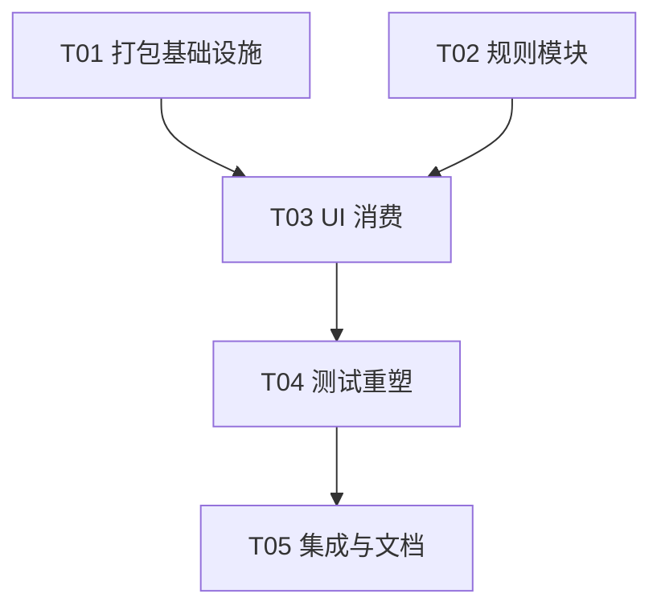

# Issue #504 架构设计：Picker 与 Plaza 统一消费货架规则并删除死入口

- 日期：2026-09-07
- 作者：Gao（高见远 / Architect）
- 范围：`plugins/omnimux-market` 客户端 concat factory、`skill-picker-logic` 单一规则模块、Picker / Plaza / Plaza Shell
- 前置：#540 已合入；#497 货架 v1 与对拍守卫已落地；#628 电商关键词与 Plaza `skillhub` 渠道已作为本 Issue 评论区挂载（commit `62edd8e`）
- 风险：R2（单插件）；行为面：电商兜底召回变宽、Plaza 有 query 时多打 `skillhub`
- 落盘：主仓 `docs/` 门禁拦截，本文在 `.workbuddy/`。**不得覆盖**仓库根 `docs/system_design.md`（视频节点弹层旧规格）。实施 worktree 内可迁到 `docs/design/2026-09-issue-504-shelf-unify.md`。
- 本方案取代 `docs/design/2026-09-skill-shelf-filter-design.md` **§1.3 方案 (b)**（内联副本 + 源码正则对拍）。

配套图：

- `.workbuddy/issue-504-class-diagram.mermaid`
- `.workbuddy/issue-504-sequence-diagram.mermaid`

---

# Part A: 系统设计

## 1. 实现途径

### 1.1 问题与约束（已核实）

| 难点 | 现状 | 本 Issue 约束 |
| --- | --- | --- |
| 官方客户端只认单 factory | `scripts/concat-client.mjs` 按固定顺序拼接 `src/client/` 20 个 fragment，esbuild `bundle: true` + `format: 'cjs'`，外包 `window.__ModuleLoader__.load` | **保留 concat 架构**，禁止多 chunk / 运行时相对 `require` |
| 规则双份 | `skill-picker.js` 与 `skill-plaza.js` 各自硬编码 `SKILL_SHELF_TAGS` / 标签文案 / `matchesDomainTag` / `inShelf`；`skill-picker-logic.js` 已是测试可 import 的 ESM 真源，但 **未进 FRAGMENTS、未被 UI 运行时引用** | UI **禁止再维护常量副本**；运行时与单测必须打同一模块 |
| 构建 resolveDir | 当前 `stdin.resolveDir = root`（插件根）。相对路径 `./skill-picker-logic.js` 会解析到插件根而非 `src/client/` | 改为 `resolveDir = dir`（`src/client`），由 esbuild 把相对依赖 **内联进 factory 闭包** |
| 死入口 | `src/client.js` 2479 行历史全量文件；`tsconfig.include` 仅 `src/**/*.ts`；`package.json` 构建输出 `lib/client.js`。`src/tests/client-bundle.test.ts` 读的是构建后的 `lib/client.js`（相对 `../client.js`） | 删除 `src/client.js`，不得加回构建图 |
| 缓存语义 | Picker UI `rememberPickerSearch` 在 **then 回调**写 `at: Date.now()`；logic 的 `loadPickerSearch` 用请求 **开始** 时的 `now` 写缓存，与 AC「请求完成时起算 TTL」不一致 | 统一为完成时刻起算；in-flight Map 去重保留 |
| #497 否决过「构建期抽取」 | 当时否决 AST/正则注入，改用副本对拍 | 本次用 **esbuild 原生相对依赖打包**，复杂度低于 AST 抽取，允许推翻 §1.3(b) |

非目标：Host `aggregateSkillSearch` 默认三渠道、Plaza 连接器 Tab 恢复、Picker 自身 `channels` 策略、新增 i18n key、拆 concat 为多 bundle。

### 1.2 选定方案：boot 注入命名空间 + esbuild 内联

```
src/client/boot.js
  require("react" | "dsh-ui-kit" | primitives)     ← external，运行时由宿主注入
  require("./skill-picker-logic.js")              ← 相对依赖，esbuild 内联
        ↓
scripts/concat-client.mjs
  FRAGMENTS 仍 20 个（logic 不进拼接表）
  resolveDir: src/client
  bundle: true, format: cjs
        ↓
lib/client.js  单一 factory，无 require("./…")
```

**为何不把 logic 放进 FRAGMENTS**：该文件是 ESM `export`。拼进 factory 会在 CJS 闭包顶层留下 `export`，直接语法失败。它只应作为 **esbuild 解析的相对模块**。

**为何用命名空间而不是解构到顶层绑定**：concat 后全部 fragment 处于同一 function 作用域。`plaza-shell.js` 今天仍声明 `const PLAZA_TABS` 等。若 boot 解构同名 `const`，后段再声明会 SyntaxError。boot 只引入一个标识符：

```js
const SkillShelf = require("./skill-picker-logic.js");
```

后续 fragment 一律 `SkillShelf.SKILL_SHELF_TAGS` / `SkillShelf.filterPickerItems(...)`。允许本地别名指向同一对象，禁止再写数组字面量或平行函数体。

**消除运行时相对 require 的硬保障**：

1. `resolveDir` 必须是 `src/client`，否则 `./skill-picker-logic.js` 解析失败，构建红。
2. `external` 白名单保持 `react` / `react-dom` / `@deepseek-ai/dsh-client-ui-primitives`；**不要**把 `./skill-picker-logic.js` 加进 external。
3. `client-bundle.test.ts` 对 `lib/client.js` 断言：
   - 不匹配 `require(["']\./`
   - 不匹配 `require(["']dsh-ui-kit["'])`（既有）
   - 内含电商扩充词（如 `独立站` / `shopify`）证明 logic 已被内联
4. `FRAGMENTS` 数组不得出现 `skill-picker-logic.js`。

`absWorkingDir` 继续为插件根，npm 包（`react`、`dsh-ui-kit`）仍从插件 `node_modules` 解析。现有 fragment 中仅 `boot.js` / `portal.js` 含 `require(`，且均为包名，改 `resolveDir` 不改变它们的解析。

### 1.3 被否决的替代

| 方案 | 否决理由 |
| --- | --- |
| 维持内联副本 + 加强正则对拍 | 直接违反 AC「严禁分别维护常量副本」 |
| concat 前用正则把 logic 文本插入 boot | 与 #497 否决的 AST/抽取同类，构建链变脆 |
| 多 factory / 运行时再 `require('./x')` | 宿主只认单 blob；AC 禁止运行时相对 require |
| Plaza 与 Picker 共用同一个 cache Map | AC 要求同一套 **规则**，未要求同一缓存实例。Plaza 分页 48 + `api()` L1 缓存；Picker 有独立 inflight。合并缓存会串 key/TTL/分页 |

---

## 2. 文件清单（相对 `plugins/omnimux-market`，文档相对仓库根）

### 2.1 改动

| 路径 | 动作 |
| --- | --- |
| `scripts/concat-client.mjs` | `resolveDir: dir`；注释写明 logic 不进 FRAGMENTS |
| `src/client/boot.js` | `const SkillShelf = require("./skill-picker-logic.js")` |
| `src/client/skill-picker-logic.js` | 电商 keywords、大小写多字段匹配、Plaza payload、完成时刻 TTL |
| `src/client/skill-picker.js` | 删除规则副本，改调 `SkillShelf.*`；保留面板/手势 UI |
| `src/client/skill-plaza.js` | 删除规则副本；搜索 payload 走 `buildPlazaSearchPayload` |
| `src/client/plaza-shell.js` | 可见/隐藏 Tab 改读 `SkillShelf` |
| `src/client.js` | **删除** |
| `src/client/skill-picker-logic.test.js` | 电商词、大小写、Plaza 渠道、TTL 完成时刻 |
| `src/client/skill-shelf-parity.test.js` | 从「源码对拍副本」改为「禁止副本 + 消费统一模块」 |
| `src/client/workbench-seat.test.js` | 去掉 `PLAZA_SHELF_TAGS` / 写死双渠道为唯一合法串 |
| `src/tests/client-bundle.test.ts` | 无相对 require；内联 keywords；无 `src/client.js` 依赖 |
| `docs/design/2026-09-skill-shelf-filter-design.md` | §1.3 改为指向本方案（在实施 worktree 内改） |
| `README.md`（插件） | 若仍暗示单体 `src/client.js` 则改成 fragment + concat |

### 2.2 保持不动（行为依赖）

- `src/client/api.js`：Plaza / Marketplace 的 `API_CACHE_TTL_MS` 与 `apiCache`（请求成功后写 `at`）
- `src/client/apply.js`、`connectors.js`、`i18n.js`（无新文案键）
- `src/skill-aggregate.ts`：Host 默认三渠道不改；Plaza UI 显式传 `channels` 即可
- `FRAGMENTS` 20 项顺序不变

---

## 3. 数据结构与接口

单一模块 `skill-picker-logic.js` 继续 ESM 导出，供 node:test `import`；经 esbuild 转为 CJS 后挂在 factory 的 `SkillShelf`。

见 `.workbuddy/issue-504-class-diagram.mermaid`。

### 3.1 Taxonomy（电商扩充）

`SKILL_SHELF_TAXONOMY` 顺序不变。仅「电商」keywords 从 `['电商']` 改为：

```js
{ id: '电商', labelKey: 'picker.tab.ecom', keywords: Object.freeze(['电商', '独立站', '跨境', 'shopify', '选品']) }
```

其余 8 类仍为 `keywords: [id]`。短英文词（`ad`、`music`）不得进入词表。

`PICKER_TABS` 补齐 `labelKey`（`picker.tab.all|mine|featured` + 各 `row.labelKey`），UI 不再维护 `PICKER_TAB_LABELS` / `SKILL_SHELF_LABELS`。

### 3.2 匹配（大小写不敏感、多字段）

字段集合保持：`category`、`categoryLabel`、`name`、`title`、`description`、`summary`、`tags`（join）。

```
matchesDomainTag(item, tag):
  无 item 或无 tag → true（与现状一致，便于「未选分类」）
  L1: item.tags 字符串化后 includes(taxonomy id) → true
  L2/L3: haystack 小写 包含 keywordsForTag(tag) 中任一词的小写形式
keywordsForTag(tag):
  命中 taxonomy 行 → 该行 keywords
  未知分类 → [tag]   // 保留「未知 Plaza 分类」按字面过滤，不落入「其他」桶、不崩
```

`inSkillShelf`：L1 命中任一货架 id，或对任一货架 id 的 keywords 命中。未命中 **隐藏**（无「其他」）。

`filterPickerItems` 语义不变：

- `mine`：`installed === true`，不过滤货架
- `tag`：货架 ∩ `matchesDomainTag(id)`
- `all` / `featured`：货架全集（featured 的渠道收窄在 payload，不在客户端再滤 channel）

`filterPlazaShelf(items, tag)`：**委托** `filterPickerItems(items, tag || 'all')`，禁止第二套 haystack。未知 `tag`（不在 `PICKER_TABS`）时 **不要** 退回 `all`；走 `matchesDomainTag` 的「未知 → [tag]」分支，与今日 `hay.includes(tag)` 等价（再加大小写折叠）。

实现注意：`filterPickerItems` 对未知 tabId 今日会 `|| PICKER_TABS[0]`（all）。因此 `filterPlazaShelf` **不能**简单把未知 tag 传进 `filterPickerItems`。正确形状：

```js
export function filterPlazaShelf(items, tag) {
  const list = Array.isArray(items) ? items : []
  const shelf = list.filter((it) => inSkillShelf(it))
  const key = String(tag || '').trim()
  if (!key) return shelf
  return shelf.filter((it) => matchesDomainTag(it, key))
}
```

### 3.3 Plaza 查询渠道

```js
PLAZA_DEFAULT_CHANNELS = ['custom', 'workbuddy']
PLAZA_QUERY_CHANNELS   = ['custom', 'workbuddy', 'skillhub']

buildPlazaSearchPayload(submitted, category, page = 1, pageSize = 48):
  q   = trim(submitted)
  cat = trim(category)
  query = cat ? (q ? `${q} ${cat}` : cat) : q
  channels = q ? PLAZA_QUERY_CHANNELS : PLAZA_DEFAULT_CHANNELS
  // 仅用户提交词决定是否打 skillhub；分类浏览（q 空、cat 有值）保持默认双渠道
  return { query, limit: pageSize, offset: (page-1)*pageSize, channels }
```

Picker `buildSearchPayload` **不改渠道**：`featured → ['custom']`，其余不设 `channels`。AC 只扩 Plaza。

### 3.4 缓存 / inflight / 手势（保留并收口）

| 行为 | 真源 | UI 仍拥有 |
| --- | --- | --- |
| TTL 90s，**完成时刻**写 `at` | `loadPickerSearch` 在 `fetchSearch` resolve 内 `Date.now()`（测试可注入时钟，但必须在 then 内读取，禁止闭包捕获起始时刻） | `pickerSearchCache` / `pickerSearchInflight` 两个 Map 实例 |
| in-flight 去重 | 同 key 复用 pending Promise；settle 时 `inflight.delete` | 同上 |
| 缓存命中不重置 activeIndex | `fromCache` 标志 | Panel `useEffect` |
| 手势 `/slug `、draft 拼接、安装 payload | `skillGesture` / `appendSkillGesture` / `installPayload` | `setDraft`、`focusComposerCard`、`api("install")` |
| Plaza intent | `writePlazaIntent` / `consumePlazaIntent`；隐藏 Tab 写入回落 `skills`，读到隐藏 Tab 得 `null` | Picker 额外 `CustomEvent`；Shell 监听 |
| 连接器隐藏 | `PLAZA_HIDDEN_TABS = ['connectors']` | Shell Tab 栏 `includes` 守卫，恢复时只清数组 |
| Plaza `api()` 软缓存 | `api.js` 成功后写 `at`（已是完成时刻） | 不改 |

`loadPickerSearch` 写入伪代码：

```js
const started = opts && typeof opts.now === 'number' ? opts.now : Date.now()
const pending = Promise.resolve(fetchSearch(payload)).then((body) => {
  const at = typeof opts.completedAt === 'function' ? opts.completedAt() : Date.now()
  writePickerCache(cache, key, body, at)
  inflight.delete(key)
  return body
}, (err) => { inflight.delete(key); throw err })
```

禁止 `writePickerCache(..., started)`。单测可用延迟 fetch + 注入 `completedAt` 证明 `at` 不等于请求开始时刻。

---

## 4. 程序调用流

见 `.workbuddy/issue-504-sequence-diagram.mermaid`（Picker 搜索、Plaza 渠道、concat 内联三段）。

要点：

1. Picker：`buildSearchPayload` → `peekPickerCache` → 未命中则 `loadPickerSearch`（inflight 去重）→ 完成时刻写 cache → `filterPickerItems`。
2. Plaza：`buildPlazaSearchPayload`（有 submitted 才带 skillhub）→ `api("search")` → `filterPlazaShelf`（未知分类字面过滤，非货架隐藏）。
3. 构建：20 fragments + `resolveDir=src/client` → esbuild 内联 logic → `lib/client.js` 无 `require("./")`。

---

## 5. 不明事项与假定

| 项 | 假定（可执行） | 若推翻 |
| --- | --- | --- |
| 「有 query」指用户 `submittedQuery`，不是注入的分类词 | 仅分类浏览不打 skillhub | 分类浏览也会打三渠道，需改 `buildPlazaSearchPayload` |
| Picker 渠道不跟随 Plaza | 保持 featured=`custom`、其余默认 | 另开 Issue |
| 仅电商扩充 keywords | 其余类 `[id]` | 误命中评估另单 |
| `src/client.js` 无运行时引用 | 删除；bundle 测试改盯 `lib/client.js` | 若发现外部文档链到该文件，只改文档 |
| Plaza 不共用 Picker inflight | `api.js` 缓存已满足完成时刻 TTL | 不把 Plaza 迁到 `loadPickerSearch`（分页/key 不同） |
| L2：电商匹配与 Plaza 三渠道是用户可见行为 | 合入前独立 L2 + ego-browser 共享探针，合入后 Dev 物化 | 纯构建删除若与行为拆 PR 可降为单测，但本 Issue 绑在一起 |

---

# Part B: 任务分解

## 6. 所需包

无新依赖。沿用：

```
- esbuild@^0.25.0: 相对模块内联进 factory
- react@^18 / react-dom@^18: 宿主 external
- dsh-ui-kit (file:): 已打包进 blob
- typescript@^5.9 / node:test (Node >=22): 现有测试
```

## 7. 任务列表（依赖序，硬上限 5）

### T01 项目基础设施（打包契约 + 死入口）

- **文件**：`scripts/concat-client.mjs`，`src/client/boot.js`，`src/client.js`（删），`src/tests/client-bundle.test.ts`
- **依赖**：无
- **优先级**：P0
- **内容**：
  - `resolveDir` 改为 `dir`（`src/client`）
  - `boot.js` 增加 `const SkillShelf = require("./skill-picker-logic.js")`（logic 暂可仍是当前导出，UI 尚未切换也能构建）
  - **禁止**把 `skill-picker-logic.js` 写入 `FRAGMENTS`
  - 删除 `src/client.js`
  - bundle 测试：`lib/client.js` 无 `require("./`；仍是单 ModuleLoader；`SearchField` / 既有 slot key 仍在
- **验收**：`node scripts/concat-client.mjs` 成功；`pnpm --filter omnimux-market test` 在 UI 未切消费前应仍绿（parity 仍读 UI 内联副本）

### T02 单一货架规则模块

- **文件**：`src/client/skill-picker-logic.js`，`src/client/skill-picker-logic.test.js`，`docs/design/2026-09-skill-shelf-filter-design.md`
- **依赖**：无（可与 T01 并行；不依赖 concat）
- **优先级**：P0
- **内容**：
  - 电商 keywords 五词；`keywordsForTag` / 大小写 haystack
  - `PICKER_TABS[].labelKey`；`filterPlazaShelf`（未知 tag 不回落 all）；`buildPlazaSearchPayload` + 渠道常量
  - `loadPickerSearch`：缓存写入时刻改到 then 内
  - 单测：Shopify/SHOPIFY 命中电商；`选品` 命中 description；未知 tag 字面过滤；`submitted` 空/非空渠道；TTL 用完成时刻
  - 设计文档 §1.3 改为「esbuild 内联，禁止 UI 副本」，指向本文件
- **验收**：logic 单测覆盖上述边界；taxonomy 顺序与 freeze 不变

### T03 Picker / Plaza / Shell 消费统一模块

- **文件**：`src/client/skill-picker.js`，`src/client/skill-plaza.js`，`src/client/plaza-shell.js`
- **依赖**：T01，T02
- **优先级**：P0
- **删除**：`SKILL_SHELF_TAGS`、`PICKER_TAB_LABELS`、`PLAZA_SHELF_TAGS`、`SKILL_SHELF_LABELS` 字面量；`pickerMatchesTag` / `pickerInShelf` / `pickerFilterItems` / `pickerSearchPayload` / 手势与 cache 的平行实现；Plaza `plazaShelfItem` / `plazaFilterShelf` / 写死 `channels`
- **保留**：Panel 布局、debounce effect、键盘、portal 定位、图标、`pickerSearchCache` 实例、`writePlazaSkillsIntent` 的 CustomEvent、Plaza 分页/ratings/Drawer、Shell 工作台绑定与连接器守卫
- **接线**：
  - Picker：`SkillShelf.buildSearchPayload` / `loadPickerSearch({ cache, inflight, fetchSearch: (p) => api("search", p) })` / `filterPickerItems` / `skillGesture` / `appendSkillGesture` / `installPayload` / `CREATE_SKILL` / `PICKER_TABS` / `PICKER_DEBOUNCE_MS`
  - Plaza：`SkillShelf.buildPlazaSearchPayload` + `filterPlazaShelf`；分类按钮 `SkillShelf.SKILL_SHELF_TAGS` + taxonomy `labelKey`
  - Shell：`SkillShelf.PLAZA_TABS` / `PLAZA_HIDDEN_TABS` / `consumePlazaIntent(sessionStorage)`
- **验收**：三文件无货架 id 数组字面量；功能路径只引用 `SkillShelf`

### T04 测试重塑

- **文件**：`src/client/skill-shelf-parity.test.js`，`src/client/workbench-seat.test.js`，`src/tests/client-bundle.test.ts`
- **依赖**：T03
- **优先级**：P0
- **parity 演进**：
  - 删除「解析 UI 内联数组 === taxonomy」
  - 断言 picker/plaza **不**匹配 `const SKILL_SHELF_TAGS` / `const PLAZA_SHELF_TAGS` / 九标签字面量数组
  - 断言两文件含 `SkillShelf.` 且 `boot.js` 含 `require("./skill-picker-logic.js")`
  - 行为级：同一 fixture 只打 `filterPickerItems` / `filterPlazaShelf`（已是同一实现）
  - plaza-shell：禁止第二份 `["connectors"]` 作为独立真源；允许 `SkillShelf.PLAZA_HIDDEN_TABS`；守卫仍含 `includes("connectors")` 或等价循环
- **workbench-seat**：Plaza 不再要求 `PLAZA_SHELF_TAGS` 标识符；渠道断言改为消费 `buildPlazaSearchPayload` 或匹配 `SkillShelf.PLAZA_` 常量名，而不是写死 `["custom", "workbuddy"]` 为唯一合法串（有 query 时必须出现 `skillhub`）
- **bundle**：内联 `shopify`/`独立站`；无相对 require
- **验收**：故意在 UI 写回标签数组则 parity 红；故意把 logic 标 external 则 bundle 红

### T05 集成验证与风险防护

- **文件**：`plugins/omnimux-market/README.md`，实施 worktree 内 `docs/design/2026-09-issue-504-shelf-unify.md`（从本文迁入），`docs/design/2026-09-skill-shelf-filter-design.md`（交叉链接）
- **依赖**：T04
- **优先级**：P1
- **内容**：README 构建说明与死入口删除一致；全量 `pnpm --filter omnimux-market test`；UI 行为走独立 L2 + 共享 probe（电商：描述含 Shopify 的未打标 skill 出现在电商 Tab；Plaza 提交检索后 payload 含 skillhub，清空后恢复双渠道；连接器 Tab 仍隐藏）；合入后 Dev 物化 `omnimux-market`
- **验收**：测试基线（当前 295）只允许因断言改写而调整，禁止无故删用例；L2 证据绑定当前 worktree commit

## 8. 共享约定（Frontend 实施；无 Backend 任务）

- 无新 HTTP 合同。`POST` `method=search` 已支持 `channels?: ('custom'|'workbuddy'|'skillhub')[]`。
- Host 聚合逻辑不改；缺 `channels` 时仍用配置默认三渠道。Plaza **必须显式传** `channels`，否则空 query 会误打 skillhub。
- 客户端规则模块是 **唯一** taxonomy / 过滤 / Plaza 渠道 / Picker 手势真源。
- 工作流：**标准 isolated worktree**，不要快速无人值守。R2 且含用户可见行为（电商匹配、Plaza 三渠道），需要 L2 + ego-browser 共享探针；`pnpm auto:run` 还要求 `pre-authorized` + `/auto-approve`。命令：`pnpm wt:start omnimux-market shelf-unify 504` 或 `bash scripts/git-wt.sh start omnimux-market shelf-unify 504`。T01∥T02 完成后才许 T03。主工作区保持干净 `main`。合入后 `pnpm sync omnimux-market` 物化 `~/.omnimux-dev`。

## 9. 任务依赖图



## 10. 风险防护清单

1. **构建失败**：`resolveDir` 仍停在 root → 相对文件找不到。T01 先独立验证 `node scripts/concat-client.mjs`。
2. **作用域冲突**：boot 解构同名 const。只允许 `SkillShelf` 一个绑定。
3. **TTL 回退**：误把 `now` 关进 fetch 前闭包。单测必须证明完成时刻。
4. **渠道回退**：UI 漏传 `channels` 导致空浏览打三渠道。Plaza 必须调用 `buildPlazaSearchPayload`。
5. **对拍测试假绿**：只改注释仍解析旧数组。T04 改为「禁止出现副本」。
6. **误删手势/缓存实例**：T03 不得把 `pickerSearchCache` 做成新抽象；保持 fragment 内 Map。
7. **连接器露出来**：Shell 守卫继续读 `PLAZA_HIDDEN_TABS`。
8. **合入未物化**：运行时变更，main fast-forward 后必须 `pnpm sync omnimux-market`（或 `sync-to-app.sh`）进 `~/.omnimux-dev`。
9. **未知 Plaza 分类**：`filterPlazaShelf` 不得把未知 tag 交给 `filterPickerItems` 的 all 回落。
