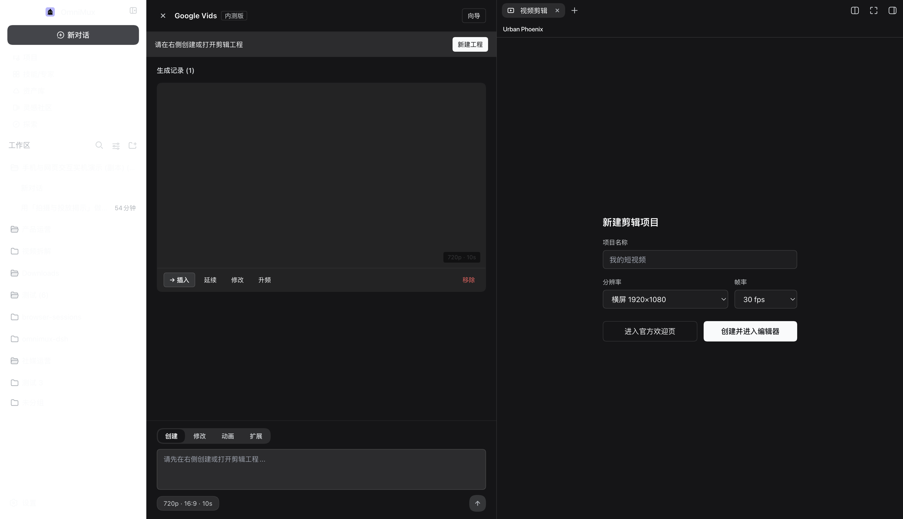

# Google Vids center-column geometry (#2739)

- pass: **True**
- base: `{"stage": "omnimux-vids", "left": {"w": 279, "x": 0}, "vids": {"w": 670, "x": 280}, "right": {"w": 778, "x": 950}, "covers": false, "overlap": 0, "pos": "fixed", "cssW": "670px"}`
- afterCollapse: `{"left": {"w": 0, "x": 0}, "vids": {"w": 670, "x": 0}, "right": {"w": 1058, "x": 670}, "overlap": 0, "cssW": "670px"}`
- afterExpand: `{"left": {"w": 279, "x": 0}, "vids": {"w": 670, "x": 280}, "right": {"w": 778, "x": 950}, "overlap": 0}`

