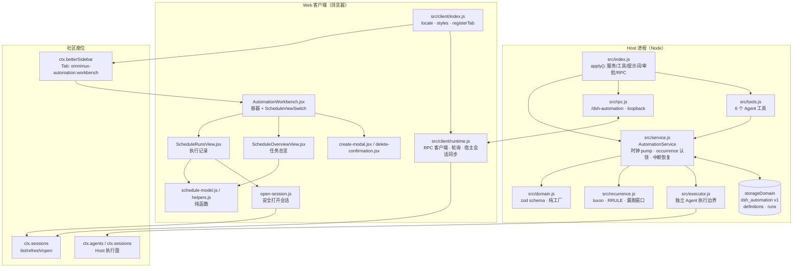
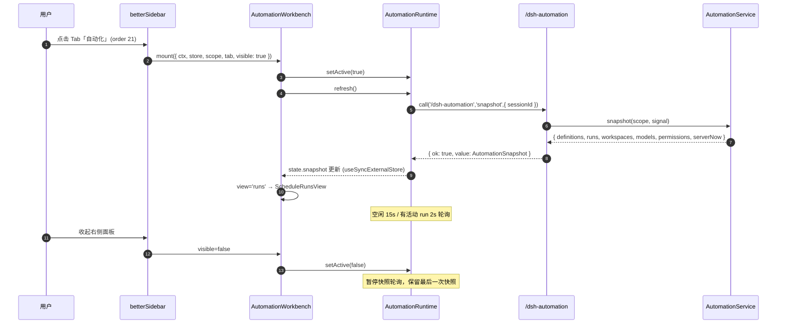
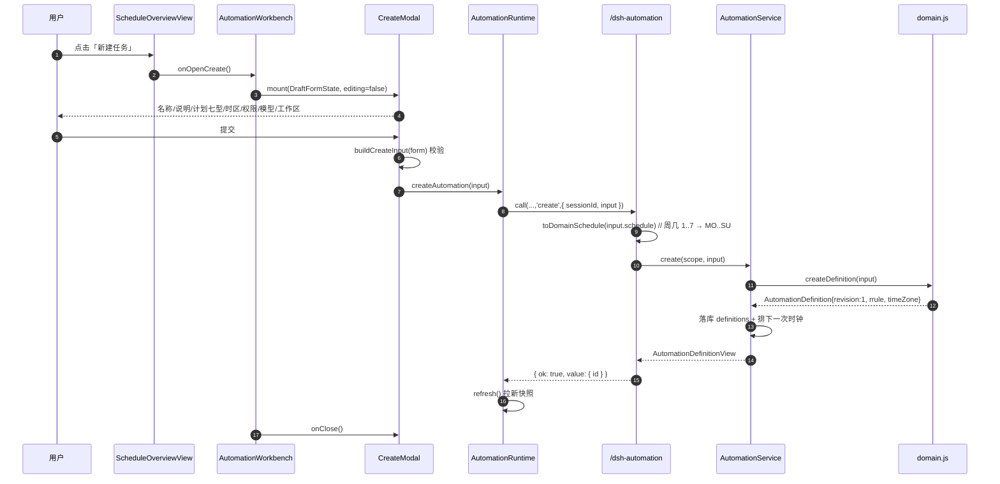
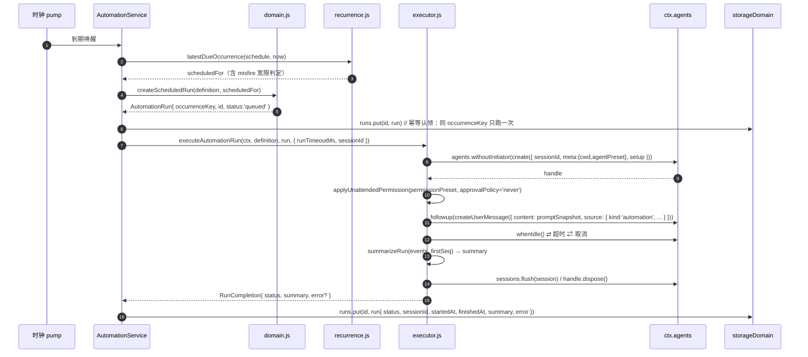
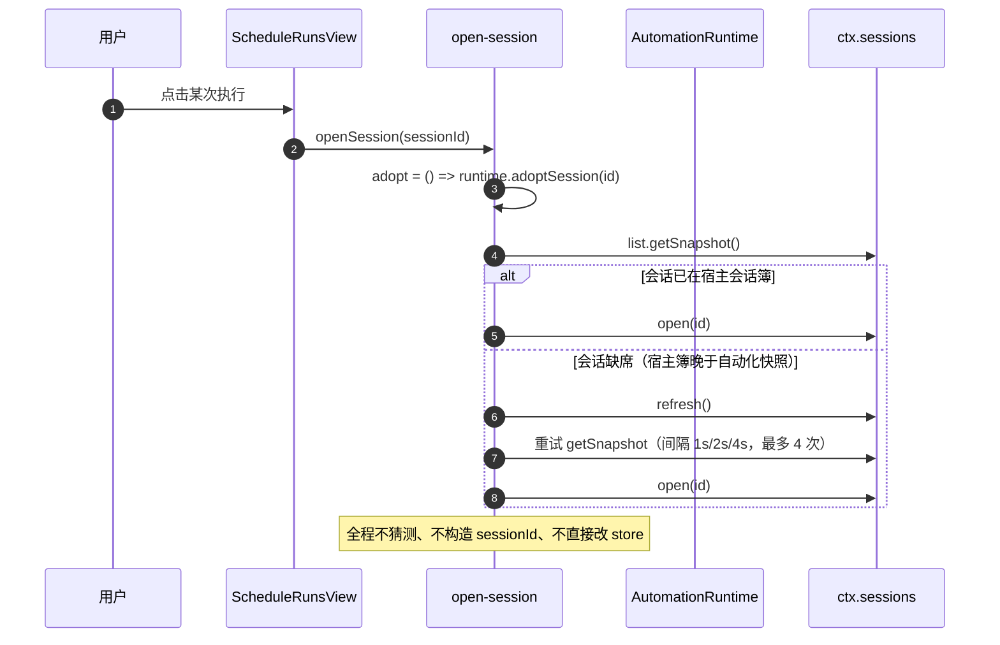
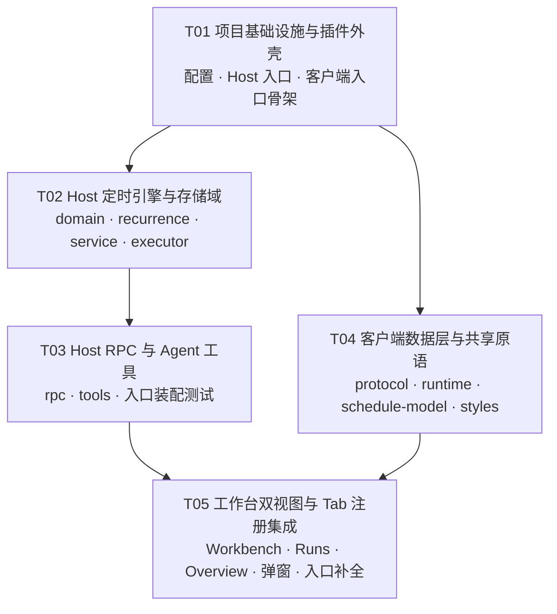

# OmniMux 自动化 · 系统架构设计

上游基线：`/tmp/dsh-automation-upstream`（`omnimux-ai/dsh-automation` 主线 v0.1.40，包名 `@michengai/dsh-automation`）
目标插件：`plugins/omnimux-automation`（显示名「自动化」）

本文接受的是架构、接口契约与任务分解，不代表代码、测试或运行验收已完成。

---

## Part A：系统设计

## 1. 实现方式与决策

### 1.1 核心难点

| # | 难点 | 结论 |
|---|---|---|
| D1 | 上游 Host 侧是 TypeScript，OmniMux 插件全线是原生 ESM JS | **Host 侧 TS → JS 移植**，不引入 tsc 构建。客户端保留 JSX，由 esbuild 打成 `lib/client.js`。理由：`scripts/live-stage-contracts.mjs` 直接从 `plugins/<p>/src/client/index.js` 用 esbuild 打包执行；`verify-package-files` 的白名单以 `src` 为运行时真源；引入 TS 会凭空多出构建期与 `files` 白名单的第二真源。 |
| D2 | 上游依赖 `zod`（域 schema）与 `luxon`（IANA 时区/DST 计算） | **保留为运行时依赖**，不重写。理由：时区与 DST 数学是正确性敏感面，`recurrence.js` 的 `nextOccurrence/latestDueOccurrence/occurrencesBetween` 必须与既有落库数据逐位一致；`domain.js` 的 `superRefine`（`timeZone` 必须等于 `schedule.timeZone`、`rrule` 必须由 `schedule` 推导）是数据完整性闸门。重写等于用自研实现替换已被上游回归测试覆盖的逻辑，违反「复用优于发明」。两个库均为纯 JS、零传递依赖。 |
| D3 | 上游客户端把定时任务**包装/劫持左侧任务树**（`sidebar.workspaces` + `NativeScheduleShell` + DOM 文本匹配设置按钮） | **整条链路作废**。改为唯一一座：`ctx.inject(['betterSidebar'], …)` + `sidebar.registerTab({ id: 'omnimux-automation:workbench', order: 21 })`。左侧零侵入，不注册任何 slot，不写 `data-dsh-product-stage`，不 claim overlay。 |
| D4 | 存储域兼容 | `storageDomain` 域规格**逐字段不变**：`name: "dsh_automation"`、`version: 1`、表 `definitions` / `runs`。老用户升级后任务定义与执行历史原样可读。 |
| D5 | 上游 `service.ts` 有 1352 行且含时钟 pump、并发认领、中断恢复、会话对账 | **整文件移植，不重构**。本期目标是「换座位、不换引擎」。任何引擎侧行为改动都必须单独评审。 |
| D6 | 客户端轮询在右侧面板收起时仍空转 | 利用社区 `TabComponentProps.visible`（「当前 Tab 激活 **且** 面板打开」）门控轮询：`visible=false` 时把 runtime 切到低频/暂停。这是本次唯一新增的客户端能力。 |
| D7 | 上游靠 `/api/michengai/dsh-automation/update` 回连外部厂商域名做版本检查 | **整体退役**：`plugin-updater.ts`、`plugin-update-ui.ts`、更新图标 SVG 表、`github-links` 及其测试与样式全部不移植。 |

### 1.2 关键端口与座位（已核实）

| 事实 | 证据 |
|---|---|
| 右侧工作台 Tab 只有一个座位 | `docs/contracts/workbench-split.md`：一级应用统一 `ctx.betterSidebar.registerTab`，**MUST NOT** claim `data-dsh-product-stage` |
| `registerTab(descriptor) => disposer` | `dsh-better-sidebar@0.18.0` `lib/types/client/service.d.ts:318` |
| descriptor 字段 | 同文件 `:141` `TabDescriptor` = `{ id, title, icon, order?, hidden?, available?, single?, dedupeKey?, createTab?, urlTarget?, settings?, badge?, onOpen?, onActivate?, onClose?, component }` |
| 组件收到的 props | 同文件 `:123` `TabComponentProps` = `{ ctx, store, scope, tab, visible, … }` |
| 已有 Tab 位序 | assets/studio `15`、products `16`、accounts `17`、forms `19`、analytics `20` → 本插件 `21` 无冲突 |
| 依赖注入形态 | `plugins/omnimux-accounts/src/client/index.js:87`：`ctx.inject(['betterSidebar'], inner => { const sidebar = inner.betterSidebar ?? inner.get?.('betterSidebar'); ctx.effect(() => sidebar.registerTab({…}), label) })` |
| 工作台全局桥 | `plugins/omnimux/src/client/workbench.js:83` `__omnimuxWorkbench`，提供 `bind/ open/ closePanel/ isActive/ setFocus` |
| Host 会话打开契约 | `ctx.sessions.list.getSnapshot()/refresh()/open(id)`（客户端）；`ctx.sessions.flush(session)`（Host） |
| 离线装配检查的 ctx 形状 | `scripts/live-stage-contracts.mjs:64-95`（六个 sidebar 方法 + disposer） |

### 1.3 方案对比

| 选项 | 收益 | 代价 / 决策 |
|---|---|---|
| A：右侧 betterSidebar Tab（本期采用） | 与套件其余一级应用同构；对话与工作台并存；左侧零侵入；上游 Host 引擎零改动 | 需依赖社区 `dsh-better-sidebar`；缺该服务时不注册 Tab（不降级到 overlay/details） |
| B：保留左侧任务树包装 | 复用官方任务树视觉 | 依赖官方内部组件形状与 DOM 结构，官方一改即碎；与 `workbench-split` 契约冲突。**否决** |
| C：官方设置页 section（上游现状之一） | 不动布局 | 与「右侧工作台」产品定位不符；设置页已被本次架构取代。**否决** |
| D：HTTP prefix 路由取代 `connection.rpc` | 与 forms 一致 | 需要自建鉴权与同源校验，重复官方 RPC 安全面；上游 RPC 通道已有 `authority: 'loopback'` + 会话取消语义。**否决**，保留 `connection.rpc` |

---

## 2. 文件清单

路径相对本仓库根（`plugins/omnimux-automation/`）。

### 2.1 完整结构树

```
plugins/omnimux-automation/
├── package.json                     # 包声明：exports / scripts / dsh.bundle.patch / dsh.client.inject
├── cordis.patch.yml                 # 插件挂载声明：- insert: [{ id: omnimux-automation, name: omnimux-automation }]
├── dsh.manifest.json                # 注册表清单：tier-1-app / slots / storageDomains / requiredPlugins
├── .gitignore                       # 忽略 lib/、node_modules/
├── README.md                        # 插件说明（中文，含座位与工具清单）
├── scripts/
│   └── build-client.mjs             # esbuild → lib/client.js，__ModuleLoader__ 包装
└── src/
    ├── index.js                     # ★ Host 入口：name/inject/Config/apply（服务、工具、提示词、审批、RPC）
    ├── types.js                     # JSDoc typedef 真源（无运行时导出）
    ├── domain.js                    # zod schema + automationDomainSpec + 定义/运行纯工厂
    ├── domain.test.js
    ├── recurrence.js                # luxon：计划校验/归一/RRULE/下一次与漏跑窗口
    ├── recurrence.test.js
    ├── service.js                   # AutomationService：持久化、occurrence 认领、时钟、执行调度
    ├── service.test.js
    ├── executor.js                  # 单次 run 的独立 Agent 执行边界（超时/取消/摘要）
    ├── executor.test.js
    ├── rpc.js                       # loopback RPC 通道 /dsh-automation
    ├── rpc.test.js
    ├── tools.js                     # 6 个 Agent 工具注册
    ├── tools.test.js
    ├── prompt.js                    # 系统提示词段落 + automation_create 描述 + 意图判定
    ├── prompt.test.js
    ├── permission-presets.js        # 权限预设名归一（含 full-access → danger-full-access 兼容）
    ├── permission-presets.test.js
    ├── run-title.js                 # 运行时间戳与会话标题（Host 与客户端共用）
    ├── run-title.test.js
    ├── index.test.js                # 入口装配：inject 列表、工具挂载生命周期、审批门、清理幂等
    └── client/
        ├── index.js                 # ★ 客户端入口：locale、样式、runtime、betterSidebar Tab 注册
        ├── AutomationWorkbench.jsx  # ★ 容器：常驻 ScheduleViewSwitch + 双视图 + 弹窗挂载点
        ├── ScheduleRunsView.jsx     # ★ 执行记录视图（按任务分组的历史执行会话）
        ├── ScheduleOverviewView.jsx # ★ 任务总览视图（任务卡片 + 启停/立即运行/编辑/删除）
        ├── create-modal.jsx         # 新建/编辑任务弹窗（面板内无缝弹出）
        ├── delete-confirmation.jsx  # 删除二次确认
        ├── runtime.js               # RPC 客户端 + 轮询 + 宿主会话同步
        ├── runtime.test.js
        ├── protocol.js              # 客户端/Host 共享 JSON 契约 + unwrapRpcResult
        ├── schedule-model.js        # groupScheduledSessions / deriveTaskOverviewRows / toggle 映射
        ├── schedule-model.test.js
        ├── open-session.js          # createScheduledSessionOpener（安全打开执行会话）
        ├── open-session.test.js
        ├── helpers.js               # 计划格式化、相对时间、排序、历史分组、表单态
        ├── helpers.test.js
        ├── locales.js               # zh / en 词条
        ├── permissions.js           # 权限标签与 full-access 二次确认判定
        ├── icons.jsx                # 图标集（含工作台时钟+机器人图标）
        ├── menu.jsx                 # 下拉/选择原语（create-modal 使用）
        ├── sort-menu.jsx            # 排序菜单（总览使用）
        ├── styles.js                # injectAutomationStyles() + OmniMux 暗黑极简 CSS
        └── render.test.js           # 渲染级门禁：esbuild + jsdom 挂载真实 AutomationWorkbench
```

### 2.2 职责与来源对照

| 文件 | 职责 | 来源 |
|---|---|---|
| `src/index.js` | 插件生命周期：打开服务、给 root Agent 挂工具、注册提示词段落、`tools/pre-execute` 审批门、注册 RPC、Loader 就绪后启动时钟、幂等清理 | 移植上游 `src/index.ts`，**删除** `registerPluginUpdater` |
| `src/types.js` | `AutomationDefinition` / `AutomationRun` / `AutomationSchedule` 等 typedef | 移植 `src/types.ts`（去 TS 语法） |
| `src/domain.js` | 域规格 + 定义/运行的构造、更新、暂停/恢复、删除计划、occurrenceKey/runId | 逐字移植 `src/domain.ts` |
| `src/recurrence.js` | `assertValidSchedule` / `normalizeSchedule` / `isEqualSchedule` / `scheduleToRRule` / `nextOccurrence` / `latestDueOccurrence` / `occurrencesBetween` | 逐字移植 `src/recurrence.ts` |
| `src/service.js` | `AutomationService.open/start/dispose`、`snapshot`、`create/update/delete`、`runNow`、`markRead`、`adoptSession/forgetSession/forgetAutomationSessions`、`ownsSession`、`permissionNames/Options/defaultPermission`、`reconcileMissingSessions`、中断恢复、历史裁剪、权限预设迁移、技能目录扫描 | 逐字移植 `src/service.ts` |
| `src/executor.js` | `executeAutomationRun`、`summarizeRun`、`readSessionEvents`、`applyUnattendedPermission`、`pinAutomationSessionTitle`、`settlesWithin` | 逐字移植 `src/executor.ts` |
| `src/rpc.js` | `registerAutomationRpc(ctx, service)`，通道 `/dsh-automation`，`authority: 'loopback'` | 逐字移植 `src/rpc.ts` |
| `src/tools.js` | `registerAutomationTools(service, agent)`：`automation_create` / `automation_list` / `automation_update` / `automation_runs` / `automation_run_now` / `automation_delete` | 逐字移植 `src/tools.ts` |
| `src/prompt.js` | `AUTOMATION_PROMPT_NAME/ORDER/TEXT`、`AUTOMATION_CREATE_DESCRIPTION`、`shouldUseAutomationCreate` | 逐字移植 `src/prompt.ts` |
| `src/run-title.js` | `formatRunStamp(iso, timeZone?)`、`automationSessionTitle(name, iso, tz)` | 逐字移植 `src/run-title.ts` |
| `src/permission-presets.js` | `normalizePermissionPreset(input, names)` | 逐字移植 `src/permission-presets.ts` |
| `src/client/index.js` | `name/inject/apply`：`locale.register`、`injectAutomationStyles`、`createAutomationRuntime(ctx.connection.rpc)`、`installAutomationSessionSync`、`ctx.inject(['betterSidebar'])` → `registerTab`、`__omnimuxWorkbench.bind` | **重写**；上游同文件左侧包装逻辑全删 |
| `src/client/AutomationWorkbench.jsx` | 容器：顶部常驻 `ScheduleViewSwitch`（执行记录 ⇄ 任务总览）、视图切换状态、新建/编辑/删除弹窗挂载、`visible` 门控 | **新增**（合并上游 `ScheduleRail` 的视图切换壳 + `AutomationView` 的弹窗编排） |
| `src/client/ScheduleRunsView.jsx` | 【执行记录】：`groupScheduledSessions` 分组、状态指示点、执行时间、触发类型（计划/手动）、点击 `openSession` | **新增**（取上游 `NativeScheduleSessionList` 的 runs 分支 + `ScheduleRail` 分组渲染，剥离原生任务/工作区/归档逻辑） |
| `src/client/ScheduleOverviewView.jsx` | 【任务总览】：任务卡片（名称/周期/下次执行）、右上角启停 Switch → `runtime.mutateAutomation(id, 'pause'\|'resume')`、立即运行、编辑、删除（二次确认） | **新增**（取上游 `schedule-overview.tsx` 并补齐卡片操作） |
| `src/client/create-modal.jsx` | 新建/编辑表单：名称、任务说明、计划七型、时区、权限、模型、工作区、技能插入 | 移植上游 `create-modal.tsx` |
| `src/client/delete-confirmation.jsx` | 删除二次确认（Esc 关闭、busy 禁用、`alertdialog` 语义） | 移植上游 `delete-confirmation.tsx` |
| `src/client/runtime.js` | `createAutomationRuntime`：`source.getSnapshot/subscribe`、`refresh/createAutomation/mutateAutomation/updateAutomation/runNow/markRunRead/adoptSession/forgetSession/forgetAutomationSessions`、**新增 `setActive(bool)`** | 移植上游 `runtime.ts`，轮询参数改由 `visible` 驱动 |
| `src/client/protocol.js` | `AutomationSnapshot` / `AutomationViewModel` / `AutomationRunViewModel` / 各请求体 / `unwrapRpcResult` | 逐字移植 `protocol.ts` |
| `src/client/schedule-model.js` | `AUTOMATION_SESSION_PREFIX`、`groupScheduledSessions`、`deriveTaskOverviewRows`、`automationToggleMutation`、`scheduledSessionTitle`、`sessionUpdatedAtIso`、`keepScheduledSessionLink`、`collectScheduledSessionIds`、`isAutomationSidebarSession` | 抽取 `schedule-rail-model.ts` 的**非原生**纯函数 |
| `src/client/open-session.js` | `createScheduledSessionOpener(ctx, runtime)` → `(sessionId) => void`：未列出先 `refresh` 再重试，再 `ctx.sessions.open(id)`，并 `runtime.adoptSession(id)` | 抽取 `schedule-rail-model.ts` 的 `ensureOpenScheduledSession` |
| `src/client/helpers.js` | `formatSchedule` / `formatRelativeTime` / `formatWithin` / `formatDuration` / `clockTime` / `formatRunTrigger` / `sortAutomations` / `groupHistory` / `formFromAutomation` / `defaultFormState` / `buildCreateInput` / 排序偏好读写 | 逐字移植 `helpers.ts`（保留 `groupHistory` 给运行历史用） |
| `src/client/locales.js` | `NS` + `zh` / `en` 词条 | 移植 `locales.ts`，**删除**更新提示与原生任务树词条 |
| `src/client/permissions.js` | `permissionLabel`、`PermissionTranslate` 类型 | 移植 `permissions.ts` |
| `src/client/icons.jsx` | 图标集 + `IconWorkbench`（时钟+机器人） | 移植 `icons.tsx`，去掉未用图标 |
| `src/client/menu.jsx` | `MenuHostProvider/MenuPanel/MenuPopup/MenuRow/MenuSelect/useMenuState` | 移植 `menu.tsx` |
| `src/client/sort-menu.jsx` | `SortMenu` | 移植 `sort-menu.tsx` |
| `src/client/styles.js` | `injectAutomationStyles()`，CSS 前缀 `dsh-st-` 保留以复用既有视觉，改用 OmniMux token | 移植 `styles.ts` |

### 2.3 退役与删除清单（不得带入本插件）

| 上游文件 | 处置 | 原因 |
|---|---|---|
| `src/plugin-updater.ts` | 删 | 外部厂商域名检查更新 |
| `src/client/plugin-update-ui.ts` | 删 | 同上（更新气泡与样式） |
| `src/client/index.ts` 内 `UPDATE_ICON_PATHS` / `createPluginUpdateIcon` / `observePluginUpdate` 调用 | 删 | 同上 |
| `src/client/native-tabs.ts` | 删 | 左侧任务树 Tab 注入 |
| `src/client/native-session-list.tsx` | 删 | 左侧原生会话列表包装 |
| `src/client/native-session-menu.ts`、`native-group-actions.ts` | 删 | 左侧会话菜单/分组归档动作 |
| `src/client/workspace-toolbar.tsx` | 删 | 左侧树工具栏包装 |
| `src/client/ScheduleRail.tsx` 的 `NativeScheduleShell` / `OfficialTreeGuard` / `slotHasEntries` 分支 | 删 | 官方任务树包裹 |
| `src/client/settings-navigation.ts`、`installSettingsNavIcon` | 删 | DOM 文本匹配设置按钮的脆弱逻辑 |
| `src/client/task-settings-request.ts` | 删 | 与设置页跳转绑定的请求中转 |
| `src/client/AutomationView.tsx` | 删 | 官方设置页 section（已被工作台取代） |
| `src/client/prefill.ts` | 删 | 左侧入口的聊天草稿预填桥，新架构无入口 |
| `src/client/dropdown-menu.tsx` | 删 | 仅被原生会话菜单使用 |
| `src/client/schedule-rail-model.ts` 中原生任务/工作区相关导出 | 删 | 左侧任务树专用 |
| `.github/workflows/*`、`assets/`、`CHANGELOG*`、`README.zh-CN.md`、`NOTICE`、`pnpm-workspace.yaml`、`pnpm-lock.yaml` | 不带入 | 本仓库有自己的 CI / 发布 / 文档体系 |
| `src/client/index.ts` 的 `settings.section`、`sidebar.schedule`、`sidebar.workspaces`、`conversation.input.left` 四处 slot 注册 | 删 | 左侧零侵入：本插件不注册任何 slot |

---

## 3. 数据结构与接口契约

图文件：[class-diagram.mermaid](./class-diagram.mermaid)

### 3.1 存储域（必须逐字兼容）

```js
export const automationDomainSpec = {
  name: 'dsh_automation',
  version: 1,
  tables: {
    definitions: { valueSchema: automationDefinitionSchema },
    runs: { valueSchema: automationRunSchema },
  },
}
```

`AutomationDefinition`（表 `definitions`，主键 `id`）

| 字段 | 类型 | 约束 |
|---|---|---|
| `version` | `1` | 字面量 |
| `id` | string | 非空 |
| `revision` | number | 正整数，任何变更 +1 |
| `maxConcurrentRuns` | number? | 正整数，默认 1 |
| `name` | string | 非空，≤200 |
| `prompt` | string | 非空，≤100000 |
| `status` | `'active' \| 'paused'` | |
| `schedule` | `AutomationSchedule` | 七型判别联合 |
| `rrule` | string | **必须** `=== scheduleToRRule(schedule)` |
| `timeZone` | string | **必须** `=== schedule.timeZone` |
| `workspaceId` / `cwd` / `agentPreset` | string | 非空 |
| `provider` / `model` / `reasoningEffort` | `string \| null` | |
| `permissionPreset` | string | 有效性由服务层按 Host 当前列表校验 |
| `createdBy` | `{ kind: 'agent' \| 'web', sessionId }` | |
| `createdAt` / `updatedAt` | string | 带偏移 ISO-8601 |

`AutomationRun`（表 `runs`，主键 `run_<sha256(occurrenceKey)[0:32]>`）

| 字段 | 类型 |
|---|---|
| `version` / `id` / `automationId` / `automationName?` / `definitionRevision` | `1` / string / string / string? / number |
| `occurrenceKey` | `"<automationId>:<revision>:<scheduledFor ISO>"` 或 `"manual:<id>:<nonce>"` |
| `trigger` | `'schedule' \| 'manual'` |
| `scheduledFor` | ISO-8601 |
| `status` | `'queued' \| 'running' \| 'succeeded' \| 'failed' \| 'skipped' \| 'cancelled'` |
| `promptSnapshot` / `targetSnapshot` | 执行时冻结，不随后续编辑变化 |
| `sessionId` / `startedAt` / `finishedAt` / `summary` / `error` | `string \| null` / `string \| null` / `string \| null` / `string \| null` / `{code,message} \| null` |
| `unread` | boolean |

`AutomationSchedule` 七型：`once{at}` / `interval{everyMinutes,anchor}` / `hourly{minute}` / `daily{time}` / `weekly{weekdays[MO..SU],time}` / `monthly{day,time}` / `custom{everyDays,time}`，每型均带 `timeZone`。

### 3.2 Host ↔ 客户端 JSON 契约（通道 `/dsh-automation`）

统一返回 `{ ok: true, value } | { ok: false, error: { code, message, details } }`；`code ∈ {'bad-request','internal','cancelled'}`。

| endpoint | payload | 成功 `value` |
|---|---|---|
| `snapshot` | `{ sessionId? }` | `AutomationSnapshot` |
| `create` | `{ sessionId?, input: CreateAutomationInput }` | `{ id }` |
| `update` | `{ sessionId?, automationId, input: CreateAutomationInput }` | `{ id, revision }` |
| `mutate` | `{ sessionId?, automationId, mutation: 'pause' \| 'resume' \| 'delete' }` | `{ id, revision }` 或删除计划 |
| `run-now` | `{ sessionId?, automationId }` | `{ runId }` |
| `mark-read` | `{ sessionId?, runId }` | `{ runId, unread }` |
| `adopt-session` | `{ sessionId }` | `{ sessionId }` |
| `forget-session` | `{ sessionId }` | `{ sessionId }` |
| `forget-automation-sessions` | `{ automationId }` | `{ automationId }` |

**周几编码差异（易错点）**：Host 用 `'MO'…'SU'`；RPC 出站转 `1..7`（`toClientSchedule`），入站再转回（`toDomainSchedule`）。客户端表单始终用 `1..7`。

`AutomationViewModel` 关键字段：`id / revision / name / prompt / status / schedule / scheduleSummary / timeZone / permission / maxConcurrentRuns / nextRunAt? / lastRunAt? / lastRunStatus? / workspaceId? / cwd? / provider / model / reasoningEffort / createdAt / updatedAt`。
`AutomationRunViewModel` 关键字段：`id / automationId / automationName / status / trigger / scheduledFor / startedAt? / finishedAt? / sessionId? / summary? / error? / unread?`。
`lastRunStatus` / run `status` 中出现 `'interrupted'`（Host 侧 `error.code === 'host_interrupted'` 的投影）。

### 3.3 客户端工作台接口

**Tab 注册（`src/client/index.js`）**

```js
export const AUTOMATION_TAB_ID = 'omnimux-automation:workbench'

sidebar.registerTab({
  id: AUTOMATION_TAB_ID,
  title: () => t('nav'),                 // 「自动化」
  icon: size => createElement(IconWorkbench, { size }),  // 时钟 + 机器人
  order: 21,
  hidden: false,
  single: true,
  component: props => createElement(AutomationWorkbench, {
    ...props, t, permissionT, modelT, runtime, openSession,
  }),
})
```

**`AutomationWorkbench` props**

```js
{
  t,                       // (key, params?) => string
  permissionT,             // 权限词条翻译
  modelT,                  // 模型词条翻译
  runtime,                 // AutomationRuntime
  openSession,             // (sessionId: string) => void
  visible,                 // TabComponentProps.visible
  ctx, store, scope, tab,  // 社区原样透传（仅供 store/scope 观测，不写）
}
```

**视图状态机**：`view: 'runs' | 'overview'`，本地 `useState`，默认 `'runs'`；胶囊切换只替换内容区，不重挂载容器与弹窗宿主。

**`ScheduleRunsView` props**：`{ t, runtime, groups, openSession, folded, onToggleFold, onMarkRead }`
**`ScheduleOverviewView` props**：`{ t, automations, serverNow, onToggle, onRunNow, onEdit, onDelete }`
**`CreateModal` props**：`{ t, permissionT, modelT, busy, workspaces, models, modelFailures, defaultModel, skills, permissions, defaultPermission, draft?, editing?, onClose, onSubmit }`
**`DeleteConfirmation` props**：`{ target: { id, name } | undefined, t, busy, onCancel, onConfirm }`

**`AutomationRuntime`（客户端）**

```js
{
  source: { getSnapshot(): AutomationClientState, subscribe(listener, { background? }): () => void },
  refresh(): Promise<void>,
  createAutomation(input): Promise<void>,
  mutateAutomation(id, 'pause' | 'resume' | 'delete'): Promise<void>,
  updateAutomation(id, input): Promise<void>,
  runNow(id): Promise<void>,
  markRunRead(runId): Promise<void>,
  adoptSession(sessionId): Promise<void>,
  forgetSession(sessionId): Promise<void>,
  forgetAutomationSessions(automationId): Promise<void>,
  setActive(active: boolean): void,   // 新增：由 TabComponentProps.visible 驱动
}
```

### 3.4 Host 侧核心接口

```js
// src/service.js
class AutomationService {
  static async open(ctx, { runTimeoutMs, misfireGraceMs, historyLimit }): Promise<AutomationService>
  start(): void
  async dispose(): Promise<void>
  ownsSession(sessionId: string, events: readonly SessionEventLike[]): boolean
  permissionNames(): readonly string[]
  permissionOptions(): readonly PermissionOption[]
  defaultPermission(): string
  async snapshot(scope, signal?): Promise<AutomationSnapshot>
  async create(scope, input, signal?): Promise<AutomationDefinitionView>
  async update(scope, id, input, signal?): Promise<AutomationDefinitionView>
  async delete(scope, id, signal?): Promise<DeleteAutomationPlan>
  async runNow(scope, id, signal?): Promise<AutomationRun>
  async markRead(scope, runId, signal?): Promise<AutomationRun>
  async adoptSession(sessionId): Promise<void>
  async forgetSession(sessionId): Promise<void>
  async forgetAutomationSessions(automationId): Promise<void>
  async reconcileMissingSessions(): Promise<void>
}

// src/tools.js
function registerAutomationTools(service, agent): () => void

// src/rpc.js
function registerAutomationRpc(ctx, service): () => Promise<void>

// src/executor.js
function executeAutomationRun(ctx, definition, run, { runTimeoutMs, sessionId, signal? }): Promise<RunCompletion>
```

**Agent 工具（6 个，名称与参数逐字保留）**：`automation_create`、`automation_list`、`automation_update`、`automation_runs`、`automation_run_now`、`automation_delete`。工具 schema 以 `defineTool` 声明，输出 `{ schema: { type: 'json' } }`，统一返回 `{ ok, ... }`，取消时返回 `{ ok: false, code: 'cancelled' }`。

### 3.5 插件配置（`Config`，schemastery）

```js
export const Config = z.object({
  runTimeoutMinutes: z.number().step(1).min(1).max(1440).default(60),
  misfireGraceMinutes: z.number().step(1).min(0).max(10080).default(15),
  historyLimit: z.number().step(1).min(1).max(5000).default(200),
})
```

`inject = ['storageDomain','agents','sessions','workspaceRegistry','agentDefaultModel','agentPresets','permissionPresets','tools','connection','llm','webServer']`
（`webServer` 保留以兼容上游注入列表；本插件不再自建 HTTP 路由 —— 若 T01 验证发现未使用会造成依赖告警，则从 `inject` 移除，属实现期微调。）

**审批门（`needsHumanApproval`）保留**：仅当 agent 为受管 root、`signal` 未中止、工具属于 `{create, update, run_now, delete}` 且会话策略为 `'ask'` 时才 `ask`；`automation_update` 的纯 `{id,status:'paused'}` 暂停不弹窗。

---

## 4. 程序调用流程

图文件：[sequence-diagram.mermaid](./sequence-diagram.mermaid)

### 4.1 模块架构与数据流



### 4.2 打开工作台并轮询（初始化 + 只读）



### 4.3 新建任务（面板内弹窗）



### 4.4 计划触发执行（Host 无人值守）



### 4.5 从执行记录打开会话（安全路径）



---

## 5. Anything UNCLEAR（不明确项与假设）

| # | 项 | 处置 |
|---|---|---|
| U1 | **PRD 原文未在本仓库落盘**。本轮以派单中的「架构核心要求与约束」作为需求基线（双视图、Tab ID/Order、退役清单、Host 保留项）。 | 若 PM 另有 `docs/specs/*automation*prd*.md`，请补入；本设计的事件名、字段名、错误码以本文件 §3 为准。 |
| U2 | 上游 `inject` 列表含 `webServer`、`llm`、`permissionPresets` 等，移植后是否全部仍需注入未逐项核实。 | 假设：先原样保留，T01 用实际加载告警裁剪；未使用的注入必须移除，不得为了「看起来兼容」保留。 |
| U3 | 上游 `src/service.ts` 内 `process.env.DSH_HOME` 缺省回退到 `~/.dsh`。本仓库 forms 的做法是**显式要求** `DSH_HOME`，否则抛错。 | 假设：服务层走 `storageDomain` 取数（不直读 `DSH_HOME`），技能目录扫描保留 `DSH_HOME \|\| ~/.dsh` 回退；若与仓库基线冲突以基线为准。 |
| U4 | 社区 `dsh-better-sidebar` 缺席时的行为。 | 假设：**不注册 Tab、不注入样式、不降级到 overlay/details**，仅 `console.warn` 一条诊断。与 `workbench-split` 契约一致。 |
| U5 | 左侧是否需要导流行/入口。 | 假设：**不需要**（与 forms/studio 同类：无左侧行，入口在右侧 Tab 的 `+` 菜单与工作台）。派单未提左侧入口。 |
| U6 | 插件是否需要进入 Desktop 预设清单（`PRODUCT_PLUGINS` / preset profile）。 | 属于 `omnimux-desktop-fork` 仓库，**不在本任务与本次授权范围**。本设计只覆盖本仓库插件树。 |
| U7 | 旧 `@michengai/dsh-automation` 与新插件是否会同时加载导致双引擎跑同一批任务。 | 假设：升级路径为「卸载旧的、装新的」；两者共用 `dsh_automation` 域，同时加载会出现双时钟。**需在 README 与验收中显式声明互斥**。 |
| U8 | Alpha 策略：本插件是否属 Alpha（`plugins/omnimux/src/plugin-lifecycle.json`）。 | 假设：**不登记为 Alpha**，作为正式一级应用交付；若要转 Alpha，由 PM 单独指示。 |
| U9 | `dsh-ui-kit` 是否必须依赖。 | 本插件 UI 为自绘 CSS（前缀 `dsh-st-`）+ React，**不依赖 `dsh-ui-kit`**；若实现期发现需要复用基础控件，再追加 `file:../../../../personal/dsh-ui-kit`（与 accounts 一致）。 |

---

## Part B：任务分解

## 6. 依赖包

```txt
# 运行时（Host）
- luxon@^3.7.2               : IANA 时区 / DST / 计划推进数学（recurrence.js）
- zod@^4.1.5                 : 存储域 schema 与判别联合校验（domain.js）

# peer
- @deepseek-ai/cordis@*
- @deepseek-ai/dsh-tools@*
- @deepseek-ai/dsh-schemastery@*   (宿主 Config 声明)
- react@^18.2.0 / react-dom@^18.2.0   (optional)

# dev
- esbuild@^0.25.0            : 客户端打包
- jsdom@^30.0.1              : 渲染级测试
- react / react-dom          : 测试渲染
```

**不引入**：`dsh-ui-kit`（除非实现期证明需要）、`zod`/`luxon` 之外的任何 Host 依赖、任何 UI 框架（MUI/Tailwind）、任何路由库。

---

## 7. 任务列表（按依赖排序）

### T01 · 项目基础设施与插件外壳（P0）

**Source Files**

- `plugins/omnimux-automation/package.json`
- `plugins/omnimux-automation/cordis.patch.yml`
- `plugins/omnimux-automation/dsh.manifest.json`
- `plugins/omnimux-automation/.gitignore`
- `plugins/omnimux-automation/README.md`
- `plugins/omnimux-automation/scripts/build-client.mjs`
- `plugins/omnimux-automation/src/types.js`
- `plugins/omnimux-automation/src/prompt.js` + `src/prompt.test.js`
- `plugins/omnimux-automation/src/permission-presets.js` + `src/permission-presets.test.js`
- `plugins/omnimux-automation/src/run-title.js` + `src/run-title.test.js`
- `plugins/omnimux-automation/src/index.js`（Host 入口，按 §3.4 契约编写）
- `plugins/omnimux-automation/src/client/index.js`（**入口骨架**：仅 `name/inject/apply`，注册 locale 与样式，暂不注册 Tab）

**Dependencies**：无
**Priority**：P0

**要点**
- `package.json` 对齐 `omnimux-accounts`：`main: "src/index.js"`、`exports { ".", "./client", "./package.json" }`、`files: ["src","lib/client.js","cordis.patch.yml","dsh.manifest.json","README.md"]`、`dsh.bundle.patch`、`dsh.client.inject` 含 `@deepseek-ai/dsh-client-connection`。
- `scripts/build-client.mjs` 复制 accounts 形态：`absWorkingDir=插件根`、`entryPoints=['src/client/index.js']`、`format:'cjs'`、`platform:'browser'`、`jsx:'automatic'`，`external` 列出 `react*`、`@deepseek-ai/cordis`、`@deepseek-ai/dsh-client-*`；产物包 `window.__ModuleLoader__.load({ id: "omnimux-automation", factory })` 写入 `lib/client.js`。
- `dsh.manifest.json`：`tier: "tier-1-app"`、`entrypoint: "src/index.js"`、`capabilities.slots: []`、`storageDomains: ["$DSH_HOME/omnimux-automation/"]`（**注意**：任务定义与运行历史实际落在 `storageDomain` 的 `dsh_automation` 域，见 §3.1）、`dependencies.requiredPlugins: ["omnimux"]`。若仓库 manifest schema 只接受 `ns` 字段，按 `registry:verify` 报错修正。
- `src/types.js` 只放 JSDoc `@typedef`，无运行时导出。
- Host 入口的 `apply()` 按 §3.4/§3.5 编写：`ctx.effect` 打开服务 → 挂 root Agent 工具 → 注册提示词段落 → 注册审批门 → 注册 RPC → Loader 就绪后 `service.start()`；清理函数幂等。**不包含** `registerPluginUpdater`。

**验收证据**
- `node --test plugins/omnimux-automation/src/*.test.js` 全绿（prompt / permission-presets / run-title 三组）
- `pnpm check:package-files` PASS
- `pnpm registry:build && pnpm registry:verify` PASS
- `node --check` 覆盖 T01 交付的每个 `.js` 文件
- `node scripts/build-client.mjs`（在插件目录）成功产出 `lib/client.js`

---

### T02 · Host 定时引擎与存储域（P0）

**Source Files**

- `plugins/omnimux-automation/src/domain.js` + `domain.test.js`
- `plugins/omnimux-automation/src/recurrence.js` + `recurrence.test.js`
- `plugins/omnimux-automation/src/service.js` + `service.test.js`
- `plugins/omnimux-automation/src/executor.js` + `executor.test.js`

**Dependencies**：T01
**Priority**：P0

**要点**
- **逐字移植，不做行为重构**。TS → JS 只做类型擦除；`interface` → JSDoc `@typedef`；`private` → `#` 私有字段或命名约定（**保持构造与调用点不变**）。
- `automationDomainSpec` 必须逐字段等于 §3.1。任何对 `name`/`version`/表名的改动都会让老数据不可读，视为阻断缺陷。
- `recurrence.js` 保留 luxon 依赖与全部导出；`occurrencesBetween`、`latestDueOccurrence` 的边界语义（含 `misfireGraceMs` 宽限）不得改。
- `service.js` 保留：时钟 pump 与 `MAX_TIMER_DELAY_MS` 分段、`operationTail` 串行化、`active` Map 并发上限、`recoverInterruptedRuns`、`reconcileMissingSessions`、`pruneAllHistory`、`migratePermissionPresets`、技能目录扫描（`DSH_HOME || ~/.dsh` 与 `~/.agents` 两处根 + `SKILL.md` 标题读取）。
- `executor.js` 保留：`workspaceRegistry` 校验、`installModelSelection` 目标/回退、`applyUnattendedPermission`（`presets.set` + `setApprovalPolicy(session,'never')`）、超时与中止三路竞速、`settlesWithin` 二次退出上限、`sessions.flush`、`summarizeRun` 的 `turn/start → assistant/message → turn/end` 语义、`pinAutomationSessionTitle` 的可选服务查询。
- 测试以**上游同名测试为等价预言机**：`tests/domain.test.ts`、`tests/recurrence.test.ts`、`tests/service.test.ts`、`tests/executor.test.ts` 转为 `node --test` JS 用例。上游用 `tests/register-dsh-stubs.mjs` 打桩的宿主服务，在本仓库改为最小 stub。

**验收证据**
- `node --test plugins/omnimux-automation/src/{domain,recurrence,service,executor}.test.js` 全绿
- `node -e "import('./plugins/omnimux-automation/src/index.js')"` 解析成功（T01 入口的全部内部依赖已就位）
- `git diff --check` 无空白错误

---

### T03 · Host RPC 通道与 Agent 工具（P0）

**Source Files**

- `plugins/omnimux-automation/src/rpc.js` + `rpc.test.js`
- `plugins/omnimux-automation/src/tools.js` + `tools.test.js`
- `plugins/omnimux-automation/src/index.test.js`

**Dependencies**：T01、T02
**Priority**：P0

**要点**
- `rpc.js`：`ctx.connection.rpc.handle('/dsh-automation', handler, { authority: 'loopback' })`，返回 `() => Promise<void>` 作为清理函数。九个 endpoint 与 §3.2 逐一对应；入站 `record/string/integer/positiveInteger` 守卫保留；`toDomainSchedule` / `toClientSchedule` 的周几双向转换保留；`errorResult` 的 `aborted → cancelled`、`bad-request → 原文`、其余 → 泛化文案的分支保留。
- `tools.js`：6 个工具名称、参数名（`snake_case`）、枚举值、`description` 文案**逐字保留**（提示词与工具描述已上线，改名会破坏模型已形成的调用习惯）。`validateScheduleSelector` 的「必填字段 exactly」判定保留。
- `index.test.js` 覆盖：`inject` 列表与 `Config` 默认值、root Agent 挂载与 `agent/disposed` 卸载、`session/disposed → forgetSession`、`needsHumanApproval` 的四种路径（未挂载/非变更工具/`never`/纯暂停）、`cleanup` 幂等与失败降级。

**验收证据**
- `node --test plugins/omnimux-automation/src/{rpc,tools,index}.test.js` 全绿
- `pnpm verify:tools` PASS（插件 Agent 工具清单）
- `pnpm test:agent-tools` PASS（Schema Lint / 沙箱执行 / 意图评测与安全门 四层）

---

### T04 · 客户端数据层与共享原语（P0）

**Source Files**

- `plugins/omnimux-automation/src/client/protocol.js`
- `plugins/omnimux-automation/src/client/helpers.js` + `helpers.test.js`
- `plugins/omnimux-automation/src/client/schedule-model.js` + `schedule-model.test.js`
- `plugins/omnimux-automation/src/client/open-session.js` + `open-session.test.js`
- `plugins/omnimux-automation/src/client/runtime.js` + `runtime.test.js`
- `plugins/omnimux-automation/src/client/locales.js`
- `plugins/omnimux-automation/src/client/permissions.js`
- `plugins/omnimux-automation/src/client/icons.jsx`（含 `IconWorkbench` 时钟+机器人）
- `plugins/omnimux-automation/src/client/menu.jsx`
- `plugins/omnimux-automation/src/client/sort-menu.jsx`
- `plugins/omnimux-automation/src/client/styles.js`

**Dependencies**：T01（可与 T02/T03 并行）
**Priority**：P0

**要点**
- `runtime.js` 是唯一触碰 `ctx.connection.rpc.call` 的地方；其余模块只吃 runtime 接口，便于离线测试。**必须新增 `setActive(active)`**：`active=false` 时停表（`IDLE_POLL_INTERVAL_MS` 语义），`active=true` 恢复（有活动 run 时 `ACTIVE_POLL_INTERVAL_MS`）。`subscribe(listener, { background: true })` 的后台订阅语义保留。
- `schedule-model.js` 只保留非原生纯函数（§2.2 列出的九个导出）；**禁止**出现任何原生任务/工作区/归档标识符。
- `open-session.js` 保留 `ensureOpenScheduledSession` 的重试与降级顺序：先 `adoptSession`，再查宿主会话簿；缺席时 `refresh` 并以 1s/2s/4s 间隔重试，最后 `ctx.sessions.open(id)`。会话 id 只能来自 run 记录，**不得**拼接或猜测。
- `helpers.js` 的 `formatSchedule` 必须覆盖七种计划类型（与 `create-modal` 的计划选择器一一对应）；`groupHistory` 保留给「执行记录」的按时间分组，`groupScheduledSessions` 用于按任务分组。
- `styles.js`：`injectAutomationStyles()` 顶层调用一次、幂等、返回清理函数；CSS 使用仓库 token（`--dsw-alias-*`），沿用 `dsh-st-` 前缀；**不得**内置任何更新提示或外部品牌样式。
- `icons.jsx` 的 `IconWorkbench`：24×24 viewBox、`stroke: currentColor`、`strokeWidth: 1.5`、`aria-hidden`，与 `omnimux-forms` 的 Tab 图标同构。

**验收证据**
- `node --test plugins/omnimux-automation/src/client/*.test.js` 全绿
- `pnpm check:boundaries` PASS（client 侧不得 import Node 内置模块，不得跨插件私有导入）
- `pnpm test:ui` 0 违规

---

### T05 · 工作台双视图、弹窗与 Tab 注册集成（P0）

**Source Files**

- `plugins/omnimux-automation/src/client/AutomationWorkbench.jsx`
- `plugins/omnimux-automation/src/client/ScheduleRunsView.jsx`
- `plugins/omnimux-automation/src/client/ScheduleOverviewView.jsx`
- `plugins/omnimux-automation/src/client/create-modal.jsx`
- `plugins/omnimux-automation/src/client/delete-confirmation.jsx`
- `plugins/omnimux-automation/src/client/index.js`（**补全**：`ctx.inject(['betterSidebar'])` + `registerTab`）
- `plugins/omnimux-automation/src/client/render.test.js`
- `plugins/omnimux-automation/README.md`（补全界面说明与旧插件互斥说明）

**Dependencies**：T03、T04
**Priority**：P0

**要点**
- **容器**：`AutomationWorkbench` 顶层常驻 `ScheduleViewSwitch`（`role="tablist"`，两个 `role="tab"`：执行记录 / 任务总览），视图切换只换内容区，不重挂载容器与弹窗宿主。`useEffect(() => runtime.setActive(Boolean(visible)), [visible])`。
- **【执行记录】**：`groupScheduledSessions(snapshot.automations, snapshot.runs)` 分组；组内每行展示状态指示点、执行时间（`formatRunStamp`，按该任务时区）、触发类型徽标（计划 / 手动）；点击 → `openSession(sessionId)`。空态给一句中文引导，不造占位假数据。
- **【任务总览】**：`deriveTaskOverviewRows` 出卡片；卡片显示任务名称、周期（`formatSchedule`）、下次执行时间；右上角 `Switch` 直接 `runtime.mutateAutomation(id, automationToggleMutation(status))`；卡片操作＝立即运行（`runtime.runNow(id)`）、编辑（打开 `CreateModal` 且 `editing=true`，`draft=formFromAutomation(item)`）、删除（打开 `DeleteConfirmation`，确认后才 `mutateAutomation(id,'delete')`）。
- **Tab 注册**：`id: 'omnimux-automation:workbench'`、`order: 21`、`single: true`、`hidden: false`、`title: () => t('nav')`（「自动化」）、`icon: size => IconWorkbench`；`component` 包装时把自己 `ctx` 派生的 `openSession` 一并注入。
- **禁止**：`data-dsh-product-stage`、`__omnimuxStage.claim`、任何 `slots.register`、任何左侧 DOM 查询/文本匹配、任何 `sidebar.workspaces` 相关代码。
- `render.test.js`：用 esbuild 打包 `src/client/index.js`，在 jsdom 中以 stub ctx 执行 `apply`，断言：Tab 以正确的 id/order/title 注册且 `registerTab` 的 disposer 生效；挂载 `AutomationWorkbench` 后双视图可切换；`visible=false` 时 runtime 停止轮询；删除路径必须经 `DeleteConfirmation` 才发出 `mutate`（**反向对照**：注释掉确认环节应让该用例变红）。

**验收证据**
- `node --test plugins/omnimux-automation/src/client/*.test.js` 全绿
- `pnpm --filter omnimux-automation test` PASS
- `cd plugins/omnimux-automation && npm run build`（或 `pnpm build:all`）产出含 Tab 注册的 `lib/client.js`
- `pnpm verify:stages` PASS、`pnpm verify:slots` PASS（本插件零 slot 注册，应与基线一致）
- `pnpm check:package-files` PASS（`lib/client.js` 在 `files` 内）
- `pnpm registry:build && pnpm registry:verify` PASS
- 合入前按 `docs/contracts/plugin-qa.md` 在 worktree 内完成静态与独立评审；Dev 45120 的 ego-browser 验收在合入并授权物化后进行，本任务不代替运行验收

---

## 8. Shared Knowledge

**数据与契约**
- 存储域固定为 `dsh_automation` v1（表 `definitions`、`runs`），**任何改动都会破坏老数据兼容，属阻断缺陷**。
- 所有时间戳为带显式偏移的 ISO-8601（`z.string().datetime({ offset: true })`），落库前统一 `new Date(x).toISOString()`。
- 时区为 IANA 名称（默认 `Asia/Shanghai`）；`definition.timeZone` 必须等于 `definition.schedule.timeZone`。
- `rrule` 是派生字段，必须由 `schedule` 计算得出，不得独立编辑。
- 周几双向编码：Host `'MO'…'SU'`；RPC 出站 `1..7`；客户端表单 `1..7`。
- RPC 通道 `/dsh-automation`，`authority: 'loopback'`；统一包封 `{ ok, value } | { ok, error }`。
- run 状态取值集合：`queued | running | succeeded | failed | skipped | cancelled`；客户端额外出现投影值 `interrupted`。
- 运行摘要上限 2000 字符（超出截断加 `…`）。

**工程约定**
- 语言：所有新文件为原生 ESM JavaScript；React 组件用 `.jsx`；类型用 JSDoc。
- 客户端零 Node 内置模块导入；Host 侧零跨插件私有导入（`pnpm check:boundaries` 门禁）。
- 客户端只通过 `runtime` 访问 Host；`runtime` 只通过 `ctx.connection.rpc.call` 访问 Host。
- 样式统一 `injectAutomationStyles()`，CSS 前缀 `dsh-st-`，颜色/边框走 `--dsw-alias-*` token，不硬编码品牌色。
- 组件不做数据请求；数据来自 `useSyncExternalStore(runtime.source.subscribe, runtime.source.getSnapshot, runtime.source.getSnapshot)`。
- 文案：界面中文优先，`locales.js` 同时提供 `zh` 与 `en`；不新增英文专有名词到用户可见界面。
- 依赖注入一律写在 `ctx.effect(...)` 内并返回 disposer；所有 disposer 必须幂等。
- **禁止**出现：`plugin-updater`、外部厂商域名、`sidebar.workspaces`、`data-dsh-product-stage`、DOM 文本匹配找按钮、任何 `slots.register`。

**测试约定**
- `node --test`，文件与被测模块同目录（`*.test.js`）。
- 纯函数（`schedule-model` / `helpers` / `open-session` / `recurrence` / `domain`）必须有无宿主依赖的单测。
- 涉及 UI 的断言走 `render.test.js`（esbuild + jsdom）渲染真实组件，不做快照比对。
- 关键安全路径（删除必须二次确认、Tab disposer 必须注销、`visible=false` 必须停轮询）需反向对照证明用例非空转。

---

## 9. 任务依赖图



**并行度**：T02 → T03 与 T04 可并行（两条独立分支，仅共享 T01 的契约与类型真源）；T05 是唯一汇合点。

**风险排序**
1. `dsh_automation` 域兼容（T02）：改错表名/版本将导致老任务全部消失。
2. 周几双向编码（T03/T04）：错了会让「每周一」变成「每周日」，且只在跨周可见。
3. `visible` 门控（T05）：漏做会造成面板收起后仍以 2s 频率打 Host。
4. `connection.rpc` 在 OmniMux 客户端上下文中的可用性（T01 验证）：不可用则本设计 D 方案（HTTP prefix）登场，需重新评审而不是就地兜底。
