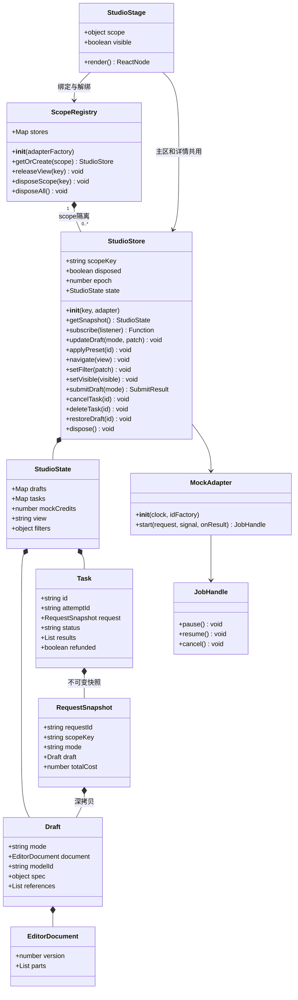
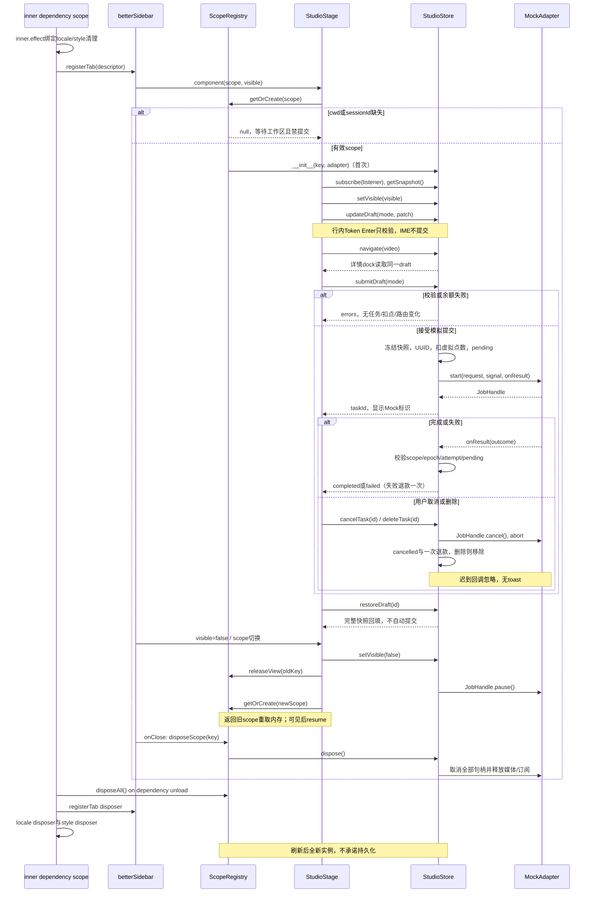
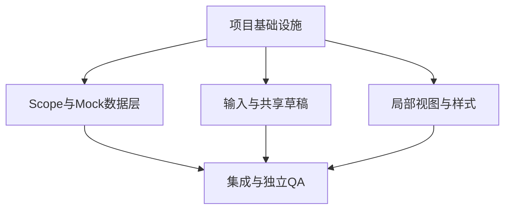

# 对话式创作工作台 — 最小整改设计与工程交接

版本：2026-09-09 remediation-1；状态：批准方向的待实施规范，不是实现 PASS。

输入：[PRD](PRD.md)、只读 [原型](index.html)、[14 项审计](architecture-audit.md)。本轮仅改这份设计、PRD 和两张图；不改审计、原型、插件、官方 DSH 或外部工作树，不切 Git、不远程写、不部署。

## Part A：系统设计

## 1. 实现方式与决策

采用独立社区 `betterSidebar` Tab、React 单向数据流、scope registry + store + Mock adapter；沿用 esbuild 和局部 CSS，不引入 Vite/MUI/Tailwind、路由库、数据库或后端。最难点是 scope 生命周期、编辑器顺序/IME、请求快照和取消竞争，不是增加层数。

| 选项 | 收益 | 代价 / 决策 |
|---|---|---|
| A：社区 Tab 独立表单 | 改动最小，保留原型核心内容，隔离宿主 composer | 需要社区依赖；不能宣称原生 composer 改造。本期采用。 |
| B：官方 composer 扩展 | 可使用原生输入事务 | 必须额外处理 slot owner、claim 仲裁及审批占位；当前不实施、不授权。 |

### 1.1 真实 API 与能力边界

证据定位：审计第 2 节基于安装发行包；本轮复核社区 `dsh-better-sidebar/src/client/service.ts` 的 `TabComponentProps/TabDescriptor/registerTab`，及 `api.ts:198-204`；官方 locale 发行包 `lib/client.js:1256-1281`。

- `betterSidebar` 是社区服务，不是官方内置。`registerTab(descriptor): () => void`，descriptor 包含 id/title/icon/single/component/onClose；component 收到 `ctx, store, scope, tab, visible`。`single:true` 仅去重 Tab，不隔离业务状态。
- **已核实 scope 是 `{sessionId:string,cwd?:string,repoRoot?:string}`，并没有 workspaceId 字段。** 本地 scope adapter 用 `JSON.stringify([cwd, repoRoot ?? null, sessionId])` 构造 key；要求 cwd 和 sessionId 非空，保留宿主字符串不自行 realpath/小写折叠。cwd 未知时显示“等待工作区”，不初始化 Store、不读旧数据、不允许提交。repoRoot 变化也视为新 scope；不得把 tab id、全局当前目录、默认 session 当后备。
- 客户端声明等待实际服务 `betterSidebar/locale`，包 `dsh.client.inject` 声明实际提供这些服务的模块。社区包名以 pin 的 package.json 为准；已核对社区版本 0.18.0。安装环境需验证该版本/兼容版本，不能假设所有宿主一致。
- `ctx.inject([...], inner => ...)` 中的所有依赖资源必须绑定 **inner.effect**；`registerTab` 返回值是清理函数。`locale.register(ns, {'zh-CN':dict,'en-US':dict})` 返回清理函数；不是 `locale.define`。移除无证据的 `@deepseek-ai/dsh-client-runtime`。`locale.t` 的调用形态在实施 pin 中复核，不静默吞掉 API 不匹配。
- 缺社区服务：Tab 不注册，不注入 CSS，不 fallback 到 overlay/details/conversation，不 claimProductStage。宿主正常可用；缺 locale 时允许保持未注册并报告依赖诊断，不用伪兼容空操作冒充成功。
- 官方 `conversation.input.dock` 是 list/session，仅 composer 上方条目；`conversation.composer` 是 chain/session，owner 有 sessionId/session/pendingInteraction；`conversation.composer.bar` 是 single/session-maybe。slot 类型不可混用，当前不接入这些 slots。
- 官方存在 `ComposerBarOwnerProps.placeholder` 与 inputTriggers 的 matchEnter/adjudicate/claim.submit 路径，但没有经证实的通用 `inputActions.setPlaceholder` 或 beforeSubmit；`inputActions.submit` 不是拦截器。Tab 自绘 placeholder、提交和参数均属本插件，不能写成原生已支持。

### 1.2 Scope 生命周期（唯一裁决）

registry 属于一次依赖注入 scope 的闭包，不是模块单例。实例以完整 ScopeKey 索引；状态、演示余额、任务、filters、draft 均隔离。组件用 Provider 接实例，`useSyncExternalStore` 消费稳定 immutable snapshot。

| 事件 | Store/草稿 | 资源/任务 |
|---|---|---|
| 首次 mount 且 scope 完整 | getOrCreate，初始化 fixture 与草稿 | 订阅一次，visible=true 才启动模拟计时 |
| 切内部 view/模态 | 同 Store 同草稿，不复制 | 关闭过期 popover，保留任务 |
| visible=false / 临时 unmount / 切会话 | registry 保留旧 scope 内存；release view subscription | 暂停模拟 timer，保存剩余时间；停止媒体播放，不发 toast |
| 返回原 scope | 取回原实例，先绑定再显示 | visible=true 恢复剩余计时；不是从零开始 |
| cwd/repoRoot/sessionId 变化 | 先解绑旧实例，再绑定新实例 | 旧 scope 暂停，不借用旧 UI state |
| 明确关闭 Tab（onClose） | disposeScope，清空该 scope | 取消 timer、AbortSignal、媒体 URL/事件/订阅；重开全新草稿 |
| 依赖服务 unload/reload、插件卸载 | disposeAll；新 inner scope 新 registry | 注销 Tab/locale、删除 style、清理全部资源；幂等 |
| 页面刷新 | JS realm 丢失，重新初始化 | 无恢复、无 localStorage/IndexedDB、无 deep-link |

没有可靠关闭事件时不得用组件 unmount 猜“用户关闭”；按上表保留至依赖卸载。内存只在本次插件生命周期存在，不承诺跨刷新。Tab 元数据自己的持久化不是业务草稿持久化。

### 1.3 编辑、请求与任务规则

PRD 的有序 token 文档和键盘表为行为合同。实现只保留一个 `EditorDocument.parts`，每个 text/token 有 UUID；组件按序渲染文字编辑片段与 inline token input。selection 是节点 ID + offset 的瞬时视图状态，IME compositionend 前不重建 DOM；粘贴纯文本，禁止 innerHTML。`serializeDocument` 以 URL 值替代 token 原位串接，不把所有 URL 追加到尾部。URL 校验只语法，不调用网络、不称解析成功。

`submitDraft(mode)` 的原子事务：读取本 scope 草稿 → 校验 token/字数/规格/引用/批量/余额 → 深拷贝并冻结 request → 同步生成 UUID 和扣模拟点数、插入 pending batch → 通知 UI → adapter 开始可取消模拟。不通过时不改变余额/任务/路由。接受后导航到对应历史；分析留 Agent 样例结果区。草稿保留便于修改，重复点击锁覆盖一次事务。

`pending → completed | failed | cancelled`，终态不可再次转换；每个 timer 回调检查 store 未 disposed、scope key、epoch、taskId、pending、attemptId。cancel 先撤销 timer/abort，再一次性 refund 并进入 cancelled；delete 调 cancel 后移除；complete/failed 使用原快照而非当前草稿。dispose 清理全部句柄且不 toast。模拟失败/取消退款一次；成功删除不退款。

图片任务为一个 batch，`results.length=batchCount`，各 result 独立 UUID；不支持部分成功。样例加载失败是 result 的 `mediaState=error`，不把已完成模拟任务改称真实生成失败，也不重复退款。模拟完成与媒体 ready 分开。

“重做”重命名语义为 `restoreDraft(taskId)`：按 task.request 完整回填，有未提交修改先确认覆盖；不自动生成、不扣点。取消确认只用于覆盖草稿/删除，不借其扩展真实操作范围。

### 1.4 局部样式与视图

只渲染 `[data-omnimux-studio]` 根，`height:100%; min-height:0; position:relative; isolation:isolate`，内部滚动区 `min-height:0; overflow:auto`。dock 在内部滚动包含块 sticky；modal/popover portal 到该根内专用容器，绝不 document.body 全屏 fixed。style 标签可放 head，但 selector 全部受该根限定，keyframes 加 studio 前缀，注入返回 disposer 并绑定 inner.effect。

不重定义官方变量、不全局 reset、不清宿主 outline。优先直接使用 `--dsw-alias-*`；必要 fallback 只在局部声明且经过亮/暗主题核验，不新建平行主题体系。图标遵循实际 source viewBox，不强制 24。去掉 StudioHeader 渲染和引用；详情内返回仍保留。组件 class 与 CSS 逐项对齐，尤其 root/scroll/dock/backdrop/lightbox/filters。

## 2. 文件清单（后续工程目标，不是本轮写入授权）

相对逻辑插件根 `plugins/omnimux-studio/`。**当前是跨工作区软链，未经主理人明确授权真实路径，工程不得在此列表落代码。** 复核 realpath：`/Users/x/Desktop/Project/dsh-plugin/product/omnimux-dsh-wt-visual-generation/plugins/omnimux-studio`。

| 模块 | 创建/修改文件 |
|---|---|
| 基础设施 | `package.json`, `cordis.patch.yml`, `scripts/build-client.mjs`, `src/index.js`, `src/client/index.js`, `README.md` |
| 数据和生命周期 | `src/client/types.d.ts`（新增 JSDoc 合同）, `scope-registry.js`, `mock-adapter.js`, `editor-document.js`（后三项位于 src/client/，新增）, `src/client/studio-store.js`, `src/client/use-studio-store.js`, `src/client/mock-data.js` |
| 输入组件 | `src/client/components/AgentWorkspace.jsx`, `UrlTokenCapsule.jsx`, `VideoWorkspace.jsx`, `ImageWorkspace.jsx`, `StickyFloatingDock.jsx`, `ModelSelectPopover.jsx`（均 components/） |
| 视图/样式 | `src/client/StudioStage.jsx`, `src/client/studio.css`, `src/client/styles.js`, `src/client/locales.js`, `src/client/views/ImageGeneratorView.jsx`, `VideoGeneratorView.jsx`（views/）, `src/client/components/GenerationStatusCard.jsx`, `LightboxModal.jsx`, `InpaintingModal.jsx`, `StudioHeader.jsx`（components/；最后一项去除消费，若无引用可在后续授权实施中删除） |
| 验证 | `tests/store.test.mjs`, `tests/editor.test.mjs`, `tests/lifecycle.test.mjs`, `tests/fixtures.test.mjs`, `tests/ui-contract.test.mjs`, `README.md`（测试命令/证据入口） |

不要求一次重拆所有组件，只改关联模块；不得新建第二个 router、provider 或 hub。

## 3. 数据结构与最小接口

以下为**目标本地接口**，不是已有实现或官方 API。JSDoc+types.d.ts 足够，不强制全项目转 TypeScript。

```ts
type ScopeKey = string; // JSON tuple [cwd, repoRoot|null, sessionId]
type Mode = 'agent' | 'video' | 'image';
type Part = {id:string;kind:'text';text:string} |
  {id:string;kind:'url-token';tokenType:'product'|'video';value:string;
   validation:'empty'|'invalid'|'valid';error?:string};
type EditorDocument = {version:1;parts:Part[]};
type Spec = {resolution:string;aspect:string;durationMode:'auto'|'fixed'|'none';
  durationSeconds:number|null;batchCount:1|2|3|4};
type Reference = {id:string;slot:string;kind:'image'|'video';source:'fixture'|'local';
  fixtureId:string|null;fileId:string|null;name:string;mime:string};
type Draft = {mode:Mode;document:EditorDocument;submode:string|null;
  skillId:string|null;presetId:string|null;modelId:string|null;spec:Spec|null;
  references:Reference[]};
type RequestSnapshot = Readonly<{version:1;requestId:string;scopeKey:ScopeKey;
  mode:'mock';draft:Draft;modelLabel:string|null;prompt:string;
  unitCost:number;totalCost:number;createdAt:string}>;
type Result = {id:string;kind:'image'|'video'|'text';fixtureId:string;
  mediaState:'idle'|'loading'|'ready'|'error';actualMetadata:object};
type Task = {id:string;attemptId:string;request:RequestSnapshot;
  status:'pending'|'completed'|'failed'|'cancelled';results:Result[];
  refunded:boolean;error:string|null};
```

实际 request 必须 deep-copy/deep-freeze 嵌套 draft，不是仅 Readonly 类型标注。引用快照包含有序槽位；本地 File/Blob 与 objectURL 由 store 的资源表持有，不写入 request 或存储。草稿和任务均无引用后 revoke，dispose 全部 revoke；媒体不是真实上传资产。分析 draft 的 model/spec=null，批量解释为1。

| 类/模块 | 方法与返回 |
|---|---|
| ScopeRegistry | `__init__(adapterFactory)`；`getOrCreate(scope): StudioStore|null`；`releaseView(key):void`；`disposeScope(key):void`；`disposeAll():void` |
| StudioStore | `__init__(key, adapter)`；`getSnapshot():StudioState`；`subscribe(listener):()=>void`；`updateDraft(mode,patch):void`；`applyPreset(id):void`；`navigate(view):void`；`setFilter(patch):void`；`setVisible(bool):void`；`submitDraft(mode):{ok:true,taskId}|{ok:false,errors}`；`cancelTask(id):void`；`deleteTask(id):void`；`restoreDraft(id):void`；`dispose():void` |
| EditorDocument helpers | `validateToken(part):Validation`；`serializeDocument(doc):string`；`reduceEditor(doc, operation):EditorDocument`；操作为 insert/update/remove/move，保留节点顺序与稳定 id |
| MockAdapter | `__init__(clock,idFactory)`；`start(request,signal,onResult):JobHandle`；`JobHandle.pause()/resume()/cancel()`；onResult 只返回模拟 completed/failed 与 results，不变更余额 |

本期无通用 `live` adapter 实现。未来 Hub 接入需单独约定 request schema→Hub authorized catalog、submission id/幂等键、异步状态、cancel ACK、错误、鉴权与 assetId/过期媒体链接；本地 AbortSignal 不等价服务端取消，不能承诺单函数替换。



## 4. 程序调用流程



## 5. 不明确项与已定假设

- 安装 pin、ModuleLoader 可用模块与 React peer 组合以实施环境为准；本轮只读验证局部 API，不是 Host 冷启动证明。社区源码可能前进，工程须重新核对接口版本。
- scope 不含 workspaceId 已明确，采用 cwd+repoRoot+sessionId 隔离；不同路径别名产生两个独立内存实例是可接受取舍，不引入后端归一化。
- 使用原型媒体仅作样例；可达性/授权来源必须在交付 fixture 清单记录，不伪称用户产物。无媒体时允许错误态但不验为可播放。
- 视觉文档存在胶囊/圆角及颜色绝对化冲突，本期以 PRD 第4节裁决：宿主语义和隔离优先，不追求未经核验的百分比还原。
- 当前外部插件工作树不在本轮写入范围。工程阶段先落实目标真实路径权限与 ignored payload 的版本归属，再写代码；不得因软链可见就认为已授权。

## Part B：任务分解与 QA

## 6. 必需包

- `react@^18.2.0 || ^19.0.0`：沿用宿主 peer，实施 pin 只验一个实际版本组合，external 打包，不双装运行时。
- `react-dom`：仅实际导入 portal 时保留同宿主 peer，否则去掉无用声明。
- `esbuild@^0.25.0`：本地声明解析并由 lockfile 固定；禁止绝对路径兜底、扫描 pnpm 缓存择首版本。
- `@deepseek-ai/dsh-client-locale`、`@deepseek-ai/dsh-client-ui-primitives`：必须采用仓库当前 pin 对应版本；仅导入实证存在导出。不臆造确切版本号或把模块名当服务名。
- `dsh-better-sidebar`：社区安装前提，已读版本0.18.0；peer/patch/module声明在目标pin闭合。不复制社区源或添加到官方包内。
- 测试用 Node 内置 `node:test`；组件/浏览器验证使用已有环境，不为此引入新整套测试栈。无新增网络、数据库包。

## 7. 文件修改顺序（≤5 个任务）

表中省略路径均按第2节目录归属展开。所有配置/依赖声明只归 T01；没有额外线性拆分。

| ID | 任务 | 源文件 | 依赖 | 优先级 |
|---|---|---|---|---|
| T01 | 项目基础设施 | package.json、cordis.patch.yml、scripts/build-client.mjs、src/index.js、src/client/index.js、README.md | 无 | P0 |
| T02 | Scope、输入文档和Mock事务 | types.d.ts、scope-registry.js、studio-store.js、use-studio-store.js、editor-document.js、mock-adapter.js、mock-data.js、tests/store.test.mjs、tests/editor.test.mjs | T01 | P0 |
| T03 | 输入和共享详情草稿 | AgentWorkspace.jsx、UrlTokenCapsule.jsx、VideoWorkspace.jsx、ImageWorkspace.jsx、StickyFloatingDock.jsx、ModelSelectPopover.jsx | T01；接口按第3节，可与T02并行 | P1 |
| T04 | 局部视图、样式和Mock展示 | StudioStage.jsx、studio.css、styles.js、locales.js、ImageGeneratorView.jsx、VideoGeneratorView.jsx、GenerationStatusCard.jsx、LightboxModal.jsx、InpaintingModal.jsx、StudioHeader.jsx | T01；与T02/T03按接口并行 | P1 |
| T05 | 集成与独立验收 | tests/lifecycle.test.mjs、tests/fixtures.test.mjs、tests/ui-contract.test.mjs、README.md（证据） | T02,T03,T04 | P0 |

T01 已定义 index 注入形状，T05只接既定接口和验收，不分散新增配置。不能把测试计划当测试已通过。

### F01–F14 对应修复与 QA 标准

每项要保存源码/测试断言证据；带“浏览器”的要求须在授权隔离 Host 用 ego-browser 验证，不用静态源码或 HTTP200替代。

| 审计项 | 最小修复 / 任务 | 必须通过的 QA |
|---|---|---|
| F01 P1 顶栏回归 | 去 StudioHeader 及全局账户导航；PRD/图同步；T04 | 主区、两详情只见一套宿主 chrome，Tab 内无 OK头像/账户顶栏；返回动作在内容中。 |
| F02 P1 CSS污染 | 根限定、宿主 Token、inner style disposer；T01/T04 | CSS 检查无 root/body/裸元素全局规则；浏览器亮/暗两主题前后宿主/其他Tab computed style不变；卸载style删除。 |
| F03 P1 class失配 | 对齐root/scroll/dock/modal类；T04 | 每个布局类有本地声明；浏览器320/768/1200px面板宽下dock不遮输入、浮层只罩本Tab、滚动不带动全页。 |
| F04 P1 scope共用 | scope tuple registry，无未知scope回退；T02 | 两cwd×两session互不读草稿/任务/余额；相同session不同repoRoot隔离；缺cwd禁提交；切回恢复本scope内存。 |
| F05 P1 Mock误报 | mode/mock badges、禁伪增强、样例标识；T02/T04 | 所有提交/卡片/结果/下载明确Mock；无真实模型请求；点击未实现操作不改变输出且不报生成/入库成功；媒体错误可见。 |
| F06 P2 timer迟到 | task句柄、epoch/attempt guard、取消；T02 | fake clock：pending删除/取消/隐藏/卸载后推进时间不误报；恢复只跑剩余时长；重复cancel/refund幂等；删除其他任务不受影响。 |
| F07 P2 Token键盘 | 有序文档、严格语法、IME guard；T02/T03 | A-token-B-token-C显示/复制/快照一致；空值、javascript、userinfo、私网字面IP、签名串拒绝；商品ID分支；Token Enter只校验；中日韩IME Enter零提交；边界Backspace/粘贴/删除焦点实测。 |
| F08 P2 草稿/持久化 | 主区dock同源、仅内存、不伪deep-link；T02/T03 | 详情编辑→返回→进入值与槽/参数完全相同；临时切Tab保留；明确close/刷新清空；无localStorage写入；浏览器地址不被虚拟view伪改。 |
| F09 P1 菜单/过滤 | PRD fixture顺序/分组/默认；三维过滤及历史示例；T02/T03/T04 | 比对12视频/4Agent/6图片具体标签与顺序（不是只数数）；历史/示例均按三维AND过滤、重置单维、空态；主页场景不替代图片筛选；示例数取length。 |
| F10 P2 请求/ID/余额/批量 | frozen snapshot、UUID、原子虚拟事务；T02 | 1:1、15s、auto、所有槽位和Agent技能/规格无丢失；提交后改草稿不改任务；同毫秒100次接受任务ID唯一；余额0和差1拒绝；batch4恰4结果、成本unit×4；失败取消仅退一次。 |
| F11 P1 依赖/API | 去假runtime、community前提、locale.register；T01 | 清单中每模块在pin可解析；冷启动+菜单实际打开+词典可译；无sidebar场景Host可用/Tab缺席/无fallback；记录版本与加载日志。 |
| F12 P2 注入清理 | inner.effect拥有registerTab disposer；T01/T05 | 注入→卸载→同服务重注入循环10次，最多1Tab注册、0重复ID；每次对应disposer一次；locale/style/registry归零。 |
| F13 P2 图/API断裂 | 目标接口、生命周期/失败图；T02/T05 | 图内方法与types/实现逐项同名，init/read/update/delete/cancel/dispose可走通；restoreDraft接taskId；灯箱Esc恢复原触发焦点（消失则根）；不得承诺单函数接live。 |
| F14 P3 构建不可移植 | 声明依赖解析、独立test入口；T01/T05 | 授权环境干净依赖解析及build/test运行，不含机器绝对路径/缓存扫描；固定pin/lock与新payload hash；Node store/editor/lifecycle/fixture检查有真实结果。 |

## 8. 共享工程约定与交接

- 当前 API 名称不等于目标名称。迁移示例：`removeAgentSkill/resetAgentState/setVideoSubmode` 由 draft patch / editor reducer 承接；`redoTask(prompt)` 改为 `restoreDraft(taskId)`；删除旧入口所有调用，不维护两个互相漂移的 state。统一 spec patch 保留未改字段。
- 时间用 ISO8601 UTC；ID用 crypto.randomUUID 或注入测试idFactory；所有 JSON mock数据 version=1。错误区分 validation/insufficient-credit/cancelled/mock-failure/media-unavailable/dependency-unavailable。
- 不写凭据或签名URL日志；不持久化草稿/请求。本地URL策略不是未来服务端SSRF保障；真实连接需另外审核。
- 原型与审计保留为基线证据，不修改为PASS；新实现在独立 QA 报告中逐项闭环。当前六个交付文件被ignored，`git diff --check`单独不能证明设计文件正确；须直接检查文件及hash。
- 开始读取时 HEAD 为 `867b192ecf6aa35be4e1639db7351a89bea782c7`；收尾只读复核为 `93a36e19e59fb8b7b7ee0ad32e08f46efe12f137`，期间外部并发使 HEAD 前进，本任务没有执行 Git 写操作，不将新 HEAD 当作设计内容的提交版本。主仓两个 videoCompositionStatus 相关 dirty 文件不属于本任务。没有 fetch 或假设远端 base，设计针对本地 ignored payload。
- 下一责任人：主理人确认工程可写真实路径/版本纳管后，工程按T01→并行T02/T03/T04→T05；独立QA采集F表证据。实现/Host/浏览器验收、commit/push/部署本轮均未做，不可沿用旧审计的构建结果作为新实现通过。

## 9. 依赖图


