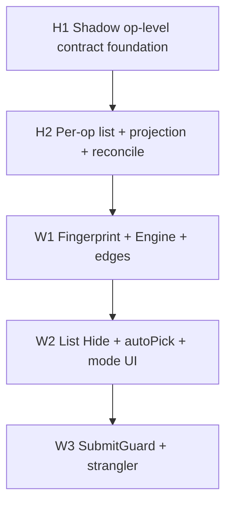
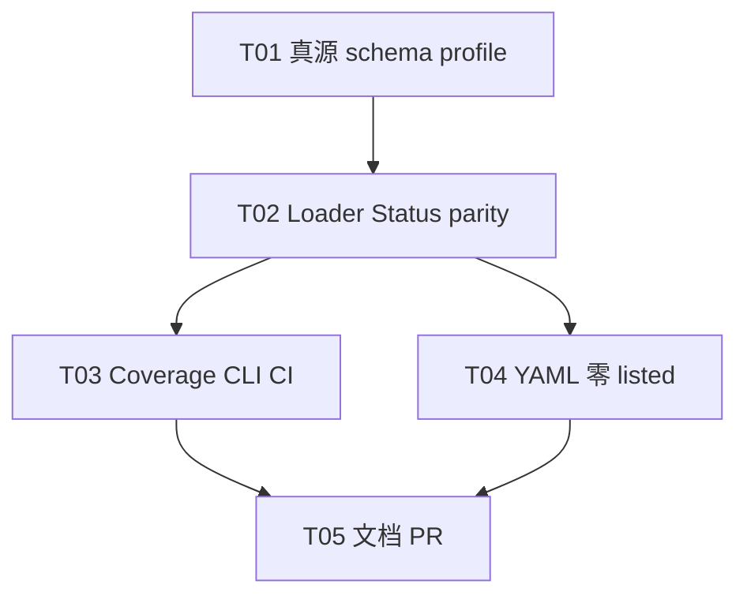

# 系统设计：全模态模型 I/O 契约 + 画布兼容性与自动适配

> **2026-09-06 输入语义补充**：实现节点输入解析、就绪判断与执行映射时，遵循 [节点有效输入与提交合同](../contracts/node-input-submission.md)及其 [验收矩阵](2026-09-06-node-input-submission-prd.md#acceptance)。本设计中的节点字段/prompt 映射不得解释为必须由本地输入框提供；后续共享解析方案需单独核对现有实现。

> **2026-09-06 生成节点策略**：[生成节点模型选择与偏好](../contracts/generation-node-policy.md) 取代本文中的自动选模顺序、产品模型范围及模式展示规则；Hub 输入能力与执行合同仍为唯一真源。


> **2026-09-05 当前方法**：[模型合同文档优先方法修订](2026-09-05-model-contract-docs-first.md) 与 [模型 API 权威](../contracts/model-api-authority.md) 取代本文关于存在性、最小生成、边界探测、样本上限、真实执行和按执行翻转 `listed` 的可执行指令。本文保留原模型范围、历史快照与已发生执行；它们不得被当作当前输入合同。具体 EvoLink/APIMart 模型 API 文档未说明的字段、角色、数量、格式、时长和模式均为未知，不得猜测、试探或跨渠道借用。

> **文档地位**：L2 已接受设计（Epic #463 / H1 #464）。实现以本文 + L1 MCC / hub / model-list-ownership 为准；产品行为以正式 PRD 为准。
> **作者**：高见远（架构师） · 2026-09-04
> **修订**：
> - 2026-09-04 **R1（QA 首轮打回）** — operation 级 research/execution/listed、profile 相容性、H1 实 YAML 零 listed claim、prompt 政策、cache fingerprint、schema↔JS parity、CLI fail-closed、CI trap。
> - 2026-09-04 **R1.1（主理人出站合同漂移纠偏 · 仅文档定稿）** — Model capability YAML/normalized **canonical 根字段必须是 `schemaVersion: "1.1"`**（**禁止**把批准的 Contract v1.1 根字段擅自改名为 `version`）；legacy 根 `version` **仅** loader 输入兼容；formal schema / index / export / fingerprint / report **只暴露 `schemaVersion`**；model `aliases` 用于 runtime/wire ID 归一；`validateAdapterProfiles` **强制** `profile.operations[]` ⊆ operation registry（`profile_operation_unknown`）；**不改源码/tests/不 commit**（本修订由架构师落盘，工程按 §16.5 实施）。
> **工作树**：`omnimux-dsh-wt-model-contract-foundation-464` / 分支 `agent/omnimux-model-contract-foundation-issue-464`
> **术语**：`omnimux` 一律称**执行中枢**。历史类名 `OmnimuxGateway` / 文件名 `omnimuxGateway.ts` 仅作兼容引用（反引号标出），**不是**产品术语。
> **明确纠偏**：本文**不得**继承未跟踪草稿中的错误——手写 YAML parser、Workflow 复制 17 模式枚举、按 YAML 文件/输入模态推断 `output`、全局硬编码 100MB、ASR 假设已有执行能力、**model 级 research/execution 一把梭全 op listed**、粗 `videoGenerate` 自动放行 `digital_human`、cache 只信 mtime、CLI 未知 flag 静默成功、**把 Contract v1.1 根 `schemaVersion` 擅自改名为 `version` 并当作通过**。
> **本阶段边界**：H1 = 契约机器真源 + shadow loader / admission / verifier；**不改变** `buildModelCatalog` runtime 投影；**不对 runtime constraints 做 H1 对账**（H2 真实迁移时做）；**H1 现有实文件 specs 的 `listedOperations` 必须为 `[]`**（不审计模型事实、不顺手 verified 强 live 证据）。H2 再逐 operation 补证上架并切投影 / 画布消费。

---

# Part A: 系统设计

## 1. Implementation Approach

### 1.1 核心技术挑战

| # | 难点 | 设计对策 |
|---|---|---|
| C1 | **多真源漂移**：`media/catalog.js` + `text/catalog.js` SPECS、四份 YAML 雏形、workflow `BUILTIN_MODEL_CAPABILITIES`、`GenerationMode` 旧别名并行 | H1 建立 **Hub 机器真源**（`operation-registry.json` + `model-capability.schema.json` + YAML specs）；runtime 列表仍走现状，但 admission/verifier **可见缺口**；H2 切投影并绞杀双表 |
| C2 | **operation 语义分裂**：画布 `GenerationMode = reference \| first_last_frame` ≠ MCC 17 标准 operation | 标准 ID 只存在于 Hub registry；Workflow DTO 用 **`string` + metadata**，**禁止**再复制穷举联合类型；旧值只在读时 `legacyOperationMap` 翻译 |
| C3 | **output 不可推断**：`speech_to_text` 为 audio→text；文件级 `modality` 不是 output | 每个 `operations[]` **强制显式** `output.type`；Catalog v1.1 权威为 `models[]`，四列表（text/image/video/audio）仅为 **output-driven 兼容投影** |
| C4 | **体积上限误读为全局 100MB** | **取消**平台全局 hard ceiling（H1 不引入）；每 slot 的数量、MIME、体积、时长和格式均回指具体渠道模型 operation 的官方 API 文档。文档未说明即未知，不以实测样本、拒绝点或 `policy_conservative` 填补，也不据此断言渠道不支持 |
| C5 | **可见性 ≠ 有 YAML 草稿**；同模型部分 op live、部分 draft | **research / execution / listed 以 operation 为原子**（见 §3.4–§3.5）。Model 层可有 defaults，normalize 后**每个 operation 自有** research/execution；Catalog/coverage 报告 **`listedOperations`**（键 `modelId#operationId`）；`model.listed` 仅派生摘要 `any(op.listed)`，**不得**把未 verified/live 的 op 一并放行 |
| C6 | **H1 CI 不能因 29 missing 永远红** | verifier 默认 **admission-strict / coverage-audit**：malformed YAML / 非法 registry 引用 = fail；coverage gap = machine-readable report，H1 默认不 exit 1；`--strict` 在 H2 切 coverage |
| C7 | **跨包铁律** | 契约与 loader 只在 `plugins/omnimux`；workflow **零 hub import**，只消费 `modelCatalog` seam / Host HTTP 桥接载荷 |
| C8 | **粗 profile 假 live** | `adapter-profiles.json` 每 profile 声明 `seam`、`status`、`operations[]`、`outputTypes[]`（可选 `slotRoles`/`notes`）；校验 **operation + output.type + seam 与 profile 相容**。`digital_human`（Kling Avatar）**不得**仅凭粗 `videoGenerate` 自动通过 |
| C9 | **H1 实 YAML 虚假 listed** | 现有四份 specs **禁止**任何 listed claim：全部 operation `research: draft` 且/或 `execution: none\|stub`，使 `listedOperations=[]`。`verified`/`live` **只允许**专门 valid fixtures 验证判定逻辑。H2 再逐 op 补证。PM 预审的强 live 主路径（seedance-2-0-fast t2v、gpt-image-2 t2i、grok-imagine-image t2i）**不在 H1 顺手 verified**——H1 边界是不审计模型事实 |
| C10 | **schema 与 JS validator 脱节** | JSON Schema **normative**；H1 纯 JS validator **必须 parity**（allowedMimes 非空字符串数组、output/slot min/max 数值与顺序、aliases 唯一、**`schemaVersion` 格式**等）+ parity tests；**不得**宣称「执行 schema」却不校验关键结构 |
| C11 | **CLI / CI 不 fail-closed** | 未知 flag、缺 value、`audit+strict` 互斥 → **exit 2**；JSON 模式错误可机器解析；CI 用 `trap` 清理 symlink/tmpdir，verifier 失败不得留污染 |
| C12 | **cache 只信 mtime 可 stale** | cache key = `sorted file names + file content hash`（不得以目录 mtime 为唯一键） |
| C13 | **prompt 魔法强制** | **不**自动把 prompt 补成必填。YAML **应显式列 prompt slot**（H1 对需要 prompt 的 op）；normalize 若补槽，必须依据 registry `promptPolicy: required\|optional\|none`；`speech_to_text` / `digital_human` / source-only **不得**强制 prompt |
| C14 | **Contract v1.1 根字段擅自改名** | 批准的 model capability 文档顶层 canonical shape 使用 **`schemaVersion`**（非根 `version`）。正式 specs / schema / normalized / index / fingerprint / audit report **只认并只暴露 `schemaVersion: "1.1"`**。根 `version` **仅** loader 输入层 legacy 迁移（fixtures）；**不得**与 `schemaVersion` 并存或值冲突。`operation-registry.json` / `adapter-profiles.json` 是**不同文档**，可继续用自身 `version`，**禁止**机械改名 |
| C15 | **profile.operations 未对 registry 强制** | `validateAdapterProfiles` 必须对每个 `profile.operations[]` 项校验 ∈ operation registry；unknown → **error** `profile_operation_unknown`（或等价 `schema_invalid` 且 message/path 可定位）。audit 与 strict **均 fail**；**不可推 H2** |

### 1.2 框架与库选型

| 项 | 选型 | 理由 |
|---|---|---|
| 语言 | Hub JS（ESM）+ Workflow TS（H2 消费） | 与仓库一致 |
| YAML 解析 | **`yaml@^2.9.0` 作为 `plugins/omnimux` 直接依赖** | 契约嵌套已超 `parseSimpleYaml`；**禁止**扩写手写 parser |
| Schema | JSON Schema 文件 `model-capability.schema.json`（**normative**）+ 轻量运行时纯函数（与 registry/profile **parity**） | 机器可校验；CI 可读；**不引入 Ajv 也可**，但不得假称执行 schema |
| Operation 枚举 | **`operation-registry.json` 单一机器真源** | L1 MCC 为人读；扩展先改 registry，再改 L1；含 `promptPolicy` / 可选 `defaultSlotRoles` |
| 架构模式 | SSOT + Shadow Load（H1）→ Projection Switch（H2）+ Strangler Fig | 可回滚、可测 |
| 测试 | `node:test` | 与 hub catalog 测试一致 |

### 1.3 架构模式与模块边界

```text
┌─ plugins/omnimux（执行中枢 · Catalog Owner）─────────────────────────────┐
│  operation-registry.json          ← 标准 operation + promptPolicy         │
│  model-capability.schema.json     ← YAML / 规范化对象 schema（normative） │
│  specs/*-models.yaml              ← 模型契约（H1 实文件零 listed claim）  │
│  adapter-profiles.json            ← seam/status/operations/outputTypes    │
│         │                                                                │
│         ▼                                                                │
│  contract/load → normalize(op-level status) → index（content-hash cache）│
│         │                                                                │
│         ├─ admission（schema + registry + profile 相容）  ── CI strict   │
│         ├─ coverage（model IDs + listedOperations）       ── H1 audit    │
│         └─ shadow only：H1 不改 buildModelCatalog / modelCatalog.list    │
│                                                                          │
│  buildModelCatalog（现状 JS SPECS）── H2 才切到 contract 投影            │
└──────────────────────────────────┬───────────────────────────────────────┘
                                   │ modelCatalog seam（目录缝）
                                   │ GET /omnimux/model-catalog（HTTP 仅桥接）
┌──────────────────────────────────▼───────────────────────────────────────┐
│ plugins/omnimux-workflow（Canvas Consumer · 零 hub import）                │
│  H1：不改画布行为                                                          │
│  H2：Fingerprint + CompatibilityEngine；兼容判定按 **listed operation** │
└──────────────────────────────────────────────────────────────────────────┘
```

| 模块 | 包 | H1 职责 | 不职责 |
|---|---|---|---|
| **Operation Registry** | `omnimux` | 17 标准 operation + label/group/defaultOutput/**promptPolicy** | UI |
| **Schema** | `omnimux` | 校验形状；与 JS validator parity | 厂商协议 |
| **Contract Loader** | `omnimux` | `yaml` 解析、**op 级** normalize、content-hash memo、fingerprint | 改 list runtime |
| **StatusPolicy** | `omnimux` | **per-operation** research/execution/listed；model.listed 派生 | 审计厂商事实（H1 实文件一律 draft/none） |
| **Admission** | `omnimux` | schema + registry + **profile 相容** + 显式 output | 以 missing coverage 红灯（默认） |
| **Coverage Auditor** | `omnimux` | runtime model IDs ∩ YAML；**listedOperations** 报告 | 假装 listed |
| **Catalog Projection** | `omnimux` | **H2** 才替换 `buildModelCatalog` | H1 保持现状 |
| **Runtime constraints 对账** | — | **不属于 H1** | H2 迁移时做 |
| **Fingerprint / Compat / Canvas** | `omnimux-workflow` | **H2 / W\*** | H1 不实现 |

### 1.4 与错误实现的硬性差异（实现禁令）

| 错误 | 本设计 |
|---|---|
| 受控子集 / 扩写 `parseSimpleYaml` | **Hub 直接依赖 `yaml@^2.9.0`** |
| Workflow 复制 17 联合类型 | DTO：`operation: string` + registry 元数据 |
| 文件 `modality` 推断 output | **`operations[].output.type` 显式必填** |
| `PLATFORM_*_MAX_SIZE_MB = 100` 全局硬顶 | **H1 不引入**；仅 slot + `limitSource` |
| Model 级 research/execution 使全 op listed | **operation 级核心字段**；`listedOperations` 为权威上架集合 |
| 粗 `videoGenerate` 放行 `digital_human` | profile 必须声明 `operations[]`/`outputTypes[]` 并校验相容 |
| H1 实 YAML `research:verified` + `execution:live` → listed=9 video | **H1 实文件全部 op draft/none|stub** → `listedOperations=[]` |
| `ensurePromptSlot` 无脑 min=1 | registry `promptPolicy`；STT/digital_human/source-only 不强制 |
| cache key = 目录 mtime | **sorted names + content hash** |
| JSON Schema 与 JS 脱节 | parity + tests；关键结构必须拦 |
| CLI unknown flag 静默成功；audit 后写覆盖 strict | fail-closed exit 2；互斥 |
| CI 无 trap 留 symlink | `trap` 清理 |
| H1 改 `list.js` 投影 | H1 **shadow only** |
| H1 对账 runtime Grok/Seedance limits / mapper audio | **H2**；H1 靠零 listed 不污染选择面 |
| 根字段用 `version` 冒充 Contract v1.1 | **canonical = `schemaVersion: "1.1"`**；legacy `version` 仅输入迁移 |
| schema required 仍写 `version`+`models` 并当通过 | normative required = **`schemaVersion` + `models`** |
| profile.operations 含 registry 未知 id 仅 warning 或忽略 | **error** `profile_operation_unknown`；malformed profile |

---

## 2. File List（H1 精确表 · 相对仓库根）

### 2.1 H1 新建（Hub）

| 路径 | 说明 |
|---|---|
| `plugins/omnimux/src/catalog/contract/operation-registry.json` | 标准 operation + `promptPolicy` |
| `plugins/omnimux/src/catalog/contract/model-capability.schema.json` | 模型契约 JSON Schema（含 op 级 research/execution） |
| `plugins/omnimux/src/catalog/contract/adapter-profiles.json` | profile：`seam`/`status`/`operations[]`/`outputTypes[]` |
| `plugins/omnimux/src/catalog/contract/load.js` | YAML 加载 + normalize + **content-hash** memo |
| `plugins/omnimux/src/catalog/contract/schema.js` | schema + registry + **profile 相容** + parity 校验 |
| `plugins/omnimux/src/catalog/contract/status.js` | **op 级** research/execution/listed；model 派生 |
| `plugins/omnimux/src/catalog/contract/units.js` | 体积/时长单位 |
| `plugins/omnimux/src/catalog/contract/legacy-operation-map.js` | 旧 GenerationMode → 标准 operation |
| `plugins/omnimux/src/catalog/contract/index.js` | barrel + `verifyContracts` |
| `plugins/omnimux/src/catalog/contract/admission.js` | AdmissionReport |
| `plugins/omnimux/src/catalog/contract/coverage.js` | runtime ids + **listedOperations** |
| `plugins/omnimux/src/catalog/contract/*.test.js` | loader/schema/status/units/admission/coverage/**parity** |
| `plugins/omnimux/src/catalog/contract/fixtures/**` | 合法/非法；**仅 fixtures 可含 verified+live listed** |
| `scripts/verify-model-contracts.mjs` | CLI（fail-closed flags） |
| `docs/specs/2026-09-04-model-io-contract-compatibility-design.md` | **本文件** |
| `docs/specs/2026-09-04-model-io-contract-class.mermaid` | 类图 |
| `docs/specs/2026-09-04-model-io-contract-sequence.mermaid` | 时序图 |

### 2.2 H1 修改

| 路径 | 说明 |
|---|---|
| `plugins/omnimux/package.json` | `yaml@^2.9.0`；test 含 `contract/*.test.js` |
| `pnpm-lock.yaml` | 随依赖锁定 |
| `plugins/omnimux/src/catalog/model-capabilities.test.js` | 废除 hand parser；走 loader；**断言 H1 实 specs `listedOperations=[]`**；保留 kling-avatar 无 first_last_frame 等业务语义 |
| `plugins/omnimux/src/catalog/specs/{text,image,video,audio}-models.yaml` | schema 对齐；**每 op research/execution 为 draft/none|stub**（可继承 model defaults 但 normalize 后仍 draft）；显式 inputs/prompt 政策；**零 listed claim** |
| `package.json`（根） | `verify:model-contracts` |
| `.github/workflows/quality-gate.yml` | audit 步 + **trap 清理** |
| `docs/contracts/model-capabilities-matrix.md` | operation 级 listed / promptPolicy / profile |
| `docs/contracts/model-list-ownership.md` | H1 零 listedOperations；H2 上架 |
| `docs/specs/README.md` / `docs/contracts/README.md` | 索引 |

### 2.3 H1 **禁止修改**

| 路径 | 原因 |
|---|---|
| `plugins/omnimux/src/catalog/list.js` | 不改变 `buildModelCatalog` |
| `plugins/omnimux/src/media/catalog.js` / `src/text/catalog.js` | runtime 列表真源直至 H2 |
| `plugins/omnimux/src/host/apply.js` 的 `modelCatalog.list` | 现状 list |
| `plugins/omnimux-workflow/**` 业务行为 | H2/W\* |
| 厂商 protocol / execute / mapper（含 Kling Avatar audio） | **H2 真实迁移/对账**；非 H1 |
| ASR `speechToText` seam | 本轮不做 |
| **PRD 文件** | 架构不改 PM PRD；若语义冲突只记录需 PM 修订（见 §15） |

### 2.4 H2 预告（本 PR 不实现）

- 逐 operation 补证 → 仅证据充分的 `modelId#operationId` 进入 `listedOperations`
- runtime constraints 对账（Grok/Seedance limits 取更严、mapper 丢 audio 等）
- `list.js` 契约投影；四列表 output-driven
- workflow Fingerprint / CompatibilityEngine / 绞杀 BUILTIN
- Whisper / Kling Avatar 在 seam+profile 完备前保持 quarantine（不可 listed）

---

## 3. Data Structures and Interfaces

### 3.1 机器真源：`operation-registry.json`

```json
{
  "version": "1.0.0",
  "operations": [
    {
      "id": "chat",
      "label": "纯文本对话",
      "group": "text",
      "defaultOutputType": "text",
      "promptPolicy": "required",
      "notes": "YAML 应显式列 prompt slot"
    },
    {
      "id": "speech_to_text",
      "label": "语音转文字",
      "group": "audio",
      "defaultOutputType": "text",
      "promptPolicy": "none",
      "notes": "source audio only；不得强制 prompt"
    },
    {
      "id": "digital_human",
      "label": "数字人/对口型",
      "group": "video",
      "defaultOutputType": "video",
      "promptPolicy": "optional",
      "notes": "图/视频+音频驱动；不得因粗 videoGenerate 自动 listed"
    }
  ]
}
```

**`promptPolicy`（H1 必填于 registry 每项）**：

| 值 | 含义 | normalize |
|---|---|---|
| `required` | 需要 prompt 文本槽 | YAML **应显式**写 prompt slot；若缺且 `inputs` 为空或无 prompt，normalize **可**注入 `prompt` slot 且 **min/max 来自显式或默认 1/1**，并记 `legacy_prompt_injected` **warning**（H1 建议工程师直接写显式 inputs 减魔法） |
| `optional` | 可有可无 | **不得**自动注入必填 prompt；缺省不补 |
| `none` | 不应有 prompt（STT、部分 source-only） | **禁止**注入 prompt；若 YAML 写了 prompt 可为 warning 或按产品保留可选 |

**规则**：

- `id` 稳定；扩展先改本文件 + L1 MCC，再录入 YAML。
- `defaultOutputType` **仅文档提示**；YAML 仍必须写显式 `output.type`。
- Workflow / 前端 **不得**复制 operations 数组为 TS 穷举联合。

### 3.2 JSON Schema 要点：`model-capability.schema.json`（normative）

#### 3.2.0 Contract v1.1 顶层 canonical shape（**硬拍板 · 全局一致**）

批准的 **Model capability YAML / normalized document** 顶层 canonical shape 为：

```text
schemaVersion: "1.1"          # 唯一契约 schema 版本字段（MUST）
managementGroup?: string      # 仅文件管理，不推断 output
modality?: string             # deprecated 管理别名
models: Model[]               # MUST
# 每个 model 内可含：id, label, aliases?, parameters?, research?, execution?, operations[]
# 每个 operation 内可含：id, label, aliases?, parameters?, research, execution, output, inputs[]
```

| 规则 | 拍板 |
|---|---|
| **Canonical 根字段名** | **`schemaVersion`**（**不是** `version`） |
| **Canonical 值** | **精确字符串 `"1.1"`**（Contract v1.1；**不**写 `"1.1.0"` / `"v1.1"`；全仓 formal specs / schema / tests / docs **同一字面量**） |
| **Normative JSON Schema `required`** | **`["schemaVersion", "models"]`** |
| **Formal schema 是否 anyOf legacy `version`** | **否**。正式 `model-capability.schema.json` **只写 canonical**。legacy 根 `version` 在 **loader pre-normalization** 处理，**不**进入 normative schema required/properties 作为并行根字段 |
| **Normalized / ContractIndex / fingerprint / audit report / export** | **只输出 / 只暴露 `schemaVersion`**；**禁止**再写根 `version` |
| **JS `validateDoc`（canonical 输入）** | 要求 `schemaVersion === "1.1"`（string）；缺省 / 空 / 错误类型 → `schema_invalid`（path `schemaVersion`） |
| **四份实 specs** | H1 **直接迁移**为 `schemaVersion: "1.1"`（去掉根 `version`） |
| **Legacy 根 `version`** | **仅** fixture / 历史输入：见 §3.2.1；**不得**出现在正式 specs |
| **`operation-registry.json` / `adapter-profiles.json`** | **不同文档**，根字段可继续用各自的 **`version`**（如 `"1.0.0"`）；**不要**机械改成 `schemaVersion` |

**禁止的错误通过条件**（出站审查纠偏）：

- ❌ 把「根字段叫 `version` 而非 `schemaVersion`」当成 QA 通过项或设计允许项
- ❌ formal schema / parity test 断言 `required: ['version', 'models']`
- ❌ normalized 对象同时保留 `version` 与 `schemaVersion`
- ❌ 因 registry/profile 文档用 `version` 而把 model capability 根也改回 `version`

#### 3.2.1 Legacy 根 `version` 输入兼容（**仅 loader pre-normalize**）

| 原始输入 | loader 行为 | 结果 |
|---|---|---|
| 仅 `schemaVersion: "1.1"` | 原样进入 canonical | OK |
| 仅 legacy `version: "1.0"` 或任意非空 string `version`（**无** `schemaVersion`） | **输入迁移**：删除根 `version`，写入 `schemaVersion: "1.1"`；可记 warning `legacy_schema_version_key`（path `version`） | canonical 仅 `schemaVersion` |
| 同时存在 `schemaVersion` 与 `version` | **拒绝**（error `schema_invalid` 或 `schema_version_conflict`）；**即使值「看起来一样」也不合并** | fail |
| `schemaVersion` 存在但 ≠ `"1.1"`（如 `"1.0"` / `"1.1.0"` / `"v1.1"`） | **拒绝** `schema_invalid` | fail |
| 两者皆缺 / 空串 / 非 string | **拒绝** `schema_invalid`（missing schema version） | fail |
| formal specs 仍写根 `version` | **H1 直接改 YAML**；不得依赖生产路径长期吃 legacy | — |
| fixture 测 legacy | **允许**；parity / schema.test 覆盖：legacy-only 可迁移；both/conflict 拒绝；missing 拒绝；canonical output 无 `version` | — |

> **顺序**：`parseYaml` → **preNormalizeDocRoot**（legacy `version`→`schemaVersion` 或报错）→ **validateDoc**（只认 canonical）→ per-model normalize。
> **不得**让 `validateDoc` 在未 pre-normalize 时「直接接受根 `version` 当通过」。若测试直接调 `validateDoc`，输入必须已是 canonical，或测试走 `parseFile`/`load` 全路径。

#### 3.2.2 根对象与 model / operation 字段

根对象（canonical）：

| 字段 | 约束 |
|---|---|
| **`schemaVersion`** | **必填** string；**const / 精确** `"1.1"` |
| `models` | **array，必填** |
| `managementGroup` | optional；**仅文件管理**，不推断 output |
| `modality` | optional deprecated |
| ~~`version`~~（根） | **非** canonical；正式 schema **不**列为 properties 真源；仅 §3.2.1 输入迁移 |

每个 **model**：

| 字段 | 约束 |
|---|---|
| `id` / `label` | 非空 string |
| **`aliases`** | optional string[]；**唯一**、元素非空；**model metadata 级** — 用于 **runtime / wire model ID 归一**（见 §3.2.3） |
| `operations` 或遗留 `modes` | array ≥1；normalize → `operations` |
| `parameters` | optional |
| `research` | optional **model default** |
| `execution` | optional **model default** |
| `governance.*` | 可映射到 research default |

每个 **operation**（核心）：

| 字段 | 约束 |
|---|---|
| `id` 或遗留 `mode` | ∈ registry |
| `label` | string |
| **`output`** | object 必填；`type` ∈ text\|image\|video\|audio |
| `output.allowedMimes` | 若出现：**array of nonempty strings** |
| `output.min` / `output.max` | 若出现：number，有限；若两者皆有则 **min ≤ max**，且 ≥0 |
| `inputs` | array（可 `[]`，但见 promptPolicy） |
| `parameters` | optional |
| **`research`** | optional；缺省继承 model.research / governance，normalize 后**必须物化到 op** |
| **`execution`** | optional；缺省继承 model.execution，normalize 后**必须物化到 op** |
| **`aliases`** | optional string[]；**唯一**、非空元素；**仅** legacy **operation** 映射定界（见 §3.2.3），**不是** model wire-id 真源 |

每个 **input slot**：

| 字段 | 约束 |
|---|---|
| `slot` / `type` / `role` / `min` / `max` | 必填；min/max 为 **有限 number**（推荐 integer 语义），min≤max，≥0 |
| `allowedMimes` | 若出现：array of nonempty strings |
| `maxSizeMb` / `maxDurationSec` | 有限 number ≥0；出现则 **必须** `limitSource` |
| `limitSource.kind` | official_docs \| measured \| policy_conservative |
| `source` | user \| upstream_edge \| node_field |

**Prompt**：需要 prompt 的 operation 在 H1 **应在 YAML 显式列出**：

```yaml
- slot: prompt
  type: text
  role: prompt
  source: node_field
  min: 1
  max: 1
```

`inputs: []` 仅表示「作者未写槽」；**不是**「无 prompt 政策」。normalize 按 `promptPolicy` 处理，**禁止**对 `none`/`optional` 强制 min=1 prompt。

#### 3.2.3 `aliases` 层级定界（**硬拍板**）

批准 shape：**model metadata 中的 `aliases`** 是 runtime/wire **模型 ID 归一**主路径；operation 上的 `aliases` 若保留，**仅**服务 legacy operation 名映射，且必须定界。

| 层级 | 字段 | 用途 | 定界 |
|---|---|---|---|
| **Model** | `model.aliases: string[]` | 将历史 / 厂商 / 路由别名 **归一到 `model.id`**（wire/runtime lookup） | 元素非空、数组内唯一；跨 model **全局唯一**（`validateCrossModelAliases`）；**不得**与任一 `model.id` 冲突（别名占用他模 id → `duplicate_alias`） |
| **Operation** | `operation.aliases: string[]` | **可选**；仅表示该 op 的 **legacy operation 名**（如旧 GenerationMode 字符串）在**该 model 文档内**的附属声明 | **不是**全局 operation 真源；全局 legacy→标准 op 仍以 `legacy-operation-map.js` 为准；op.aliases **不得**被当成 model wire id；跨 model 冲突检测若实现合并扫描，op.aliases 与 model.aliases **同一 alias 池**时仍 `duplicate_alias` |
| **非本契约** | UI display label | 展示文案 | 见 `model-display-label.md`；**不是** `aliases` |

**Schema 现状核对（R1.1）**：`model-capability.schema.json` 的 `$defs.model` **已有** `aliases`；`$defs.operation` **亦有** `aliases`。设计要求保持两者，但文档与实现注释必须写清上表定界，避免「只有 operation aliases」或「aliases 只为 display」。

**Normalize 输出**：

- `ModelContract.aliases?: string[]`（保留 model 级）
- `OperationContract.aliases?: string[]`（若 YAML 声明则保留；索引/lookup API 以 model 级为主做 id 归一）

### 3.3 单位规范化（`units.js`）

| 量 | 契约声明 | 运行比较 | 规则 |
|---|---|---|---|
| 体积 | `maxSizeMb` | `sizeBytes` | `sizeBytes <= maxSizeMb * 1024 * 1024`（MiB） |
| 时长 | `maxDurationSec` | `durationSec` | ≤ |
| 禁止 | 全局 100MB 默填 | — | **不得** `maxSizeMb ?? 100` |

> **H1 不做** runtime JS SPECS / mapper 与 YAML limits 的数值对账（属 H2）。H1 用 **零 listedOperations** 保证选择面不被未对账契约污染。

### 3.4 状态模型（**operation 级为核心**）

```text
research.status:  draft | verified | rejected
execution.status: none | stub | live
```

#### 3.4.1 继承与物化

```text
op.research  := op.research  ?? model.research  ?? fromGovernance(model.governance) ?? { status: draft }
op.execution := op.execution ?? model.execution ?? { status: none }
```

- Model 层 `research`/`execution` **仅 defaults**。
- Normalize 后每个 operation **必须携带自身** `research` + `execution` 对象（可深拷贝自 default）。
- Admission / listed / coverage **只读 operation 级字段**（读 model 级仅用于尚未 normalize 的原始文档诊断）。

#### 3.4.2 字段含义

| 字段 | 含义 |
|---|---|
| `research.status` | 该 **operation** 研究完备度；`verified` 需要 docUrl（op 或可追溯的 model docUrl 继承须在 normalize 时写入 op.research.docUrl） |
| `execution.status` | 该 **operation** 执行面 |
| `execution.profileId` | 映射 adapter-profiles |
| `execution.seam` | optional 显式 seam |

#### 3.4.3 H1 实文件状态政策（硬）

对 `plugins/omnimux/src/catalog/specs/*-models.yaml`：

1. **每个 operation**（normalize 后）必须满足：
   `research.status === 'draft'` **或** `execution.status ∈ {'none','stub'}`（通常两者同时保守：`draft` + `none|stub`）。
2. **禁止**在实文件上写 `research: verified` 且 `execution: live` 导致任何 op listed。
3. 目标不变量：加载实 specs 后 **`listedOperations.length === 0`**。
4. `verified` + `live` + 完整 contract + live profile 相容 **仅**出现在 `contract/fixtures/valid/**`，用于单测真值表。
5. 不得把 PM 预审的强 live 三路径在 H1 标 verified（H1 **不审计**模型事实；H2 补证）。

#### 3.4.4 adapter-profiles.json（H1）

每个 profile **必须**：

```json
{
  "id": "videoGenerate",
  "seam": "videoGenerate",
  "status": "live",
  "operations": ["text_to_video", "first_frame", "first_last_frame", "video_multi_ref", "video_edit"],
  "outputTypes": ["video"],
  "notes": "不含 digital_human；Avatar 需专用 profile 或显式扩表+证据"
}
```

| profileId | status | operations（示例，以实现文件为准） | 说明 |
|---|---|---|---|
| `textComplete` | live | `chat`, `vision_chat`（`document_analyze` 可列但画布 H1 不消费） | 文本/视觉 |
| `imageGenerate` | live | `text_to_image`, `image_to_image`, `multi_reference`, `inpaint_outpaint` | 图 |
| `videoGenerate` | live | t2v / first_frame / first_last_frame / video_multi_ref / video_edit | **不含** `digital_human` |
| `audioGenerate` | live | `text_to_speech`, `voice_clone`, `text_to_music` | 音频生成 |
| `speechToText` | unavailable | `speech_to_text` | 无 live seam |
| （可选 H2）`videoDigitalHuman` | unavailable 或 live | `digital_human` | Kling Avatar 专用；H1 可先 unavailable |

**A. Profile 文档自身合法性（`validateAdapterProfiles` · H1 强制 · 不可推 H2）**：

加载 / admission 在引用任何 profile 之前，必须校验 `adapter-profiles.json`：

1. 根为 object；自身文档字段 **`version`**（string 非空）+ `profiles[]`（**注意**：此处 `version` 是 **profile 注册表文档**版本，**不是** model capability 的 `schemaVersion`）；
2. 每个 profile：`id`、`status`、`operations`（非空 string[]）、`outputTypes`（非空且 ∈ output 枚举）等既有形状规则；
3. **硬新增**：`profile.operations[]` **每一项**必须 ∈ `operation-registry.json` 的 operation id 集合；
4. 若某项 ∉ registry → **error**，推荐 code **`profile_operation_unknown`**（若实现暂时复用 `schema_invalid`，message **必须**含 profile id 与 unknown operation id，path 可定位 `profiles[i].operations[j]`）；
5. 该错误在 **`--audit` 与 `--strict` 下均为 admission error**（exit 1），**不是** coverage warning，**不是**可推 H2 的 Minor。

**B. Operation↔profile 相容校验**（admission error，code `profile_incompatible`）：

当 `op.execution.status === 'live'` 时：

1. `profileId` 存在且 `profile.status === 'live'`；
2. `op.id ∈ profile.operations`；
3. `op.output.type ∈ profile.outputTypes`；
4. 若 profile/op 声明 `seam`，二者一致（或 op.seam 缺省则采用 profile.seam）；
5. 可选：若 profile 声明 `slotRoles`，op.inputs 的 role 集合与之相容。

因此：**Kling Avatar `digital_human` + 粗 `videoGenerate` → 不得 listed**（且 live 声明应 admission 失败或强制非 live）。
**同时**：即使 profile 未挂到任何 live op，**profile 文档里写了假 operation id 也必须 fail**（malformed profile，§A）。

### 3.5 `listed` 判定（**operation 级**）

```text
operationListed(op, modelId) ⇔
  contractComplete(op)                 // schema + 显式 output + slots + limitSource 规则
  ∧ op.research.status === 'verified'
  ∧ op.execution.status === 'live'
  ∧ adapterProfileCompatible(op)       // exists + live + operations/outputTypes/seam
  ∧ gateAllows(modelId, op.id)         // H1 钩子；缺省 true

listedOperations = [ `${model.id}#${op.id}` for each op where operationListed ]
model.listed = listedOperations 对该 model 非空   // 仅摘要，禁止作为放行全 op 的依据
```

**画布/选择 UI（H2）** 必须以 **`listedOperations` / `op.listed`** 为资格；不得因 `model.listed===true` 展示未 listed 的 operation。

H1 实 specs：`listedOperations=[]`；fixtures 可测正例。

### 3.6 JSDoc 核心 shape（Hub）

```js
/**
 * @typedef {'text'|'image'|'video'|'audio'|'document'} MediaType
 * @typedef {'text'|'image'|'video'|'audio'} OutputType
 * @typedef {'draft'|'verified'|'rejected'} ResearchStatus
 * @typedef {'none'|'stub'|'live'} ExecutionStatus
 * @typedef {'required'|'optional'|'none'} PromptPolicy
 *
 * @typedef {object} Research
 * @property {ResearchStatus} status
 * @property {string} [docUrl]
 * @property {string} [verifiedAt]
 * @property {string} [notes]
 *
 * @typedef {object} Execution
 * @property {ExecutionStatus} status
 * @property {string} [profileId]
 * @property {string} [seam]
 * @property {string} [notes]
 *
 * @typedef {object} AdapterProfile
 * @property {string} id
 * @property {string|null} seam
 * @property {'live'|'stub'|'unavailable'} status
 * @property {string[]} operations
 * @property {OutputType[]} outputTypes
 * @property {string[]} [slotRoles]
 * @property {string} [notes]
 *
 * @typedef {object} InputSlot
 * @property {string} slot
 * @property {MediaType} type
 * @property {string} role
 * @property {'user'|'upstream_edge'|'node_field'} [source]
 * @property {number} min
 * @property {number} max
 * @property {string[]} [allowedMimes]
 * @property {number} [maxSizeMb]
 * @property {number} [maxDurationSec]
 * @property {object} [limitSource]
 *
 * @typedef {object} OperationContract
 * @property {string} id
 * @property {string} label
 * @property {OutputSpec} output
 * @property {InputSlot[]} inputs
 * @property {Research} research
 * @property {Execution} execution
 * @property {boolean} listed
 * @property {string[]} [aliases]  // legacy operation-name only; not model wire id
 * @property {Record<string, unknown>} [parameters]
 *
 * @typedef {object} ModelContract
 * @property {string} id
 * @property {string} label
 * @property {string[]} [aliases]   // runtime/wire model id 归一
 * @property {OperationContract[]} operations
 * @property {Research} [research]   // defaults only; optional after normalize
 * @property {Execution} [execution] // defaults only
 * @property {boolean} listed        // derived: any op.listed
 * @property {string[]} listedOperations // ["id#op", ...]
 *
 * @typedef {object} ModelCapabilityDocument
 * @property {"1.1"} schemaVersion  // canonical ONLY; never root `version` after normalize
 * @property {string} [managementGroup]
 * @property {ModelContract[]} models
 *
 * @typedef {object} ContractIndexMeta
 * @property {"1.1"} schemaVersion
 * @property {string} contentFingerprint
 * @property {Map<string, ModelContract>} byId
 *
 * @typedef {object} CoverageReport
 * @property {string[]} runtimeIds
 * @property {string[]} contractIds
 * @property {string[]} missingInYaml
 * @property {string[]} extraInYaml
 * @property {string[]} listedOperations
 * @property {string[]} listedModelIds  // derived summary only
 * @property {object[]} rows
 */
```

> **Normalized 不变量**：任何经 `normalize` / `loadAll` 产出的文档根与 `ContractIndex` **不得**再携带根字段 `version`；只携带 `schemaVersion: "1.1"`。

### 3.7 Workflow DTO（H2；H1 只定约）

```ts
export interface OperationContractDto {
  id: string;
  label: string;
  output: { type: string; allowedMimes?: string[]; min?: number; max?: number };
  inputs: Array<{ /* slots */ }>;
  researchStatus?: string;
  executionStatus?: string;
  listed?: boolean;
}

export interface CapabilityModelItem {
  id: string;
  label: string;
  aliases?: string[];            // model wire-id aliases if exposed
  operations?: OperationContractDto[];
  listed?: boolean;              // summary only
  listedOperations?: string[]; // preferred for gates
}
```

兼容性与 mode UI **按 operation.listed 过滤**。

### 3.8 类图

```mermaid
classDiagram
  direction TB

  class OperationRegistry {
    +string version
    +OperationMeta[] operations
    +has(id) boolean
    +get(id) OperationMeta
    +promptPolicy(id) PromptPolicy
  }

  class AdapterProfileRegistry {
    +string version
    +AdapterProfile[] profiles
    +get(id) AdapterProfile
    +compatible(op, profile) boolean
    +validateOperationsInRegistry() AdmissionIssue[]
  }

  class ContractLoader {
    +loadAll(specsDir) ContractIndex
    +parseFile(path) RawDoc
    +preNormalizeDocRoot(raw) CanonicalDoc
    +normalize(raw) ModelContract[]
    +cacheKey(dir) contentHash
  }

  class SchemaValidator {
    +validateDoc(canonical) AdmissionIssue[]
    +validateModel(m) AdmissionIssue[]
    +validateAdapterProfiles(profiles) AdmissionIssue[]
    +parityWithJsonSchema() tests
  }

  class StatusPolicy {
    +materializeOpStatus(op, modelDefaults) void
    +computeOperationListed(op, profiles, gate) boolean
    +deriveModelListed(model) boolean
  }

  class AdmissionGate {
    +check(index, registry, profiles) AdmissionReport
  }

  class CoverageAuditor {
    +diff(runtimeIds, index) CoverageReport
  }

  class ContractIndex {
    +string schemaVersion
    +string contentFingerprint
    +Map byId
    +listedOperations() string[]
    +get(id) ModelContract
    +resolveModelId(aliasOrId) string
  }

  class ModelCapabilityDocument {
    +string schemaVersion
    +ModelContract[] models
  }

  class ModelContract {
    +string id
    +string[] aliases
    +OperationContract[] operations
    +boolean listed
    +string[] listedOperations
  }

  class OperationContract {
    +string id
    +string[] aliases
    +OutputSpec output
    +InputSlot[] inputs
    +Research research
    +Execution execution
    +boolean listed
  }

  class BuildModelCatalog {
    +list() CapabilityCatalog
    note: "H1 unchanged JS SPECS; H2 projects listedOperations"
  }

  ContractLoader --> SchemaValidator : uses
  ContractLoader --> OperationRegistry : resolve ops
  ContractLoader --> AdapterProfileRegistry : profiles
  ContractLoader --> StatusPolicy : op listed
  ContractLoader --> ContractIndex : builds
  ContractLoader --> ModelCapabilityDocument : preNormalize root
  SchemaValidator --> AdapterProfileRegistry : profile_operation_unknown
  AdmissionGate --> ContractIndex : reads
  CoverageAuditor --> ContractIndex : reads
  BuildModelCatalog ..> ContractIndex : H2 only
```



（摘录：`docs/specs/2026-09-04-model-io-contract-class.mermaid`）

---

## 4. Program Call Flow

### 4.1 H1 Shadow load + verifier

```mermaid
sequenceDiagram
  participant CI as CI / pnpm verify:model-contracts
  participant V as verify-model-contracts.mjs
  participant L as ContractLoader
  participant S as StatusPolicy
  participant A as AdmissionGate
  participant C as CoverageAuditor
  participant RT as runtime SPECS ids

  CI->>V: run (--audit default | --strict)
  Note over V: unknown flags / missing values / audit+strict → exit 2
  V->>L: loadAll(specs) cacheKey=names+contentHash
  Note over L: preNormalizeDocRoot: legacy version→schemaVersion "1.1"; both/conflict/missing reject
  alt YAML malformed / schema boom / root schemaVersion invalid
    L-->>V: throw / issues error
    V-->>CI: exit 1
  else parsed canonical
    L->>L: validateAdapterProfiles (ops ⊆ registry)
    L->>S: materialize op research/execution + listed
    L-->>V: ContractIndex (schemaVersion "1.1", listedOperations)
    V->>A: check(index, registry, profiles)
    A-->>V: AdmissionReport
    V->>RT: collect media+text model ids
    V->>C: diff(runtimeIds, index)
    C-->>V: CoverageReport + listedOperations
    alt admission errors (incl profile_operation_unknown)
      V-->>CI: exit 1
    else --audit (H1 default)
      V-->>CI: exit 0 + report (gaps visible; listedOperations expected []; schemaVersion only)
    else --strict (H2+)
      V-->>CI: exit 1 if missingInYaml
    end
  end
  Note over CI: trap cleans symlink/tmpdir always
```

### 4.2 H2 投影（预告）

按 **listedOperations** / `op.listed` 投影到四列表与 seam DTO；同模型仅部分 op 上架时，未 listed op 对选择 UI **隐藏**。

### 4.3 H2 连线 / 自动选模 / 提交

与 PRD §6 一致；「兼容模型」= 存在至少一条 **listed** 且吸收指纹的 operation。

---

## 5. 产品待决项拍板（全部锁定）

| # | 议题 | **拍板** |
|---|---|---|
| Q1 自动选模序 | **不用 badge**。① keep previousModelId；② 同 family + catalog 稳定排序；③ 列表稳定第一。`defaults[kind]` 仅新节点初始。 |
| Q2 多 operation | P0：**原子 model + operation**。当前 op 仍兼容则保留；否则声明序第一 **listed+兼容** op。 |
| Q3 configuration_error | P0：节点错误态 + typed reason + 阻止生成 + **不删边**。 |
| Q4 平台硬顶 | **不引入**全局 ceiling；只认 slot + limitSource。 |
| Q5 catalog 缝 | **`modelCatalog` 真源**；HTTP 只桥接。 |
| Q6 迁移窗口 | M0 冻结双真源新增；M1=H1 shadow+**零 listed claim**；M2=H2 逐 op 上架+投影；M3–M5 画布与绞杀。 |
| **Q7 listed 粒度** | **operation 级**（本 R1 锁定）。`model.listed` 仅摘要。 |
| **Q8 H1 实 YAML** | **全部 op 非 listed**；fixtures 测逻辑；不顺手 verified 强 live。 |
| **Q9 profile** | 显式 operations/outputTypes；digital_human 不吃粗 videoGenerate。 |
| **Q10 prompt** | registry promptPolicy；不强制 STT/digital_human；H1 建议显式 inputs。 |
| **Q11 cache** | sorted names + content hash，不信 mtime。 |
| **Q12 schema** | JSON Schema normative + JS parity tests。 |
| **Q13 CLI/CI** | fail-closed exit 2；trap 清理。 |
| **Q14 runtime 对账** | **非 H1**；后续仅以具体渠道官方 API 文档核对。旧“冲突取更严”是历史预审记录，不能确定渠道限制。 |
| **Q15 根字段名** | Model capability **canonical = `schemaVersion: "1.1"`**（精确该字面量）。禁止根 `version` 作为正式合同字段。legacy `version` **仅** loader 输入迁移（fixtures）；both/conflict/missing → reject。registry/profile 文档自身 `version` **不改**。 |
| **Q16 aliases 层级** | **model.aliases** = runtime/wire model ID 归一（主路径）；**operation.aliases** = 可选 legacy operation 名附属声明，非 wire id 真源；全局 legacy op 映射仍 `legacy-operation-map.js`。 |
| **Q17 profile fake op** | `validateAdapterProfiles`：**每个** `profile.operations[]` ∈ registry；unknown → **`profile_operation_unknown`** error；audit/strict 均 fail；**不可推 H2**。 |

---

## 6. 校验错误码

| code | level | 含义 | H1 默认 |
|---|---|---|---|
| `yaml_parse_error` | error | YAML 损坏 | **fail** |
| `schema_invalid` | error | 不符 schema/parity（含缺 `schemaVersion`、类型错） | **fail** |
| `schema_version_conflict` | error | 根同时存在 `schemaVersion` 与 legacy `version` | **fail**（也可用 `schema_invalid` + 明确 message） |
| `schema_version_unsupported` | error | `schemaVersion` 存在但 ≠ `"1.1"` | **fail**（可并入 `schema_invalid`） |
| `operation_unknown` | error | model op ∉ registry | **fail** |
| `output_type_missing` / `output_type_invalid` | error | output | **fail** |
| `slot_field_missing` / `slot_minmax_invalid` | error | slot | **fail** |
| `allowed_mimes_invalid` | error | 非数组或含空串 | **fail** |
| `limit_source_missing` | error | 有 size/duration 无来源 | **fail** |
| `profile_unknown` | error | profileId 不存在 | **fail** |
| `profile_incompatible` | error | op/output/seam 与 profile 不相容 | **fail**（对 live 声明） |
| **`profile_operation_unknown`** | **error** | **`profile.operations[]` 含 registry 未知 id** | **fail（audit 与 strict）** |
| `research_invalid` / `research_verified_without_evidence` | error | research | **fail** |
| `duplicate_model_id` | error | 跨文件重复 | **fail** |
| `duplicate_alias` | error | model/op aliases 不唯一或跨 model 冲突 | **fail** |
| `legacy_key_used` | warning | `modes` 等 | warning |
| `legacy_schema_version_key` | warning | 输入仅有根 `version`，已迁移为 `schemaVersion: "1.1"` | warning（**仅 fixtures/迁移路径**；正式 specs 不应触发） |
| `legacy_prompt_injected` | warning | 按 promptPolicy required 注入 | warning |
| `prompt_forbidden_injected` | error | 对 promptPolicy=none 注入了 prompt | **fail**（若实现误注入） |
| `not_listed` | info | op/model 未 listed | report |
| `coverage_missing` | warning/error | runtime 无 YAML | audit warn / strict error |
| `coverage_extra` | warning | YAML 不在 runtime | warning |
| `execution_unavailable` | info | none/stub | 不可 listed |
| `cli_usage_error` | — | 未知 flag / 缺值 / 互斥 | **exit 2** |

**Legacy / 实文件**：

- fixtures：全严格；可含 listed 正例；**可**测 legacy 根 `version` 迁移与 both/conflict/missing。
- 实 specs：必须 parse；**`schemaVersion: "1.1"`**（无根 `version`）；op∈registry；output.type；limitSource；**状态使 listedOperations=[]**。
- coverage missing：默认 CI **不** exit 1。
- profile 文档：自身 `version` 保留；**operations ⊆ registry**。

---

## 7. 加载 / 缓存 / Fingerprint

| 项 | 策略 |
|---|---|
| 加载 | `loadAll` 读 specsDir 下一层 `*.yaml`；`yaml.parse` |
| **Cache key** | `specsDir + "\n" + sortedRelNames.join("\0") + "\n" + sha256(concat of each file raw bytes in sorted name order)`（或等价：对 `(name, contentHash)` 列表 canonical 后再 hash）。**禁止**仅用目录 `mtimeMs` |
| Memo | 模块级 `{ cacheKey, index }`；`resetContractCache()` |
| contentFingerprint | normalize 后模型稳定 JSON（按 id 排序；含每 op research/execution/listed）sha256 前 16 hex |
| 失败 | 单文件 parse 失败 → 整次 verify fail；禁止静默跳过 |
| 运行时 | H1 **不**在 `buildModelCatalog` 热路径加载 |

---

## 8. H1 测试与命令

### 8.1 单测

| 文件 | 覆盖 |
|---|---|
| `load.test.js` | 多文件、**content-hash cache**（改内容同 mtime 也失效）、modes→ops、promptPolicy；**legacy `version`→`schemaVersion`**；both/conflict/missing 根版本；normalized **无**根 `version` |
| `schema.test.js` | fixtures；缺 output；unknown op；bad min/max；**allowedMimes**；**profile_incompatible**；**`profile_operation_unknown`** |
| `schema.parity.test.js`（或并入 schema.test） | schema 文件关键约束与 JS 同步：**`required: ['schemaVersion','models']`**；`schemaVersion` const `"1.1"`；**禁止** parity 断言根 `version` |
| `status.test.js` | **op 级** listed 真值表；model.listed 派生；同模型一 op live 一 op draft |
| `units.test.js` | MB 边界 |
| `admission.test.js` | issue 码 |
| `coverage.test.js` | missing/extra；**listedOperations**；实 specs 期望 `[]` |
| `model-capabilities.test.js` | 业务语义 + **listedOperations=[]** + kling 无 first_last_frame；实 specs 根为 `schemaVersion` |

### 8.2 CLI

```sh
pnpm verify:model-contracts
node scripts/verify-model-contracts.mjs --audit
node scripts/verify-model-contracts.mjs --strict   # H2+；H1 预期因 coverage 非0
node scripts/verify-model-contracts.mjs --audit --json
# 非法：
# --unknown → exit 2
# --specs-dir（无值）→ exit 2
# --audit --strict → exit 2
```

报告字段必须含：`listedOperations`（及可选 `listedModelIds` 摘要）、**`schemaVersion: "1.1"`**（或报告级等价字段标明契约 schema）。**不要**再用易误导的 `listed=<model count>` 暗示全 op 上架。**不要**在 audit JSON 根上输出 model-capability 的 legacy `version` 字段名冒充契约版本。

### 8.3 CI

```yaml
- name: Verify model contracts (admission-strict, coverage-audit)
  run: |
    set -euo pipefail
    TMP="$(mktemp -d)"
    cleanup() { rm -f plugins/omnimux/node_modules/yaml; rm -rf "$TMP"; }
    trap cleanup EXIT
    # ... install yaml symlink ...
    node scripts/verify-model-contracts.mjs --audit
```

**禁止** H1 required check 使用 `--strict`。

---

## 9. H1 / H2 边界与回滚

### 9.1 H1（#464）交付盒

- 机器真源 + schema + loader + **op 级** status + admission + coverage + verifier
- 实 YAML 最小合法化 + **零 listedOperations**
- profile 相容；promptPolicy；content-hash cache；CLI fail-closed；CI trap；JS↔schema parity
- L1 文档修订
- **不**改 canvas、**不**改 `buildModelCatalog`、**不**宣称任何生产 listed、**不**做 runtime limits/mapper 对账

### 9.2 H2 交付盒

- 逐 op 证据上架（含 PM 预审强 live 三路径的**独立**审计）
- runtime constraints 与渠道官方 API 文档的分层对齐；Kling Avatar audio 等 mapper
- Whisper / Avatar quarantine 直到 seam+专用 profile
- `list.js` 投影；`--strict` coverage CI
- 双表绞杀启动

### 9.3 回滚

| 场景 | 回滚 |
|---|---|
| H1 verifier 误伤 | 修 fixtures/YAML/admission；禁止 CI continue-on-error 当默认 |
| H1 合并后问题 | 回滚 PR **不影响** runtime 列表（shadow） |
| H2 投影回归 | revert list.js；YAML 保留 |

---

## 10. 后续依赖图

```text
H1 foundation (#464)  [op-level contract + zero real listed]
  └─► H2 per-op evidence + projection + constraints reconcile + strict coverage
        ├─► W1 Fingerprint + Engine + edges
        ├─► W2 Hide + autoPick + mode UI
        └─► W3 SubmitGuard + strangler
```



---

# Part B: 任务分解（工程师 · 仅文档已实现部分上的 **修复增量**）

> 原 T01–T05 骨架仍成立。QA 打回后工程师按 **§16 工程修复清单** 在现有 contract 代码上修订；**仍 ≤5 个任务包**，禁止改 list.js / workflow / 厂商 execute。

## 11. Required Packages

```
- yaml@^2.9.0
# 不引入 ajv/zod 到 hub runtime；parity 用手写 + 测试
```

## 12. Task List（修复向 · ≤5）

### T01 — 机器真源与 schema（op 级 + profile + promptPolicy + schemaVersion）

| 项 | 内容 |
|---|---|
| **Priority** | P0 |
| **Dependencies** | 无 |
| **Source Files** | `operation-registry.json` · `model-capability.schema.json` · `adapter-profiles.json` · `fixtures/**` |
| **交付** | registry.promptPolicy；**schema `required: [schemaVersion, models]`，`schemaVersion` const `"1.1"`**（**无**根 `version` property 真源）；profiles 含 operations/outputTypes；fixtures 正例/反例（含 profile_incompatible、**profile_operation_unknown**、op 级 listed、**legacy version / conflict / missing schemaVersion**） |
| **验收** | digital_human ∉ videoGenerate.operations；STT promptPolicy=none；parity 断言 **schemaVersion 而非 version**；registry/profile 文档自身 `version` **保持不动** |

### T02 — Loader / Status / Schema JS parity

| 项 | 内容 |
|---|---|
| **Priority** | P0 |
| **Dependencies** | T01 |
| **Source Files** | `load.js` · `status.js` · `schema.js` · 对应 tests · parity tests |
| **交付** | content-hash cache；op 级 status 物化；computeOperationListed；ensurePrompt 按 promptPolicy；profile 相容；**`validateAdapterProfiles` 强制 ops∈registry**；minmax/mimes parity；**`preNormalizeDocRoot` legacy version→schemaVersion**；canonical validateDoc 只认 schemaVersion |
| **验收** | 同 mtime 改字节 cache miss；STT 无强制 prompt；粗 profile+digital_human 不 listed / live 报 profile_incompatible；**fake profile op → profile_operation_unknown**；legacy-only 可迁移；both/conflict/missing 拒绝；index **只含 schemaVersion** |

### T03 — Coverage / CLI / CI

| 项 | 内容 |
|---|---|
| **Priority** | P0 |
| **Dependencies** | T02 |
| **Source Files** | `coverage.js` · `index.js` · `scripts/verify-model-contracts.mjs` · `quality-gate.yml` · tests |
| **交付** | listedOperations 报告；CLI exit 2 用法错误；audit/strict 互斥；trap 清理 |
| **验收** | 未知 flag exit 2；CI 失败后无残留 symlink |

### T04 — 实 YAML 去 listed claim + schemaVersion 迁移 + 旧测试

| 项 | 内容 |
|---|---|
| **Priority** | P0 |
| **Dependencies** | T02 |
| **Source Files** | `specs/*-models.yaml` · `model-capabilities.test.js` |
| **交付** | 全部 op draft + none/stub（或等价使 listed 为假）；显式 prompt slots（required 类）；**四份实 YAML 根改为 `schemaVersion: "1.1"`（删除根 `version`）**；业务断言保留 |
| **验收** | `verify:model-contracts` audit 绿且 **listedOperations=[]**；whisper/kling-avatar 不 listed；实 specs **无**根 `version` |

### T05 — 文档交叉与 PR 说明

| 项 | 内容 |
|---|---|
| **Priority** | P0 |
| **Dependencies** | T01–T04 |
| **Source Files** | 与 design/L1 一致；PR 写明 H1/H2、零 listed、对账属 H2 |
| **验收** | 术语无「网关」；supersedes 无幽灵路径 |

```text
T01 ──► T02 ──► T03
         └──► T04
T01..T04 ──► T05
```

## 13. Shared Knowledge

```
1. 执行中枢 = omnimux；不称网关。
2. listed 原子 = operation；键 modelId#operationId。
3. model.listed 仅 any(op.listed) 摘要。
4. H1 实 specs listedOperations 必须 []。
5. fixtures 才测 verified+live 正例。
6. profile 必须 operations[] + outputTypes[]；digital_human 不吃 videoGenerate。
7. promptPolicy: required|optional|none；禁止 STT 强制 prompt。
8. cache = sorted names + content hash。
9. JSON Schema normative；JS parity；不引入 Ajv 也可。
10. CLI 未知/缺值/互斥 exit 2；admission 失败 exit 1；用法错误与业务失败区分。
11. CI trap 清理。
12. runtime constraints 对账 = H2；H1 靠零 listed 防污染。
13. H1 shadow：不改 buildModelCatalog。
14. verifier 默认 --audit；--strict = H2 coverage。
15. 不改 PRD 文件；冲突记 §15（含 schemaVersion 产品显式字段建议 PM 补一句）。
16. R1 人工合并；禁 --prod；未合并不物化 45120。
17. Model capability canonical 根字段 = schemaVersion: "1.1"（精确）；禁止正式根 version。
18. legacy 根 version 仅 loader 输入迁移；both/conflict/missing 拒绝；index/report 只暴露 schemaVersion。
19. operation-registry / adapter-profiles 文档自身 version 不机械改名。
20. model.aliases = wire/runtime model id 归一；operation.aliases = legacy op 名定界附属。
21. validateAdapterProfiles：profile.operations[] ⊆ registry；unknown → profile_operation_unknown error（audit+strict）。
```

## 14. Task Dependency Graph



---

## 15. Anything UNCLEAR / 假设 / 需 PM 知悉

| # | 项 | 处理 |
|---|---|---|
| A1 | runtime id 约 43 为 coverage 分母 | 以 CHAT_MODELS + media SPECS 为准 |
| A2 | H1 实文件统一 draft，不写入 verified | **已拍板** |
| A3 | PRD §3.4 仍写「模型（或某 operation 行）」可见性，语义已允许 operation 行；**不改 PRD** | 实现与 MCC/design 以 operation 为准；若 PM 要 PRD 措辞更硬，另开 PM 修订 |
| A4 | 强 live 三路径证据 | H1 历史阶段未处理。真实执行不是渠道合同的准据，后续以官方文档和离线实现验证分层处理。 |
| A5 | Kling Avatar audio / limits 冲突 | H1 保留零 listed 历史状态；后续渠道限制按官方 API 文档核对，mapper 另列实现缺口。 |
| A6 | primaryOutput 多产出 | 稀有；H2 再定 |
| A7 | **Contract v1.1 根字段 `schemaVersion`** | **架构已拍板**（§3.2.0 / Q15）。PRD 未显式写出 YAML 根字段名；**本轮架构师不代改 PRD**。建议 PM 在 PRD 契约字段表补一句：`schemaVersion: "1.1"` 为 model capability 文档根必填；与实现/L1 对齐 |
| A8 | 历史实现/QA 曾用根 `version` 当通过 | **合同漂移，不授权**；以用户批准 shape + 本 R1.1 为准，工程按 §16.5 纠偏 |

---

## 16. 工程修复清单（给工程师 · QA Major 路由）

### 16.1 必须本轮 H1 修（阻塞合入）

| QA | 项 | 合同动作 | 工程动作 |
|---|---|---|---|
| **B1** | 实 YAML 虚假 listed（listed=9 video） | §3.4.3 / §3.5 | 全 specs op → draft + none/stub；断言 `listedOperations=[]`；coverage/CLI 报告 op 级 |
| **M7** | model 级 status 无法表达部分 op live | §3.4–3.5 | **不可推 H2**：schema+normalize+status+tests 全面 op 级；model 字段仅 default/摘要 |
| **M2** | profile 不验 op/output/seam | §3.4.4 | profiles 扩字段；`profile_incompatible`；digital_human 不吃 videoGenerate |
| **M1** | cache 仅 mtime | §7 | content-hash key |
| **M3** | schema↔JS 脱节 | §3.2 / §8 | parity：allowedMimes、output/slot minmax、aliases、**schemaVersion**… |
| **M4** | CLI 静默成功 | §6 / §8.2 | unknown/missing/互斥 exit 2；JSON 可解析错误 |
| **M5** | CI 无 trap | §8.3 | trap EXIT 清理 |
| **M6** | ensurePrompt 强制 min=1 | §3.1 promptPolicy | registry + normalize 分支；STT/digital_human/source-only 不强制；H1 YAML 显式 prompt（required 类） |
| **M8** | 根字段 `version` 冒充 Contract v1.1 | §3.2.0–3.2.1 / Q15 | **见 §16.5**（本 R1.1 合同纠偏；**不可**当 QA 通过） |
| **M9** | profile.operations 未强制 ∈ registry | §3.4.4 A / Q17 | **见 §16.5**；`profile_operation_unknown`；**不可推 H2** |

### 16.2 推 H2（本轮不修业务/对账代码）

| 项 | 原因 |
|---|---|
| 逐 op 补证上架（含三强 live） | H1 历史边界：不审计模型事实；后续不以真实请求作为渠道合同或上架发现方法。 |
| runtime constraints 对账（Grok/Seedance、mapper audio） | 渠道约束以官方 API 文档为准；H1 零 listed 是历史阶段事实。 |
| buildModelCatalog 投影 / workflow 兼容引擎 | 原 H2/W\* |
| speechToText live seam | 非目标 |
| 把 fixtures 外模型标 verified | 禁止在 H1 |

### 16.3 Minor

| 项 | 动作 |
|---|---|
| design supersedes → 未跟踪 09-05 | **已改** `supersedes: []` |
| 报告文案 `listed=N` 模型数 | 改为 `listedOperations=N` |

### 16.4 验收增量（相对首轮 QA + R1.1 合同纠偏）

1. `pnpm verify:model-contracts` → 0；报告 **`listedOperations=[]`**（实 specs）；报告/index **只暴露 `schemaVersion`**（值为 `"1.1"`），**无** model-capability 根 `version`。
2. fixtures 中至少 1 条 op listed 正例、1 条同模型部分 op listed、1 条 profile_incompatible。
3. cache：内容变、mtime 不变 → 重新加载。
4. CLI：`--foo` / `--specs-dir` 无参 / `--audit --strict` → exit 2。
5. schema bad allowedMimes / min>max → admission error。
6. whisper / kling-avatar：**不**在 listedOperations。
7. 禁区文件 diff 为空：`list.js`、media/text catalog、workflow、execute mappers。
8. `pnpm --filter omnimux test` 绿。
9. **正式 specs 与 formal schema 只含 `schemaVersion: "1.1"`**（四 YAML 已迁移；schema `required` 不含根 `version`）。
10. **legacy `version` fixture**：可迁移为 schemaVersion；**both/conflict 拒绝**；**missing schema/version 拒绝**。
11. **profile 含 fake/unknown operation** → admission error（`profile_operation_unknown` 或等价可定位 `schema_invalid`）；audit 与 strict 均 fail。
12. **schema parity / CLI audit tests** 与上列语义一致（不得再断言 `required: ['version','models']` 为通过）。

### 16.5 R1.1 工程纠偏清单（主理人出站 · **源码由工程师改**；本修订仅文档定稿）

> 架构师本回合 **只改正式 Design / Mermaid / L1 MCC / README 索引表述**；**不改源码、tests、不 commit**。下列为工程师精确工作项。

| # | 路径 / 面 | 动作 |
|---|---|---|
| E1 | `model-capability.schema.json` | `required: ["schemaVersion","models"]`；`properties.schemaVersion`：`type:string` + **`const: "1.1"`**（或 enum `["1.1"]`）；**删除**根 `version` 作为 normative property；description 写明 Contract v1.1 |
| E2 | `schema.js` `validateDoc` | canonical 校验 `schemaVersion === "1.1"`；path `schemaVersion`；**不再**要求根 `version` |
| E3 | `load.js` | 新增 **`preNormalizeDocRoot`**：仅 `version`→映射 `schemaVersion:"1.1"` 并剥离 `version`；both → conflict error；missing → error；随后 validateDoc；normalized/index **只输出 schemaVersion** |
| E4 | `specs/{text,image,video,audio}-models.yaml` | 根 `version: "1.0"` **改为** `schemaVersion: "1.1"` |
| E5 | `fixtures/**` | 正例改 `schemaVersion: "1.1"`；另增/保留：legacy-only `version`、both conflict、missing、wrong schemaVersion 反例 |
| E6 | `schema.parity.test.js` 等 | 断言 `required` 含 **schemaVersion** 不含根 version；legacy 迁移与 conflict 用例；CLI/audit 输出无根 version |
| E7 | `schema.js` `validateAdapterProfiles` | 对每个 `p.operations[j]`：`op ∈ registry`；否则 **`profile_operation_unknown`**（error）；单测 fake op |
| E8 | `index.js` / coverage / verify report | 暴露 `schemaVersion: "1.1"`；fingerprint 输入含 schemaVersion；**不**导出根 version |
| E9 | `operation-registry.json` / `adapter-profiles.json` | **保持**自身 `version` 字段名与值策略；**不**改名为 schemaVersion |
| E10 | 注释 / JSDoc | `validateDoc` 注释从 `{ version, models }` 改为 `{ schemaVersion, models }`；aliases 定界按 §3.2.3 |
| E11 | **禁止** | 改 `list.js` / media|text catalog / workflow / execute；改 PRD；引入 Ajv；扩大 H1 listed；commit（除非主理人另令） |

---

## 附录 A — PRD 映射

| PRD | H1 落点 |
|---|---|
| P0-1 契约 / 显式 output | schema + YAML |
| P0-2 录入门禁 / 上限来源 | admission + limitSource |
| P0-3 可见性三元组 | **op 级** listed 五元 + profile 相容 |
| P0-13 YAML SSOT | registry+schema+loader；投影 H2 |
| P0-14 测试门禁 | contract tests + verify + parity |
| 画布 P0-4…P0-12 | H2/W\* |

## 附录 B — 明确不在 H1

- 改 `buildModelCatalog`
- 画布行为
- ASR 真 seam
- document 画布
- 定价 / HITL
- 全局 100MB
- Workflow MCC 枚举副本
- **生产 listed 声明**
- **runtime limits/mapper 对账**

---

**文档结束（高见远 · 架构师 · 2026-09-04 · R1 QA 修订 + R1.1 schemaVersion 合同纠偏 · status: accepted · 本 R1.1 仅文档定稿）**
