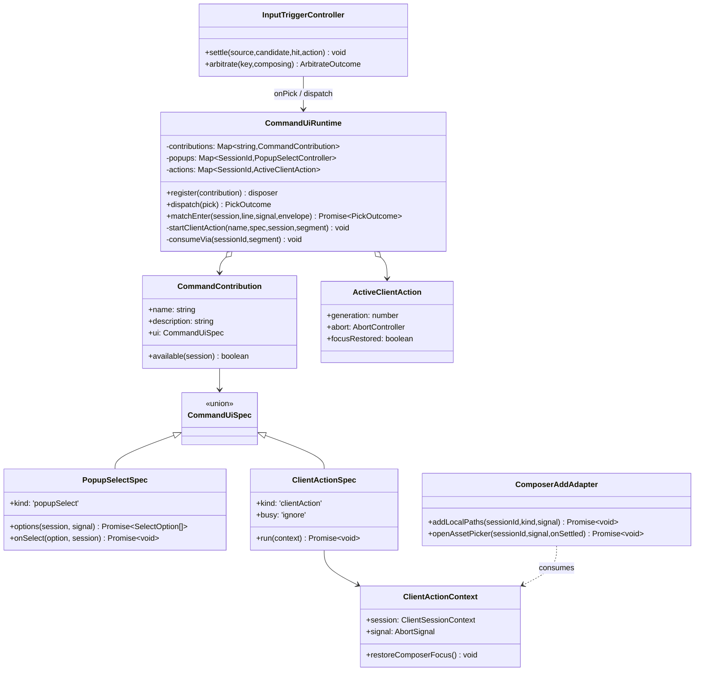
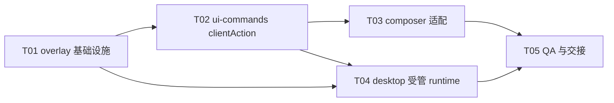

---

> 文件入口交互已按用户确认改为[页内本地路径面板](2026-09-06-composer-file-selection-integration.md)，替代本文的原生混选验收要求。clientAction、取消、会话身份和资产选择器约束继续适用。

title: "Composer 原生命令列表 clientAction 扩展增量设计"
id: "spec-composer-client-action-overlay"
type: "architecture-design"
status: "proposed"
authority: "L2"
date: "2026-09-05"
authors: ["高见远（Architect）"]
subsystem: "ui-commands / omnimux composer-add / desktop runtime"
related:
  - "docs/harness-pin.md"
  - "docs/specs/2026-09-05-composer-add-direct-trigger-prd.md"
  - "docs/specs/2026-09-05-composer-add-direct-trigger-design.md"
  - "docs/contracts/dev-pipeline.md"
  - "docs/contracts/plugin-git-pr.md"
---

# Composer「+」原生列表直达：正式 `clientAction` 扩展与最小 Host Overlay 设计

## 0. 结论、边界与已核实事实

**决策：淘汰 PR #558 中的 `menu-direct.js` DOM/MutationObserver/capture 路线；以官方 `@deepseek-ai/dsh-client-ui-commands` 增加一种客户端贡献 UI 类型 `clientAction`。** 命令仍由官方 `commandUi.register()` 合成至原生「+」命令列表，鼠标、触摸、菜单辅助激活和键盘 Enter 都进入同一 `dispatch()` 决策表；不再依赖菜单 DOM、文本、事件相位或合成 Escape。

此为跨包、公开客户端契约与官方 pin overlay 变更，风险为 **R1**：只能走老板人工合入，不自动 merge、不发布、不重启。

### 0.1 运行版本和源码证据

- 真正目标是 `/Applications/OmniMux Dev.app/Contents/Resources/app.asar.unpacked`，不是 `/Applications/DSH Desktop.app`。目标内 `@deepseek-ai/dsh-client-ui-commands` 为 `0.1.2-alpha.3`。
- 产品 pin 精确为 `dd6322d604e00eec1ba5e0c8541159906a21094a`（`docs/harness-pin.md:18-22`）；官方 clone 当前 HEAD 也为该 SHA，但已有他人遗留的 overlay diff 和未跟踪物，**工程不得把它们当作本任务成果或直接编辑安装包**。
- pin 的 `packages/client/ui-commands/src/client/service.ts:271-295`：所有 contribution 都无条件 `openPopup()`；`contract.ts:34-55` 只允许 `popupSelect`。
- pin 的 `packages/client/ui-input-trigger/src/client/controller.ts:484-510`：`onPick()` 后由官方 controller 统一停止 fetch、关闭菜单、处理结果。因此 `clientAction` 不需要也不得操作菜单 DOM；调用 action 后仍复用该关闭时机。
- pin 的 `packages/client/ui-conversation/src/client/skeleton/ConversationRoot.tsx` 对应产物逻辑仅把 `conversation.input.left/right` 渲染为附加项；不替换原生「+」。`toggleCommandMenu()` 通过 `inputTriggers.toggleSource('command', ...)` 打开正式命令源。新 source 也不会自动进入该命令列表。
- 裸 Host command 不可替代：`ui-commands/service.ts` 的 `runDetached()` 通过 `remote.commands.execute()` 调用 Host；`packages/commands/src/index.ts:301-372` 在 handler 前后持久追加 `command/run` 与 `command/done`。这会产生会话流日志，违反“无聊天噪音”。

### 0.2 不做

1. 不替换、装饰、监听或删除原生菜单 DOM；删除 `menu-direct.js`，不保留 MutationObserver/capture/Escape 兼容分支。
2. 不用 `conversation.input.left/right` 新增入口；它是额外控件位，不能满足“原生 + 列表”路线。
3. 不调用 Host `commands.execute`，不增加 `/command` 生命周期或聊天流节点。
4. 不升级 dsh pin / RC；因此不加载 `omnimux-rc-upgrade`。若随后有人改变 `docs/harness-pin.md`、官方 SHA 或 runtime 版本，必须另走该技能和完整升级报告。
5. 本设计不实施 workflow/products/publish 的 AssetPicker 接入；保留 PR #558 已有的 `kind:'any'` 业务价值和共享 picker 抽取。

---

# Part A：系统设计

## 1. 实现方案

### 1.1 方案比较

| 方案 | 结果 | 取舍 |
|---|---|---|
| PR #558 `menu-direct` | 淘汰 | 仅 primary mousedown 直达；Enter/辅助激活回 popup；依赖 role/text/DOM 与 observer，且合成 Escape 的时序会影响新 modal。 |
| `conversation.input.left/right` 图标 | 不采用 | 是正式槽位，但增加第二入口、改变工具栏，不满足原生列表内一步直达。 |
| Host bare command | 不采用 | 正式 API，但必经 `remote.commands.execute` 与 `command/run`/`command/done` 持久化。 |
| **`commandUi.clientAction`** | **采用** | 最小 pin overlay；扩展官方 dispatch 决策表，保留原生列表、键鼠统一、无 Host command。代价是每次 pin 升级都必须对 overlay 和该契约回归。 |

### 1.2 新正式类型与注册契约

命名采用 **`clientAction`**：它描述“由客户端拥有、无二级 popup、非 Host command 的异步交互动作”，避免把 `direct` 误解为 DOM 事件策略或把 `action` 与 Host command handler 混淆。

在 `packages/client/ui-commands/src/client/contract.ts` 中，将 `CommandUiSpec` 从单一 `popupSelect` 判别联合改为：

```ts
export type CommandUiSpec = PopupSelectSpec | ClientActionSpec

export interface ClientActionSpec {
  readonly kind: 'clientAction'
  /** 同一 session 内动作未结算时，菜单重入不再启动第二个实例。 */
  readonly busy?: 'ignore' // 当前唯一允许值；缺省 'ignore'
  run(context: ClientActionContext): void | Promise<void>
}

export interface ClientActionContext {
  readonly session: ClientSessionContext
  readonly signal: AbortSignal
  /** 仅在本 action 仍为该 session 的当前动作且没有新交互接管时聚焦 composer。 */
  restoreComposerFocus(): void
}

export interface CommandUiCapabilities {
  readonly clientAction: true
}

export interface CommandUiContract {
  readonly capabilities: CommandUiCapabilities
  register(contribution: CommandContribution): () => void
  decorate(decoration: CommandDecoration): () => void
  bindComposerFocus(sessionId: ClientSessionContext['sessionId'], focus: () => void): () => void
}
```

约束：

- `run()` 接收**当前 pick 的 session projection**，没有全局活动会话查询；composer-add 因此取 `context.session.sessionId`，消除 PR #558 的 `getActiveSessionId()` 竞态。
- `run()` 可异步。未处理 rejection 被 runtime 捕获并通过既有 `noticeFor(sessionId, 'error', ...)` 通知；不抛到 React 事件循环，不产生 Host command 日志。
- `signal` 在会话 scope/runtime dispose 时 abort。动作实现必须把取消视作无副作用路径，不显示错误 toast。
- runtime 以 `Map<SessionId, ActiveClientAction>` 持有每个 session 的 `AbortController`、focus 资格和 Cordis effect disposer。同 session busy 时 `busy:'ignore'` 直接返回 `handled`；统一 controller 已关闭菜单，故不会启动第二个 picker/modal。action resolve/reject/abort 都会结算 disposer，避免 effect wrapper 随操作累积到 session 结束。
- `restoreComposerFocus()` 只在该 action 仍为 current、未 abort、有 focus 资格且尚未调用时生效。后来的同 session popup 会撤销旧 action 的 focus 资格，因此旧 action 结算后不会抢回焦点。`ui-conversation` 的 `ComposerKeyboard.bindComposerFocus()` 把该 hook 接到 InputBar 已有的 Lexical `getRootElement().focus({ preventScroll: true })` 与 selection reveal 路径；runtime 不猜测 textarea/DOM。native picker 的 Promise 在取消/完成后调用；AssetPicker 的 `onClose`/完成回调调用。
- token 消费为 runtime 的责任，不是插件 action 的责任：**在开始 `clientAction` 前**按 menu `span` / bare-enter `token` 调用已有 `consumeVia()`。这与 Host bare command 的草稿 token 清除语义一致，并保持 “+” 空 span 安全 no-op。若 CAS miss，仍执行 UI action（命令是菜单中已选定的一项）；不能因陈旧 draft 让用户点按无响应。
- 菜单关闭仍由 `InputTriggerController.settle()` 在 `onPick()` 返回后统一完成（该逻辑已适用于所有来源）；`clientAction` 不合成 Escape、不派发 outside pointer、不改 DOM。
- `register()`/`decorate()` 继续返回 fiber disposer；runtime dispose 将 abort 并删除活动 action。旧 `popupSelect`、`decorate`、`leadingInput`、host execute 的决策分支字节语义不变。
- composer-add registration 自己持有 lifecycle signal。其 disposer 先 abort 该 registration 的 file request 或 library owner，使旧 runtime action 结算并释放 busy；新 registration 使用新的 signal，不能被旧 disposer 中止。
- `capabilities.clientAction === true` 是插件声明这两条 `clientAction` 的唯一准入条件。旧 runtime 缺少该能力时，两条均不注册；绝不声明为 `popupSelect` 或走菜单二级回退。插件仅显示一次本地、非聊天、非模态的运行时更新提示。当前 Host 未暴露可靠 build/version 标识，提示保守地按 origin 去重一次；运行时升级并重新加载后能力重新读取，条目自动恢复注册。

### 1.3 Runtime dispatch 变化

`dispatch()`、`matchEnter()` 都使用同一个私有 `startClientAction(name, spec, session, segment)`；只有 `ui.kind === 'clientAction'` 进入它。该 helper：

1. 检查该 session 是否已有 active action；busy 时返回 `handled`。
2. 调 `consumeVia()` 消费当前菜单 span / bare token。
3. 分配 generation + AbortController 并登记 active state。
4. 同步调用 `spec.run(context)`；通过 `Promise.resolve()` 结算。
5. resolve 后仅删除同 generation 的 active entry；reject 后若非 abort，走已有 `noticeFor`，再删除；绝不调用 `remote.commands.execute`。

对于 `dispatch()` 的 menu 入口，返回 `handled`，随后 input-trigger controller 关闭菜单。对于 `matchEnter()` 的 bare `/add-file`，同样调用相同 helper，因此**鼠标、Enter、辅助点击（MenuView 的 mousedown）、触摸等不再分叉**。旧 Host/旧 runtime 缺少 `capabilities.clientAction` 时，插件不注册两条命令，不能把同一二进制降级为二级选择菜单。

### 1.4 Composer-add 适配

`plugins/omnimux/src/client/composer-add/commands.js` 保持两个 `commandUi.register()` 条目、名字、描述和 fuzzy-search 不变，唯将 `ui` 换为：

- `add-file`: `{ kind:'clientAction', run: ({ session, signal, restoreComposerFocus }) => addLocalPaths(session.sessionId, 'any', signal).finally(restoreComposerFocus) }`。
- `add-from-library`: `{ kind:'clientAction', run: ({ session, signal, restoreComposerFocus }) => openLibraryPicker({ sessionId, signal, onSettled: restoreComposerFocus }) }`。

实现重构要求：

- `install.js` 导出/注入 session-bound action factory，而不是读取 `currentSessionId(store)`；仅 legacy window custom events 如仍被其他代码使用才保留该查找，且在本 PR 移除前应有引用检索证明。
- `addLocalPaths` 在 `await requestJson()` 前后读取 `signal.aborted`；取消 picker（`paths=[]`）不 materialize、不 toast、不写 AttachmentStore；abort 不 toast。
- AssetPicker modal state 必须按 action generation/session 绑定；另一个动作、scope dispose 或 signal abort 时仅关闭**本动作拥有的 modal root**，不影响后来打开的 modal。渲染以 action revision 为 key，跨 session replacement 会重置 selected/busy/error。确认请求返回后再次核验 owner；关闭或 Escape 后的延迟响应不得写 AttachmentStore、关闭或 resolve 后来打开的 action。`onConfirm` busy 保留；重复确认不重复 instantiate。
- `AssetPicker` 共享组件、`picker-model`、assets picker `kind:'any'` 留在 PR #558；它们不是本 Host overlay 的职责。

### 1.5 真实 overlay 文件、出口与测试位置

**产品仓（唯一交付记录）**：

```text
patches/dsh-0.1.2-alpha.3/
  llm-quota-priority.patch                         # 保持原样
  ui-commands-client-action.patch                  # 新增：唯一正式 Host overlay
scripts/
  apply-harness-overlay.sh                          # 修改：仍按 pin 顺序 apply；输出正确 desktop-fork 提示
  reset-harness-overlay.sh                          # 修改：恢复 ui-commands 和 conversation focus seam tracked 文件
plugins/omnimux/src/client/composer-add/
  commands.js                                      # popupSelect -> clientAction
  install.js                                       # session-bound action + abort/focus ownership
  menu-direct.js                                   # 删除
  menu-direct.test.js                              # 删除
  commands.test.js                                 # 新增/扩展 clientAction registration 测试
  install.test.js                                  # session/busy/cancel/no-side-effect 测试
```

**官方 pin clone（只作为 patch 生成与验证目标，不能作为交付）**：

```text
packages/client/ui-commands/src/client/contract.ts # ClientActionSpec/Context 判别联合
packages/client/ui-commands/src/client/service.ts  # active action registry + dispatch/matchEnter helper
packages/client/ui-commands/src/client/index.ts    # 导出新 type
packages/client/ui-commands/tests/service.client.spec.ts
                                                    # menu/Enter、consume、busy、abort、error、legacy matrix
packages/client/ui-conversation/src/client/contract/input.ts
packages/client/ui-conversation/src/client/input/facade.ts
packages/client/ui-conversation/src/client/input/hub.ts
packages/client/ui-conversation/src/client/skeleton/InputBar.tsx
                                                    # formal ComposerKeyboard -> InputBar focus binder
```

不改 `ui-input-trigger`：它已在 `settle()` 中统一关闭菜单；`ui-conversation` 仅增加 formal focus binder，不改 `toggleSource('command')`；不改 `dsh-commands`：避免 lifecycle 记录。

### 1.6 Patch 生成、apply/reset 与可复现验证

1. 从干净、精确 pin 的官方 clone 工作；当前默认 clone 已有其它任务的改动和大量未跟踪文件，工程应使用隔离 clone/worktree 或先由拥有者恢复，**不可 reset/clean 别人的现场**。
2. 在官方 clone 完成上列 ui-commands 与 conversation focus seam 的最小改动与 package 定向测试；用精确 pin 基线生成 `patches/dsh-0.1.2-alpha.3/ui-commands-client-action.patch`。patch 不应含 lockfile、构建产物或其它包。
3. 在干净相同 SHA clone，执行产品仓 `DSH_SRC=<clone> ./scripts/apply-harness-overlay.sh`：必须同时 `git apply --check`、真正 apply 成功；第二次运行应报告 already applied；`git diff --check` 通过。
4. 运行 `DSH_SRC=<clone> ./scripts/reset-harness-overlay.sh`：必须恢复 quota overlay **和**全部 ui-commands/conversation overlay 路径；再验证 `git diff --exit-code`（忽略受批准的非 overlay 本地文件）与 `git apply --reverse --check` 的预期状态。现有 reset 脚本只列 quota 文件，未覆盖 UI 文件；本任务必须补齐，否则不可逆。

### 1.7 Desktop-fork 到真实 Dev45120 的部署结论

现有产品仓 overlay 脚本只改一个官方 clone；**它不能把改过的 `@deepseek-ai/dsh-client-ui-commands` 送入 `/Applications/OmniMux Dev.app`**。

桌面 fork 的实际链路是：

```text
pinned deepseek-harness source
  -> yarn upstream:install / upstream:build:official / upstream:pack:dsh
  -> deepseek-harness/dist/npm/*.tgz
  -> node scripts/sync-vendored-runtime.mjs --write
  -> vendor/dsh-runtime/0.1.2-alpha.3 + manifest + package.json resolutions
  -> corepack yarn install --immutable
  -> yarn omnimux:stage (产品插件 preset 快照)
  -> yarn package:dir / 发布构建
  -> /Applications/OmniMux Dev.app（获准安装并启动后加载）
```

证据：fork `package.json:315-320` 定义受管 upstream/runtime 命令；`scripts/sync-vendored-runtime.mjs:65-131` 从 `deepseek-harness/dist/npm` 写 tarball、manifest 和 resolutions；desktop `module-resolution.ts:47-140` 与 `profile.ts:495-525` 让 Host/Client 都按 Desktop/Profile semver overlay 解析；`stage-preset-profile.ts` 只物化产品插件，不能物化官方 runtime overlay。

**阻断/决策点：**产品仓对该 desktop-fork runtime 再物化没有现成 `yarn omnimux:*` 一键入口。工程需要在 fork 新增一个受管的、可测试的 `yarn omnimux:runtime-overlay`（命名待 fork owner 确认）或把等价步骤并入已有受管 `upstream:prepare-runtime` 流程；它必须：检查 pin SHA、在临时/隔离 upstream tree apply 产品 patch、官方 build/pack、同步 vendored runtime、执行 `check:vendored-runtime`，并拒绝不匹配 pin。由于这是**跨仓 desktop-fork 变更**，需要老板/desktop-fork owner 的额外授权和独立工作树/PR；本 Issue 的插件 PR 不应偷带 desktop-fork 实现。

获授权并构建新 Dev App 前，真实 `/Applications/OmniMux Dev.app` 仍加载旧官方 artifact。client bundle/runtime 变化不能靠 `yarn omnimux:sync` 物化；该命令只构建/物化产品插件。新 app artifact 安装及 Host/runtime 启动须先取得具体 Dev 目标和操作窗口的授权；获准后由 Agent 通过官方入口执行并收集验收证据。未获放行时，不替换 App、不启动或重启共享 Dev，也不新起替代 server。

### 1.8 PR #558 增量改造与回滚

远端已核实：PR **#558** 是 OPEN、DRAFT，base `main`，head `agent/omnimux-composer-add-direct-trigger-issue-554`，HEAD `6ea300b4e53dd12aa98c651c22a81af62c7efff6`；包含 `menu-direct.js`、AssetPicker 共享抽取和 `kind:'any'`。

建议切分为两条明确依赖的 PR（均不自动合）：

1. **Host overlay / desktop runtime PR（R1，先合）**：产品仓 patch、apply/reset 契约和受管 desktop-fork runtime overlay 能力（跨仓部分按其 own PR）；不改变插件 `commands.js` 运行声明。它可被独立测试并不会改变用户功能。
2. **PR #558 rebased 插件 PR（R1，后合）**：保留 AssetPicker、assets `kind:'any'`、业务 tests；删除 `menu-direct.js`/tests/import；将两项 command UI 改为 `clientAction`；增加 composer session/busy/cancel tests。该 PR 只在 `commandUi.capabilities.clientAction === true` 时注册两条命令，旧 runtime 保持无入口并显示一次本地更新提示。

回滚顺序反向：先移除插件的 `clientAction` 条目，再从 desktop runtime manifest/release 中移除 `ui-commands-client-action.patch` 并重建 artifact。禁止在安装包目录手改 `lib/client.js`；只有 git patch + 已构建 artifact 是可审计回滚物。

## 2. 数据结构与接口



## 3. 调用流程

```mermaid
sequenceDiagram
  autonumber
  participant U as 用户（鼠标/Enter/辅助激活）
  participant M as 原生 + / InputTriggerController
  participant C as CommandUiRuntime
  participant A as ComposerAddAdapter
  participant H as OmniMux Host assets routes
  participant S as AttachmentStore

  U->>M: 打开原生 command 菜单，选择 add-file / add-from-library
  M->>C: onPick(pick) 或 matchEnter(session, bare token)
  C->>C: 查 contribution.ui.kind === clientAction
  C->>C: consumeVia(span/token); 建 active AbortController
  C->>A: run({session, signal, restoreComposerFocus})
  C-->>M: handled
  M->>M: stopFetch + close 原生菜单（官方统一路径）

  alt add-file
    A->>H: POST /omnimux/assets/pick {kind:'any'}
    H-->>U: 原生系统选择面板
    U-->>H: 选择路径或取消
    alt paths nonempty 且未 abort
      A->>H: POST /omnimux/composer/attachments/materialize
      A->>S: addAttachment（配额/去重沿用）
    else cancelled / aborted
      A->>A: 无 materialize、无 toast、无写入
    end
  else add-from-library
    A->>A: 打开本 action 拥有的 AssetPicker
    U->>A: 确认 / 取消 / Esc
    alt confirm
      A->>H: instantiate
      A->>S: addAttachment
    else cancel / abort
      A->>A: 无写入
    end
  end
  A->>C: Promise settle
  opt action 仍 current 且没有新交互接管
    A->>C: restoreComposerFocus()
    C->>M: 已注册 focus hook 聚焦 composer
  end
```

## 4. 未决事项和假设

1. **需要决策/授权（阻断真实 Dev45120）**：desktop-fork owner 是否授权新增受管 runtime-overlay 命令或扩展 `upstream:prepare-runtime`。没有它，产品 patch 可设计/测试但不能可复现进入 Dev App artifact。
2. `clientAction` 的 Enter 语义定为和鼠标一致的直达。旧 runtime 缺能力时不注册入口，因此不存在 Enter 的二级菜单降级路径。
3. `restoreComposerFocus()` 由 action 拥有者在其 modal/native picker 完整结算后调用；runtime 不做延时自动 focus。InputBar 通过 `ComposerKeyboard` 的正式 binder 接收实际 Lexical focus；不能让 command runtime 以 DOM 猜测。
4. `clientAction` 首期仅支持 contribution 和 decoration 的 bare 入口；本 Issue 只需 contribution。是否允许 decoration 复用应由 Host overlay PR 在测试矩阵覆盖后决定；默认实现建议两者同样支持，因为 `CommandUiSpec` 已共享，且不会影响 `leadingInput` 分支。

# Part B：工程任务分解

## 5. 需要的包

无新增第三方依赖。使用现有 `@deepseek-ai/cordis`、`AbortController`、React/ReactDOM 和项目现有测试工具。

## 6. 有序任务列表

### T01 — 项目基础设施：可复现 overlay 资产与 pin 守卫（P0）
- **源文件**：
  - `docs/harness-pin.md`（只补 overlay 名单/验证说明；不改 SHA/version）
  - `patches/dsh-0.1.2-alpha.3/ui-commands-client-action.patch`（新增）
  - `scripts/apply-harness-overlay.sh`（修改）
  - `scripts/reset-harness-overlay.sh`（修改）
  - `docs/specs/2026-09-05-composer-add-client-action-overlay-design.md`（本文）
- **依赖**：无。
- **内容**：建立 patch 生成/顺序 apply/幂等 apply/reset 的合同；reset 显式覆盖 ui-commands 与 conversation focus seam；修正脚本遗留的 retired `omnimux-desktop` 提示为 `omnimux-desktop-fork`。
- **验收**：干净同-SHA clone 上 apply → second apply → reset 的 exit 0；`git diff --check`；pin 不变。

### T02 — 官方 ui-commands `clientAction` 契约与 runtime（P0）
- **源文件（在临时官方 clone，最终只以 T01 patch 交付）**：
  - `packages/client/ui-commands/src/client/contract.ts`
  - `packages/client/ui-commands/src/client/service.ts`
  - `packages/client/ui-commands/src/client/index.ts`
  - `packages/client/ui-commands/tests/service.client.spec.ts`
- **依赖**：T01（最终 patch 落盘）。
- **内容**：新增判别类型、session-scoped abort/busy/focus API、统一 menu/Enter dispatch；保留 popup/decorate/leadingInput/Host bare command 分支原样。conversation 的最小 binder 把 focus hook 接到 InputBar 现有 Lexical focus。
- **验收**：官方 ui-commands 定向测试包含 menu、Enter、token consume、busy ignore、scope dispose abort、async error notice、effect disposer、popup 接管 focus guard，以及旧决策表全回归。

### T03 — Composer 适配与 PR #558 DOM 路线移除（P0）
- **源文件**：
  - `plugins/omnimux/src/client/composer-add/commands.js`
  - `plugins/omnimux/src/client/composer-add/commands.test.js`（新增/修改）
  - `plugins/omnimux/src/client/composer-add/install.js`
  - `plugins/omnimux/src/client/composer-add/install.test.js`
  - `plugins/omnimux/src/client/composer-add/menu-direct.js`（删除）
  - `plugins/omnimux/src/client/composer-add/menu-direct.test.js`（删除）
  - `plugins/omnimux/src/client/components/asset-picker/*`（保留 PR #558 共享逻辑，仅按需要补 abort ownership test）
  - `plugins/omnimux-assets/src/picker.js`、`src/http-routes.js` 及其 tests（保留 `any`）
- **依赖**：T02。
- **内容**：动作直接使用 context session，native/asset picker 都遵守 abort、busy、focus owner；保留原生列表、名称、搜索与 AttachmentStore 单一写入管线。
- **验收**：无 `menu-direct` import/file；无 MutationObserver；同 action 双击只产生一次 picker/instantiate；cancel/abort 无 materialize/instantiate/store 写入；共享 picker 配额/去重不退化。

### T04 — 受管 desktop runtime overlay 能力（P0，跨仓、需额外授权）
- **源文件（`/Users/x/Desktop/Project/omnimux-desktop-fork` 独立 worktree/PR，路径以 owner 最终命名为准）**：
  - `package.json`
  - `scripts/omnimux.mjs` 或新受管 runtime-overlay orchestrator
  - `scripts/sync-vendored-runtime.mjs`
  - `dsh-plugin-desktop/tests/<runtime-overlay>.spec.ts`（新增）
  - `docs/contracts/<runtime-overlay>.md`（新增/修改）
- **依赖**：T01、T02；另需 desktop-fork owner 授权。
- **内容**：把精确 pin + 产品 patch + official build/pack + vendored runtime sync 串成一个受管、可验证命令；不手 cp/rsync，不操作 `/Applications`，不重启。
- **验收**：临时输入树的 SHA mismatch 拒绝；有效 patch 构建 tarball 后 `yarn check:vendored-runtime` 通过；artifact manifest 记录正确 SHA；不改变生产 profile。

### T05 — 集成、L2/Dev45120 QA 与 PR 交接（P0）
- **源文件**：
  - `docs/evidence/live-qa-report.json`（`pnpm verify:live` 默认报告；现有未跟踪 `docs/evidence/issue-554/` 必须保留）
  - `docs/evidence/issue-554/*`（QA 截图/DOM 工件）
  - `.workbuddy/pr-board.md`（本机不提交，按合同更新）
- **依赖**：T03；真实 Dev45120 部署另依赖 T04 和已构建/用户手动重启的 Dev App。
- **内容**：先在未合并 worktree 的 L2 任务环境做浏览器验收；合并后才物化公共 Dev。45120 的 live 检查是交付硬门槛，L2 不替代它。
- **验收**：以下 QA 矩阵、`pnpm verify:live <stage>`、认证的内置浏览器 DOM/截图证据全部齐全；没有任何自动 merge/production sync/restart。



## 7. Shared Knowledge（给工程/QA）

- action 绝不使用 `remote.commands.execute`；任何出现 `command/run`/`command/done` 的测试或真机 session log 都是 P0 回归。
- 官方 controller 自己关闭菜单：禁止菜单 selector、MutationObserver、capture listener、synthetic Escape/outside pointer、`remove()`。
- 任何 Host/client source patch 只可经 `patches/dsh-0.1.2-alpha.3/ui-commands-client-action.patch` 交付；官方 clone 和 `/Applications/.../app.asar.unpacked` 都不是编辑目标。
- 当前 `reset-harness-overlay.sh` 的 hard-coded quota 文件清单必须随新增 patch 扩展到 ui-commands 与 conversation focus seam；否则 “apply/reset” 不是可逆合同。
- 客户端 code 改动不等于 45120 可见：产品同步只物化插件；runtime overlay 需要桌面 fork 的 build/pack/vendor 链路并由用户手动重启新 artifact。
- PR #558 中 `AssetPicker` 与 `kind:'any'` 可保留；唯 `menu-direct` 及其 pointer-only 逻辑必须删除。

## 8. QA 矩阵（硬门禁）

| 面 | 用例 | 期望证据 |
|---|---|---|
| 旧命令 | 普通 contribution popupSelect、decorate host bare、leadingInput、Host bare command | ui-commands unit matrix；旧分支行为无变；Host bare 仍有 lifecycle（作为对照） |
| 旧 runtime | `capabilities.clientAction` 缺失 | 两条 composer-add 命令均不注册；仅一次本地非聊天、非模态运行时更新提示；无 popupSelect options 异常 |
| 新鼠标路径 | 「+」→add-file / add-from-library，用鼠标主键、触摸/辅助点击 | 原生菜单立即关闭；目标系统 picker/modal 一次出现；无 popupSelect |
| 新键盘路径 | 方向键选中两条、Enter；裸 `/add-file` Enter | 与鼠标同一 `clientAction`，无 popup；没有 second code path |
| 无聊天噪音 | 每个 clientAction 成功、取消、失败 | session/event 与 UI 无 `command/run`、`command/done`、无 flow node |
| token/焦点 | slash token、+ 空 span、native picker cancel、AssetPicker Esc、随后立即打开另一 modal/panel | token CAS 已消费；仅原 action current 时恢复焦点；不关闭/抢焦新 UI |
| 取消与异常 | Abort、scope dispose、HTTP/network reject、501 picker unsupported | abort/cancel 零 materialize/instantiate/store；非 abort 一个受控 notice/toast；无 unhandled rejection |
| busy/重复 | 双击、重复 Enter、mouse+Enter 连续、确认双击、确认请求挂起后 Escape→重开→旧响应返回、registration 热重载 | 每 session/action 只开一个 picker；每确认最多一次 instantiate；旧响应不写 tray、不关闭或结算新 action；旧 registration 结算，新的 registration 不受 abort；busy 清理后才允许下一次 |
| 业务回归 | `kind:'any'` 请求、8 配额、alreadyIds、重复指纹、asset 选 1/多选 | `kind:'any'` 仅验证请求和 materialize 管线；macOS 文件/目录混选需独立原生 picker 证据，未通过前不可作为验收；quota/duplicate 汇总和 Picker disabled/busy 正确 |
| overlay 可逆 | apply / already apply / reset | 临时干净 pin clone exit 0、diff check、无手改安装包 |
| L2 + 45120 | 认证的内置浏览器 + `pnpm verify:live <stage>`；合并后的 Dev45120 browser + live evidence | L2 是 PR 前验证；**45120 report、DOM/snapshot/screenshot 是最终硬门禁，L2 不替代** |

---

## 9. 交接结论

在没有 desktop-fork 受管 runtime overlay 能力及相应授权前，本设计可完成源码/patch 测试，却**不能宣称已可部署到真正 Dev45120**。这不是模糊未知：缺口具体是“将产品 patch 编译并 vendor 到桌面 runtime tarballs”的受管链路。应由主理人向 desktop-fork owner 请求 T04 跨仓授权；其余 T01–T03 可先在隔离 worktree 中推进，且不应触碰主仓 `main`、正式 profile、安装包或任何 App restart。
