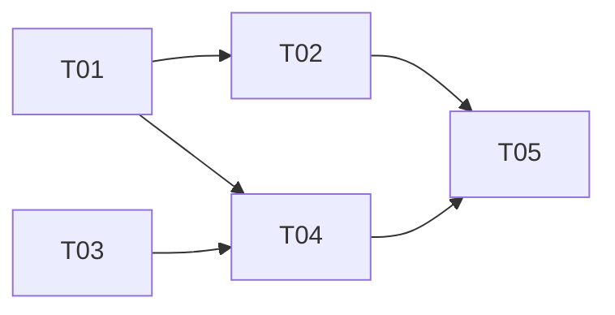

# 系统设计：Composer「+」命令直达触发 + 资产库选择器共享组件化

- **Language**: 中文（zh-CN）
- **归属插件**: `plugins/omnimux`（composer 侧）、`plugins/omnimux-assets`（native picker 侧）
- **状态**: superseded（历史 capture 路线；现行方案见 `2026-09-05-composer-add-client-action-overlay-design.md`）
- **日期**: 2026-09-05
- **上游档案**: [2026-09-05-composer-add-direct-trigger-prd.md](2026-09-05-composer-add-direct-trigger-prd.md)（增量 PRD）、[2026-09-04-composer-add-file-assets-prd.md](2026-09-04-composer-add-file-assets-prd.md)（基线 PRD）
- **架构师**: 高见远（Gao）

---

## 0. 路线确认（PRD §7/Q1）

**历史路线 B：capture 拦截直达。** 该路线已由正式 `clientAction` overlay 取代，以下内容只保留设计沿革，不作为实现指引。

1. 老板要求「点击即直达」且「命令列表保持现状」，A（纯官方 popup）不满足，C（input.left 插槽加图标）改变工具行视觉、引入双入口心智，非老板所求。
2. B 的技术可行性有双重实证：
   - 我们此前对官方「+」按钮做过 capture 拦截（`add-button.js`，commit `dddc358`，后于 `ba66c8a` 移除），关键经验已沉淀：**文档级 capture 不足以拦官方 React 合成事件，必须把监听器直接绑到目标按钮上**（本设计沿用此手法）。
   - 官方菜单行的 pick 绑定在 **`onMouseDown`**（`dsh-client-ui-input-trigger/lib/client.js` MenuView，见 §1.2），事件面清晰、可在 capture 阶段完整拦截。
3. 兜底零成本：拦截的语义是「命中才 stopPropagation」，未命中时官方 dispatch → popupSelect 链路**天然不受干扰**（`commands.js` 零改动），键盘 Enter 路径自动回落现状。

`kind: 'any'` 仅请求 `public.folder` 与 `public.data` 的 UTI union。macOS 是否在同一原生面板中接受文件与文件夹的混选尚无可复核证据；此 native picker 门禁未通过前，不得宣称一步混选可用。

---

## 1. 实现方案

### 1.1 核心技术挑战与对策

| # | 挑战 | 对策 |
|---|---|---|
| C1 | 官方 dispatch 对贡献一律 openPopup，无「点击即执行」贡献类型 | 不动官方包；在我们条目的**指针事件**上 capture 拦截，直达后吞掉事件，popup 永不触发 |
| C2 | 菜单行 DOM 属于官方包（哈希 class、无业务属性），识别要稳 | 三级选择器（稳定 id 前缀 → role/listbox 结构 → 本地化文案），见 §1.2 |
| C3 | React 18 根委托：文档级 capture 历史上拦不住官方 onClick | **直接绑定到匹配到的菜单行按钮**（MutationObserver 发现即绑），mousedown + click 双事件 capture |
| C4 | 拦截成功后官方菜单仍保持 open 状态（官方 dismiss 只发生在 pick / Esc / 外部 pointerdown） | 直达动作前合成 `Escape` keydown 关闭菜单；失效降级为菜单外合成 pointerdown |
| C5 | 官方升级导致选择器失效 → 静默回归 | 选择器三级降级 + 首绑成功/失败 debug 埋点 + 失效即天然回落 popup（用户无感）；纳入 RC 升级 checklist（§8） |

### 1.2 官方菜单 DOM 事实（侦察结论，pin 版本）

真源：`/Applications/DSH Desktop.app/.../@deepseek-ai/dsh-client-ui-input-trigger/lib/client.js`（914 行，MenuView 在 ~745–862 行）。

```
div[role="listbox"][aria-label="触发候选建议"]          ← .menu（绝对定位于 conversation.input.overlay 槽内）
└─ div.viewport
   └─ div[data-source="command"].groupTitle           ← 组标题「命令」
   └─ button#dsh-slash-option-command-{index}          ← 每个候选一行
        [type="button"][role="option"][aria-selected]
        onMouseDown = preventDefault() + onPick(source, index)   ← ★ pick 在 mousedown
        ├─ span.itemIcon?   (icon)
        ├─ span.itemName    → textContent = 命令名（我们的贡献 = "add-file" / "add-from-library"）
        └─ span.itemDescription? → 本地化描述（"添加文件或文件夹" / "从资产库添加"）
```

关键事实：

- 菜单容器及其行都挂在 `[data-composer-card]` 之下（MenuView 的外部 pointerdown dismiss 逻辑以 `closest("[data-composer-card]")` 判断，证明菜单在 composer card 内）。
- commandUi 贡献合成的候选 source 恒为 `"command"`，行 id 为 `dsh-slash-option-command-{index}`（index 随模糊搜索结果变化，**不可**用于识别）。
- `itemName` 渲染的是候选 `name`，即 `commandUi.register({ name: 'add-file' })` 的英文 id——**这是最稳定的锚点**（我们自己控制、不本地化、不随主题变化）。
- 键盘路径：方向键/Enter/Esc 由 composer textarea 的 keydown 路由进 `InputTriggerController.arbitrate()`，Enter → `pick()` → `dispatch()` → openPopup。**我们不碰 keydown**，键盘兜底自动成立。

### 1.3 拦截模块设计（`menu-direct.js`）

新增 `plugins/omnimux/src/client/composer-add/menu-direct.js`，职责：**发现官方命令菜单中我们的两行 → 直接绑定 capture 监听 → 命中即直达**。

```
installMenuDirect(doc, { onAddFileFolder, onAddLibrary, t? }) → dispose()
```

**（a）行匹配器（三级降级，命中一级即停）：**

```js
// 第一级（主锚）：稳定 id 前缀 + 命令名文本
'[data-composer-card] button[role="option"][id^="dsh-slash-option-command-"]'
//   → row.querySelector('span')?.textContent === 'add-file' | 'add-from-library'
// 第二级（id 模式失效时）：listbox 结构 + 命令名文本
'[data-composer-card] [role="listbox"] button[role="option"]'
//   → 同上按首个 span 文本匹配命令名
// 第三级（命令名渲染也变化时）：本地化描述文本匹配
//   → 行 textContent 包含 t('composerAdd.addFile') / t('composerAdd.fromLibrary')
//     （同时内置 zh+en 两份静态文案，防 t 缺失）
```

**（b）绑定机制（沿用 `add-button.js` 历史手法）：**

- `MutationObserver`（`document.body`, `{subtree:true, childList:true}`）：菜单是惰性渲染的（open 时才挂载 DOM），每次子树变化扫描匹配行。
- 对匹配行执行 `bindRow(row, action)`：`row.addEventListener('mousedown', handler, {capture:true})` + 同样 capture 绑定 `click`（防御官方将来把 pick 挪到 click）。幂等标记 `__omnimuxDirectBound`。
- 菜单关闭时行被卸载，监听器随 DOM 回收，无需显式解绑；dispose 时停 observer 并对已绑行解绑（行还在的话）。

**（c）拦截时序与互斥：**

1. 用户 mousedown 命中我们的行 → capture handler 先于官方 React `onMouseDown` 执行。
2. `event.preventDefault(); event.stopPropagation(); event.stopImmediatePropagation();` → 官方 `onPick` 不触发 → **popupSelect 永不开**，互斥成立。
3. 合成关闭菜单：向 `document.activeElement`（此时焦点仍在 composer textarea，官方 onMouseDown 有 preventDefault 保焦点，我们也 preventDefault 保持同语义）派发 `KeyboardEvent('keydown', {key:'Escape', bubbles:true})` → 官方 `arbitrate('escape')` 关闭菜单。**降级**：若 100ms 后菜单仍在（`[role="listbox"]` 仍存在），在 `document.body` 上派发合成 `pointerdown`（菜单外）触发官方 outside-dismiss。
4. 执行直达动作（见 §1.4 / §1.5）。

**（d）未命中 = 官方行为零干扰**：handler 只在行匹配我们的两个命令名时存在；其它行、右键、辅助技术触发、键盘 Enter 全部走官方原路径。选择器整体失效 = 没有任何行被绑定 = 现状 popup，用户无感，debug 日志记录 `menu-direct: no-row-bound`。

### 1.4 「添加文件或文件夹」直达：picker `kind: 'any'`

**Host 侧（`plugins/omnimux-assets`）：**

- `src/picker.js`：
  - `PROMPTS.any = '选择要添加的文件或文件夹'`；
  - `pickScript('any')` 生成 `choose file of type {"public.folder", "public.data"} with prompt "..." with multiple selections allowed`，但该 UTI union 的单面板混选行为仍待原生实测；
  - `pickNativePath` kind 白名单 `['file', 'directory', 'any']`。
- `src/http-routes.js` `/omnimux/assets/pick`：kind 解析由 `body.kind === 'file' ? 'file' : 'directory'` 改为显式白名单 `{file, directory, any}`，非法值抛 `PickerError('picker-invalid-kind')`（400 映射已存在）。

**Client 侧（`plugins/omnimux`）：**

- `composer-add/install.js` `addLocalPaths(sessionId, kind)`：kind 白名单扩为 `'file' | 'directory' | 'any'`，`'any'` 直通 `/omnimux/assets/pick`。
- 直达动作请求 `addLocalPaths(sessionId, 'any')`；在 native picker 门禁通过前，不把结果描述为单面板混选。
- popup 兜底层（`commands.js`）**零改动**：仍提供「选择文件…」（file）/「选择文件夹…」（directory）两行。
- 后续 `/omnimux/composer/attachments/materialize` 管线不变（PR #523 已支持文件+目录混合入参）。

### 1.5 「从资产库添加」直达

- 直达动作 `onAddLibrary` = 置 `state.libraryOpen = true; renderModal()`（install.js 既有逻辑原样复用），只是触发源从 popup onSelect 换成菜单行 capture 拦截。
- 弹窗本体改为共享组件 `AssetPicker`（§2），composer 侧经薄适配层调用，对外行为零变化。

### 1.6 埋点（P1-2）

install.js 现有 `console.debug('[omnimux:composer-add]', ...)` 基础上，直达/兜底分流埋点：

- `menu-direct: bound`（首绑成功，含选择器级别 1/2/3）
- `menu-direct: no-row-bound`（菜单出现但未匹配，降级信号）
- `menu-direct: intercept { command: 'add-file' | 'add-from-library' }`（直达触发）
- `add-results` 既有日志增加 `{ path: 'direct' | 'popup-fallback' }` 字段。

（仓内尚无 `composer_add_*` 结构化埋点事件，本期以 debug 日志 + 字段分流落地，正式 metrics 事件流另立项。）

---

## 2. 共享组件 AssetPicker 设计

### 2.1 落位与归属（PRD Q3）

落位 **`plugins/omnimux/src/client/components/asset-picker/`**（hub 内新建 shared client 目录；仓内此前无 `components/` 目录，本次建立先例）。理由：

- 本期唯一消费方是 hub 自己（composer），放 hub 内最直接、零包治理成本。
- PRD §4.3 场景 2/3（workflow / products 等跨包消费）本期**只定契约不接入**；跨包消费形态（hub 公开挂载点 vs 独立包）列为待明确事项（§9 Q3），届时再决定是否抽包，组件本身按「无 hub 内部依赖、props 全注入」设计，抽包零改动。

### 2.2 组件契约（Props）

`AssetPicker.jsx` —— 纯受控资产多选选择器，**不负责**确认后去向。

```jsx
/**
 * @param {{
 *   open: boolean,                                   // 受控开关；Esc/✕/取消 → onClose
 *   onClose: () => void,
 *   t?: (key: string, vars?: object) => string,      // 缺省内置 zh-CN 文案
 *   title?: string,                                  // 缺省 t('composerAdd.fromLibrary')
 *   fetchAssets?: () => Promise<Asset[]>,            // 缺省 GET /omnimux/assets/library
 *   categories?: string[],                           // 收窄分类；缺省全部 6 类 + 'all'
 *   maxSelect?: number,                              // 缺省 Infinity（组件不设硬编码上限）
 *   occupied?: number,                               // 目标容器已占用位数，默认 0
 *   alreadyIds?: Set<string> | string[],             // 已添加去重（置灰不可选）
 *   onConfirm: (assets: Asset[]) => void | Promise<void>,
 *   closeOnConfirm?: boolean,                        // 默认 true（Q4 拍板值）；false 时由调用方关
 *   emptyAction?: { label: string, onClick: () => void }, // 覆盖空态引导
 * }} props
 */
```

- 剩余配额 = `maxSelect − occupied − 已选数`；确认栏「已选 X 项 · 还可添加 Y 项」（maxSelect=Infinity 时只显示已选数）。
- 确认按钮 `已选数 > 0 && !busy` 可点；回调期间 busy；`closeOnConfirm=true` 时回调 resolve 后自动 `onClose()`，reject 时保持打开并报错态。
- 视觉 100% `--dsw-*` token、Modal 16px 圆角、控件 32px 高（沿用现状 CSS，仅类名前缀从 `omx-asset-pick` 保留不动以零视觉回归）。

### 2.3 目录结构与迁移关系

```
plugins/omnimux/src/client/components/asset-picker/
├── index.js              # 公开导出：AssetPicker / AssetPickerCard / picker-model
├── AssetPicker.jsx       # 选择器主体（自 AssetPickerModal.jsx 抽离，fetch/写库逻辑剔除）
├── AssetPickerCard.jsx   # 卡片（自 composer-add/ 平移，零逻辑改动）
├── picker-model.js       # ASSET_CATEGORIES + remainingQuota/toggleSelect/isAlreadyAdded（泛化 max 参数）
└── picker-model.test.js  # 自 composer-add/picker-logic.test.js 迁移 + maxSelect 用例
```

**composer 适配层**：`composer-add/AssetPickerModal.jsx` 重写为**薄适配**（保持同名导出，install.js 零接线改动）：

```jsx
export function AssetPickerModal({ open, onClose, t, occupied, alreadyIds, onConfirm }) {
  return <AssetPicker
    open={open} onClose={onClose} t={t}
    maxSelect={MAX_ATTACHMENTS}        // 8：composer 域配额，由适配层注入
    occupied={occupied} alreadyIds={alreadyIds}
    onConfirm={onConfirm}              // instantiate → AttachmentStore（install.js 组装，现状不变）
    emptyAction={{ label: t('composerAdd.goLibrary'), onClick: openLibraryTab }}
  />
}
```

- `composer-add/kind.js` 保留 `inferKindFromExtension` / `inferKindFromName` / `MAX_ATTACHMENTS`；`ASSET_CATEGORIES` / `remainingQuota` / `toggleSelect` / `isAlreadyAdded` **迁出**至 `picker-model.js`（`remainingQuota`/`toggleSelect` 新增 `max` 参数，缺省 `Infinity`；composer 域的 8 不再存在于共享层）。
- 迁移后 `composer-add/` 内不存在第二份选择器实现（PRD §4.4 硬约束）；`AssetPickerCard.jsx`、`picker-logic.test.js` 从 `composer-add/` **删除**（平移，非复制）。
- 既有单测随逻辑迁移并保持绿；`picker-model.test.js` 新增 `max: 1`（画布单选场景契约断言）、`max: Infinity` 用例。

---

## 3. 文件列表（相对仓根）

### 新增（8）

| 路径 | 说明 |
|---|---|
| `plugins/omnimux/src/client/composer-add/menu-direct.js` | 菜单行 capture 拦截直达（匹配器/绑定/关菜单/自检日志） |
| `plugins/omnimux/src/client/composer-add/menu-direct.test.js` | 三级选择器、拦截互斥、Escape 关闭、失效降级单测 |
| `plugins/omnimux/src/client/components/asset-picker/index.js` | 共享组件公开导出 |
| `plugins/omnimux/src/client/components/asset-picker/AssetPicker.jsx` | 共享选择器主体 |
| `plugins/omnimux/src/client/components/asset-picker/AssetPickerCard.jsx` | 卡片（平移） |
| `plugins/omnimux/src/client/components/asset-picker/picker-model.js` | 泛化选择逻辑模型 |
| `plugins/omnimux/src/client/components/asset-picker/picker-model.test.js` | 迁移 + maxSelect 用例 |
| `docs/specs/2026-09-05-composer-add-direct-trigger-design.md` | 本文档 |

### 修改（7）

| 路径 | 改动 |
|---|---|
| `plugins/omnimux/src/client/composer-add/install.js` | 挂载 `installMenuDirect`；`addLocalPaths` 支持 `'any'`；埋点 `path` 字段 |
| `plugins/omnimux/src/client/composer-add/AssetPickerModal.jsx` | 重写为薄适配层（→ AssetPicker） |
| `plugins/omnimux/src/client/composer-add/kind.js` | 迁出选择逻辑，保留 infer + `MAX_ATTACHMENTS` |
| `plugins/omnimux/src/client/composer-add/install.test.js` | `'any'` 直通、menu-direct 挂载/卸载用例 |
| `plugins/omnimux-assets/src/picker.js` | `kind: 'any'`（混选 AppleScript） |
| `plugins/omnimux-assets/src/http-routes.js` | `/pick` kind 白名单三值 |
| `plugins/omnimux-assets/src/picker.test.js` / `src/http-routes.test.js` | `'any'` 用例 + 非法 kind 400 |

### 删除（2）

| 路径 | 去向 |
|---|---|
| `plugins/omnimux/src/client/composer-add/AssetPickerCard.jsx` | 平移至 `components/asset-picker/` |
| `plugins/omnimux/src/client/composer-add/picker-logic.test.js` | 平移为 `picker-model.test.js` |

**零改动**：`commands.js`（popup 兜底原样）、`client/index.js`（install 挂载点不变）、Host `composer-attachments.js`（materialize 混合能力已有）。

---

## 4. 数据结构与接口（签名级）

```js
// ── menu-direct.js ─────────────────────────────────────────────
/** 直达命令 id（commandUi.register 的 name，稳定锚点） */
export const DIRECT_COMMANDS = Object.freeze({ addFile: 'add-file', addLibrary: 'add-from-library' })

/**
 * @param {Document} doc
 * @param {{ onAddFileFolder: () => void, onAddLibrary: () => void,
 *           t?: (key: string) => string,
 *           closeMenu?: (doc: Document) => void,          // 可注入，默认合成 Escape + pointerdown 兜底
 *           observerFactory?: typeof MutationObserver }} options
 * @returns {() => void} dispose
 */
export function installMenuDirect(doc, options)

/** @returns {{ row: HTMLButtonElement, command: string, level: 1|2|3 } | null} */
export function findDirectRow(doc, command)          // 三级匹配器（可单测）

/** 命中拦截：吞事件 → 关菜单 → 执行动作。返回是否已拦截。 */
export function interceptRow(event, action, closeMenu) // boolean

// ── picker.js（omnimux-assets）─────────────────────────────────
/** @param {'file' | 'directory' | 'any'} kind */
export async function pickNativePath(kind, deps = {}) // → { path, paths }；用户取消 path=null

// ── picker-model.js（共享）─────────────────────────────────────
export const ASSET_CATEGORIES  // 6 类（平移）
/** @param {{ occupied: number, selectedCount: number, max?: number }} state */
export function remainingQuota(state)   // max 缺省 Infinity → { remaining, canSelectMore, overLimit }
/** @param {{ selected: Set<string>, id: string, occupied: number,
 *            alreadyIds?: Set<string>|string[], max?: number }} opts */
export function toggleSelect(opts)      // → { selected: Set<string>, blocked: null|'already-added'|'quota-exceeded' }
export function isAlreadyAdded(alreadyIds, assetId)

// ── install.js（适配点）────────────────────────────────────────
/** @param {'file' | 'directory' | 'any'} kind */
async function addLocalPaths(sessionId, kind)   // 'any' → /omnimux/assets/pick { kind: 'any' }
```

---

## 5. 程序调用流程

```mermaid
sequenceDiagram
    autonumber
    participant U as 用户
    participant Menu as 官方命令菜单 MenuView
    participant MD as menu-direct（capture 拦截）
    participant Inst as install.js（composer-add）
    participant Host as Host /omnimux/*
    participant Store as AttachmentStore
    participant Tray as Composer Tray

    Note over Inst: 启动时 installMenuDirect(doc, actions)<br/>MutationObserver 常驻监听菜单行出现
    U->>Menu: 点击「+」→ 原生命令列表展开
    Menu-->>MD: DOM 变化 → 扫描匹配 add-file / add-from-library 行<br/>→ 直接绑定 mousedown/click capture（幂等）

    rect rgb(30, 60, 40)
    Note over U,Tray: 路径 1：添加文件或文件夹（直达）
    U->>MD: mousedown「添加文件或文件夹」行
    MD->>MD: preventDefault + stopPropagation + stopImmediatePropagation
    Note over Menu: 官方 onMouseDown/onPick 不触发 → popupSelect 不开
    MD->>Menu: 合成 Escape keydown（兜底：菜单外 pointerdown）→ 菜单关闭
    MD->>Inst: onAddFileFolder() → addLocalPaths(sid, 'any')
    Inst->>Host: POST /omnimux/assets/pick { kind:'any' }
    Host-->>U: osascript UTI-union 请求（原生混选结果待验收）
    U-->>Host: 选定 paths（取消则到此为止，无副作用）
    Inst->>Host: POST /omnimux/composer/attachments/materialize { sessionId, paths }
    Host-->>Inst: results[]（混合文件/目录物化，PR #523 能力）
    Inst->>Store: addAttachment(rows)（8 上限 + 指纹去重，现状语义）
    Store-->>Tray: 附件出现 + toast 汇总
    end

    rect rgb(40, 45, 70)
    Note over U,Tray: 路径 2：从资产库添加（直达）
    U->>MD: mousedown「从资产库添加」行
    MD->>MD: 吞事件 + 关菜单（同上）
    MD->>Inst: onAddLibrary() → libraryOpen=true
    Inst->>Inst: renderModal → AssetPickerModal（薄适配）→ AssetPicker（共享）
    Note over Inst: maxSelect=8 / occupied=Tray条数 / alreadyIds=已入Tray
    U->>Inst: 多选确认 → onConfirm → POST /omnimux/composer/attachments/instantiate
    Inst->>Store: addAttachment(rows) → Tray
    end

    rect rgb(70, 50, 30)
    Note over U,Tray: 路径 3：键盘 Enter / 拦截失效（兜底，长期保留）
    U->>Menu: 方向键选中条目 + Enter（或选择器失效时鼠标点击）
    Menu->>Menu: 官方 arbitrate('enter') → pick → dispatch → openPopup
    Menu-->>U: popupSelect 二级弹层（选择文件…/选择文件夹… 或 打开资产库…）
    U->>Inst: popup onSelect → 与现状完全相同的后续管线
    end
```



---

## 6. 任务列表（有序、含依赖、含验收）

> 依赖包：**零新增**（react / react-dom / dsh-ui-kit 既有；MutationObserver 为 Web 原生）。

| Task | 名称 | 源文件 | 依赖 | 优先级 | 验收 |
|---|---|---|---|---|---|
| **T01** | 选择逻辑模型迁移与泛化 | `components/asset-picker/picker-model.js`（新）、`picker-model.test.js`（新）、`components/asset-picker/AssetPickerCard.jsx`（平移）、`composer-add/kind.js`（瘦身）、删除 `composer-add/picker-logic.test.js` + `composer-add/AssetPickerCard.jsx` | — | P0 | `pnpm --filter omnimux test` 绿；`remainingQuota/toggleSelect` 支持 `max`（含 `max:1`、`max:Infinity` 用例）；kind.js 仅余 infer + MAX_ATTACHMENTS |
| **T02** | 共享 AssetPicker 组件 + composer 薄适配 | `components/asset-picker/AssetPicker.jsx`（新）、`components/asset-picker/index.js`（新）、`composer-add/AssetPickerModal.jsx`（薄适配重写） | T01 | P0 | props 契约全覆盖（§2.2）；`occupied=3,maxSelect=8,alreadyIds=[id1]` 场景确认栏「还可添加 5 项」且 id1 置灰（PRD 验收 6）；视觉/文案/空态/错误态与重构前一致（PRD 验收 7） |
| **T03** | native picker `kind:'any'`（Host 侧） | `omnimux-assets/src/picker.js`、`omnimux-assets/src/http-routes.js`、`picker.test.js`、`http-routes.test.js` | —（可与 T01 并行） | P0 | `pnpm --filter omnimux-assets test` 绿；`pickNativePath('any')` 生成混选 AppleScript；`/pick` 三值白名单 + 非法 kind 400 |
| **T04** | 菜单直达拦截 + install 接线 | `composer-add/menu-direct.js`（新）、`menu-direct.test.js`（新）、`composer-add/install.js`（挂载 + `'any'` + 埋点 path 字段）、`composer-add/install.test.js` | T01、T03 | P0 | 三级选择器单测；拦截后官方 onMouseDown 未触发断言；Escape 关闭菜单断言；未匹配时零副作用断言；`pnpm --filter omnimux test` 绿 |
| **T05** | 集成回归 + 真机验收 + RC checklist | `install.test.js`（端到端路径）、`docs/evidence/live-qa-report.json`（新）、`docs/briefing.md`（追加）、RC 升级 checklist 增补项文档 | T02、T04 | P0 | `pnpm test`、`pnpm verify:stages` 全绿；`pnpm verify:live` 在 45120 Dev App 完成 ego-browser 双路径探针（点击直达无 popup / Enter 走 popup 兜底）；PR 按 R1 走老板人工合入 |



**Shared Knowledge（给工程师）：**

- 所有 Host 请求走既有 `requestJson`；响应 `{ ok, status, body }`；toast 汇总语义沿用 `applyAddResults`。
- 事件拦截纪律：**只吞我们两行的 mousedown/click**，任何其它事件/行一律放行；监听器必须直接绑在行元素上（文档级 capture 拦不住 React 合成事件，历史教训 commit `dddc358`）。
- 菜单关闭必须走「合成 Escape → 合成外部 pointerdown 兜底」，**禁止**直接 remove 官方 DOM。
- UI 100% `--dsw-*` token；共享组件 CSS 类名前缀保留 `omx-asset-pick` 以零视觉回归。
- 附件写入唯一入口 = AttachmentStore 事件总线管线；8 上限只在 composer 适配层注入，共享组件无硬编码。

---

## 7. 风险与回归点

| # | 风险 | 缓解 |
|---|---|---|
| R1 | 官方升级改菜单 DOM（id 模式 / role / 命令名渲染 / mousedown→click） | 三级选择器降级；mousedown+click 双绑；失效即天然回落 popup（用户无感）；`menu-direct: no-row-bound` debug 日志可观测 |
| R2 | 哈希 class（`_3e4SsG_item` 等）每次构建变化 | 选择器**不依赖**任何哈希 class，只用 id 前缀 / role / 文本 |
| R3 | 拦截后菜单未关闭（焦点/合成事件被官方忽略） | Escape → pointerdown 双段关闭；均失效则菜单留开但不阻塞功能（下一次外部点击官方自关），记录 debug |
| R4 | React 大版本升级改变事件委托根 | 监听器直接绑行元素（capture），与委托根位置无关；行随菜单卸载自动回收 |
| R5 | 右键 / 辅助技术（VoiceOver）触发路径 | 非鼠标主键路径不经拦截，走官方 dispatch popup，功能完整可用 |
| R6 | 原生 UTI union 是否支持文件与目录混选尚未实测 | native picker 门禁阻断；只保留 `kind:'any'` 请求及错误处理，不将脚本/模拟 paths 作为原生混选证据 |
| R7 | AssetPicker 抽离导致行为漂移 | 薄适配 + 单测平移 + ego-browser 截图对比；`composer-add/` 禁止第二份实现（PRD §4.4） |
| R8 | RC 升级静默破坏直达 | **checklist 增补**：`omnimux-rc-upgrade` 新增「composer「+」列表两行直达 + Enter 兜底」人工核对项（对应 PRD Q6，待主理人确认） |

---

## 8. 待明确事项

| # | 事项 | 归属 | 本设计默认 |
|---|---|---|---|
| Q1 | 路线 B 最终拍板 | 老板 | 架构师确认 B（§0），本设计全部按 B 展开 |
| Q3 | 共享组件未来跨包消费形态（hub window 挂载 vs 抽独立包） | 架构师 + 老板（接入另立项时定） | 本期落 hub `components/asset-picker/`，组件零 hub 内部依赖，抽包零成本 |
| Q4 | `closeOnConfirm` 默认值 | 架构师评审定稿 | **默认 true**（适配 composer 现状「确认后关窗」；调用方可传 false 全权控制） |
| Q6 | RC 升级 checklist 扩展项 | 主理人确认 | 已列入 R8，待确认后改 `omnimux-rc-upgrade` skill |
| — | 正式 metrics 事件流（相对 debug 日志） | 另立项 | 本期 `path: direct/popup-fallback` 字段 + debug 日志先行 |
