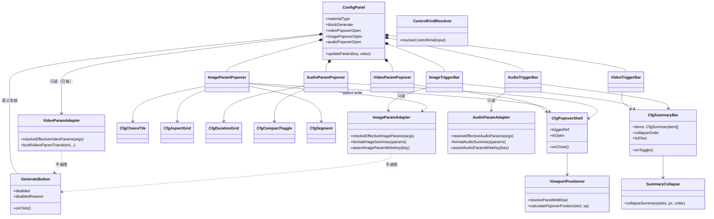
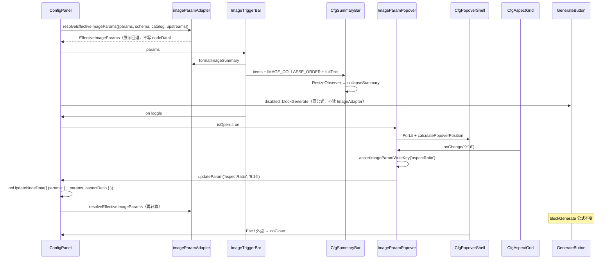
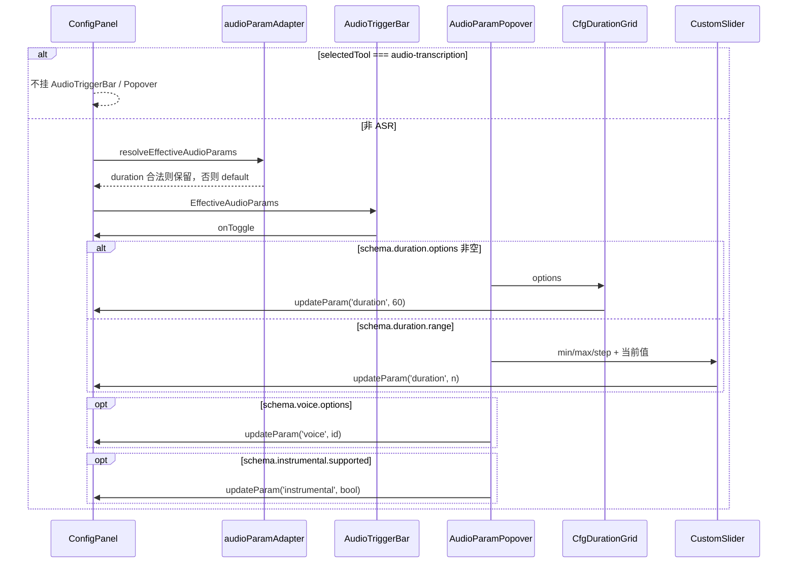
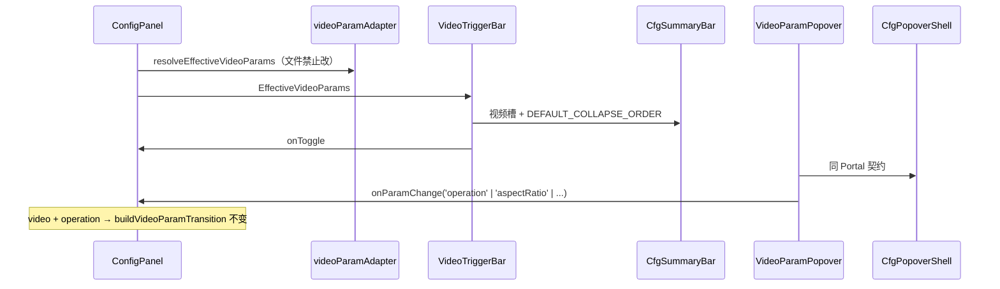
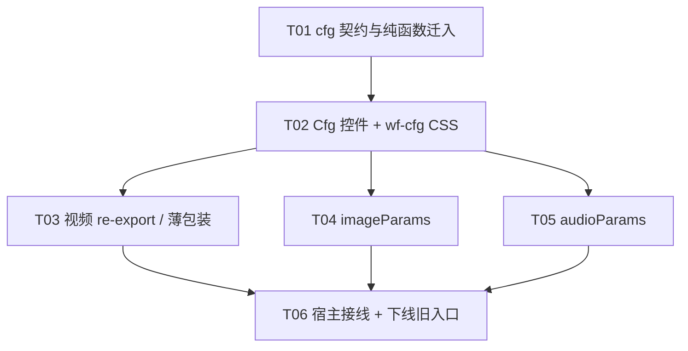

# 配置面板全模态收敛架构设计（P0-b + P1）

> **文档性质**：架构 + 任务分解。视觉真源是 PRD `docs/specs/2026-09-07-config-panel-ui-ux-prd.md`（§2 控件契约、§3.2 图像、§3.3 音频、§3.5 P0-b/P1）。P0-a 视频几何/折叠/2×N Tile 已在 `videoParams/` 落地；**`cfg/` 目录尚未存在**，本设计把 P0-b 与 P1 一次做完，避免图像/音频再复制一份 `wf-video-*` CSS。  
> **实现栈**：现有 React + CSS（`plugins/omnimux-workflow`）。不新建 Vite 应用，不引入 MUI / Tailwind，不另起 `--omx-*` / `--wf-vp-*` 变量岛。  
> **范围铁律**：表现层收敛。`params.*` 字段名、`GenerateButton` / `blockGenerate` / `node-input-submission`、`videoParamAdapter.ts` 的校验与 pending 语义、`operationUi.ts` **100% 冻结**。图像/音频适配器只做**读侧**清洗与摘要，写路径仍走现网 `updateParam`。

---

# Part A: 系统设计

## 1. 实现方案与框架选型

### 1.1 现状（已核对 worktree 源码）

| 材质 | 底栏入口 | 展开态 | 问题 |
|---|---|---|---|
| 视频 | `VideoTriggerBar` 32px/8px + 5 步折叠 | `VideoParamPopover` Portal（2×N Tile / 4 列 Aspect / 质量行） | P0-a 完成；类名仍全是 `wf-video-*`，控件住在 `videoParams/` |
| 图像 | 幽灵 `CustomSelect`（`wf-param-pill--video-summary` + `wf-param-bar__select--ghost`）+ 可选内联 `OperationSegment` | 无浮层；分辨率 schema（1K/2K）**未暴露** | 与视频不是同一组件家族；底栏仍有 `|` 分隔 |
| 音频（非 ASR） | `SlidersHorizontal` 13px 齿轮 | 底栏下方 `.wf-config-panel__advanced-drawer` 内 **硬编码 1–60s** 滑块 | 第三条交互路径；忽略 catalog `duration.options`（兜底 30/60/120）与 `voice` / `instrumental` |
| 音频 ASR | 仅模型 Select | 无 | **保持**：不渲染摘要条 |
| 文本 | 仅模型 Select | 无 | **保持**：不渲染空胶囊 |

P0 架构 T05（`cfg/` 升格）**未实施**：`ConfigPanel/cfg/` 不存在。若 P1 直接在 `imageParams/` 复制 Tile/Grid，会再分叉一套 CSS，违反 PRD §3.5「P0-b 必须在 P1 之前」。

### 1.2 核心技术挑战与对策

| 挑战 | 根因 | 对策 |
|---|---|---|
| 公共控件仍绑在视频目录 | P0-a 为赶几何铁律把 ChoiceTile / CompactToggle / 折叠协议放进 `videoParams/` | **先搬后接**：纯函数 + 表现层迁 `cfg/`，视频改 re-export；图像/音频只消费 `cfg/` |
| 摘要折叠顺序是视频特化 | `COLLAPSE_ORDER = mode → sound → ratio → resolution`，`CfgSummarySlotId` 无 voice/format | 折叠协议参数化：`order` + 第一个 `dropPolicy: 'ellipsis'` 槽；默认值保持视频单测 |
| 图像写路径过瘦、音频写路径过野 | 图像只写 `aspectRatio`；音频抽屉无视 schema | 读侧 Adapter 按 schema 回退展示；UI 按选型矩阵暴露 **已存在** 的 `resolution` / `voice` / `instrumental` / `duration`。不新增执行器字段，不改提交闸 |
| 源码契约测试锁死旧入口 | `videoParamsIntegration.test.mjs` 断言图像仍 `CustomSelect`、CSS 仍保留 `--video-summary` | T06 **改写**这些断言，不得让新 UI 迁就旧锁 |
| 提交闸误伤 | `blockGenerate` 与 UI 同居 `index.tsx` | UI 只改渲染树。图像/音频 `onParamChange` 白名单断言。`git diff` 不得出现 `GenerateButton.tsx` / `videoParamAdapter.ts` / `operationUi.ts` 业务 hunk |
| 三套 Popover 复制 Portal | 定位/Esc/外点/nowheel 已在视频验证 | 抽 `CfgPopoverShell`；内容区仍分 `Video/Image/AudioParamPopover`（**不**做万能 schema 表单引擎） |

**不重写**：`calculatePopoverPosition` 的 flip / 限高 200–480 / GAP=8 / VIEWPORT_PADDING=12 / `resolvePanelWidth`。Portal 目标仍 `document.body`。外点关闭必须继续忽略 `.wf-custom-select-dropdown`（音频音色 Select 依赖此例外）。

### 1.3 框架与模式

- **模式**：ConfigPanel 宿主上的 **Presentation Layer 收敛**，不是新应用、不是跨材质万能表单。  
- **分层**：
  1. **cfg/** — 无材质语义的表现层（SummaryBar / PopoverShell / Tile / AspectGrid / DurationGrid / CompactToggle / Segment）+ 纯函数（`resolveControlKind` / `collapseSummary` / `viewportPositioner` / `aspectRatioGeometry`）。
  2. **videoParams/ · imageParams/ · audioParams/** — 材质门面：摘要格式化、读侧 Adapter、槽位组装、浮层信息架构。
  3. **ConfigPanel/index.tsx** — 按 `materialType` 挂门面；提交闸、模型 Select、`updateParam` 不动语义。
- **选型**：继续 `resolveControlKind` 矩阵。禁止页面私造第四种按钮。
- **样式**：只消费 `--dsw-alias-*`。几何 4px 原子字面 px。新规则只写 `wf-cfg-*`；`wf-video-*` 用 **单规则双选择器** 做一迭代别名，禁止两套数值。
- **反过度设计**：不做 `CfgField[]` 运行时渲染器（PRD §3.4 是给 P2 工作流 Modal 的契约方向，本迭代不落地引擎）。三个 Popover **手写区块**，共享控件。

```text
ConfigPanel (index.tsx)
  ├─ CustomSelect                 模型（32×8，不动）
  ├─ VideoTriggerBar              = CfgSummaryBar 门面（视频槽）
  ├─ ImageTriggerBar              = CfgSummaryBar 门面（图像槽）  [P1 新建]
  ├─ AudioTriggerBar              = CfgSummaryBar 门面（音频槽）  [P1 新建；ASR 不挂]
  ├─ GenerateButton               提交闸（语义冻结）
  ├─ VideoParamPopover            = CfgPopoverShell + 视频区块
  ├─ ImageParamPopover            = CfgPopoverShell + 图像区块
  └─ AudioParamPopover            = CfgPopoverShell + 音频区块
        公共控件全部 import from '../cfg'
```

### 1.4 cfg/ 表现层底座

| 模块 | 职责 | 非职责 |
|---|---|---|
| `CfgSummaryBar` | 32px/8px 按钮外壳、ResizeObserver、调用 `collapseSummary`、chevron、focus-visible / press / open 边框 | 不知道 16:9 / 有声 / 音色；槽位由门面传入 |
| `CfgPopoverShell` | Portal、定位、Esc / 外点、`nowheel nodrag`、placement 入场 class | 不知道区块内容 |
| `CfgChoiceTile` | 2×N、36px、nowrap + `word-break: keep-all` | 不写 `operation` |
| `CfgAspectGrid` | 4 列 56px 卡、诚实空列、24px 几何图标 | 不写死视频 7 项 |
| `CfgDurationGrid` | Quick Pills 32/8、`minmax(56px, 1fr)` | 不假装连续 |
| `CfgCompactToggle` | 160px 两态，禁止 `width: 100%` | 不承担 ≥3 态 |
| `CfgSegment` | 短标签 2–5 项、nowrap | 溢出时由门面改渲染 Tile，Segment 自身不降字号 |
| `controlKind` / `summaryCollapse` | 无 React 纯函数 | 不读 DOM |
| `viewportPositioner` | `resolvePanelWidth` + flip | 不改 GAP/PADDING |
| `aspectRatioGeometry` | `AspectRatioIcon` | 不属于视频私有 |

**视频向下兼容**：`videoParams/ChoiceTile.tsx` 等改为 `export { CfgChoiceTile as ChoiceTile } from '../cfg/...'`。`VideoTriggerBar` 保留原 props，内部渲染 `CfgSummaryBar`，`className` 同时带 `wf-cfg-summary-bar` 与 `wf-video-trigger-bar`（测试双锁一迭代）。

### 1.5 图像节点适配（`imageParams/`）

**废除**：底栏 `|` + `wf-param-pill--video-summary` 幽灵 Select；`showModeUi && materialType !== 'video'` 的内联 `OperationSegment`（生成方式进浮层）。

**摘要槽（折叠序 `IMAGE_COLLAPSE_ORDER`）**

| 槽 | 显示 | dropPolicy | 折叠步 |
|---|---|---|---|
| Mode | ops≥2 时 tertiary | `hide` | 第 1 丢整段 |
| Ratio | 几何图标 + `16:9` / `1:1` / `自适应` | `icon-only` | 第 2 丢文字 |
| Resolution | `2K` / `1K` / `4K`；无 options 则不渲染 | `hide` | 第 3 丢 |
| Chevron | 14px | `never` | 永不丢 |

无 duration / sound。仍溢出时：若存在 `ellipsis` 槽则用之；图像默认无 ellipsis 槽，剩余图标 + chevron，禁止整钮 ellipsis 出半截汉字。

**浮层 IA（360 宽，schema 驱动显隐）**

```
┌─ 生成方式（ops≥2）──────────────┐
│  长标签 → CfgChoiceTile 2×N     │
│  短标签 → CfgSegment            │
├─ 比例 ──────────────────────────┤
│  CfgAspectGrid 4 列，末行诚实空列 │
├─ 清晰度 ────────────────────────┤
│  CfgSegment（1K/2K/4K 短标签）   │
└─ 高级（schema.seed / quality）──┘  ← P1 默认展开，折叠属 P2
```

`schema.quality` 仅当 **没有** `resolution.options` 时占据「清晰度」槽，避免 1K 与 quality 双排重复。有 resolution 时 quality 进高级或隐藏（P1 默认隐藏，不扩大写集除非用户点高级里已有控件）。

**Adapter（读侧）**：非法 `aspectRatio` / `resolution` **展示回退**到 schema default，**不**在 mount 时回写 `nodeData.params`（避免无用户动作改提交载荷）。

### 1.6 音频节点适配（`audioParams/`）

**废除**：齿轮按钮、`showAdvanced` 状态、`.wf-config-panel__advanced-drawer` 整段（含死代码 `materialType === 'video' ? 20 : 60`）。ASR（`selectedTool === 'audio-transcription'`）维持「无参数摘要」。

**摘要槽（`AUDIO_COLLAPSE_ORDER`）**

| 槽 | 显示 | dropPolicy | 折叠步 |
|---|---|---|---|
| Mode | ops≥2（如 TTS / 音乐） | `hide` | 第 1 |
| Voice | 仅当要在摘要露出时；**P1 默认不进摘要**（进浮层） | — | — |
| Format | 若 `outputFormat.options` | `hide` | 第 2 |
| Duration | Clock + `15s` / `60s` / `自动` | `ellipsis` | 尽量保留，最后省略数值 |
| Chevron | 14px | `never` | 永不丢 |

**浮层 IA**

```
┌─ 生成方式（ops≥2）──────────────┐
│  同图像：KindResolver → Tile/Seg │
├─ 时长 ──────────────────────────┤
│  options → CfgDurationGrid      │
│  range 且无 options → Slider     │
│    + 当前值；不发明 15/30/60 快捷  │
├─ 音色（voice.options）───────────┤
│  基数 ≥6 → CustomSelect（矩阵）  │
│  否则 Segment                   │
├─ 纯音乐（instrumental.supported）┤
│  行内 CfgCompactToggle 160px     │
│  真源是 schema，不是 operation id │
└─ 格式 / 高级 seed ───────────────┘
```

**与现网抽屉的行为差（有意修复，不是提交闸变更）**：抽屉把时长锁死为 1–60 连续滑块，**无视** `DEFAULT_FALLBACK_SCHEMA.audio.duration.options = 30/60/120` 与 catalog。P1 改 schema-driven。执行器本就读 `params.duration` / `params.voice`；非法已存值只影响展示回退，不在 mount 覆写。

### 1.7 样式层收敛

| 动作 | 规则 |
|---|---|
| 新几何只写 `.wf-cfg-*` | summary-bar / popover / seg / choice-tile / aspect-grid / duration-pill / compact-toggle |
| 双选择器单规则 | `.wf-cfg-summary-bar, .wf-video-trigger-bar { height: 32px; border-radius: 8px; ... }` |
| **下线** | `.wf-param-pill--video-summary`（图像不再消费）；宿主删除对应 class |
| 可删可留 | `.wf-config-panel__advanced-drawer*` — 无引用后删除，避免死皮肤 |
| 禁止 | 图像/音频再写一套 `wf-image-*` / `wf-audio-*` 几何；禁止 28px / 999 / 11px 业务字 |
| 底栏分隔 | 图像/音频前 `|` 与视频一样废除，靠 `params-group` gap |

动画 keyframes 升格 `wf-cfg-popover-in-top/bottom`，视频旧名作为别名 `@keyframes` 或双 animation 选择器，数值只出现一次。

---

## 2. 文件列表（相对 `plugins/omnimux-workflow/`）

### 2.1 新建 — `cfg/`

```text
src/canvas/editor/components/MaterialNode/ConfigPanel/cfg/
├── index.ts                         # 公共出口
├── types.ts                         # CfgControlKind / CfgSummarySlot* / PopoverPosition / RectLike
├── controlKind.ts                   # 从 videoParams 迁入
├── controlKind.test.mjs             # 仅选型矩阵（不含 VideoParamWriteKey）
├── summaryCollapse.ts               # order 可注入；默认 = 视频序
├── summaryCollapse.test.mjs         # 视频夹具保持 + 图像/音频 order 夹具
├── viewportPositioner.ts            # 原样迁入
├── viewportPositioner.test.mjs
├── aspectRatioGeometry.ts           # 原样迁入（图像+视频共用）
├── CfgSummaryBar.tsx
├── CfgPopoverShell.tsx
├── CfgChoiceTile.tsx
├── CfgCompactToggle.tsx
├── CfgSegment.tsx
├── CfgAspectGrid.tsx
└── CfgDurationGrid.tsx
```

### 2.2 修改 — 视频门面（re-export / 薄包装，**不改 Adapter**）

```text
.../videoParams/
├── types.ts                         # 保留 Video*；Cfg* 改为 from '../cfg/types.ts' re-export
├── controlKind.ts                   # re-export '../cfg/controlKind.ts'
├── summaryCollapse.ts               # re-export（签名兼容：第 3 参可选）
├── viewportPositioner.ts            # re-export
├── aspectRatioGeometry.ts           # re-export
├── ChoiceTile.tsx                   # re-export CfgChoiceTile as ChoiceTile
├── CompactToggle.tsx                # re-export
├── AspectCardGrid.tsx               # re-export CfgAspectGrid as AspectCardGrid
├── DurationGrid.tsx                 # re-export
├── SegmentControls.tsx              # Operation/Resolution/Sound 改消费 Cfg*
├── VideoTriggerBar.tsx              # 内部 CfgSummaryBar；双 class
├── VideoParamPopover.tsx            # 内部 CfgPopoverShell
├── videoParamAdapter.ts             # 【禁止修改】
└── videoParamAdapter.test.mjs       # 【禁止修改】
```

### 2.3 新建 — `imageParams/`

```text
.../imageParams/
├── types.ts
├── imageParamAdapter.ts             # resolve + format + write-key assert
├── imageParamAdapter.test.mjs
├── ImageTriggerBar.tsx
├── ImageParamPopover.tsx
└── imageParamsIntegration.test.mjs  # 源码契约：无幽灵 Select，有 TriggerBar/Popover
```

### 2.4 新建 — `audioParams/`

```text
.../audioParams/
├── types.ts
├── audioParamAdapter.ts
├── audioParamAdapter.test.mjs
├── AudioTriggerBar.tsx
├── AudioParamPopover.tsx
└── audioParamsIntegration.test.mjs  # 无齿轮、无 advanced-drawer；ASR 不挂载
```

### 2.5 修改 — 宿主与皮肤

```text
.../ConfigPanel/index.tsx            # 接线；删除幽灵 Select / 齿轮 / 抽屉 / 内联 OperationSegment（非视频）
.../ConfigPanel/operationUi.dom.test.mjs
.../videoParams/videoParamsIntegration.test.mjs   # 反转「图像仍 CustomSelect」
src/canvas/theme/components.css      # wf-cfg-* 升格；删除 --video-summary
```

### 2.6 明确不改

```text
videoParams/videoParamAdapter.ts
shared/validation/operationUi.ts
ConfigPanel/GenerateButton.tsx
docs/contracts/node-input-submission.md
handleModelChange 的 video 分支（buildVideoParamTransition）
blockGenerate / quietReason / pendingVideoParamAdjustment 语义
```

---

## 3. 数据结构与接口契约

### 3.1 冻结的提交闸（防御）

```ts
/** 本迭代 UI 不得扩大的视频写集（已存在，不得删）。 */
export type VideoParamWriteKey =
  | 'operation' | 'aspectRatio' | 'resolution' | 'duration' | 'sound'
  | 'seed' | 'watermark' | 'outputFormat' | 'referenceTaskType' | 'generationType'
  | 'returnLastFrame' | 'webSearch' | 'nsfwCheck' | 'fileUrl' | 'linkUrl';

/** 图像浮层允许写入的 key。禁止 generationMode 与未知 key。 */
export type ImageParamWriteKey =
  | 'operation'
  | 'aspectRatio'
  | 'resolution'
  | 'quality'
  | 'seed';

/** 音频浮层允许写入的 key。 */
export type AudioParamWriteKey =
  | 'operation'
  | 'duration'
  | 'voice'
  | 'instrumental'
  | 'outputFormat'
  | 'seed';

export function assertImageParamWriteKey(key: string): asserts key is ImageParamWriteKey;
export function assertAudioParamWriteKey(key: string): asserts key is AudioParamWriteKey;
```

`updateParam` 现网行为保持：

- `key === 'operation'` + `materialType === 'video'` → `buildVideoParamTransition`（不动）。
- 其它材质的 `operation` → `setParamsOperation`（不动）。
- 其余 key → `{ ...params, [key]: value }`（不动）。

Adapter **不**替换 `updateParam`。浮层 `onParamChange` 先 `assert*WriteKey` 再调用宿主 `updateParam`。

### 3.2 cfg 折叠协议（泛化，默认兼容视频单测）

```ts
export type CfgSummarySlotId =
  | 'mode' | 'ratio' | 'resolution' | 'duration' | 'sound'
  | 'voice' | 'format' | 'chevron';

export const DEFAULT_COLLAPSE_ORDER: readonly CfgSummarySlotId[] =
  ['mode', 'sound', 'ratio', 'resolution']; // 视频

export const IMAGE_COLLAPSE_ORDER: readonly CfgSummarySlotId[] =
  ['mode', 'ratio', 'resolution'];

export const AUDIO_COLLAPSE_ORDER: readonly CfgSummarySlotId[] =
  ['mode', 'format']; // duration 走 ellipsis，不进 hide 序

export function collapseSummary(
  slots: readonly CfgSummarySlot[],
  availablePx: number,
  order: readonly CfgSummarySlotId[] = DEFAULT_COLLAPSE_ORDER,
): CfgSummaryVisibleState;
```

不变量：

1. `chevron.dropPolicy === 'never'`，否则 throw（现网已锁）。
2. 第 5 步改为：hide/icon-only 走完仍溢出 → **第一个** `dropPolicy === 'ellipsis'` 的槽进 `ellipsis`（视频/音频 = duration）。
3. `title` / `aria-label` 永远是空格拼接的 `fullText`，无 `·`。
4. 现网 `summaryCollapse.test.mjs` 两参调用必须继续全绿。

### 3.3 `CfgSummaryBar` / `CfgPopoverShell`

```ts
export interface CfgSummaryItem {
  id: CfgSummarySlotId;
  text: string;
  icon?: ReactNode;
  dropPolicy: CfgSummarySlot['dropPolicy'];
  /** 含 gap 的估算宽；门面按 12px 字 + 14px 图标计算 */
  estimatePx: number;
}

export interface CfgSummaryBarProps {
  items: CfgSummaryItem[];
  collapseOrder?: readonly CfgSummarySlotId[];
  fullText: string;
  isOpen: boolean;
  disabled?: boolean;
  onToggle: () => void;
  /** 默认 wf-cfg-summary-bar；视频门面追加 wf-video-trigger-bar */
  className?: string;
  'aria-label'?: string;
}

export interface CfgPopoverShellProps {
  triggerRef: RefObject<HTMLElement | null>;
  isOpen: boolean;
  onClose: () => void;
  ariaLabel: string;
  className?: string; // 追加在 wf-cfg-popover 之后
  children: ReactNode;
}
```

`CfgPopoverShell` 必须：`createPortal(..., document.body)`；`role="dialog"`；wheel/pointer stopPropagation；mousedown 外点关闭（panel / trigger / `.wf-custom-select-dropdown` 除外）；Escape；`wf-cfg-popover--top|bottom`。

### 3.4 `imageParamAdapter` 签名

```ts
export interface ImageNodeParams {
  model?: string;
  operation?: string;
  aspectRatio?: string;
  resolution?: string;
  quality?: string;
  seed?: number;
  [key: string]: unknown;
}

export interface EffectiveImageParams {
  model: string;
  operation: string;
  operationLabel: string;
  effectiveOperations: OperationUiOption[];
  showModeUi: boolean;
  schema: ModelParameterSchema;
  aspectRatio: string;
  resolution?: string;
  quality?: string;
  seed?: number;
}

export interface ResolveEffectiveImageParamsArgs {
  params: ImageNodeParams | undefined;
  schema: ModelParameterSchema | undefined;
  modelItem: CapabilityModelItem | undefined;
  catalog?: CapabilityCatalog | null;
  upstreams?: UpstreamMediaSnapshot[];
  prompt?: string;
}

export function resolveEffectiveImageParams(
  args: ResolveEffectiveImageParamsArgs,
): EffectiveImageParams;

export interface ImageSummaryFormatResult {
  modeText: string;
  ratioText: string;
  resolutionText: string | null;
  fullText: string; // join(' ')，无 ·
}

export function formatImageSummary(params: EffectiveImageParams): ImageSummaryFormatResult;
```

解析规则：

- `outputType: 'image'` 调 `buildEffectiveOpsUiState` / `shouldRenderModeUi`（与宿主现网一致）。
- `aspectRatio`：在 `schema.aspectRatio.options` 中则保留，否则 `defaultValue` 或 `'16:9'`。
- `resolution`：无 options → `undefined`（摘要与浮层都不渲染该槽）；有则同样 option/default。
- **禁止** `buildVideoParamTransition` / pending 调整。
- **禁止** 在 resolve 里 `onUpdateNodeData`。

### 3.5 `audioParamAdapter` 签名

```ts
export interface AudioNodeParams {
  model?: string;
  operation?: string;
  duration?: number | string;
  voice?: string;
  instrumental?: boolean;
  outputFormat?: string;
  seed?: number;
  [key: string]: unknown;
}

export interface EffectiveAudioParams {
  model: string;
  operation: string;
  operationLabel: string;
  effectiveOperations: OperationUiOption[];
  showModeUi: boolean;
  schema: ModelParameterSchema;
  duration: number; // 含 allowAuto 的 -1
  voice?: string;
  hasVoiceOptions: boolean;
  instrumental: boolean;
  hasInstrumentalSupport: boolean;
  outputFormat?: string;
}

export interface ResolveEffectiveAudioParamsArgs {
  params: AudioNodeParams | undefined;
  schema: ModelParameterSchema | undefined;
  modelItem: CapabilityModelItem | undefined;
  catalog?: CapabilityCatalog | null;
  upstreams?: UpstreamMediaSnapshot[];
  prompt?: string;
}

export function resolveEffectiveAudioParams(
  args: ResolveEffectiveAudioParamsArgs,
): EffectiveAudioParams;

export interface AudioSummaryFormatResult {
  modeText: string;
  durationText: string;   // '60s' | '自动'
  formatText: string | null;
  fullText: string;
}

export function formatAudioSummary(params: EffectiveAudioParams): AudioSummaryFormatResult;

export function durationIsValid(
  value: unknown,
  schema: ModelParameterSchema['duration'],
): value is number;
```

解析规则：

- `outputType: 'audio'`。
- 时长：`allowAuto && -1` 合法；否则 options 命中或 range+step 命中；否则 `schema.duration.defaultValue`（兜底 60）。字符串 `'8s'` 可 parse 后校验。
- `voice`：无 options 则 `hasVoiceOptions=false` 且摘要/浮层不渲染；有则 option/default。
- `instrumental`：`schema.instrumental.supported` 才暴露；值缺省用 `defaultValue`。
- 不把 `selectedOperationId === 'text_to_music'` 当作 UI 开关真源（placeholder 文案仍可用 ops id；控件显隐只看 schema）。

### 3.6 类图



---

## 4. 程序调用时序与数据流

### 4.1 图像：挂载 → 改比例 → 关闭



### 4.2 音频：时长（schema-driven）



### 4.3 视频（回归：只换外壳）



### 4.4 数据流（写隔离）

```text
[用户点击控件]
    → assert*WriteKey(key)
    → ConfigPanel.updateParam(key, value)     // 现网，不替换
        → video+operation: buildVideoParamTransition
        → 其它 operation: setParamsOperation
        → 其它 key: { ...params, [key]: value }
    → onUpdateNodeData
    → 再走 resolveEffective*（只读）
    → SummaryBar 重绘

GenerateButton.onClick
    → 现网 onGenerate
    → 现网 blockGenerate（ops / zeroCandidates / configuration_error /
       videoValidationErrors / pendingVideoParamAdjustment / execBusy）
    → 不读取 imageParamAdapter / audioParamAdapter
```

---

## 5. 未决与假设

| ID | 决议（除非主理人改口） | 来源 |
|---|---|---|
| Q1 | 比例末行 3 项：**诚实空列** | P0 已锁 |
| Q3 | 本设计把 **P0-b + P1 放同一 worktree / 可同一 PR**（cfg 不抽则图像必复制 CSS）。若 diff 过大，按 T01–T03 / T04–T06 拆 PR，但不得先合图像后合 cfg | PRD Q3 精神 + 现状欠债 |
| A1 | 不做 `CfgField[]` 运行时引擎 | 反过度设计 |
| A2 | 图像/音频 **无** pending 调整确认条 | 现网非视频也没有 |
| A3 | resolve **不回写**非法值为 default | 避免无手势改提交载荷 |
| A4 | 音频时长改 schema-driven，废除 1–60 硬编码滑块 | 修抽屉与 catalog 漂移 |
| A5 | 音色 ≥6 走 Select；纯音乐显隐看 `instrumental.supported` | 选型矩阵 |
| A6 | 高级折叠 / Segment thumb / reduced-motion / `getModelVisuals` 去 emoji 仍属 **P2** | PRD §3.5 |
| A7 | 文本 / ASR / import 节点入口不变 | PRD |
| A8 | 图像 `quality`：有 `resolution` 则 P1 不暴露 quality 控件 | 避免双清晰度 |

**UNCLEAR（实现时遇则按 A 列，不要 invent）**

- Catalog 某音频模型同时给 `duration.options` 与 `range`：与视频 Popover 一致，**options 优先**（有 options 就不渲染 range 滑块）。
- 图像 fallback schema 含 `auto`（自适应）：走 AspectGrid + `Maximize2` / 既有 dashed 几何，不另做幽灵卡。

---

# Part B: 任务分解

## 6. 依赖包

无新第三方包。不得 `pnpm add`。

```
- react（已有）：UI
- lucide-react（已有）：Clock / ChevronDown / Volume2 / Maximize2（自适应）
- 无 MUI、无 Tailwind、无新 CSS-in-JS
```

---

## 7. 任务列表（T01–T06，依赖序）

> 按模块分组，每任务 ≥3 文件。T01 为基础设施。T04 与 T05 只依赖 T02，可并行。

### T01 — 项目基础设施：`cfg/` 契约与纯函数迁入

- **Priority**: P0-b  
- **Dependencies**: 无  
- **目标**: 建立 `cfg/` 出口；把无 UI 的类型/纯函数从 `videoParams/` 迁入；视频侧改为 re-export，行为零变化。  
- **Source Files**:
  1. `.../cfg/types.ts`、`.../cfg/index.ts`
  2. `.../cfg/controlKind.ts` + `controlKind.test.mjs`
  3. `.../cfg/summaryCollapse.ts` + `summaryCollapse.test.mjs`（两参兼容 + 新 order 夹具）
  4. `.../cfg/viewportPositioner.ts` + `viewportPositioner.test.mjs`
  5. `.../cfg/aspectRatioGeometry.ts`
  6. `videoParams/{types,controlKind,summaryCollapse,viewportPositioner,aspectRatioGeometry}.ts` 改为 re-export
- **完成标准**:
  - `pnpm --filter omnimux-workflow test` 中原 `videoParams/controlKind|summaryCollapse|viewportPositioner` 用例经 re-export 全绿。
  - `collapseSummary(slots, px)` 两参 ≡ 旧视频序。
  - `assertVideoParamWriteKey` 仍留在 `videoParams/types.ts`。
  - 无 CSS 几何分叉；本任务可不改 components.css（放到 T02）或只加注释锚点。

### T02 — cfg 表现层控件 + CSS 升格

- **Priority**: P0-b  
- **Dependencies**: T01  
- **目标**: 落地通用控件与 `wf-cfg-*` 单规则双选择器；数值只出现一次。  
- **Source Files**:
  1. `cfg/CfgSummaryBar.tsx`
  2. `cfg/CfgPopoverShell.tsx`
  3. `cfg/CfgChoiceTile.tsx` / `CfgCompactToggle.tsx` / `CfgSegment.tsx` / `CfgAspectGrid.tsx` / `CfgDurationGrid.tsx`
  4. `src/canvas/theme/components.css`（`.wf-cfg-* , .wf-video-* { ... }`）
- **完成标准**:
  - 每个几何值（32 / 8 / 36 / 56 / 160 / 12px 标签）在 CSS 中只定义一次。
  - Shell：Portal / Esc / 外点 / nowheel / `resolvePanelWidth`。
  - SummaryBar：ResizeObserver + 可注入 order；chevron 不丢。
  - 禁止新增 `--omx-*`、hex、11px 业务字、底栏 999。

### T03 — 视频门面改消费 / re-export `cfg/`

- **Priority**: P0-b  
- **Dependencies**: T02  
- **目标**: 视频行为零回归，DOM 可双 class。  
- **Source Files**:
  1. `videoParams/VideoTriggerBar.tsx`
  2. `videoParams/VideoParamPopover.tsx`
  3. `videoParams/SegmentControls.tsx`
  4. `videoParams/{ChoiceTile,CompactToggle,AspectCardGrid,DurationGrid}.tsx` re-export
  5. 现有 `VideoParamPopover.test.mjs` / `AspectCardGrid.test.mjs`（必要时接受双 class，**不放宽** 32/8/nowrap/brand）
- **完成标准**:
  - 视频单测全绿；`onParamChange('operation')` 仍在。
  - `git diff` 无 `videoParamAdapter.ts`。
  - 图像/音频入口本任务 **仍保持旧 UI**（避免半切）。

### T04 — 图像节点 `imageParams/`

- **Priority**: P1  
- **Dependencies**: T02（不依赖 T03，可与 T03 并行；合入顺序建议 T03 先或同 PR）  
- **目标**: SummaryBar + Popover；废除幽灵 Select；4 列比例；分辨率分段。  
- **Source Files**:
  1. `imageParams/types.ts`
  2. `imageParams/imageParamAdapter.ts` + `imageParamAdapter.test.mjs`
  3. `imageParams/ImageTriggerBar.tsx`
  4. `imageParams/ImageParamPopover.tsx`
  5. `imageParams/imageParamsIntegration.test.mjs`
- **完成标准**:
  - Adapter 单测：非法比例回退展示、ops≤1 无 mode、fullText 无 `·`、`assertImageParamWriteKey('generationMode')` 抛错。
  - 浮层：长中文生成方式 2×N nowrap；Aspect 4 列；有 resolution 才渲染清晰度。
  - 不调用 `buildVideoParamTransition`。
  - 本任务可以先不改 `index.tsx`（由 T06 接线），但组件 props 按 §3.4 定死。

### T05 — 音频节点 `audioParams/`

- **Priority**: P1  
- **Dependencies**: T02  
- **目标**: SummaryBar + Popover；废除齿轮与内联抽屉；时长/音色/纯音乐 schema-driven。  
- **Source Files**:
  1. `audioParams/types.ts`
  2. `audioParams/audioParamAdapter.ts` + `audioParamAdapter.test.mjs`
  3. `audioParams/AudioTriggerBar.tsx`
  4. `audioParams/AudioParamPopover.tsx`
  5. `audioParams/audioParamsIntegration.test.mjs`
- **完成标准**:
  - options → pills；range → slider+当前值；voice≥6 → Select；instrumental → 160px Toggle。
  - ASR 不在组件内部猜测：由宿主不挂载；单测锁 `isAsrTool` 分支在 T06。
  - `assertAudioParamWriteKey('generationMode')` 抛错。
  - 不引入 1–60 硬编码 max。

### T06 — 宿主接线、旧入口下线、回归测试

- **Priority**: P1  
- **Dependencies**: T03, T04, T05  
- **目标**: 三材质同一入口；下线幽灵皮肤；提交闸零回归。  
- **Source Files**:
  1. `ConfigPanel/index.tsx`
  2. `videoParams/videoParamsIntegration.test.mjs`（反转图像 CustomSelect / `--video-summary` 断言）
  3. `ConfigPanel/operationUi.dom.test.mjs`
  4. `src/canvas/theme/components.css`（删除 `.wf-param-pill--video-summary` 与抽屉死规则）
  5. 图像/音频 integration 源码契约与宿主 import 对齐
- **index.tsx 必做**:
  - 删除图像幽灵 Select、音频齿轮、`showAdvanced`、`advanced-drawer`、非视频内联 `OperationSegment`、对应 `|`。
  - `imagePopoverOpen` / `audioPopoverOpen` + triggerRef，镜像视频。
  - `useMemo` 调 `resolveEffectiveImageParams` / `resolveEffectiveAudioParams`。
  - ASR / text / import 不挂摘要。
  - **禁止改** `blockGenerate` 公式、`GenerateButton` props、`handleModelChange` 视频分支。
- **完成标准**:
  - `rg "wf-param-pill--video-summary"` 源码与 CSS 均为 0。
  - `rg "wf-config-panel__advanced-drawer"` 源码为 0。
  - `rg "SlidersHorizontal"` 不再作为音频底栏入口（高级分区标题若 P2 再用另说；P1 底栏禁止）。
  - `pnpm --filter omnimux-workflow test` 相关文件全绿。
  - `git diff` 无 `GenerateButton.tsx`、`videoParamAdapter.ts`、`operationUi.ts`、`node-input-submission.md`。

---

## 8. Shared Knowledge

```
- 无 HTTP。所谓「后端」= Adapter 读侧 + operationUi + 提交闸，后两者本迭代冻结。
- 写入字段名保持现网 canonical：params.operation（开 string），禁止 generationMode。
- 颜色只走 --dsw-alias-*；禁止 --omx-*、--wf-vp-*、JS isDark。
- 有效 ops ≤ 1：不渲染生成方式 DOM，摘要不渲染 mode。
- Hide, Don't Grey：不支持的 operation 不得进 DOM。
- 单测：纯函数用 node:test 真值；宿主用 readFileSync 源码契约（仓库惯例）。
  折叠协议必须真值单测。新 Adapter 必须真值单测，禁止只写源码正则。
- i18n：与视频一致，参数浮层硬编码中文，不新增 panel.imageParam* / panel.audioParam*，避免半中半典。
- IAB（合入后 QA）：图像无幽灵下拉 + 4 列比例；音频无齿轮 + 浮层改时长；窄卡片折叠无半截汉字。HTTP 200 ≠ 通过。
- 物化：合入 main 后 sync omnimux-workflow → ~/.omnimux-dev；本设计阶段不物化。
```

### 8.1 提交闸隔离清单

| 模块 | 本迭代 | 说明 |
|---|---|---|
| `GenerateButton.tsx` / `blockGenerate` | 禁止 | 公式不得因图像分辨率暴露而增减条件 |
| `videoParamAdapter.ts` | 禁止 | |
| `operationUi.ts` | 禁止 | 图像/音频 Adapter **调用**它，不修改它 |
| `updateParam` 字段名 | 禁止改名 | 只增加对已有 key 的 UI 入口 |
| `node-input-submission.md` | 禁止 | |
| ConfigPanel 视频渲染树 | 仅换 cfg 外壳 | |
| ConfigPanel 图像/音频渲染树 | 允许 | T06 |
| 执行器 `params.voice` / `duration` / `aspectRatio` | 禁止改执行器 | UI 只暴露已有字段 |

---

## 9. 任务依赖图



T03 / T04 / T05 可并行。建议同一 PR 以免图像合入时 cfg 尚未升格。

---

## 10. 边界防御与硬性约束

### 10.1 禁止项

- 为图像/音频复制 `wf-image-*` / `wf-audio-*` 几何皮肤。
- 改 Adapter 提交语义、放宽/收紧 `blockGenerate`、「顺便重构」`operationUi`。
- 整颗 SummaryBar `text-overflow: ellipsis` 出「有…」「生…」半截汉字。
- 生成方式单行 `flex: 1` Segment 导致中文断词；`word-break: break-all`。
- 有声/纯音乐恢复通栏 Segment。
- 底栏 28px / 999 圆角；业务字 11px。
- 新增 hex、`--omx-*`、原生 `<select>`、emoji 图标。
- ASR / 文本节点出现空摘要条。
- mount 时把 fallback 写回 `params`（静默改载荷）。
- 在主仓 `main` 直接改 tracked 文件。

### 10.2 防断词

- Tile / Segment / Pill / 摘要槽：`white-space: nowrap`；Tile 另加 `word-break: keep-all`。
- 放不下换控件（KindResolver），禁止压缩字号到 11px。

### 10.3 窄容器折叠兜底

- 必须走 `collapseSummary`，禁止只靠按钮级 overflow。
- 图像序：mode → ratio 文字 → resolution。
- 音频序：mode → format；duration 最后 ellipsis。
- chevron 永不消失。

### 10.4 视口碰撞

- 宽度 `min(360, viewport-24)`，左右 ≥12px。
- 上下 flip 与限高沿用现算法。
- 入场位移与 placement 同向（P0-a 已做，Shell 迁出时原样带走）。
- 浮层内 CustomSelect 下拉不关闭 Popover。

### 10.5 给前端的实施顺序

```
T01 → T02 → (T03 ∥ T04 ∥ T05) → T06
```

测试与皮肤同一 PR，否则旧「图像 CustomSelect」断言会红。

---

## 11. 验收对照（架构层）

| PRD 条款 | 落点 |
|---|---|
| P0-b `wf-cfg-*`，视频 re-export | T01–T03 |
| 图像 Summary Bar + Popover，废除幽灵 Select | T04 + T06 |
| 音频非 ASR Summary Bar + Popover，废除齿轮抽屉 | T05 + T06 |
| 4 列比例卡片、诚实空列 | `CfgAspectGrid` |
| 32/8 底栏铁律 | `CfgSummaryBar` CSS |
| 5 步折叠可单测 | `cfg/summaryCollapse` + 材质 order |
| 零中文断词 | Tile nowrap + KindResolver |
| 不改 params 闸 | §3.1 / §8.1 / T06 diff 门禁 |
| 文本无空摘要、ASR 无摘要 | T06 宿主条件 |

---

## 12. 文档状态

| 项 | 状态 |
|---|---|
| 本架构 | draft，供前端按 T01–T06 实施 |
| P0-a 视频视觉 | 已在 worktree `videoParams/` 落地 |
| P0-b `cfg/` | **未实施**（本设计起点） |
| P1 图像/音频 | **未实施** |
| 运行验收 | 无；合入后走 plugin QA IAB |
