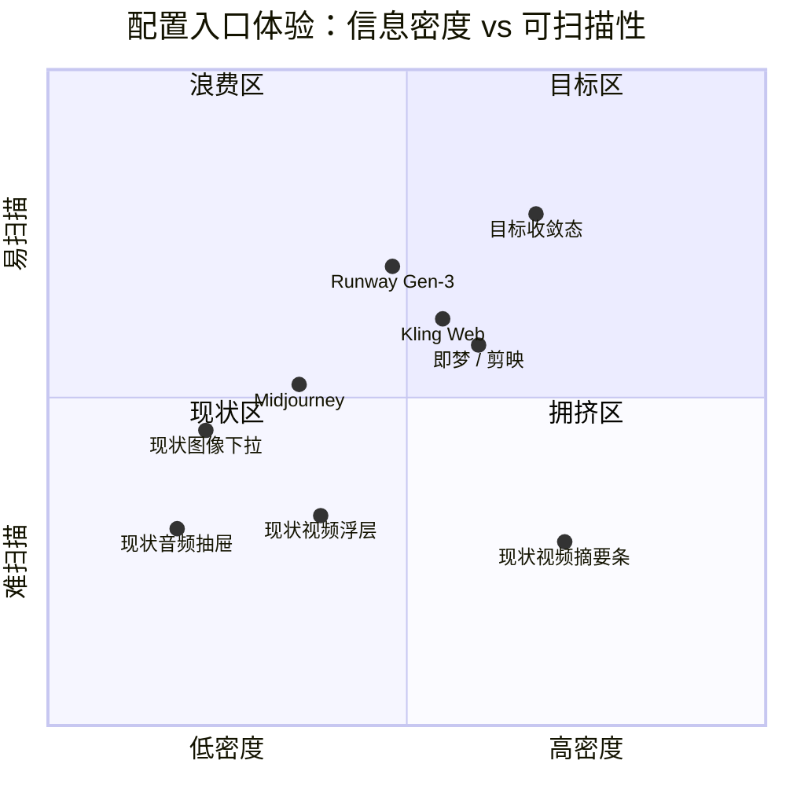

# 配置面板 UI/UX 规范与全局收敛优化 PRD

> **文档性质**：产品需求 + Design System 规格。本文接受的是需求、视觉契约与验收标准，不代表代码、自动化用例、CI 或运行验收已经完成。  
> **权威层级**：L2 产品规格。视觉 Token、几何铁律、图标与微文案仍以上游 L1 为唯一真源：[`design.md`](../../design.md)、[`ui-design-guidelines.md`](../contracts/ui-design-guidelines.md)、[`icon-design-standards.md`](../contracts/icon-design-standards.md)、[`ui-copywriting-and-naming-standards.md`](../contracts/ui-copywriting-and-naming-standards.md)。本文**不得**另起 `--omx-*` 变量岛，不得覆盖 `--dsw-alias-*`。  
> **实现范围**：`plugins/omnimux-workflow` 材质节点 ConfigPanel（视频 / 图像 / 音频 / 文本）及后续所有「摘要条 + 参数浮层」配置面板。不改官方 DSH 源码，不改生产 profile。  
> **落盘说明**：主仓 `docs/specs/` 受 git-wt 门禁保护，本文件先写在 `tmp/`。升 accepted 后由主理人在独立 worktree 迁入 `docs/specs/2026-09-07-config-panel-ui-ux-prd.md`。

---

## 0. 项目信息

| 项 | 值 |
|---|---|
| Language | 简体中文 |
| Programming Language | 现有栈：React + CSS（`plugins/omnimux-workflow`，消费 `--dsw-alias-*` / `--dsw-specific-*`）。**不**引入 Vite 新应用，不另起 MUI / Tailwind 平行体系。 |
| Project Name | `config_panel_ui_convergence` |
| 原始需求复述 | 视频参数配置面板（收起态摘要胶囊 + 展开态 Popover）信息层级、控件形态、密度、对比度与截断均不合格；要求形成一套可落地的通用 UI 规范，并收敛到所有带配置面板的页面（视频 / 图像 / 音频 / 批量工作流）。 |
| 当前代码真源 | `plugins/omnimux-workflow/src/canvas/editor/components/MaterialNode/ConfigPanel/`（`VideoTriggerBar.tsx`、`VideoParamPopover.tsx`、`SegmentControls.tsx`、`AspectCardGrid.tsx`、`DurationGrid.tsx`、`index.tsx`）+ `plugins/omnimux-workflow/src/canvas/theme/components.css`（`.wf-video-*` / `.wf-config-panel__*`） |
| 非目标（Non-goals） | 不改模型能力 schema、不改提交闸与有效输入合同、不改 Portal 定位算法语义（仅可调视觉常量）、不引入第二套主题、不把配置面板做成独立 Stage 页、不做社交矩阵 / 运营分析。 |

### 0.1 产品目标（正交）

1. **可读**：用户在 1 秒内分清「当前模式」与「当前参数值」，收起态不截断关键值，展开态无中文折行撕裂。
2. **可点**：摘要条与每个控件具备明确 affordance、激活态对比 ≥ WCAG AA、键盘与 Esc / 外点关闭完整。
3. **可复用**：视频 / 图像 / 音频 / 批量工作流共用同一套控件契约（摘要条、分段、卡片网格、滑块+快捷胶囊、行内开关、区块折叠），禁止再为单一材质私造一套密度。

### 0.2 用户故事

1. 作为创作者，我希望收起态一眼看到比例、清晰度、时长、有声，以便不打开浮层也能确认本次生成规格。
2. 作为创作者，我希望展开浮层后「生成方式」四个选项不折行、不挤扁，以便准确切换文生 / 首帧 / 首尾帧 / 全能参考。
3. 作为创作者，我希望比例卡片激活态足够醒目，以便在深色画布上不会选错 16:9 与 9:16。
4. 作为创作者，我希望「有声 / 无声」与水印等布尔项占用一行内联控件，以便把视线留给比例和时长。
5. 作为图像 / 音频节点用户，我希望参数入口与视频同一套摘要条 + 浮层，以便工作流里切换节点类型时不重新学习。

### 0.3 成功指标（可观测）

| 指标 | 基线（现状） | 目标 |
|---|---|---|
| 摘要条关键值截断率（标准节点宽、含 4 段参数） | 尾部「有声 / 生成」被裁切 | 0：优先级折叠后仍完整显示比例 + 清晰度 + 时长 |
| 分段标签中文折行数（生成方式 4 项） | 「首尾帧生视 / 频」撕裂 | 0 中文断词折行 |
| 激活态对比（深色） | 仅 `interactive-bg-active` 灰度差 | 选中项具备描边 **或** 品牌填充，对比可辨 |
| 跨材质入口一致性 | 视频=胶囊浮层；图像=幽灵下拉；音频=齿轮抽屉 | 三材质均走 Summary Bar + Param Popover |
| 几何违规 | TriggerBar 高 28px、圆角 999，与 32px / 8px 底栏混用 | 底栏内全部 32px / 8px，无 999 混用 |

---

## 1. 视觉与交互问题深度诊断报告

诊断对象：用户提供的两张截图（收起态胶囊栏、展开态参数 Popover）对照 2026-09-07 代码真源。下列为**静态证据 + 截图观察**，不作为 Dev 运行验收收据。

### 1.1 信息架构（IA）

| 观察 | 证据 | 问题 | 严重度 |
|---|---|---|---|
| 模式与参数值平铺 | `VideoTriggerBar` 将 `modeText`、`ratioText`、`resolutionText`、`durationText`、`soundText` 以 `·` 串联；`formatVideoSummary` 无主次权重 | 「全能参考生视频」是类别，16:9 / 720P / 5s 是值。类别占用最长字符，值被挤出 | P0 |
| 浮层区块无主次 | `VideoParamPopover` 六个 section 等权：生成方式 / 比例 / 清晰度 / 时长 / 有声视频 / 高级 | 高频（比例、时长）与低频布尔（有声、水印）同级通栏 | P0 |
| 图像 / 音频未进入同一 IA | `index.tsx`：图像用幽灵 `CustomSelect` 选比例；音频用 `SlidersHorizontal` 拉开抽屉滑块 | 用户在视频学会「点摘要开浮层」，切到图像立刻退化成散装下拉 | P0 |
| 高级参数暴露时机 | 视频把 seed / 水印 / 输出格式塞进同一 Popover 滚动区 | 首屏被低频项拉长，滚动成本高 | P1 |

**根因**：Issue 467 完成了「收拢入口」但没有定义「摘要信息优先级」和「浮层区块权重」。IA 仍是 schema 字段的线性投影。

**原则**：摘要 = 值优先、类别降权；浮层 = 生成方式（条件）→ 画幅 / 比例 → 质量（清晰度）→ 时长 → 行内布尔 → 高级折叠。

### 1.2 排版与字阶（Typography）

| 观察 | 证据 | 问题 | 严重度 |
|---|---|---|---|
| 摘要条 12px / line-height 1，图标 11–12px 混用 | `.wf-video-trigger-bar` `font-size: 12px; line-height: 1;`；`Clock`/`Volume2`/`ChevronDown` size 11，`AspectRatioIcon` size 12 | 基线不对齐，时钟与喇叭视觉重量不一致 | P0 |
| 模式文字与参数值同色同重 | 全部走 `label-primary`，无 `mode` 弱化 class | 扫读时类别抢过数值 | P0 |
| 分段标签无防折行 | `.wf-video-seg__item` `flex: 1; padding: 0 8px; font-size: 12px`，无 `white-space: nowrap`、无字数阈值 | 「首尾帧生视频」被容器均分后从「视 / 频」中间撕裂 | P0 |
| 比例卡片 label 11px | `.wf-video-aspect-card__label { font-size: 11px }` | 低于设计规范 Caption 12px 下限，且与分段 12px 不齐 | P1 |
| 分区标题 12px / 500 / secondary | `.wf-video-param-popover__section-title` | 与卡片 label、分段文字撞车，层级不够 | P1 |

**原则**：摘要数值 12px / 500 / primary；模式名 12px / 400 / tertiary；分区标题 12px / 500 / secondary；控件文字 12px / 400；卡片标注 12px / 500。禁止 11px 业务字。

### 1.3 空间与网格密度（Spacing & Rhythm）

| 观察 | 证据 | 问题 | 严重度 |
|---|---|---|---|
| 摘要条 max-width 260px + nowrap + ellipsis | `.wf-video-trigger-bar { max-width: 260px; white-space: nowrap; overflow: hidden }` | 底栏左侧还要放模型 Select 与生成按钮，260px 不够 5 段中文，尾部被裁 | P0 |
| 有声分段通栏 | `SoundSwitchSegment` 走通用 `Segment`，`flex: 1` 两项撑满 section | 两态布尔信息密度极低，与「生成方式」四项争抢同一控件形态 | P0 |
| 比例 4 列 × 高 56px，末行 3 项 | `.wf-video-aspect-grid { repeat(4, 1fr) }`，7 个 option（含 adaptive） | 末行左对齐留 1 列空洞，视觉不平衡 | P1 |
| Section 上下 padding 12px + 顶部分隔线 | `.wf-video-param-popover__section { padding: 12px 0 }` | 有声这种单行控件被 12+12 的区块空气放大 | P1 |
| 浮层宽锁 360 | `viewportPositioner.ts` `PANEL_WIDTH = 360` | 四段中文生成方式在 360−32 padding 内均分，必然溢出 | P0 |

**原则**：密度由「选项基数 × 标签长度」驱动控件选型，而不是所有枚举都进 Segment。360 宽浮层是常量，控件必须适应它，而不是让文字去适应均分格子。

### 1.4 控件一致性（Component Patterns）

| 观察 | 证据 | 问题 | 严重度 |
|---|---|---|---|
| Segment / Card / Slider / Pill / 原生 input 混用无选型表 | `SegmentControls`、`AspectCardGrid`、`CustomSlider`、`DurationGrid`、`<input type="url">` | 同一浮层五种形态，没有「何时用谁」的规则 | P0 |
| 布尔项误用 Segment | `SoundSwitchSegment`、`BooleanSwitchSegment`（开启/关闭 + Check/X） | 两态被做成通栏分段，浪费且与 4 段生成方式视觉等价 | P0 |
| 图像参数仍是幽灵 Select | `index.tsx` `wf-param-bar__select--ghost` | 与视频 TriggerBar 完全不是一个组件家族 | P0 |
| 音频是齿轮按钮 + 底栏抽屉滑块 | `showAdvanced` + `wf-config-panel__advanced-drawer` | 第三条交互路径 | P0 |
| 圆角混用违反 L1 铁律 | TriggerBar `border-radius: 999px` 紧挨模型 Select `8px`（`.wf-config-panel__bottom-bar`） | `design.md` 2.2 / guidelines 铁律 4：同一工具栏禁止 999 与 8 混用 | P0 |
| 高度混用 | TriggerBar 28px vs 底栏 min-height 32px vs Segment 32px | 28px 仅允许表格行内 `--btn-sm`，不得出现在主底栏 | P0 |

**原则**：先定控件选型矩阵（见 §2.4），再改样式。几何必须回到 32px / 8px。

### 1.5 色彩与对比度可访问性（Accessibility & Contrast）

| 观察 | 证据 | 问题 | 严重度 |
|---|---|---|---|
| 激活态只靠灰度 | `.wf-video-seg__item--active` / `--aspect-card--active` / `--duration-pill--active` 使用 `interactive-bg-active` + `border-l4` | 深色下 `rgba(255,255,255,0.14)` vs `0.04` 对比弱，截图中几乎看不出选中 | P0 |
| 摘要条边框 `border-l1` | `.wf-video-trigger-bar { border: 1px solid var(--dsw-alias-border-l1) }` | l1 是「极细弱分隔」，可点击控件应用 l2；深色底对比不足，affordance 差 | P0 |
| tertiary 用于可交互 chevron | `.wf-video-trigger-bar__chevron { color: label-tertiary }` | tertiary 仅限非关键元数据；展开提示是关键 affordance | P1 |
| 无 focus-visible | TriggerBar / Segment / AspectCard 未声明 `focus-visible` ring | 键盘用户无焦点环，违反 guidelines 验收 | P0 |
| 禁用仅 opacity 0.35 | TriggerBar / Segment disabled | 可以保留，但必须同时 `aria-disabled`（已有）且对比仍可辨识标签 | P2 |

**原则**：选中态 = 品牌描边 1px `brand-primary` **或** 实心滑块（Segment thumb）+ primary 文字，禁止只靠 0.10 透明度差。可点击容器边框 ≥ l2。正文对比 ≥ 4.5:1。

### 1.6 状态反馈与微动效（State & Motion）

| 观察 | 证据 | 问题 | 严重度 |
|---|---|---|---|
| TriggerBar 缺按压缩放 | 仅 background / border 150ms | 规范要求 `active: scale(0.96)` | P1 |
| Segment 无滑动指示器 | 激活只切换 item 背景，无 thumb 位移 | 四段切换时空间位置反馈弱 | P1 |
| Popover 入场 150ms ease-out translateY(-4px) | `@keyframes wf-video-popover-in` | 方向未区分 top/bottom placement（向上弹出却用 -4px，方向反了） | P1 |
| Chevron 旋转 150ms | `--open` `rotate(180deg)` | 可用，但是唯一明确的展开提示，体积 11px 过弱 | P1 |
| 无 `prefers-reduced-motion` | 全部 animation 无媒体查询 | L1 无硬性条款，但 WCAG 2.1 建议尊重 | P2 |

**原则**：入场位移必须与 placement 同向（top 弹出从下方 4px 上来，bottom 弹出从上方 4px 下去）。Segment ≥3 项使用绝对定位 thumb。所有交互 120–150ms `cubic-bezier(0.16, 1, 0.3, 1)`。

### 1.7 响应式与容错（Responsive & Truncation）

| 观察 | 证据 | 问题 | 严重度 |
|---|---|---|---|
| 截断无优先级 | `overflow: hidden; text-overflow: ellipsis` 作用在整个 button 上，子项 `flex-shrink: 0` | 子项不收缩 → 整体裁切发生在右侧，chevron 与「有声」先消失；`title=fullText` 只在 hover 补救 | P0 |
| 生成按钮抢宽 | 底栏 `params-group` `min-width: 0; flex: 1`，TriggerBar 自身 260px 上限 | 节点卡片变窄时摘要先死，模型名其次，生成按钮保命——方向正确但摘要内部无折叠协议 | P0 |
| 分段均分不换控件 | 4 个长标签仍走 `flex: 1` 单行 Segment | 宽度不足时应该升级为 2×2 选择块，而不是让汉字断行 | P0 |
| 视口翻转已做 | `calculatePopoverPosition` 上下弹性 200–480 | 算法可保留；宽度 360 在窄节点上可能超出卡片，需夹紧 `min(360, viewport-24)` | P1 |

**原则**：截断是设计行为，不是 CSS 意外。摘要折叠顺序见 §2.4.A。分段在放不下时换布局，禁止中文断词。

### 1.8 诊断结论（给架构的一句话）

当前视频参数浮层是「schema 字段的垂直堆叠 + 一种 Segment 打天下」，摘要条是「无优先级的 nowrap 字符串」。它已经完成交互收口（TriggerBar + Portal），但**尚未进入设计系统**。本次 PRD 的工作不是再做一套视频特化皮肤，而是把摘要条 / 分段 / 比例卡 / 滑块 / 行内开关 / 分区提升为跨材质控件，并修掉与 L1 几何铁律的冲突（28px / 999px / 11px / 弱激活态）。



---

## 2. 全局 UI 规范体系设计（Design System Spec）

本节是控件真源。新页面、新材质、批量工作流配置必须引用本节，禁止再写一套 `wf-video-only` 私有尺寸。

**命名空间**：实现类名从 `wf-video-*` **升格**为 `wf-cfg-*`（config）。视频模块保留 re-export / 别名一个迭代，禁止双源样式。

### 2.1 布局网格与间距系统

基准：**4px** 原子，**8px** 节律。所有 padding / gap / 高度必须是 4 的倍数。

| Token 名（文档层，CSS 仍走 `--dsw-*` + 字面 px） | 值 | 用途 |
|---|---|---|
| `space-1` | 4px | 图标与文字间隙、Segment 内 gap、摘要内部 gap |
| `space-2` | 8px | 底栏 flex gap、卡片 grid gap、section 内标题与控件 gap |
| `space-3` | 12px | 浮层内边距、section 垂直 padding（仅多控件区块） |
| `space-4` | 16px | 浮层左右内边距（与现网 16 对齐）、字段行 gap |
| `space-5` | 24px | 不用于浮层内部；仅空态 |
| `space-6` | 32px | 控件高度基准 |

**浮层外壳**

| 属性 | 值 | 备注 |
|---|---|---|
| 宽度 | `min(360px, calc(100vw - 24px))` | 保留 360 作为设计宽，视口夹紧 |
| 最大高度 | 200–480 弹性（现算法保留） | 内部 `overflow-y: auto` |
| 内边距 | 12px 16px | 上下 12 / 左右 16 |
| 圆角 | 12px | 浮层档，符合 L1 10–12 |
| 区块分隔 | `1px solid var(--dsw-alias-border-l1)` | 从现网 l2 降为 l1，降低切割感 |
| 区块垂直 | 主区块 padding 8px 0；含网格的区块 12px 0；行内布尔区块 8px 0 | 禁止所有 section 一刀 12px |
| 首尾 section | 上/下各减至 4px | 避免外壳 padding 叠加双边空气 |
| 与触发条间距 | 8px（现 `GAP`） | 不变 |
| 视口边距 | 12px（现 `VIEWPORT_PADDING`） | 不变 |

**底栏（节点 ConfigPanel bottom-bar）**

- `display: flex; flex-wrap: nowrap; min-height: 32px; gap: 8px;`
- 左侧 `params-group`：`flex: 1; min-width: 0; gap: 6px; align-items: center;`
- 右侧生成按钮：`flex-shrink: 0`
- 分隔符 `|` 废除，改为 6px 间隙。竖线是 2010 年工具栏遗产，与胶囊/选择器冲突。

### 2.2 字阶与排印

沿用 `design.md` §4.2，配置面板只用其中四档。**禁止 11px 业务字。**

| 角色 | Size / Line | Weight | Color token | 场景 |
|---|---|---|---|---|
| Section Title | 12 / 16 | 500 | `--dsw-alias-label-secondary` | 浮层分区标题：生成方式、比例、清晰度、时长 |
| Control Label | 12 / 16 | 400 | `--dsw-alias-label-primary` | 分段项、胶囊、卡片标注、输入值 |
| Summary Value | 12 / 16 | 500 | `--dsw-alias-label-primary` | 摘要条上的 16:9、720P、5s |
| Summary Mode | 12 / 16 | 400 | `--dsw-alias-label-tertiary` | 摘要条上的「全能参考」类名 |
| Meta / Hint | 12 / 16 | 400 | `--dsw-alias-label-tertiary` | 滑块两端刻度、高级折叠提示 |
| Numeric Mono | 12 / 16 | 500，等宽栈 | `--dsw-alias-label-primary` | 比例、分辨率、时长数字 |

中文断行铁律：

- 控件标签 `white-space: nowrap`。
- 不允许 `word-break: break-all`。
- 放不下就换控件形态（见选型矩阵），不允许「首尾帧生视 / 频」。

### 2.3 圆角与标高层级

| 表面 | Radius | Elevation | 备注 |
|---|---|---|---|
| 底栏摘要条、分段外壳、输入框、比例卡片 | **8px** | 无阴影，1px `border-l2` | 与模型 Select 同工具栏，禁止 999 |
| 分段内 thumb / item | 6px | 无 | 现网已是 6 |
| 浮层 Popover | **12px** | `0 12px 32px var(--dsw-alias-bg-mask-1)` + `backdrop-filter: blur(20px)` | 保持 |
| 时长快捷胶囊（浮层内，非底栏） | 8px（**不用 999**） | 无 | 避免浮层内部再引入胶囊圆角家族 |
| Modal（本需求不新增） | 16px | 更重阴影 | 沿用 L1 |
| 状态 Badge（生成中/失败，非本面板主路径） | 6–8px | 无 | 唯一允许接近胶囊的是 24px 高 Chip，且不得进底栏与 8px 控件并列 |

**红线**：`.wf-config-panel__bottom-bar` 内所有可点击容器 `border-radius: 8px; height: 32px;`。现网 `.wf-video-trigger-bar` 的 `999px` / `28px` 必须删除。

### 2.4 控件规范库

#### 选型矩阵（强制）

| 选项形态 | 基数 | 标签长度 | 控件 | 禁止 |
|---|---|---|---|---|
| 互斥枚举，短标签（≤4 字或 ≤6 ASCII） | 2–5 | 短 | **Segmented Control** | 做成 Select；做成通栏大按钮 |
| 互斥枚举，长标签（>4 汉字）或基数 ≥4 且总宽溢出 | 3–8 | 长 | **Choice Tile Grid**（等高卡片，2 列） | 单行 Segment + 中文折行 |
| 有几何语义的枚举（比例、构图） | 任意 | 短 | **Aspect Card Grid** | 纯文字 Segment |
| 离散数值（5s / 8s / 10s） | 2–8 | 数字 | **Quick Pills**（等分网格） | 滑块假装连续 |
| 连续数值（min–max–step） | 范围 | — | **Slider + 当前值 + 可选快捷点** | 只有滑块无刻度、无当前值 |
| 两态布尔 | 2 | 开/关、有/无 | **Inline Switch**（左标签右开关） | 通栏 Segment、单独一节大按钮 |
| ≥6 的低频枚举（输出格式等） | ≥6 | 中 | **Dropdown Select**（L1 定制浮层） | 原生 `<select>` |
| 多参数收口 | — | — | **Summary Bar** 打开 **Param Popover** | 底栏平铺 4 个 Select |

---

#### A. 紧凑摘要条（Summary Bar）

**职责**：在节点底栏用一行展示「当前生效参数」并作为 Popover 触发器。不是过滤器 Chip，因此**圆角 8px 而非 999**。

**结构（从左到右，均为 32px 高容器内垂直居中）**

```
[ Mode? ] [ Ratio icon + 16:9 ] [ 720P ] [ Clock + 5s ] [ Volume + 有声 ] [ Chevron ]
```

- Mode 仅当 `effectiveOps ≥ 2` 显示（现逻辑保留）。
- Mode 使用 `label-tertiary` + 字重 400；其后用 1px 宽 / 12px 高的竖向分隔（颜色 `border-l2`），**废除中点 `·` 字符**（字符当图标，违反图标合同精神；分隔改用 CSS 伪元素）。
- 参数值使用 `label-primary` + 500。
- 图标一律 lucide / 几何 SVG，`size=14`，`stroke-width` 统一 1.75，颜色继承文字 token。禁止 11 / 12 / 13 混用。
- Chevron 14px，`label-secondary`；open 时旋转 180°，150ms。

**几何**

| 属性 | 值 |
|---|---|
| height | 32px |
| padding | 0 8px 0 10px |
| radius | 8px |
| border | 1px `border-l2`；hover `border-l3`；open `brand-primary` |
| background | `bg-layer-1`；hover `interactive-bg-hover`；open `interactive-bg-active` |
| max-width | `100%`（吃掉 params-group 剩余宽），不再写死 260px |
| min-width | 0（允许进入折叠协议） |
| gap | 6px（段） / 4px（图标与文字） |

**折叠 / 截断协议（优先级从低到高丢弃，P0）**

当 `scrollWidth > clientWidth` 时，按下列顺序隐藏，每步后复测：

1. 隐藏 Mode 文本（保留 `aria-label` 全量）。
2. 隐藏有声文字，仅留 Volume 图标；无声时整段隐藏（与现 `soundText` 仅在有声出现的语义一致）。
3. 隐藏比例文字，仅留比例几何图标。
4. 隐藏清晰度。
5. 仍溢出：数值段进入 `ellipsis`，但 **Chevron 永不消失**，时长数字尽量保留。

`title` 与 `aria-label` 始终为完整 `fullText`。

**状态**

| 状态 | 表现 |
|---|---|
| default | 上表 |
| hover | 边框 l3，背景 hover |
| open | 边框 brand-primary，chevron 旋转，背景 active |
| focus-visible | `box-shadow: 0 0 0 2px var(--dsw-alias-state-business-tertiary)` |
| active (press) | `transform: scale(0.96)` |
| disabled | opacity 0.35，`cursor: not-allowed`，不打开浮层 |

**A11y**：`role` 隐式 button；`aria-haspopup="dialog"`；`aria-expanded`；`aria-label=fullText`。

---

#### B. 紧凑分段选择器（Segmented Control）

**使用条件**：短标签、2–5 项、单行放得下。放不下走 Choice Tile，而不是压缩字号。

**几何**

| 属性 | 值 |
|---|---|
| 外壳 height | 32px |
| 外壳 padding | 2px |
| 外壳 radius | 8px |
| 外壳 border | 1px `border-l2` |
| 外壳 background | `bg-layer-1` |
| item height | 28px（32−2×2） |
| item radius | 6px |
| item font | 12/16，400；active 500 |
| item padding | 0 8px |
| 文字 | `nowrap` |

**溢出检测（实现契约）**

渲染前（或 layout effect）测量：`sum(itemIntrinsicWidth) + 4 > containerWidth` 则为溢出。

- 溢出且标签为长中文（生成方式）→ **改渲染 Choice Tile Grid，2 列**，等高 36px，文字居中 nowrap。
- 溢出但标签短（480p / 720p）→ 允许略缩 padding 到 0 6px，仍 nowrap；不得降到 11px。

**激活反馈（P0）**

- 首选：**绝对定位 thumb**（8px radius−内边距），背景 `interactive-bg-active`，边框 `1px brand-primary`，`transform: translateX(...)` 150ms。
- 最低限度：active item 背景 `interactive-bg-active` + `1px solid brand-primary` + 文字 `label-primary`。禁止只改灰度。

**键盘**：`role="radiogroup"` / `role="radio"`；方向键切换；Home/End。

---

#### C. 比例卡片矩阵（Aspect Card Grid）

**使用条件**：选项具有空间几何语义（画幅、构图）。图像与视频共用。

**网格**

- 列数：`repeat(auto-fill, minmax(72px, 1fr))`，设计宽 360 下稳定 4 列。
- gap：8px。
- 末行不满：卡片 stretch 占满格子，**不**把 3 项强行均分整行（避免忽大忽小），接受右侧空列。空列是网格诚实，比「3 张拉宽」更稳。
- 若产品坚持视觉对称：仅当末行 = 3 且总项 = 7 时，第 2 行 `grid-column` 不特殊处理——7 项是产品数据问题，可考虑 adaptive 放到「高级」或改为图标+文字的第 8 槽占位。**本 PRD 选择诚实空列**，不引入占位幽灵卡。

**卡片**

| 属性 | 值 |
|---|---|
| height | 56px |
| radius | 8px |
| padding | 6px 4px |
| 结构 | 上 24px 几何 SVG，下 12px 标签，gap 6px |
| default border | l2 |
| hover | border l3，背景 hover |
| active | border `brand-primary`，背景 `interactive-bg-active` **叠加** `box-shadow: inset 0 0 0 1px var(--dsw-alias-brand-primary)` |
| focus-visible | 外圈 2px business-tertiary |
| press | scale(0.96) |

**图标**：继续走 `AspectRatioIcon` 几何线框，`size=24`，`stroke-width` 统一 1.5，`currentColor`。禁止每个比例不同线粗。`adaptive` 使用单独「自动」图标（lucide `Maximize2` 或等比菱形），不得画空白框。

**标签**：12px / 500，`16:9` 等用等宽数字。

---

#### D. 连续 / 离散数值选择器（Slider & Quick Pills）

**离散（schema.options 非空）**：`Quick Pills`

- 网格 `repeat(auto-fill, minmax(56px, 1fr))`，gap 6px。
- 单粒：高 32px（从 28 升到 32，与基准对齐），radius 8px，字 12/500 等宽。
- active：同比例卡，品牌 inset 描边。
- 现网 28px + 999 圆角废除。

**连续（schema.range）**：`Slider Row`

```
[标题]                    [当前值 12px mono]
[=======●========]  5s    [自动?]
min刻度                 max刻度
```

- 当前值在标题行右侧，始终可见。
- 滑块轨道高 4px，圆点 12px，颜色 `brand-primary`。
- 刻度：只显示 min、max；step 的中间刻度用 CSS 伪元素最多 5 个，避免 1s 步进打出 20 根线。
- `allowAuto` 时右侧 32×48 的「自动」pill，与滑块同一行，`flex-shrink: 0`。
- 快捷预设（若产品提供 5s/8s/10s 同时有 range）：滑块下方再给 Quick Pills，点击写入数值；与滑块双向同步。

---

#### E. 布尔 / 两态开关（Inline Switch）

**使用条件**：有声/无声、水印、返回尾帧、联网、审核。全部从 Segment 降级到行内。

**布局**

```
有声视频                          [ 有声 | 无声 ]   ← Compact Toggle，宽 160px
AI 水印                           [     •— ]       ← Switch
```

两种允许形态：

1. **Compact Toggle**（推荐给有声）：高 32px、宽 160px、两项短标签，本质是 2-item Segment，**不得** `width: 100%`。
2. **Switch**（推荐给低频高级布尔）：高 20px 轨道 × 宽 36px，标签在左、开关在右，行高 32px。

**禁止**：为「有声视频」单独开一个 section 再放通栏 Segment。有声属于「生成规格」主区块的最后一行，或并入清晰度行（见 §3.1 布局）。

高级布尔（水印等）全部放进 Advanced Drawer 的 field-row，右对齐 Compact Toggle 160px（现网已有此宽度，保留）。

---

#### F. 区块分组与折叠（Section & Advanced Drawer）

**主区块（默认展开，不可折叠）**

1. 生成方式（仅 `effectiveOps ≥ 2`）
2. 比例
3. 质量行：清晰度 Segment（短标签，单行）
4. 时长
5. 有声（若 `hasSoundSupport`）—— **行内**，不单占大 section

**高级抽屉（默认折叠）**

- 标题行：「高级参数」+ Chevron，高 32px，点击展开。
- 内含：seed、输出格式、参考任务类型、生成类型、水印、返回尾帧、联网、审核、URL。
- 展开态记忆：仅当前节点会话，不写 localStorage（避免跨模型脏状态）。
- 折叠时若高级项存在非默认值，标题右侧显示 12px tertiary「已改 n 项」。

**分区标题**：12/16/500/secondary，下 gap 8px。不要用 14px，浮层不是 Modal。

---

### 2.5 色彩、对比与焦点（配置面板专用）

只消费 `--dsw-alias-*`。选中态补强规则：

| 角色 | Token |
|---|---|
| 可点击默认边框 | `border-l2` |
| Hover 边框 | `border-l3` |
| 选中描边 | `brand-primary` |
| 选中填充 | `interactive-bg-active` |
| 焦点环 | `0 0 0 2px state-business-tertiary` |
| 摘要 Mode 文字 | `label-tertiary` |
| 摘要 Value 文字 | `label-primary` |
| 危险 | `state-error-primary`（本面板少用） |

深色模式下禁止用「比邻格亮 10%」作为唯一选中信号。

### 2.6 动效

| 动作 | 时长 / 曲线 | 位移 |
|---|---|---|
| Hover / 色变 | 120ms | 无 |
| Press | 120ms | scale(0.96) |
| Chevron | 150ms | rotate 180 |
| Segment thumb | 150ms cubic-bezier(0.16,1,0.3,1) | translateX |
| Popover in（placement=top） | 150ms 同上 | translateY(4px) → 0（从触发条向上长出，初始在下方） |
| Popover in（placement=bottom） | 150ms | translateY(-4px) → 0 |
| Drawer 展开 | 150ms | height auto，opacity |
| `prefers-reduced-motion: reduce` | 全部 0 | 无位移 |

### 2.7 图标

严格执行图标合同：

- 时长：`Clock` 或 `Timer`，14px，禁止 ⏱ emoji（模型 subtitle 字符串里现存 `⏱` `🔊` 属于 **P1 文案债**，本迭代随手清掉 `getModelVisuals` 内字符图标）。
- 有声：`Volume2` / 无声 `VolumeX`。
- 展开：`ChevronDown`。
- 比例：几何 SVG，不是 `RectangleHorizontal` 一种图标打天下。
- 高级：`SlidersHorizontal` 仅用于抽屉标题，不再作为音频的唯一入口。

### 2.8 微文案

遵循名词锚定律。配置面板分区标题用纯名词：

| 现网 | 规范 |
|---|---|
| 生成方式 | 生成方式（保留，4 字实体） |
| 比例 | 比例 |
| 清晰度 | 清晰度 |
| 时长 | 时长 |
| 有声视频 | **有声**（去掉「视频」冗余） |
| 高级参数 | 高级参数 |
| 有声 / 无声 | 有声 / 无声 |
| 开启 / 关闭 | 开 / 关（高级布尔，更短） |
| 自动 | 自动 |

摘要 `fullText` 拼接改空格而非中点：`全能参考  16:9  720P  5s  有声`（视觉上由分隔条承担，字符串给 a11y）。

---

## 3. 全场景配置面板收敛方案

### 3.0 通用契约（所有材质）

**底栏从左到右**

1. 模型 `CustomSelect`（32×，8px，现网保留）。
2. **Summary Bar**（本规范 A；无参数的文本节点不渲染）。
3. 弹性空白。
4. 生成按钮。

**浮层**

- 同一 `ParamPopover` 外壳（Portal、定位算法、Esc / 外点、nowheel nodrag）。
- 内容由 `ParameterSchema` 驱动插槽，而不是 `if (video) ... else if (image)`。
- 控件选型走 §2.4 矩阵。

**数据**

- 不改 `node-input-submission` 合同。
- 不改 `validateAndFallback` 语义。
- 视觉重构不得改变写入的 `params.*` 字段名。

---

### 3.1 视频节点（Video Generation Node）

**摘要槽位（折叠优先级见 §2.4.A）**

| 槽 | 显示 | 折叠步 |
|---|---|---|
| Mode | tertiary，ops≥2 | 第 1 丢 |
| Ratio | 几何图标 + 16:9 | 第 3 丢文字 |
| Resolution | 720P，无选项则整槽不渲染 | 第 4 丢 |
| Duration | Clock + 5s / 自动 | 尽量保留 |
| Sound | Volume + 有声；无声不显示文字槽 | 第 2 丢文字 |

**浮层信息架构（360 宽）**

```
┌─ 生成方式（ops≥2）─────────────────────┐
│  [文生视频] [首帧生视频]                 │  ← Choice Tile 2×2
│  [首尾帧生视频] [全能参考生视频]         │     nowrap，高 36px
├─ 比例 ────────────────────────────────┤
│  [16:9][9:16][1:1][4:3]                │  ← Aspect Card 4 列
│  [3:4][21:9][自适应]                    │
├─ 清晰度 ─────────────── 有声 ─────────┤
│  [ 480p | 720p ]     有声 [有|无]      │  ← 一行双字段，禁止通栏
├─ 时长 ────────────────────────────────┤
│  离散： [5s][8s][10s] …                │
│  或连续： 值 + slider + 自动            │
└─ 高级参数 ▸ 已改 n 项 ─────────────────┘
```

**P0 必须改**

1. 生成方式：4 个长标签从 Segment 改为 2×2 Choice Tile。
2. 有声：从通栏 section 降为与清晰度同一行的 Compact Toggle。
3. TriggerBar：32px / 8px / 折叠协议 / 弱化 Mode。
4. 所有 active 加 brand 描边。
5. 时长 pill 28→32、999→8。

**P1**

- 高级折叠。
- Segment thumb 动效。
- Popover 入场方向随 placement。
- `getModelVisuals` 去掉 ⏱🔊 字符。

---

### 3.2 图像节点（Image Generation Node）

**现状**：底栏幽灵 Select 选 `aspectRatio`；生成方式（若 ops≥2）内联 Segment；无清晰度/时长/有声。

**目标**：与视频同一 Summary Bar + Param Popover。

**摘要槽**

| 槽 | 显示 |
|---|---|
| Mode | 若 ops≥2 |
| Ratio | 几何图标 + 16:9 / 1:1 / … |
| Size / Resolution | 若 schema 有 1K/2K/4K |

**浮层**

1. 生成方式（ops≥2）— 短标签用 Segment，长标签 2×2 Tile。
2. 比例 — Aspect Card Grid（复用视频组件）。
3. 清晰度 / 尺寸 — Segment（1K/2K/4K 短标签）。
4. 高级：seed、参考强度等 schema 布尔/枚举。

**废除**：`wf-param-pill--video-summary` 包幽灵 Select 的临时结构。

---

### 3.3 音频 / 音乐节点（Audio Generation Node）

**现状**：`SlidersHorizontal` 打开底栏下方抽屉，内含 1–60s 滑块。ASR 工具不展示。

**目标**：非 ASR 走 Summary Bar + Popover；ASR 维持「无参数摘要」（只留模型 Select）。

**摘要槽**

| 槽 | 显示 |
|---|---|
| Duration | Clock + 15s |
| Format | 若 schema 有 mp3/wav |
| Mode | 若 ops≥2（如 TTS / 音乐） |

**浮层**

1. 生成方式（条件）。
2. 时长 — 连续 Slider + 当前值；可给 15s/30s/60s 快捷 pill。
3. 格式 — 短枚举 Segment。
4. 高级：种子、音量、人声等。

**废除**：底栏齿轮按钮作为唯一入口。抽屉模式只允许「节点级高级」且不得与 Popover 并存——本迭代统一到 Popover。

---

### 3.4 批量 / 全局工作流配置（通用契约）

适用于：全图运行参数、批量尺寸覆盖、未来模板默认值。不在本迭代做独立页面，但组件必须可抽。

**契约**

```ts
type CfgControlKind =
  | 'summary-bar'
  | 'segment'
  | 'choice-tile'
  | 'aspect-grid'
  | 'quick-pills'
  | 'slider'
  | 'inline-switch'
  | 'compact-toggle'
  | 'select'
  | 'text-field';

interface CfgField {
  id: string;
  label: string;          // 名词，2–4 字
  kind: CfgControlKind;
  schemaDriven: true;
  group: 'primary' | 'advanced';
}
```

**规则**

- 任何新配置面必须先填 `CfgField[]`，再映射到 §2.4 控件。禁止直接在页面写第三种按钮。
- 批量场景的 Summary Bar 文案聚合规则与单节点相同（值优先，类别降权）。
- 工作流级默认值编辑使用 **Modal 16px**，不是 360 Popover——空间足够时用 480 Modal，内里仍用同一控件库。

**文本节点**：无视觉规格参数则不渲染 Summary Bar，避免空胶囊。

---

### 3.5 落地分相

| 相位 | 范围 | 优先级 |
|---|---|---|
| P0-a | 视频：几何铁律（32/8）、摘要折叠、生成方式 2×2、有声行内、激活描边、禁止中文折行 | Must |
| P0-b | 抽 `wf-cfg-*` 公共控件，视频改 re-export | Must |
| P1 | 图像接入 Summary Bar + Popover | Should |
| P1 | 音频（非 ASR）接入 | Should |
| P2 | 高级折叠、thumb 动效、reduced-motion、模型 subtitle 去 emoji | Nice |
| P2 | 工作流级 Modal 复用同一控件 | Nice |

P0-a 不依赖抽象完成；P0-b 必须在 P1 之前，否则图像会复制一份视频 CSS。

---

## 4. 用户体验验收标准（Acceptance Criteria）

### 4.1 视觉设计验收（Design QA）

- [ ] 底栏内所有触发器、Select、摘要条高度均为 **32px**，无 28px 摘要条。
- [ ] 底栏内圆角均为 **8px**，无 999 胶囊与 8px Select 并列。
- [ ] 浮层圆角 12px，卡片/分段/输入 8px，分段 thumb 6px。
- [ ] 无 11px 业务字；卡片比例标签升至 12px。
- [ ] 摘要 Mode 为 tertiary，值为 primary 500；无中点 `·` 字符分隔。
- [ ] 图标 14px（摘要）/ 24px（比例卡）线宽一致，无 emoji / 字符图标。
- [ ] 选中态具备 `brand-primary` 描边或 thumb，深色截图中 1 米外可辨。
- [ ] 4 列比例网格末行允许空列，不拉宽变形。
- [ ] 有声与清晰度同一视觉行，或有声为 160px 右对齐 Toggle，无通栏大分段。
- [ ] 颜色 100% `--dsw-alias-*`，无新增 `--omx-*`，无 JS 主题分支。

### 4.2 交互开发验收（Engineering）

- [ ] 摘要折叠协议 5 步可单测（纯函数：给定宽度与段列表 → 可见段）。
- [ ] 生成方式 4 个长中文标签在 360 宽下 **零断词折行**；布局为 2×2 Tile 或等价 nowrap。
- [ ] Segment 短标签（480p/720p）单行 nowrap。
- [ ] Popover：Esc 关闭、外点关闭、`nowheel nodrag`、Portal 到 `document.body` 仍成立。
- [ ] `focus-visible` 环出现在 Summary Bar、Segment、Tile、Card、Pill、Switch。
- [ ] 入场动画方向随 `placement`；`prefers-reduced-motion` 可关闭位移。
- [ ] 图像 / 音频（P1）走同一 `wf-cfg-*` 组件，禁止复制 CSS。
- [ ] 不改变 `params` 字段写入、不放宽/收紧提交闸。
- [ ] `getModelVisuals` 不再输出 ⏱ 🔊（P1/P2，建议随 P0 清掉）。
- [ ] 单元测试：现有 `summaryFormatter` / `videoParamsIntegration` 更新断言（高度/类名/无中点）；新增折叠协议测试。

### 4.3 QA 测试验收（IAB / 真机）

环境：L2 工作树或已授权 Dev `45120`，Codex in-app browser / 本仓 plugin QA 合同。HTTP 200 与单测绿不构成通过。

**收起态**

- [ ] 标准视频节点：摘要同时可见比例、清晰度、时长；有声以图标或文字之一存在；chevron 可见。
- [ ] 缩窄节点卡片：Mode 先消失，随后有声文字，随后比例文字；不出现「有…」「生…」半截汉字。
- [ ] Hover 边框变亮；Open 边框变品牌色；Chevron 旋转。
- [ ] `title` hover 能读到完整参数。

**展开态**

- [ ] 「首尾帧生视频」四字完整同一行（在 Tile 内），无「视 / 频」撕裂。
- [ ] 当前比例卡、清晰度、时长、有声状态在深色下可立即指出。
- [ ] 点击有声 Toggle 不引起浮层高度剧烈跳动。
- [ ] 滑块（若出现）旁始终有当前秒数。
- [ ] 滚动浮层不缩放画布；拖滑块不拖节点。
- [ ] Esc / 点画布空白关闭。

**跨材质（P1）**

- [ ] 图像节点摘要可点开浮层改比例，底栏无幽灵 Select。
- [ ] 音频非 ASR 摘要可点开改时长，底栏无孤立齿轮。
- [ ] 文本节点无空摘要条。

**回归**

- [ ] 模型切换后非法参数仍 fallback（adapter 单测 + 一次手工）。
- [ ] ops≤1 不出现生成方式 UI（现铁律）。
- [ ] 生成按钮禁用原因与提交合同一致。

### 4.4 开项（Open Questions）

| ID | 问题 | 建议默认 | 谁拍板 |
|---|---|---|---|
| Q1 | 7 个比例末行 3 项：诚实空列 vs 把 adaptive 移入高级 | 诚实空列 | 设计 |
| Q2 | 有声与清晰度同一行，窄浮层是否允许换行成两行 field-row | 允许换行，但各自不是通栏 Segment | 前端 |
| Q3 | P1 图像/音频是否与 P0 视频同 PR | **分 PR**：先视频视觉债，再公共控件抽离，再图像/音频 | PM（本文） |
| Q4 | 摘要 Mode 折叠后是否留一个小徽章 | 不留，靠 aria-label | PM |

---

## 5. 需求池（给架构拆任务）

### P0 Must

1. Summary Bar 几何与层级：32px、8px、Mode 降权、CSS 分隔、14px 图标、折叠协议。
2. 生成方式长标签：2×2 Choice Tile，nowrap。
3. 有声改为行内 Compact Toggle，取消通栏 section。
4. 全部选中态品牌描边（Segment / Card / Pill）。
5. 时长 Pill 32/8；禁止 999 出现在底栏。
6. focus-visible 环。
7. 中文零断词（分段、Tile、摘要 ellipsis 以完整字为单位）。

### P1 Should

8. `wf-cfg-*` 抽公共控件，视频改别名。
9. 图像 Summary Bar + Popover。
10. 音频非 ASR Summary Bar + Popover。
11. 高级参数折叠。
12. 清除模型 subtitle emoji。

### P2 Nice

13. Segment thumb 滑动。
14. Popover 入场方向修正 + reduced-motion。
15. 工作流级配置 Modal 复用。

---

## 6. 竞品对照（完整 PRD 附录）

用于证明「摘要 + 分层浮层」是行业默认，而不是视频页的一次性装饰。

| 产品 | 收起态 | 展开态 | 优点 | 缺点 |
|---|---|---|---|---|
| Runway | 顶栏短值芯片（16:9、5s） | 右侧 Inspector，分区清晰 | 值优先、选中态强 | 桌面幅面大，密度与我们 360 浮层不同 |
| Kling Web | 底部参数条 | 弹层分比例/时长 | 比例用真实画幅预览 | 激活态偏灰，长中文同样拥挤 |
| 即梦 | 胶囊摘要 | 宫格比例 | 比例几何直觉好 | 控件尺度不统一 |
| 剪映 | 时间轴上方规格条 | 侧栏 | 时长用刻度滑块 | 重编辑器，不适合节点卡片 |
| Pika | 短 Segment | 少选项 | 短标签分段是对的 | 复杂模式后没有 Tile 升级策略 |
| Midjourney（Web/Discord 混合） | 参数写在 prompt | 几乎无面板 | — | 与节点 UI 不可比，不作为仿对象 |
| 目标 OmniMux | 32px 摘要条，值优先 | 360 浮层 + 选型矩阵 | 在节点窄容器里达到 Runway 的可扫描性 | 必须靠折叠协议而不是加宽 |

---

## 7. 给架构师的落地约束（非实现，但是硬边界）

1. **先改契约再改皮肤**：控件选型矩阵先落 TypeScript 联合类型 / 注释，避免前端只改 CSS 导致图像 PR 再分叉。
2. **类名升格**：新样式只加 `wf-cfg-*`；`wf-video-*` 最多做一层 selector 别名，下个迭代删除。
3. **定位算法不重写**：`PANEL_WIDTH` 改为 `min(360, viewport-24)` 即可，不碰 flip 逻辑。
4. **测试**：折叠协议必须纯函数单测；IAB 必须出收起截断 + 展开四模式 + 有声行内三张 PNG。
5. **范围**：P0 只动视频视觉与 DOM 结构；抽公共控件可同 PR 若 diff 可控，否则拆 P0-b。图像/音频不得塞进 P0。

---

## 8. 文档状态

| 项 | 状态 |
|---|---|
| 需求与验收 | 本文 proposed，待主理人 / 用户确认后升 accepted |
| 代码 | 未实施 |
| 运行验收 | 无 |
| 主仓路径 | 待 worktree 迁入 `docs/specs/2026-09-07-config-panel-ui-ux-prd.md` |

确认口令建议：回复「P0 视频按此实施」或指出 Q1–Q4 的不同选择。确认后由架构拆 `system_design` 增量，前端只在 `omnimux-workflow` ConfigPanel 落地。
