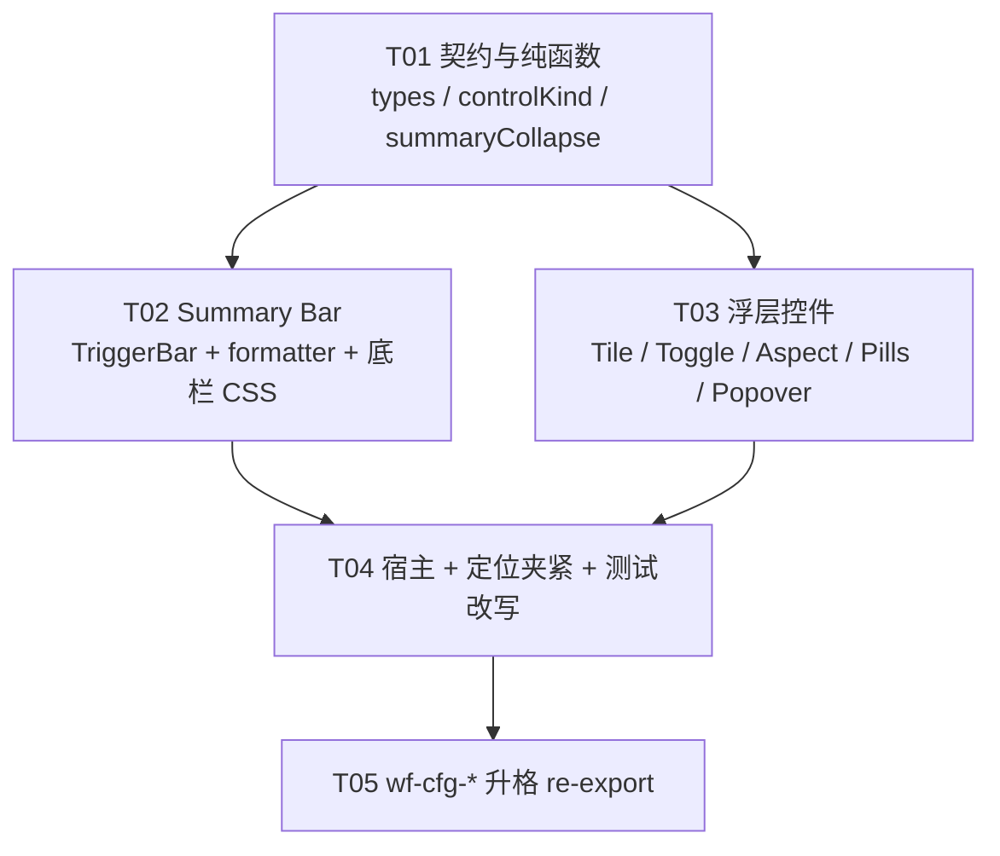

# 配置面板 UI 规范与收敛架构设计

> **文档性质**：架构 + 任务分解。视觉真源是 PRD（`/private/tmp/2026-09-07-config-panel-ui-ux-prd.md`，工作区副本策略同 `tmp/`）。L1 几何/Token 仍以 `design.md` 与 `ui-design-guidelines.md` 为准。  
> **实现栈**：现有 React + CSS（`plugins/omnimux-workflow`）。不新建 Vite 应用，不引入 MUI / Tailwind，不另起 `--omx-*` / `--wf-vp-*` 变量岛。  
> **范围铁律**：P0-a 只改视频 ConfigPanel 视觉与 DOM 结构；P0-b 抽 `wf-cfg-*`；图像/音频不得塞进 P0。`params.*` 字段名、`validateAndFallback` / `buildVideoParamTransition` 语义、`node-input-submission` 提交闸 **100% 冻结**。

---

# Part A: 系统设计

## 1. 实现方案与组件架构

### 1.1 核心技术挑战

| 挑战 | 现网根因（已核对源码） | 架构对策 |
|---|---|---|
| 底栏几何铁律冲突 | `.wf-video-trigger-bar` 高 28px、圆角 999、max-width 260；时长 pill 同样 28/999。测试 `VideoParamPopover.test.mjs` **把 28/999/260 写成契约** | 先改测试契约再改皮肤。底栏内全部 32px / 8px。浮层内 pill 同样 32/8，废除 999 |
| 摘要无折叠协议 | 整钮 `overflow: hidden` + 子项 `flex-shrink: 0` → 右侧 chevron / 有声先消失 | 纯函数 `collapseSummary(slots, availablePx)`，5 步丢弃，chevron `dropPolicy: 'never'` |
| 长中文 Segment 撕裂 | `OperationSegment` 4 项 `flex: 1` 无 nowrap；360−32 内「首尾帧生视频」断词 | 选型矩阵先行：长标签 / 溢出 → `CfgChoiceTile` 2×2，高 36px，`white-space: nowrap` |
| 弱激活态 | `--active` 仅 `interactive-bg-active` + `border-l4` | 选中 = `interactive-bg-active` **且** `1px solid var(--dsw-alias-brand-primary)`（卡片再叠加 inset 1px） |
| 有声通栏 | 独立 section + 全宽 `SoundSwitchSegment` | 与清晰度同一 `field-row`；有声 = 160px `CfgCompactToggle` |
| 类名私岛 | 全套 `wf-video-*`，图像仍幽灵 Select，音频仍齿轮抽屉 | P0-a 可暂留 `wf-video-*` 选择器；P0-b **双选择器单规则**升格 `wf-cfg-*`，禁止复制一份 CSS |
| 源码契约测试锁死旧皮肤 | 28px、999、`·`、`有声视频`、`wf-video-seg`、`size={12}` / `size={11}` | T04 一次性改写断言；不得让新 UI 去迁就旧测试 |
| 提交闸误伤 | `onParamChange` / `updateParam` / `blockGenerate` 与 UI 同居 `index.tsx` | UI 只改渲染树。写路径白名单：`operation \| aspectRatio \| resolution \| duration \| sound \| seed \| …`，禁止 `generationMode` |

**不重写**：`calculatePopoverPosition` 的 flip / 限高（200–480）/ GAP=8 / VIEWPORT_PADDING=12。只把宽度从常量 360 改为 `min(360, viewport.width - 24)`。Portal、`nowheel nodrag`、Esc / 外点、`createPortal(..., document.body)` 保持。

### 1.2 框架与模式

- **模式**：在现有 ConfigPanel 宿主上做 **Presentation Layer 收敛**，不是新 MVC 应用。数据面继续：`VideoParamAdapter`（纯函数）→ `EffectiveVideoParams` → 控件。  
- **控件选型**：`ControlKindResolver` 把 schema 字段映射到 `CfgControlKind`，禁止页面私造第四种按钮。  
- **折叠**：摘要折叠与控件选型都是 **无 React 的纯函数**，单测不挂 DOM。  
- **样式**：只消费 `--dsw-alias-*`。几何用 4px 原子字面 px（PRD 文档层 token，不进 CSS 变量岛）。  
- **分相**：P0-a 视频 DOM/CSS 可先打在现文件；P0-b 抽 `cfg/` 目录，视频文件改 re-export。P1 图像/音频另 PR。

```text
ConfigPanel (index.tsx)
 ├─ CustomSelect          模型（32×8，不动）
 ├─ VideoTriggerBar       P0-a 改皮肤；P0-b = CfgSummaryBar 门面
 ├─ GenerateButton        提交闸入口（不动语义）
 └─ VideoParamPopover     Portal 外壳（定位算法只夹宽度）
      ├─ OperationSegment → CfgChoiceTile（长标签）或 CfgSegment（短标签）
      ├─ CfgAspectGrid
      ├─ 质量行：CfgSegment(清晰度) + CfgCompactToggle(有声)
      ├─ CfgQuickPills | CfgSliderRow
      └─ 高级（P0 仍展开；P2 再折叠）
```

### 1.3 几何与 Token 映射（无私有非法 token）

| 角色 | 值 | CSS |
|---|---|---|
| 底栏控件高 | 32px | `.wf-cfg-summary-bar` / 别名 `.wf-video-trigger-bar` |
| 底栏圆角 | 8px | 禁止 999 |
| 摘要边框 | default `border-l2`；hover `border-l3`；open `brand-primary` | |
| 摘要背景 | `bg-layer-1`；hover `interactive-bg-hover`；open `interactive-bg-active` | |
| Mode 字 | 12/16/400 `label-tertiary` | |
| Value 字 | 12/16/500 `label-primary` | |
| 分区标题 | 12/16/500 `label-secondary` | |
| 卡片标签 | **12px**（废除 11px） | |
| 摘要图标 | lucide 14px，stroke 1.75 | 禁止 11/12/13 混用 |
| 比例图标 | 24px，stroke 1.5 | |
| 选中描边 | `brand-primary` | 禁止只改灰度 |
| 焦点环 | `0 0 0 2px var(--dsw-alias-state-business-tertiary)` | `:focus-visible` |
| 浮层宽 | `min(360px, calc(100vw - 24px))` | JS `resolvePanelWidth` 与 CSS 一致 |
| 浮层圆角 / 阴影 | 12px；`0 12px 32px var(--dsw-alias-bg-mask-1)`；blur(20px) | |
| 分隔 | 1×12px 竖线 `border-l2`，伪元素，废除 `·` | |
| Compact Toggle 宽 | 160px | 不得 `width: 100%` |
| Choice Tile 高 | 36px | 2 列，nowrap |
| Duration pill | 32px / 8px | 废除 28/999 |
| 按压 | `scale(0.96)` 120ms | |
| reduced-motion | P2；P0 不阻塞 | |

红线：`.wf-config-panel__bottom-bar` 内可点击容器 `height: 32px; border-radius: 8px;`。颜色 100% `--dsw-alias-*`，源码与 CSS 均禁止 hex/rgba 字面量（现网测试已锁）。

---

## 2. 文件清单

根目录：`plugins/omnimux-workflow/`。`[新建]` 仅 P0 引入；P1 图像/音频文件列在 §5 但不进入 T01–T05。

```text
src/canvas/editor/components/MaterialNode/ConfigPanel/
├── index.tsx                                          # [修改] 废除视频前 `|` 分隔；P0 不改图像 Select / 音频齿轮
├── operationUi.dom.test.mjs                           # [修改] 摘要分隔断言：无 · 字符；mode 条件渲染仍在
└── videoParams/
    ├── types.ts                                       # [修改] 追加 Cfg* 联合类型（不改 VideoNodeParams 字段）
    ├── controlKind.ts                                 # [新建] 选型矩阵纯函数
    ├── controlKind.test.mjs                           # [新建]
    ├── summaryCollapse.ts                             # [新建] 摘要 5 步折叠纯函数
    ├── summaryCollapse.test.mjs                       # [新建]
    ├── summaryFormatter.ts                            # [修改] fullText 空格拼接；废除 · 
    ├── summaryFormatter.test.mjs                      # [修改] 断言空格而非 ·
    ├── viewportPositioner.ts                          # [修改] resolvePanelWidth；flip 不动
    ├── viewportPositioner.test.mjs                    # [修改] 窄视口 width < 360
    ├── VideoTriggerBar.tsx                            # [修改] 32/8、CSS 分隔、14px 图标、折叠协议
    ├── VideoParamPopover.tsx                          # [修改] 2×2 Tile、质量行、文案「有声」、仍写 operation
    ├── SegmentControls.tsx                            # [修改] Operation 走 KindResolver；Sound 改 CompactToggle
    ├── ChoiceTile.tsx                                 # [新建] 2×N 等高 nowrap 选择块
    ├── CompactToggle.tsx                              # [新建] 160px 两态
    ├── AspectCardGrid.tsx                             # [修改] 类名可双挂；标签 12px；active brand
    ├── DurationGrid.tsx                               # [修改] 32/8；minmax 56px
    ├── AspectCardGrid.test.mjs                        # [修改] 网格注释 / pill 尺寸 / 不再要求 Segment 有声通栏
    ├── VideoParamPopover.test.mjs                     # [修改] 废除 28/999/260；锁定 32/8/focus-visible/brand
    └── videoParamsIntegration.test.mjs                # [修改] 宿主仍挂 TriggerBar；图像分支 P0 仍 CustomSelect

src/canvas/theme/components.css                        # [修改] 视频块几何；P0-b 双选择器升格 wf-cfg-*

# ----- P0-b（T05）-----
src/canvas/editor/components/MaterialNode/ConfigPanel/cfg/
├── types.ts                                           # [新建] 从 videoParams/types 再导出 Cfg*
├── CfgSummaryBar.tsx                                  # [新建] 通用摘要条
├── CfgParamPopover.tsx                                # [新建] Portal 外壳抽离（定位仍调 viewportPositioner）
├── CfgChoiceTile.tsx / CfgSegment.tsx / CfgCompactToggle.tsx
├── CfgAspectGrid.tsx / CfgQuickPills.tsx / CfgSliderRow.tsx
└── index.ts                                           # [新建] 公共出口；视频文件改 re-export

# ----- 明确不改（提交闸 / 适配器）-----
videoParams/videoParamAdapter.ts
videoParams/videoParamAdapter.test.mjs
shared/validation/operationUi.ts
docs/contracts/node-input-submission.md
```

---

## 3. 数据结构与接口

类图真源：`tmp/2026-09-07-config-panel-ui-ux-class-diagram.mermaid`。

### 3.1 冻结的写入契约（防御性断言）

```ts
/** 本迭代允许从浮层写入的 key。新增 UI 控件不得扩大此集合。 */
export type VideoParamWriteKey =
  | 'operation'
  | 'aspectRatio'
  | 'resolution'
  | 'duration'
  | 'sound'
  | 'seed'
  | 'watermark'
  | 'outputFormat'
  | 'referenceTaskType'
  | 'generationType'
  | 'returnLastFrame'
  | 'webSearch'
  | 'nsfwCheck'
  | 'fileUrl'
  | 'linkUrl';

/** 运行期断言：禁止 generationMode 与未知 key。 */
export function assertVideoParamWriteKey(key: string): asserts key is VideoParamWriteKey {
  const allowed: readonly string[] = [
    'operation', 'aspectRatio', 'resolution', 'duration', 'sound',
    'seed', 'watermark', 'outputFormat', 'referenceTaskType', 'generationType',
    'returnLastFrame', 'webSearch', 'nsfwCheck', 'fileUrl', 'linkUrl',
  ];
  if (key === 'generationMode') {
    throw new Error('UI must not write params.generationMode');
  }
  if (!allowed.includes(key)) {
    throw new Error(`UI must not write params.${key}`);
  }
}
```

`VideoNodeParams` / `EffectiveVideoParams` / `showModeUi` / `effectiveOperations` **字段不得改名、不得删**。`onParamChange` 继续 `<K extends keyof VideoNodeParams>(key: K, value: VideoNodeParams[K])`。

### 3.2 控件选型与摘要折叠（新建纯函数）

```ts
export type CfgControlKind =
  | 'summary-bar'
  | 'segment'
  | 'choice-tile'
  | 'aspect-grid'
  | 'quick-pills'
  | 'slider'
  | 'inline-switch'
  | 'compact-toggle'
  | 'select'
  | 'text-field';

export interface ControlKindInput {
  cardinality: number;
  labels: string[];
  geometric?: boolean;   // 比例 / 构图
  boolean?: boolean;
  continuous?: boolean;  // schema.range 且 options 为空
  containerPx?: number;  // 缺省按 360-32=328
}

export const CJK_LONG_THRESHOLD = 4; // >4 汉字 → 长标签

export function resolveControlKind(input: ControlKindInput): CfgControlKind {
  if (input.boolean) return input.cardinality === 2 ? 'compact-toggle' : 'inline-switch';
  if (input.geometric) return 'aspect-grid';
  if (input.continuous) return 'slider';
  const long = input.labels.some((l) => [...l].length > CJK_LONG_THRESHOLD);
  const overflow = estimateSegmentOverflow(input.labels, input.containerPx ?? 328);
  if (long || (input.cardinality >= 4 && overflow)) return 'choice-tile';
  if (input.cardinality >= 6) return 'select';
  return 'segment';
}

export type CfgSummarySlotId = 'mode' | 'ratio' | 'resolution' | 'duration' | 'sound' | 'chevron';

export interface CfgSummarySlot {
  id: CfgSummarySlotId;
  text: string;
  hasIcon: boolean;
  dropPolicy: 'hide' | 'icon-only' | 'ellipsis' | 'never';
  estimatePx: number; // 含自身 gap；由调用方按 12px 字 + 14px 图标估算，单测传入夹具
}

export interface CfgSummaryVisibleState {
  hidden: ReadonlySet<CfgSummarySlotId>;
  iconOnly: ReadonlySet<CfgSummarySlotId>;
  ellipsis: ReadonlySet<CfgSummarySlotId>;
}

/** 从低到高丢弃。每步后复测 totalPx。 */
export const COLLAPSE_ORDER: readonly CfgSummarySlotId[] = [
  'mode',        // 1 隐藏文本（整段）
  'sound',       // 2 隐藏文字，仅留 Volume；无声本就不渲染
  'ratio',       // 3 隐藏比例文字，仅留几何图标
  'resolution',  // 4 隐藏清晰度
];

export function collapseSummary(
  slots: readonly CfgSummarySlot[],
  availablePx: number,
): CfgSummaryVisibleState
```

折叠不变量（单测锁死）：

1. `chevron` 的 `dropPolicy` 必须是 `'never'`；结果集不得把它放入 `hidden`。  
2. `duration` 尽量保留；仅当 1–4 步后仍溢出时，数值进 `ellipsis`，图标保留。  
3. 半个汉字不允许：ellipsis 作用在整段槽位，CSS `overflow: hidden` 不得落在整颗 button 上导致「有…」「生…」。  
4. `title` / `aria-label` 始终为 `formatSummaryA11yText`（空格拼接，无 `·`）。

### 3.3 组件 Props（TypeScript）

```ts
export interface CfgSummaryBarProps {
  slots: CfgSummarySlot[];
  visible: CfgSummaryVisibleState;
  fullText: string;
  isOpen: boolean;
  disabled?: boolean;
  onToggle: () => void;
}

export interface VideoTriggerBarProps {
  params: EffectiveVideoParams;
  isOpen: boolean;
  disabled?: boolean;
  onToggle: () => void;
}

export interface CfgChoiceTileProps<T extends string | number> {
  options: Array<{ value: T; label: string }>;
  value: T | undefined;
  onChange: (v: T) => void;
  columns?: 2;
  itemHeight?: 36;
  ariaLabel: string;
}

export interface CfgCompactToggleProps {
  value: boolean;
  onChange: (v: boolean) => void;
  trueLabel: string;   // 「有声」
  falseLabel: string;  // 「无声」
  widthPx?: 160;
  ariaLabel: string;
}

export interface CfgAspectGridProps {
  value: string;
  options: Array<{ value: string; label: string }>;
  onChange: (v: string) => void;
}

export interface CfgQuickPillsProps {
  value: number;
  options: Array<{ value: number; label: string }>;
  onChange: (v: number) => void;
}

/** 现网 VideoParamPopoverProps 保持字段兼容，避免宿主大改 */
export interface VideoParamPopoverProps {
  triggerRef: RefObject<HTMLElement>;
  params: EffectiveVideoParams;
  schema: ModelParameterSchema;
  modelItem?: CapabilityModelItem;
  isOpen: boolean;
  onClose: () => void;
  onParamChange: <K extends keyof VideoNodeParams>(key: K, value: VideoNodeParams[K]) => void;
}
```

`OperationSegment`：`operations.length <= 1 → return null` **铁律保留**。内部改为：

```
kind = resolveControlKind({ cardinality, labels, containerPx: 328 })
kind === 'choice-tile' ? <CfgChoiceTile/> : <CfgSegment nowrap/>
```

`SoundSwitchSegment` 改为渲染 `CfgCompactToggle`（160px），删除通栏 `Segment`。`BooleanSwitchSegment` P0 仍可留在高级行内，但宽度锁 160px（现网 `.wf-video-param-popover__field-row .wf-video-seg { width: 160px }` 已有）。

### 3.4 浮层信息架构（视频 P0）

```
[生成方式]  ops≥2 → Choice Tile 2×2
[比例]      Aspect Grid 4 列，末行诚实空列（Q1 已拍板）
[清晰度][有声]  同一 field-row；窄宽允许折成两行，但各自不是通栏 Segment（Q2）
[时长]      options → Quick Pills 32/8；range → Slider + 当前值 + 可选「自动」
[文档/网页 URL]  条件槽，不变
[高级参数]  P0 仍默认展开（折叠属 P2）
```

微文案：分区「有声视频」→「有声」。高级布尔「开启/关闭」P2 再改为「开/关」。

### 3.5 类图（摘要）

见 `tmp/2026-09-07-config-panel-ui-ux-class-diagram.mermaid`。关系要点：

- `ConfigPanel` 组合 `VideoTriggerBar` + `VideoParamPopover`，依赖 `VideoParamAdapter`（只读解析）。  
- `VideoTriggerBar` P0-b 门面到 `CfgSummaryBar`，调用 `SummaryCollapse`。  
- `OperationSegment` 经 `ControlKindResolver` 升级 `CfgChoiceTile`。  
- `SoundSwitchSegment` 降级 `CfgCompactToggle`。  
- `ViewportPositioner` 只增加 `resolvePanelWidth`。

---

## 4. 程序调用流

时序图真源：`tmp/2026-09-07-config-panel-ui-ux-sequence-diagram.mermaid`。

### 4.1 挂载与折叠

```
ConfigPanel
  → resolveEffectiveVideoParams(...)          // 现网，不改
  → VideoTriggerBar(params)
       → formatVideoSummary(params)           // fullText 空格
       → collapseSummary(slots, clientWidth)  // 纯函数
  → GenerateButton(disabled=blockGenerate)    // 提交闸，不改
```

宽度测量：`ResizeObserver` 或 `useLayoutEffect` 读 `button.clientWidth`。协议本身不读 DOM，便于单测。

### 4.2 打开浮层 / 改参 / 关闭

与现网一致：`onToggle` → `calculatePopoverPosition` → Portal；`onParamChange('operation' | 'aspectRatio' | …)` → `updateParam` → 再 `resolveEffectiveVideoParams`。Esc / 外点 / `nowheel nodrag` 不变。

入场动画（P0 可做最小集）：`placement=top` 用 `translateY(4px)→0`；`bottom` 用 `translateY(-4px)→0`。现网单一 `translateY(-4px)` 与 top 弹出方向相反，P0 若改动成本低则随 CSS 一起修，否则标 P2。

### 4.3 模型切换与生成（本迭代零改动）

`handleModelChange` → `buildVideoParamTransition` → 可选 `pendingVideoParamAdjustment`（确认调整 / 保留原值）。`onGenerate` 仍走 `blockGenerate` / `disabledReason`。架构验收：`git diff` 不得出现 `videoParamAdapter.ts`、`operationUi.ts`、`GenerateButton` 语义 hunk。

---

## 5. 未决与假设

| ID | 决议（架构锁死，除非主理人改口） | 来源 |
|---|---|---|
| Q1 | 7 个比例末行 3 项：**诚实空列**，不拉宽、不幽灵占位 | PRD 建议默认 |
| Q2 | 清晰度+有声同一行；浮层过窄 **允许折成两行 field-row** | PRD 建议默认 |
| Q3 | **分 PR**：P0-a 视频视觉 → P0-b `wf-cfg-*` → P1 图像/音频 | PRD 已拍板 |
| Q4 | Mode 折叠后 **不留徽章**，靠 `aria-label` | PRD 建议默认 |
| A1 | P0 高级参数 **保持展开**（折叠属 P2），避免与视觉债抢 diff | 范围控制 |
| A2 | `getModelVisuals` ⏱🔊 属 P2；P0 不阻塞。若 T04 已打开 `index.tsx` 且 hunk 小，允许顺手删 emoji | PRD P1/P2 |
| A3 | 主仓 `docs/system_design.md` 仍是 2026-09-03 浮层收口稿；本文覆盖其 **UI 层**，不废弃 Adapter/Portal | git-wt |
| A4 | 不把配置面板做成独立 Stage；不改生产 profile | PRD 非目标 |

---

# Part B: 任务分解

## 6. 依赖包

无新第三方包。沿用现网：

```
- react（工作区已有）：UI
- lucide-react（已有）：Clock / Volume2 / VolumeX / ChevronDown / Maximize2
- 无 MUI、无 Tailwind、无新 CSS-in-JS
```

前端实现者不得 `pnpm add`。

---

## 7. 任务列表（依赖序，硬上限 5）

> 分组按模块，不按单文件。T02 / T03 只依赖 T01，可并行。图像/音频不进本 5 任务。

### T01 — 项目基础设施：Cfg 契约 + 纯函数选型/折叠

- **Priority**: P0  
- **Dependencies**: 无  
- **Source Files**:
  1. `.../videoParams/types.ts`（追加 `CfgControlKind` / `CfgSummarySlot` / `VideoParamWriteKey` / `assertVideoParamWriteKey`，**不改** `VideoNodeParams`）
  2. `.../videoParams/controlKind.ts`（新建）
  3. `.../videoParams/controlKind.test.mjs`（新建）
  4. `.../videoParams/summaryCollapse.ts`（新建）
  5. `.../videoParams/summaryCollapse.test.mjs`（新建）
- **输入契约**：
  - `resolveControlKind({ cardinality: 4, labels: ['文生视频','首帧生视频','首尾帧生视频','全能参考生视频'] }) === 'choice-tile'`
  - 短标签 `['480p','720p']` → `'segment'`
  - 布尔 → `'compact-toggle'`
  - 比例 `geometric: true` → `'aspect-grid'`
  - `collapseSummary` 5 步夹具：超宽依次丢 mode → sound 文字 → ratio 文字 → resolution；chevron 始终可见；duration 最后 ellipsis
- **防御**：测试覆盖 `assertVideoParamWriteKey('generationMode')` 抛错。  
- **完成证据**：纯函数单测全绿；无 CSS/DOM 也能合入。

### T02 — Summary Bar：几何铁律 + 折叠接入 + 摘要文案

- **Priority**: P0  
- **Dependencies**: T01  
- **Source Files**:
  1. `.../videoParams/VideoTriggerBar.tsx`
  2. `.../videoParams/summaryFormatter.ts`
  3. `.../videoParams/summaryFormatter.test.mjs`
  4. `src/canvas/theme/components.css`（仅 `.wf-video-trigger-bar*` 块：32px / 8px / 无 260 / 无 999 / 无 `__dot` 字符依赖 / focus-visible / open brand 边框）
- **行为**：
  - 废除 `·` DOM；段间 `::after` 竖线 `border-l2`
  - Mode `label-tertiary`；值 500 primary
  - 图标 14px（AspectRatioIcon / Clock / Volume2 / ChevronDown）
  - `max-width: 100%`；`min-width: 0`
  - `ResizeObserver` → `collapseSummary`
  - `aria-haspopup="dialog"` / `aria-expanded` / `aria-label=fullText` 保留
- **fullText**：`segments.join(' ')`，单测由 `'16:9 · 2K · 8s · 有声'` 改为 `'16:9 2K 8s 有声'`，并断言 `!fullText.includes('·')`。

### T03 — 浮层控件：Choice Tile / Compact Toggle / Aspect / Pills

- **Priority**: P0  
- **Dependencies**: T01  
- **Source Files**:
  1. `.../videoParams/ChoiceTile.tsx`（新建）
  2. `.../videoParams/CompactToggle.tsx`（新建）
  3. `.../videoParams/SegmentControls.tsx`
  4. `.../videoParams/AspectCardGrid.tsx`
  5. `.../videoParams/DurationGrid.tsx`
  6. `.../videoParams/VideoParamPopover.tsx`
  7. `src/canvas/theme/components.css`（seg / tile / aspect / pill / 质量行；active brand；label 12px；pill 32/8；section「有声」不再通栏）
- **行为**：
  - `OperationSegment`：≤1 仍 `null`；≥2 且长标签 → 2×2 Tile，nowrap，高 36px；写 `onChange(operationId)`
  - 质量行：清晰度 `ResolutionSegment`（短标签 Segment + nowrap）与有声 `CfgCompactToggle` 同行
  - 文案「有声视频」→「有声」
  - Aspect：`repeat(auto-fill, minmax(72px, 1fr))` 或保持 4 列；末行空列；active inset brand
  - Duration：`minmax(56px, 1fr)`，高 32，圆角 8
  - `onParamChange` 仍只写白名单 key；源码断言 `doesNotMatch generationMode`
  - 每个可点击控件补 `:focus-visible`
- **防御**：Tile 标签 CSS `white-space: nowrap; word-break: keep-all;`。禁止 `break-all`。

### T04 — 宿主接线、定位夹紧、回归测试改写

- **Priority**: P0  
- **Dependencies**: T02, T03  
- **Source Files**:
  1. `.../ConfigPanel/index.tsx`（删除视频前 `wf-param-pill__divider`；**不**把图像/音频改成 Summary Bar）
  2. `.../videoParams/viewportPositioner.ts` + `viewportPositioner.test.mjs`
  3. `.../videoParams/VideoParamPopover.test.mjs`
  4. `.../videoParams/videoParamsIntegration.test.mjs`
  5. `.../videoParams/AspectCardGrid.test.mjs`
  6. `.../ConfigPanel/operationUi.dom.test.mjs`
- **定位**：`width: resolvePanelWidth(vWidth)` = `Math.min(360, Math.max(0, vWidth - 24))`；左缘仍 VIEWPORT_PADDING。场景 4 单测改为「left+width 不超出 viewport-12」。  
- **测试改写清单（必须，否则 P0 无法合入）**：

| 文件 | 旧锁 | 新锁 |
|---|---|---|
| `VideoParamPopover.test.mjs` | height 28 / radius 999 / max-width 260 / `__dot` / 时长 28 / 「有声视频」 | height 32 / radius 8 / max-width 100% / 无 `__dot` 或仅兼容注释 / pill 32 / 「有声」/ `brand-primary` / `focus-visible` |
| `summaryFormatter.test.mjs` | ` · ` 拼接 | 空格拼接，无 `·` |
| `AspectCardGrid.test.mjs` | 注释中 `repeat(4, 1fr)`、有声走 `wf-video-seg` | Tile/CompactToggle 类名；label 12px；pill minmax(56px) |
| `operationUi.dom.test.mjs` | TriggerBar 条件 mode；可保留 `wf-trigger-mode` | 断言无 `·` 字符节点；`showMode ? (` 仍在 |
| `videoParamsIntegration.test.mjs` | 图像仍 CustomSelect | **P0 保持该断言**（图像改属 P1） |
| `viewportPositioner.test.mjs` | `pos.width === 360` | 宽视口仍 360；`viewport.width=320` → width=296 |

- **冻结断言（不得删）**：Portal + body、Esc/外点、nowheel nodrag、`onParamChange('operation')`、`showModeUi`、`hasSoundSupport`、`buildVideoParamTransition`、`pendingVideoParamAdjustment`、无 `--omx-`、无 hex。  
- **完成证据**：`pnpm --filter omnimux-workflow test` 中上述文件全绿；`git diff` 无 `videoParamAdapter.ts` 业务 hunk。

### T05 — P0-b：`wf-cfg-*` 升格（视频改 re-export）

- **Priority**: P0-b（P1 图像的前置；可与 P0-a 分 PR）  
- **Dependencies**: T04  
- **Source Files**（≥3）：
  1. `.../ConfigPanel/cfg/index.ts` + `cfg/types.ts`
  2. `.../cfg/CfgSummaryBar.tsx`、`CfgChoiceTile.tsx`、`CfgCompactToggle.tsx`、`CfgAspectGrid.tsx`、`CfgQuickPills.tsx`（从 T02/T03 迁出）
  3. `src/canvas/theme/components.css`（**单规则双选择器**：`.wf-cfg-summary-bar, .wf-video-trigger-bar { ... }`，禁止两套数值）
  4. `VideoTriggerBar.tsx` / `ChoiceTile.tsx` 等改为 re-export 或薄包装
- **完成证据**：视频行为零回归；CSS 中每个几何值只出现一次；`rg "height: 28px" components.css` 在视频块为 0；图像/音频仍旧入口（P1 另 PR）。

---

## 8. Shared Knowledge（前后端 / 测试共用）

```
- 无 HTTP API。配置面板是画布节点 UI；「后端」此处 = VideoParamAdapter + operationUi + 提交闸。
- 所有 API/params 写入保持现网：canonical params.operation（开 string），禁止 generationMode。
- 日期/鉴权与本需求无关。
- 颜色只走 --dsw-alias-*；禁止 --omx-*、--wf-vp-*、JS isDark 分支。
- 有效 ops ≤ 1：不渲染生成方式 DOM，摘要不渲染 mode 段。
- Hide, Don't Grey：不支持的 operation / 模型不得进 DOM。
- 提交闸：blockGenerate / quietReason / pendingVideoParamAdjustment 文案与按钮语义冻结。
- 单测风格：纯函数用 node:test 真值；组件用 readFileSync 源码契约（仓库惯例），新增折叠协议必须是真值单测而非源码正则。
- IAB：P0 需收起截断 + 展开四模式 + 有声行内 三张 PNG（plugin QA 合同）；HTTP 200 / 单测绿 ≠ 通过。
- 物化：合入 main 后必须 sync omnimux-workflow 到 ~/.omnimux-dev；本设计阶段不物化。
```

### 8.1 对提交闸的隔离清单

| 模块 | P0 是否允许改 | 说明 |
|---|---|---|
| `videoParamAdapter.ts` | 否 | 解析/降级/pending 语义冻结 |
| `operationUi.ts` | 否 | effectiveOps / showModeUi |
| `GenerateButton` / `blockGenerate` | 否 | |
| `updateParam` 字段名 | 否 | 只改谁调用、不改 key |
| `node-input-submission.md` | 否 | |
| ConfigPanel 视频渲染树 | 是 | TriggerBar / Popover / 分隔符 |
| ConfigPanel 图像 Select | P0 否 | P1 |
| ConfigPanel 音频齿轮 | P0 否 | P1 |

---

## 9. 任务依赖图



T02 与 T03 并行。T05 可单独 PR（Q3）。

---

## 10. 给前端的实施顺序与禁止项

**做**：按 T01 → (T02 ∥ T03) → T04；测试与皮肤同一 PR，否则旧 28/999 断言会红。  
**禁止**：

- 为图像/音频在 P0 复制一套 CSS  
- 改 Adapter / 提交闸「顺便重构」  
- 用 `ellipsis` 砍在整颗 TriggerBar 上而不走折叠协议  
- 生成方式继续单行 `flex: 1` Segment  
- 有声恢复通栏 section  
- 新增 hex、`--omx-*`、原生 `<select>`、emoji 图标  
- 在主仓 `main` 直接改 tracked 文件（必须 `git-wt.sh start`）

**P1 预留（非本 5 任务）**：图像废除 `wf-param-pill--video-summary` 幽灵 Select；音频非 ASR 废除齿轮抽屉；二者只消费 `cfg/`。

---

## 11. 验收对照（架构层）

| PRD 条款 | 落点 |
|---|---|
| 32/8，废除 28/999 | T02 CSS + T04 测试改写 |
| 折叠协议可单测 | T01 `summaryCollapse.test.mjs` |
| 生成方式零断词 | T03 ChoiceTile nowrap |
| 有声行内 160px | T03 CompactToggle |
| brand 描边 | T02/T03 CSS |
| focus-visible | T02/T03 |
| 不改 params 闸 | T01 assert + T04 diff 门禁 |
| `wf-cfg-*` | T05 |
| 图像/音频同一入口 | **P1，不在 T01–T05** |
