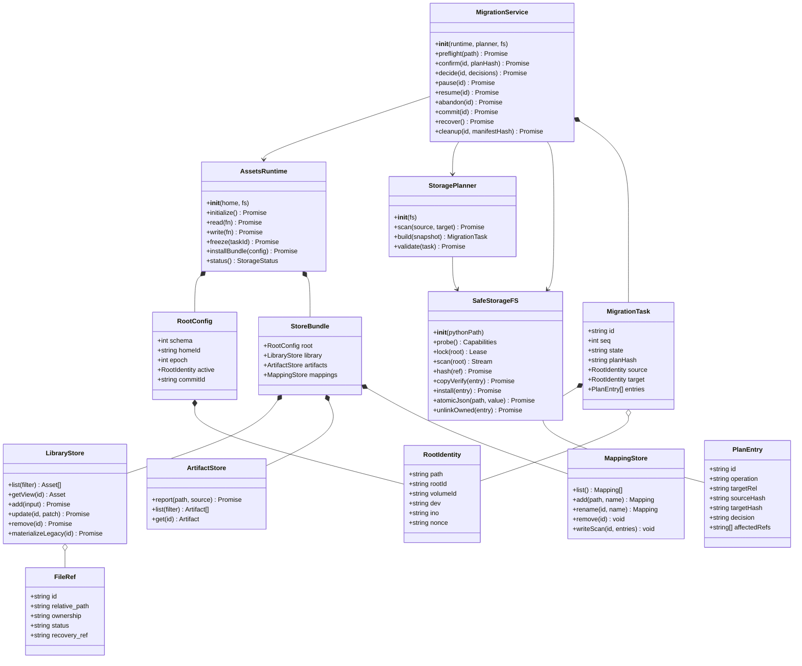
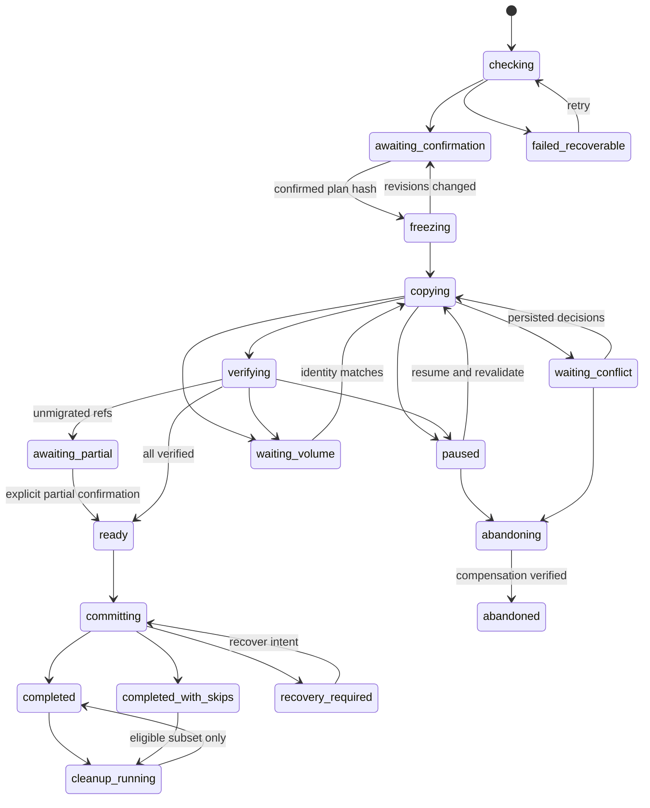
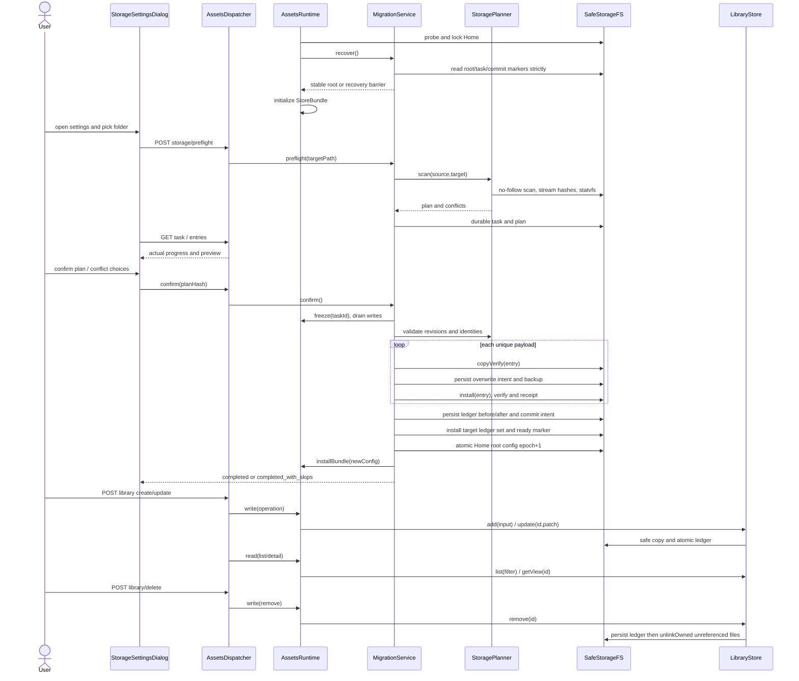
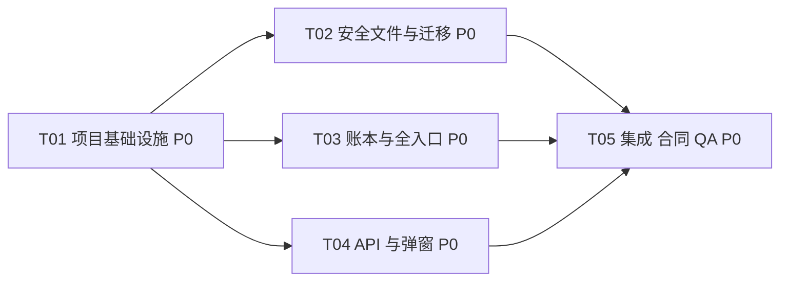

# Issue #766｜资产库自定义根与安全迁移合并架构

> **流程部分 SUPERSEDED — 2026-09-09 / #864：** 下文 L2 独立运行、端口/profile/link 与合入前浏览器验收要求退役；存储、迁移安全、平台兼容与原生选择证据要求不变。当前流程见 [dev-pipeline](../contracts/dev-pipeline.md) 和 [plugin-qa](../contracts/plugin-qa.md)：worktree 自动化/静态与独立评审 → required CI/MQ → main → 按需 Dev 45120/ego及原生验收。历史失败与未验状态不重标。

- 架构负责人：高见远；状态：设计交付，未实施、未运行验收。
- 需求真源：[完整 PRD](2026-09-08-assets-storage-prd.md)（332 行已全文读取）。P0 全部保留，不以“先改路径”替代迁移安全。
- 核验表面：本地固定 base = HEAD `5485c25875cb9f71d7cb78a6aa69d07e07fffbab`，分支 `agent/assets-storage-issue-766`，仅工作树 `.worktrees/assets-storage-766`；不是远端最新分支审查。
- 写入边界：本轮仅架构文档与提取图；合同、README、manifest 由工程师实施。本轮未读客户素材内容、未迁移任何资产、未改共享 Dev/Prod、未 push/部署。

## Part A：系统设计

## 1. 实施方案与代码证据

### 1.1 核验事实及 PRD 用词修正

下表均为本工作树实际代码，不将规范目标当成现成功能。

| 位置 | 已核实事实 | 必须采取的设计 |
| --- | --- | --- |
| `plugins/omnimux-assets/src/paths.js:9–29` | home 优先级 `homeDir > DSH_HOME > ~/.dsh`，没有 profile ID 参数 | **一个解析后 DSH Home 一个生效根**；PRD“每 Profile”仅指拥有独立 DSH_HOME 的运行环境。相同 Home 的不同 Profile 共用根，不能按 profile 名新建空库 |
| `src/index.js:54–60`、`library.js:264–268` | 启动时创建并捕获三个 store 及根；启动即 migrateMappings | 一个 AssetsRuntime 拥有当前 store bundle；恢复检查先于 store 创建和遗留迁移 |
| `library.js:270–285`、`artifacts.js:61–74`、`mappings.js:64–77` | JSON 错误、权限错误、未知 schema 等可落入空账本；hydrate 丢弃未知字段 | 严格区分不存在、损坏、不兼容、离线；禁止自动空库覆盖；迁移解析保存业务元数据 |
| `library.js:358–390,477–480,518–522,649–686` | list/detail/files/preview 可同步复制遗留绝对路径并 persist | GET 不一定只读，迁移写锁必须覆盖；把惰性物化变为受 Runtime 管理的异步写作业，迁移中禁用 |
| `library.js:421–429,598–605` | 删除记录后递归 rm 整个 ID 目录且吞错误 | 依据文件所有权和全库引用逐项回收，禁止 ID 目录递归删除 |
| `ingest.js:117–134,141–150,183–197` | 根路径检查主要为词法；遍历 stat 跟随链接；没有复制后哈希 | 不直接用现有 copyTree 执行迁移；补 no-follow 安全原语与流式校验 |
| `artifacts.js:107–132` | report 整文件 readFileSync 哈希；已存在散列文件只判断 isFile | 上传也纳入锁和有界流式操作；既有落点必须验证真实内容 |
| `protocol.js:76–135` | 独立解析固定根，startsWith 无分隔边界；typed URI 生成/还原不对称 | 所有全局 URI 使用当前 root snapshot，修复可验证 round-trip，拒绝越界，逻辑资产 ID/handle 与物理路径分开 |
| `scanner.js:136–177` | 单层扫描最多 2000 项，出错返回 [] | 迁移专用异步遍历不得复用截断扫描；浏览纳管大目录须分页，错误可见 |
| `picker.js:57–74` | macOS osascript；文件夹也是多选；其他平台 501 | 新增明确的单目录选择模式，不从多选结果静默取第一项；原普通导入多选不改 |
| `client/AssetsStage.jsx:139–148`、`AddAssetDialog.jsx:64–87` | 搜索工具区与 dsh-ui-kit ModalDialog/IconButton 已有 | 齿轮紧邻搜索左侧；弹窗复用现有组件和 tokens |
| `client/use-assets-feed.js:13,141–180` | 常规 5 秒轮询，Hub 健康时可能完全停轮询 | 迁移独立 500ms 状态轮询；Hub 事件仅提示刷新，不能作为恢复真源 |
| Workflow `library/libraryHttp.ts:19–45`、`workspace/ProjectAssetsStore.ts:540–570` | 通过 HTTP 取全局 detail，运行时使用 real_path 再 copy 到项目 | 保留响应兼容的临时 real_path；持久化全局只存相对路径；项目复制规则不改 |
| Hub `host/composer-attachments.js:501–525,541–599` | 跨插件 HTTP，detail 失败可能回退 list；复制主体只接收普通文件 | 全局入口统一离线/锁错误；不声称现有 Hub 支持整目录实例化。本需求不扩展该能力 |
| Workflow `ingest/IngestionPipeline.ts:219–241` | 目录实例化 stat 递归跟随源链接 | 含链接/特殊项的原位目录不能整体暴露为可物化 files；须安全可见过滤，详见 §4.4 |

### 1.2 选型与取舍

**选定：现有 Node ESM 插件 + 单一 Runtime + JSON 账本/事务清单 + 一个窄 Python 文件系统助手。** 不引入数据库、消息队列、工作流引擎、第二路由中心。React/dsh-ui-kit 不替换为默认技术栈。

方案对比：

1. 只修改 paths、逐文件 copy 后替换根：代码少，但在跨卷、覆盖、坏 schema、旧闭包、TOCTOU 下无法满足 P0，拒绝。
2. 通用 SQLite/CAS 存储和虚拟文件系统：一致性强但要求全量数据模型重写、目录快照/协议改造，超出最小范围，拒绝。
3. **窄事务方案**：单个迁移任务、少量持久化 JSON 快照、每文件状态文件、一个提交意图；通过恢复屏障解决跨根无原子事务的问题。保留用户树和现有 REST，成本集中在迁移、所有权和安全 I/O。

Node 现成 fs API 未提供可直接用于整个目录链的 `openat/renameat/unlinkat` 安全执行接口。反复 realpath + O_NOFOLLOW 只能防最后一段，不能把父目录替换竞态说成已解决。助手只负责相对目录 FD 的扫描/校验/copy/install/unlink/fsync/lock；业务决策仍在 JS。使用 Python 标准库 `os`、`hashlib`、`fcntl`、`json`，无第三方 Python 包、无 shell 命令拼接。

只读能力探测：本机 `/opt/homebrew/bin/python3` 为 3.14.6，open/stat/mkdir/rename/unlink/rmdir/link 支持 dir_fd，O_NOFOLLOW 和 statvfs.f_fsid 存在。这**不证明打包 L2 或客户机器有 Python**；T01 必须执行启动能力检查，缺失时新迁移明确 `storage-platform-unsupported`，禁止回退不安全 JS 实现。macOS 本地卷为本次 P0 正式验证面；不得为解决依赖修改官方 Host 或 desktop fork。支持边界、二进制声明写入 README/manifest。

## 2. 文件清单

相对仓库根；A=新增，M=修改，R=只读回归核对。每个新增模块只对应本需求的一层职责。

| 组 | 文件 | 责任 |
| --- | --- | --- |
| 基础 | M `plugins/omnimux-assets/package.json` | 包装助手、测试入口、描述与依赖声明；不升级无关依赖 |
| 基础 | M `plugins/omnimux-assets/dsh.manifest.json` | 限定新 storageDomains 与 python3/osascript 能力说明；不声明任意目录写权 |
| 基础 | M `plugins/omnimux-assets/src/index.js` | 初始化 Runtime、工具适配、生命周期与事件 |
| 基础 | M `plugins/omnimux-assets/src/paths.js` | Home 控制位置与内容根分离 |
| 基础 | A `plugins/omnimux-assets/src/storage-types.js` | JSDoc 数据结构、状态、错误码、schema 校验 |
| 基础 | A `plugins/omnimux-assets/src/storage-runtime.js` | 当前 bundle、统一读写 gate、初始化/恢复、epoch |
| 安全 I/O | A `plugins/omnimux-assets/src/storage-fs.js` | 助手进程 IPC、deadline、类型校验；无泛化 RPC |
| 安全 I/O | A `plugins/omnimux-assets/src/storage-fs.py` | 目录 FD 原语、流式 hash/copy、无覆盖安装、flock/fsync |
| 事务 | A `plugins/omnimux-assets/src/storage-plan.js` | 异步扫描、身份/空间检查、hash 去重、冲突与 ID/ref 映射 |
| 事务 | A `plugins/omnimux-assets/src/storage-migration.js` | 任务执行、逐文件状态、覆盖日志、恢复、提交、清理 |
| 账本 | M `plugins/omnimux-assets/src/library.js` | 严格 schema、所有权、只读视图、显式物化、文件级 GC |
| 账本 | M `plugins/omnimux-assets/src/artifacts.js` | 严格 schema、受保护的内容引用、流式 report |
| 账本 | M `plugins/omnimux-assets/src/mappings.js` | 严格加载、相对映射兼容、缓存写 gate |
| 账本 | M `plugins/omnimux-assets/src/ingest.js` | 保留 copy 语义，采用安全目标路径/流式原语，禁止递归链接 |
| 账本 | M `plugins/omnimux-assets/src/scanner.js` | no-follow、分页、排除项和错误显式化 |
| 账本 | M `plugins/omnimux-assets/src/protocol.js` | root-aware 全局 URI，与逻辑引用区分 |
| API/UI | M `plugins/omnimux-assets/src/http-routes.js` | Runtime dispatch、storage API、错误码、预览流 lease |
| API/UI | M `plugins/omnimux-assets/src/picker.js` | 单目录模式，无变化地保留普通多选 |
| API/UI | M `plugins/omnimux-assets/src/client/AssetsStage.jsx` | 设置图标、弹窗挂载、锁/离线反馈 |
| API/UI | A `plugins/omnimux-assets/src/client/StorageSettingsDialog.jsx` | 设置、计划、冲突、恢复、清理视图 |
| API/UI | A `plugins/omnimux-assets/src/client/use-storage-task.js` | 500ms 状态轮询、重开和请求去重 |
| API/UI | M `plugins/omnimux-assets/src/client/api.js` | storage API、epoch、分页参数 |
| API/UI | M `plugins/omnimux-assets/src/client/use-assets-feed.js` | 切根失效、陈旧响应丢弃、离线/锁处理 |
| API/UI | M `plugins/omnimux-assets/src/client/AssetBrowse.jsx` | 大目录分页与不安全项提示 |
| API/UI | M `plugins/omnimux-assets/src/client/ConfirmRemoveDialog.jsx` | 原位项仅摘索引及共享引用文案 |
| API/UI | M `plugins/omnimux-assets/src/client/icons.jsx`、`locales.js`、`styles.js` | SVG/双语/现有 token 几何 |
| 验证 | A `plugins/omnimux-assets/src/storage-runtime.test.js`、`storage-plan.test.js`、`storage-migration.test.js`、`storage-fs.test.js` | 隔离样本、故障注入、重启与 FD 边界 |
| 验证 | A `plugins/omnimux-assets/src/client/StorageSettingsDialog.test.js` | 状态/按钮/焦点及请求契约 |
| 验证 | M `plugins/omnimux-assets/src/library.test.js`、`artifacts.test.js`、`mappings.test.js`、`protocol.test.js`、`scanner.test.js`、`picker.test.js`、`http-routes.test.js`、`tools.test.js`、`client-layout.test.js` | 既有入口回归与坏 schema 测试 |
| 文档 | M `docs/contracts/project-assets-contract.md`、`plugins/omnimux-assets/README.md` | 仅全局库限定例外；其他物化规则不改 |
| 交接 | A `docs/implementation/issue-766-assets-storage.md`、`docs/qa/issue-766-assets-storage.md` | 工程/QA 实际证据、失败与边界 |
| 回归只读 | R Workflow `libraryHttp.ts`、`ProjectAssetsStore.ts`、`IngestionPipeline.ts`；Hub `composer-attachments.js` | 验证 HTTP seam、项目快照不回写、不扩其他插件写权限 |

本文内嵌完整类图、时序图和依赖图；提取为 [类图](2026-09-08-assets-storage-class-diagram.mermaid) 与 [时序图](2026-09-08-assets-storage-sequence-diagram.mermaid)，使用 issue 专属名称，不覆盖仓库已有其他需求的 `docs/system_design.md`、`docs/class-diagram.mermaid`、`docs/sequence-diagram.mermaid`。

## 3. 数据结构、控制布局与接口

### 3.1 两种位置、一个配置真源

```text
<resolved DSH Home>/omnimux/assets-storage/       # 稳定控制区，不能随根迁移
  root.json                                    # 唯一生效根指针 + epoch + commitId
  owner.lock                                   # 本机 Home 独占 writer，助手持有 flock
  active-task.json                             # 当前任务 ID；终结后历史摘要仍在 tasks
  tasks/<taskId>/
    task.json                                  # 原/目标身份、确认计划 hash、状态
    plan.json                                  # 不变计划与记录/路径映射
    decisions.json                             # 冲突决定 + 有效 fingerprint 范围
    entries/<entryId>.json                      # 每文件写前意图、校验、安装、回收状态
    commit.json                                # 提交意图、各账本前/后 hash、root 前/后镜像
    report.json                                # 跳过/排除/清理凭据
<active root>/                                  # 缺省仍 <Home>/omnimux/assets
  library.json, artifacts.json, mappings.json   # 兼容的全局账本位置
  data/files/<id>/...                           # 新普通导入规范目录
  artifacts/<prefix>/<hash>.<ext>               # 新上报产物
  <用户原有任意相对树>/                          # 不搬入 data/files 再纳管
  .omnimux-assets/                              # 本插件明确的控制/恢复区
    root.json                                  # magic/version/rootId；不是第二生效根配置
    owner.lock                                 # 目标/源根 writer 独占
    transaction.json                           # pending commitId + Home 身份，不含无限授权
    transactions/<taskId>/                     # ledger 前/后版本、payload staging/恢复版本
    versions/<versionId>/...                    # 被旧目标记录仍引用的内容版本（非可清理备份）
```

控制区 `0700`、JSON `0600`；仅对自建项设权限，不递归 chmod 用户树。根选择及任务日志可含必要绝对路径；项目账本不许落绝对路径。root.json 只允许迁移服务 commit 写，不新增 Config/localStorage/环境变量第二可编辑根。Settings 现行合同并未提供已核验的跨文件事务 Config API；这里是插件自有的领域数据指针，而非新增 Settings 平行页面。UI 在本页 Modal 内编辑待选值，应用只能提交已确认迁移。

配置缺失：仅按旧 Home 默认位置读取；不存在的全新默认库可显式初始化。配置损坏/根不可读/目标断开：返回错误或离线，绝不回落默认并建库。曾注册根中的必需账本缺失也是损坏，不当成全新空库。

### 3.2 核心模型

- `RootConfig{schema:1, homeId, epoch, active:{path,rootId,identity}, commitId}`。identity 包含 canonical path、卷 fsid、root dev/ino、应用 marker nonce；不能仅用 path 判断重连同一磁盘。尚无 marker 的旧库先用卷/目录身份和三账本 hash 预检，确认后受锁创建 marker。
- `LibraryLedger{schema:3, revision, migrated_mappings, assets, file_inventory}`：兼容 schema2 的显式升级；不丢 name/type/description/tags/cover/source/时间字段。未知 schema fail closed。
- `FileRef{id, relative_path?, original_name, logical_path?, ownership:'managed'|'adopted'|'legacy-external'|'unknown', status?:'available'|'unmigrated'|'excluded', recovery_ref?}`。logical_path 仅表示同一资产内原目录层级，必须也是安全 POSIX 相对路径；不用于磁盘寻址。不可见项无指向异内容的 relative_path；旧 external 仅在兼容输入/受限旧账本内允许 real_path，新输出账本不再增加外部绝对路径。
- `InventoryEntry{relative_path, kind, ownership, size, sha256?, identity, createdByTask?, owners[]}`：物理项唯一、记录语义可多个；目录需枚举到叶子的 manifest。旧 schema2 且规范 data/files/<id> 下的已声明内容可升级为 managed；未知孤儿或不合规范不能凭在根内就赋删除权。
- `ArtifactLedger` schema1 → schema2，保留 source/input_refs/tags，增加 inventory/ownership。content_ref 仍根相对；引用完整性与 library 共用物理 inventory 规则。
- `MappingLedger` schema1 → schema2：旧外部 real_path 保持只读兼容；指向原根内受迁移内容的项变为 relative_path，getView 运行时派生 real_path。合并 ID 明确映射，不再次 migrateMappings 复制相同资产。未物化 external 在迁移计划内显式 copy 或列入未迁入，不在切换时触发隐式操作。
- `MigrationTask{id,seq,state,resumePhase,source,target,planHash,sourceRevisions,targetRevisions,rootEpoch,confirmedAt,progress,retentionUntil,error}`；epoch、revision、seq 均单调，时间 ISO 8601 UTC。
- `PlanEntry{id,sourceRef,targetRel,sourceFingerprint,targetFingerprint,operation,decision,affectedRefs,bytes,ownership}`。fingerprint 为 dev/ino/size/mtimeNs/ctimeNs/mode/nlink/hash，目录还包括已排序成员 manifest hash。
- `EntryReceipt{entryId,phase,originalHash,stagedHash,installedHash,recoveryRel,beforeIdentity,afterIdentity}`；状态变化写前持久化，恢复不能只信内存。



### 3.3 REST 与操作契约

统一沿用 `/omnimux/assets` 和现有 `{error,message}` 错误形式；不强推新 envelope。新增 storage 路由全部由 Runtime 拥有，POST 继续 assertLocalWrite，服务端验证计划令牌而非信任前端 disabled。

| 方法/路径 | 输入 | 输出/约束 |
| --- | --- | --- |
| GET `/storage` | 无 | `{root,epoch,availability,capabilities,activeTask,cleanupSummary}`；目标离线仍可用 |
| POST `/storage/pick` | `{}` | 单目录 `{path:null|string}`；取消无任务；不支持 501 |
| POST `/storage/preflight` | `{targetPath,expectedEpoch,requestId}` | 202 `{taskId}`；同 requestId 幂等；后台只读扫描及 Home 控制区写计划 |
| GET `/storage/tasks/:id` | `afterSeq?` | `{task,progress,seq,unchanged}`，无全量文件列表 |
| GET `/storage/tasks/:id/entries` | `kind?,cursor?,limit<=200` | 分页计划/冲突/排除清单 |
| POST `/storage/tasks/:id/confirm` | `{planHash,expectedSeq,confirm:true,acceptPartial:false}` | 202；freeze 后重检，变化则回 await-confirmation，不偷用旧确认 |
| POST `/storage/tasks/:id/decisions` | `{planHash,expectedSeq,entries:[{id,action,expectedFingerprint,newName?}]}` 或限定 `conflictSetHash+action` | overwrite/skip/keep-both；all 只作用已列普通文件冲突集合；持久化完成才返回 |
| POST `/storage/tasks/:id/pause` | `{expectedSeq}` | 幂等暂停；commit 返回 409 不可取消 |
| POST `/storage/tasks/:id/resume` | `{expectedSeq}` | 锁和身份重核、读取已写 receipt，恢复最后安全边界 |
| POST `/storage/tasks/:id/abandon` | `{expectedSeq,confirm:true}` | 补偿本任务内容，不变配置；恢复目标前必须检测外部变化，失败仍保留任务/锁意图 |
| POST `/storage/tasks/:id/accept-partial` | `{planHash,unmigratedSetHash,confirm:true}` | 只授权明确未迁入集合的部分切换；不清理其源与恢复元数据 |
| POST `/storage/tasks/:id/cleanup` | `{manifestHash,confirm:true}` | 202 清理确切合格集合；逐项复验；7 天后可申请，不自动按日期删 |

错误：409 `storage-busy`/`plan-stale`/`conflict-required`/`root-identity-changed`/`recovery-required`；503 `storage-offline`；422 `ledger-corrupt`/`schema-unsupported`/`reserved-name-conflict`/`path-denied`/`unsafe-hardlink`；413 `disk-space-insufficient`；501 `storage-platform-unsupported`。携带可重试说明和 taskId，但不泄露凭据。响应仍经过现有 secret guard；路径恰含敏感模式时使用条目 ID/脱敏展示与错误标识，不绕过 secret guard 输出原串，完整受限日志留本机。

既有 GET `/library/files?id=&file=&path=` 保留实体目录模式；新增 `logical=1&path=&cursor=&limit=` 模式按账本 logical_path 列出一层，返回 `{entries,nextCursor,epoch}`。逻辑叶子返回真实 fileId，预览仍用 `/library/preview?id=&file=<叶子fileId>&epoch=`，绝不拿 logical_path 拼磁盘路径。`GET /library/detail` 保留 `files` 为可用物理 refs 并加 `unavailable_files` 展示未迁入/排除元数据；UI 用 logical_path 重建一层树，不把虚拟目录放进 files 供外部直接复制。目录安全复核发生在 detail 输出前，扫描结果需短期快照；发现不安全变更返回 plan-stale/不可用，不沿用旧安全断言。

不新增可供 Agent 绕过确认的直接 set-root 工具。既有 assets_* 参数兼容，async execute 可以 await Runtime；busy/offline 明确抛 AssetsError，不能转空集合。

## 4. 合并、所有权与引用完整性

### 4.1 纳管与控制文件识别

1. 普通目标树：顶层普通文件各一条 custom；顶层目录一条目录记录，层级原样。递归扫描用于 hash/安全/清单，不把每个子文件再建顶层资产。不复制目标树。
2. 有效目标库：严格解析 library/artifacts/mappings 的已知 schema，合并账本与已有原位记录；与账本目录重叠的物理文件不再重复顶层登记。未被记录覆盖的用户顶层项可纳管。
3. `.omnimux-assets`、library.json、artifacts.json、mappings.json，以及旧库 data/files、artifacts、scans 是识别规则，不是“同名即应用所有”。未知 magic、坏 schema、保留文件被普通文件占据均阻断；不能覆盖、改名隐藏或当作空库。普通目标恰有 `data` 目录可保留其未知内容，但新受管命名空间必须预检无结构/所有权冲突。
4. scans 仅对已确认有效旧库认定可再生；不复制缓存，切根后重建。未知 scans 目录是用户内容，不能擅删。
5. 源根只迁移账本声明的内容和已证明受管项；未知孤儿列报告保留。遗留 mappings/real_path 不自动授权扫全盘；只访问原来明确声明的路径，copy 语义不变，缺失或不安全列未迁入。

### 4.2 内容去重和路径映射

- hash 索引按 size 分桶后流式 SHA-256；完整校验内容才允许复用，不以名字/mtime 决定相同。目标历史重复不主动删；优先确定性排序的兼容可引用目标路径，保留全部不同语义记录。
- 目录作为一个层级快照处理：若某来源目录要迁到目标目录，先生成所有叶子落点和冲突。可以直接 merge 的子项保留层级。对于会被同内容异名去重移走的来源目录，不能伪造实体目录仍完整：将该目录 ref 标成逻辑目录清单，并在资产 browse 使用相对层级映射；**但现有跨插件实例化只懂真实目录，不能偷偷输出失真的 real_path**。
- 最小可实现选择：目录 ref 只有在实际目标目录包含其完整已确认树时才保留为可物化目录；若任一叶子必须复用异处内容，改为该资产的多个普通 file refs（各保留 original_name 和新增 logical_path 展示目录层级），不增加顶层资产记录。UI 浏览按 logical_path 分组，HTTP 对各叶子给真实且受控 real_path。此为文件引用形态调整，不修改项目 copy 规则。空目录通过 directory ref 保留。计划必须展示“目录引用展开，磁盘树不变”。不同路径的同内容目录可整体 hash 一致复用目标目录。
- 全局物理 URI 明确采用 `asset://<typed-scope>/<root-relative-path>`，解析 typed scope 时不额外把 scope 拼成物理目录；artifact 维持 `asset://artifact/<artifacts-relative-path>`。`asset://<type>/<handle-or-id>` 仅供 library.get 逻辑查找，不能盲当文件打开；新 FileRef 用 fileId/relative_path 识别物理项。旧 scope 子目录形式仅在严格 containment、存在且不歧义时兼容解析；歧义报错，不在两个目录间猜测。workspace scope 不改项目作用域；tmp 仍限当前根内受管 tmp，绝不允许 `..`。
- 新源资产 ID 优先稳定；目标不同记录若 ID 撞源 ID，为目标分配新 ID，确定性映射写计划后重试不再生成。相同稳定 rootId+recordId 且完整记录一致才认定同记录；哈希相同不能合并语义。handle 冲突优先保留源 handle，目标以展示可读后缀消歧；不静默让旧引用解析到别的对象。file ID/cover_file_id、artifact IDs/input_refs、mapping IDs、逻辑资产 URI 同步映射，未知结构引用无法安全重写时阻断该记录并列明。

### 4.3 覆盖/跳过不破坏引用

- **覆盖普通文件**：先复制并校验目标旧版本，保留于任务恢复区。来源最终内容成为选定落点内容；所有原先引用目标旧内容的记录不能继续指向该落点，必须重指向新根内 `.omnimux-assets/versions/<versionId>/...` 的旧版本。该版本升级为被引用内容，不算可清理临时备份。预览/详情必须按记录授权允许版本路径，普通目录扫描不展示控制区。
- 若目标目录型资产包含被覆盖子项，它对目录快照语义仍应一致：展开其引用为逻辑树的叶子 refs，未变叶子指原位路径，覆盖叶子指版本路径。不能复制整个目标目录以解决一个覆盖。用户看到的原有结构和目标文件落点不变，记录内容一致。
- **跳过**：来源文件不入新落点。保留来源记录元数据和 fileId，该 file ref 标为 `unmigrated`、`recovery_ref={taskId,entryId}`，不写错误 relative_path、不返回目标异内容的 real_path。目录含跳过叶子时也转叶子 refs/逻辑层级，避免目录浏览重新露出异内容文件。完成必须显示未迁入并取得 accept-partial。缺失来源也按此处理。
- **保留两者**：生成明确的新相对路径并展示确认；文件夹冲突不递归替换。全部覆盖不包含 file↔dir、保留名、符号链接、权限、硬链接或扫描后新增冲突。
- 根切换后不自动重写外部项目旧快照/画布；其物理副本不变。源库现有 ID/handle 保持，目标库历史使用者如有歧义通过报告映射，而不是全盘搜索改项目。

### 4.4 目录、链接、硬链接与外部消费者

- source 与 target canonical 同根为 no-op，互为父子拒绝；target 与稳定 Home 控制区相同或互含也拒绝，不能把迁移日志扫进内容或切断恢复入口。源/目标若涉及同一 inode 别名必须按身份判定而非路径字符串。预检只读，不创建 marker/lock/probe 文件于目标；确认执行时才在计划授权控制区创建独占锁与能力探针，能力失败立即停止，不执行媒体变更。
- 根最后一段是 symlink（含断链）拒绝。输入路径父目录有 symlink 时展示 canonical 真实路径，要求在计划确认使用该真实路径；后续从 `/` 逐段 O_DIRECTORY|O_NOFOLLOW 打开 canonical 链，记录每段身份。系统 `/var`→`/private/var` 等父级别名不靠字符串排除全部 macOS 路径。
- 内部 symlink、socket/FIFO/device、循环、嵌套其他卷不跟随、不 copy，列排除。目录扫描使用 lstat 与目录 FD，visited(dev,ino) 防循环；不使用递归 stat 的 measureBytes。
- 硬链接不改变 inode 内容：copy 始终写新文件，覆盖不得原地 truncate。`nlink>1` 文件可原位只读纳管，但不允许覆盖或清理；需单项跳过/keep-both，不能继承 all-overwrite。同一 inode 被多个路径引用只能证明共享，不能证明其所有别名都在库内。
- 安全目录默认可保持单 ref；发现任意不安全后代时，以安全普通叶子 refs + logical_path 表达同一资产，而非把真实整个目录交给仍使用 stat 递归的 Workflow。不可安全枚举或无法证明安全的目录不提供可物化 real_path，显示排除原因。不对项目物化接口增加复制旁路。
- 持续恶意外部替换/同用户进程修改不能被应用锁彻底阻止；执行前后 fingerprint/FD/hash 重验并暂停，UI 明确停止外部编辑。FD 链可避免将 symlink 跟随到树外，但 OS 没有一般的“按 inode 比较并原子替换路径”能力，不声称能在恶意持续竞态下保证绝对无损。

### 4.5 删除与安全回收

删除记录先原子提交账本，再按确切 inventory 计算未引用 managed 叶子，逐文件校验 hash/身份/nlink、unlink；仅 rmdir 已确认自建且空目录。adopted/legacy-external/unknown 默认永不回收，移除只摘索引。目录引用对其包含的所有叶子形成引用；library、artifacts、迁移恢复记录均纳入引用图，不按 assetId 推断独占。

复制迁到新根的内容可标 managed（应用新建），但旧根如果原本 adopted 仍无删除权；旧 managed 的清理授权不能扩大到同目录新增文件。覆盖后的用户落点保留 adopted 所有权，即便当前字节来自应用，也不能把用户文件变成可自动删除。

清理需成功切换至少 7 天、目标在线且复验、无 unresolved/skip/唯一版本、引用数零、manifestHash 确认。源旧根回收只清单内 managed 文件；旧账本/轻量任务回执保留，不 rm 根。源根标记 retired 指向 commitId，老副本不允许被同版本插件当成新活库写入；再次选择旧根也走反向合并。若新根离线或已有新写入，禁止直接改 root.json 回退。目标记录引用的 versions 永久不按临时保留期清理，仅对应记录删除后才按正常 GC 规则判断。

## 5. 锁、全入口切根、状态机与恢复

### 5.1 全入口 gate 表

AssetsRuntime 不导出可供路由/工具长久捕获的裸 store。每次 operation 获取一次 `{epoch,paths,bundle}` 快照；同操作内不可多次解析漂移。

| 入口 | gate/切根要求 |
| --- | --- |
| HTTP state/library/detail/files/preview；assets_list/search/get | 读 snapshot；迁移时只读，不执行 lazy copy；legacy 待物化明确可重试/不可见 |
| HTTP library create/update/delete；assets_create/update/delete | write lease 从路径解析前持有到文件和账本提交后，冻结后新的返回 409 |
| assets_upload | 包含 resolveAssetUri、hash、copy、report 的整个写 lease；不能在 freeze 前排队却切根后复用旧路径 |
| mappings CRUD/rescan/touchScan/writeScan | 全部写 gate；GET mappings/files cache-miss 在迁移中 live read 不写缓存 |
| apply 启动 migrateMappings/惰性物化 | initialize/recover 后且正常 writer 模式执行；恢复中禁止 |
| protocol toAssetUri/resolveAssetUri | 显式 snapshot；无 snapshot 的导出函数只读 root config，遇 pending/坏配置拒绝，不能创建 store |
| preview stream | 在 gate 内安全打开 FD 后交 stream，lease 到 close/error；切换提交前短暂读屏障等待受控流结束，超时可明确终止重试 |
| UI state/preview 缓存 | 增加 epoch 与 cache key；epoch 改变清空 detail/selection/preview 和旧请求结果，强制刷新；旧 URL 带 epoch 则 409 stale-root，不给同 ID 的错误内容 |
| Hub/Workflow HTTP 调用 | 返回当前根 real_path；根外已开始的项目复制可继续读旧源，因为迁移不删除源；新查询读新根。不能宣称能撤销客户端已拿到的绝对路径 |
| 清理/恢复/commit | 专用 task lease，只允许 MigrationService；普通写 API 不得携带 taskId 越锁 |

本地多进程**不支持共享并发写**：助手持有 Home 与活动根的 OS flock，第二实例拒绝 writer；助手进程崩溃 OS 自动释放，不用 PID 超时强拆锁。助手监听父 IPC EOF 并退出；Host 失联时先停新文件操作、完成当前最小 receipt 边界再关闭 FD，不能以 detached 后台残留进程永久持锁。Host 发现助手退出立即冻结所有写，重启助手也必须先 recover。迁移同时锁 source/target，按 canonical key 排序；占用则 preflight 阻断。目标已被其他 Home 注册且仍活动的库不抢占；只有其 writer 已退出且用户确认迁入才可锁定。旧版插件不认识新锁/schema，因此不支持同目录混跑旧版与新版，UI/README 明确。

freeze 先阻止新写，等待已持有 lease 写结束，再重读所有账本与计划；新变化回待确认。执行、暂停、等待冲突/掉盘期间持久化 freeze 意图，重启后恢复，不因 UI 关闭解锁。放弃需完整补偿成功才解锁。提交期间短读屏障，之后一次替换 bundle；进程内不边改各 store 路径。

### 5.2 状态机



任何读写步骤可失败进入 failed_recoverable/recovery_required，保留 resumePhase。completed_with_skips 清理仅独立完全成功部分，不得清理涉及 skip 的引用连通分量；若无法证明独立则整任务清理禁用。最终结果保留原 completed_with_skips 类型，图中 completed 代表终结状态集合，不得抹掉历史跳过事实。

### 5.3 持久化原语与每文件协议

`durableJson`：同目录随机 UUID 临时文件 O_CREAT|O_EXCL|O_NOFOLLOW，写完整、fsync 文件、同目录 rename、fsync 父目录。控制/账本使用每次唯一临时文件，不复用 `library.json.tmp`。事务备份路径唯一，以内容 hash 和 entryId 校验。助手收到 fsync 不支持/失败时返回明确平台或 I/O 错误，不谎称 durable。

逐文件：

1. 决定及 source/target 指纹先写 Home entry receipt（`planned`）并 fsync。
2. 同目标卷私有 staging 以独占新文件流式 copy；流式源 hash 与完整读回 staged hash 比较，源 FD 前后 stat 复验；持久化 `staged_verified`。
3. 覆盖前将目标原内容**copy 而非硬链接**到 recovery、完整 hash 校验/fsync；write-ahead `backup_verified` 包括旧 hash/身份、涉及的所有记录。无需备份原位未改的整棵树。
4. 安装前重新打开/校验目标父链、原目标及 volume/root identity。若与决定不一致暂停，批量决定失效。不存在落点采用 no-replace（同卷新 staged inode 的 link/unlink 或原子独占创建，非“exists 后 rename 覆盖”）；覆盖现有普通文件只在已校验恢复版本且日志持久化后进行原子替换。
5. fsync 文件与父目录、读回最终 hash，持久化 `installed_verified`；目标 raw ledger 在提交前保持不变，transaction marker 阻止它被另一个新实例正常打开。
6. 目录仅创建缺失节点、逐子项 merge，不 recursive rm。失败仅清理任务能证明创建的 tmp；来源绝不删。

恢复遇到 intent 已写但 completion 未写：比较实际 final/backup/staging hash，满足预期则推进，不重复覆盖；未知内容保留为新冲突，绝不以旧记录覆盖未知新字节。每个 receipt 是小型原子 JSON，不 append 半行 JSONL，也不每复制一块重写万项大清单。

### 5.4 跨根提交协议（非跨卷“原子 rename”）

根配置、三个目标账本、目标文件不可能一个文件系统原子操作提交。通过**持久化意图 + 恢复屏障 + 唯一 root.json 切换点**实现对插件使用者一致可见：

1. source/target 双锁与 freeze 已持有；目标 marker 写 `pending taskId` 并 fsync，原目标账本逐个完整备份。Home task 状态先于目标任何修改写入。
2. 全部实际复制/复用/版本内容验证后，构建新的 library/artifacts/mappings 账本集合，验证每个 available ref、cover、ID map、inventory 一致。账本前后镜像都在 target 事务区保存并 fsync；commit.json 在 Home 持久化 `{expectedEpoch,oldRoot,newRoot,commitId,ledgerBeforeHashes,ledgerAfterHashes}`。
3. 开始短提交读屏障，按顺序 atomicJson 安装三账本；每步记 receipt。中途退出时目标 pending marker 使插件不能读到半套账本，仍以旧 root 配置服务或显示恢复屏障。
4. 重新读回目标三账本 hash 和关键文件/目录身份，写 target marker `ready(commitId)`；目标 metadata 持久化完成后才 atomicJson 更新 **Home root.json** 到 newRoot、epoch+1、commitId 并 fsync Home 控制目录。
5. 读回 root.json 验证 commitId，构建并一次 installBundle。source marker 标记 retired；target marker 标记 active；task 写 completed[_with_skips]。任何尾部失败进入恢复屏障，由 commitId 幂等补完，不把配置退回旧根。
6. 对 UI/工具发布 `omnimux:assets:changed {epoch,lrev,arev,op:'root-changed'}`；退出 gate。task.completed 不是 commit 决策真源，root.json+commit.json 才是。

启动时先锁 Home 并严格读 root/config/task/目标 marker，再创建 store：

| 崩溃表面 | 恢复行为 |
| --- | --- |
| 尚无 commit 意图 | root 保持旧根；复核已安装媒体和备份，继续或经确认补偿 |
| commit 意图已写、目标只安装部分账本、Home 仍旧根 | 阻止目标打开；默认 roll-forward 补装后镜像；用户放弃只能在 root 未切换时恢复全部前镜像与覆盖前内容 |
| target ready、Home 仍旧根 | 重核 ready/hash 后提交同一 root config；掉盘等待，不先切换 |
| Home 已新根、task 仍 committing | newRoot 是已提交事实；复核并补尾，不根据旧 task.state 回滚 |
| Home 配置损坏或 commitId 矛盾 | fail closed，读取已持久化前/后镜像提供恢复，不能猜默认空库；有有效 old/new 镜像且哈希证据唯一才可自动修复 |
| 目标断开 | 控制区可展示任务/根离线；只保留原根不代表偷偷启用它写入 |
| 同路径另一目录/盘 | volume+root nonce+dev/ino 不符，阻止续传，不创建新 marker 冒认 |
| 目标账本已有新写 | 提交后不能恢复旧镜像；反向变更必须新计划、新事务 |

恢复不依赖目标账本仍是旧版，也不依赖 root.json 与 target JSON 能跨卷同时 rename。目录 fd sync 只证明请求过持久化，不能承诺硬件故障绝对无损。迁移期间控制区与目标也需各自空间预算。

### 5.5 调用时序（含初始化及 CRUD）



## 6. 流式校验、空间与进度

- JS 负责小型业务对象，媒体从不 Buffer.concat/readFileSync 全量加载。助手异步发 NDJSON 进度帧，经 backpressure 和有界队列消费；控制请求逐消息限制大小，不允许任意命令或任意未计划路径。
- 扫描使用迭代栈/异步分页，每批让出事件循环；1 万项清单落盘可分页，不能复用 2000 截断 scanner。大文件 hash/copy 串行或固定 2 个文件并发，每流 1MiB 内存上限，内存不随媒体大小增长。
- copy 时源 SHA-256，写完独立重读 staging SHA-256；复用目标同样完整 hash；不信 artifacts 路径名宣称的 hash。源/目标在执行与恢复边界 fingerprint 重验；发现变化失效相关计划、空间估计与决策。
- 目标卷峰值额外预算保守为 `newUniquePayload + overwriteOldVersions + stagingSlack + ledgerBeforeAfter + journal + reserve`。其中所有 staged 在安装后 rename 不再计第二份，但不能提前扣除未清理源。`stagingSlack` 包含失败残余与一次最大文件重试余量；默认 reserve 为 max(500MiB, 本次额外需求 10%)。不把硬链接或 clone 当作空间零成本保证。
- Home 卷另计 plan/entries/日志/配置镜像与 reserve；同卷合并预算而非重复扣源容量。源卷不新增整树备份，只预算 marker/receipt 小量；源保留已经占用的空间不能作为可用空间。statvfs 无法读取必须阻断，不“先试试看”。稀疏文件按 logical size 最坏情况计。
- 每个 copy/backup 前和每个大块周期复查可用空间；ENOSPC/fsync/掉盘保留源、receipt、已校验备份，暂停，不删除旧源腾空间。
- progress `{phase,scannedItems,totalItems:null|n,completedFiles,copyBytes,totalCopyBytes,verifyBytes,totalVerifyBytes,currentEntryId,skippedCount,errorCount,seq,heartbeatAt}`。未知总量只显示扫描数；known 阶段才百分比；transfer=100% 不等于任务成功；commit 单独状态。
- 每 500ms 写内存状态/发送心跳，UI 500ms 拉取，活动期 ≤1 秒可观察更新。每秒心跳不必 fsync 全量任务，持久化单位为阶段/文件边界与决定；重启可从上个已验证文件重做，单大文件断点续传非 P0，重试整文件必须幂等且有真实进度。
- 权限/mtime尽力保留普通 POSIX mode、mtime；不设 setuid/setgid，不递归 chmod。ACL、xattr/resource fork 如不能保留必须预检告知并将有关键元数据的条目阻断/留原处，不得把“尽力”藏为已完整迁移。

## 7. UI、合同增量与不明确项

### 7.1 UI

- 复用 `ModalDialog open/onClose/title/closeLabel/size/footer` 和 `IconButton` 已见接口；入口 SVG SettingsIcon，32×32，tooltip/aria-label“资产库设置”，紧贴搜索框左侧。不注册 settings.section，不新增一级页、不改工作台座。
- 保持现有工具栏样式，只添加 flex-shrink:0 图标并允许搜索收缩；Modal shell 16px 圆角，正文路径等宽、列表内部滚动；不新增颜色体系/裸 select/字符图标。
- 一个 Modal 内状态切换：路径→检查→计划→冲突→进度→结果/恢复。复制/等待可关闭，Host 继续；提交时不取消但可关闭查看。重开 GET storage 定位 task，不创建新任务。Esc、焦点归还、屏幕阅读器 aria-live 节流、双语和暗浅主题均验收。
- 四个冲突按钮完整 P0；结构冲突禁 all-overwrite，提供 keep-both。展示覆盖波及的旧目标引用及版本空间；skip 清楚显示“未迁入”，不可用成功绿勾替代。
- 删除对 adopted 显示“移除记录，原文件保留”；shared/versions 显示仍被引用而不回收的数量。安全清理是独立带清单确认动作，不与普通关闭弹窗混淆。

### 7.2 工程师应改的合同精确范围

`docs/contracts/project-assets-contract.md`：只在 §1.1/1.2/1.4/1.8、绝对路径例外、§2/3 全局根、§5 全局删除、§6 全局 files、§7 全局来源、§10 全局删除矩阵增补：用户选定根原位纳管、迁移事务控制路径、覆盖确认与版本、清单回收及 adopted 不删。项目层 ingest/目录/删除/instantiate/promote 语义保持不变；不改项目坏账本现有行为作为顺手修复。合同说全局 containment 已双重检查而实际仅词法的差距在本次全局层修补。

README/manifest/paths/index 工具说明同步从“仅能写固定 Home/assets”改为“Home/assets-storage 控制区 + 生效根 + 单次明确批准计划中的源 managed 清理与目标覆盖”；不能声明写整个 Home、任意路径或其他插件。manifest storageDomains 是能力声明，不等于运行时授权校验；不臆测官方识别新的模板变量，使用可读准确字符串且由 Runtime enforce。

`ui-design-guidelines.md:139` 旧生产物化清单与当前 user/AGENTS/plugin-qa 不一致：本任务只 L2 验证，不照旧行写 Prod，也不顺手改该合同。

### 7.3 可实现边界与需回传风险

没有产品目标上的阻塞歧义。已作兼容决策：按 Home 非 profileId 隔离，目标原位优先、7天后确认清理、单根、单 Host writer、本地 macOS 正式验证、不跟随链接。以下不是降 P0，而是实施/验收必须证明的条件：

- Python 安全助手在 L2/包中可调用；缺失为运行平台阻断，不回退绕 guard。若发布要求无 Python，需要主理人另行批准原生 helper 打包，不改官方源码解决。
- 本地可靠 fsync/同卷原子安装/目录锁能力必检，NAS、云占位、同步盘、多库并行非本范围。
- 原位树外部编辑无法完全锁住；异常安全暂停，不承诺对恶意同用户进程、硬件故障绝对无损。
- 内容去重有目录形态成本：必要时同一资产展开为叶子 refs 和 logical_path；不是整树复制，也不是重复顶层资产。外部目录快照原有表现不能谎称无任何限制。
- 目标旧记录旧版本仍有引用时，占用不能被“七天清理”消除；这是保语义需要，不是迁移重复垃圾。
- 历史绝对路径已被外部消费者获取后无法撤回；本次只保证新调用统一切根、源保留与服务内 lease。清理不应与仍进行中的外部物化并行；无已完成证据则保留相关源。

## Part B：工程任务与验证

## 8. 所需依赖

- `react@^18.2.0`、`react-dom@^18.2.0`：已有 peer，沿用。
- `dsh-ui-kit@file:../../../../personal/dsh-ui-kit`：已有依赖，仅消费，不修改外仓。
- `@deepseek-ai/dsh-client-ui-primitives@>=0.1.0-rc.6`：已有 peer。
- `esbuild@^0.25.0`：资产插件已有构建依赖，不顺手升级。
- Node `^22.19.0 || >=24.0.0`：仓库已有约束，使用 crypto/stream/fs/child_process。
- `python3`（建议 >=3.10，启动时检测上述 dir_fd/no-follow/fsync/flock 能力）：新增窄助手运行前提；仅标准库。
- `osascript`：现有 macOS 选择器；新增单选不改变普通导入。
- 无新增 npm 数据库/框架/状态机库。UI 控件及构建 config 不散落新任务。

## 9. 任务清单（一次性交工程师，按依赖，最多五项）

所有任务 P0，包含的文件均列于 §2。以下模块可开发并行，但交付必须完整集成，不将未完成模块伪装成可发布版本。

| ID | 任务 | 源文件组 | 依赖 | 完成条件 |
| --- | --- | --- | --- | --- |
| T01 | **项目基础设施** | package.json、dsh.manifest.json、src/index.js、paths.js、storage-types.js、storage-runtime.js | 无 | 所有配置/入口/依赖声明集中；Home 兼容、root config 严格读取、capabilities/gate/epoch 契约可调用 |
| T02 | 安全文件层与可恢复迁移 | storage-fs.js、storage-fs.py、storage-plan.js、storage-migration.js、storage-fs.test.js、storage-plan.test.js、storage-migration.test.js | T01 | no-follow/FD、持久化 receipt、空间/去重/冲突、双账本+根提交、重启与清理全覆盖 |
| T03 | 账本/引用/全入口根一致性 | library.js、artifacts.js、mappings.js、ingest.js、scanner.js、protocol.js；library/artifacts/mappings/protocol/scanner/tools/storage-runtime 测试；index.js 工具适配 | T01 | 严格 schema、ownership/共享引用、逻辑层级、惰性写 gate、上传流式、URI 一致；依 §3 安全 FS 接口实现，T02 集成时实际跑通 |
| T04 | Host API 与设置弹窗 | http-routes.js、picker.js、client/AssetsStage.jsx、StorageSettingsDialog.jsx、use-storage-task.js、api.js、use-assets-feed.js、AssetBrowse.jsx、ConfirmRemoveDialog.jsx、icons.jsx、locales.js、styles.js；相关 route/picker/client 测试 | T01 | 完整四冲突动作、500ms 进度、重开恢复、epoch失效、离线/写锁明确；可先用接口契约夹具，不能当真实验收 |
| T05 | 集成、限定合同与隔离验证交接 | project-assets-contract.md、README.md、docs/implementation/issue-766-assets-storage.md、docs/qa/issue-766-assets-storage.md；全部相关边界测试 | T02,T03,T04 | 所有 P0 用例通过、实际 L2 正式 probe 与原生选择证据；保存 commit/runtime 身份、剩余风险交独立 QA |



## 10. 测试矩阵与正式验收

这是待执行矩阵，不是已通过报告。所有故障/删除/覆盖测试仅生成的隔离 Home+source+target+外部 sentinel 样本。绝不扫描或操作用户示例目录 `/Users/x/Desktop/Project/OPC/资产库/素材库`；不创建共享 Dev/Prod 样本。

| 测试组 / PRD | 必测样本与故障 | 证据/判定 |
| --- | --- | --- |
| Home 兼容 A01/A14 | homeDir、DSH_HOME、默认、同 Home 两 Profile、不同 Home；坏 root config、新根 offline | 解析断言；不创建默认空库；同 Home第二 writer 拒绝 |
| 原位 A02/A03/A07 | 中文、NFC/NFD、空目录、多层目录、普通文件、未知格式、有效目标库 | 目标 inode/path/hash 不因纳管改变；不新增整树副本；元数据保留 |
| 控制名 A03/A12 | 用户 library.json、坏/未知 schema、缺必需账本、`.omnimux-assets` 假 marker、普通 data/scans | 明确阻断，不覆盖、不当素材、不空库吞错 |
| 去重 A04/A08 | 同名同内容、异名同内容、同内容不同角色、多 ref 同文件、目录部分跨路径复用 | 全 hash、持久副本数、logical_path 层级、没有语义记录合并 |
| 四按钮 A05 | overwrite/skip/all 两组，新冲突加入、重启后决定、重复点击 | 决策绑定集合 hash；新冲突暂停；skip 不给错误 real_path |
| 引用一致 A05/A08/A15 | 目标多记录/封面/目录/artifact 指向被覆盖文件；源目录某子项 skip | 旧目标记录 hash 仍旧内容，version 不被 GC；未迁入 refs 显式；cover/fileId/input_refs 映射完整 |
| 结构冲突 A06 | file-dir、dir-file、目录同名 merge、大小写同落点、命名限制 | 禁 all-overwrite 目录；keep-both 经确认；没有 recursive rm |
| 路径 A12 | `..`、绝对/drive/NUL、根 symlink、父 symlink、内部断/循环链接、扫描后置换、硬链接跨根 | 外部 sentinel 内容/目录项不变；FD/no-follow；nlink>1 覆盖/清理拒绝；不安全目录不暴露为实例化目录 |
| 写锁 A11/A14 | 每个 HTTP/工具写、GET lazy、cache-miss/rescan、后台 upload；freeze 前长写、freeze 后新写 | freeze drain、有界重试、无旧根写；所有入口表逐项记录 |
| 外部修改 A11 | hash前后修改、backup后修改、安装前替换目录、目标文件变化、恢复后变更 | plan-stale/conflict；不复用过期 all；未知字节保留；声明无法防恶意持续竞争 |
| 崩溃 A10 | SIGKILL 于 planned/staged/backup/install 每个 fsync 前后，三账本逐个安装，root rename 前后、done 前 | 新进程从磁盘恢复；root commitId一致；无半套账本可用；重复恢复不新增记录/版本 |
| 掉盘 A09/A10 | 真实隔离可移除测试卷；同路径不同卷、volume offline；Home日志仍可读 | 重新身份认证、可恢复；跨盘不是同目录模拟能替代 |
| 空间 A09 | 预检不足、复制中 ENOSPC、备份时不足、Home控制区不足、fsync失败 | 保留源/恢复版本；准确预算与暂停；不删源腾空间 |
| 压力 A13 | ≥10000小文件、≥1GiB生成文件、目录分页、慢hash与慢copy | RSS不随大文件线性增长；活动≤1秒更新；UI可操作；中断重做真实计数 |
| 删除清理 A15 | adopted、unknown、managed多引用、directory overlap、versions有引用、7天边界、skip连通分量、外部新增文件 | 仅清单可删项被删；rmdir仅空自建目录；清理凭据及再次幂等 |
| 旧链路 A16 | 普通外部文件/目录导入、legacy mapping、promote、instantiate、Hub引用、项目删除 | 外部原件不变，项目相对copy/快照保留；HTTP real_path兼容，不写项目绝对路径 |
| UI A01/A05/A13/A17 | 左侧齿轮、取消、单目录选择、焦点/Esc、四动作、进度关闭重开、恢复/清理、暗浅主题/窄宽 | L2 ego-browser 正式 verify:live + 业务 Given/When/Then；macOS 选择另有原生/Electron 证据 |

执行入口（工程师和 QA 在各自授权阶段运行）：

1. `pnpm --filter omnimux-assets test`、`pnpm --filter omnimux-assets build`；必要的 Workflow/Hub 既有跨插件回归按实际受影响范围选择并记录命令。
2. `pnpm check:boundaries`、`pnpm check:package-files`、`pnpm verify:tools`、`pnpm verify:stages`；manifest/合同及门禁变更按需要 `pnpm test:gates`，不修改门禁降低要求。
3. QA 使用正式 L2（44201–44299、任务 profile、唯一在研 assets link、SOURCE/COMMIT 完全匹配），`pnpm verify:live assets --target=l2 --url=<实际L2 URL>`，然后在同一 ego-browser task/Tab 调用 `scripts/ego-live-qa.mjs` 的 `runPreparedQa`。pending/HTTP200/单测不算通过。
4. 补任务特定 DOM/文件哈希/崩溃恢复业务证据；原生 picker 按 plugin-qa 追加平台证据。ego 能力或 L2 打包缺失必须 BLOCKED，由主理人协调，不能绕过或改用共享 Dev。
5. 本架构阶段只做 `git diff --check` 与文档路径/图提取一致性检查；不运行实现测试，也不声称任何迁移已通过。

## 11. 共享工程约束与交接结论

- 单一配置指针、单一 Runtime、单一 active task；计划/决定/文件 receipt 是恢复真源，UI 状态不是。
- 名称保留、内容复用、ID映射、所有权与清理是不同问题，不以 hash 合并资产语义。
- API 现有成功响应兼容，错误 `{error,message}`；新增状态给 epoch/seq，不能只凭相同 lrev 判 unchanged。
- 日志/计划写入必须先于破坏性步骤；坏账本不可空库降级；源保留不等于允许旧根继续写。
- 恢复优先 roll-forward；放弃须验证补偿；提交后回退是新反向迁移，不是改配置字段。
- 文件系统助手不拥有业务决策或任意路径写权；只接收经过计划约束、相对FD的操作；处理程序崩溃/超时也必须落入可恢复状态。
- 工程师一次性实现 T01–T05 并交独立 QA；主理人拥有真正阻塞的决策、发布/合入协调。本架构可进入实施，不等于 #766 可关闭。
