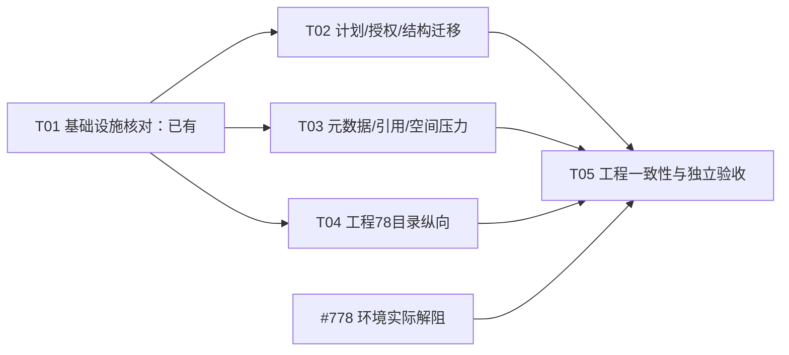

# #766 架构执行收口清单（非重新设计、非 QA 验证）

- 负责人：高见远。结论：**保留全部既定 P0；沿用现有 Runtime、Planner、MigrationService 与 FD helper 收口，不增加子系统。当前尚不能关闭 #766。**
- 唯一核对树：`/Users/x/Desktop/Project/dsh-plugin/product/omnimux-dsh/.worktrees/assets-storage-766`；固定 base = 本轮 HEAD `5485c25875cb9f71d7cb78a6aa69d07e07fffbab`，目标为该 HEAD 上的本地未提交增量，非远端审查。
- 快照：2026-09-08 16:00–16:04（Asia/Shanghai）读取。工程78可能继续更新源码和目录报告；下面的源码行号及状态是读取快照，不是对其后续成果的否定，也不是接管或暂停指令。
- 本轮全文读取 PRD 332 行、架构 595 行、总工程报告 70 行及 client/runtime/recovery/client-entry 四份 followup、directory-integration 70 行。只抽查与欠项直接相关源码；**未运行测试、安装包、访问真实 OPC/共享 profile/官方代码，未委派、push 或部署。只交付本文，不改规格、源码或他人工程报告。**

## 1. 真源、优先级与不需重新设计的边界

引用简写（行号均为本轮读取版本）：

| 简写 | 文档 |
| --- | --- |
| P | [PRD](2026-09-08-assets-storage-prd.md) |
| A | [原架构](2026-09-08-assets-storage-architecture.md) |
| E | [总工程报告](../implementation/issue-766-assets-storage.md) |
| C / CE | [客户端补齐](../implementation/issue-766-client-followup.md) / [入口补齐](../implementation/issue-766-client-entry-followup.md) |
| R / F / D | [Runtime](../implementation/issue-766-runtime-followup.md) / [恢复与流](../implementation/issue-766-recovery-followup.md) / [目录整合](../implementation/issue-766-directory-integration.md) |

| 分类 | 必须准确保留的范围 | 不能误作承诺的范围 |
| --- | --- | --- |
| 用户需求及 PRD 必需 | 设置/选根/预检确认；原位接管与合并；名称、分类、描述、标签、封面及引用保留；四种冲突动作；结构冲突跳过或改名；阶段进度、恢复、空间及清理。P:14、93–101、195–227 | “选目录”不是整树整理/删除授权（P:82–87）；同内容不合并资产语义（P:196） |
| 已设计的防丢失必需 | FD/no-follow、写 gate/读 lease、不可变计划与限定决定、receipt、旧目标引用版本、partial 集合确认、原子根指针及恢复屏障、按引用清理。A:258–275、299–345、385–424 | 不能因为用户没说内部术语就删这些保护；也不能因为用了安全助手就声称所有故障已验证 |
| 原规格中的有限支持 | POSIX mode/mtime，不能保留关键元数据时预检告知、阻断或留原处；macOS 本地卷为正式验证面。P:238、309、326；A:46、489、511–515 | **不存在“全操作系统、所有 ACL/xattr/resource fork 都必须自动无损搬迁”的普遍承诺**；NAS/云占位/同步盘/多 writer 不自行纳入 |
| 额外或非本轮请求 | P1 ETA/导出/历史查询，P2 历史重复文件清理；普通文件 keep-both 在 P:223 是建议，但 A:268、304 已设计，沿用不删；结构 keep-both 则为 P0（P:210、298；A:498） | 不新增 SQLite/CAS、通用文件管理器、元数据同步服务、任务引擎或独立配置系统（P:48–54、105；A:36–44） |

**范围裁定不是改规格：**元数据“全部保留迁移”不是统一 P0 判据；“已识别关键元数据而静默丢弃、仅标 unmigrated 却不展示原因/确认/恢复”仍是 P0 欠项。目录分页、集合确认、结构 keep-both 不能据此降级。

## 2. 已有证据与不需重做项

下表为**工程报告提供的证据**，本轮未重跑，不相加为一个更大通过总数，也不直接升格为 QA 通过。

| 已有交付/证据 | 来源 | 收口处理 |
| --- | --- | --- |
| 真 helper FD 流 14 项；恢复 21 项（含 32MiB payload/versions worker SIGKILL）；fs 4 项 | F:21–28、45–63 | 复用现有接口、receipt、补偿/commit/清理图；不从头实现。尚未覆盖的 Host/fsync/卷边界另补差额 |
| available 过滤修复、旧 artifact report 全部按 Promise 等待、小文本 canonical FD 适配；8 文件107/107 | D:22–33 | F 中 migration11/13 不是当前仍存在的失败；已被修复并报告13/13，不再派一次相同修复 |
| 实际 registerAssetsRoutes + Runtime + Python helper HTTP 4/4；全包291/291、65 suites、exit0；boundary2136/exit0 | D:35–52 | 保留 available/目录预览/abort/epoch 回归。临时 HTTP server 不是 DSH L2；291 不证明未实现分页/压力完成 |
| 客户端87/87；单逻辑叶子/全不可用路由、主区/侧栏统一 AssetBrowse、捕获删除集合 | CE:15–35、42 | 不重建客户端入口和第二套目录浏览。受控 hook/SSR 不是 DOM、焦点、主题证据 |
| 异步 legacy/write gate、artifact 管线、64MiB 上传/RSS增长<48MiB 等 | R:27–49 | 复用生产 async 接线；64MiB 不替代 >1GiB；legacy失败仍须可见；不要求为其新建通用持久队列 |
| Stage 缺 jsdom，包装入口触发依赖安装失败；gates存在未归因失败；L2依赖#778 | E:38–51；CE:44–46；D:51–52 | 未解除的证据/环境门槛，不据文档宣布解除，不重复启动 L2、不修改门禁。主理人收取#778实际结果 |

**当前可继续：**工程78的目录纵向分项不等待本文产品歧义。D:62–70在此快照仍写“尚未开始分页”；若其后已提交新证据，以新源码/报告逐项销账，而非再次重做。

## 3. 最终集成任务（沿用原 T01–T05，共五项）

文件均相对本树；下文 `src/` 指 `plugins/omnimux-assets/src/`。列出的源码/测试是后续工程归属，**不是本轮写入授权**。公共文件同一时刻只交一个工程 owner；T02/T03 涉及工程78的 plan/helper/HTTP 时，等待其交还写面，不要求其停工。

| ID / 优先级 | 模块与文件归属 | 依赖 | 完成判据与测试方法 |
| --- | --- | --- | --- |
| T01 / P0 | **项目基础设施核对（已有，不重搭）**：`plugins/omnimux-assets/package.json`、`dsh.manifest.json`、`src/index.js`、`paths.js`、`storage-types.js`、`storage-runtime.js`、`storage-runtime.test.js`、包 README | 无 | 复用配置/入口/依赖声明，确认 Home 优先级及单根不变；缺助手的状态、写拒绝及对旧库影响准确声明。正常/缺助手/坏指针/离线/第二writer用例；缺助手产品判定见§5，不阻断有助手环境下其余开发 |
| T02 / P0 | **计划、决定与结构迁移收口**：`src/storage-plan.js`、`storage-migration.js`、`storage-types.js`、`http-routes.js`、`client/StorageSettingsDialog.jsx`、`client/use-storage-task.js`、`client/locales.js`；`storage-plan.test.js`（原架构已列，快照未见）、`storage-migration.test.js`、`storage-http.test.js`、`client/StorageSettingsDialog.test.js` | T01接口已有 | §4.1–4.3落地：真实摘要、稳定决定版本、完整partial、结构keep-both/目标命名冲突、受控冲突预览。第201项冲突/多页过程中变更/重启重试/同目录多个子项/文件↔目录/不同内容旧目标记录仍可预览；不得只验按钮 |
| T03 / P0 | **元数据、引用和空间/进度收口**：`src/storage-fs.py`、`storage-fs.js`、`storage-plan.js`、`storage-migration.js`、`library.js`、`artifacts.js`、`mappings.js`、`protocol.js`、`storage-fs.test.js`、`storage-migration.test.js`、`storage-runtime.test.js` | T01接口已有；与T02共享文件串行集成 | §4.4–4.5落地：关键元数据风险在任何破坏性操作前发现，已有字段与引用闭合；各卷预算和真实计数；10000小文件、原规格大文件样本、空间失败/重试。沿用FD与receipt，不以TTL跳过身份/账本校验 |
| T04 / P0 | **目录纵向收口（工程78既有归属）**：`src/storage-fs.py`、`scanner.js`、`library.js`、`storage-plan.js`、`http-routes.js`、`client/api.js`、`client/AssetBrowse.jsx`、`storage-http.test.js`、`client/AssetBrowse.test.js` | T01接口已有；无需等T02/T03 | A:277、295、313、482；物理单层快照+逻辑层cursor/limit≤200/epoch，2001及10000全页不重复不遗漏、变更/权限错误显式；空子目录和逐项excluded/unmigrated元数据；真实fileId预览，无虚构目录real_path；保留CE入口与D真实流回归 |
| T05 / P0 | **工程一致性与正式验收交接**：`src/storage-recovery.test.js`、`storage-http.test.js`、`tools.test.js`、`protocol.test.js`、`qa-edge.test.js`、相关client测试；`docs/contracts/project-assets-contract.md`、包README、`docs/implementation/issue-766-assets-storage.md`、`docs/qa/issue-766-assets-storage.md` | T02/T03/T04完成；正式L2另依赖#778可用证据 | 原A01–A17逐项关联最终快照证据：恢复/清理差额、全入口切根/反向迁移、普通导入及Hub/Workflow项目快照不变、正式L2 ego业务与原生picker。已有报告不由其他分项覆盖；总报告及QA报告只由被授权owner更新 |

T02/T03是既有 P0 的集中补齐，不是新一轮“各写一段接口后再交给别人补全”。每项必须连同本层生产者、消费者和边界测试一次交齐。

## 4. 既有设计内的最小实现步骤

### 4.1 摘要、决定版本与冲突可用预览

**快照定位：**`storage-plan.js:174–191`只算目标requiredBytes，summary混合记录数与条目字节；`storage-migration.js:24–26,51–54,98–135`将heartbeat/状态/决定共用seq，entries没有独立决定版本；客户端`use-storage-task.js:18–48`逐页读完后比较seq。不能断言确认页必然被心跳永久打断：当前launch结束后会停心跳；真正缺口是**观察序号与授权版本没有明确分离，多页决定快照也没有稳定版本约束**。

1. 沿用planHash/decisions.json。首选在现有task中增加单调`decisionRevision`，只在决定内容变更时递增并持久化；`seq`继续观察进度，不能单凭心跳让有效授权失效。可选的更少字段方案是给现有decisions内容hash；二者择一，不同时造两套版本。原expectedSeq接口变化须生产者/消费者/测试原子更新，保留状态准入、planHash及fingerprint校验，不是直接删除并发检查。
2. entries各页返回同一planHash+决定版本，页间/提交前变化明确409；普通批量仅绑定已展示conflictSetHash，结构/硬链接/新冲突不进入all。决定已写盘才返回成功；重启保留决定版本，新扫描不得沿用旧授权。若改名改变落点/空间/受影响集合，更新已展示派生计划并重新确认。
3. Host汇总实际`adopted`记录/文件/目录口径、unique待copy字节、reuse、普通/结构冲突、排除/未迁入、受影响旧目标引用与版本占用、各卷峰值。采用现有entries的kind分页展示adopt/变更/版本明细，不要求UI每500ms重扫万项来重建摘要；不将零字节文件等同零事务成本。`storage-plan.js:63–67,84`的hash表只收目标已有文件；补验空目标下多个来源同内容项是否共享一次已计划payload。若没有，复用现有hash/路径映射登记计划落点，不能让“unique”仅是摘要字段而仍复制多份；不同语义记录照常保留。
4. P:208要求“可用预览”，A:268/338已有权限与流机制。只在既有storage task路由下以taskId/entryId/side解析已计划源/目标，复用SafeStorageFS.openReadStream与lease；禁止传任意路径。无法预览的类型显示原因，不新增格式转换器。reasonCode+安全details进双语UI，保留受限诊断，不绕secret guard。

**闭合证据：**第201项覆盖影响多记录、分页中另一决定变化、仅心跳变化、同令牌重复提交/重启、出现新冲突；摘要与最终receipt一致；两侧预览hash正确且不可借参数越界。依据P:130–159、208、220–227；A:265–275、487–498。

### 4.2 partial集合：授权对象必须等于实际未迁入对象

**快照定位：**`storage-migration.js:293–297`只取library的unmigrated与artifact，未包含mapping/逐项excluded；`entries(kind=unmigrated)`只筛plan entry，无法列出无entry的legacy ref；`StorageSettingsDialog.jsx:77–88`保存计划seq，却从提交时task取partial hash，而非保存已展示集合。

1. 复用plan/构建后账本/receipt/report，投影一份**稳定排序的未迁入明细**：`origin、ledger/recordId、fileId或引用标识、entryId?、logical_path?、status、reasonCode、recovery_ref/保留位置`。包含源skip、缺失/legacy、元数据阻断、排除后造成的不可用refs和mapping；目标原位排除另标origin，不能冒充“来源迁移成功”或要求为目标未动项复制备份。
2. 利用现有entries kind分页返回该集合及unmigratedSetHash；排除项总表与“影响部分切换的未迁入集合”区别展示，但不能漏掉任何因排除造成的未迁入来源。已有来源信息不能用没有logical_path的汇总ref替代。工程78负责叶子元数据产出，T02负责集合消费与确认。
3. UI确认固定保存实际看过的setHash，不在发送时替换为最新task值；服务端提交前从将提交账本再求hash，集合变化回awaiting_partial。结果completed_with_skips与每项来源/恢复位置保持一致；清理继续沿现有引用图隔离skip分量，不清理唯一副本。无须增加独立partial服务。

**闭合证据：**没有migration entry的legacy、全不可用资产、mapping未迁入、source特殊项、201+条、查看后集合变化、重启；available不能指向异内容目标，错误源位置不外泄项目账本。依据P:154、184–186、225–227、251、265；A:126–129、272、303、383。

### 4.3 结构keep-both与命名规则：复用逐叶子协议

**快照定位：**`storage-migration.js:124–130`只检查改名的词法/精确字符串重复；`:245`非file结构冲突直接要求skip。`storage-plan.js:107–116`先展开目录叶子，父路径为文件时各叶子可能各自成为结构冲突（:85–89）。因此仅移除throw或对目录mkdir不是闭环。

1. 在现有plan内将同一冲突父目录及全部受影响叶子/空目录归为**一次明确改名决定的集合**，保存稳定entryId及oldPrefix→newPrefix映射；不新增迁移引擎。确认页展示整个映射范围；子项特殊/硬链接冲突仍单独处理，不能继承overwrite。
2. 目标上按真实卷规则核对大小写/Unicode/名称限制及祖先file-dir冲突，检查目标已有路径、计划内路径与其他newName。预检只读；能力探针若必需，仅在已确认控制区按A:309执行，能力不明不能静默覆盖。没有可靠规则时报告阻断原因，不以字符串不同证明可共存；不制定跨OS统一命名转换策略。
3. source文件→target目录：选明确新文件落点，照现有staged→verify→no-replace。source目录→target文件：选明确新目录前缀，先创建确认缺失的目录，再按现有每叶子copy/reuse/receipt安装并重写refs/logical_path；不rename整个目标、不递归删除。一个group决定改变所有相关落点，重算冲突/空间并确认；恢复依据已落盘映射，不重新生成名字。

**闭合证据：**双向file-dir、父文件阻挡多层树、空目录、目录merge、NFC/NFD/大小写样本、新落点被外部占用、执行中断/续传同名不增副本；旧目标hash/树不变。依据P:209–211、298；A:295、304、394–398、567。

### 4.4 元数据与ID/ref完整性：分清业务字段和文件系统属性

**业务字段是必需，不可用“尽力”概括：**P:195，A:125–129、297。当前`storage-plan.js:157–171`使用跨ledger共用idMap且只直接改写目标string input_refs；不能据此证明cover/fileId、typed URI和全部关系已闭合。按**已存在schema/实际字段**补有类型、区分来源根及ledger的确定性映射；覆盖后library/封面/artifact/mapping仍引用旧版本，来源ID优先稳定。未知结构原样保留并阻断具体记录，不能静默删字段或猜递归重写。当前artifact生产者`artifacts.js:108–114`只生成空input_refs，schema校验未定义任意对象结构；**任意structured input_refs转换不是凭空新增的普遍承诺**，若已有合法记录格式需产品/合同owner提供权威字段定义再适配。已知字段保留与string/typed引用映射不等该确认。

**文件系统属性最低安全闭环：**P:238原文是“保留必要的文件时间及权限语义…无法保留关键元数据时在预检中告知”；A:489进一步指定普通POSIX mode/mtime，ACL/xattr/resource fork不能保留则告知并阻断/留原处。

1. 保留现有copy的fchmod/utime、禁止setuid/setgid和递归chmod。把权限/mtime复核及失败原因纳入receipt/结果；原位未改文件不复制、不改属性。目录属性与普通文件属性分别检查，不能因file copy已覆盖就宣称目录也保真。
2. 现有`storage-fs.py:198–206`仅对非metadata-only普通文件listxattr，`storage-plan.js:80`仅将**来源**有xattr的项标unmigrated；`:248–249`copy只复制mode/时间。最小必修不是全平台xattr复制器，而是对**来源迁移、覆盖目标旧版本/补偿及目录**都做能力/关键元数据检查；未知/不可读能力明确报告，不按“无属性”处理。尤其目标有xattr/ACL但来源没有时，不能先用普通copy丢掉目标恢复信息再覆盖。
3. 两种既有范围内选择：**优先完成保守保护路径**——无法证明保留就阻断该覆盖/整理，来源留原处、准确partial、旧目标保持原状；或对本次支持平台和已确认必要属性，用同一FD helper有界读写/校验后再允许迁移。后者可降低跳过率，但不是关闭本需求前实现全OS元数据支持的条件。检测/告知/集合确认仍必须交付，不能只留英文reason即结项。
4. 内容hash去重不等于元数据等价（A:293要求兼容可引用路径）。reuse若会丢关键权限/时间/扩展属性语义，不修改既有目标来凑一致，也不以强行新复制绕过去重要求；列明不兼容并阻断/partial。明确什么属性“关键”由产品确认，确认前采取保守不变更，不自行白名单忽略quarantine等属性。

**闭合证据：**业务字段/封面/ID同名跨ledger/多引用/typed URI回归；源xattr、仅目标xattr、目录属性、属性读取/恢复失败、权限mtime差异下reuse；每个不支持项可见可恢复，旧源/目标内容和关键属性不被静默损失。

### 4.5 空间预算与10000/>1GiB：补证据，不重新造性能架构

**快照定位：**plan:174–198只预检target；helper copy:224–236已有目标空间/逐块reserve检查；migration:28–36累计传输、:227–230重试skip计数、:288仅部分操作累计completedFiles，缺跨重启一致口径。A:484–488已给完整算法，不另发明阈值。

1. 在现有plan中按实际卷身份聚合：`newUniquePayload + overwriteOldVersions + stagingSlack(残余/最大文件重试) + ledgerBeforeAfter + journal + reserve`；reserve沿用max(500MiB,额外需求10%)。Home控制区单算后同卷合并，源卷仅算新marker/receipt；旧源空间不可提前扣除，稀疏文件按logical size，JSON按编码字节估算。变更决定、留下半文件、重试新增暂存后重算并展示，不无限保留残余却沿用首次预算。
2. 每次copy/backup及大块周期沿用空间复核；扩展到Home计划/receipt/commit所需写入和fsync失败。statvfs失败阻断；ENOSPC保留旧源/已验版本并可恢复暂停，不能靠清理源、缩掉恢复版本或显示完成解困。
3. 基于receipt重建已完成/skip数量；区分逻辑完成字节与本次attempt已传字节，避免重试重复累计超过总量；补totalVerifyBytes、可展示当前项、扫描未知总量与独立commit状态。心跳在Host事件循环里可观察≤1秒，不能只看客户端500ms定时器。
4. 先在已有worker/单层分页/每文件receipt内消除测得的瓶颈：不递归全树扫描一次只为取一页；能批量stat就复用窄helper批量调用；只在证据表明需要时减少重复账本解析。保留身份/版本/哈希重验，不增数据库/通用缓存；metadata清单可随文件数增长，媒体缓冲不能随文件体积线性增长。
5. 工程在隔离样本跑**至少10000个真实小文件 + 同时满足P:305“大于1GB”和A:574“≥1GiB”的大文件**。建议生成1GiB+1MiB避免单位歧义；这是样本选择，不新增“严格>1GiB”的规格门槛。记录Host及helper峰值RSS、阶段/心跳最大间隔、真实字节hash、分页完整性、UI可操作与关弹窗重开；慢hash/copy、暂停/重试、预检/运行中/Home空间不足、fsync失败均保源。架构没有固定吞吐/总时长或固定RSS SLA，不追加任意MB/s门槛。

## 5. 必须由产品/主理人确认的歧义（只限制对应承诺）

### Python缺失：能fail-closed，但不能擅自宣布全部旧功能退化已获准

- P:62要求未配置时完整保留默认路径和解析优先级，P:308要求普通导入/项目行为不变；P:309允许“其他未支持平台”明确不支持。**PRD没有明确把“同一macOS机器缺Python”定义为整个旧资产库可停用的平台例外。**不能从“其他平台”直接推出这项授权。
- A:46明确“缺失时新迁移…storage-platform-unsupported”，A:513明确无不安全fallback、无Python发布要求需另批准helper打包。结论：**新迁移及无法安全执行的写/预览应fail-closed，不得绕过FD guard；fail-closed是安全行为，不是功能验收通过。**
- 当前`storage-runtime.js:38–70,117–120`先probe失败后保留error，后续全库operation拒绝；R:55也明确整个旧库不可用。需要产品明确：①接受Python为本次支持环境前提，并承认缺失时旧库也不可用、同步兼容文案与验收；或②要求既有功能在无Python macOS仍可用，由主理人批准安全helper供应/兼容路径的有界方案。**建议先确认②是否属发布硬要求；在决定前不把①当成默认已批准，也不开发不安全JSfallback或接管外仓。**
- 不阻断具备助手环境的目录/计划/迁移补齐；阻断的是“无Python兼容已完成/可发布”结论。能力探测应无数据变更、错误可操作，不能自动安装系统依赖。

### 关键元数据与结构化引用

- 产品需要明确“关键元数据”的本次支持平台范围/必要属性；默认保守阻断已识别但无法保留的项，**无需等待全平台承诺才能继续**。若产品要求所有此类文件必须迁入，则是对有限支持条款的明确追加，需重新评估授权而非暗中增加子系统。
- 对合法历史structured input_refs，先取已有合同/schema或权威样本，明确字段含义与保留/映射要求；不推测任意对象结构。未知格式阻断已有A:297依据，但不能据此长期阻断已知合法格式并称完整兼容。
- 无需为P1 ETA/导出/历史查询、全OS属性复制、恶意持续外部竞态或硬件绝对无损新增产品门槛。

## 6. 全局收口判据、依赖与交接

**仍须逐项勾销，不另拆任务：**

- [ ] A01–A08：T02/T04的入口、确认、完整目录、去重、结构/规范化及metadata/ref可用证据；规范化未确认零执行，控制名称冲突阻断。源未知孤儿列明保留，不扩大扫描授权。
- [ ] A09–A13：T03空间/压力 + T05恢复差额。复用F的SIGKILL成果，补未覆盖的Host中断、各账本/root/fsync边界及真实隔离跨卷/掉盘/同路径换卷。测试替身或同卷目录不能冒充真实跨卷。
- [ ] A11/A14：既有全入口gate表逐入口登记最终结果，包括mapping缓存写、工具上传、lazy、preview结束/abort、epoch失效、新根离线不建空库、提交后新增内容的反向合并；不要求重写已完成Runtime。
- [ ] A15：复用C1–C3引用图/逐项receipt，再补改动后的组合：target版本仍被引用、目录重叠/跨ledger、partial分量、7天锁内清理、外部新增/未知inode保留、重复确认幂等；结果展示保留占用与原因，而非新建通用GC。
- [ ] A16：普通外部导入仍copy；项目相对路径、instantiate/promote/项目删除及Hub/Workflow消费快照回归。只走既有HTTP seam，不改其他插件写权限。
- [ ] A17及正式交付：主理人取得#778环境可用事实后，授权owner在隔离L2用正式ego/verify:live及同次业务证据，另补原生picker；独立QA确认。Stage/gates失败须实际归因解除，不能以291/291替代。本文不执行这些动作。

依赖图（复用原五任务，无新增架构）：

接口/调用模型沿用A:122–254、258–279、428–477的原类图与时序图，不复制成第二套设计，也不另写图文件。共同约束仍是相对路径、单一Home根指针、单任务、既有错误envelope、ISO8601 UTC、先持久化授权/receipt再破坏性步骤、损坏fail-closed及源保留。依赖沿用A:522–531：现有React/dsh-ui-kit/Node/esbuild及窄Python标准库助手、osascript；无新增第三方包。

**下一动作与责任人：**工程78继续/交付T04现有范围；主理人收取其最新报告后，在不重叠写面的前提下将T02/T03集中交既有工程完成，确认Python与关键元数据承诺，再统一T05。架构清单可交付；功能、QA、合入、发布与关闭均未因此完成。
