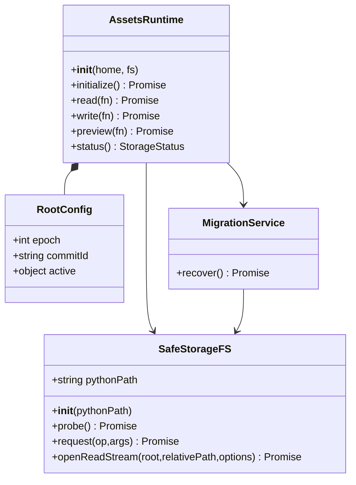
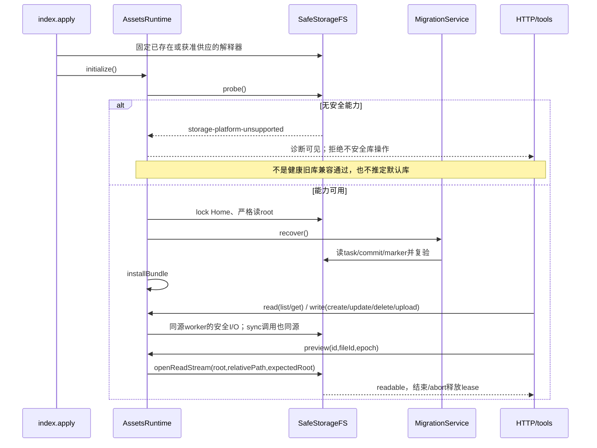
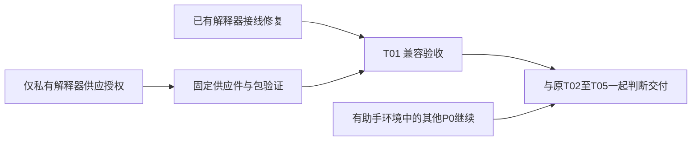

# #766 T01：Python 缺失与旧库兼容设计裁定

- 负责人：高见远；日期：2026-09-08。**仅设计补充，未实现、未取得兼容验收，不改变原规格。**
- 核对面：任务树 `assets-storage-766`，HEAD/base `5485c25875cb9f71d7cb78a6aa69d07e07fffbab` 上的本地未提交增量；不是远端审查。源码读取快照约 16:24–16:26（Asia/Shanghai），工程84的目录工作不受本分支阻断。
- 结论：**旧库兼容是已确定要求，不再询问是否需要兼容。当前没有得到源码支持的“真正无 Python、无新增依赖、仍保留全部旧功能及 FD 保护”的实现分支。已有解释器但启动路径不一致可在本仓修复；真正缺失则需有界供应授权，或暂缓本增量交付。不能把全库 fail-closed 当成兼容完成。**

## Part A：设计裁定

## 1. 实施路径与源码依据

### 1.1 已读取真源与范围

全文读取：[产品澄清](2026-09-08-assets-storage-clarifications.md) 113行、[架构收口](2026-09-08-assets-storage-closeout.md) 155行、[原架构](2026-09-08-assets-storage-architecture.md) 595行、[PRD](2026-09-08-assets-storage-prd.md) 332行。

依据：澄清§2优先解释收口§5中尚待产品选择的旧表述；PRD:62/72/82–87/175–185/246/308要求默认兼容、普通导入 copy、限定授权、不回落空库和合同回归；原架构:44–46/120/328–345/513约束 FD、恢复、单 writer 和依赖供应边界。以下 `src/` 均指 `plugins/omnimux-assets/src/`；行号为读取快照。

| 实际接口 | 证据与裁定 |
| --- | --- |
| 初始化与普通操作 | `storage-runtime.js:38–70,100–138`：先 `fs.probe()`，之后才锁 Home、读根、recover、创建 bundle；probe 错误被保存，所有 `read/write` 拒绝。`status()`可返回诊断，不等于旧库可用 |
| 默认库也有控制记录 | `storage-runtime.js:47–64`：首次有助手启动即为默认库创建 marker 与 Home root pointer，epoch=0、commitId=null。**根路径仍为默认或 epoch=0，都不能证明它是未升级旧库** |
| 异步与同步启动不同源 | `storage-fs.js:5–15` 的 `storageSync` 固定 `spawnSync('python3',...)`；`:21–35` 的 `SafeStorageFS(pythonPath='python3')` 支持构造参数。`index.js:54–57` 无配置地构造 Runtime，未接入解释器选择。只让异步 probe 成功不足以修复普通写操作 |
| 旧 store 并非无助手安全后端 | `library.js:49–52,177–186,393–400,451–480,483–511,679–686`：同步元数据持久化、可用文件检查、inventory/GC也调用 `storageSync`；异步 add/update 走 safeFS。`mappings.js:34–36,122–126,166–228`：CRUD、扫描缓存写同样依赖同步助手 |
| 独立 artifact store 也需要 Python | `artifacts.js:47–121`：未传 safeFS 就 `new SafeStorageFS()`；source stat/hash、小文本安全流、copy/install、JSON都依赖助手。`list/get`虽只是内存投影，不能据此恢复所有 HTTP/工具，更不能省略安全启动检查 |
| 普通导入与 legacy | `ingest.js:215–267`、`library.js:878–900`：异步普通导入和 Runtime legacy materialization复用安全 copy/hash/install。残留 `copyIntoVaultSync`/`copyTreeSync`（`ingest.js:281–344`）按绝对路径复制、rename，不提供 FD 父链保障，不能当生产兼容后端 |
| 实际 HTTP 与工具 | `index.js:59–74,195–214,283–340`：工具均经 Runtime snapshot；`http-routes.js:499–554`：普通 HTTP 经 read/write/preview，mapping cache-miss亦可能写。不能只保留查询入口而忽略导入、修改、删除、上传、legacy和缓存写 |
| 预览不可走旧分支 | `http-routes.js:51–70` 的 `sendPreview` 要求 readable，否则501；`:355–360` 旧 dispatcher只给 absolutePath，而生产`:534–539`走 Runtime.preview。`storage-runtime.js:151–174`转移lease给helper流；单独重挂旧dispatcher既不能完整预览，也会丢全入口gate |
| 安全原语确有实现 | `storage-fs.py:49–94`逐层目录FD/no-follow；`:145–169`原子JSON/fsync；`:219–264`有界copy/hash；`:274–316`同FD流；`:379–441`flock/无覆盖安装/校验删除。`storage-fs.js:98–173`是有界pull流，不是任意路径流代理 |
| 恢复优先，不可跳过 | `storage-migration.js:56–77,500–522`：preflight先checkAvailable；recover读取active-task、确认后freeze/锁两根、存在commit时finishCommit。probe提前失败会使这些事实尚未读取，**此时不能推定没有事务** |
| 已有供应范围 | 插件 `package.json:11–22,37–55`分发src、仅构建client，运行依赖只有UI kit；`scripts/build-client.mjs:9–29`只打浏览器bundle。manifest:25–28声明python3/osascript，不负责供应它们；`cordis.patch.yml`只注册插件。没有已声明可调用的原生FD后端或私有解释器供应入口 |

本轮 Node 只读导出探测（v25.8.0）中 `fs.openat/renameat/unlinkat/flock`均为undefined；仓库支持的Node版本约束为 `^22.19.0 || >=24.0.0`。这不是对所有未来Node版本的断言，但不能把未提供的dir_fd接口写成现有能力。现有Node FileHandle/流能消费已经安全打开的FD，**不能凭空完成父目录FD相对打开/rename/unlink**；本地IPC当前给的是流数据，不是可直接移交Node的数字FD。

### 1.2 可实现分支（不是当前已通过结果）

| 条件 | 最小处理与可用性 | 现授权内结论 |
| --- | --- | --- |
| 已有可调用、能力合格的Python，健康默认库或已配置库 | 沿用当前单Runtime/单helper/恢复模型；统一所有async和sync调用的解释器身份；保持旧功能全部入口 | 可继续本仓修复与隔离验证；本轮不写代码 |
| Python已存在，但Desktop PATH找不到，或async自定义路径有效而sync仍找不到 | 将既有解释器的已验证绝对路径贯穿Runtime创建、storageSync、独立store；只消费已存在运行前提，不安装、不修改全局PATH、不写shell/profile配置 | 是路径/接线修复，**不是“无Python兼容”**。不得扫描其他App/共享profile去借私有解释器；候选路径来源须为已有受支持供应或明确配置，不能全盘猜测 |
| 确实无合格解释器；健康、默认、从未升级旧库 | 当前代码不能完整服务。不能通过移除probe、裸store、旧copyTreeSync、绝对路径预览或仅只读/空列表闭合 | 无安全完整实现分支；保持开发现场的安全拒绝，但不允许将该退化交付为完成。未升级用户保留当前可用版本、暂缓本增量，不操作其库 |
| 已配置/已注册库、任意未完成事务、坏控制记录，或运行中helper死亡 | 保留既有根、锁/恢复屏障与receipt；安全能力恢复后先recover和身份复验再接收操作 | 必须fail-closed，不切回默认、不建空库、不删marker、不自动启动旧版读写该库；这是故障保护，不是健康旧库兼容例外 |

“缺能力”不能统一转换成“未迁移旧库”。路径相同只是位置事实，不是格式/事务状态事实。

## 2. 文件边界与最小后续改动面

本轮唯一交付为本文。后续工程文件均相对仓库根，列出不等于本轮写入授权：

- T01接线：`plugins/omnimux-assets/src/storage-fs.js`、`storage-runtime.js`、`index.js`，明确且不可中途更换的worker执行参数；`library.js`、`mappings.js`、`artifacts.js`、`ingest.js`的sync/独立构造点同源。
- 已有配置/入口声明：插件 `package.json`、`dsh.manifest.json`、`README.md`；不加第二根配置、不改共享PATH。
- 验证：`storage-runtime.test.js`、`storage-fs.test.js`、`storage-stream.test.js`、`storage-http.test.js`、`tools.test.js`、`library.test.js`、`artifacts.test.js`、`mappings.test.js`。
- 只有供应授权后才可增加插件私有 `runtime/`载荷与该插件 `scripts/`内的取得/校验/打包入口；具体固定清单由工程供应审查产生。不修改官方DSH、desktop fork、其他插件或外部UI kit。

## 3. 状态与接口裁定

不另建legacy Runtime或“兼容store”子系统。沿用原架构类图，以下仅说明T01依赖关系，不新增对外服务：

- **健康未升级默认旧库**：Home根指针真正不存在，且无注册/retired/pending marker和事务遗留、账本符合既有格式、根健康。这些条件需安全读取证明；ENOENT与EACCES/损坏不同，root.json单文件不存在不够。
- **已注册默认库**：有合法Home pointer/marker但active.path仍是defaultRoot。与自定义库同受恢复/FD保护；epoch=0、commitId=null不能放行旧后端。
- **已配置迁移库/未完成任务**：按root、active-task、commit和marker联合恢复；提交后旧源保留不是旧源重新写入权。
- **未知**：缺worker导致控制状态尚未读取。`status().root`当前可能仅是defaultRoot显示值（runtime:199–203），不能显示成“已确认生效默认库”；可保留该响应字段兼容，UI须结合availability/error明确“未核验”。不以未经安全核验的Node读取结果授予写入资格。

接口保持 `read/write/preview`、`request`、`{error,message}`、epoch与lease；T01仅让所有生产调用共享同一已验证解释器执行参数，不能仅修改 `new SafeStorageFS(path)`而漏掉 `storageSync`。采用构造/工厂显式传递，避免环境变量、模块全局可变路径或第二设置系统。helper死亡不尝试另一解释器继续未恢复的操作。

## 4. 调用顺序

## 5. 必须权限分支与唯一最小推荐

### 5.1 推荐：仅为assets插件供应私有CPython，复用现有助手

**若必须交付到真正没有系统Python的既有macOS环境，唯一推荐的最小扩展是“插件私有解释器供应”，不是重写安全后端或系统安装。**“最小”按复用已有Python安全实现、最少新增业务代码和不跨仓衡量，不声称它是二进制体积最小或世界上唯一技术解。

拟授权内容：在 `omnimux-dsh/plugins/omnimux-assets` 包内携带私有、可重定位的 **CPython 3.13系列维护版本 + 标准库**，运行已有 `storage-fs.py`；候选供应源为 **Astral维护的 python-build-standalone 的macOS install_only发行件**，上游解释器为PSF CPython。只覆盖本次需支持的macOS arm64/x86_64；按实际发布架构携带对应载荷，不以Rosetta/Xcode/Homebrew为客户前提，不扩Windows/Linux/NAS承诺。

**证据限制：**本轮遵守不访问外部系统，未下载或审核该发行件、未核验具体release tag/摘要、最低macOS版本、许可清单、动态库依赖和签名状态；该来源是明确的供应提案，不是已验证依赖。批准后由Agent在隔离供应流程固定一个经过安全审查的具体版本/架构/下载地址/SHA-256与许可清单，再进入包；不能使用latest或未经核验自动升级。版本/供应件不满足兼容条件即停止该供应分项，不能偷偷换源或扩大平台。

授权边界与风险必须一并告知：

1. **跨越的边界**：从“调用已有python3”扩大到“产品分发并维护额外本机可执行依赖”。不是资产库功能兼容本身的二次授权。
2. **最小范围**：只在本插件实现供应取得/完整性校验、私有载荷打包、执行参数接线和隔离测试；无pip运行时安装、无用户机器首次启动下载、无系统PATH/系统目录写、无管理员权限。async与sync同一私有可执行文件；继承环境须隔离Python用户site/PYTHONPATH等注入，运行固定助手，不增加通用脚本执行API。
3. **成本与风险**：安装包和磁盘占用上升（须测实际产物，当前无可信MB数）；两个CPU架构及最低macOS兼容测试、CPython与所带动态库安全更新/许可证责任；第三方构建供应链与二进制完整性风险；隔离/签名/Gatekeeper可能影响启动。私有可执行载荷也须验证不可被非授权目录覆盖，摘要不是全部执行安全证明。
4. **边界不自动扩大**：不改desktop fork/官方Host/其他插件，不取得签名凭据，不发布、push或部署。若实际包需要另仓签名/公证或分发改动，先形成具体依赖范围和验收交主理人另行授权，不能在此授权下越仓修补。不能以“签名可能需要”为由现在先动壳。

主理人可提交的单一具体授权请求：

> 为保留无系统Python的macOS用户原有资产库功能，是否批准仅在 `omnimux-assets` 插件包内供应经固定版本/摘要和许可核验的 python-build-standalone CPython 3.13私有运行时，并完成arm64/x86_64适配、全部同步/异步助手同源接线及隔离验证？这会增加包体、双架构测试和安全更新责任；不安装系统Python、不改变PATH、不改其他仓、不含发布。若不批准，保持尚未升级用户的现有可用版本并暂缓#766增量交付。

本分支仅提供此提案，**没有用户批准，也不执行请求批准之后的动作**。

### 5.2 替代与明确否决

- **无扩权替代（当前可采用）**：保留尚未升级健康旧库的现有可用版本，#766继续在有助手的隔离环境完成T02–T05，暂缓整体增量交付。不是在新版本内部重启旧JS后端，不宣称旧版获得新FD保证；已升级/迁移的数据不得据此降版打开。
- **真正不携带Python的替代**：另行批准插件私有原生helper，移植相同dir-FD、flock、JSON/流协议与恢复语义。可减少解释器体积，但新增第二安全实现、编译/签名/双架构维护及完整差分验收；不是已有依赖的免费能力，工程风险高于复用现有助手，本次不推荐、不实施。
- **否决**：回退 `createReadStream(absolutePath)`、多次realpath后绝对路径copy/rename/unlink、`/dev/fd`路径拼接、Node内部binding/未声明FFI、临时编译器、借其他App私有Python、系统自动装Python。都无现有安全接口及授权依据。
- **不推荐且未获授权**：把无Python全库不可用列为“支持平台限制”，或只保留查询页。会停用既有详情/预览、导入、CRUD、上传、legacy、HTTP/工具消费，不能改README/manifest追认。

## Part B：T01执行与验证交接

## 6. 所需依赖

现授权分支：现有Node、`react@^18.2.0`、`react-dom@^18.2.0`、现有UI kit/peer及 `esbuild@^0.25.0`不变；只调用既有能力合格的Python标准库助手，osascript仍仅用于picker。没有新增npm包或新后端框架。

供应分支：仅新增§5.1所列私有CPython运行载荷及随附必需标准库/动态库，需用户授权及固定清单，不把供应依赖藏成devDependency或运行时下载。

## 7. 任务清单（仅补原T01，不再拆T02–T05）

| ID | 任务 | 文件 | 依赖 | 优先级 |
| --- | --- | --- | --- | --- |
| T01 | **项目基础设施兼容接线与验收** | 插件package.json、dsh.manifest.json、README.md；src/index.js、storage-runtime.js、storage-fs.js；library.js、mappings.js、artifacts.js、ingest.js调用点及§2测试文件 | 已有接口；若真缺解释器，供应部分先满足§5.1授权。源码写面由主理人交还后执行 | P0 |

这不是要求工程84停工或重做分页；只阻断“兼容已完成/可交付”结论。当前工程的有助手链路可继续补齐。

## 8. 共享判据与验证要求

以下全部为**未来必须取得的证据**，本轮没有运行功能测试：

| 场景 | 必须通过的判据 |
| --- | --- |
| 既有解释器接线 | 在受控PATH不含python3、但明确已有解释器路径的隔离进程中，async probe与所有storageSync/独立构造同源；不能依赖父测试进程或开发机的python3掩盖漏接线 |
| 真正无系统Python、私有供应可用 | 使用无系统解释器的隔离运行环境/受控执行入口而非仅传missing-python参数；固定私有运行时成功执行并留下实际二进制/包身份。两架构实际包验证，不用模拟arch代替 |
| 健康未升级旧库全功能 | 人工构造旧schema、真实普通文件/目录、封面/标签/legacy mapping；验证list/search/get、详情/预览hash、普通导入copy、update/delete及引用回收、artifact上传、小文本隐私流、mapping CRUD/cache-miss、重启持久化；保留原件与元数据。实际HTTP注册处理器、工具注册执行及UI消费均覆盖，不以裸store测试替代 |
| 无任何合格后端 | 新迁移501 `storage-platform-unsupported`，零媒体/根指针/marker变更，诊断可见；这只能证明安全拒绝，**不能把健康旧库完整兼容项目勾通过**。供应尚未完成时保持此项为交付缺口 |
| 状态误分类防护 | 覆盖默认路径但已注册epoch0、root指针删除而marker尚存、坏JSON/EACCES、retired根、checking/confirmed/commit窗口；均不得进入旧后端、默认新空库或静默降版。缺worker时当前根未核验的UI状态准确 |
| helper中断与恢复 | 启动后丢失能力/退出，已有预览正确释放lease，写冻结；恢复同一已验证后端后先recover/身份/账本复验，提交后不切旧根；sync启动失败也不能反馈写成功 |
| FD与原兼容回归 | 父目录替换、symlink/FIFO/硬链接、预览abort、epoch失效、busy/write gate、receipt/fsync失败和源保留；继续原A01–A17，不以T01补丁替代其他P0证据 |
| 供应边界 | 包含helper和正确架构私有载荷、无遗漏动态库/开发机路径；无联网首启/系统安装/全局PATH写；实际包体与许可证清单、签名/隔离启动结果可查。若必须跨仓则明确停在对应授权边界 |

现有 `storage-runtime.test.js:275–282`只构造空Home与missing-python，断言read拒绝且未建库；它没有覆盖“有真实旧数据的兼容”，不能沿用作兼容通过证据。正式L2/ego及原生壳证据继续由授权工程/QA在环境可用后补齐，不使用共享profile。

## 9. 依赖与关闭口径

**当前状态：设计裁定可交付；T01无Python完整兼容未完成，#766不能据本文关闭。**主理人先安排已有解释器的同源接线及隔离证据；面向真正无Python的客户交付只需提出§5.1这一具体供应授权，不再询问原兼容要求。未获授权则暂缓相应增量交付，其他工作继续。

本轮只读源码与规格、执行Node导出探测和文档检查；只新增本文，未修改原规格/工程报告/源码，未访问真实OPC、共享profile或外部系统，未调用其他成员，未安装、commit、push或部署。
