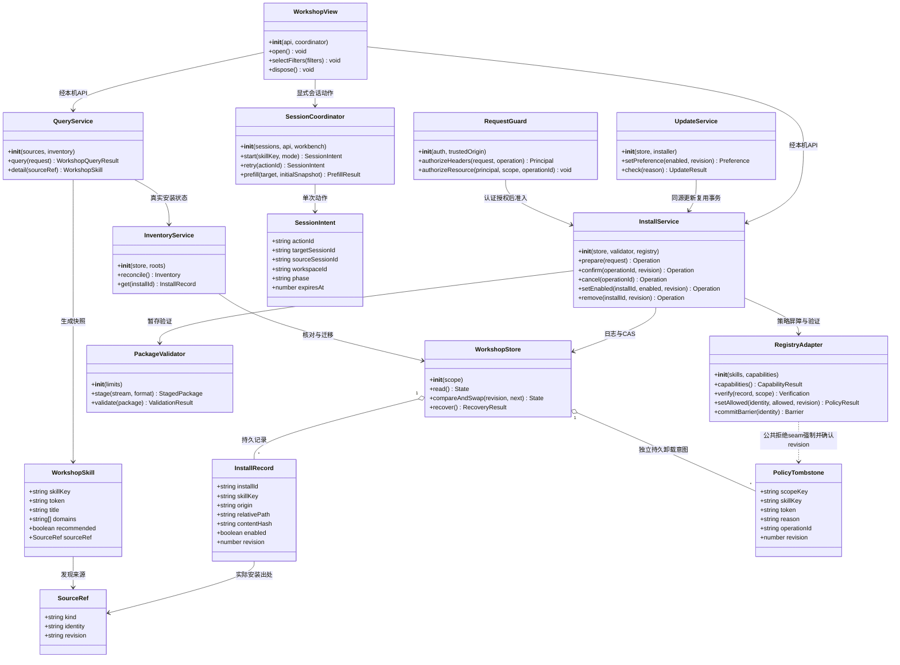
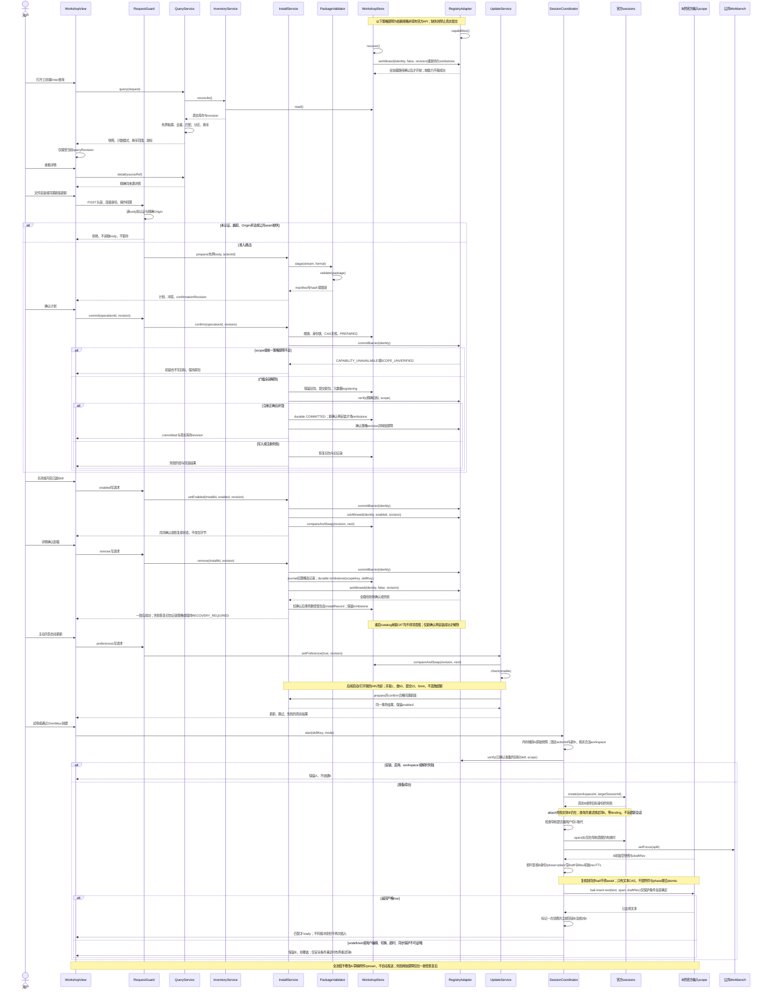
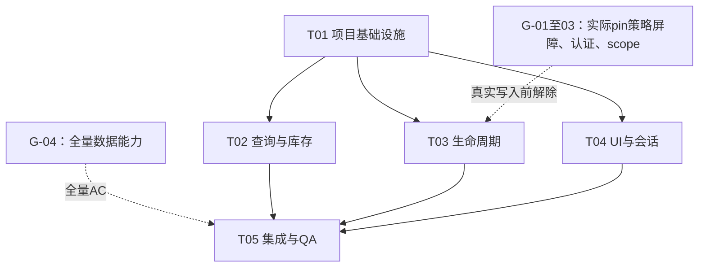

# Skill工坊：正式实施架构与任务分解

> **流程部分 SUPERSEDED — 2026-09-09 / #864：** 下文 L2/seed/独立 Host 与合入前浏览器验收要求退役，产品及安全设计不变。执行顺序按 [dev-pipeline](../../contracts/dev-pipeline.md) 与 [plugin-qa](../../contracts/plugin-qa.md)：worktree 自动化/静态与独立评审 → required CI/MQ → main → 按需 Dev/ego 验收。历史状态、版本与未验结果不重标。

> **已批准方案正式化，不是功能完成报告。** 复用 `omnimux-market`，增量实现发现、真实库存、安全安装/启停/更新、真实新会话与无损预填。P0/P1 均属完整交付，不能用 partial、Alpha 或假开关替代。
>
> **T01 所查 alpha.3/dd632 与 rc.1/a66e 公共 Registry 面均缺统一 deny/barrier 和精确目标无副作用验证；仍是限定版本的静态结论，不是 runtime 实测。** 统一策略与加载屏障影响完整首次安装、更新、卸载、启用和停用；离线验证及事务协议可先实现，真实提交必须先解除对应门槛。

## 0. 基线、批准状态与证据边界

### 0.1 当前 base 与旧规划快照

| 项目 | 事实及适用范围 |
|---|---|
| 当前任务 | 总 #773；#774 能力/数据；#775 生命周期；#776 界面/会话；#777 QA |
| 当前工作树 | `.worktrees/skill-workshop-773`，branch `agent/market-skill-workshop-issue-773` |
| 当前本地固定 base/HEAD | `580234923268673562cacb5cd01aebdb780339e1`；本轮无 fetch，不代表远端即时 tip |
| 前序 PRD | 完整读取主树 `.workbuddy/skill-workshop-prd.md` v0.1.1，824 行；其中 proposed/S/Q 等旧标记以本次明确批准覆盖 |
| 前序架构 | 完整读取主理人提供的 `f65ca6f53880-job_output.txt`，1111 行；本文保留其模型、API、限额、职责、任务与验收，应用明确修订 |
| 旧规划产品快照 | `5485c25875cb9f71d7cb78a6aa69d07e07fffbab`；旧主树脏状态是历史记录，不是本工作树状态 |
| 旧官方静态快照 | `dd6322d604e00eec1ba5e0c8541159906a21094a`；仅为此前只读接口证据，本轮未检查 shipping shell/安装包 |
| pin 声明 | [harness-pin](../../harness-pin.md) 登记 `dsh@0.1.2-alpha.3` 与 `dd6322...`；该文档也明确 App 以 shipping desktop submodule pin 为准；不能拿声明替代实际 pin/L2 |
| demo | 历史静态布局基线 `tmp/skill-workshop-demo.html`；前序 SHA-256 `8771c7472fd23a506546c1c68e86fd051031decb1120e62c687d4d6c5e8d6ad8`，本轮未重测 demo/截图 |
| 本轮差异核对 | 对上述两产品 SHA 比较 Market、所列 sidebar/workbench/QA/dev-pipeline/pin 契约及 ego/live-stage 脚本，未发现差异；不扩大为全仓或运行状态结论 |

本次修订仅写本文、[类图](class-diagram.mermaid)、[时序图](sequence-diagram.mermaid)、[验收规格](acceptance.md)及[修订与外部能力需求](revision-notes.md)。完整输入为同目录 PRD、上述四份原规格、[QA完整报告](../../qa/issue-773-spec-review.md)与[T01工程完整报告](../../implementation/issue-773-capabilities.md)（244行，含§8）。不修改 PRD/QA/工程报告或 T02 查询源码，不与其他成员通信；不写主树、仓外包、profile，不提交/推送/部署/重启，不创建外部 Issue。

### 0.1.1 本次采纳的 T01 静态证据（替代“尚未查安装包”的旧快照）

| 消费面 | 已有证据 | 保留限制 |
|---|---|---|
| 默认未来 L2 | 工程报告§1.1：官方 clone `dd6322d604e00eec1ba5e0c8541159906a21094a`，CLI链解析包为 alpha.3 | 未启动；不能视为 App pin 或已加载 runtime |
| shipping 源码/Dev 安装态 | desktop gitlink/子模块 `a66e4702047846cdaa10c66c9d3df3951f5ea70d`；Dev build-info 声明 App 2.0.5、rc.1/a66e，相关安装包JS补证 | 源码 gitlink、安装声明、运行进程三者分开；未验证45120加载字节 |
| Registry | C04/C05/C07：所查两源码面及安装JS无统一deny/barrier、无精确非winner/停用态无副作用验证 | `getExact/noJit/commitBarrier` 不属于已证官方API；普通get可触发JIT |
| 连接/输入/会话 | C09–17：公开 `connection.requestRejection(req)`、固定ID create、session scope、同步文本CAS存在 | 认证不等权限或精确Origin；draftRev不含附件/phase；attach失败会话实体仍在 |
| scope与L2环境 | 默认Skill根不按profile隔离，cfg/JIT路径存在偏差；seed中viewer依赖不受管 | 实际cfg/root仍未核实；#778由现有环境任务负责，不在此修；本任务未执行start，不能写成启动失败 |

以上是采纳工程报告的证据，不是本轮重新探测外仓、安装包或运行实例。前表及§1.2带“旧/历史/本轮读到”的内容保留其原始审读时点；当前能力判断以本节及G门槛为准。

### 0.2 已批准产品决策（取代前序“待确认”）

| 决策 | 正式语义 |
|---|---|
| Q-01 / Q-02 | 默认无 H3，无假 Tab 提示；正文不含字面 Tab 或制表符，使用宿主真实引用 |
| Q-03 | 推荐与普通去重；精选虚拟分类只展示推荐 |
| Q-04 | 最近按真实版本更新时间倒序，缺用真实上架时间，再缺置末，稳定 identity 打破平局；仅此一种排序时为静态“排序: 最近” |
| Q-05 | 安装出处 OmniMux / WorkBuddy / SkillHub / 本地导入 / 未知来源 + 全部；除全部外只显示库存实际存在的来源；有效 scope 必须核实 |
| Q-06 | 发现 Enter 提交；我的本地即时；标题/描述/token 多词 AND、英文忽略大小写；未装筛选和最近只作用普通区 |
| Q-07 | 未装先确认安装，确认成功才启用；已装关开关仅停用，不删除；持久化/策略失败回原值 |
| Q-08 | 精简详情：名称、完整说明、来源、分类、可验证版本、安装/启用/错误状态、安装/启用/试用；详情中确认卸载及手动同源新版更新，不新增常驻卡片按钮 |
| Q-09 | 身份/领域匹配单一真源；工坊新顺序/推荐语义；picker 旧排序、旧精选语义和 Agent 工具 fallback 保持 |
| Q-10 | 聚焦已开工坊保留筛选与滚动；关闭重开 Skill/全部；plugins/experts/connectors 旧 hidden intent 归 Skill |
| Q-11 | 自动更新默认关，用户主动开启后检查一次；后续启动/打开我的最多每 24 小时一轮；并发 1，查 50，提交 10，每轮 5 分钟，超额不连跑 |
| Q-12 | 采用本文有限阈值，工程以真实样本和边界 fixture 核验；不得解释为无限制或擅自提高 |
| Q-13 | 无推荐则隐藏整个精选区；正式封面须有授权，缺图中性占位，fixture 不作为正式推荐发布 |
| Q-14 | 当前合法 workspace，不复制旧 draft/preset；creator 缺失先确认准备；无 workspace 走公开标准选择，不创建目录 |
| Q-15 | partial 必须诚实标识已加载量与排序范围，不能替代全量计数/最近的完整验收 |

唯一侧栏入口为 **项目 → Skill工坊 → 发布**（发布遵循原 Alpha 显隐），移除底部入口；包名、工具协议、工作台 `omnimux-market:plaza` 不变。仅显示 Skill/我的 Skill。插件/专家/连接器功能、工具、数据和存储位置原样保留且 UI 隐藏，本期不做其新 UI；未来获批接回也沿同套 demo 样式。其余入口排序、Alpha 和会话树不变。

# Part A：系统设计

## 1. 实施方法

### 1.1 技术挑战与选择

- **真实性**：搜索页不是库存；installed/enabled/recommended/autoUpdate 分离；文件存在不是注册可用。
- **一致性**：多入口、多 Host 同根写入与 filesystem/JIT/preset 并发加载必须共同受控；两个 rename 加 JSON 不天然原子。
- **安全**：先连接认证/操作授权，再精确 Origin，再有界 body；ZIP 资源与路径安全；不执行包内容。
- **会话隔离**：动作幂等预分配新 ID，真实目标 scope 与 draft revision-CAS；不复用旧空会话或 DOM 写入。
- **全量查询**：跨源去重、过滤、分区、排序后分页；远程无法穷尽时不能假称精确。

沿用 Host TypeScript/Cordis/Node，Client JavaScript fragments/React/原生 primitives 和 `dsh-ui-kit`，现有 TypeScript/esbuild/concat 构建。插件内按视图、查询、库存事务、公开能力适配四层组织；有限 JSON 元数据+journal+真实文件，不增数据库、CMS、任务中心、独立应用或调度服务。

| 方案 | 取舍 | 决定 |
|---|---|---|
| 现有 Market 分层增量 | 保留协议/工作台/来源；需补真实库存事务与公开能力 | 采用 |
| 新插件/独立 Vite 应用 | 可重新画 UI，但重复安装状态并违反唯一包/页面边界 | 不采用 |
| 仅 UI 布尔值启停 | 简单但 filesystem/JIT 可绕过；不能真实交付 | 禁止 |
| 移目录/改 SKILL.md/高 rank 墓碑 | 仅局部效果，跨 preset 不可靠且破坏字节/路径语义 | 不作为替代，不实施 |

模块是逻辑服务，可实现为函数；不为类图而增加类框架。共享规则由一个模块导出，不复制分类算法，不导入兄弟插件或官方私有实现。

### 1.2 静态证据与能力门槛

下表为历史静态证据，产品对应文件在限定比较范围无差异；官方引用未在本轮重新验证。行号不是 shipping runtime 保证。

| 路径（产品根相对；官方另标） | 证据与影响 |
|---|---|
| `plugins/omnimux-market/src/client/apply.js:56–89` | 原 footer 注册与工作台；目标迁移到 sidebar，不保留底部 |
| `src/client/skill-plaza.js:43–161`（Market） | 当前页再次过滤，不能给全量总数 |
| `src/client/skill-picker-logic.js:8–37`（Market） | creator 身份与 taxonomy 可复用，picker 兼容模式保留 |
| `src/skill-aggregate.ts:67–171`（Market） | custom > workbuddy > skillhub，远程前80与 totalApprox；另建严格模式不改变旧工具 fallback |
| `src/expert/catalog.js:118–148`、`catalog/index.json:91–100,5467–5483`（Market） | 推荐/封面未透传；顶层 featured 为专家；已有明确 creator ID |
| `src/install.ts:19–115,141–181`、`src/unzip.ts:1–83`（Market） | 旧删目标再写/默认 home 路径/吞读取异常/同步无界 inflate 不能沿用于新安全事务 |
| `src/http.ts:77–109`（Market） | Response 返回后的 body 读取仍需完整大小和时间预算 |
| `src/expert/catalog-provider.js:84–161`（Market） | filesystem 优先与 JIT；只过滤 Market 不是统一停用 |
| 官方 `packages/api/session-controller/src/client/contract/sessions.ts:23–44`、`src/commands.ts:72–100` | `create({workspaceId?,cwd?,sessionId?})`/open，指定 ID 幂等；实际 pin/L2 待复核 |
| 官方 `packages/client/ui-conversation/src/client/contract/input.ts:94–98,156–161`、`input/hub.ts:109–128`、`input/facade.ts:542–549` | session scope insert-text 与 revision span；实际 pin/L2 待复核 |
| 官方 `packages/skill/skill/src/index.ts:553–583`、`lib/types/index.d.ts:249–286` | 最近 scope 层优先，rank 同层；所查 registerProvider/register/list/snapshot/get 未发现统一 deny/barrier |
| [restart.ts](../../../plugins/omnimux-market/src/restart.ts):23–80 | 本轮读到 guard 不比较协议，某侧缺省端口时放宽，直接接受 X-Forwarded-Host；不是新写入口可直接复用的安全前提 |
| [local-api.ts](../../../plugins/omnimux-market/src/local-api.ts):35–50 | 本轮读到先 readBody，再判写方法/Origin；新入口须改变顺序 |
| [host.ts](../../../plugins/omnimux-market/src/host.ts):245–249 | 路由 register 本身不能证明连接已经认证、具有操作权限 |
| [config-store.ts](../../../plugins/omnimux-market/src/config-store.ts):10–19、[paths.js](../../../plugins/omnimux-market/src/expert/paths.js):19–44 | DSH_HOME/skills 和 profile 分开解析，不能把 profile 名当隔离安装根证明 |

**G-01 统一策略/barrier**：目录候选、实际 get/load、用户显式引用、模型 Skill 加载、filesystem、Market JIT、preset 覆盖、缓存和重启均需覆盖；deny 优先于 rank/scope，不能 fallback 到同名其他来源。策略有 revision/失效通知，提交期间阻止新加载，受管包可在不临时启用的情况下授权验证。此为所需依赖规格，不是假定已有 API。

**G-02 连接认证/授权**：复用已静态证实的公开 `ctx.connection.requestRejection(req)`，保留401/403；undefined仅表示认证及基础trust通过。它不提供principal/Skill操作权限，也不检查完整Origin。新写入口仍须在body前完成可信执行主体→操作/有效scope授权及产品域精确Origin校验；actionId、确认按钮、云登录都不是授权凭据。主体授权公共契约未证实则返回不可用，禁止自建token/cookie体系或私有Hub导入。精确Origin和流量限额由现有Market路由适配实现，不把所有条件统称宿主缺能力。

**G-03 实际 scope**：解析并核对运行 DSH_HOME、cfg.skillsDir、profile、官方扫描根、preset/provider 层与真实文件系统；共享根不获跨 profile 写权限。未核实则 SCOPE_UNVERIFIED，首次安装/更新/卸载/启停均不提交。

**G-04 全量源能力**：真实来源穷尽、稳定分页/排序依据与精确计数待工程核验。partial 只证明诚实降级，不放行相应全量 AC。

**G-05 输入同步边界**：现有公开输入只有文本revision-CAS。业务调用方须在同一无await同步边界即时复核B的identity、phase=plain、空draft、空files/imageIds与原始draftRev后同步bail，并回读；它不是附件/phase联合原子CAS。若实际pin存在可重入变更或无法公开读齐目标字段而不能证明该同步保护，阻断对应自动预填分支，不添加第二composer或虚构atomic API。

G-01/G-02/G-05所需最小外部契约见[revision-notes.md](revision-notes.md)。未获跨仓授权不得创建 Issue、修改或升级外仓/发行包。可以继续本仓离线类型/fixture/事务实现，不得绕过门槛完成真实写入或无损预填验收。

## 2. 模块职责及文件清单

以下是**后续实施计划文件**，不是本轮改动清单。全部路径相对产品仓根；新文件在工程实施时创建，`lib/` 只由构建生成。配置、入口和依赖集中 T01；T05 只更新既有职责文档/验证集成，不散改配置。

| 分组 | 文件 | 职责 |
|---|---|---|
| T01 基础设施 | `plugins/omnimux-market/package.json`；`tsconfig.json`；`dsh.manifest.json`；`scripts/concat-client.mjs`；`src/host.ts`；`src/client/boot.js`（以上后五项相对 Market）；`pnpm-lock.yaml` | 配置/依赖/单工厂/入口装配、能力注入；不建第二应用 |
| T01 规格 | `docs/specs/2026-09-08-skill-workshop/architecture.md`；`class-diagram.mermaid`；`sequence-diagram.mermaid`；`acceptance.md`（后三项同目录） | 冻结契约；prd.md 归 PM，不由架构编辑 |
| T02 查询 | `plugins/omnimux-market/src/types.ts`；`src/skill-aggregate.ts`；`src/workshop-query.ts`；`src/expert/catalog.js`；`catalog/index.json`；`src/client/skill-picker-logic.js`（后五项相对 Market） | 模型、严格模式、整卡胜出、推荐元数据透传与 picker 兼容 |
| T02 库存 | `plugins/omnimux-market/src/workshop-inventory.ts`；`src/workshop-store.ts`（同 Market） | 真实核对、来源、schema 迁移、CAS、journal 存取 |
| T02 测试 | `plugins/omnimux-market/src/tests/workshop-query.test.ts`；`src/tests/workshop-inventory.test.ts`；`src/client/skill-picker-logic.test.js`（同 Market） | 分区/查询/来源/迁移/兼容 |
| T03 生命周期 | `plugins/omnimux-market/src/local-api.ts`；`src/install.ts`；`src/workshop-request-guard.ts`；`src/workshop-package.ts`；`src/workshop-transaction.ts`；`src/workshop-policy.ts`；`src/workshop-update.ts`；`src/workshop-registry.ts`；`src/expert/catalog-provider.js`（同 Market） | 认证适配、流式传输、包验证、锁/事务/恢复、策略、更新、Registry/JIT 接入 |
| T03 测试 | `plugins/omnimux-market/src/tests/workshop-request-guard.test.ts`；`workshop-package.test.ts`；`workshop-transaction.test.ts`；`workshop-policy.test.ts`；`workshop-update.test.ts`（后四项同 src/tests） | 读 body 前认证、恶意包、故障/并发/策略/预算 |
| T04 界面入口 | `plugins/omnimux-market/src/client/apply.js`；`i18n.js`；`api.js`；`plaza-shell.js`；`skill-plaza.js`（后四项同 src/client） | 导航、双 tab、文案与 API 客户端 |
| T04 组件 | `plugins/omnimux-market/src/client/workshop-state.js`；`workshop-cards.js`；`workshop-detail.js`；`workshop-install.js`；`workshop-session.js`；`workshop-style.js`（后五项同 src/client） | 视图状态、卡片、精简详情、安装、新会话、局部样式 |
| T04 测试 | `plugins/omnimux-market/src/client/workshop-state.test.js`；`workshop-session.test.js`；`workbench-seat.test.js`（后两项同 src/client） | 查询竞态、会话/CAS/焦点、工作台座 |
| T05 集成 | `plugins/omnimux-market/src/tests/client-bundle.test.ts`；`src/tests/workshop-registry.test.ts`（同 Market）；`scripts/live-stage-contracts.mjs`；`scripts/workshop-live-acceptance.mjs`；`scripts/workshop-live-acceptance.test.mjs` | 官方零模型注册核验、共享 probe 的业务补充，不自建弱验收器 |
| T05 文档 | `plugins/omnimux-market/README.md`；`docs/contracts/sidebar-extra-entries.md`；`docs/contracts/workbench-split.md`；`docs/design/2026-09-skill-shelf-filter-design.md`；`docs/specs/2026-09-08-skill-workshop/acceptance.md` | 同步旧 footer/命名/分类说明与真实 AC 结果，保留授权边界 |

`workshop-request-guard` 只适配已有可信认证/权限 seam，不新建认证中心或 Hub 路由。`skills-ui.js` 等被隐藏功能/工具卡使用的旧实现保留；仅可在证明无引用后移除重复 Skill 专用代码，不删除隐藏业务。

## 3. 数据结构、接口和有效作用域

### 3.1 身份与模型

skillKey 是规范化逻辑身份，token 是官方合法引用名，installId 是安装实例，sourceRef 是精确发现/安装来源。不能按标题合并；同 slug custom > workbuddy > skillhub 整卡胜出，不混描述/版本/推荐。安装 origin 永远取实际出处，不随搜索 winner 改变；同名异物保留冲突，禁止自动覆盖或改名绕过。

```ts
type InstallOrigin = 'omnimux' | 'workbuddy' | 'skillhub' | 'local' | 'unknown';
type SourceRef =
  | { kind: 'catalog'; catalogId: string; revision: string }
  | { kind: 'git'; sourceId: string; repo: string; path: string; ref: string; commit: string }
  | { kind: 'skillhub'; identity: string; version: string | null }
  | { kind: 'local'; contentHash: string };
// git 数据仅可由 Host 从受控 sourceId 解析；客户端不得授权任意 URL/path/ref。
type Verification = 'verified' | 'invalid' | 'unreadable' | 'recovering';
interface WorkshopSkill {
  skillKey: string; token: string; title: string; description: string;
  domains: string[]; sourceRef: SourceRef; recommended: boolean;
  cover?: { asset: string; alt: string };
  downloads: number | null; updatedAt: string | null; publishedAt: string | null;
  installed: boolean; enabled: boolean | null;
}
interface InstallRecord {
  installId: string; skillKey: string; token: string; origin: InstallOrigin;
  sourceRef?: SourceRef; relativePath: string; version: string | null;
  contentHash: string; enabled: boolean;
  installedAt: string | null; updatedAt: string | null;
  verification: Verification; revision: number;
}
// 本域持久意图，不是官方Registry已有能力；不伪装安装记录。
interface PolicyTombstone {
  scopeKey: string; skillKey: string; token: string;
  reason: 'uninstalled'; operationId: string; revision: number;
}
interface SourceStatus {
  origin: InstallOrigin; status: 'complete' | 'partial' | 'error';
  fetched: number; exhausted: boolean; code?: string;
}
interface WorkshopQueryRequest {
  view: 'discover' | 'mine'; query: string; domain: string;
  source: InstallOrigin | 'all'; uninstalledOnly: boolean;
  queryRevision: number; cursor?: string;
}
interface WorkshopQueryResult {
  snapshotId: string; queryRevision: number; inventoryRevision: number;
  featured: WorkshopSkill[]; items: WorkshopSkill[];
  count: { value: number; mode: 'exact' | 'loaded' };
  completeness: 'complete' | 'partial';
  sortScope: 'complete-result' | 'loaded-result';
  nextCursor: string | null; sourceStatus: SourceStatus[];
}
interface WorkshopPreferences {
  autoUpdate: boolean; revision: number;
  lastCheckAt: string | null; nextEligibleAt: string | null;
}
interface CapabilityResult {
  scopeKey: string | null; scopeVerified: boolean; scopeLabel: string;
  connectionAuth: boolean; operationAuth: boolean; exactOrigin: boolean;
  registryVerify: boolean; unifiedPolicy: boolean; commitBarrier: boolean;
  writable: boolean; reasons: string[];
}
type OperationStage = 'selected' | 'validating' | 'conflict' | 'prepared'
  | 'committing' | 'registering' | 'committed' | 'rolling-back'
  | 'failed' | 'canceled' | 'recovery-required';
interface Operation {
  operationId: string; actionId: string; scopeKey: string;
  kind: 'install' | 'update' | 'remove' | 'enable' | 'disable';
  stage: OperationStage; skillKey: string; expectedRevision: number;
  confirmationRevision: number; contentHash: string | null;
  cancelable: boolean; retryable: boolean; rolledBack?: boolean; code?: string;
}
interface SessionIntent {
  actionId: string; targetSessionId: string; sourceSessionId: string | null;
  workspaceId: string; skillKey: string; mode: 'try' | 'create';
  phase: 'preparing' | 'creating' | 'waiting-composer' | 'prefilling' | 'ready' | 'failed';
  expiresAt: number; draftRev?: number;
}
```

公共模型不返回绝对私有路径、凭据或包正文日志。日期 ISO 8601 UTC，无证据 null；抓取时间仅缓存用途。enabled=null 表示无法核实而非关闭。推荐只来自受控 kind=skill 元数据的严格 true，缺 false；专家顶层 featured 不动。downloads unknown≠0，不混 installs/stars/浏览量。

### 3.2 存储与迁移

```text
<实际DSH_HOME>/omnimux-market/workshop/<scopeKey>/state.v1.json
<实际DSH_HOME>/omnimux-market/workshop/<scopeKey>/operations/<operationId>.json
<同文件系统且非官方扫描根的事务目录>/<operationId>/
```

- state 含 schemaVersion=1、scopeKey、revision、安装记录、偏好与 `policyTombstones: PolicyTombstone[]`。scopeKey 由 Host 的规范化实际安装根确定，客户端不可指定；目录0700、元数据0600。tombstone是Market本域持久卸载意图，不是官方已提供的policy设施，不另建控制服务。
- tombstone键为 `(scopeKey, skillKey)`，保存卸载时规范化token供Registry执行层匹配同一引用；不含catalog revision/版本/hash作为键，不因目录刷新、来源winner变化或重启失效。不能证明跨provider身份映射时阻断相应卸载/安装，不按标题猜。同token不同身份不能fallback绕过拒绝，提示身份冲突；不扩大到其他真实scope。
- 卸载journal保存旧记录、旧策略及拟写tombstone；拿到公共barrier后，在移走包/删除InstallRecord前先durable写入tombstone并确认公共Registry拒绝revision；随后事务删受管包/记录，完成后才释放。任一步失败按journal恢复旧包/记录/策略；无法恢复则拒绝新加载并RECOVERY_REQUIRED。重启先恢复并把持久意图交Registry强制生效，再允许发现/加载/JIT；不能只阻止Market写入口。无该公共启动/拒绝能力就不开放真实卸载。
- 仅新的、明确再安装确认可在同一scope/identity下解除tombstone；确认绑定当前state/tombstone revision、选定sourceRef及新hash。准备/下载/取消/失败均保留意图；在barrier内精确验证成功并durable提交新记录后才清除意图与更新公共策略。中断恢复只认journal完成点；catalog刷新、自动更新、旧action重放、包被外部放回及TTL清理都不得解除。发现卡仍可显示未装并要求确认，tombstone不计为库存；不提供单独清除/覆盖按钮。
- 不猜 DSH_HOME/profile。`cfg.skillsDir` 与 `$DSH_HOME/skills` 以及 catalog 默认路径可能不同，需核对实际 provider/filesystem 搜索根和归属，统一 Skill 写路径后才能开放提交。
- 同一根需要跨进程排他锁+身份锁+CAS；内存 Map 不够。等待锁超时拒绝，不抢占未证明失效的锁；同根多 profile 不能各写独立状态却共同改包。
- staging/rollback 与目标同文件系统且不在扫描树；“点目录”不是未扫描证明。无法证明隔离则拒绝真实提交。
- 共享安装根未核实时不标“仅本项目/profile”，写操作 SCOPE_UNVERIFIED；不迁目录、不跨 profile 修配置。外部 symlink 只核对/展示，不跟随接管或删除。
- 迁移先扫真实目录，再取可证明来源；未知来源 unknown，未知时间/版本 null。无领域/停用/本地项在我的/全部可见；元数据缺失不是未装，读取异常不是空库存。
- 历史可调用状态延续，不把全部历史 Skill 关掉；仅新增 Skill 域元数据、不改包字节。无法核实调用状态时 UI 显式 unknown 并阻断写入，不以默认值宣称生效。
- 迁移幂等，更高 schema 只读拒绝降级覆盖；journal 启动恢复先于写入口开放。运行事务日志不是 Agent 随意制作备份，恢复中数据不按年龄删除。

### 3.3 类图

下图为实现契约；单独源文件为 [class-diagram.mermaid](class-diagram.mermaid)。`__init__` 表示模块依赖装配。



SourceRef 类图为联合类型的逻辑投影，实际字段严格采用 §3.1 的 discriminated union；不得据图改成允许任意 identity/URL 的宽对象。RegistryAdapter的setAllowed/commitBarrier/精确verify为**所需依赖契约而非已提供官方API**，不可用Market过滤实现假成功。PolicyTombstone只是现有store内的数据，不增策略服务器；initialSnapshot只在内存保存，不给draftRev添加不存在的附件/phase CAS语义。

### 3.4 本机 API 契约

保留 `/omnimux-market` 与 `{ok,...}`，不把旧工具改成另一 envelope。新 `workshop*` 方法使用下表字段，上传单独路由。新方法按路由/可信方法元数据在读 body 前判定权限：若复用 method-in-body 的 RPC 路径，必须对整条新 POST 先要求写权限再读有限 body，不能读完才选择是否鉴权。可用受保护的同前缀方法路径适配，但不得建立第二 Hub。

| 方法 | 请求字段 | 结果与约束 |
|---|---|---|
| workshopCapabilities | 无 | CapabilityResult，真实能力/作用域与原因，不泄漏绝对路径 |
| workshopQuery | WorkshopQueryRequest | WorkshopQueryResult；游标绑定全部条件/库存和 catalog revision |
| workshopDetail | skillKey, sourceRef, installId? | 同来源完整 WorkshopSkill + 安装/更新状态；不得只用 slug 去远程替换详情 |
| workshopInventory | revision? | 核对后的 records、revision、实际来源选项；错误不能空数组伪成功 |
| workshopPrepare | actionId, sourceRef, expectedRevision | Operation + 安装/同源新版计划、风险和冲突；离线准备不等提交可用 |
| workshopCommit | operationId, confirmationRevision | 202 接受/当前 Operation，只有 committed 代表成功；再次确认必须命中相同计划哈希 |
| workshopOperation | operationId | 当前阶段/结果/可取消/可重试/是否回滚；绑定发起主体与 scope |
| workshopCancel | operationId, actionId | staging 可取消；提交段不可取消但可查询，不误报 canceled |
| workshopSetEnabled | installId, enabled, expectedRevision, actionId | 统一策略+持久化共同确认后的 Operation/状态；任一失败恢复 |
| workshopPreferences | read，或 autoUpdate, expectedRevision, actionId | 偏好、revision、lastCheckAt/nextEligibleAt、scope；写偏好也须授权 |
| workshopCheckUpdates | actionId, reason | reason 为 enable/startup/open-mine；只能由合法调用路径产生，客户端 reason 不授予越预算权限 |
| workshopRemove | installId, expectedRevision, actionId, confirmation | 详情确认受管范围删除，事务/barrier/防JIT再装生效后才成功 |

`POST /omnimux-market/workshop/uploads` 用 `application/octet-stream`；头部元数据只含格式、显示文件名、actionId，文件名不决定落点。流式量测/暂存返回 operationId，不用 base64 JSON。JSON 上限64 KiB；上传/下载超时覆盖完整响应体。读结果也核对主体/scope，不能以知道 operationId 获取别人的动作。

```ts
interface WorkshopError {
  ok: false;
  error: string; // 脱敏可显示短句
  code: string;
  operationId?: string;
  stage?: OperationStage;
  retryable: boolean;
  rolledBack?: boolean;
}
```

| 类别 | 错误码 | HTTP/处理 |
|---|---|---|
| 输入/认证 | INVALID_REQUEST, AUTH_REQUIRED, FORBIDDEN_OPERATION, FORBIDDEN_ORIGIN | 400/401/403，读 body 前拒绝认证/Origin失败；不回堆栈 |
| 能力/scope | CAPABILITY_UNAVAILABLE, SCOPE_UNVERIFIED | 503/409，阻断实际写，保留只读与可解释原因 |
| 查询 | SOURCE_PARTIAL, CURSOR_EXPIRED | partial 可随200读结果；过期409重查，不混快照 |
| 包 | PACKAGE_FORMAT, PACKAGE_LIMIT, UNSAFE_PATH, INVALID_SKILL | 400/413/422，清理本次未提交暂存 |
| 并发/身份 | BUSY, REVISION_CONFLICT, IDENTITY_CONFLICT | 409，重读/查询原动作，不新建重复写 |
| 更新 | LOCAL_MODIFIED, SOURCE_CHANGED, INCOMPATIBLE | 409/422，硬拒绝项按§4.3风险表；可确认项也须重新核对计划，不授予覆盖本地修改权 |
| 事务 | WRITE_FAILED, REGISTRY_UNAVAILABLE, RECOVERY_REQUIRED | 500/503，返回真实回滚/恢复状态，不宣称成功 |
| 会话 | SESSION_CREATE_FAILED, SESSION_ATTACH_FAILED, COMPOSER_TIMEOUT, DRAFT_CHANGED, INTENT_EXPIRED | 客户端阶段错误，保留已建目标；不重复新建 |

同 actionId 重放返回原操作；actionId 相同但负载/主体/scope不同返回冲突。actionId、operationId、confirmationRevision 都不是权限凭据。超时是等待结束，不是证明操作未执行；客户端查询原 operation，有限重试，禁止无限轮询。

### 3.5 写入口安全顺序

1. 固定path/method分派后、读body或分配上传缓冲/写staging前，调用公开 `ctx.connection.requestRejection(req)`；拒绝值原样保留401/403，缺服务阻断。其通过不提供principal或操作许可；另外核实可信主体及本次操作/scope授权，未知直接阻断。使用原始 `webServer.register` 流式route；`connection.fetch.register`仅GET/HEAD，不虚构POST支持或借generic RPC先读大body。
2. 校验允许的方法与 Content-Type；浏览器写操作只准 POST，不通过 GET。拒绝缺失、`null`、非法、多值或不规范 Origin。
3. 根据受信 listener/显式代理配置得到 server origin，规范化后**精确比较 protocol、host、effective port**（http默认80，https默认443，省略不代表任意端口）。拒绝 Origin 的用户信息、路径、查询等异常形式。
4. 不直接信 Host/X-Forwarded-Host/X-Forwarded-Proto。转发信息仅在公开 seam 已验证代理来源且已配置受信外部 origin 时可用；否则忽略未验证转发头并拒绝不匹配。Sec-Fetch-Site 只作附加信号。
5. 通过后读有界 body，再核对具体 scope、installId/operationId 所有权、revision、确认计划。字段伪造不能升级权限。
6. 写方法穷尽纳入准入：upload/prepare/commit/cancel/enabled/remove/preferences/checkUpdates；catalog/JIT/旧 Skill 工具接入同一授权执行上下文、策略和事务，不保留可绕过的新旧入口。Agent 工具无需伪造浏览器 Origin，但必须有宿主合法执行权限。

不得顺带重写隐藏插件/专家/连接器协议或重启逻辑；旧 guard 的缺陷是新入口不能复用的证据，不是本次无界重构授权。

## 4. 核心算法、有限阈值与调用流程

### 4.1 查询与 UI

工坊分类顺序：全部、精选、短剧漫剧、专业影视、动画、商业广告、电商、教育、创意实验、音频音乐、平台工具。全部/精选不是业务 tags。我的分类仅全部+九领域；无领域仍在全部。

顺序固定：来源候选 → 规范化身份/整卡胜出 → 领域资格（明确 tags+原受限文本兜底）→ 多词 AND → 推荐分区 → 普通未装过滤 → 稳定最近排序 → 快照分页。普通扣推荐；精选只有推荐；安装停用仍为已装。推荐按受控 catalog 原序，普通控件不改变其编排。

空 query 只用 custom+workbuddy，非空 Enter 才允许 SkillHub；不外发草稿、文件内容、路径或历史。我的本地即时搜索。每 tab 独立状态，旧 queryRevision/详情来源晚到不得覆盖当前选择。

| 查询资源 | 有限值/行为 |
|---|---|
| 页大小 | 最多80 |
| 单查询远程候选 | 最多20页/1600项，重复页或游标无进展立即终止 |
| 总墙钟 | 30秒 |
| 快照 | 最多8个，TTL5分钟；绑定查询/catalog/inventory revision |
| 精确条件 | 所有所需来源穷尽且后过滤完成，count.mode=exact、sortScope=complete-result |
| 失败/超限/不能证明穷尽 | partial、loaded、loaded-result，显示“其他Skill · 已加载 N”及“当前已加载结果按最近排序” |

全体已加载集合排序后分页，不每页排序拼接；继续获取形成新快照，重新全排序并按 identity 保留锚点，拒混旧 cursor。partial 不是 AC-17/19 全量通过。

Header 固定 H1 `Skill`；副标题 `发现、安装并管理 Skill，扩展 OmniMux 的创作能力`；主按钮 `通过 OmniMux 创建`、次按钮 `+ 安装Skill`；无额外营销/说明工具栏。精选宽屏4列16:9，作者/认证/下载底行完全移除；两个等宽 hover/focus 按钮“查看详情”“去对话中试试”。普通/我的宽屏2列条卡；我的仅标题描述switch。窄容器精选2/1列、普通1列，局部 `--dsw-*` token，32px等现有几何不改全局主题。开关、busy、disabled、tab 语义与 focus/无hover/200%缩放须实测。

入口拟用公开 `createSidebarEntry`/`createSidebarStore` 六方法协调，rank4.1 位于项目4与发布4.2间，但工程须核实实际排序器/座，不把 rank 数值当运行证明。保留共享 `.sh-plaza-body`/`data-omnimux-market-entry` 等探针锚点。

### 4.2 安装资源阈值

| 项目 | 上限 |
|---|---:|
| 单次选择 | 1文件；拒目录/多文件 |
| ZIP原始大小 | 20 MiB |
| 独立/包内 SKILL.md | 1 MiB |
| 其他解压单文件 | 10 MiB |
| 实际总解压量 | 100 MiB |
| ZIP entry（含目录） | 1000 |
| 层级 | 8 |
| 规范化相对路径 | NFC后240个Unicode code point；UTF-8总长≤960字节、每组件≤255字节；实际平台更严则拒绝 |
| 单entry及总压缩比 | 100:1 |
| frontmatter | 64 KiB；拒重复键、自定义标签、别名展开 |
| JSON body | 64 KiB |
| 上传/下载完整body | 30秒 |
| 校验/解压 | 30秒；可终止独立worker |
| 等待锁 | 5秒 |
| 注册确认 | 10秒 |
| 未提交staging | 30分钟；活跃/恢复中不按TTL删除 |

这些是本次采纳的有限规格而非当前系统已有限制；测试最大值、最大值+1、累计超限及真实样本。超限过程即停，不等读完/耗尽内存后验证。

**统一计量（验证器与fixture只用这一口径）**：MiB=2^20、KiB=2^10；大小上限含等号，实际字节超过即拒绝，计时使用monotonic elapsed，达到截止时间即停止。

| 量 | 定义与边界样例 |
|---|---|
| 名称规范化/碰撞 | 严格解码ZIP名称（无损可判，编码歧义拒绝），逐组件NFC，不URL decode、不trim、不把反斜线转斜线；`..`、`.`、空组件及不安全根在任何剥层/解析前拒绝。以NFC及Unicode 15.1 Default Full Case Folding（C/F映射，非Turkic，折叠后再NFC）key检查重复/文件目录冲突；并额外检查目标文件系统等价性，不用locale大小写猜。`é`与`e+U+0301`、`A`与`a`冲突均拒绝。 |
| 字符/字节 | NFC后的相对路径含`/`按Unicode code point计数，不是UTF-16单元或grapheme；目录末尾单个`/`不计。路径总UTF-8≤960字节（240×最大4字节），每组件≤255字节；原名解码字节受ZIP上传/结构预算，绝不能截断规避。240/241 code points及255/256组件字节分别构造合法其余维度fixture。 |
| 深度/包装层 | 从包根数路径组件，文件名占1层，根`SKILL.md`深度1，`a/b.txt`深度2。包装目录剥离前与剥离后都测≤8，路径字符/字节限制也都测；目录末尾`/`不增层。`wrap/a/b/c/d/e/f/SKILL.md`深8可测，增加一个目录深9拒绝，不能靠剥wrap豁免。 |
| entries/解压量 | 原ZIP中央目录每条entry含目录均计数，不因去重/剥层减少；重复直接拒绝。每文件实际输出计单文件与总量，目录必须零输出；资源文件≤10MiB；**包内与独立SKILL.md均≤1MiB**，这是对文本解析输入的同一安全上限，不把包内放宽到10MiB。独立文本同样不读取邻接资源。 |
| 压缩比 | 对每个普通文件 `u_i ≤ 100*c_i`，并对全部普通文件 `Σu_i ≤ 100*Σc_i`；u是实际解压字节，c是经结构与消耗核对的压缩payload字节，不含header/目录/填充/其他entry。`c=0,u=0`记比0，`c=0,u>0`拒绝。目录不得贡献分母。流式以已核实c预算检查输出，不信伪声明；整数乘法比较不取整/除零。`u=100*c`与`u=100*c+1`分别测试，STORE方法也遵守。 |
| frontmatter/文本 | 严格UTF-8，允许单个起始UTF-8 BOM但计入1MiB；frontmatter按原字节从开头`---`起至闭合分隔行及其换行（如有）止计≤64KiB，不含BOM、不规范化换行后再计；全文件大小仍含所有字节。JSON按原UTF-8 body字节计64KiB，不按对象大小。 |
| 时间 | 上传从准入后首次读body开始；远程下载从发起请求至body结束；验证/解压从校验worker启动到校验完成；锁等待从请求锁、注册确认从验证请求开始。分别30/30/5/10秒，超时停止后继阶段；结果未知走原operation查询/恢复，不自动新建。 |

路径上限通过不代表平台可写；实际根/每次落点的no-follow与平台限制仍需验证，更严格环境返回可解释错误，不提高上限。

只接收严格 `SKILL.md` 或真实 ZIP，UTF-8可解码、有效name/description、非空正文。ZIP仅根部单Skill或唯一公共包装层单Skill，可含资源；不自动读取单文件原目录资源。拒多个Skill根、绝对路径、`..`、反斜线歧义、盘符/UNC、NUL、symlink/hardlink/设备文件、重复路径、Unicode/大小写碰撞、文件目录冲突、加密/分卷/ZIP64/未支持方法/CRC失败/元数据结构不一致。不递归解嵌套压缩包。

先查中央目录/路径元数据再提取，每次实际落盘重查根边界，实际输出大小/CRC不信声明值。包脚本只作普通文件，安装/预览/校验不执行 shell/hook/依赖/模型。Git来源由 Host 固定可信 repo/path/resolved commit、无shell参数拼接。文本安全渲染，最小详情无需执行型HTML；封面授权受控、无任意URL代理/SSRF/不可信内联SVG，缺安全链路用中性图。

### 4.3 安装、更新、卸载及启停事务

- 安装弹窗未选真实disabled；格式/多文件拒绝在同弹窗说明，暂存前可X/Escape关闭并清选择/还焦点。提交段禁关闭/取消但可查询，完成/回滚后恢复，不能无限锁死。
- `prepare` 生成 manifest/hash/计划；相同身份+来源+hash幂等；相同版本不同hash不是相同包。同源新版才可更新，较旧默认拒绝；未知顺序/hash变化不等于新版。
- 提交前依次核实认证、权限、真实scope、统一策略/barrier及精确Registry验证能力。**首次安装也不豁免**：filesystem可能在metadata完成前加载新目录，不能先rename再补门槛。
- 取得根/身份锁，重读revision/hash；本地修改、来源变化、身份冲突、能力缺失直接拒绝。持久PREPARED和恢复所需旧/新manifest，再拿加载屏障；取得屏障前不改目标。
- 在屏障内旧包rename到非扫描rollback区、新包rename到目标，日志逐步同步；写元数据为registering。官方验证必须命中精确来源/路径/provider/invocation/非空正文，不能同名其他候选蒙混。
- 提交durable完成标记，策略/缓存revision确认后释放屏障，再报committed成功。新装成功默认启用；更新保留原enabled。已停用包不得临时启用验证，缺受控验证能力则跳过/阻断。
- 更新失败恢复旧字节、版本、来源、启用状态和完整记录；初装失败只撤销本操作新目标。恢复失败RECOVERY_REQUIRED，保留屏障/拒后续写，不开放不一致内容。
- 启停在同一锁与策略/barrier内持久CAS；失败恢复旧策略与记录。关闭不改包字节、不撤回已注入上下文、不强行终止在跑任务；新调用被阻止，非文件保密机制。
- 卸载仅详情明确确认受管包/记录范围；按§3.2先持久tombstone并确认Registry拒绝，再事务删除包/InstallRecord。JIT不得在同一操作、重启或catalog刷新后无新确认再装；新确认安装成功才在屏障内清除意图。外部源、会话、创作输出、其他Skill不删除。
- 旧 Skill 安装/工具/catalog/JIT 入口必须共用策略、身份锁、事务。隐藏业务分支保留协议与存储，不纳入Skill迁移。
- 启动先恢复journal再开放写入口；依阶段、manifest、revision选择前滚/回滚，不凭目录存在/mtime猜成功。无法判定只读保留现场，不盲删恢复区。

**风险与确认决策表**（按本次明确指令收敛，不新增覆盖流程）：

| 条件 | 自动更新 | 详情/手动操作 |
|---|---|---|
| 已证同源后继、无本地修改、兼容且无新增风险 | 仅已持久授权且预算允许时提交 | 确认同计划后提交 |
| 同源后继的能力/权限声明扩大，但仍在既有授权边界且兼容 | 跳过并说明待确认 | 专项确认绑定旧hash、新hash、sourceRef、风险集合、state revision与confirmationRevision；实际权限仍须独立检查，确认不提升宿主权限 |
| 本地修改（含确认后新修改） | 跳过，LOCAL_MODIFIED | **默认硬拒绝，保留原字节**；显示原因，不给“确认覆盖”或无效确认按钮。本期无已批准且可验证的修改保留/合并/恢复闭环，不新增备份合并、强制覆盖或卸载重装捷径 |
| 换源、同名异物、降级、不可比版本、主版本不兼容、能力超出授权、安全/公共能力/scope缺失 | 不提交 | 硬拒绝；详情仅解释，不以风险确认豁免 |

`confirmationRevision`引用Host保存的不可变完整计划（旧hash、新hash、来源、风险、state/tombstone revision），不新增通用批准系统。取消/过期/任一字段变化均使确认失效，重新prepare；确认最晚在prepare完成后30分钟（未提交staging TTL）失效，不以重放刷新有效期；提交锁内重算旧hash并复核。所谓“风险转详情”只让用户看到原因或在可确认行重新确认，不表示本地修改有覆盖许可。PRD旧泛称“修改专项确认”以本次明确的默认拒绝指令收敛，主理人转PM核对措辞，架构不改PRD。

### 4.4 自动更新

默认关；已有明确偏好保留；主动开启持久化成功后检查一次。后续 Host启动/打开我的受 **24小时冷却**（取代旧6小时），同scope并发1；每轮检查最多50项、提交最多10项、总墙钟5分钟。超额轮换到下一次符合冷却的触发，不连跑清队列、不反复开关绕并发/预算。显式重新开启的检查仍受活动轮互斥及轮次预算，不允许并发重复提交。

只更新稳定原来源、可证明后继版本/commit、无本地修改且兼容可判的条目。hash不同仅证明变化；Git需后继关系证据。local/unknown/版本不可比/兼容不明跳过；风险转详情按§4.3表区分可确认与硬拒绝，本地修改/来源变化/主版本不兼容不得确认覆盖。手动同源新版也走同一事务与权限/冲突校验。

关闭偏好阻止新自动任务，暂存可取消，提交段完成或回滚；不影响手动操作或改变enabled/recommended。不承诺关闭App后运行，不创建cron/自动化服务，不恢复Market插件自更新。必须以真实合格/跳过/失败样本验收，不以保存switch代替生命周期。

### 4.5 新会话与安全预填

T01静态证实的Client公开能力：`ctx.sessions.create({workspaceId,sessionId})`、`open(id)`、`scope(id)`，目标session slot的`useInput`/`InputZone.input`，目标scope同步`bail('slash/input-insert-text', request)`；公开Workbench `setFocus('split')`仍须实际pin/L2核验。Client ISessions不能套到Host同名服务，不存在已证实的`.scope(id).input`访问器，不导入InputHub/Lexical私有实现。

1. 点击试用/创建同步busy，生成actionId与新的`session-<UUID>`，不得等于A或复用旧空会话。重复激活返回同Promise/同目标B。先经公开读面捕获A的原始文本/引用、附件或files绑定、phase、preset及工作台关联快照，仅驻内存用于前后核对，不写sessionStorage/日志、不克隆到B、不在A变化时回写“恢复”。用户独立编辑A与动作改写A须在fixture中区分。
2. 当前合法workspace先准备目标Skill：未装确认安装；停用确认启用；creator目标`sk-omx-skill-creator`/`skill-creator`缺失先确认准备，失败不创建B。
3. 无合法workspace走公开标准选择且不转移A草稿，不建目录；无安全seam则阻断此分支并说明，不能调用会清/转draft的selectWorkspace helper。
4. create固定B；超时查同动作/公开会话列表再重试同ID。`session/workspace-attach-failed`可携带已创建B（manager按ungrouped保留）；异常不等于实体未创建，保留requestedSessionId/目标ID并按同B重试绑定，不删B、不建C。失败路径不享有create成功后的同步scope保证，须重新等B binding。新会话合法默认配置，不复制/修改A preset、附件或draft，不走专家summon/attach。
5. 用户导航未被切到C取代才open(B)，用公共Workbench显露split；被取代保留B，提示显式继续，不抢焦点。
6. 等B的session slot（10秒），记录B初始空快照与draftRev；每次预填即时核对B identity/binding、动作未过期未消费、导航未被C取代、phase=plain、draft严格为空、files/imageIds/附件绑定为空、draftRev仍为初始值。即使用户输入后清空也拒绝迟到预填。**同一同步调用栈内读最新快照→复核→以`{start:0,end:0,draftRev}`同步bail，中间不得await**；不用陈旧React闭包快照。
7. `draftRev`仅文本CAS，附件变更不递增且insertText不检查phase；上述业务复核不是联合atomic承诺。true表示已应用文本，立即标记一次消费并回读B；如回读不符，显示冲突且不再次插入、不回写清除用户内容。undefined不算成功，只允许绑定B的有界重试；任一保护条件不满足停止。实际pin若无法证明同步段内无可重入变更/无法读齐files与phase则按G-05阻断自动预填，不能谎称现有CAS已保护。
8. 意图TTL2分钟，失败保留B、重试仍B，不无限等；sessionStorage短时仅action/target/workspace/skill/phase，不存A正文/附件。过期不自动预填。
9. 不使用DOM当前输入框、mock遮罩、复用旧空会话、私有快照克隆，不自动submit/prompt/模型调用。

试用仅引用`/<真实token>`；创建严格预填一次：

```text
/skill-creator
帮我使用它来创建一个新的技能。首先询问我这个技能应该做什么。
```

原A草稿逐字、附件绑定、preset及工作台/画布快照不变。真实引用可解析由零模型Registry核验，芯片外观不构成已加载证据。

### 4.6 完整初始化/CRUD/会话调用图

单独源文件为 [sequence-diagram.mermaid](sequence-diagram.mermaid)；RegistryAdapter 方法是插件依赖适配规格，不是声称宿主已有同名API。



## 5. 尚待工程确认（不再重问产品取舍）

- 实际 shipping/安装包/隔离L2的版本SHA与公开能力，尤其统一deny、事务barrier、停用包受控验证以及缓存失效；缺能力并不由alpha.3声明推定。
- 公共连接认证、操作权限、可信server origin获取 seam；若不足阻断新写入口，不向官方/外仓写补丁。
- 安装根是否共享profile/文件系统，事务区是否真正非扫描且同设备，锁是否跨进程有效；无授权不迁目录。
- 实际所有 Skill 写入口是否可通过同一服务，旧工具/JIT是否仍能绕过停用/事务；Registry候选来源验证是否精确。
- 来源全量分页、更新时间真实性、稳定快照、版本/commit后继及兼容性声明；部分结果不替代完整验收。
- session create/scope/insert-text CAS/Workbench focus、无workspace公开选择在实际pin上的存在与实测；不复制旧draft/preset。
- `dsh-ui-kit` 既有依赖实际指向仓外 `file:../../../../personal/dsh-ui-kit`（package.json:66），不是旧规划写的仓内shared；可只读核验解析与公开API，不授权修改/复制该包或切依赖。若工作树依赖不能合法解析，报告明确阻断由主理人处理。
- 正式推荐清单与授权封面由现有内容责任人提供；允许零推荐，不把合成fixture部署为真内容。

# Part B：任务分解与验证

## 6. 所需依赖

优先现有锁定版本，不顺手升级。下面是当前声明/计划，不是已安装审计结果：

- `react@^18.3.1`、`react-dom@^18.3.1` 开发声明，既有peer `^18.2.0`。
- `dsh-ui-kit@file:../../../../personal/dsh-ui-kit`：现有声明，仓外只消费公开API，不改外包。
- `@deepseek-ai/cordis@^4.0.1`、`@deepseek-ai/schemastery@^3.18.1`、官方工具/primitives类型沿既有package/pin。
- `typescript@^5.9.2`、`esbuild@^0.25.0`，既有concat-client，Node `>=22`；不把@types/node版本当实际Node能力。
- `node:test`、`node:assert/strict`、现有DOM测试设施，按锁文件消费。
- 计划 `yauzl@^3.2.0`：lazy ZIP entry/stream；应用层仍负责路径、类型、CRC、资源界限。
- 计划直接声明 `yaml@^2.9.0` 与匹配的 `@types/yauzl`，严格解析禁别名/自定义标签等；准确patch、许可证、安全维护状态在T01核实锁定。
- CRC若目标Node无已验证公开能力，则在T01引入小型成熟实现并声明/锁定；不得忽略校验或临时自造解析器。

不新增Vite/MUI/Tailwind/数据库/状态框架/上传云/调度服务；本轮不安装依赖。

## 7. T01–T05 任务（五个模块，每项至少三文件）

| Task ID / 名称 | 依赖 | 优先级 | 源文件 | 退出条件/Issue |
|---|---|---|---|---|
| T01 项目基础设施 | 无 | P0 | §2 T01全部配置、入口、依赖、四份规格 | 契约冻结，单client工厂和原工具兼容，真实能力报告，缺能力明确不可用；#774/总#773集成 |
| T02 目录查询与真实库存 | T01 | P0，含SW-17 P1 | §2 T02全部查询/库存/测试文件 | 推荐/身份/来源/迁移/严格模式与精确或partial诚实语义，隐藏catalog/旧fallback不变；#774 |
| T03 安全安装、启停与更新 | T01（最终联调消费T02） | P0，SW-18 P1必须完成 | §2 T03全部生命周期/测试文件 | 认证、scope、策略屏障、验证事务、锁/恢复/24h预算；依赖未解除不能按完整关闭；#775 |
| T04 工坊UI、唯一导航、无损新会话 | T01（fixture可并行，最终接T02/T03） | P0，含我的筛选 | §2 T04全部入口/组件/测试文件 | 无mock/假控件，A不变、B创建预填各一次不发送，原生token/响应式/可访问；#776 |
| T05 集成、独立L2 QA与交付文档 | T02、T03、T04 | P0 | §2 T05全部测试/脚本/职责文档 | 全适用P0/P1证据，独立QA；源码/测试/合入/物化/运行状态分开；#777 |

### 7.1 十步 WBS（五任务内检查点，不增第六任务）

| 步骤 | 归属 | 可执行交付/依赖门禁 |
|---|---|---|
| W01 | T01/#774 | 核对实际pin/公开能力、scope和认证seam，输出能力矩阵；不因声明就放行 |
| W02 | T01/#774 | 配置/入口/依赖/schema/API冻结与基础测试装配，锁定包；不改外部kit |
| W03 | T02/#774 | 推荐字段端到端、taxonomy兼容、严格查询快照/分页/最近/计数 |
| W04 | T02/#774 | 真实库存来源、未知值、作用域核对、幂等迁移/CAS/journal接口 |
| W05 | T03/#775 | 读body前准入、流式上传/下载、ZIP/Markdown有限验证及恶意fixture |
| W06 | T03/#775 | 策略/barrier、统一写入口、安装/更新/卸载/启停事务、24h更新与崩溃恢复；真实提交受G-01至03 |
| W07 | T04/#776 | 唯一顶部入口、双tab、卡片/筛选/精简详情/安装反馈/响应式，无隐藏页恢复 |
| W08 | T04/#776 | actionId/B幂等、合法workspace、目标scope/CAS、安全预填和焦点不抢占 |
| W09 | T05/#777 | 定向/包/边界检查、Registry零模型、共享probe+ego真实L2与适用Electron，AC逐项 |
| W10 | T05/#777 | 独立QA汇总、rollback/兼容说明与证据身份核对，主理人按权限决定后续交付；本轮不push/部署 |

W03–W08在冻结契约下可并行，不形成多余串行链；配置/入口单负责人整合，共享文件禁止并发覆盖。

### 7.2 依赖图



## 8. 共享工程规则

- envelope `{ok,...}`；模型/字段/错误码见§3，安装状态必须由Host核对，操作accepted≠committed。
- installed/enabled/recommended/autoUpdate正交，日期UTC/未知null，来源不可跟随winner变化。
- 所有Skill入口共享scope/身份锁、CAS、授权、策略与事务；不可只保护新UI。
- Registry `get(name, options)` 与 provider `get(candidate, options)` 区分；候选对象不能替成字符串。
- 单仓领域存储/原生公开seam，不导入Hub/兄弟/官方私有实现；不修改仓外依赖。
- 操作日志只action/operation、脱敏identity、阶段/错误/必要时间；不记草稿、包全文、密钥、Cookie、绝对私有路径。
- mock只作单元测试，不作真实安装、注册、会话、运行身份或浏览器证据。
- hidden三Tab的功能、数据、存储位置与工具兼容是强回归；不通过恢复其UI证明保留。

## 9. AC 全映射与 L2/QA

[acceptance.md](acceptance.md) 定义 AC-01 至 AC-57 的完整逐项 Given/When/Then、责任、证据层次，以及本次批准的安全/预算补充检查。所有功能场景本轮均 **NOT_RUN**；能力未知为待核验，不把未知写成运行失败。

| AC范围 | 责任 | 证据重点 |
|---|---|---|
| AC-01–05、53–55 | T04/T05 | 单实例、默认/旧intent、文案/分类、位置唯一/Alpha/会话树 |
| AC-06–20 | T02/T04/T05 | 推荐0/1/多领域、样式、分区/过滤/跨页最近/计数/晚到 |
| AC-21–27 | T02/T03/T04 | 真库存/来源/启停持久与Registry/同源详情 |
| AC-28–37 | T03/T04 | 上传格式、资源/路径/脚本安全、幂等与回滚 |
| AC-38–44、52 | T03/T04/T05 | 真实A/B/C、CAS/幂等、合法定义、对话列与原工作台 |
| AC-45–49 | T02/T03/T04 | 默认关、24h、合格/跳过/失败/取消、离线与读取错误 |
| AC-50–51、56–57 | T02–T05 | a11y/安全渲染、隐藏功能无损及demo样式 |

允许工程执行后的次序：定向逻辑 → `pnpm --filter omnimux-market test`（含build）→ `pnpm verify:stages` 与适用slots/boundaries → 改gate脚本则其测试和 `pnpm test:gates` → 独立L2与共享探针。命令不是本轮已执行记录。

按 [plugin-qa](../../contracts/plugin-qa.md)：L2端口44201–44299、profile `~/.dsh-dev/tasks/<task>`、SOURCE当前任务树、在研link≤1。通过正式QA工具记录实际URL/PORT/SOURCE/COMMIT/PROFILE与Host身份，不假定start自动生成`.l2-dev.env`。T01确认start在preflight前可能创建task home并复制配置/凭据，不是零写dry-run；须有初始化授权和当次合规seed证据。#778处理viewer依赖，不在此修环境。用同一ego任务/Tab及 `scripts/ego-live-qa.mjs` 的 `openL2EgoPage`，再 `pnpm verify:live market --target=l2 --url=<实际L2地址>` 及 `runPreparedQa(requestPath,{tab})`。exit2/pending仅准备请求，不是PASS。

证据绑定SHA/dirty、bundle指纹、实际加载脚本、Host PID/启动/版本、profile、run/task/tab、DOM与可解码PNG。ego缺能力/认证/身份漂移则BLOCKED，不回退IAB、不伪造Cookie/票据、不复用旧run。Electron原生拖放/壳行为另补平台证据，不能替代Web。所有会话/注册验收模型调用、prompt/submit计数=0。

本轮只验证文档/链接/围栏/ID和 `git diff --check`，无build、运行、浏览器或功能测试。

## 10. 回滚、授权与交付边界

- 源码恢复仅任务自有版本，不覆盖主树其他人的脏改动；Git可达提交优先，不手改lib、不制作多余旁路备份。
- 事务失败恢复精确旧字节/记录/策略；恢复不确定保持只读/禁止新加载，不以删除现场“清错”。不回滚外部源/创作输出/其他profile。
- 旧插件不认识enabled可能重新开放Skill，**退回旧插件不是安全数据/策略回滚**；工程须验证最低兼容版本、schema/策略降级保护。不可兼容则暂停相关写/调用或取得明确迁移授权。
- 本仓实现获批不等于跨仓Issue/修改授权；shipping shell、官方源码/发行包、仓外kit、shared profile/目录迁移、生产/App重启不在本次委派范围。
- 本轮不提交/push/PR/merge/物化/部署。后续主理人按 [Git/PR合同](../../contracts/plugin-git-pr.md) 与具体授权推进，不能用文档完成推导QA/合入完成。Dev物化仅已合并main及相应权限，Prod/--prod/--all须独立发布授权。
- 不启动替代服务冒充既有GUI，不杀/重启共享Desktop；当前会话GUI不等于任务L2。

**收口条件**：本次四份规格修订及revision-notes完成且静态检查通过，交主理人安排定向规格QA；工程能力缺口与全部功能AC仍待对应工程/独立QA，不把文档自检宣称为规格独立通过或完整产品交付。
