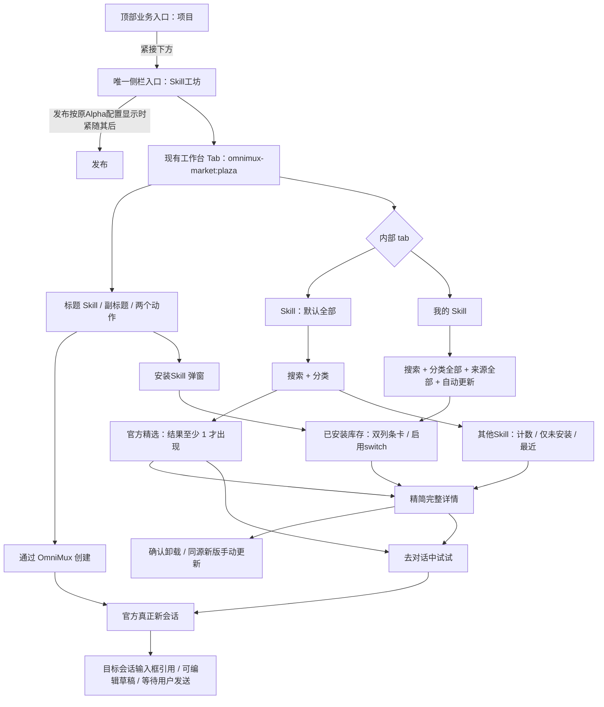
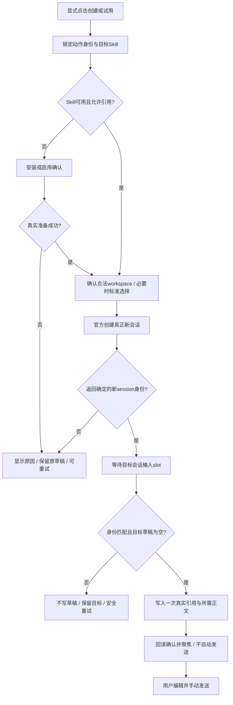
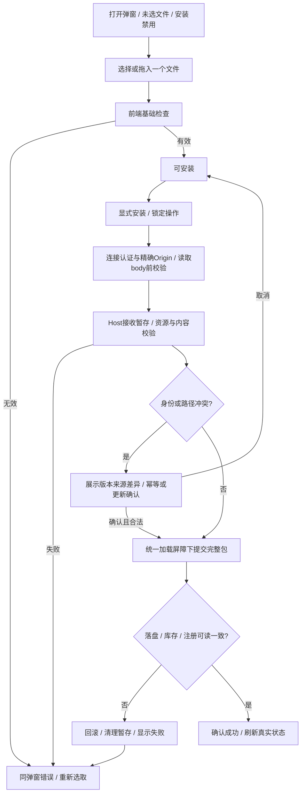
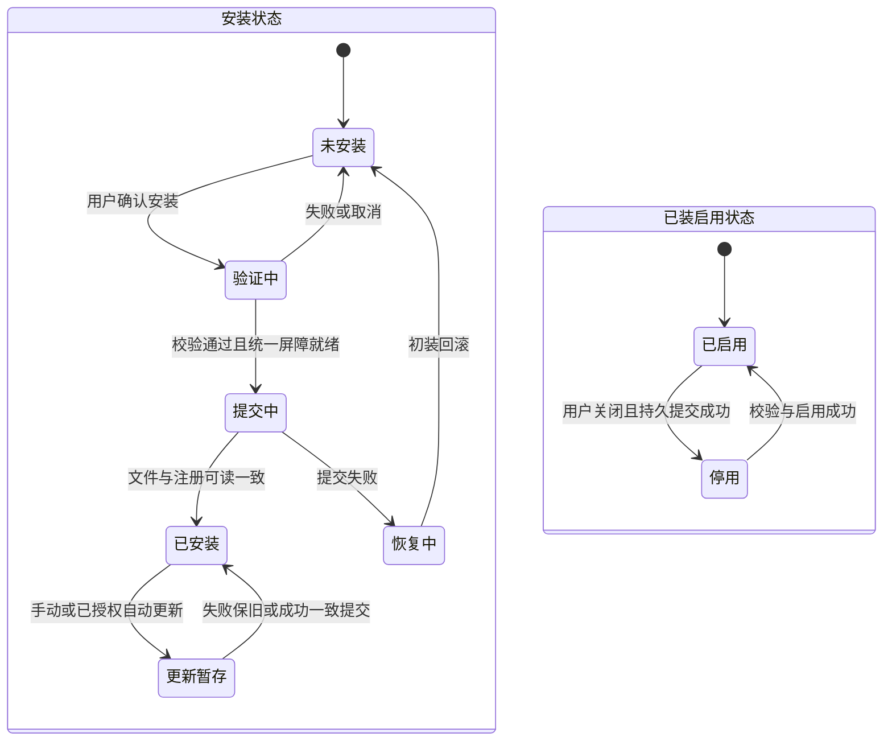

# Skill工坊完整产品需求文档（批准实施，全部功能待验收）

## 0. 文档状态、结论与阅读约定

**结论：在现有 `omnimux-market` 内完成 Skill工坊，不新建插件。以“发现 → 判断 → 安装/启用 → 在真正的新会话中引用”为主链路，另提供“我的 Skill”管理和 `/skill-creator` 创建入口。唯一侧栏入口迁至顶部“项目”正下方，去掉底部入口；插件/专家/连接器Tab继续隐藏且功能、数据、存储原样保留。页面严格遵循用户确认的demo精简样式。**

本文件是完整产品规格，不是实现报告或上线证明。用户已退出 plan mode、批准完整实现计划并要求继续；产品语义已冻结，原PRD阶段“禁止派工/尚未授权实施”的文字不再约束主理人当前已获批准的实施计划。**批准实施不等于技术门槛已关闭，更不等于任何功能已经通过验收。** 本文20项SW需求和57项AC全部保留，功能验收状态均为待执行。

本轮产品经理子任务仅将文档落盘至指定任务树 `docs/specs/2026-09-08-skill-workshop/prd.md`，不实施代码或测试、不召唤成员、不部署、不提交或远端写；不修改源PRD、demo或主树。主理人负责整体实施编排与统一日志。未获授权的跨仓修改、外部Issue写入、共享profile/安装根迁移、生产发布和App重启仍不在授权范围内。

| 项 | 内容 |
|---|---|
| 文档版本 | 0.2.0，`approved-for-implementation`；功能全部待验收 |
| 软件归属 | 已有包 `omnimux-market`；对外名称 `Skill工坊`；页面 H1 为 `Skill` |
| 技术基线 | 沿用当前 DSH 插件 Host TypeScript / Client JavaScript + React、原生 UI primitives / kit、现有工作台及 Skill provider；不引入独立 Vite/MUI/Tailwind 应用 |
| 本轮任务树基线 | `agent/market-skill-workshop-issue-773`；HEAD及base均为 `580234923268673562cacb5cd01aebdb780339e1`；落盘前任务树干净；未fetch |
| 前序源码证据快照 | v0.1.1引用本地HEAD `5485c25875cb9f71d7cb78a6aa69d07e07fffbab`；§18行号保留该历史上下文，不冒称本轮逐个重审或最新运行事实 |
| 前序完整PRD | [v0.1.1源文档](../../../../../.workbuddy/skill-workshop-prd.md)，824行；SHA-256 `237bdddf3313f66b4ef7ab8ee20a5e8849c41716e249425738710a9d6296748a`；本轮全文读，原文不改 |
| Demo指纹 | [只读demo](../../../../../tmp/skill-workshop-demo.html)，全文1–1428行；SHA-256 `8771c7472fd23a506546c1c68e86fd051031decb1120e62c687d4d6c5e8d6ad8`；本轮全文读 |
| 正式任务交付物 | Issue #773任务树内 `docs/specs/2026-09-08-skill-workshop/prd.md`，不是对主树工作台源文档的覆盖 |
| 决策归属 | 用户确认功能并批准完整计划；产品经理维护需求与边界；架构师核实实际pin、公共能力、状态与作用域；工程和QA按冻结规格交付真实证据 |

### 0.1 证据与决策优先级

1. **[U] 用户明确确认**：原九项需求及修订、U10入口/保留边界，以及本轮Q-03/Q-07/Q-08/Q-11选择，优先于demo、旧文档和建议。
2. **[A] 完整实施计划批准**：用户随后批准整份计划；Q-01至Q-15的PM推荐默认已纳入批准规格，见§16。标记[A]表示随完整计划获批，不虚构为用户逐字独立选择。
3. **[C] 项目契约**：保留插件/宿主边界、安全、工作台、发布与验收要求。产品目标覆盖的旧工坊语义在§13明确差异，不擅改其他规范或宿主。
4. **[E] 静态证据**：前序本地源码审读描述现状与缺口；本轮架构交接信息有单独证据边界。不能以已有实现取消需求，不能以clone/pin登记冒充实际运行。
5. **[D] Demo表达**：用于布局、文案和局部交互参考；模拟数据、计时器、注释及SVG占位不作为产品数据或能力证据。

本版不再把Q-01至Q-15列为等待用户重复回答的开放问题。正文中的实施默认用于补齐可测行为，不产生额外业务功能。**“必须”表示验收目标，不表示现已实现。** 尚未关闭的技术可行性与证据门槛集中于§13.4，不因产品批准而降级。

用户MiniMax截图原图未在本轮直接提供，截图信息沿用用户逐项转述；不宣称像素测量、竞品实测或真实素材版权核验。没有市场规模、访谈、转化率基线或工期数据，不编造研究结论及业务数字。

### 0.2 原始需求复述

基于当前演示demo，输出可交给架构、工程、QA的完整Skill插件PRD；对外将现有插件广场/市场统一为Skill工坊，保留默认Skill的内部双tab、官方精选大卡、普通Skill/我的Skill双列条卡、本地安装弹窗，以及真正的新会话使用和创建链路；去除截图未要求的装饰与冗余功能。

本轮将完整前序PRD迁入Issue #773指定任务树，保留全部需求和验收定义，落实已确认选择与完整计划默认，明确功能批准与未关闭技术门槛。

### 0.3 增量确认与版本记录

**[U10] 用户原话**：『补一个需求：Skill 工坊插件，迁移放在侧边栏入库，项目 插件下方。Skill工坊，原来的其他 tab 功能 数据 不不变，也不显示，以后考虑在接入，但是 UI样式要基于 demo 确认后的来统一』。

已确认内容不再列为开放问题：

- 入口从侧栏底部迁至顶部业务入口区，紧接“项目”下方：**项目 → Skill工坊 → 发布**；发布是否显示遵循原Alpha配置。去掉原底部入口，侧栏仅一个Skill工坊入口；其余入口相对顺序、Alpha状态、工作区会话树均不变。
- 复用 `omnimux-market` 和 `omnimux-market:plaza` 工作台页面，不另建插件或页面体系。
- “其他Tab”仅指**插件、专家、连接器**：功能、数据、存储保留不变，UI入口保持隐藏；不删除、迁移或清空其数据，不因Skill页重构破坏原功能。**不包含可见的 Skill / 我的 Skill**，首次及重开默认Skill/全部。
- 现有工坊UI按已确认demo样式统一；未来若另期批准接回隐藏Tab，也须沿同套样式，不还原旧UI。本期不实现隐藏Tab新UI，不承诺其重新接入范围或时间。
- [U] Q-03：推荐不在普通列表重复，精选分类只推荐；Q-07：未装switch先确认安装，成功启用，关闭只停用；Q-08：精简详情含完整说明、来源、分类、版本、状态，以及安装/启用/试用，详情内确认卸载和同源新版手动更新；Q-11：自动更新默认关，由用户主动开。
- [A] 用户批准完整计划，采用§16其余PM推荐默认，包括24小时冷却、有限安装阈值及fixture验证、真实workspace流程和partial诚实计数；不重复询问已关闭产品决策。

侧栏截图信息以用户转述为准：原入口在底部，箭头指向项目与发布之间；本轮未测量原图。demo只提供工坊页面样式，不包含宿主侧栏，不能作为入口位置证据。

| 版本 | 日期 | 变更 |
|---|---|---|
| 0.1.0 | 2026-09-08 | 首次完整待评审稿；20项需求、52项验收、15项开放问题 |
| 0.1.1 | 2026-09-08 | 按U10补充范围、信息架构、导航、兼容与样式；修订SW-01/SW-16，新增AC-53至57 |
| 0.2.0 | 2026-09-08 | 全文迁入Issue #773任务树；20SW/57AC完整保留；Q-01至15产品语义关闭；状态改为批准实施、功能全待验收；新增实际pin/统一加载屏障、认证、作用域及精确全量技术门槛；修正全部相对链接 |

## 1. 问题、产品目标与用户故事

### 1.1 要解决的问题

- **发现成本**：原页面以搜索及普通卡为主，缺少明确的官方精选入口与分类内精选层级。
- **状态不可信**：demo将已装集合、启用开关、自动更新开关混在前端模拟中，用户无法据此判断“已装”“可调用”“会更新”的区别。
- **使用链路断开**：demo详情/试用无业务动作，创建仅显示遮罩；现有picker向当前草稿追加引用，不能满足“真正新会话且保留旧草稿”。

以上为需求与源码差距分析，不是用户研究结论。

### 1.2 三个正交目标

| 目标 | 用户价值 | 可测成功标准（目标，不是当前结果） |
|---|---|---|
| G1 精准发现 | 在指定分类内看见真实推荐及可用Skill | 默认页、推荐0/1、分类过滤、多分类去重和计数验收全部满足；不夹带不匹配项 |
| G2 可信管理 | 理解安装/启用/更新状态，失败可恢复 | 安装成功必须有落盘及注册可读证据；关闭启用不删除文件；更新失败保留原版本；真实提交受统一加载屏障保护 |
| G3 无损进入创作 | 一次显式点击进入可编辑的新会话草稿 | 返回真实session身份、正确引用、旧草稿不变、不切团队preset、不自动发送、重复点击不重复创建 |

不另建运营分析平台。后续可在已有合规事件设施中统计“安装尝试→确认成功”“新会话创建→预填确认”的成功率及耗时分布，仅核验本链路；基线与性能目标由隔离测试测定，不设虚构业务数字。

### 1.3 角色与用户故事

| ID | 用户故事 | 对应目标 |
|---|---|---|
| US-01 | 作为视频创作者，我希望按短剧、影视、动画等分类浏览官方精选，以便快速判断哪个Skill适合当前创作。 | G1 |
| US-02 | 作为探索新能力的用户，我希望查看完整描述后在新会话中试用，以便不干扰正在进行的对话。 | G1/G3 |
| US-03 | 作为已有技能包的用户，我希望拖入zip或SKILL.md安装并得到真实结果，以便安全使用自己的能力资产。 | G2 |
| US-04 | 作为长期使用者，我希望在我的Skill中按分类/来源管理启用与更新，以便停用不需要的能力而不误删文件。 | G2 |
| US-05 | 作为Skill创作者，我希望通过OmniMux新建会话并引用技能创建器，以便从需求问答开始创建Skill。 | G3 |

“官方推荐数据维护者”只是现有catalog内容责任人，不引入新的后台用户体系或CMS角色。

## 2. 范围与非目标

### 2.1 本产品版本范围

- **入口与统一样式**：将唯一Skill工坊侧栏入口迁至顶部“项目”正下方，移除原底部入口，复用原工作台页面；UI按已确认demo统一，其他入口、Alpha配置与会话树不变。
- **发现页**：准确命名、默认双tab、搜索、指定分类顺序、官方精选、其他Skill及真实计数、仅未安装与最近排序。
- **我的Skill**：真实库存、分类/来源筛选、启用开关、自动更新开关及其真实生命周期。
- **详情与使用**：必要完整详情、状态相关安装/启用、详情确认卸载与同源新版手动更新，进入真正新会话引用目标Skill。
- **本地文件安装**：zip/SKILL.md选择与拖放、服务端验证、冲突处理、进度/失败、恢复和状态刷新。
- **创建入口**：真正新会话、引用 `/skill-creator`、预填用户给定文案、不自动发送。
- **数据和兼容**：沿用聚合渠道、库存与官方加载体系；推荐/启用/安装/自动更新语义正交，数据归属明确。

### 2.2 非目标与严格排除

- 不另造 `skill-workshop` 插件、不改包ID、工具协议名称或安装包名来实现品牌改名。
- 不建立独立推荐CMS、推荐星标管理入口、作者认证系统、下载统计平台、排行榜、会员/付费体系、社交/评分功能。
- 不新增说明工具栏、测试清空/重置按钮、emoji、炫光、装饰插画、营销区、批量操作、网格/列表切换器。
- 不恢复插件/专家/连接器Tab入口或为其实现新UI；功能、数据及存储保留不变，不删除、迁移、清空或破坏。未来接回另期确认；Skill/我的Skill不属于隐藏Tab。
- 不顺带调整其他入口相对顺序、既有Alpha状态或工作区会话树；不保留底部重复入口，不新建第二页面。
- 不把Skill当DSH插件安装，不改变核心插件、MCP、模型路由、登录、凭证与团队preset；本功能必要连接认证/Origin防护不等于重做登录系统。
- 不在工坊内重建聊天输入框、编辑器、Skill IDE或全套编写/审核/发布工作流。创建入口止于新会话预填，具体创作由现有skill-creator负责。
- 不自动发送消息、执行模型、运行导入包脚本、购买、发布、定时创作或部署。
- 不扩大现有创作货架到通用应用商店。“我的Skill”管理既有库存不等于授权额外业务能力。
- 本轮产品落盘仅写指定PRD；不修改demo、源PRD、主树、代码/测试或另写报告文件。主理人的完整实施批准不被这一子任务范围反向撤销。
- 不擅自跨仓、创建外部Issue、迁移共享profile或安装根、生产发布、App重启；确需越界时由主理人另获相应授权。

## 3. 完整信息架构与导航



精选虚拟分类只显示推荐F，不显示O及其控件；图中两个内容分支表示全部/领域视图的一般结构。

### 3.1 页面入口与默认值（SW-01）

- 侧栏原市场入口、工作台标题及无障碍名称统一为 **Skill工坊**；页面主标题仍为 **Skill**。
- [U10] 入口从底部迁至顶部业务入口区，紧接“项目”正下方。发布按原Alpha配置显示时为 **项目 → Skill工坊 → 发布**；原本隐藏时仍隐藏，不为示意顺序开启。
- 原底部入口必须移除，侧栏仅一处。其他入口相对顺序、Alpha状态、工作区会话树保持不变；不是在“新会话”下另加第二入口。
- 沿用 `omnimux-market:plaza` 身份和页面，不新建插件、全屏portal或第二页面体系，不接管官方conversation。
- **插件/专家/连接器**入口隐藏，功能、数据及存储不变；旧三Tab导航容器不恢复，当前只显示 **Skill/我的Skill**。
- 前序 `apply.js:56–68` 的 `sidebar.footer.action` 是旧底部现状证据，不是目标位置；不得按旧代码/测试保留底部入口。
- [A/Q-10] **首次、新开或关闭重开默认 Skill + 全部**。仅聚焦当前已开的工坊保留内部状态；详情返回保留筛选与滚动位置。
- [A/Q-10] 旧隐藏页intent（包括plugins/experts及任何连接器隐藏页intent）在工坊入口归一至Skill；不删除或改变相应工具能力。
- 打开工坊本身不得偷偷创建会话；创建只限显式“创建/试试”动作，继承工作台契约。

## 4. 优先级需求池与追踪

P0为完整主链路及安全底线；P1为同一完整版本的后续波次，仍属于批准范围；P2保留原追踪ID但本版已确定“不显示H3/不造假Tab”，不作为新增装饰授权。**P1未完成不能宣称完整PRD交付，不能摆放假开关。** 优先级依据明确需求、依赖顺序与失败损害，不采用无数据的RICE分数。

| 需求 ID | 优先级 | 需求 | 权威/状态 | 详细章节 |
|---|---|---|---|---|
| SW-01 | P0 | 唯一入口迁至项目正下方、移除底部、其余导航不变；隐藏旧Tab、可见双Tab默认Skill及demo样式 | U1/U2/U10+A/Q-10；待验收 | §3/§5 |
| SW-02 | P0 | 精简Header、准确副标题及两个动作 | U2/U9；待验收 | §5 |
| SW-03 | P0 | 指定分类顺序、分类过滤、精选虚拟分类 | U3+A/Q-09；待验收 | §6 |
| SW-04 | P0 | 推荐=官方精选、0/1显示、多分类聚合去重、不重复普通区 | U3/U/Q-03；待验收 | §6/§10 |
| SW-05 | P0 | 四列16:9精选卡、无底部作者行、悬停双按钮 | U4/U9；待验收 | §5 |
| SW-06 | P0 | 其他Skill双列条卡、真实下载量与计数、仅未安装、最近排序 | U5+A/Q-04/06/15；待验收 | §5/§6 |
| SW-07 | P0 | 我的真实库存、独立启用、未装先确认安装、关不卸载 | U6/U/Q-07；统一屏障待核实，待验收 | §7/§11 |
| SW-08 | P0 | 精简完整详情、安装启用试用、确认卸载和同源新版手动更新 | U4/U/Q-08；待验收 | §8 |
| SW-09 | P0 | 文件安装弹窗、选择/拖放及真实安装闭环 | U7+A；真实提交屏障待核实，待验收 | §9/§11 |
| SW-10 | P0 | 安装安全、重复/更新、回滚、连接认证与精确Origin、有限阈值 | U7/C+A/Q-12；待验收 | §9/§12 |
| SW-11 | P0 | 试用创建真正新会话并引用，未装/停用先确认准备 | U4+A/Q-14；待验收 | §8 |
| SW-12 | P0 | 创建新会话、引用skill-creator与指定正文 | U8+A/Q-02/14；待验收 | §8 |
| SW-13 | P0 | 草稿保护、幂等、防串会话、不切preset、不自动发送 | U8/C+A；待验收 | §8/§11 |
| SW-14 | P0 | 来源/身份/安装/推荐/启用/版本逻辑模型 | U3/U6/U7+C；真实作用域待核实，待验收 | §10 |
| SW-15 | P0 | 必要异常、无障碍、响应式、真实反馈 | U9+C；待验收 | §11/§12 |
| SW-16 | P0 | 复用插件/工作台/聚合/provider；隐藏Tab功能数据存储无损，未来接回样式边界 | U10/C+A/Q-09；待验收 | §13 |
| SW-17 | P1 | 我的分类/来源下拉真实绑定、库存有效来源及组合 | U6+A/Q-05；待验收 | §6/§7 |
| SW-18 | P1 | 自动更新默认关、持久偏好、24小时冷却、来源适配、失败保旧 | U6/U/Q-11+A；待验收 | §7/§11 |
| SW-19 | P2 | 不显示H3角标，不猜品牌替代 | A/Q-01已关闭；无角标约束待验收 | §5/§16 |
| SW-20 | P2 | 使用真实引用，不造假Tab提示或正文Tab | A/Q-02已关闭；引用约束待验收 | §8/§16 |

不得以P2名义加入截图之外的新功能；没有管理后台或测试入口。每项需求均需目标证据，批准/待验收不是完成勾选。

## 5. 页面布局、展示字段与交互

**[U10 / SW-01/16] 统一样式基线**：现有UI以[已确认demo](../../../../../tmp/skill-workshop-demo.html)为基线，按本PRD明确修订统一布局、卡片、按钮、Tab和弹窗。不照搬H3、假Tab、计时安装或mock会话。未来另期批准接回隐藏Tab时沿同套样式，本期不设计或实现隐藏Tab新UI。

### 5.1 共同顶部（SW-01/02）

顺序固定：标题区 → 独立动作行 → 内部双tab（左）与搜索（右）→ 当前tab分类/筛选 → 内容。宽屏工具栏单行，CTA不塞入筛选行。

| 元素 | 内容 / 样式目标 | 动作 |
|---|---|---|
| H1 | `Skill` | 无 |
| 副标题 | `发现、安装并管理 Skill，扩展 OmniMux 的创作能力` | 无 |
| 主按钮 | 白底深色字 `通过 OmniMux 创建` | §8新会话创建；忙时禁重复 |
| 次按钮 | `+ 安装Skill`，深色次级按钮 | 打开§9弹窗；加号用矢量图标，整体文案含义不变 |
| tab | `Skill` / `我的 Skill` | 不嵌套旧市场三tab |
| 搜索框 | `搜索 Skill...` | 当前业务tab范围搜索，见§6 |

品牌只用OmniMux。不沿用旧布局契约示例的MiniMax Design、Design按钮、业务插画、刷新/教程等可选元素。demo信息图标无明确业务语义，本版不做额外说明入口；必要无障碍名称不改变视觉。

### 5.2 官方精选（SW-04/05）

- 当前分类和搜索下至少一项推荐才显示大字号 **官方精选** 及区域；0项时移除标题、区域及相关外边距，不显示“暂无官方精选”占位。
- 标准宽屏 **4列封面大卡**；不足4项保持正常卡宽、自然左对齐，不放空白卡或拉满单卡。
- 封面 **16:9**；标题单行截断，描述最多两行，完整文本在详情可读。
- **整个作者名/认证徽章/下载量底部行移除**，不换名重加；不显示评分、安装徽章或推荐星标。
- 封面底部悬停显示两个**等宽**按钮：眼睛图标 **查看详情**（深灰半透明），对话图标 **去对话中试试**（浅紫）。各触发一次，不冒泡二次跳转。
- 点击标题或非按钮区域打开详情；键盘聚焦能访问两个动作，无hover设备直接显露，不要求长按猜测。
- [A/Q-01] 不显示H3，不改成“OmniMux H3”或自造等级/品牌角标。
- [A/Q-13] 封面使用有使用权的真实资产；demo内联SVG仅占位。缺图/加载失败保留16:9中性占位，不伪造海报或宣传“像素级还原”。

### 5.3 其他Skill（SW-06）

| 位置 | 规则 |
|---|---|
| 左区块名 | **其他Skill · N**；N按§6统计真实结果，不硬编码50；partial用已加载N |
| 右控件 | 仅 **仅显示未安装** 与静态 **排序: 最近**，不加来源chip、视图切换或推荐按钮 |
| 卡片布局 | 标准宽屏两列横条卡，信息在左，紫色switch在右 |
| 第一行 | 标题旁下载量，仅在可信时显示，0与未知区分 |
| 第二行 | 描述单行截断；详情完整展示 |
| switch | 反映启用；未装开启先确认安装，见§7；关闭不卸载 |
| 点击区分 | 信息区打开详情；switch不触发详情；下载数无独立动作 |

**[U/Q-03] 推荐不在普通列表重复**：全部/领域分类内，普通集合扣除该视图推荐身份；精选分类只呈现推荐，不出现其他Skill区块及其控件。同一Skill在各视图共用身份和状态，不复制安装状态。

### 5.4 我的Skill（SW-07/17/18）

保留共同顶部和搜索；分类chip条、官方精选、其他Skill标题及普通右控件均不显示。内容上方仅：

`分类 全部 ▾`　`来源 全部 ▾`　`自动更新 [switch]`

下方两列横条卡**只显示标题、描述、右侧启用switch**，没有下载量、作者、认证、版本徽章、推荐星标或额外常驻操作。详细管理与必要异常进入详情。所有真实有效作用域内已装Skill（含不在创作货架的历史库存、停用项、本地导入项）均能在全部找到；不得跨profile扫描或迁移来假造全库存。

## 6. 搜索、分类、来源、排序与计数的组合语义

本章产品算法已随完整计划批准；工程不得以demo未绑定按钮代替。架构确定实现，但可观察结果应一致；真实作用域及全量能力仍须核实。

### 6.1 分类法（SW-03）

**用户指定顺序**：

1. 全部
2. 精选
3. 短剧漫剧
4. 专业影视
5. 动画
6. 商业广告
7. 电商
8. 教育
9. 创意实验
10. 音频音乐
11. 平台工具

“全部/精选”是视图维度，不写入领域分类；“精选”不是 `channel=custom` 同义词，一个Skill可属于多个领域。

前序 `skill-picker-logic.js:27–37` 的顺序是电商、商业广告、短剧漫剧、专业影视、动画、教育、创意实验、音频音乐、平台工具。**[A/Q-09] 工坊采用上述新顺序、推荐语义和严格匹配；Composer picker保留旧领域顺序及旧精选语义，旧工具fallback保留，不借此全局重做。** 身份与领域匹配共用真源，视图排序/精选策略可区分，不复制分类身份库。

复用明确tags命中及现有受限文本兜底，不引入新的英文短词匹配或分类算法。明确领域标签优先；无领域资格项不进发现页，但已装后不能从“我的”消失。官方推荐至少配置一个有效领域，不靠推荐绕过货架资格。

### 6.2 查询域与执行顺序（SW-03/04/06/17）

逻辑集合（不是API）：

- `D`：允许展示的发现货架，按规范化身份跨渠道去重。
- `I`：当前真实有效加载/安装作用域内的已装库存，不从搜索页推导。
- `Q(x)`：当前已提交搜索词匹配x；空串为真。我的即时搜索以当前输入为已生效词。
- `C(x)`：当前领域成员；全部/精选时为真。
- `R(x)`：官方可控推荐元数据，严格布尔语义，缺失为否。
- `F = {x ∈ D | Q(x) AND C(x) AND R(x)}`。
- [U/Q-03] `O = {x ∈ D | Q(x) AND C(x)} − F`；精选分类只显示F。
- 仅未安装：`O' = {x ∈ O | installed(x)=false}`；**停用不等于未安装**。
- 我的结果：`M = {x ∈ I | Q(x) AND C(x) AND Source(x)}`。

**先统一身份/来源胜出 → 领域及搜索 → 推荐分区/仅未安装 → 稳定排序 → 分页**。不能取第一页48项过滤后叫总数。推荐0/1基于过滤后的F，不是catalog原始长度。

[A/Q-06] “仅显示未安装”和“排序: 最近”**仅作用其他Skill**，不改变精选编排。控件位于普通区，不让操作意外改变精选可见性。

### 6.3 搜索

- [A/Q-06] 每个内部tab独立保存query和筛选，不泄漏“我的”来源条件到发现页。
- 发现页 **Enter提交**，不另加搜索按钮；未提交不请求外网。分类变更使用已提交词；清空并提交恢复当前分类浏览。我的库存本地即时过滤。
- 至少支持标题、描述、token/slug；英文不区分大小写、忽略两端空白；多词 **AND**，可分别在任一检索字段命中。后端OR召回仍须本地满足AND及分类条件；未知词为空，不当成全部。
- 浏览保留custom + workbuddy；提交非空词后才允许现有skillhub参与。外发仅搜索词，不发草稿、安装目录、文件内容或会话历史。
- [A/Q-09] 工坊严格匹配，不将无关热门fallback伪装匹配；旧Agent工具fallback按原协议保留，不全局更改。
- 异步结果绑定查询版本，切分类/词后旧返回不能覆盖新结果。

### 6.4 来源下拉与库存

[A/Q-05] 来源首项 **全部**，其后按真实库存中存在的安装出处显示：**OmniMux、WorkBuddy、SkillHub、本地导入、未知**。零库存来源不展示。历史来源不可追溯归未知，不从标题/中文分类猜，也不向外查用户本地文件。

来源是**安装出处**而非当前搜索winner或发布方式。已装来自WorkBuddy的Skill，即使发现页同身份由OmniMux胜出，库存仍记录实际安装来源。缺失来源的历史库存必须在全部/未知可见，不新增界面说明行。

我的分类仅 **全部 + 九领域**，无精选下拉项；无领域历史条目在全部可见，不另设页面一级“其他”。

作用域必须以**实际宿主加载根及合法有效范围**确定，明确其对应workspace/profile含义，不跨profile。文档不预设“仅本项目”或“整个用户”已被核实；不授权移动/迁移共享安装根。范围未验证时不得宣称已覆盖所有真实库存，见§13.4。

### 6.5 排序与真实计数

- [A/Q-04] 最近按**当前来源版本真实更新时间倒序**，缺失用有证据的上架时间，再缺放末尾；稳定identity作为平局排序。不以抓取时间充当版本更新时间。
- 仅一种排序，显示静态 **排序: 最近**，不做可点但无变化的假菜单，不新增热门等选项。
- 先完整结果排序再分页；筛选变化重置页/游标。精选沿受控目录顺序稳定展示，不增CMS编排。
- `N`为其他Skill在适用过滤、去重、分区后的**精确数量**，加载更多不让总数随页长漂移。
- `totalApprox`和远程分页长度不能直接作为精确N。[A/Q-15] partial只显示 **其他Skill · 已加载 N**，必要短句说明来源暂不可用；不伪装全量。
- **partial诚实降级不替代完整精确全量验收**。全量能力未核实不得标SW-06/AC-19完整通过；无论UI多完整，仍是数据依赖未关闭。
- 下载量仅用真实统计并保留口径，不混用installs、stars、浏览量或模拟50。本地catalog映射0是占位，不证明真实0；未知隐藏数值，真实0可显示0；我的与精选不显示下载字段。
- 大列表沿现有滚动容器增量加载，不新增常驻分页工具栏；末尾必要重试可见，不以error当empty。

## 7. 我的Skill、启用与自动更新全流程

### 7.1 四种独立状态（SW-07/14）

| 状态 | 定义 | 影响 | 不等于 |
|---|---|---|---|
| 安装 `installed` | 有效作用域中有通过验证的包/记录 | 库存、未装过滤、可更新性 | 启用、推荐、曾搜索到 |
| 启用 `enabled` | 当前作用域允许后续选择/加载 | switch及后续调用资格 | 文件存在、卸载 |
| 推荐 `recommended` | 官方维护的发现推荐资格 | 精选展示 | 官方来源全部、已装、安全认证 |
| 自动更新偏好 | 允许对合格已装Skill自动更新 | 后续更新检查/提交 | 立即更新全部、插件自更新、启用全部 |

字段仅为逻辑名称，物理存储/传输由架构确定；UI不能只存enabled代表四者。

### 7.2 switch操作（Q-07已确认）

| 当前状态 | 用户动作 | 目标行为 |
|---|---|---|
| 未安装 | 开启 | 先确认该Skill安装/准备；真实安装成功后启用，不先永久置开再吞错 |
| 已装且停用 | 开启 | 校验包可读、持久启用、刷新后续调用资格；失败保持关 |
| 已装且启用 | 关闭 | 仅停用，保留包、版本、来源及我的条目，不调用卸载 |
| 安装/更新/启用写入中 | 再操作 | 单身份互斥、busy/禁用，不形成相反竞态 |
| 损坏或策略限制 | 开启 | 阻止并给恢复原因，不显示假就绪 |

历史库存延续原可调用状态，不能新增字段后全部关掉；新装真实成功后默认启用。用户已停用状态优先，不能在更新/刷新/JIT后擅自重启。停用影响**后续发现与加载**，不声称撤回已进入模型上下文的内容，不强行中止运行任务。

**实施硬门槛**：Market列表隐藏不构成停用。filesystem/provider/preset及JIT等所有适用加载路径必须尊重同一状态与提交屏障。前序架构只查本地官方clone，所查未发现跨路径统一停用/加载屏障；实际pin/L2仍待复核。门槛不只影响switch：**首次安装、更新、启停、卸载的真实状态提交与注册可见性同样依赖屏障**。不能只关UI动作就宣称核心一致性成立，见§13.4。

### 7.3 卸载边界

[U/Q-08] 主卡不新增卸载按钮，switch不承载删除。详情必要管理区保留 **卸载** 并明确确认删除范围：仅删除该Skill在授权有效作用域的用户安装包和记录，不删除创作输出、其他Skill、外部源目录或历史会话。失败保留/恢复库存一致；不以卸载扩展共享profile迁移或外部资产删除权。

### 7.4 自动更新（SW-18）

作用域为经实际加载根核实的当前合法库存全局偏好，不跨profile，不更新官方DSH、Market包或其他插件。不能在UI写“仅本项目”却影响所有会话。

- [U/Q-11] 首次 **默认关闭**，已有明确偏好保留；demo默认开是模拟。用户主动开启且持久化成功才显示开，失败回原值。
- [A/Q-11] 仅更新 **可信原来源、版本/内容指纹可比较、无本地修改、兼容当前宿主** 的已装Skill，推荐标记不授权更新。
- **开启时检查一次**；之后宿主启动/打开我的Skill触发检查，按有效作用域维护 **24小时冷却**，两种触发共用检查记录避免并发重复。App关闭不承诺后台执行，不新建cron/独立调度服务；开关切换不是强制重复批量下载入口。
- 本地导入无稳定源、未知源、不可比版本、修改或不兼容项均跳过自动覆盖；详情按需说明，无每卡额外switch。
- 暂存下载/校验后在统一屏障下提交；失败恢复旧包和完整记录。启用与推荐资格不因更新改变。
- 来源变化、同名异物、权限/能力扩大、主版本不兼容、本地修改等风险必须暂停自动覆盖，转详情显式确认；确认不豁免安全/兼容硬限制，也不默默删除用户修改。
- 关闭阻止新自动任务；暂存下载可取消，已进不可中断提交段完成/回滚到一致状态，不声称关闭即中止一切。不影响显式手动安装/更新。
- 当前已加载内容保持本轮一致，新版经官方注册重新可见后供后续加载，不半程替换提示词。

## 8. 详情、试用与通过OmniMux创建

### 8.1 精简完整详情（SW-08）

[U/Q-08] 复用已有抽屉/对话框载体并精简内容：**名称、完整说明/用途、实际来源、分类、可验证版本、安装/启用及必要错误状态**。保留关闭、按状态安装/启用、去对话中试试；必要管理区有确认卸载与 **同源新版手动更新**。

- 手动更新必须基于实际安装原来源、稳定身份及可比较新版，展示版本/来源差异，经显式确认后沿同一安全暂存、屏障、回滚和注册确认链路提交。
- 无源、不可比、无新版时不假造可更新；不同来源替换、降级不属于默认手动更新范围。修改/能力扩大等风险需要专项确认；不因手动操作绕过硬限制。
- 不默认展示旧TRACE雷达、评级星标、认证、下载/收藏/安装面板或多级详情tab。现实现存在不代表新版展示授权。
- 长说明安全渲染；图片失败不阻断文本与关闭。按所选身份和来源取详情，不能本地catalog卡只凭slug去SkillHub取另一份版本/说明。
- 返回恢复原tab、分类、搜索、滚动；多次点不同卡仅保留当前详情，旧返回不覆盖。

### 8.2 去对话中试试（SW-11/13）

1. 显式点击目标Skill试用，绑定稳定身份与安装来源，冻结一次动作意图。
2. 已装启用则验证可解析；未装先告知并确认“安装并在新会话中使用”，走统一安全流程；停用则先确认启用，不能绕过关掉的状态。
3. 原会话草稿由官方状态持有，不改内容、附件或preset。
4. [A/Q-14] 继承当前合法workspace，但不复制draft/preset。无合法workspace时走宿主公开标准选择流程，不代建目录；取消/失败不创建伪会话。
5. 通过官方能力创建 **不同于原会话的真实session**，等待身份确定；不能只开Tab/遮罩或改名空会话。当前为空仍新建，不静默复用。
6. 展开目标真实输入框，slot与session匹配后仅预填一次 `/<skill-token>`。试用默认只有引用，不编造创作任务或复制旧内容。
7. 用户编辑后自行发送；引用按官方候选对象/定义加载契约解析。界面有标签不等于正文已加载；本任务验收零模型发送。

安装/启用准备失败不创建试用会话；创建成功但预填失败则保留真实目标并说明阶段，重试只预填该目标，不再新建。

### 8.3 通过OmniMux创建（SW-12/13）

创建按钮复用真实新会话和草稿保护能力，目标固定：

| 项 | 内容 |
|---|---|
| 目标Skill | `skill-creator` |
| 现有Catalog身份 | `sk-omx-skill-creator` |
| 输入框引用 | `/skill-creator`，宿主真实引用/解析，不画不可用标签 |
| 预填正文 | `帮我使用它来创建一个新的技能。首先询问我这个技能应该做什么。` |
| 发送 | **不自动发送** |
| preset | 不改当前团队preset，不经专家召唤切模式；新会话用宿主合法默认，不强制团队，不复制旧preset |
| workspace | 当前合法workspace；无合法workspace走宿主公开标准选择，不建目录 |

预填呈现：

```text
/skill-creator
帮我使用它来创建一个新的技能。首先询问我这个技能应该做什么。
```

[A/Q-02] `Tab`只是参考图提示，**不是正文，不插入制表符，不造静态假提示**。使用宿主真实引用对象和原生补全机制；已绑定后不再插入第二份 `/skill-creator`。不另建Tab交互层。

[A/Q-14] 缺creator时先通过现有受信安装入口显式确认并完成准备，再创建会话；失败保留旧草稿并告知，不弹mock冒充成功。读catalog不证明当前宿主已安装/可加载。

### 8.4 幂等、草稿与失败保护

- 连点、Enter重复激活、请求重放只产生一个新会话与一次引用，以动作身份关联session，不按标题猜。
- 原draft逐字保留，含引用、换行、附件绑定；不能为预填清空旧draft，返回可恢复。
- 用户已在目标输入时，晚到预填停止并提示冲突，不覆盖或未确认拼接。
- 异步时切第三会话不得写入第三输入框；仅匹配目标可消费，过期失效。
- 连接中断导致结果未知先查询原动作，不盲目新建，不把超时视为完全未创建。
- 不使用 `catalogSummon`/专家挂载实现引用，不持久挂专家、不切团队preset。



最后一步表示产品后续用户行为，不是本轮自动执行或验收发送许可。

## 9. 安装Skill：弹窗与真实生命周期

### 9.1 弹窗布局（SW-09）

深色居中弹窗，标题 **安装Skill**，右上矢量X；中间虚线拖放/点击选择区，其后“文件要求”两项，底部通栏按钮。没有URL/Git输入、批量上传、推荐选择器或管理入口。

固定文案：

- 拖放区：**拖放 .zip 或 SKILL.md 文件，或点击选择**
- 要求一：**包含 SKILL.md 文件的 .zip 压缩包**
- 要求二：**或直接拖入 SKILL.md 文件**
- 底部：**安装**；未选真实disabled，不仅灰色。

一次一文件；多个/目录明确拒绝，不静默取第一。选后同区显示文件名与必要校验结果，可重新选择，不加测试清空。未开始写入时X/Escape关闭清除本次选择，焦点回安装按钮。

### 9.2 接受规则与验证（SW-10）

以下为必须达成的安全目标；Q-12产品默认和有限数值已批准，fixture边界验证仍待执行。

| 层 | 规则 |
|---|---|
| 文件类型 | zip检查扩展名与真实结构；直接单文件必须为 `SKILL.md`，不接受任意.md或MIME伪装 |
| 文本内容 | UTF-8、非空、有效name/description及非空正文，符合实际宿主Skill格式；历史已装可读性不等于放宽新导入；不得用宽松旧解析跳过验证 |
| 包根 | 根目录SKILL.md或唯一一层公共目录内的SKILL.md；可含所属资源子目录，禁止多个Skill根含糊批量包 |
| 单文件能力 | 不递归读取原目录，不自动上传引用资源；缺必须资源明确提示改用zip |
| 路径 | 拒绝绝对路径、..、盘符/UNC、NUL、规范化逃逸、大小写冲突、重复目标；实际落点必须在授权根 |
| 链接/特殊文件 | 拒绝符号链接、硬链接、设备文件及跨根目标链接，覆盖解压及提交阶段 |
| 资源界限 | 上传、单文件/总解压、entries、深度、路径长、压缩比、frontmatter、时间均有限；流式超限立即终止，不等内存耗尽 |
| 压缩格式 | 拒绝损坏、加密、不支持压缩、CRC/完整性失败或异常结构；不自动递归展开嵌套包 |
| 执行边界 | 只验证/存储/注册，不执行脚本、钩子、shell、依赖安装或模型调用；包脚本留给后续授权使用 |
| 可信标识 | 外部Skill文本/封面不能自授推荐、认证、权限或自动更新授权 |

**[A/Q-12] 有限阈值（架构基线，必须fixture验证）**：

| 项 | 上限 / 时限 |
|---|---|
| zip上传体积 | 20 MiB |
| 直接SKILL.md | 1 MiB |
| 单entry解压体积 | 10 MiB |
| 总解压体积 | 100 MiB |
| entries总数 | 1000 |
| 路径嵌套深度 | 8层 |
| 规范化相对路径长度 | 240字符 |
| 压缩比 | 100:1 |
| frontmatter体积 | 64 KiB |
| 上传时间 | 30秒 |
| 解压时间 | 30秒 |
| 获取身份/提交锁等待 | 5秒 |
| 注册确认 | 10秒 |

MiB/KiB分别按2^20/2^10字节。阈值内仍需其他安全检查；对每项测上限、上限+1以及适用累计超限/中断恢复。架构需固定深度/规范化计数、单项及总量压缩比等计量口径并证明不会绕过；这些是技术验证，不重开产品选择。超时不得假成功或无限阻塞；注册/提交结果未知需核对后回滚/恢复。

不得把“已选数值”当成已验证安全，也不得因fixture未执行而去掉上限。若实际pin兼容与阈值冲突，应提供证据及最小调整交主理人，不静默放宽或迁移共享库存。

### 9.3 安装流程



认证拒绝在读取body与暂存前结束，无写入；其失败分支虽未展开绘制，必须实现。未核实统一屏障前不能把J/K作为已有能力。

### 9.4 重复、更新与成功定义

- 同身份、来源、指纹重复安装幂等“已安装”，无第二目录、无虚增下载；同版本不同内容不能直接当同包。
- 同身份同源新版明确目标与差异，用户确认或合格已授权自动更新后提交；旧版不自动降级，降级不擅增详情能力。
- 同名异身份/来源不能按中文标题覆盖；路径冲突明确选择/拒绝，不自动改名绕开，也不偷偷换供应源。
- 有本地修改不自动覆盖；明确风险确认及安全可行性成立前保旧。更新失败保留旧文件、启用、来源、完整记录。
- **成功**：有效包提交到正确作用域，记录与文件一致，官方加载体系能列出/解析非空合法定义（无需模型），客户端回读刷新真实状态；全路径不能读到中间包。HTTP 200、计时结束、按钮变绿或部分文件不是成功。
- 文件已写而注册未可用显示真实阶段，不说已可使用；注册10秒时限与恢复策略可测，不能只显示成功后让加载失败。
- 关闭弹窗不等于取消Host写。暂存可取消，提交临界段禁关闭并必要短句解释；完成/回滚后恢复。不得无限锁UI，宿主中断后可恢复核对。
- 首装无旧包的回滚、更新保旧、启停和卸载可见性均须统一屏障；没有旧版本可保并不豁免首装一致性。

## 10. 数据语义、身份与来源归属（逻辑模型）

本章定义责任与含义，不替架构指定API、表、路径或新增服务。

| 逻辑对象 | 最小语义 | 真源 / 责任 | 关键约束 |
|---|---|---|---|
| Skill身份 | 稳定identity、token、catalog关联、来源 | 聚合及注册体系，Market规范化 | 不按显示名判同物；同名异物可分辨 |
| 发现描述 | 标题、完整说明、领域集合、封面 | 受控catalog或原市场源 | 不用头像冒充封面，不拼不同源版本/说明 |
| 官方推荐 | 推荐资格、目标身份、稳定目录顺序 | OmniMux现有内容真源 | featured/recommended统一逻辑；包声明不可信；专家featured不混入 |
| 安装记录 | 包/目录引用、安装源、版本/指纹、时间、校验 | 经核实有效安装域，与官方filesystem一致 | 搜索不是库存；可重建核对；失败不是空 |
| 启用偏好 | 该作用域后续是否允许加载 | 持久设置/安装管理域 | 不删包，不被JIT/provider/preset绕过 |
| 自动更新偏好 | 全局开关、有效作用域、检查状态与冷却 | 用户偏好域 | 不影响推荐/启用/插件升级，不跨profile |
| 更新来源 | 原源、可用版本/指纹、兼容、本地修改 | 原安装源与本地核对 | 不从winner猜安装源，无证据不覆盖 |
| 下载量 | 来源统计、已知标记、可选统计时间 | 对应市场 | unknown不等于0，不加总异口径 |
| 视图状态 | tab/query/领域/来源/排序/滚动分页 | 客户端工作台/会话隔离 | 非安装真源，旧响应不污染 |
| 操作意图 | 安装/预填身份、阶段、目标session、结果 | 现有业务/官方设施 | busy、查询、幂等、安全重试，不造任务中心 |

### 10.1 推荐映射规则

- 推荐即进入所属分类官方精选，多领域都可见；全部/精选按身份仅一张。
- 不以custom、作者OmniMux、认证或下载量代替推荐字段。
- 旧catalog顶层featured是ID列表且当时为专家ID，旧解析未透传item级featured；架构确定受控元数据适配，不假定前端补true即端到端有效。
- 跨渠道去重保持custom > workbuddy > skillhub整卡优先；推荐引用明确去重身份/胜出版本，不拼低优先级卡推荐/版本到另一卡。来源冲突可解释，不靠标题。
- [A/Q-13] 现catalog维护者负责推荐清单和授权资产，无推荐合法隐藏、无图中性；不造四张假正式卡，不新建CMS。

### 10.2 现有数据能力与待补项

前序 `SkillCard`有slug/name/description/category/downloads/installed/channel/catalogId/installBackend/tags等，未声明独立enabled、cover、推荐、更新日期/偏好。`InstalledSkill`只有slug/name/description/version/path，不能直接满足来源筛选、启用持久化。需逻辑适配与历史记录兼容，不在PRD固定物理字段。

历史记录适配仅限获批Skill语义和实际合法范围；**不授权共享profile/安装根迁移**。作用域和完整库存不能由类型字段、硬编码路径或本地搜索结果推定。

## 11. 状态机、异常与一致性

### 11.1 正交状态机



初始启用仅指新装/历史延续默认，不覆盖已停用状态。推荐与自动更新是独立偏好/元数据，不是安装状态节点。

| 流程 | 状态 | 允许行为 / 恢复 |
|---|---|---|
| 页面加载 | loading / ready / empty / partial / error | empty只用于成功零结果；partial保留可用源，不代表全量通过；error可重试 |
| 安装弹窗 | idle / selected / invalid / validating / conflict / committing / success / failed / canceled | 未选/无效禁装，单身份互斥；失败可重新选择/重试 |
| 启停 | stable / changing / failed | 失败回旧值；卡片详情同步；持久化与加载资格一致才确认 |
| 会话动作 | idle / preparing / creating / waiting-composer / prefilling / ready / failed | 绑定目标、重试不重复；ready不等于已发送 |
| 自动更新 | off / eligible / checking / staging / committing / up-to-date / skipped / failed | 跳过有原因；失败保旧；不新增后台面板 |

### 11.2 最小异常表达

| 场景 | 必须表现 | 禁止 |
|---|---|---|
| 分类无推荐、有普通 | 无精选标题/区域，普通正常 | 精选大空白 |
| 精选分类零 | 内容级“没有找到匹配的 Skill” | 空标题或混普通 |
| 我的无库存 | “暂无已安装的 Skill”，已有安装按钮可用 | 自动装推荐/营销模块 |
| 远程失败 | 本地保留，“远程来源暂不可用”，已加载数 | 全量成功/清空库存 |
| 库存无读取权限 | “无法读取已安装的 Skill”，旧状态只读保留 | 报0后破坏覆盖 |
| 格式/限额 | 弹窗具体原因及重选路径 | 假成功或泄漏堆栈/绝对路径 |
| 写入/注册失败 | 阶段、回滚状态、真实核对 | 计时成功/switch永远开 |
| 新会话失败 | “未能创建新会话，请重试”，旧draft完整 | mock/复用旧会话 |
| 创建成功预填失败 | “新会话已创建，但未能安全预填”，绑定目标重试 | 再建会话/覆盖输入 |
| Skill下架/失效 | 详情解释，不可加载禁试用；不自动删已装 | 推荐消失就卸载 |
| 认证/Origin拒绝 | body读取前拒绝，安全错误提示，无暂存写 | 读取后才鉴权/只靠旧guard |
| 未有加载屏障证明 | 标明能力门槛未关，不宣称真实管理完成 | 用UI状态掩盖全路径一致性缺口 |

错误仅在相关控件/弹窗/内容表达，不加常驻说明栏；可重试错误不无限自动重试。异步写入有有界超时、结果查询或明确未知状态。

## 12. 安全、隐私、无障碍与响应式

### 12.1 安全与隐私（SW-10/13/15）

- **连接认证 + 精确Origin** 是必要条件，不能仅沿用旧同源guard。安装、卸载、启用、更新及偏好等写操作必须在**读取body之前**核验有效连接认证和与实际受信入口完全匹配的Origin；缺失/不合法认证或Origin拒绝。不得只比较hostname、后缀、子串或信任任意端口；具体公开认证seam由架构对实际pin核实。
- POST不代替认证，CORS不代替授权，Host本地监听不等于可信。不得GET触发写入或跨站触发；未通过校验不消耗上传/解压资源、不写暂存。内部自动更新按合法已持久授权执行，不以HTTP防护缺口放开外部调用。
- 本地文件由用户显式选择，不任意读宿主文件；内容默认只送本机Host验证，不上传SkillHub/第三方扫描/云端。新增外部上传须另授权，本版不新增。
- SKILL.md、说明、链接、封面均不可信；安全渲染Markdown、去可执行HTML/脚本与危险URL；未净化SVG不能内联DOM。
- 封面遵循现安全资源机制，评审URL/重定向/内网风险，不成为本机读或SSRF通道。
- 官方精选不等于安全认证；安装不执行包代码、不授生产/支付/凭证/发布权；后续会话仍受宿主约束。
- 不采集旧draft、会话正文、包全文、私有绝对路径作运营日志；故障只记动作ID、匿名化身份、阶段/错误码、必要时间。密钥/token/文件不落日志，沿既有保留策略，不新建遥测平台。
- 真实提交前的统一加载屏障是安全一致性条件，不能仅靠UI锁或Market私有provider过滤替代。

### 12.2 无障碍

- tablist/tabpanel、aria-selected、switch/aria-checked、disabled/busy真实表达，不以div点击和颜色独自表达。
- Tab/方向键到搜索、分类、下拉、卡片与switch；Enter/Space激活；切换不丢焦点。
- hover双按钮有focus-within等价，无hover可达；图标有可读名称。
- 弹窗可读名称、焦点约束、背景不可交互；X/Escape按阶段安全处理；关后焦点回触发器，文件选择可键盘用。
- 正文至少4.5:1，大文字/关键非文本适用3:1；灰字/浅紫需实际测量，不能按demo色值直接通过。
- 不靠红绿区分；截断完整内容在详情或可访问名称可读；错误/进度适量live region，不每帧播报。
- 尊重减少动效，不增炫光/粒子/装饰动画。

### 12.3 响应式与主题

- 按**内容容器宽度**而非全浏览器适配；标准桌面精选4列、普通/我的2列。
- 不足可读卡宽与双按钮时精选降2再1，普通/我的降1；断点由真实容器验证，不硬撑4列。
- 分类单行水平滚动，键盘聚焦可见；搜索不遮tab；窄屏语义拆行但不增控件或整页横滚。
- 弹窗居中不超可用宽，长内容内部滚动；动作/错误可见；200%缩放核心操作不丢。
- 深色参考为主，浅色兼容不破坏宿主主题。白主按钮、紫switch、浅紫试用按明确需求，尺寸/圆角/token映射协调现规范，不复制demo全局body样式。

## 13. 依赖、兼容性与契约冲突清单

### 13.1 依赖与责任边界

| 依赖 | 当前证据 | 完整交付要求 / 不可偷换 |
|---|---|---|
| Market与工作台 | 前序已有plaza、i18n、隐藏旧tab，旧入口在底部 | 复用且迁唯一入口，不新壳、不改官方源码 |
| 聚合目录 | custom/workbuddy/skillhub、slug去重与优先 | 推荐、过滤全量计数、跨源最近补齐，不第二目录 |
| 安装 | 旧catalog/SkillHub zip及部分路径检查 | 本地上传、单md、阈值、认证、屏障、回滚/注册为增量 |
| Registry/provider/preset | candidate和definition，filesystem高优先/JIT | 全路径状态及真实提交屏障，不只Market UI/provider |
| 官方会话/输入框 | picker setDraft，灵感有session-scoped先例 | 实际pin确认公开会话/预填契约，不导兄弟private、不专家切preset |
| 库存 | 旧InstalledSkill字段少 | 核实真实加载根/作用域、来源/指纹/启用；不把搜索当库存 |
| 推荐与封面 | 旧featured含专家，demo为SVG | catalog维护者提供身份/授权图；缺推荐隐藏、缺图中性 |
| 自动更新 | Market包自更新禁用不等于Skill更新存在 | 独立有限Skill更新策略，默认关、24h冷却，不开包自更新 |
| 连接认证/Origin | 前序local-api旧guard不是充分证明 | 实际pin公开认证+精确Origin在body前拒绝并验证 |

公开seam不足时先说明具体缺口和最小可行路径；跨仓需要主理人另处理授权/依赖协作。本PRD不授权官方源码patch、发行包修改或外部Issue写入。

### 13.2 兼容性原则

- 包名、已有安装记录、工具名、工作台ID保留；改用户可见品牌不破内部协议。
- 合法作用域历史已装全部在我的/全部可见；未知来源不编远程源。
- 缺推荐false、缺统计unknown、缺日期不伪造、缺启用按原行为兼容；不覆盖用户停用。
- **插件/专家/连接器功能、数据、存储原样，UI入口隐藏**。不得删其实现/工具、迁移/清空存储；公共组件调整不得破坏。仅限Skill域的已批准元数据增量不能扩到隐藏Tab。
- 保留不等于重新开放，也不要求本期新UI；未来接回另期授权并沿同套demo样式。
- Skill/我的Skill可见且默认Skill/全部；引用不继承专家附身。
- [A/Q-09] picker保留旧顺序及精选，旧工具fallback保留；工坊新顺序、推荐、严格匹配，身份/领域共享；不借机重做picker。
- 离线仍浏览本地/管理合法本地库存，网络失败不拖垮本地或默认下载热榜。
- L2与研发维持既有Alpha/非Alpha边界；不将工坊自行标Alpha掩盖未实现，正式发布不触被排除能力。

### 13.3 已发现的契约/文档差异（本轮不改其他文件）

| 现有材料 | 差异 | 本PRD处理 |
|---|---|---|
| README四tab与旧名 | 不符i18n/隐藏三tab代码 | 历史现状以代码为证；目标按U1/U10，不恢复入口，保功能数据 |
| apply.js旧底部测试 | footer.action与项目下方冲突 | 仅旧事实；实施按新入口同步代码/测试，本轮只写PRD |
| 旧货架§1/§2.6 | 电商第一、精选=custom、不补我的/精选 | 工坊按新需求；picker旧语义和旧工具fallback保留 |
| 旧货架§1.3 | 写内联副本，前序源码已有SkillShelf | 不重建副本 |
| Settings旧stage及slots | 仍含overlay | 以workbench-split工作台为准，不画第二composer |
| 全局页面示例 | MiniMax/教程/刷新/插画等可选项 | 本轮固定OmniMux文案与精简白名单 |
| 全局source文案 | source=发布方式 | 本场景安装出处 |
| 通用UI生产物化示例 | 不等于当前发布授权 | 本轮无物化；完整计划批准不自动覆盖Prod或App重启 |
| 旧local-api guard | POST/旧同源校验不证明连接认证及精确Origin | 增量防护必须body前验证，实际pin证明 |

### 13.4 未关闭的实施硬门槛

以下不是产品选择未定，不需要重问Q-01至15；是架构/工程/QA必须给出的真实证据。状态全部 **OPEN / 未核实关闭**。

| 门槛 | 已知信息及证据边界 | 关闭条件 / 下一责任 |
|---|---|---|
| TG-01 实际pin与运行身份 | 主理人交接：架构仅查本地官方clone `dd6322d...`；[harness-pin登记](../../../docs/harness-pin.md)为alpha.3的交接信息，不等于实际App/L2运行；短SHA不能扩写为未经核实完整SHA | 架构核实实际消费pin、构建/运行身份与公开seam，再在授权L2绑定证据；本轮不启动/重启App、不调pin |
| TG-02 全路径加载/提交屏障 | 所查clone未发现跨filesystem/provider/preset统一停用/加载屏障；不是证明所有版本永久不存在 | 实际pin复核所有适用发现/加载/JIT/preset路径；首装、更新、启停、卸载提交和注册确认须有一致屏障与失败恢复证据。未关闭不得宣称真实管理提交完整；不能仅停用UI或Market过滤冒充 |
| TG-03 认证与Origin | 旧guard不足；当前实际公开连接认证尚待证明 | 所有外部写入口连接认证+精确Origin在读取body前校验；错误/缺失认证、错误/缺失Origin及有效路径fixture验证；拒绝时body/暂存写均零 |
| TG-04 有效作用域与库存 | 实际安装/加载根及全库存边界未核实 | 架构按合法workspace/profile与实际加载根明确读写域，QA证明全部真实库存及未知来源兼容、不跨profile；不以此授权共享profile/安装根迁移 |
| TG-05 精确全量及排序 | totalApprox/分页/partial不能证明过滤后全量 | 数据与架构证明跨源去重、过滤、推荐分区、最近全局排序及精确N；AC-19验证分页稳定。已加载N仅降级，不能替代完整验收 |
| TG-06 安装资源/恢复 | 有限阈值已选，安全fixture与中断恢复未执行 | 架构固定计量口径；工程/QA执行上限、上限+1、累计、超时、CRC/路径/链接/回滚/注册/屏障失败等隔离fixture |
| TG-07 真实新会话与零发送 | 历史有先例不等于当前pin可用 | 证明公开session创建、workspace选择、目标slot与真实引用；旧draft/附件/preset不变，幂等，第三会话不被写，模型发送计数0 |

架构若确认公开seam不足，应回传具体缺口及最小不越界方案，由主理人决定后续授权。未获允许不改官方仓、不建外部Issue、不迁共享根。可以继续已授权且不依赖未关门槛的工作，但不能把局部结果签成完整功能验收。

## 14. 验收场景（目标用例，57项全部待执行）

Given/When/Then定义工程/QA可观察结果。Q决策已闭合，原S条件不再等待产品确认；所有AC仍未执行、未通过。使用隔离fixture，避免真实用户库存和草稿受损。本版保持AC-01至AC-57连续，不另增编号；新增明确语义纳入对应原场景。

| AC ID / 需求 | Given（前置） | When（动作） | Then（可测结果） |
|---|---|---|---|
| AC-01 / SW-01 | 工坊未打开 | 从项目正下方入口打开 | 复用omnimux-market:plaza；入口/Tab名Skill工坊，H1 Skill，仅双tab且Skill激活；插件/专家/连接器入口隐藏 |
| AC-02 / SW-01 | 新工坊无恢复状态；另有已开及关闭重开样例 | 首次渲染、仅聚焦、关闭重开 | 首次/重开Skill/全部；仅聚焦保留状态，安装创建可达 |
| AC-03 / SW-01 | 旧experts/plugins及其他隐藏页intent | 打开工坊 | 归一Skill，隐藏页不可偷开，相应Agent工具未删 |
| AC-04 / SW-02 | 深色参考布局 | 看顶部 | 标题/副标题/双按钮逐字符合，无MiniMax、额外工具栏装饰 |
| AC-05 / SW-03/16 | 任意目录及picker旧基线 | 看分类与兼容行为 | 工坊11项顺序同§6；全部/精选非领域；picker旧顺序/精选及旧工具fallback不变，身份领域共享 |
| AC-06 / SW-04 | 分类推荐0且普通有项 | 打开分类 | 精选标题/区域/空白不占位，普通正常 |
| AC-07 / SW-04/05 | 分类恰1真实推荐 | 打开分类 | 精选及1张正常宽卡，不凑4、不拉满 |
| AC-08 / SW-04 | 同推荐属于动画/商业广告 | 分别切领域、精选/全部 | 两领域出现，聚合只一次、身份一致 |
| AC-09 / SW-04/14 | custom未推荐与推荐true各一项 | 浏览精选 | 仅true，来源不代推荐，缺字段false |
| AC-10 / SW-04 | 旧featured中专家ID | 看Skill精选 | 不把expert/team当Skill |
| AC-11 / SW-04 | 有推荐但搜索不匹配 | 提交搜索 | 精选标题/区域消失，不填无关推荐；精选类不显示普通区/控件 |
| AC-12 / SW-05 | 标准宽容器4推荐 | 看/悬停/键盘聚焦 | 4列16:9、标题单行、描述最多两行；作者/认证/下载底行无，双动作等宽可达 |
| AC-13 / SW-05/19 | 缺图/请求失败及无推荐样例 | 渲染 | 缺图16:9中性，文本动作可用；无H3或自造标；无推荐合法隐藏 |
| AC-14 / SW-06 | 推荐与普通共存 | 看其他Skill | 不重复推荐，标题旁真实下载，双列右switch，计数等过滤去重；精选仅推荐无普通区 |
| AC-15 / SW-03/06 | 动画与音频混合、多词结果 | 动画分类/提交多词 | 精选普通均匹配领域；标题说明token多词AND、大小写/空白正确，宽召回/热门无关项不展示 |
| AC-16 / SW-06/07 | 未装A、启用B、停用C | 勾仅未装/操作普通排序 | 普通只A，停用非未装；精选不受普通控件影响 |
| AC-17 / SW-06 | 更新、上架、双缺、平局跨页数据 | 显示最近并加载 | 真更新时间优先、缺用上架、再缺末尾、identity平局稳定，全量先排；静态最近无假菜单，不用抓取时间 |
| AC-18 / SW-06/14 | unknown、真实0及正数 | 看普通/我的/精选 | 普通未知不假0，真值格式化；我的精选无下载 |
| AC-19 / SW-06 | 超一页精确集合与partial样例 | 加载更多/来源失败 | 精确N不漂移不重复，partial标已加载N；partial不能签为精确全量通过，需独立全量证据 |
| AC-20 / SW-03/15 | A查询在途后改B，及发现未提交输入 | A晚到/Enter | B保持；发现Enter前不外发；两tab查询条件独立，我的即时过滤 |
| AC-21 / SW-07/17 | 实际加载根内停用/本地/无领域历史库存 | 我的/全部 | 全可见不依赖搜索，仅标题说明switch；有效域已核实，不跨profile |
| AC-22 / SW-17 | 多源多领域库存 | 分类、来源并搜索 | AND交集；下拉绑定，全部仅解除本维度；分类全部+九领域，来源只显示有库存项且按§6顺序 |
| AC-23 / SW-17 | 来源无法证明的历史项 | 选未知 | 不猜OmniMux，能找到条目 |
| AC-24 / SW-07 | 已装启用及包基线；实际pin路径清单 | 关switch、刷新/重启隔离宿主并检查后续加载 | 文件逐字保留、仍我的、偏好关；filesystem/provider/preset/JIT适用路径一致禁止后续加载；不卸载、不撤回既有上下文 |
| AC-25 / SW-07 | 启用/停用持久化或屏障失败 | 操作switch | 不假成功，保旧状态，卡片详情一致，有具体原因 |
| AC-26 / SW-07/10 | 未装Skill | 开switch，分别取消/失败/成功安装 | 先确认；取消失败仍未装/关，无假成功；真实成功才启用，初装注册/可见性受统一屏障 |
| AC-27 / SW-08 | 本地与SkillHub同slug不同说明；已装同源新版 | 详情、确认卸载/手动更新、取消及失败 | 正确身份源完整说明/分类/版本/状态和安装启用试用；无旧TRACE；卸载明确范围、失败保一致；同源新版确认更新且失败保旧；关后还原位置 |
| AC-28 / SW-09 | 未选文件 | 打开/按安装 | 深色指定文案、X虚线两要求；真实禁用、不发写 |
| AC-29 / SW-09/10 | 合法zip与SKILL.md、有效认证/Origin | 选择/拖放安装 | 同安全验证；正确作用域文件/记录/可解析非空定义一致、全路径不见中间包才成功 |
| AC-30 / SW-09/10 | readme.md/伪zip/多文件/目录 | 选择拖入 | 明确拒绝，不静默第一项 |
| AC-31 / SW-10 | 缺SKILL.md、空正文、非法元数据、多根 | 安装 | 验证失败，无完整记录、不损原包 |
| AC-32 / SW-10 | ../、绝对、盘符、链接、大小写冲突 | 安装 | 写出授权根前拒绝，外部零变化 |
| AC-33 / SW-10 | §9.2每个限额上限/+1、累计、压缩炸弹及超时fixture | 验证/上传/解压/取锁/注册 | 有限阈值按口径执行，超限及时终止清理；含20/1/10/100MiB、1000entries、8层、240字符、100:1、64KiB、30/30/5/10秒；不假成功 |
| AC-34 / SW-10 | 包含脚本/钩子；无效/缺认证与错误/缺Origin请求 | 安装或调用写入口 | 合法只落盘/注册，脚本/外传/模型0；拒绝请求body读取0、暂存写0，全部外部写入口认证+精确Origin前置，旧guard不足 |
| AC-35 / SW-10 | 同身份同内容已装 | 重复/连点 | 幂等，无重复目录/并行覆盖/虚增统计 |
| AC-36 / SW-10 | 旧包及首装样例，提交/注册/屏障失败 | 更新/首次安装 | 更新保旧文件记录启用源；首装清不完整包；全路径不读半包；真实阶段不显示完成 |
| AC-37 / SW-09/10 | 未完成或Host失败 | 超demo计时 | 不计时假成功，真实阶段/错误 |
| AC-38 / SW-11/13 | A草稿/附件/preset与就绪Skill | 试用 | 新真实B目标引用，A逐字及preset不变，新会话不复制旧draft/preset，发送0 |
| AC-39 / SW-12/13/20 | creator可解析，原会话空/非空，合法/无法确定workspace | 创建 | 均真正新session，一次引用和指定正文，无Tab/制表符/假提示；合法workspace沿用，缺则公开标准选择、不建目录、不复制preset，发送0 |
| AC-40 / SW-13 | 创建进行中 | 连点/Enter重放 | 一次会话一次预填，无多空会话 |
| AC-41 / SW-13 | B创建但composer未就绪 | 超时重试 | 提示阶段，只绑定B，不重建、不写A |
| AC-42 / SW-13 | B已有用户输入或用户切C | 晚到预填 | 不覆盖B、不写C，session隔离且有失效期 |
| AC-43 / SW-11/12 | 安装/启用失败或creator缺 | 试用/创建 | 缺creator先确认准备，准备成功才新建；失败保原draft、不称就绪、不切preset/召专家/发消息 |
| AC-44 / SW-13/16 | 引用草稿就绪，实际pin确定 | registry按candidate取定义 | source/provider/invocation/非空正文完整；不是字符串冒充candidate，零模型调用 |
| AC-45 / SW-18 | 自动更新无偏好或已有明确偏好 | 打开、主动开、重启隔离宿主 | 初始关、保已有偏好，持久成功才开；开启检查一次，后续启动/打开我的共用24h冷却，无Market包自更新 |
| AC-46 / SW-18 | 合格/无源/不可比/修改/不兼容/停用混合 | 已授权自动检查 | 仅合格自动更新，其余跳过说明；风险转确认且不豁免硬限制，停用状态保留 |
| AC-47 / SW-18 | 已下载新包验证失败 | 提交前完成验证 | 旧版完整，原因可解释，无假更新 |
| AC-48 / SW-18 | 未开任务与已提交各一例 | 关自动更新 | 阻新；提交完成或回滚一致，不误报全部取消 |
| AC-49 / SW-15/16 | 离线/远程超时/库存读取错 | 浏览管理 | 本地合法可用，失败不假零/全量；无跨profile补库存 |
| AC-50 / SW-15 | 键盘、无hover、窄容器、200%缩放 | 发现→详情→安装入口 | 全可达、焦点正确、关键按钮完整、列降级，无额外元素，适用对比度实测 |
| AC-51 / SW-10/15 | 脚本Markdown/恶意SVG/危险链接封面 | 渲染 | 无执行、本机任意读、越权外发，安全降级 |
| AC-52 / SW-01/13/16 | GUI对话列折叠 | 试用/创建及仅打开 | 真会话列可见，工作台/画布不重建；仅打开不创建会话 |
| AC-53 / SW-01 | 项目可见，发布原显示/隐藏两隔离配置 | 渲染侧栏 | 顶部项目下一项Skill工坊；发布显示时项目→工坊→发布，隐藏仍隐藏，不改Alpha |
| AC-54 / SW-01/16 | 原底部入口基线 | 查全侧栏点新入口 | 总入口恰1、底部0，既有plaza，无新插件/页面实例 |
| AC-55 / SW-01/16 | 其他入口/Alpha/会话树基线 | 迁移后对照 | 除工坊移动，其余相对顺序/Alpha完全同；树数据层级及展开选中不变 |
| AC-56 / SW-01/16 | 隐藏三Tab既有功能/隔离数据存储基线 | 差异对照、切可见Tab、隔离回归旧功能 | 三入口隐藏，原工具/功能保留且回归不变，数据/位置一致无删除迁移清空，不开放入口证明保留 |
| AC-57 / SW-01/16 | 迁移后工坊与已确认demo | 首开、切Skill/我的、比样式 | 可见双Tab功能不受迁移影响，初始Skill/全部；符合§5与明确修订，无隐藏Tab新UI/旧入口恢复 |

### 14.1 QA证据分层

- **本PRD可验**：ID/章节/决策关联、链接、文案默认自洽、Markdown格式及写入边界；只证明文档。
- **逻辑测试待执行**：去重/过滤/全量计数/日期排序、状态迁移、并发恢复、恶意zip、阈值fixture、认证读取顺序；无付费模型。
- **集成测试待执行**：Host真实暂存/提交/回滚、全路径屏障、Registry/provider/preset、真实有效scope、新session及inputActions；不能只断请求。
- **界面验收待执行**：授权隔离L2、ego-browser与共享verify:live，绑定代码/pin/运行身份、DOM和截图；文件选择/拖放有Electron需求时追加平台证据。
- 本轮未执行浏览器、Host安装、模型发送、L2、Dev或Prod；文档“通过”不能扩成以上验收。
- 计划内需要重启/物化、跨仓或共享根变化的步骤仍应核对独立授权；本轮无这些操作。L2证据不足不以HTTP 200或桌面截图替代。

## 15. 分期、依赖顺序与完成定义

用户已批准完整计划，以下分期表达实施依赖，不重新设置“禁止派工”的旧PRD阶段限制。本轮产品子任务仍仅落盘，主理人负责后续编排。

| 阶段 | 范围 | 退出条件 | 依赖 |
|---|---|---|---|
| 产品冻结 | Q-01至15、20SW/57AC及本版边界 | 本版已完成产品确认；并非功能验证 | 用户选择与完整计划批准 |
| 技术门槛复核 | §13.4实际pin、屏障、认证、scope、全量及fixture口径 | 真实证据关闭适用门槛或明确阻塞，不假称可用 | 架构按实际pin/L2、授权边界 |
| 第一波P0 | SW-01至16发现/推荐/详情/真实安装/启停/新会话 | P0对应真实证据，无假开关成功，精简布局；完整真实提交先有屏障 | 数据真源、加载/会话公共能力 |
| 第二波P1 | SW-17/18完整筛选、Skill自动更新 | 持久偏好/24h/源策略真实，失败保旧，P1用例覆盖 | 安装来源/指纹/兼容与一致提交 |
| P2约束核验 | SW-19/20已选不H3、不假Tab、真实引用 | 无新增角标/提示，引用真实 | 当前已批默认，不等待再选 |
| 完整产品验收 | 全部已批准目标与57AC | 功能/异常/安全/a11y/兼容/数据均有证据，独立验收；partial非全量替代 | 全部适用技术门槛关闭，真实QA |

分期不允许空下拉、假更新、计时安装冒充完整产品。无工期/人天估算；架构依赖未确定，不作伪精确承诺。代码完成、合入、物化、运行验收和发布是不同状态；产品批准/完整计划批准不自动授予生产发布、跨仓修改、共享根迁移或App重启。

## 16. 产品决策登记（15项已关闭）

Q-ID保留前序追踪，不再表示待确认。U10导航与隐藏保留边界不重议；Q-03/07/08及Q-11默认值由本轮直接选择，其余明确默认由完整计划批准承接。各技术证据仍按§13.4开放。

| ID | 决策主题 | 已批准结论 | 状态与证据边界 |
|---|---|---|---|
| Q-01 | H3 | 不显示，不猜等级/品牌替代 | A；产品关闭，AC-13待验收 |
| Q-02 | Tab/引用 | 宿主真实引用，正文无Tab/制表符，不造假提示、不重复token | A；产品关闭，实际引用seam待验 |
| Q-03 | 推荐分区 | 不在普通重复，精选分类只推荐且无普通控件 | U；产品关闭，过滤计数待验 |
| Q-04 | 最近 | 真版本更新优先，缺上架，再缺末尾；identity平局；静态最近非假菜单 | A；产品关闭，日期真源/全量排序待验 |
| Q-05 | 来源/分类/作用域 | 全部/OmniMux/WorkBuddy/SkillHub/本地导入/未知，仅有库存来源；全部+九领域；scope按真实加载根、不跨profile | A；产品关闭，实际scope未核实、不授权迁根 |
| Q-06 | 搜索/组合 | 发现Enter、我的即时、多词AND、tab条件独立；仅未装与排序仅普通 | A；产品关闭，交互/外发边界待验 |
| Q-07 | switch | 未装先确认，成功启用；关仅停用；阻止后续加载不卸载 | U；产品关闭，统一屏障OPEN |
| Q-08 | 详情/管理 | 精简载体含完整说明、来源、分类、版本、状态、安装启用试用；内置确认卸载及同源新版手动更新 | U；产品关闭，事务/屏障/安全待验 |
| Q-09 | picker兼容 | 工坊新顺序、推荐、严格匹配；picker保留旧顺序/精选，旧工具fallback保留；身份领域共享 | A；产品关闭，不全局扩改 |
| Q-10 | 聚焦/重开/intent | 聚焦保留，关闭重开Skill/全部，隐藏intent归Skill | A；产品关闭，不改对应工具能力 |
| Q-11 | 自动更新 | 默认关主动开，开时查；后续启动/打开我的共用24h冷却；无源/不可比/修改/不兼容跳过，风险确认，失败保旧 | U默认+A完整策略；产品关闭，来源/屏障待验 |
| Q-12 | 导入安全 | 单根、有效元数据与正文；§9.2有限阈值20/1/10/100MiB、1000entries、8层、240字符、100:1、64KiB、30/30/5/10秒；fixture验证 | A；数值选择关闭，边界计量与fixture待验证，不得无上限 |
| Q-13 | 推荐/封面 | 现catalog维护者及授权资产；缺推荐隐藏、缺图中性，不建CMS | A；责任默认关闭，资产真权利与数据待验 |
| Q-14 | workspace/creator | 合法workspace沿用不复制draft/preset；缺creator先确认准备；无workspace公开标准选择，不建目录 | A；产品关闭，实际pin/session与零发送待验 |
| Q-15 | partial/全量 | 部分只称已加载N，不能替精确全量验收 | A；表达决策关闭，精确能力OPEN |

## 17. Demo审计：确认事实，不以疑点代替证据

v0.1.0曾全文读，v0.1.1复核样式和默认片段；v0.2.0本轮再次全文读取1428行、核对SHA不变。以下静态结果不是浏览器实测。demo没有宿主侧栏，入口依据U10。

| 审计点 | Demo证据（行号） | 结论与目标差异 |
|---|---|---|
| 默认tab | 948–954、1165、1185–1221、1424 | 默认确为Skill；末尾注释“我的Skill”过期，不按注释判错 |
| 标题按钮 | 862–877 | H1/副标题/创建/安装符合文案方向 |
| 分类顺序 | 985–997 | 按用户顺序，不是旧taxonomy |
| 推荐判定 | 1034–1148、1224–1230 | 样例有featured:true，渲染取独立数组未实判字段；需真元数据 |
| 0/1规则 | 1232–1236 | 数组长度<1隐藏，只证明模拟条件 |
| 多分类/身份 | 1034–1148、1151–1162 | 单category、两池异ID，无跨分类/渠道去重；同名不证明统一身份 |
| 精选仍有普通 | 1221、1224–1227、1265–1285 | 普通照常显示，与已批只推荐不同 |
| 普通分类 | 1265–1269 | 只按搜索，未按分类 |
| 普通卡/计数 | 1009–1025、1271–1285 | 硬编码50；实际普通无下载，不满足目标 |
| 未装/排序 | 1015–1024、1032–1425 | DOM有但无绑定/状态/排序 |
| 我的下拉 | 965–981、1194–1197 | 只有按钮文本，无选择，库存仅搜索 |
| 启用/安装 | 1151–1168、1279–1301 | 内存enabled/autoUpdate无独立installed、持久或真实加载语义 |
| 精选精简 | 1237–1260 | 底行已无作者认证下载；H3硬编码，目标不显示 |
| hover业务 | 1242、1249 | 只有stopPropagation，无详情/试用 |
| 封面 | 1041–1146 | 内联SVG占位，非授权资产/像素证明 |
| 文件类型/禁用 | 919、939–940、1360–1366、1389–1397 | 接受任意.md、拖入无实质验证、无disabled，仅ready早退 |
| 假安装 | 1369–1377 | setTimeout完成后关，无落盘注册库存 |
| 假新会话 | 879–903、1400–1415 | mock overlay非真实session/composer；Tab静态 |
| a11y/响应式 | 549–553、769–773、948–954、1207等 | 固定4/2列无断点，div tab/switch缺语义键盘等价，须补目标 |

## 18. 实现证据索引与工程缺口

除明确标注主树只读源的demo/前序PRD外，仓库文件链接从本任务文档回到任务树根使用 `../../../`。以下行号是前序 `5485c25875cb9f71d7cb78a6aa69d07e07fffbab` 审读快照的索引，本轮核查目标存在性，不宣称重新审计所有实现或运行。新门槛来自主理人交接，实际pin仍需TG-01复核。

| 证据ID | 文件及范围 | 已核实事实 / 意义（前序静态证据，除另注） |
|---|---|---|
| E-01 | [demo全文](../../../../../tmp/skill-workshop-demo.html)，1–1428 | 本轮全文再读；布局和§17模拟缺口，源不改 |
| E-02 | [plaza-shell.js](../../../plugins/omnimux-market/src/client/plaza-shell.js)，40–72、115–175 | 默认skills、旧三tab容器隐藏；旧intent可路由隐藏页，需归一 |
| E-03 | [i18n.js](../../../plugins/omnimux-market/src/client/i18n.js)，102、260 | 已有Skill工坊/Skill Workshop名称 |
| E-04 | [skill-plaza.js](../../../plugins/omnimux-market/src/client/skill-plaza.js)，43–161 | 普通Cards/详情/分页分类旧路径；非目标双tab/推荐，total非精确证明 |
| E-05 | [skill-picker-logic.js](../../../plugins/omnimux-market/src/client/skill-picker-logic.js)，8–15、27–46、68–74、87–153 | creator身份、旧顺序、picker精选custom、匹配和双/三渠道 |
| E-06 | [skill-aggregate.ts](../../../plugins/omnimux-market/src/skill-aggregate.ts)，67–171、263–293、326–356 | 共享聚合、slug去重优先、soft-fail、totalApprox；catalog统计0/version空、缺推荐图日期 |
| E-07 | [types.ts](../../../plugins/omnimux-market/src/types.ts)，12–36、72–128 | 旧SkillCard/InstalledSkill缺目标完整状态 |
| E-08 | [catalog.js](../../../plugins/omnimux-market/src/expert/catalog.js)，62–88、118–148；[catalog/index.json](../../../plugins/omnimux-market/catalog/index.json)，91–100、5467–5483 | 顶层featured专家ID、item不透传推荐；creator为OmniMux-skills Git条目 |
| E-09 | [local-api.ts](../../../plugins/omnimux-market/src/local-api.ts)，24–114、115–122、172–194、219–251 | 旧POST/同源guard与安装/list/uninstall；无目标上传启用更新；旧guard不足连接认证+精确Origin前置 |
| E-10 | [install.ts](../../../plugins/omnimux-market/src/install.ts)，19–82、84–115、141–217 | 部分路径/zip根/存在检查与暂存；rm旧再rename非完整回滚；list扫描、frontmatter宽松 |
| E-11 | [unzip.ts](../../../plugins/omnimux-market/src/unzip.ts)，1–83 | store/deflate/部分结构校验；未见总量/entries/比率限额，inflateRawSync直接解压 |
| E-12 | [skills-ui.js](../../../plugins/omnimux-market/src/client/skills-ui.js)，15–47、278–423、425–462 | Cards/Drawer、安装卸载；含评级认证TRACE统计，新版不照搬 |
| E-13 | [skill-picker.js](../../../plugins/omnimux-market/src/client/skill-picker.js)，307–357 | setDraft追加当前，后台install吞错；onCreate不新会话 |
| E-14 | [composer.js](../../../plugins/omnimux-market/src/client/composer.js)，8–64；[session-attach.ts](../../../plugins/omnimux-market/src/session-attach.ts)，50–108 | 旧DOM写当前/空会话猜测/preset点击专家挂载，不是无损新会话替代 |
| E-15 | [catalog-provider.js](../../../plugins/omnimux-market/src/expert/catalog-provider.js)，35–43、65–73、84–161、172–225 | candidate接口、filesystem高优先、未装JIT；独立启用须覆盖真实加载 |
| E-16 | [灵感新会话先例](../../../plugins/omnimux-inspiration/src/client/replicate-to-chat.js)，173–264；[session-prefill.js](../../../plugins/omnimux-inspiration/src/client/session-prefill.js)，1–122 | 真实新会话、targetSessionId/空draft保护；参考而非跨插件private导入/修改许可 |
| E-17 | [README](../../../plugins/omnimux-market/README.md)，1–19、48–56；[manifest](../../../plugins/omnimux-market/dsh.manifest.json)，1–40 | 包归属及旧说明，不等于现UI/运行 |
| E-18 | [apply.js](../../../plugins/omnimux-market/src/client/apply.js)，56–84 | v0.1.1旧footer入口与单实例，底部为现状非目标 |
| C-01 | [AGENTS.md](../../../AGENTS.md)，15–48、62–80；[hub](../../../docs/contracts/hub.md)，17–44 | MVP/插件边界、公共seam、禁官方修改、授权分离 |
| C-02 | [workbench-split](../../../docs/contracts/workbench-split.md)，23–34、48–58、84、133–156 | 现工作台、不claim/第二composer，open不隐式新session |
| C-03 | [design.md](../../../design.md)，18–58、116–155；[UI guidelines](../../../docs/contracts/ui-design-guidelines.md)，20–36、89–126 | 原生token/控件、无emoji、对比度/主题/几何，特定视觉按本PRD |
| C-04 | [页面布局](../../../docs/contracts/first-level-page-layout.md)，13–59；[命名](../../../docs/contracts/ui-copywriting-and-naming-standards.md)，20–47；[Settings](../../../docs/contracts/settings-ui.md)，17–29 | 四层、维度文案、配置归属，不复制旧品牌/冗余模板 |
| C-05 | [三渠道规格](../../../docs/specs/2026-08-24-omnimux-market-three-channel-skill-search.md)，21–62、66–114、151、178–226 | 聚合真源、优先级、非库存货架；旧排序/统计需兼容 |
| C-06 | [旧货架设计](../../../docs/design/2026-09-skill-shelf-filter-design.md)，9–23、48–91、107–112 | 工坊旧限制被新需求覆盖，picker/工具边界按Q-09保留；非运行证明 |
| C-07 | [候选对象规格](../../../docs/specs/2026-09-05-market-skill-candidate.md)，17–28 | candidate/get和合法definition，零模型验证 |
| C-08 | [plugin-qa](../../../docs/contracts/plugin-qa.md)，17–47、97–123；[Alpha策略](../../../docs/contracts/alpha-release.md)，13–21 | 文档/逻辑/浏览器/Electron、发布授权及Alpha边界 |

### 18.1 批准结论与下一责任

**产品规格已获批准实施；全部功能仍待实现和验收，技术硬门槛未关闭。** 最大风险不在CSS，而是推荐真源、真实库存/加载一致性、所有真实提交的统一屏障、上传认证与资源安全/回滚、跨源精确计数排序、session-scoped真实新会话预填。

主理人继续已批准完整计划。下一技术责任由架构先核实实际消费pin/L2身份及跨filesystem/provider/preset加载屏障；工程按已冻结功能语义和有限阈值实施，QA提供独立真实证据。公开能力缺口或跨仓需求回传主理人，不由本产品子任务越界处理。本文件不设旧“PRD阶段禁止派工”，也不把技术未核实写成已解决。

### 18.2 本轮文档检查与证据限度

- 本轮全文读取前序824行和demo1428行，核对demo SHA-256；保留20个SW、57个AC、15个Q连续追踪，以及全部原章节、用户故事、数据状态、安全/异常、兼容和证据索引。
- 唯一写入目标为本任务树PRD。所有仓内相对链接指向任务树；主树源PRD与demo使用明确只读相对链接，不把主树源误写成任务树文件。
- 本轮文档检查通过：任务树 `git diff --check` 无错误；对未跟踪新增PRD独立校验，20个SW、57个AC、15个Q定义连续唯一，章节0–18齐全，39处相对链接（37个唯一目标）全部存在；无尾随空白，表格列数一致，代码围栏成对。使用全文文本diff对照v0.1.1，非以空Git差异代替新增文件检查。
- 结束检查发现另有未跟踪 `docs/implementation/issue-773-capabilities.md`，不属于本产品子任务写入，未读取或修改；不得将其归为本轮PRD产物或宣称整个任务树仅有本文件变化。
- Mermaid仅检查文本结构和围栏，不运行图形渲染器；链接存在不证明历史源码行号在新base仍逐行一致，不证明runtime或资产版权。
- 未运行功能测试、浏览器、安装/启停/更新、新会话发送、L2/Dev/Prod，未部署/提交/远端写；源PRD/demo保持只读。以上只用于文档完整性，不给任一功能AC标通过。
