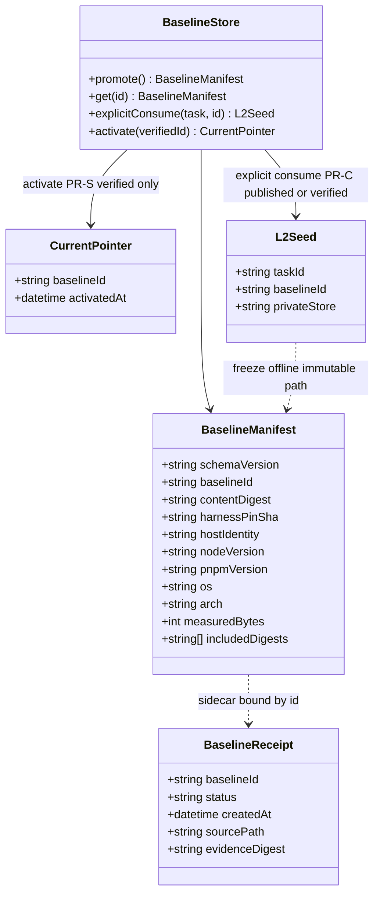
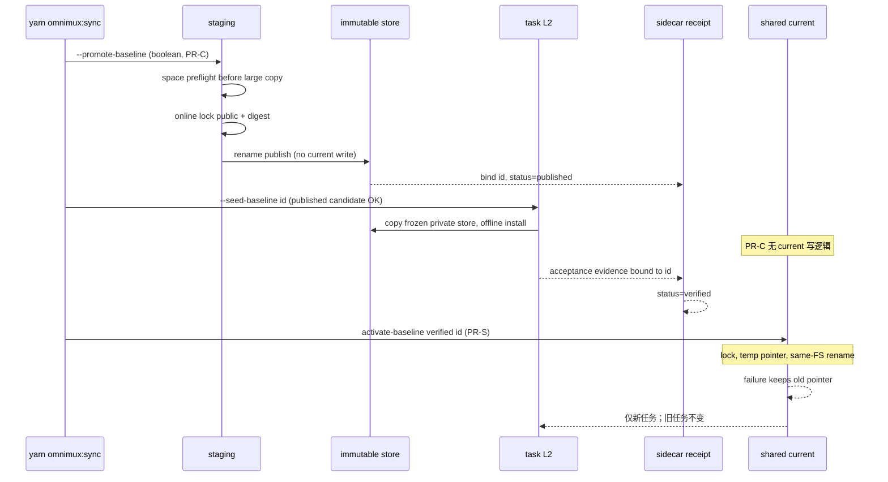

# 稳定基线迁移：设计与验收规格（PR-D）

> **SUPERSEDED — 2026-09-09 / #864：** 本规格的 L2 生命周期与专属 baseline D/C/S 创建、消费、激活、双 Host/离线重建门槛全部退役，不再作为实施或合入要求。现行流程见 [dev-pipeline](../contracts/dev-pipeline.md)、[plugin-qa](../contracts/plugin-qa.md) 和 [plugin-git-pr](../contracts/plugin-git-pr.md)：worktree 自动化/静态与独立评审 → required CI/MQ → main → 按需 Dev 45120 验收。下文仅保留原设计与当时状态，不重写 #848 或历史 QA/evidence，不将未通过改成通过。

状态：**文档合同已批准；实现未落地。** 本文是 Issue [#835](https://github.com/omnimux-ai/omnimux-dsh/issues/835)（父 [#834](https://github.com/omnimux-ai/omnimux-dsh/issues/834)）的设计与验收真源，并补齐已批准计划。Living 政策以 [dev-pipeline](../contracts/dev-pipeline.md)、[ops-entry](../contracts/ops-entry.md)、[plugin-qa](../contracts/plugin-qa.md)、[plugin-git-pr](../contracts/plugin-git-pr.md) 为准。本文**不**证明 named baseline 已是默认种子。

**物理边界：**真实 Host **无法启动禁止切 S**。在 PR-S 代码未合入、或切 S 仍被本顺序禁止时，真实 Host 没有 `--activate-baseline`、不会把 `current` 指到新 id、也不会删除隐式 fallback。这是阶段与写集边界，不是脚本去读聊天、判断人类是否授权 S。

**授权分工（已批准全流程，不新增 S 二次人工授权）：**

| 角色 | 核什么 | 不核什么 |
|---|---|---|
| **人类** | 已批准本迁移全序列（D→C→S） | 不在 S 前再做一次人工授权门 |
| **Agent** | 流程是否处于允许的阶段；合入证据（D `MERGED`、C 适用验证、正式候选验收）是否齐全 | 不把核对转交给脚本读会话 |
| **脚本（拟实现）** | 基线**兼容性**、**完整性**、以及**绑定该内容摘要**的验收证据 sidecar | 不假设能读聊天授权；不新建权限平台；不加与本要求无关的门禁 |

pin / API 与 baseline 记录不匹配时停止，另走 RC 授权，不得为通过检查而改 pin 或外仓。

## 0. 阶段诚实表（当前 / 迁移 / 目标）

| 阶段 | 何时 | L2 默认种子 | shared `current` | 隐式 Dev / Prod / `~/.dsh` fallback | 可对 Agent 声称 |
|---|---|---|---|---|---|
| **当前** | PR-D 合入后、PR-C 合入前 | 仍为 `OMNIMUX_L2_SEED_PROFILE` → `~/.omnimux-dev/profiles/omnimux` → `~/.omnimux/profiles/omnimux` → `$DSH_HOME`/`~/.dsh`（见 `scripts/dev-env.sh`） | 不存在 named baseline current | **仍存在**（实现如此） | 仅文档与合同已更新 |
| **迁移** | PR-C 合入后、PR-S 前 | **旧默认保留**，并显式标「迁移期」；可通过显式消费命名 baseline（含 published 候选，仅隔离验收） | **禁止写入**；C 消费走固定不可变路径/ID，无共享 current 写逻辑 | **仍存在**，不得删除 | 可 opt-in 创建/显式消费；**未**切全员默认 |
| **目标** | PR-S 合入且激活成功后 | 仅已激活的命名不可变 baseline | 只影响**新**任务；仅 **verified** id 可 `current` 激活/回滚 | **删除**；禁止静默回落 | 默认已切换；回滚只能指向 verified baseline |

禁止把迁移期写成目标态，禁止把拟实现旗标写成已实现命令。

## 1. 问题与目标

并行任务从共享 Dev / 隐式 `~/.dsh` 克隆种子，导致身份漂移、离线不可重建、viewer 外部 `file:` 与凭据/settings 混入运行闭包。目标是：受管、命名、不可变、可核验、可回滚的运行闭包；创建与激活分离；旧任务引用不被 GC。

非目标（本迁移全序列）：升级 [harness-pin](../harness-pin.md)；修改或删除外仓 viewer；把用户 settings / 凭据 / `node_modules` / App 包打进 baseline；Prod 发布；后台删除旧 baseline；自动回落到隐式 Dev；新建权限/授权平台；为 S 增加二次人工授权门。

## 2. PR 顺序（硬门禁）

```text
PR-D（本文档）──合入──► PR-C 实施（创建 + 显式消费，不写 current）
                               │
                               ▼
                     合入前：隔离双真实 Host 等适用验证
                               │
                               ▼
                          PR-C 合入
                               │
                               ▼
                     正式候选 published → 隔离显式消费验收 → verified
                               │
                               ▼
                          PR-S（删隐式 fallback 并 activate）
```

| PR | 写集 | 合入前提 | 禁止 |
|---|---|---|---|
| **PR-D** | 仅文档 / 索引 / 薄 AGENTS / skill 归属句 | 独立 QA；纯文档门禁 | 脚本实现；声称已切换；push 前冒充已交付 |
| **PR-C** | 命名不可变 baseline **创建**与**显式消费** | **实施前** PR-D 已 `state=MERGED`；**合入前**完成隔离双真实 Host 并发、离线重建、ego smoke 等**适用**验证 | 写共享 `current`；切全员默认；删 Dev/Prod/`~/.dsh` fallback；把消费接到 current 写路径 |
| **PR-S** | 删除隐式 fallback；`activate-baseline` 成为新任务默认 | PR-C 已合入；C 后正式候选完成隔离验收并标记 verified | 禁止切 S 时于真实 Host 执行 activate / 删 fallback；激活失败自动 Dev；未 verified 的 id 写入 `current` |

**C 实施前 D 必须已 merged。** C 合入前做隔离真实双 Host 等适用验证。C 合入后才产生正式候选；候选验收通过后才进入 S。不得把「C 已能创建」写成「已可 activate」。

真实 Host **无法启动禁止切 S**：切 S 被本表禁止时，真实 Host 不能执行 activate / 删 fallback；待 S 代码合入且前提满足后，activate 才存在。Agent 核对本表阶段，不要求脚本读取人类聊天授权。

## 3. Baseline 身份与闭包

### 3.1 包含（受管完整运行闭包）

| 成员 | 记录内容 | 不由此推断 |
|---|---|---|
| 受管 kit / plugin snapshots | `.materialize-snapshots/plugins/` 规范化文件字节与 POSIX 必要 mode | 未纳入的用户文件 |
| pnpm 锁 | 可重定位 lock 的节点、边、integrity | 共享 store 布局 |
| 白名单解析 patch | 已批准的 Cordis/配置 patch 内容摘要（whitelist 内） | 任意本地 hack |
| manifest 内容摘要 | 每个受管包 name/version 与 payload digest | `node_modules` 目录树 |
| Host 实际身份 | 运行 Host 包版本、真实路径、启动闭包指纹 | 文档里的 pin 表单独等于正在跑的 App |
| 工具链身份 | Node 版本、pnpm 版本（本仓 `packageManager`）、OS、arch | 未测量的容量数字 |

### 3.2 排除

用户 settings、凭据与 token、profile `node_modules`、Desktop App / `app.asar` / `Info.plist`。凭据类业务测试只走现有明确授权注入（`omnimux tokens exec` 或进程环境），**不**进 baseline。

**不进入身份哈希：** `createdAt`、来源路径、验收报告。这些可写入 sidecar / 元数据，但改变它们不得改变 `baselineId`。

### 3.3 不可变命名（同内容同 ID）

`baselineId` **就是**完整内容哈希，不是时间戳前缀。哈希输入为规范化后的：纳入闭包的文件字节、路径模式、工具版本、Host 版本。同一规范化内容必须得到同一 id；新内容必须新 id。

禁止 `omnimux-baseline-<utc>-<digest12>` 这类把时刻编进 id 的方案：它会破坏同内容同 ID。

同一 id 的产物字节与身份元数据**不得原地改写**。验证结果写入**独立 sidecar receipt**，receipt 绑定该 id（记录验证状态、证据路径摘要、测量字节），不修改产物本身。`current` 是指向 id 的指针，不是内容别名。

### 3.4 状态：published 与 verified

| 状态 | 含义 | 允许 | 禁止 |
|---|---|---|---|
| **published**（含正式候选） | 不可变产物已 rename 发布，id 已稳定 | **隔离**显式消费，用于验收 | 写共享 `current`；作为默认种子；回滚目标 |
| **verified** | sidecar 已绑定该 id 的适用验收证据（双 Host / 离线 / ego 等已声明项） | `current` 激活与回滚；新任务默认（仅 PR-S 后） | 未绑证据却声称 verified |

只准 verified 消费会造成「必须先 verified 才能验收、又必须先消费才能 verified」的循环。因此：**候选 published 允许隔离显式消费用以验收**；**只有 verified 可 current 激活/回滚**。

## 4. 准备 / 发布 / 消费

### 4.1 准备（在线锁定公开源）

仅在 **promote** 的候选阶段允许对**已锁定公开 registry** 做受控获取，写入**任务私有** store。需要凭据、未知 registry、git/任意 URL、未受管本地依赖时失败。禁止把共享 pnpm store 当作可写缓存。

**容量预检必须在大复制之前：**按本次实测闭包字节估算 staging + 私有 store + 余量；不足则失败，不得先 copy 再报 ENOSPC。文档与 receipt **不得编造** MiB 数字。

### 4.2 Staging 发布（创建 ≠ 激活）

1. 冻结输入与前态 digest（受管 source、lock、whitelist patch、Host/工具链身份）。
2. **容量预检**（见 4.1）；通过后才进入大复制。
3. 写入 staging 目录；核验包含/排除、digest、锁一致性。
4. 通过后 rename 到不可变 baseline 存储；返回内容哈希 id；产物此后只读。
5. **不**写共享 `current`（PR-C）。不在产物内改验证字段。
6. 验证 receipt 作为 sidecar 创建/更新，绑定该 id。

### 4.3 消费（offline frozen；无 current 写逻辑）

显式消费（PR-C）：任务 L2 指定 `baselineId`（拟实现环境变量或 `--seed-baseline=<id>`，见 [ops-entry](../contracts/ops-entry.md)）。消费**直接**固定到该不可变路径/ID，**无**共享 current 读-改-写。

- published（含候选）与 verified 均可被**隔离**显式消费；默认种子与 `current` 仍不受影响。
- 私有 store **copy** 已冻结包并核验 integrity；`pnpm install --frozen-lockfile --offline`。
- `--package-import-method=copy`（或等价 CoW **文件克隆**，同一卷且实现可证独立 inode/写隔离）。
- **禁止**共享 hardlink 写穿：任务可写树不得与共享 Dev/Prod/store 共用可写 inode。
- 不得复制 seed `node_modules`、`.npmrc`、指向 Dev/Prod 的 source 链接。
- `current` 只影响**之后新建**的任务；已存在任务继续引用其创建时的 baseline id。
- **无后台 GC**。引用保护：仍被任务/receipt 指向的 baseline 不得删。

### 4.4 回滚与激活的物理边界

- **激活 / 回滚 `current`：**只允许 **verified** id。禁止「失败则自动用 Dev」。回滚不是 PR-S 的隐式通道。兼容性失败保持旧指针，不 Dev 回退。
- **C 禁 current：**创建与显式消费代码路径不得包含共享 current 的写逻辑；没有 current 文件、临时 current、或「先写再清」。
- **S 原子激活：**复用既有稳定 flock / 锁；写 temp 指针后在**同一文件系统** `rename` 到 `current`。失败则旧指针保持。旧任务引用不变。不宣称跨卷瞬时交换。不引入第二套指针协议。

## 5. 拟实现运维旗标（非本 PR 代码）

沿既有 `yarn omnimux:sync` 旗标，不另建 CLI。**下列命令在 PR-D 合入后仍不存在于脚本。**

**Promote 只取一种定义：布尔旗标。** 不使用 `--promote-baseline=<id-or-new>`，避免与「新内容必新 id（内容哈希）」冲突。

| 旗标 | 计划 PR | 行为 |
|---|---|---|
| `--promote-baseline`（布尔，无值） | C | 从授权目标的受管闭包**创建**新的不可变 baseline；id 由内容哈希决定；不写 `current`；默认可对 Dev 协调窗口 |
| 显式消费（环境或等价 `--seed-baseline=<id>`） | C | 仅该 L2 任务按固定 id/路径 offline frozen 消费；允许 published 候选（隔离验收）与 verified |
| `--activate-baseline=<id>` | S | 仅 verified id；将 `current` 经锁+temp+同 FS rename 指向该 id（只影响新任务）；并删除隐式 fallback |

与 `--managed-tarball`、命名插件、`--prod`/`--all` 混用必须失败。真实 Host 在禁止切 S 时没有可成功的 activate 路径；脚本成功条件是兼容性、完整性与绑定该摘要的 sidecar 证据，不是聊天授权。

## 6. 数据与调用（实现对照，非本轮代码）



`baselineId` 等于 `contentDigest`（完整内容哈希）。`createdAt` / `sourcePath` / 验收报告只在 sidecar，不参与 id。



后续实现文件（**不是 PR-D 写集**）：`scripts/sync-to-app.sh`、`scripts/sync-stable.sh`、`scripts/dev-env.sh`、内部 baseline 模块与测试、[ops-entry](../contracts/ops-entry.md) 去掉「拟实现」标记。不得新增第二套 deploy CLI。复用 #778 私有 store / frozen-offline / copy 隔离与锁+rename，不把 tarball 纳管扩成通用发行器。

## 7. QA 身份与证据

变更面证据仍按 [plugin-qa](../contracts/plugin-qa.md)。本规格追加：

| 场景 | 身份要求 | 不得冒充 |
|---|---|---|
| PR-D | 文档门禁；无 L2/App | 运行时已切换 |
| PR-C 创建 | receipt sidecar：id=内容哈希、digest、measuredBytes、Host/pin/Node/pnpm/OS/arch；产物未原地改 | 共享 current 已改；id 含时间戳 |
| PR-C 显式消费 | L2 `.l2-dev.env` 记录 baselineId；SOURCE=当前 worktree；最多一个 in-progress plugin link；消费固定 id/路径 | 经 current 指针消费；多插件集成 |
| C 合入前适用验证 | 隔离双真实 Host 并发、离线重建、ego smoke（按变更面适用） | 单 Host 起停两次；未隔离的共享 Dev |
| 正式候选验收 | published 候选被隔离显式消费；sidecar 绑 id 后才 verified | 未消费就 verified；verified 才能消费的循环 |
| 双真实 Host 并发 | 两个独立任务、两个端口、两个私有 store、互不写穿 | 单 Host 起停两次 |
| 离线重建 | 断网 + frozen + 与 digest 一致 | 在线偶然成功 |
| ego smoke | 适用 Stage 的 ego-browser + `verify:live`；同 run 身份 | HTTP 200 / 单测 |
| PR-S | 禁止切 S 时真实 Host 无成功 activate；verified 才可 current；失败旧指针保持 | 脚本读取聊天授权；自动 Dev 回滚 |

独立测试不是集成测试。多插件仍单 link。

## 8. 验收矩阵（PR-D 本 Issue）

| ID | 可观察通过条件 |
|---|---|
| D01 | `AGENTS.md` 只保留薄义务与指针，不复制本规格正文；MVP 段未改 |
| D02 | `dev-pipeline.md` 含当前/迁移/目标、包含/排除、创建≠激活、current 只影响新任务、无 GC、禁止自动 Dev、C 禁 current 写、S 原子 rename |
| D03 | `plugin-qa.md` 含 baseline 身份行；published 可隔离消费；仅 verified 可 current；不把目标态写成当前 |
| D04 | `ops-entry.md` 列出布尔 `--promote-baseline`、显式消费、`--activate-baseline`，均标拟实现，沿 sync 旗标；无 id-or-new |
| D05 | `plugin-git-pr.md` 写明 D→C→S；C 实施前 D merged；C 合入前隔离双 Host 等适用验证；C 后正式候选验收才 S；真实 Host 无法启动禁止切 S；不新增 S 二次人工授权 |
| D06 | `harness-pin.md` 只声明身份被 baseline 记录，本次不升级 pin |
| D07 | repo-workflow skill 要求先分辨 skill 真源；仅仓内可改 |
| D08 | `docs/README.md` 与 `docs/contracts/README.md` 收录 |
| D09 | #778 三份 spec 仅加历史横幅；`docs/qa/issue-778-*.md` 正文未改 |
| D10 | 本文存在；id=内容哈希；sidecar；容量预检在大复制前；不编造容量数字 |
| D11 | `git diff --check` 与 `pnpm doc:lint` 在任务树实际执行 |
| D12 | 主树 dirty 未被 stash/覆盖；无 push、无 PR |
| D13 | 本文与合同不要求脚本读取聊天授权；不新增权限平台 |

PR-C / PR-S 的运行验收不在 #835 DoD 内，但合同必须已经写清，避免实现期回写成「已经是默认」或「先 verified 才能验收」。

## 9. 冲突与残留（文档必须承认）

| 项 | 当前事实 | 处理 |
|---|---|---|
| `scripts/dev-env.sh` `resolve_l2_seed_profile` | 隐式 Dev→Prod→`~/.dsh` | 保持到 PR-S；文档标当前 |
| `dev-pipeline` 曾写「不默认旧 `~/.dsh`」 | 脚本仍有第 4 候选 | 以脚本为当前运行事实，目标删除该链 |
| `pnpm doctor` | 仍可能指向 `~/.dsh` | 已有合同；本迁移不假装已修 |
| #778 三份 spec 状态句 | 历史「未合入」 | 横幅隔离；不改 QA 正文 |
| promote/activate | 脚本无旗标 | 拟实现；promote 仅为布尔 |
| baseline 字节数 | 未测 | 禁止在文档写死容量 |
| 外仓 viewer | 不得改/删 | pin/API 不匹配另授权 |
| `scripts/git-wt.sh` 兄弟目录 | 与仓内 `.worktrees/` 并存 | 本 PR-D 不改；实现任务用仓内树 |

## 10. 授权与范围

已批准：本仓文档、Issue、独立 worktree、文档门禁；本迁移全序列（D→C→S）作为**一项**任务授权，**不**在进入 S 时再要一次人类授权。未批准本阶段：实现、push、开 PR、Prod、官方/外仓源码、Host pin 升级。真实 Host 在禁止切 S 时不得被用来启动 S。
