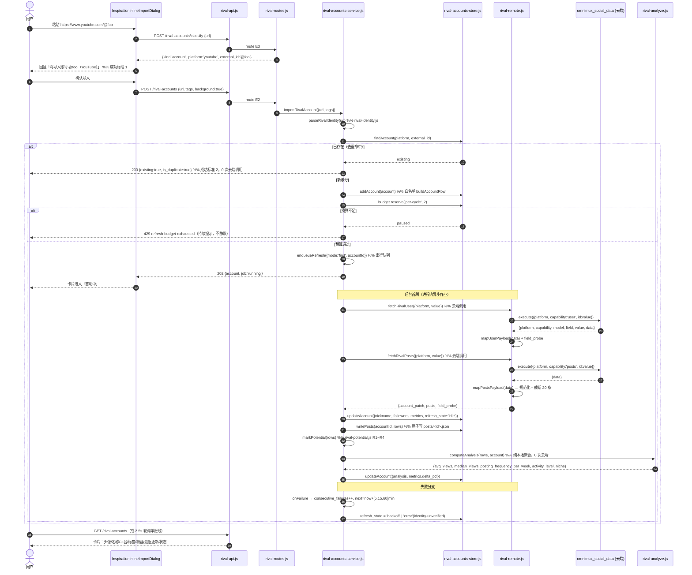
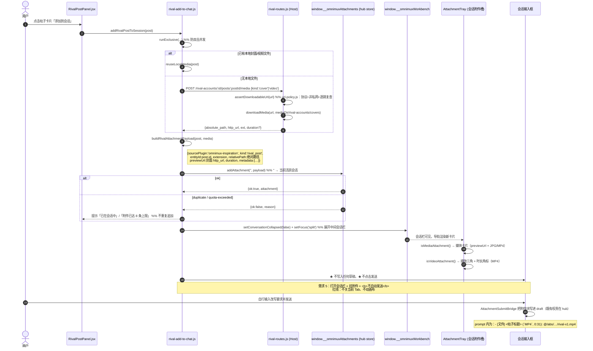
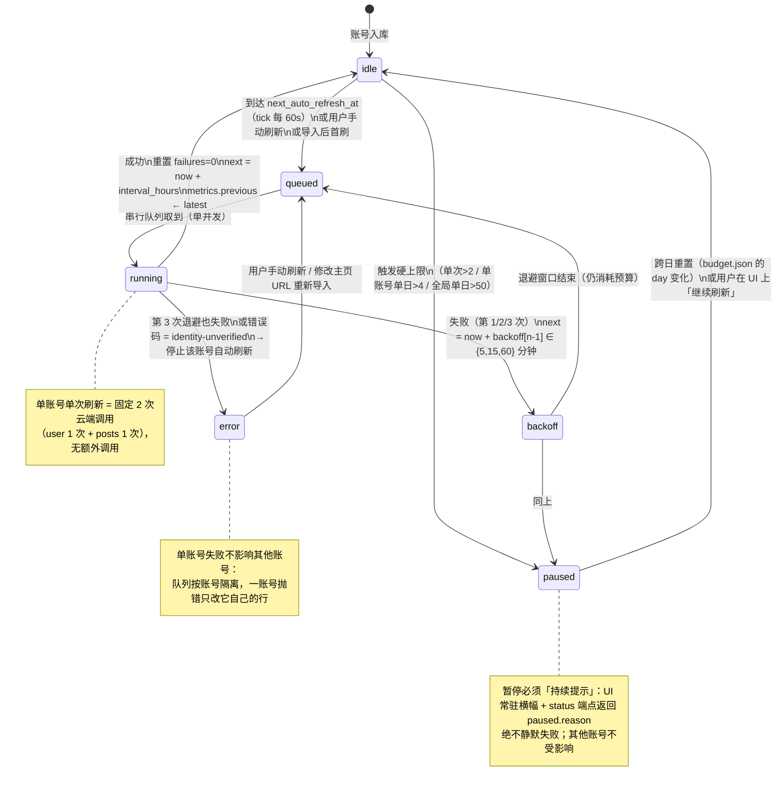
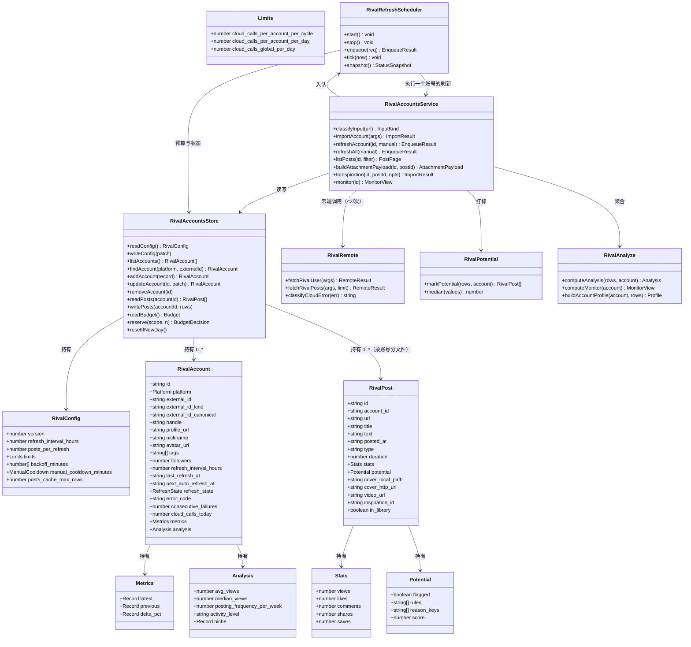
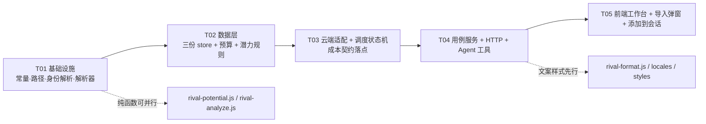

# 灵感社区 · 对标账号：系统设计 + 任务分解

> 作者：高见远（架构）｜范围：只改 `plugins/omnimux-inspiration/`｜零新 npm 依赖｜不改 hub、不扩展云端 catalog、不新增跨插件契约。
> 本文档中每条结论标注来源：**【代码】** = 已读源码核实（给 文件:行）；**【设计判断】** = 架构决策；**【待核实】** = 必须由工程师在实现时按实际返回核实。

---

## 0. 三个决策点的定案（本次设计的核心）

### 决策点 ①：会话附件 `kind: 'rival_post'` 是否可行？

**结论：可行。走新 kind `'rival_post'`。**

**代码依据：**

| 事实 | 依据 |
| --- | --- |
| `AttachmentKind` 是**封闭 TS 联合类型**（9 个成员），不含 `rival_post` | `plugins/omnimux/src/client/attachments/types.ts:5-14` |
| **但运行时不校验 `kind`**：`addAttachment` 只校验 `payload.title` 存在，`kind` 原样透传 | `plugins/omnimux/src/client/attachments/store.ts:130-177`（131 行唯一校验、160 行原样赋值） |
| `kind` 唯一参与计算处是**指纹字符串拼接**，无枚举约束 | `store.ts:50-58`（`generateFingerprint`），使用点 `store.ts:143`、`store.ts:104` |
| 组装进 prompt **按 `kind` 查标签表，未知 kind 回退 `'文件'`，绝不丢弃路径** | `prompt-assembly.ts:3-13`（`KIND_LABELS`）、`:41`（`KIND_LABELS[att.kind] || '文件'`）、`:44-50`（路径进 `@` 引用，与 kind 无关） |
| prompt 组装分支**只看 `kind` + `metadata.files`，不看 `sourcePlugin`**；`extension` 无枚举约束（只会被大写化，缺省 `'FILE'`） | `prompt-assembly.ts:32-51`、`store.ts:35-45` |
| 卡片渲染对未知 kind **优雅降级**：文件卡片图标走默认文档图标，扩展名徽标显示 `MP4`/`JPG` | `AttachmentCard.tsx:92-103`、`:169-179` |
| 媒体卡片判定：`kind==='image'/'video'` 直接命中；否则需 `previewUrl` + 扩展名在图像/视频集合内（或 kind ∈ {asset, inspiration, product}） | `media-detector.ts:54-76` |
| **视频角标（播放三角 + 时长）**：`kind==='video'` 或扩展名是视频容器，或 `kind==='inspiration' && duration` | `media-detector.ts:81-88` |
| 构建链**不做类型检查**：`scripts/build-client.mjs` 用 esbuild（`bundle:true, format:'cjs'`，无 `tsc`）；仓库 TS 门禁只覆盖 `plugins/omnimux-workflow` 的 `tsconfig.canvas.json` / `tsconfig.host.json` | `plugins/omnimux-inspiration/scripts/build-client.mjs:9-24`；`scripts/auto-qa-scan.mjs:367-395`；`find` 结果确认全仓 tsconfig 无 inspiration |
| 灵感插件已用同一"绕过类型、直接调全局 store"的既有先例（`kind:'inspiration'` 字面量直接传 `addAttachment`） | `replicate-to-chat.js:84-100`、`:159-167` |

**新 kind 的运行时表现（已逐条推演）：**

| 场景 | 结果 | 依据 |
| --- | --- | --- |
| 有视频文件（`extension:'MP4'` + `previewUrl`=封面图） | 媒体卡片 + **播放三角 + 时长角标**（因扩展名命中 `VIDEO_EXTENSIONS`） | `media-detector.ts:85-86` |
| 仅有封面图（`extension:'JPG'`） | 媒体卡片（`previewUrl` + `JPG` ∈ `IMAGE_EXTENSIONS`） | `media-detector.ts:68-74` |
| 文案帖（`extension:'TXT'`，无 previewUrl） | 文件卡片（文档图标 + `TXT` 徽标） | `AttachmentCard.tsx:102,169-179` |
| 进 prompt | `- [文件] <标题> (\`MP4\`, 0:31): @/abs/path.mp4` — 路径正确，标签回退为「文件」 | `prompt-assembly.ts:41,46-47` |

> **唯一代价（明写，不掩盖）**：prompt 里的类型标签显示为 `[文件]` 而非 `[对标帖]`，因为 `KIND_LABELS` 真源在 hub 内（`prompt-assembly.ts:3`），本任务禁改。**这是纯文案成本，不影响功能、不影响路径引用、不影响 UI**。故不需要走"复用 `kind:'inspiration'`"的兜底方案。
>
> **兜底方案（记录备用，不实施）**：若将来有人把 `kind` 变成运行时白名单，则回退为 `kind:'inspiration'`（"添加到会话"内部先执行一次转入灵感再挂附件）。代价：① 与"转成灵感"动作在指纹上与附件层不可区分（`store.ts:51-56` 的 `sourcePlugin::kind::entityId::relativePath` 无区分位）；② 语义上把"看对标帖"污染成"我已入库"；③ 需要额外写一次灵感库（多一次落盘 + 可能触发 AI 解构）。风险更高，故不作首选。
>
> **本设计额外收益**：因为 `kind` 参与指纹，`rival_post` 与 `inspiration` 在附件层天然不冲突——同一个帖子既"转成灵感"又"添加到会话"时不会互相顶掉，这正是分 kind 的架构价值。

**红线遵守**：payload 内 `sourcePlugin` 必须用已存在的 `'omnimux-inspiration'`（`types.ts:21`），不改该联合类型。`entityId` 传帖子 id（必需，指纹用），`metadata` 携带 `rival_post_id` / `rival_account_id` / `platform` / `stats` / `source_url`（供 agent 读 `@` 之外的语义）。

---

### 决策点 ②：`relativePath` 的语义与"帖子文件"落地方式

**结论（三段）：**

1. **`relativePath` 在附件层是"提示 + `@` 引用正文"，没有任何解析根** —— 它不被 read、不被上传、不被渲染；只有三处消费：卡片 `title` 属性提示（`AttachmentCard.tsx:119,167`）、扩展名推断（`store.ts:39-40`）、以及被 `formatPathReference` 转成 `@路径` 写进 prompt（`prompt-assembly.ts:18-27,46-47`）。
2. **`@路径` 是交给 DSH 会话的文件引用，`relativePath` 因此必须指向一个真实存在的文件；既可以是工作区相对路径，也可以是绝对路径** —— 既有先例把它填成**绝对路径**：`replicate-to-chat.js:92` 取 `row.local_paths.video`，而 `local_paths.video` 由 `downloader.js:287`（`join(destDir, filename)`）生成，`destDir = args.paths.videosDir`（`http-handlers.js:1166`）即 `~/.dsh/omnimux/inspirations/media/videos/`（`paths.js`）。**绝对路径是已验证可行的写法**，因为 DSH 的 `@` 引用解析绝对路径。
3. **`previewUrl` 才是渲染通道，且它必须是 Host 相对 URL**：`AttachmentTray.tsx:125` 只在 `previewUrl` 存在时给卡片 `onOpen`，`:235-238` 把 `previewUrl` 直接当 `` 用；视频点击后也只是图片预览（`AttachmentPreviewModal`），**附件槽不播视频**。媒体流端点 `streamLocalMedia` 把 URL 的 `media/<subpath>` 直接 `join(paths.mediaDir, subpath)`（`http-routes.js`），因此 `subpath` 必须是 `mediaDir` 下的真实相对路径。

**据此定案"添加到会话"的文件落地：**

| 项 | 定案 | 理由 |
| --- | --- | --- |
| 媒体目录 | `$DSH_HOME/omnimux/inspirations/rival-accounts/media/{covers,videos}/`，作为 `paths.mediaDir` 下的**真实子目录** | 复用既有 `downloadMedia` + 既有 `/omnimux/inspiration/local/media/` 流端点，URL 天然合法：`/omnimux/inspiration/local/media/rival-accounts/covers/<file>.jpg`；与灵感库媒体**物理分离但不另开端点** |
| `previewUrl` | `/omnimux/inspiration/local/media/rival-accounts/covers/<file>.jpg`（`mediaDir` 相对） | **绝不用绝对路径拼 URL**（本插件刚修的 Bug）；`api.js:380` 注释明确 `local_paths.video` 存绝对路径是给文件系统用的，不能拿来拼 URL |
| 默认下载 | **只下封面**（每帖 ≤1 次 `downloadMedia`），视频**按需**（用户在帖子上点"下载视频后添加到会话"） | 视频体积大、云端帖子动辄几十 MB；P0 目标（看帖子、挑潜力、进会话改写）不依赖本地视频文件 |
| 有视频直链时 | `relativePath = <绝对视频路径>`，`extension='MP4'`，`duration` 有则带上 → 媒体卡片 + 播放角标 | 与决策点 ① 的推演一致 |
| 无视频直链时（降级） | `relativePath = <绝对封面路径>`，`extension='JPG'`，`metadata.post_url` / `metadata.text` 兜文案 → `@` 给了封面图，文案在 metadata + 会话里可由 agent 用 `inspiration_rival_post` 取回 | 降级后**仍然 100% 可操作**：封面在画布可见、文案可取、原帖链接在 metadata |
| 两者都没有 | 不挂附件，直接返回 `error:'no-media'`，UI 提示"该帖无可用媒体，请改用「转成灵感」" | 不允许产生"指向不存在文件"的 `@` 引用 |
| 并发/去重 | 1) 复用 `runExclusive` 单飞锁（`replicate-to-chat.js:24-35`）防止双击产生两次下载；2) 媒体文件按 `rival-<hash(post_id)>.jpg` 命名，**同帖重复下载命中同名文件直接复用**（先 `existsSync`）；3) 附件 store 指纹去重 `sourcePlugin::kind::entityId::relativePath`（`store.ts:50-58`）→ 同帖二次点击返回 `{ok:false, reason:'duplicate'}`；4) 会话满 8 条返回 `reason:'quota-exceeded'`（`store.ts:6,138-140`）→ UI 显示 `attachFull` 文案（沿用 `replicate-to-chat.js:245-254` 的错误映射，含 `attachFailed` / `draftProtected`） | 指纹四段里 `entityId` + `relativePath` 都由帖子 id 派生，故**去重是稳定的**，不随点击次数漂移 |

**"添加到会话"用 `sessionId=''`（当前活跃会话）而不是点"新会话"**：依据 `plugins/omnimux-assets/src/client/add-to-chat.js:216` 的既有做法 —— `addAttachment('', payload)`，`store.ts:134` 会把它解析为当前活跃会话；同时 `:201-209` 的 `setConversationCollapsed(false)` + `setFocus('split')` 即"打开会话栏"。这条路径与"一键复刻"（必须新建会话）语义不同且**不能混用**：PRD 要求的是把帖子挂到当前会话继续改写，不是每次开新会话。

---

### 决策点 ③：YouTube `@handle` 能否直接当 `channel_id`？

**结论：代码层面无法证实云端接受 `@handle`；设计接受 `@handle` 导入并走显式降级路径（`external_id_kind='handle-unverified'`），首刷成功即落定、失败则引导改传 `/channel/UC...`。**

**代码依据：**

| 事实 | 依据 |
| --- | --- |
| `youtube/user` 与 `youtube/posts` 的业务字段都是 `channel_id` | `social-data.js:45-46`（`SOCIAL_DATA_BUSINESS_FIELDS`） |
| 业务值解析：profile/channel 类字段走**通用末行** `id \|\| query \|\| url`，**不做任何 youtube 专属提取或校验** | `social-data.js:113-114` |
| 只有 `youtube/video` 有专属 ID 提取（`extractYouTubeVideoId`），`user`/`posts` 没有 | `social-data.js:109-111`、`extractYouTubeVideoId` 定义在 `:142-160` |
| 值被**原样**塞进请求体的 `[field]` 字段（`channel_id: <value>`） | `social-data.js:174-192`（`fetchSocialData`） |
| 已有两条硬提示："值为 `bug`/空时抛 `url, id, or query is required …`"、"值原样传参不做归一" | `social-data.js:75-80`、`:114` |
| 契约层面值来源被明确限定为 `url` / `id` / `query`（tool schema 层） | `social-data.js:31-34` 注释 + `resolveSocialDataModel` 的 `args` 形状 |

→ **代码只说"你给什么就传什么"，不说云端认不认 `@handle`。** 且按本任务约束**不允许探测真实 API**，因此这是 **【待核实】**：工程师在首次真实刷新时用 `field_probe` 记录云端对该值的接受/拒绝，并把结论回填到本文档与 `rival-remote.js` 的注释里。

**降级路径设计（P0 必须实现，不依赖核实结果）：**

1. 导入时解析主页 URL：`youtube.com/@handle` → `identityValue='@handle'`, `external_id_kind='handle-unverified'`；`youtube.com/channel/UC...` → `identityValue='UC...'`, `external_id_kind='channel_id'`；`youtube.com/c/<name>`、`/user/<name>` → 同样标 `handle-unverified`。
2. 账号先落库（**导入永不因云端失败而丢记录**），状态 `refresh_state='idle'`，`identity_kind` 如上。
3. 首刷：
   - `user` **成功** → `external_id_kind` 改为 `'handle-verified'`；若云端返回体里能容错取到 `channel_id`（形如 `UC` + 22 字符），**同时写入 `external_id_canonical`**（不覆盖用户输入的 `external_id`），后续刷新优先用 canonical。
   - `user` **失败**（云端拒绝 `@handle`）→ `refresh_state='error'`、`error_code='identity-unverified'`，UI 在账号卡片上给出**明确可执行提示**：`rivalAccounts.identity.handleUnverifiedHint` = 「YouTube 频道请改用 `https://www.youtube.com/channel/UC…` 形式重新导入」。同时该账号**不再自动刷新**（退避规则的终态）。
4. 帖子 `posts` 的调用值：`external_id_canonical || external_id`（同一策略），保证一旦落定 canonical，后续刷新自动收敛。

**为什么这个降级是安全且必要的**：若云端不认 `@handle`，失败表现为 `user`+`posts` 两次调用都失败——那正好是"≤2 次调用"上限内的最坏情况，不会超预算；而账号记录仍在库里，用户可以按提示改传 `/channel/UC…` 重新导入（去重键在 `external_id` 上，`@handle` 与 `UC…` 是**不同键**，不会互相阻塞，但 UI 要提示"疑似同频道"——见 §9 待核实第 4 条）。

---

## 1. 实现方案总览

### 1.1 技术难点与选型

| 难点 | 选型 | 理由 |
| --- | --- | --- |
| 云端 `user`/`posts` 返回结构未定 | **容错映射器 + 字段探针**：多路径候选（基于 TikHub 风格命名习惯列举候选），缺失即 `null` 绝不臆造，并把"命中了哪条路径/是否 miss"写入 `field_probe` | 约束禁止探测真实 API，也禁止写死未验证字段；`field_probe` 让工程师第一次真实刷新就能拿到结论，而不是猜 |
| 成本可控 | 刷新路径**不经过** `createSocialFetcher`（它内含免费兜底），而是直连 `omnimux_social_data` 的 `execute`；单账号刷新**只发 2 次**（`user` 1 + `posts` 1），由常量表 + 预算账本 + 测试三重保险 | 兜底走得越多越不可控；把"云端调用次数"变成可断言的函数返回值（见 §10.2） |
| 调度与退避 | 进程内状态机 + 60s tick 扫描 + 串行队列 + 每日预算账本 | 与既有"进程内异步作业 + 前端轮询"范式同构（`http-handlers.js:28,41,757-763`），不引入外部依赖 |
| 帖子缓存（高频时序） | **按账号分文件** `posts/<account_id>.json`，temp+rename 原子写 | 避免单文件热点；沿用 `local-store.js:278-283` 的原子写范式 |
| 附件挂载 | 复用 `window.__omnimuxAttachments` + 新 `kind:'rival_post'` + 空 sessionId（当前会话） | 见决策点 ①② |
| 国际化/UI | 复用 `dsh-ui-kit`（Tabs/Button/ModalDialog/InputField/Divider）+ 现有 `styles.js`（追加 `.omnimux-rival-*` 段） | 零新依赖；UI01~UI10 门禁（无 Emoji、无裸色、字号白名单 `[9,10,11,12,13,14,15,16,18,20,24,28,32]`、Stage 页头必须用 `PageHeader`） |

**架构模式**：分层 + 端口/适配器（Ports & Adapters）。Host 侧 `service` 是纯逻辑（依赖全注入，可离线测试），`http` 只做协议适配，`client` 只做展示与编排。

### 1.2 模块依赖方向（单向，无环）

```
                     ┌───────────────────────── client (browser) ─────────────────────────┐
                     │ InspirationSection.jsx (tab 挂载)                                   │
                     │   └─ RivalAccountsPanel.jsx ──┬─ RivalAccountList.jsx               │
                     │                               └─ RivalPostPanel.jsx                 │
                     │        ▲                ▲            ▲                              │
                     │        │                │            │                              │
                     │  rival-api.js     rival-client-store.js  rival-add-to-chat.js        │
                     │        │                                 │                          │
                     │  feed-helpers/url-policy(复用)      window.__omnimuxAttachments       │
                     └────────┼─────────────────────────────────┼──────────────────────────┘
                              │ fetch /omnimux/inspiration/local/rival-accounts… │ @ref
                     ┌────────▼─────────────────────────────────▼──────────────────────────┐
                     │ index.js (Host 装配)                                                 │
                     │   ├─ rival-paths.js  ← 目录/文件路径（复用 resolveInspirationPaths）  │
                     │   ├─ rival-accounts-store.js   账号库 + 帖子缓存 + 配置（原子写）      │
                     │   ├─ rival-remote.js   云端容错映射（唯一出网点）                      │
                     │   ├─ rival-accounts-service.js  导入/去重/首刷/预算门/工具编排         │
                     │   ├─ rival-refresh.js  调度状态机（tick/退避/暂停/串行）               │
                     │   ├─ rival-potential.js 规则打分（纯函数）                            │
                     │   ├─ rival-analyze.js  本地聚合 + 首屏画像 + 数据监控                 │
                     │   ├─ rival-add-to-chat.js  帖子→附件 payload                          │
                     │   └─ rival-routes.js   HTTP 端点表                                    │
                     └──────────────────────────────────────────────────────────────────────┘
                              │ 复用（只读，不改）
        ┌─────────────────────┼──────────────────────┬───────────────────────┬─────────────┐
        ▼                     ▼                      ▼                       ▼             ▼
  local-store.js        downloader.js          url-policy.js          url-normalizer.js  locales.js
  （灵感库，不动）      （downloadMedia）      （公网/私网策略）      （平台识别/规范化） （i18n 真源）
```

**依赖规则（工程约束，写进代码注释）**：
- 只允许 `rival-* → 既有同插件模块`；**禁止** `rival-* → plugins/omnimux/src/**`（hub 内部）与任何兄弟插件内部。
- `rival-potential.js` / `rival-analyze.js` / `rival-parsers.js` 必须是**纯函数模块**（不 import fs / fetch），这样它们能被单测直接穷举。
- `rival-routes.js` 不 import `rival-refresh.js` 的实现细节，只通过 service 暴露的 `enqueueRefresh({ mode, accountId })` 调用。

---

## 2. 文件列表

### 2.1 新建（`plugins/omnimux-inspiration/` 下，均为相对路径）

| # | 文件 | 职责 | 层 |
| --- | --- | --- | --- |
| N01 | `src/rival/constants.js` | **所有阈值/上限/退避序列/候选字段名/错误码集中处**（唯一真源） | 共享 |
| N02 | `src/rival/rival-paths.js` | 目录与文件路径解析（复用 `resolveInspirationPaths()`） | Host |
| N03 | `src/rival/rival-parsers.js` | 主页 URL 分类与身份解析（四平台）+ 帖子规范化 + 容错字段提取 + `field_probe`（纯函数） | Host |
| N04 | `src/rival/rival-identity.js` | 从主页 URL 解析 `{platform, external_id, external_id_kind, profile_url, handle}`；含 `detectInputKind`（内容 vs 账号） | Host/Client 共享（无副作用） |
| N05 | `src/rival/rival-accounts-store.js` | 账号库 / 帖子缓存 / 刷新配置 / 预算账本，原子写 + 串行化 | Host |
| N06 | `src/rival/rival-potential.js` | R1~R4 规则打分（纯函数）+ 中位数/均播工具 | Host |
| N07 | `src/rival/rival-analyze.js` | 本地聚合（均播/频率/活跃度/主赛道）+ 数据监控（最新值 ±X%）+ 首屏账号画像 | Host |
| N08 | `src/rival/rival-remote.js` | 云端调用唯一出口：`fetchRivalUser` / `fetchRivalPosts`，容错映射、2 次上限、错误分类 | Host |
| N09 | `src/rival/rival-refresh.js` | 刷新调度状态机（tick、串行队列、退避、暂停、预算门） | Host |
| N10 | `src/rival/rival-accounts-service.js` | 用例编排：导入去重、首刷、刷新全部、帖子读取、转灵感、附加到会话 payload | Host |
| N11 | `src/rival/rival-routes.js` | HTTP 端点表 + 请求/响应形状 + 错误码映射 | Host |
| N12 | `src/rival/rival-agent-tools.js` | 6 个 Agent 工具注册（schema + execute + 错误语义） | Host |
| N13 | `src/client/rival-api.js` | 浏览器 HTTP 封装（复用 `inspirationRequest` + `quotaGuard`/`authGuard`） | Client |
| N14 | `src/client/rival-client-store.js` | 前端状态：选中账号、帖子缓存、轮询单账号刷新、乐观更新 | Client |
| N15 | `src/client/rival-add-to-chat.js` | 「添加到会话」编排：媒体落地 → payload → `addAttachment('')` → reveal 会话栏 | Client |
| N16 | `src/client/rival-format.js` | 展示格式化（数字缩写、相对时间、状态文案、指标 ±X%） | Client |
| N17 | `src/client/RivalAccountList.jsx` | 左栏：账号卡片列表 + 导入/刷新工具条 | Client UI |
| N18 | `src/client/RivalPostPanel.jsx` | 右栏：帖子流 + 潜力筛选 + 每帖动作 | Client UI |
| N19 | `src/client/RivalAccountsPanel.jsx` | 双栏工作台容器（挂 tab） | Client UI |
| N20 | `src/client/RivalImportDialog.jsx` | 导入弹窗（账号/内容两模式 + 回显 "将导入账号 @xxx（平台）"） | Client UI |

### 2.2 新建（测试）

| # | 文件 | 覆盖 |
| --- | --- | --- |
| N21 | `src/rival/rival-parsers.test.js` | 四平台主页 URL 分类、容错字段提取、缺失不臆造 |
| N22 | `src/rival/rival-accounts-store.test.js` | 原子写、去重、帖子裁剪、预算跨日重置 |
| N23 | `src/rival/rival-refresh.test.js` | **成本契约（≤2 调用）**、退避序列、暂停、串行、隔离 |
| N24 | `src/rival/rival-potential.test.js` | R1~R4 边界 |
| N25 | `src/rival/rival-analyze.test.js` | 均播/频率/主赛道/±X%/首次基线 |
| N26 | `src/rival/rival-routes.test.js` | 端点表、错误码、去重 409、预算 429 |
| N27 | `src/rival/rival-agent-tools.test.js` | 6 个工具 schema + 返回结构 + 错误语义 |
| N28 | `src/client/rival-add-to-chat.test.js` | payload 形状、指纹稳定、不关 Tab/不动画布/不自动发送 |

### 2.3 修改

| # | 文件 | 改动 |
| --- | --- | --- |
| M01 | `src/index.js` | 装配 rival 模块（service/routes/tool）；`INSPIRATION_TOOL_NAMES` 追加 6 个工具名；媒体流端点下派 |
| M02 | `src/client/use-inspiration-feed.js` | tab 联合值加 `'rivals'`（默认仍 `'all'`），不改既有分支 |
| M03 | `src/client/InspirationSection.jsx` | Tabs 增加第 4 项 `{ id:'rivals', label:t('tab.rivals') }`，排名在 `public` 之后；`tab==='rivals'` 时渲染 `RivalAccountsPanel` 并隐藏灵感库工具栏 |
| M04 | `src/client/InspirationInlineImportDialog.jsx` | 接入 `detectInputKind`：账号 URL → 调用 rival 导入端点 → 回显「将导入账号 @xxx（平台）」；内容 URL → 原流程不变 |
| M05 | `src/client/locales.js` | zh/en 新增 `tab.rivals`、`rivalAccounts.*` 文案键 |
| M06 | `src/client/styles.js` | 追加 `.omnimux-rival-*` 样式段（消费 `--dsw-*`，字号走白名单） |
| M07 | `package.json` | ① `files` 追加 `"src/rival"`、`"src/client/rival-*.js"` 等；② `test` glob 改为覆盖 `src/rival/*.test.js` |
| M08 | `dsh.manifest.json` | `capabilities.tools` 追加 6 个工具（与 `INSPIRATION_TOOL_NAMES` 同源）；`storageDomains` 补注释性说明（同域嵌套，可不改值） |

> 说明：`src/rival/` 是普通子目录（不是新插件），无需新 manifest、无需新 pipeline 行。

---

## 3. 数据结构（schema / 默认值 / 存储位置）

### 3.1 存储位置（全部嵌套在既有 storageDomain 内，不新增域）

```
$DSH_HOME/omnimux/inspirations/            ← 既有 storageDomain: "$DSH_HOME/omnimux/inspirations/"
├── library.json                            ← 灵感库，version:1 不变（local-store.js:281）
├── media/                                  ← 灵感库媒体（paths.mediaDir，流端点根）
│   ├── covers/ videos/ images/
│   └── rival-accounts/                     ← ★ 对标账号媒体（作为 mediaDir 的真实子目录）
│       ├── covers/<rival-<hash>.jpg>
│       ├── avatars/<rival-<hash>.jpg>
│       └── videos/<rival-<hash>.mp4>       ← 仅在用户显式"下载视频后添加"时产生
└── rival-accounts/                         ← ★ 对标账号数据
    ├── config.json                         ← 刷新参数
    ├── accounts.json                       ← 账号库（长期实体）
    ├── budget.json                         ← 预算账本
    └── posts/<account_id>.json             ← 帖子缓存（按账号分文件）
```

**与 `library.json` 的关系**：完全独立、互不读写。帖子**不自动进灵感库**；只有 `POST …/to-inspiration`（或工具 `inspiration_rival_to_inspiration`）显式触发时，才通过既有 `import-url` 链路写入 `library.json`。`library.json` 的 `version:1` 与 `buildRow` 白名单**不做任何改动**。

### 3.2 `config.json`

```jsonc
{
  "version": 1,
  "refresh_interval_hours": 24,          // 全局默认；单账号可覆盖
  "posts_per_refresh": 20,               // ★ 语义 = 单次拉取处理条数上限（不是请求参数）
  "limits": {
    "cloud_calls_per_account_per_cycle": 2,   // 硬上限：单账号单次 ≤2（1 user + 1 posts）
    "cloud_calls_per_account_per_day": 4,     // 硬上限：单账号单日 ≤4
    "cloud_calls_global_per_day": 50          // 硬上限：全局单日 ≤50
  },
  "backoff_minutes": [5, 15, 60],        // 连续失败退避；用尽后 refresh_state='error'
  "manual_cooldown_minutes": { "single": 10, "all": 30 },
  "l1_analyze_enabled": false,           // 首屏分析开关（默认开）
  "media_download": { "cover": true, "avatar": true, "video": "on-demand" },
  "posts_cache_max_rows": 500,           // 每账号帖子缓存硬上限（超出裁最旧）
  "updated_at": "2026-09-12T15:00:00.000Z"
}
```

### 3.3 `accounts.json`（账号库）

```jsonc
{
  "version": 1,
  "updated_at": "2026-09-12T15:00:00.000Z",
  "items": [{
    "id": "riv_1f2e3d4c",                  // string，`riv_` + 8 hex
    "platform": "youtube",                 // 'tiktok'|'instagram'|'youtube'|'x'
    "external_id": "@foo",                 // string，用户导入解析出的身份值
    "external_id_kind": "handle-unverified",// 'channel_id'|'handle-verified'|'handle-unverified'|'username'|'uid'
    "external_id_canonical": null,         // string|null，首刷成功后容错补全的权威 id
    "handle": "@foo",                      // string，展示用
    "profile_url": "https://www.youtube.com/@foo",
    "nickname": "",                        // 首刷 user 后回填
    "avatar_url": "",                      // 本地 HTTP URL（avatars/<file>）
    "bio": "",
    "tags": [],                            // string[]，用户标签
    "followers": null,                     // number|null，未获取到即 null（不写 0）
    "posts_count": null,
    "refresh_interval_hours": 24,          // 24|12|48|0（0 = 手动）
    "last_refresh_at": null,               // ISO|null
    "next_auto_refresh_at": null,          // ISO|null
    "last_success_at": null,
    "refresh_state": "idle",               // 'idle'|'queued'|'running'|'backoff'|'error'|'paused'
    "error_code": null,                    // 'identity-unverified'|'cloud-error'|'no-content'|null
    "error_message": null,
    "consecutive_failures": 0,
    "refresh_count": 0,
    "cloud_calls_today": 0,                // 跨日由 store 重置
    "metrics": {                           // 数据监控 P0（最新值 + 较上次 ±X%）
      "latest": { "followers": null, "posts_count": null, "avg_views_recent": 0 },
      "previous": { "followers": null, "posts_count": null, "avg_views_recent": 0 },
      "delta_pct": { "followers": null, "posts_count": null, "avg_views_recent": null }
    },
    "analysis": {                          // 首屏本地聚合（0 次额外云端调用）
      "avg_views": 0, "median_views": 0, "avg_likes": 0, "avg_comments": 0,
      "posting_frequency_per_week": 0, "activity_level": "--",   // '--'|'low'|'medium'|'high'
      "niche": { "primary": "--", "confidence": 0 },
      "computed_at": null
    },
    "created_at": "2026-09-12T14:00:00.000Z",
    "updated_at": "2026-09-12T14:00:00.000Z"
  }]
}
```

**去重键（需求 2）**：`platform + external_id`。命中即返回既有记录、**不新增行**、不重复消耗云端额度（HTTP 200 + `{ data, existing:true, is_duplicate:true }`；若请求显式带 `force:true` 且既有记录无帖子，则触发一次刷新）。

### 3.4 `posts/<account_id>.json`（帖子缓存 + 时序）

```jsonc
{
  "version": 1,
  "account_id": "riv_1f2e3d4c",
  "platform": "youtube",
  "external_id": "@foo",
  "last_refresh_at": "2026-09-12T14:00:05.000Z",
  "carry_over": 0,                         // number：上次保留、本次未回传的条数（诚实标记）
  "field_probe": {                         // ★ 供工程师核实真实返回结构，非臆造
    "views": "statistics.view_count",      // 命中的候选路径，或 null
    "likes": null, "comments": null, "shares": null,
    "duration": null, "id": "aweme_id", "posted_at": "create_time"
  },
  "items": [{
    "id": "yt_AbC123xyz",                  // string，平台内稳定 id（去重键）
    "short_code": "AbC123xyz",
    "url": "https://www.youtube.com/watch?v=AbC123xyz",
    "title": "…", "text": "…",
    "posted_at": "2026-09-11T09:00:00.000Z",
    "type": "video",                       // 'video'|'image'|'text'
    "cover_url": "https://…",              // 远端封面（展示）
    "cover_local_path": "/abs/…/media/rival-accounts/covers/rival-x1.jpg",  // 本地绝对路径（可空）
    "cover_http_url": "/omnimux/inspiration/local/media/rival-accounts/covers/rival-x1.jpg",
    "video_url": null,                     // 解析出的可下载直链（可空）
    "video_local_path": null,              // 仅按需下载后写入
    "duration": 31,                        // number 秒 | null
    "stats": { "views": 12000, "likes": 300, "comments": 12, "shares": 4, "saves": null },
    "potential": {                         // 潜力判定（P0 规则，可解释）
      "flagged": true,
      "rules": ["R1", "R3"],
      "reason_keys": ["rivalAccounts.potential.r1", "rivalAccounts.potential.r3"],
      "scored_at": "2026-09-12T14:00:05.000Z",
      "score": null                        // P1 的 AI 分（P0 恒 null）
    },
    "inspiration_id": null,                // 转成灵感后回填
    "in_library": false,
    "metrics": { "views_history": [ { "at": "2026-09-12T14:00:05.000Z", "views": 12000 } ] },
    "first_seen_at": "2026-09-12T14:00:05.000Z",
    "last_seen_at": "2026-09-12T14:00:05.000Z"
  }]
}
```

**裁剪规则**：`items.sort(posted_at desc)` 后截断到 `posts_cache_max_rows`（500）；`views_history` 每帖最多 30 点。

### 3.5 `budget.json`（预算账本）

```jsonc
{
  "version": 1,
  "day": "2026-09-12",                      // 本地日期；store 读取时跨日即重置
  "global_calls": 12,
  "global_calls_manual": 4,
  "per_account": { "riv_1f2e3d4c": { "calls": 2, "manual": 0 } },
  "paused": {                               // 触发硬上限时暂停，并持续提示（不静默失败）
    "global": false,
    "reason": null,                         // 'global-daily-cap'|'account-daily-cap'|'per-cycle-cap'|null
    "paused_at": null
  }
}
```

### 3.6 首刷时的字段白名单提醒（本仓库踩坑两次）

`rival-accounts-store.js` **必须**沿用 `buildRow(record, identity)` 的**白名单构造函数**写法（同 `local-store.js:83-121`）：新字段不进白名单就落不了盘，表现为"接口成功但卡片永远停在运行中"。本模块的三份数据各有一个 `buildAccountRow` / `buildPostRow` / `buildConfig`，**禁止 spread 透传**。

---

## 4. 接口契约

### 4.1 HTTP 端点表

前缀：`/omnimux/inspiration/local/rival-accounts`（复用既有 `webServer.register({kind:'prefix', path:'/omnimux/inspiration/local'})`，`src/index.js`）。

| # | 方法 | 路径 | 请求体 | 成功 | 错误 |
| --- | --- | --- | --- | --- | --- |
| E1 | GET | `/rival-accounts` | — | `200 { data:{ items:[Account], total, config_summary } }` | 500 |
| E2 | POST | `/rival-accounts` | `{ url, tags?:string[], refresh?:{mode,value}, background?:boolean }` | `201 { data:Account }`（新）；`200 { data:Account, existing:true, is_duplicate:true }`（重复） | 400 `unrecognized-url` / 422 `identity-unresolved` / 429 `quota-exceeded`(云端额度) / 502 `cloud-error` |
| E3 | POST | `/rival-accounts/classify` | `{ url }` | `200 { data:{ kind:'content'\|'account', platform, external_id?, hint_key? } }` | 400 `unrecognized-url` |
| E4 | GET | `/rival-accounts/:id` | — | `200 { data:{ account, analysis, monitor } }` | 404 `account-not-found` |
| E5 | PATCH | `/rival-accounts/:id` | `{ tags?, refresh_interval_hours?:24\|12\|48\|0 }` | `200 { data:Account }` | 400 `invalid-interval` / 404 |
| E6 | DELETE | `/rival-accounts/:id` | — | `200 { data:{ removed:true } }` | 404 |
| E7 | POST | `/rival-accounts/:id/refresh` | `{ manual:true }` | `202 { data:{ account_id, job:'running', cloud_calls_planned:2 } }` | 404 / 429 `manual-cooldown` / 429 `refresh-budget-exhausted`(含 `reason`) |
| E8 | POST | `/rival-accounts/refresh-all` | `{ manual:true }` | `202 { data:{ queued:[id…], skipped:[{id,reason_key}] } }` | 429 `manual-cooldown` / 429 `refresh-budget-exhausted` |
| E9 | GET | `/rival-accounts/status` | — | `200 { data:{ running:[…], queued:[…], paused, budget_used, budget_limits, next_auto_at } }` | — |
| E10 | GET | `/rival-accounts/:id/monitor` | — | `200 { data:{ latest, previous, delta_pct, first_baseline:boolean } }` | 404 |
| E11 | POST | `/rival-accounts/:id/analyze` | — | `200 { data:{ analysis } }`（纯本地聚合，0 云端调用） | 404 |
| E12 | GET | `/rival-accounts/:id/posts` | query `?only_potential=1&limit=20&sort=posted_at\|views` | `200 { data:{ items:[Post], total, carry_over, field_probe } }` | 404 |
| E13 | POST | `/rival-accounts/:id/posts/:postId/to-inspiration` | `{ tags?:string[], auto_analyze?:boolean }` | `202 { data:{ post_id, inspiration_placeholder, job:'running' } }`（复用既有 `background:true` 链路） | 404 / 409（已在库，回 `{ data:{ inspiration_id } }`） |
| E14 | GET | `/media/rival-accounts/<subpath>` | — | `200`（字节流，支持 Range） | 400 `invalid path` / 404 `file not found` |

**E14 说明**：`subpath` 是相对 `paths.mediaDir` 的真实相对路径（`http-routes.js` 的 `streamLocalMedia` 语义），实现方式是**在既有 media 分支内加一个 `rival-accounts/` 子目录判断并复用同一 `pipeMedia`**，不新建端点前缀。

**统一响应形状**：`{ data }` 成功 / `{ error, code?, reason?, detail? }` 失败（沿用既有 `sendJson` 与 `CODE_MESSAGES` 风格）。

### 4.2 Agent 工具签名

命名沿用本插件 `inspiration_*` 前缀（已注册 6 个，见 `src/index.js:235,275,289,319,342,364`），避免与 `omnimux-accounts`（自有发布账号）混淆。**每个新增工具名同时写入 `INSPIRATION_TOOL_NAMES` 与 `dsh.manifest.json` 的 `capabilities.tools`。**

```ts
inspiration_rival_accounts(
  q?: string, platform?: 'tiktok'|'instagram'|'youtube'|'x',
  refresh_state?: 'idle'|'queued'|'running'|'backoff'|'error'|'paused',
  limit?: number = 20
) → {
  count: number,
  accounts: Array<{
    id, platform, handle, nickname, followers, tags, refresh_state,
    last_refresh_at, latest_post_at, potential_post_count
  }>
}
```
```ts
inspiration_rival_posts(
  account_id?: string,          // 与 platform+handle 二选一
  platform?: string, handle?: string,
  only_potential?: boolean = false,     // ★ 需求 6 的筛选开关
  limit?: number = 20, sort?: 'posted_at'|'views' = 'posted_at'
) → {
  count: number, carry_over: number,
  posts: Array<{
    id, account_id, title, text, url, posted_at, type, duration,
    stats: { views, likes, comments, shares },
    potential: { flagged, rules: string[], reason_keys: string[] }
  }>
}
```
```ts
inspiration_rival_post(account_id: string, post_id: string) → {
  post: Post,                     // 全字段（含 video_url / cover_http_url / in_library）
  account: { id, platform, handle, nickname, followers }
}
```
```ts
inspiration_rival_posts_add_to_session(
  account_id: string, post_id: string
) → {
  ok: true,
  attachment: {                   // 供 Agent 复述给用户；真实挂载由客户端执行
    sourcePlugin: 'omnimux-inspiration', kind: 'rival_post',
    entityId: post_id, title, extension, relativePath, previewUrl,
    duration?, metadata: { rival_account_id, rival_post_id, platform, stats, source_url, text }
  },
  note: 'server-side payload only; the workbench button performs the mount'
}
```
```ts
inspiration_rival_to_inspiration(
  account_id: string, post_id: string,
  tags?: string[], auto_analyze?: boolean = true
) → { inspiration_id, import_status: 'importing', job: 'running' }   // 复用既有跨插件导入契约
```
```ts
inspiration_rival_refresh(
  account_id?: string, all?: boolean = false, manual?: boolean = true
) → { queued: string[], skipped: Array<{ id, reason_key }>, budget_remaining: number }
```

**错误语义（6 个工具一致，必须实现）**：
- 未登录（`needs-omnimux` / 401）：抛 `Error('需要登录 OmniMux 账号，请在 设置 → 个人资料 中登录')`。
- 云端额度不足（402 / `quota-exceeded`）：抛 `Error('云端额度不足，请稍后重试或在设置中查看额度')`。
- 工具未就绪（`omnimux_social_data` 不存在）：抛 `Error('OmniMux 社媒解析工具 (omnimux_social_data) 未就绪，请检查 omnimux 插件是否加载')`。
- 未达刷新预算：**不抛错**，返回 `{ queued: [], skipped: [{ id, reason_key: 'rivalAccounts.skip.budget' }], budget_remaining: 0 }`（Agent 需要能区分"没做事"和"失败了"）。
- 记录不存在：抛 `Error('对标账号不存在: <id>')` / `Error('对标帖子不存在: <post_id>')`。

---

## 5. 程序调用流程

### 5.1 时序图 ①：导入账号 → 解析 → 去重 → 首刷 → 首屏分析



### 5.2 时序图 ②：帖子 → 添加到会话 → 附件挂载 → 会话栏打开



### 5.3 刷新调度状态机（含退避与暂停）



### 5.4 类图（数据结构与服务的静态关系）



---

## 6. 任务列表（有序，按依赖）

> **5 个任务**（硬上限）。T01 是基础设施；T02/T03/T04/T05 串联但都以 T01 的常量与路径为底，且各自的完成判据可独立验证。

### T01 · 项目基础设施：常量、路径、身份解析、解析器骨架、包清单

| 项 | 内容 |
| --- | --- |
| **涉及文件** | 新建 `src/rival/constants.js`、`src/rival/rival-paths.js`、`src/rival/rival-parsers.js`、`src/rival/rival-identity.js`、`src/rival/rival-parsers.test.js`；修改 `package.json`、`dsh.manifest.json` |
| **依赖** | 无 |
| **优先级** | P0 |
| **完成判据** | ① `constants.js` 是上限/阈值/退避/候选字段名/错误码的**唯一真源**且被导出；② `rival-identity.js` 能把 4 平台 × {主页 URL, `/channel/UC…`, `@handle`, 内容 URL} 正确分类（`detectInputKind`），内容 URL 判定为 `content` 交给原流程；③ `rival-parsers.js` 的容错提取对**空对象/缺字段/异形数组**返回 `null` 而非 `0`/`''`，并产出 `field_probe`；④ `pnpm --filter omnimux-inspiration test` 通过，`node --test` 打印 `DENY-NETWORK RECEIPT: 0 outbound attempts`；⑤ `pnpm check:package-files` 通过（`files` 覆盖新目录） |

### T02 · 数据层：三份持久化 store + 预算账本 + 潜力规则

| 项 | 内容 |
| --- | --- |
| **涉及文件** | 新建 `src/rival/rival-accounts-store.js`、`src/rival/rival-potential.js`、`src/rival/rival-accounts-store.test.js`、`src/rival/rival-potential.test.js` |
| **依赖** | T01 |
| **优先级** | P0 |
| **完成判据** | ① **白名单构造函数** `buildAccountRow`/`buildPostRow`/`buildConfig` 存在，任何新字段漏进白名单能被测试直接抓到（构造一个含额外字段的输入，断言落盘行不含该字段）；② 写盘一律 temp + rename，进程崩溃不留半截文件；③ `platform + external_id` 去重成立；④ 帖子缓存超 500 条裁最旧、`views_history` 上限 30 点；⑤ 预算 `reserve()` 在跨日时自动重置（注入固定时钟断言）；⑥ R1~R4 命中/不命中边界齐全（含 `views=0`、样本 <3 条、中位数为 0 的不除零保护） |

### T03 · 云端适配层 + 刷新调度状态机（成本契约的落点）

| 项 | 内容 |
| --- | --- |
| **涉及文件** | 新建 `src/rival/rival-remote.js`、`src/rival/rival-refresh.js`、`src/rival/rival-refresh.test.js`、`src/rival/rival-analyze.js`、`src/rival/rival-analyze.test.js` |
| **依赖** | T01、T02 |
| **优先级** | P0 |
| **完成判据** | ① **单账号单次刷新恰好 2 次云端调用**（1×user + 1×posts），由注入的云端替身**计数**断言；② 任何路径都不会出现第 3 次调用（含失败重试、identity 补全、首屏分析）；③ `posts_per_refresh=20` 生效（替身返回 50 条 → 落盘 20 条）；④ 退避序列 `[5,15,60]` 分钟后置 `error`，且该账号停止自动刷新；⑤ 一个账号失败不影响队列中其他账号；⑥ 超上限进入 `paused` 且 `snapshot()` 暴露 `paused.reason`；⑦ `analyze.js` 为纯本地聚合（测试断言 0 云端调用），首次刷新 `delta_pct=null`（不显示 +0%）；⑧ 串行队列断言：并发 `enqueue` 同一账号只产生一个 job |

### T04 · 用例服务 + HTTP 端点 + Agent 工具

| 项 | 内容 |
| --- | --- |
| **涉及文件** | 新建 `src/rival/rival-accounts-service.js`、`src/rival/rival-routes.js`、`src/rival/rival-agent-tools.js`、`src/rival/rival-routes.test.js`、`src/rival/rival-agent-tools.test.js`；修改 `src/index.js`、`dsh.manifest.json` |
| **依赖** | T01、T02、T03 |
| **优先级** | P0 |
| **完成判据** | ① 端点表 E1~E14 全部可用，状态码/错误码与 §4.1 一致（用真实 `http.Request`-级别的 dispatcher 测试，不通网）；② 重复导入返回 `200 + is_duplicate`，账号总数不变、云端调用数 0；③ 6 个工具在 `pnpm test:agent-tools` 的四层（Schema Lint / 沙箱执行 / 意图评测 / 安全门）全绿；④ 工具名与 `INSPIRATION_TOOL_NAMES`、`dsh.manifest.json` 三处一致；⑤ 未登录/额度不足的错误文案与 §4.2 一致（构造 401/402 替身断言） |

### T05 · 前端工作台 + 导入弹窗 + 添加到会话 + 文案样式

| 项 | 内容 |
| --- | --- |
| **涉及文件** | 新建 `src/client/RivalAccountsPanel.jsx`、`src/client/RivalAccountList.jsx`、`src/client/RivalPostPanel.jsx`、`src/client/RivalImportDialog.jsx`、`src/client/rival-api.js`、`src/client/rival-client-store.js`、`src/client/rival-add-to-chat.js`、`src/client/rival-format.js`、`src/client/rival-add-to-chat.test.js`；修改 `src/client/InspirationSection.jsx`、`src/client/InventationInlineImportDialog.jsx`（实际文件名 `InspirationInlineImportDialog.jsx`）、`src/client/use-inspiration-feed.js`、`src/client/locales.js`、`src/client/styles.js` |
| **依赖** | T04 |
| **优先级** | P0（「添加到会话」为需求 5 的验收点） |
| **完成判据** | ① `Tabs` 第 4 项「对标账号」出现在「云端」右侧，切换不打断灵感库状态；② 账号 URL 导入时弹窗**回显**「将导入账号 @xxx（平台）」，内容 URL 走原流程无回归；③ 双栏工作台字段齐全（左：头像/名称/平台/标签/粉丝量/最近更新/状态；右：封面/文案/时间/播放/点赞/评论/分享/时长/类型/入库状态）；④「添加到会话」→ 会话栏展开 + 附件槽出现卡片 + **输入框仍为空、无任何发送**；⑤ 重复点击同帖返回"已在会话中"，8 条上限返回"附件已达上限"；⑥ `pnpm test:ui`（UI01~UI10）全绿：无 Emoji、无裸色、字号在白名单、Stage 页头仍用 `dsh-ui-kit` 的 `PageHeader`；⑦ 红线断言：不关闭当前 Tab（`closeTab` 未被调用）、不动画布（`setCanvas*` 未被调用）、不调 `setDraft`/不点击 send |

**串并行**：T01 → T02 → T03 → T04 → T05 为严格串行链（后一个都依赖前一个的模块产出）。**可并行项**：T02 内部的 `rival-potential.js` 与 T03 内部的 `rival-analyze.js` 是纯函数，可在 T01 完成后与 T02 并行实现；T05 的 `rival-format.js` / 文案（`locales.js`）与 `styles.js` 可在 T04 未完成时先行（不依赖端点形状）。

### 任务依赖图



---

## 7. 共享知识（跨文件约定）

### 7.1 命名与常量位置

| 约定 | 内容 |
| --- | --- |
| 模块前缀 | Host 侧 `src/rival/rival-*.js`；客户端 `src/client/rival-*.js` / `Rival*.jsx` |
| 常量真源 | **只有一个**：`src/rival/constants.js`。上限/阈值/退避/候选字段名/错误码/locale key 常量，全部在此导出；其它模块只 import，禁止就地写字面量 |
| 关键常量 | `REFRESH_INTERVAL_HOURS_DEFAULT=24`、`REFRESH_INTERVAL_CHOICES=[24,12,48,0]`、`POSTS_PER_REFRESH=20`、`LIMIT_CALLS_PER_ACCOUNT_CYCLE=2`、`LIMIT_CALLS_PER_ACCOUNT_DAY=4`、`LIMIT_CALLS_GLOBAL_DAY=50`、`BACKOFF_MINUTES=[5,15,60]`、`MANUAL_COOLDOWN={single:10,all:30}`、`POSTS_CACHE_MAX_ROWS=500`、`VIEWS_HISTORY_MAX=30`、`POTENTIAL_MIN_SAMPLES=3`、`POTENTIAL_VIEWS_MULTIPLIER=3`、`POTENTIAL_GROWTH_PCT=50`、`POTENTIAL_GROWTH_MIN_VIEWS=1000`、`POTENTIAL_LIKE_RATE_MULTIPLIER=2`、`TICK_INTERVAL_MS=60000`、`CLIENT_POLL_INTERVAL_MS=2500`、`REFRESH_STALE_AFTER_MS=120000` |
| 文件夹命名 | 数据目录 `rival-accounts/`（连字符）；模块文件 `rival-*.js`（连字符）；DOM class 前缀 `.omnimux-rival-`；CSS 变量只用 `--dsw-*` |
| 事件/全局 | 附件走 `window.__omnimuxAttachments.addAttachment`、会话栏走 `window.__omnimuxWorkbench`；**不新增全局事件名**（避免与 hub 契约冲突） |

### 7.2 错误码表（Host 层）

| code | HTTP | 语义 | 是否消耗预算 |
| --- | --- | --- | --- |
| `unrecognized-url` | 400 | URL 无法识别平台 | 否 |
| `identity-unresolved` | 422 | 平台识别了但解析不出主页身份 | 否 |
| `account-not-found` / `post-not-found` | 404 | 记录不存在 | 否 |
| `invalid-interval` | 400 | 刷新间隔不在 `[24,12,48,0]` | 否 |
| `manual-cooldown` | 429 | 手动刷新限频（单账号 10min / 全部 30min） | 否 |
| `refresh-budget-exhausted` | 429 | 触发三层硬上限之一，`reason` 说明是哪一层 | 否（返回时**不递减**） |
| `cloud-error` | 502 | 云端调用失败（超时/5xx/结构异常） | **是**（已发出的调用要计入） |
| `identity-unverified` | — | 状态字段（非 HTTP 码）：`@handle` 未被云端接受 | 是 |
| `no-content` | 422 | 云端返回空哨兵（`{text:null}` 风格） | 是 |
| `needs-omnimux` / `quota-exceeded` | 401 / 402 | 未登录 / 云端额度不足（转发前端门） | 否 |

### 7.3 locale key 命名（`src/client/locales.js`，zh/en 双写）

```
tab.rivals
rivalAccounts.import.btn | .title | .urlLabel | .urlPlaceholder | .echoAccount | .echoContent | .submit
rivalAccounts.empty.title | .description
rivalAccounts.refresh.single | .all | .running | .queued | .cooldown | .budgetPaused
rivalAccounts.state.idle | .queued | .running | .backoff | .error | .paused
rivalAccounts.interval.24 | .12 | .48 | .manual
rivalAccounts.post.addToChat | .addToChatWithVideo | .alreadyInChat | .attachFull | .attachFailed | .toInspiration | .inLibrary
rivalAccounts.potential.flagged | .r1 | .r2 | .r3 | .r4 | .filter
rivalAccounts.monitor.latest | .deltaUp | .deltaDown | .baseline
rivalAccounts.identity.handleUnverifiedHint
rivalAccounts.skip.budget | .cooldown | .accountError
rivalAccounts.error.cloud | .login | .toolMissing
```

### 7.4 本插件红线（必须保持，实现时逐条自检）

1. **不关闭当前 Tab**：`window.__omnimuxWorkbench.closeTab` 不得被本模块调用（`replicate-to-chat.js` 的重试语义同样适用）。
2. **不动画布**：不调用任何 `setCanvas*` / 不触发 project 创建（`replicate-to-chat.js:1-9` 的 P-3）。
3. **不自动发送**：不调 `setDraft`、不点击 send；附件挂载后插入符留在会话输入框由用户掌控（需求 5）。
4. **不从绝对路径拼 URL**：媒体 URL 一律由 `mediaDir` 相对 `subpath` 拼出；绝对路径只用于 `@` 文件引用与 `existsSync`。
5. **字段必须进白名单**：三份 store 全部用 `buildRow` 式白名单构造函数，禁止 spread 透传。
6. **云端调用只在 `rival-remote.js` 一处发生**，其它模块只能通过它；`rival-refresh.js` 里出现 `fetch(` / `tool.execute(` 即为违规（可写成门禁测试）。
7. **不碰发布**：本模块不出现任何发布/连接授权动作、不 import `omnimux-accounts`/`omnimux-publish`（命名边界：页签叫「对标账号」）。
8. **不新增跨插件契约**：不 import hub 内部与兄弟插件内部；媒体/帖子/账号只走本插件自有 HTTP 端点。
9. **单次刷新 ≤2 次云端调用**：任何新增逻辑（补全身份、重试、AI 打分）都不得突破；若 P1 需要 AI 打分，必须走独立端点与独立计数，不得混入刷新周期。

---

## 8. 依赖包

**确认：不需要新增任何第三方包。**

| 能力 | 既有可用 | 依据 |
| --- | --- | --- |
| HTTP 请求（客户端） | 原生 `fetch` | `client/api.js:6` |
| 云端调用（Host） | 注入的 `omnimux_social_data` 工具（`ctx.tools.get`） | `src/index.js:153-159`（`getTool`）、`:124-130`（`createSocialFetcher` 内的取用先例） |
| 媒体下载 | `downloadMedia`（已含超时/大小上限/重定向复查/失败清 temp） | `src/downloader.js:274-303` |
| URL 安全策略 | `isPublicHttpUrl` / `isDownloadableHttpUrl` / `assertDownloadableUrl` | `src/url-policy.js` |
| 平台识别/规范化 | `detectPlatformFromUrl` / `getCanonicalItemKey` / `normalizeUrl` | `src/url-normalizer.js` |
| 原子写盘 | `writeFileSync` + `renameSync`（Node 内置） | `local-store.js:278-283` |
| 定时 | `setTimeout`/`setInterval`（可用 Host 的 `ctx.effect(() => dispose)` 收纳） | `src/index.js:220-227` |
| UI 组件 | `dsh-ui-kit`（已在 `dependencies`） | `package.json` |
| 图标 | 内联 SVG（UI04 门禁禁止 Emoji） | `icons.jsx` 先例 |
| 测试 | `node:test` + `deny-network.mjs` harness | `package.json` `test` 脚本 |

---

## 9. 待明确事项（逐条给出核实方法，不允许工程师猜）

| # | 待核实 | 核实方法（硬要求） |
| --- | --- | --- |
| 1 | TikTok `user`/`posts` 返回体里账号 id / 昵称 / 粉丝 / 播放 / 点赞 的**真实字段名** | 首次真实刷新后读 `posts/<id>.json` 的 `field_probe`：命中的路径直接记录；未命中的字段，把该账号**一次**原始返回（脱敏后仅保留 key 骨架）落到 `/tmp` 人工比对，然后**只补候选路径数组**（`constants.js` 的候选表），不改解析逻辑分支 |
| 2 | Instagram `user`/`posts` 同上 | 同上（Instagram 常见为 `edge_owner_to_timeline_media` / `taken_at_timestamp` 风格，仍按 `field_probe` 结论填候选） |
| 3 | YouTube `@handle` 能否作为 `channel_id` 传给 `youtube/user` | 用一条 `@handle` 主页 URL 导入并观察 `refresh_state`：成功 → 记 `handle-verified` 并把结论写进 `rival-remote.js` 注释 + 本文档修订；失败 → 保持 `handle-unverified` 提示路径。**不得用 curl/脚本直接探测云端 API** |
| 4 | YouTube `/channel/UC…` 与 `/@handle` 是否指向同一频道（是否需要"疑似同频道"合并提示） | 比较两次导入后 `user` 返回里的频道名/订阅数；若一致，在 UI 加"疑似同频道"提示（仅提示，不自动合并，避免误删用户数据） |
| 5 | 四平台 `posts` 请求能否带"条数上限"参数 | 看 `fetchSocialData` 的请求体：目前只发 `model/messages/[field]: value`（`social-data.js:176-183`）。若云端不支持条数参数，则 `posts_per_refresh` **纯客户端截断**（语义已按此定义）；若将来 hub 扩展参数，需走独立变更，本模块不改 |
| 6 | 各平台返回是否含**视频直链**（决定视频是否可下载） | 容错提取里列出候选路径；`field_probe.video_url` 命中即本地可下；未命中 → 走"仅封面 + 文案"降级，UI 文案明确告知（不假装能下） |
| 7 | 云端返回的 `posted_at` 格式（秒级时间戳 / ISO / 平台自有格式） | `rival-parsers.js` 的 `parsePostedAt` 支持 `number(秒/毫秒)`、`ISO 字符串`、`null` 三类；测试覆盖三种；无法解析时**保留 `posted_at=null` 并把它排在末尾**，不臆造当前时间 |
| 8 | `data` 外层是否有 `code`/`message` 包装 | 直接复用既有 `pickSocialPayload`（`social-data.js:199-217`）的判定顺序，别自己再写一套；核实只需确认 `data` 不为空对象 |
| 9 | 是否存在平台返回"帖子被隐藏/删除"导致上次保留、本次缺行 | 用 `carry_over` 计数如实呈现（本次未回传而上一次有的条数），**不删除本地行**；UI 只展示计数与提示，避免"帖子凭空消失" |

---

## 10. 测试与验收的架构要求

### 10.1 门禁级测试清单（必须能拦住回归）

| ID | 测试 | 拦住的回归 |
| --- | --- | --- |
| G1 | `rival-refresh.test.js`：云端替身计数 = 2（1×user + 1×posts） | **需求 4 成本契约**；任何"顺手多调一次"的改动立即红 |
| G2 | `rival-refresh.test.js`：失败/重试/identity 补全路径下计数仍 = 2 | "失败重试导致调用翻倍"这一最可能发生的成本泄漏 |
| G3 | `rival-accounts-store.test.js`：白名单断言（落盘行不含未登记字段） | 本仓库已踩两次的"接口成功但卡片停在运行中" |
| G4 | `rival-routes.test.js`：重复导入 → 200 + `is_duplicate`，账号数不变、云端 0 调用 | 需求 2 |
| G5 | `rival-agent-tools.test.js` + `pnpm test:agent-tools`（Schema Lint / 沙箱执行 / 意图评测 / 安全门） | 工具契约与越权 |
| G6 | `rival-add-to-chat.test.js`：断言 `payload.kind==='rival_post'`、指纹稳定、**未调用 `setDraft`/未调用 `closeTab`/未调用任何 canvas API/未触发 send** | 需求 5 与全部红线（一次断言覆盖四条红线） |
| G7 | `rival-potential.test.js`：R1~R4 边界 + 除零 + 样本不足 | 潜力误判导致"推荐落空" |
| G8 | `rival-analyze.test.js`：首刷 `delta_pct === null`（不显示 +0%）；聚合 0 云端调用 | 需求"首次为基线" |
| G9 | `rival-refresh.test.js`：超上限 → `paused` 且 `paused.reason` 非空；单账号失败不影响其他账号 | "静默失败"与"一颗老鼠屎" |
| G10 | 结构门禁：全 `src/rival/**` 内禁止出现 `fetch(`（除 `rival-remote.js`）与 `plugins/omnimux/src/` 导入 | 成本泄漏与跨插件耦合（可用一个 30 行测试直接 grep 源码断言） |

### 10.2 如何用注入 mock 断言"单次刷新 ≤2 次云端调用"

**做法（三层，缺一不可）**：

1. **依赖注入的接缝**：`createRivalAccountsService({ store, remote, scheduler, now })`，`remote` 由 `rival-remote.js` 的工厂 `createRivalRemote({ getTool, budget })` 产出；`getTool` 是唯一取云工具的口子（与既有 `src/index.js:148-155` 同形）。
2. **计数替身**：

```js
// rival-refresh.test.js（示意）
function makeCountingCloud() {
  const calls = []
  return {
    calls,
    getTool(name) {
      if (name !== 'omnimux_social_data') return undefined
      return {
        async execute(args) {
          calls.push({ platform: args.platform, capability: args.capability, id: args.id })
          return args.capability === 'user'
            ? { platform: args.platform, capability: 'user', model: 'youtube-user', field: 'channel_id', value: args.id, data: USER_FIXTURE }
            : { platform: args.platform, capability: 'posts', model: 'youtube-posts', field: 'channel_id', value: args.id, data: POSTS_FIXTURE }
        },
      }
    },
  }
}

const cloud = makeCountingCloud()
const svc = createRivalAccountsService({ store, remote: createRivalRemote({ getTool: cloud.getTool }), now: () => FIXED_NOW })
await svc.refreshAccount('riv_test', { manual: true })

assert.equal(cloud.calls.length, 2)                                    // ★ 硬断言
assert.deepEqual(cloud.calls.map(c => c.capability).sort(), ['posts', 'user'])
assert.deepEqual(cloud.calls.map(c => c.id), ['@foo', '@foo'])         // 两次用同一身份值
```

3. **三条互补断言（防止"把调用挪到别处"绕过计数）**：
   - **负向断言**：`refreshAccount` 完成后，`store.readBudget().per_account['riv_test'].calls === 2`（预算账本与替身计数**必须一致**——两处独立记录同一事实，任何"绕过 remote 直接出网"的实现都会让两者不一致）。
   - **超限即抛**：替身在 `calls.length > 2` 时抛 `throw new Error('COST CONTRACT VIOLATION')`，让违规变成显式失败而不是静默多花额度。
   - **静态 grep 断言（G10）**：`src/rival/**` 里除 `rival-remote.js` 外禁止出现 `fetch(` / `.execute(`，禁止 import hub 内部；这样即使有人新写一条网络路径，也在 CI 层被拦。
4. **接口层复验**：`rival-routes.test.js` 里对 `POST /rival-accounts/:id/refresh` 断言响应体 `cloud_calls_planned === 2`，并对同一 dispatcher 的替身计数复核为 2——把契约同时钉在**函数层**与**HTTP 层**。

### 10.3 验收（人工/浏览器，需 ego-browser 证据）

1. 四平台主页 URL 各导入 1 次 → 弹窗回显「将导入账号 @xxx（平台）」（成功标准 1）。
2. 同一账号重复导入 → 不新增记录、不消耗额度（成功标准 2）。
3. 双栏工作台渲染字段完整（成功标准 3）。
4. 一次刷新后 `/rival-accounts/status` 的 `budget_used` 增量 = 2（成功标准 4）。
5. 点「添加到会话」→ 会话栏展开 + 附件槽出现卡片 + 输入框为空（成功标准 5）。
6. Agent 会话里 `inspiration_rival_posts({only_potential:true})` 能返回打标帖子（成功标准 6）。
7. 全程无任何发布/授权动作、无 Tab 关闭、无画布变化（成功标准 7 与红线）。

---

## 11. 「明确不做」的架构落点（防蔓延）

| 不做 | 架构上如何保证"做不到" |
| --- | --- |
| 趋势折线图 | `metrics` 只保留 `latest`/`previous`/`delta_pct` 三个标量对象；无序列字段 → 画不出线 |
| 跨账号横比 | 聚合函数 `computeAnalysis(rows, account)` 签名只吃**单个账号**；无接收账号数组的入口 |
| 批量转灵感 | 端点 E13 只接受 `:postId`（单帖）；工具只收 `(account_id, post_id)` |
| 自动生成转写稿 | 本模块不 import `structure-script.js` 的翻译/结构提取；转灵感复用既有 `import-url` 链路 |
| Agent 主动巡检推送 | 调度只有 `tick()` 到点入队，**没有**"向会话/用户推送"的出口；工具是拉取式 |
| 任何发布动作 | 不 import `omnimux-publish` / `omnimux-accounts`；UI 无对应入口（G10 静态断言可加一条） |
| P1 深度内容策略分析 | `analyze.js` 导出但**默认不被首屏调用**（`config.l1_analyze_enabled` 只控制首屏聚合；AI 打分走独立端点 `mode:'deep'` + 用户显式触发），并单独消耗 AI 调用，不计入刷新预算 |
