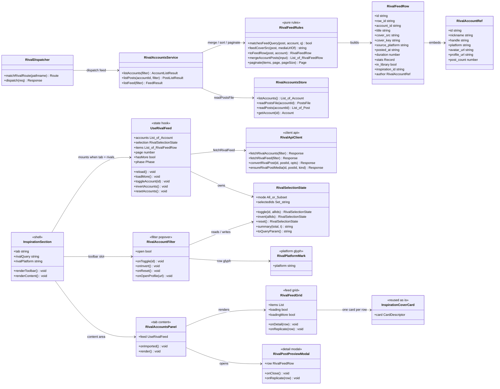
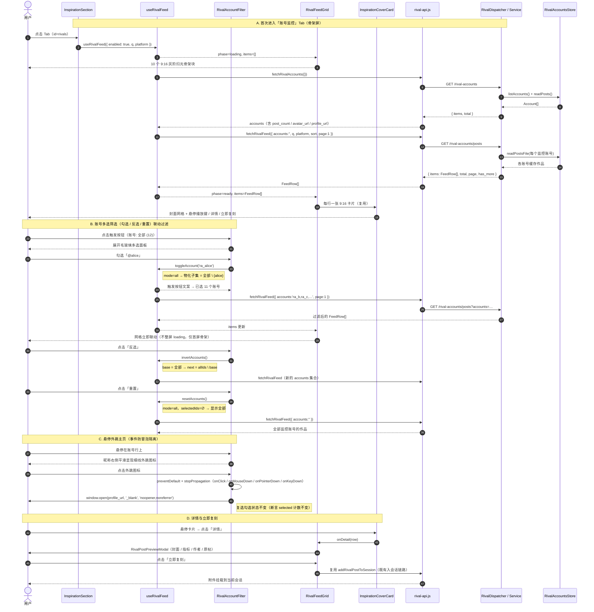
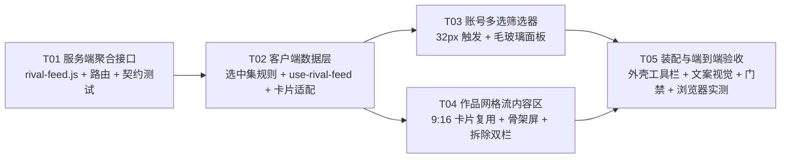

# 灵感社区「账号监控」Tab 内容 Feed 重构 · 系统设计与任务分解

- 架构师：高见远（Gao）｜版本 v1.1｜日期 2026-09-13
- 代码基线：`main @ bb40640a1`（工作树 `omnimux-dsh-wt-account-monitor-feed`，分支 `agent/inspiration-account-monitor-feed`，其 HEAD `c1c31f505` 已含本功能 PRD）
- 落地模块：`plugins/omnimux-inspiration`（对标账号 / rival-accounts 模块）
- 配套产物：`docs/architecture/account-monitor-feed-class-diagram.mermaid`、`docs/architecture/account-monitor-feed-sequence-diagram.mermaid`

---

## 0. 结论摘要（先读这一段）

**业务结论**：「账号监控」Tab 从「左账号名片 + 右帖子列表」的双栏工作台，改造为与「全部」Tab 100% 同源的 9:16 作品网格流，并在顶栏加一个账号多选筛选器；同时清掉全部刷新、只看潜力帖、后台轮询与重试等待等历史包袱。

**上游依据（三份，按权威顺序）**：

| 顺序 | 依据 | 路径 | 作用 |
|---|---|---|---|
| 1 | 最终交互契约 | 本次任务派单（业务对齐 + 高保真原型验证后的定稿） | 范围与验收的唯一裁判 |
| 2 | 高保真原型 | `docs/prototypes/account-monitor-lightweight-demo.html`（工作树内，⚠️ 尚未提交） | 精确几何、文案、交互行为 |
| 3 | PRD | `docs/prd/2026-09-13-account-monitor-feed-prd.md`（`c1c31f505`） | 背景、用户故事、长期目标；**其超出本次范围的部分见 §1.5** |

**三个不可动摇的技术判断**：

| 编号 | 判断 | 一句话理由 |
|---|---|---|
| J1 | **作品网格复用同一张卡片组件**（`InspirationCoverCard` / `MediaCard` 9:16），不新写卡片 | 需求要「100% 一致」；另写一张卡必然漂移。差异化只允许出现在「卡片描述符」的数据适配层 |
| J2 | **新增一个服务端聚合接口**（`GET /rival-accounts/posts`），而不是让浏览器对 N 个账号各发一次请求 | 排序、分页、总数、封面地址必须有唯一真源；N 次请求的方案在账号变多时线性劣化，且每次筛选都要重新扇出 |
| J3 | **多选状态用「模式 + 集合」两个字段表达**（`mode: all\|subset` + `selectedIds: Set`），而非仅用 Set | 「反选」从全选出发得到空集，与「重置回全部」是两种不同状态；显式模式让三条规则可被单测钉死，也能让「后来新增的账号」自动落入「全部」 |

**变更规模**：新增 10 个文件、修改 11 个文件、删除 3 个文件；**不引入任何新的第三方依赖包**。

---

# Part A 系统设计

## 1. 实施路径与技术选型

### 1.1 需求难点识别

| 难点 | 具体表现 | 本设计的处理 |
|---|---|---|
| 内容维度换了 | 原 Tab 的列表单位是「账号」，新 Tab 的单位是「作品」，两者跨账号混排 | 服务端聚合接口按 `posted_at` 统一排序，作品行内嵌作者信息（反范式），卡片渲染零二次查询 |
| 筛选器与网格分属两个组件 | 筛选器在顶栏（外壳渲染），网格在内容区（面板渲染），却必须共享同一份选中状态 | 状态上提到外壳的一个自定义 Hook（`useRivalFeed`），筛选器与网格都是它的消费者（沿用「全部」Tab 已有的 `useInspirationFeed` 模式） |
| 悬停外跳要「点了不算勾选」 | 行本身是复选行，行内嵌一个跳转按钮，事件会冒泡 | 跳转按钮在 `click / mousedown / pointerdown / keydown` 四个入口全部隔离（原型 `handleJumpToHome` 的 `stopPropagation` 同款语义） |
| 封面地址来源不唯一 | 作品封面有本地已下载、本地未下载、远端 CDN 三种形态 | 服务端统一推导 `cover_src` 单字段（优先级：Host 已下载地址 → 本地文件映射的 Host 地址 → 远端原始地址），客户端不做路径拼接 |
| 历史包袱与合规门禁 | 去掉轮询/报错态，同时不能踩 UI01–UI10 硬门禁（禁原生控件、禁 Emoji、禁裸色、禁内联样式、字号白名单） | 规范见 §8；门禁命令见 §10 |

### 1.2 关键技术决策

| 决策 | 选择 | 备选与否决理由 |
|---|---|---|
| **D1 聚合位置** | 服务端聚合，新增 `GET /omnimux/inspiration/local/rival-accounts/posts` | 否决「客户端对每个账号各发一次 E12 再本地合并」：请求数随账号数线性增长；跨账号分页在前端要维护 N 份游标；排序口径会出现两处实现 |
| **D2 顶栏三个控件的过滤对象** | 搜索框 → 过滤**作品**（标题/文案/博主昵称/ID）；平台筛选 → 过滤**作品所属平台**；账号筛选 → 过滤**监控账号** | 原型已定稿：搜索框占位文案为「搜索监控账号的作品」、平台下拉默认「全部平台」。三个控件统一收敛「下方网格可见范围」 |
| **D3 卡片 CTA 文案与视觉** | 「查看」→「详情」、「一键复刻」→「立即复刻」；主按钮 = 纯白实心底 + 纯黑字（Action Ink & Paper），次按钮 = 半透暗底 + 毛玻璃（视觉降级） | **原型已定稿并已解决此前的视觉分歧**：原型 `.cta-btn-replicate` = `#ffffff` 底 + `#111113` 字；`.cta-btn-detail` = `rgba(0,0,0,0.45)` + `blur(8px)` + 1px 半透明描边。两处改动同时作用于「全部」Tab，一致性承诺不被破坏 |
| **D4 「详情」的承载** | 新建轻量 `RivalPostPreviewModal`（`dsh-ui-kit` 的 `ModalDialog`） | 否决直接复用灵感库的 `InspirationPreviewModal`：它带收藏、标签、删除、AI 拆解等**库内条目**语义，把一条对标帖子伪装成库内条目会造成动作错配 |
| **D5 「立即复刻」的承载** | 复用既有 `addRivalPostToSession`（把作品的封面/视频挂进当前会话，进入既有复刻链路） | 该链路已有完整实现与测试（`rival-add-to-chat.js` + 其单测），是当前「对标作品 → 复刻」的唯一合规通路，零新增逻辑 |
| **D6 轮询与刷新** | **客户端**彻底移除定时器、刷新按钮、刷新状态机；**服务端**采集/刷新能力原样保留 | 客户端不再有 `setInterval`、不再有 `queued/running/backoff` 呈现；服务端 scheduler 仍服务于 Agent 工具（`inspiration_rival_refresh` 等），删除会破坏工具契约与既有测试，属越界 |

### 1.3 架构模式

沿用本插件既有分层（不新造抽象）：

```
展示层（.jsx，纯展示，动作全部是回调）
   RivalAccountFilter / RivalFeedGrid / RivalPostPreviewModal / RivalAccountsPanel
规则层（.js，纯函数，无 DOM，可单测）
   rival-filter.js（选中集运算 / 文案 / 卡片描述符适配）
   rival-feed.js（服务端合并 / 排序 / 分页 / 封面推导）
状态层（Hook，唯一的副作用边界）
   use-rival-feed.js（一个定时器都没有）
```

### 1.4 必须复用、禁止重造的清单

| 复用项 | 位置 | 用途 |
|---|---|---|
| `InspirationCoverCard` | `src/client/InspirationCoverCard.jsx` | 9:16 卡片本体（悬停播放键、双胶囊、标题） |
| `MediaCard` | `dsh-ui-kit` | 卡片外壳与 9:16 比例 |
| 骨架屏样式 | `src/client/styles.js` 的 `.omnimux-inspiration-skeleton` / `.omnimux-inspiration-skel` | 灰阶扫光微光动效，**零新增 CSS** |
| 网格样式 | `src/client/styles.js` 的 `.omnimux-inspiration-grid` | 5/4/3/2 列自适应与间距 |
| `Button` / `IconButton` / `Badge` / `ModalDialog` / `SearchField` / `FilterBar` / `Tabs` / `DropdownSelect` / `EmptyState` | `dsh-ui-kit` | 全部交互控件（UI01 硬门禁） |
| 平台图标绘制 | 现 `RivalAccountList.jsx` 的 `PlatformMark`（迁至新文件） | 4 平台细线 SVG（原型 X 图标 path 与之同源） |
| `toPostView` / `formatCount` / `formatRelativeTime` / `toAccountView` | `src/client/rival-format.js` | 指标、时间与账号展示字段 |
| `authGuard` / `quotaGuard` / `inspirationRequest` | `src/client/api.js` | 401 登录闸门与 402 额度提示，不得绕过 |
| `pickCoverSrc` / `hostMediaSrc` | `src/client/api.js` | 封面地址白名单校验 |
| `RivalImportDialog` | `src/client/RivalImportDialog.jsx` | 导入账号入口，原样保留 |
| `rival-add-to-chat.js` / `rival-api.js` 的 `convertRivalPost` | — | 立即复刻 / 转成灵感 |

### 1.5 原型对齐规格（精确数值，直接照做）

| 元素 | 原型规格 | 生产落地 |
|---|---|---|
| 触发按钮「账号筛选」 | 高 `32px`；圆角 `8px`；1px `border-l2` 描边；底色 `bg-layer-1`；字号 `12px` / 字重 500；左右内边距 `12px/10px`；展开态描边升 `border-l4`、底色 `bg-layer-2` | `dsh-ui-kit` `Button`（`variant="outline"`）+ 插件自有 class；文字用 `aria` 与可见文本 |
| 触发按钮文案 | 全选：`账号: 全部 (N)`；部分：`已选 k 个账号`；空选：`未选择账号 (0)` | 由纯函数 `selectionSummary` 产出，文案键入 `locales.js` |
| 下拉面板 Popover | 宽 `290px`；`top: 38px`、右对齐；圆角 `10px`；内边距 `8px`；底色 `--dsw-alias-bg-elevated` + `backdrop-filter: blur(16px)`；1px `border-l2`；投影 `0 12px 32px rgba(0,0,0,.6)`；展开动画 `0.12s cubic-bezier(.16,1,.3,1)`，位移 −4px→0 | 插件自有 `RivalAccountFilter.jsx` + `rival-styles.js`（design.md §2.4 允许自建毛玻璃浮层） |
| 面板顶部操作栏 | 标题「监控账号筛选 (多选)」`11px/600` 三级文字色 + 字距；右侧两个文字链「反选」「重置」`11px` 二级文字色，悬停升为一级色；下沿 1px 分隔线 | 两个 `Button variant="ghost" size="xs"`，文案键 `rivalFilter.invert` / `rivalFilter.reset` |
| 账号行 | 高约 `34px`（`padding: 8px`）；圆角 `6px`；悬停底色 `interactive-bg-hover`；元素顺序 = 复选(15×15, 圆角 4px) → 头像(26px 圆形) → 昵称/@ID 两行 → 右侧「N 个作品」 | 行容器 `div[role="checkbox"]` + `tabIndex=0`（UI01 禁原生 `<button>`，故不用 button 行） |
| 复选框 | 未选：透明底 + 1.5px `border-l3` 描边；选中：纯白底 + 深色对勾（`color: #111113` 对应 `label-primary-foreground`） | 内联 SVG 对勾（`polyline 20 6 9 17 4 12`），**禁止 Emoji/字符**（UI04） |
| 外跳图标 | `18×18`，默认 `opacity:0; pointer-events:none; scale(.9)`；行悬停时 `opacity:1; scale(1)`，`0.15s` 过渡；图标为 24 视口的「外链」细线 SVG | `IconButton variant="ghost" size="xs"`，class 挂在行上控制显隐；图标用 primitives/lucide 矢量 |
| 搜索框 | 占位「搜索监控账号的作品」 | 现有 `SearchField`，仅换占位文案键 |
| 平台筛选 | 默认「全部平台」 | 现有 `DropdownSelect`，选项沿用 `buildRivalPlatformOptions` |
| 骨架屏 | 9:16 网格 + 扫光层，与「全部」Tab 完全一致 | 直接复用 `.omnimux-inspiration-skeleton` / `.omnimux-inspiration-skel` |
| 卡片 Hover 浮层 | 居中纯白圆底播放键 + 底部「详情」「立即复刻」胶囊（`28px` 高、`9999px` 圆角）+ 底部标题（11px，最多 2 行） | 复用 `InspirationCoverCard` 现有 Overlay，仅改文案与主/次按钮配色口径 |
| 页面副标题 | 「正在浏览：已监控账号的发布作品（仅聚合已加监控的博主作品流）」+ 右侧「显示 N 个作品」 | 由面板渲染一行说明 + 计数（计数取接口返回的 `total`） |

**禁止移植原型中的演示专用元素**：原型顶部的「切换骨架屏动效」按钮、Toast 演示气泡、硬编码的三条假账号与假卡片数据，均为演示脚手架，不得进入产品代码。

## 2. 文件清单

路径均相对 `plugins/omnimux-inspiration/`。

### 2.1 新增（10）

| # | 文件 | 职责 | 任务 |
|---|---|---|---|
| 1 | `src/rival/rival-feed.js` | 服务端聚合纯函数：筛选、封面推导、行构造、合并排序、分页 | T01 |
| 2 | `src/rival/rival-feed.test.js` | 上述纯函数单测 | T01 |
| 3 | `src/client/rival-filter.js` | 客户端纯函数：选中集运算（勾选/反选/重置）、触发按钮文案、作品行 → 卡片描述符适配 | T02 |
| 4 | `src/client/rival-filter.test.js` | 上述纯函数单测（含反选与空选边界） | T02 |
| 5 | `src/client/use-rival-feed.js` | 唯一状态源：账号列表 + 作品流 + 选中集 + 分页；无任何定时器 | T02 |
| 6 | `src/client/RivalAccountFilter.jsx` | 32px 触发按钮 + 毛玻璃多选面板（反选/重置、复选行、外跳图标） | T03 |
| 7 | `src/client/rival-filter-render.test.js` | 筛选器渲染门禁（文案、32px、行内容、外跳不勾选） | T03 |
| 8 | `src/client/RivalFeedGrid.jsx` | 作品网格：骨架屏 / 网格 / 空态三态渲染，逐行复用卡片 | T04 |
| 9 | `src/client/RivalPostPreviewModal.jsx` | 「详情」弹窗：封面、指标、作者、原帖与三项动作 | T04 |
| 10 | `src/client/RivalPlatformMark.jsx` | 4 平台细线 SVG 图标（自 `RivalAccountList.jsx` 原样迁出） | T04 |

### 2.2 修改（11）

| # | 文件 | 改动 |
|---|---|---|
| 11 | `src/rival/rival-accounts-service.js` | 新增 `listFeed(filter)`；复用 `store.listAccounts()` / `store.readPostsFile()`；其余方法不动 |
| 12 | `src/rival/rival-routes.js` | `matchRivalRoute` 新增单段路径 `posts` → `{ kind: 'feed' }`（**必须放在「否则视为 account id」的兜底之前**）；`run()` 新增 `feed` 分支 |
| 13 | `src/rival/rival-routes.test.js` | 追加聚合接口契约用例（分页、账号白名单、筛选、封面字段） |
| 14 | `src/client/rival-api.js` | 新增 `fetchRivalFeed(filter)`（走既有 `guarded` 链路）；删除客户端刷新类函数（`refreshRivalAccount` / `refreshAllRivalAccounts` / `fetchRivalStatus` / `fetchRivalMonitor` / `analyzeRivalAccount`），删除前须 grep 确认无引用 |
| 15 | `src/client/RivalAccountsPanel.jsx` | 重写为内容区容器：筛选器由外壳传入、网格交给 `RivalFeedGrid`、保留导入弹窗与详情弹窗 |
| 16 | `src/client/rival-styles.js` | 删除双栏/账号卡/帖子卡/帖子骨架/刷新工具栏样式；新增筛选面板与行样式（全部走 `--dsw-*` Token） |
| 17 | `src/client/locales.js` | 新增筛选器文案键；`tab.rivals` 显示名改为「账号监控」（en: Accounts）；删除仅被移除 UI 使用的键（中英同步） |
| 18 | `src/client/InspirationSection.jsx` | 装配：`useRivalFeed` 挂载、工具栏 `rivals` 分支接入账号筛选器、动作行按 Tab 切换、内容区交给面板 |
| 19 | `src/client/styles.js` | 卡片主/次按钮落到原型与 design.md 的 Action Ink & Paper；如现有 Token 解析已合规（深色主题 `--dsw-alias-button-primary-fill` = 纯白），则**只改文案、不改 CSS**，避免无意义 diff |
| 20 | `src/client/rivals-layout-render.test.js` | 重写布局断言：新四 Tab 外壳不变、账号监控为网格流、无「全部刷新 / 只看潜力帖」 |
| 21 | `src/client/inspiration-section-render.test.js` | 同步工具栏断言（新增账号筛选器、搜索框与平台筛选在同一行） |

### 2.3 删除（3）

| # | 文件 | 删除理由 |
|---|---|---|
| 22 | `src/client/RivalAccountList.jsx` | 左栏账号名片被筛选面板取代；其中的 `PlatformMark` 迁至 `RivalPlatformMark.jsx` |
| 23 | `src/client/RivalPostPanel.jsx` | 右栏帖子列表被 9:16 网格取代 |
| 24 | `src/client/rival-client-store.js` | 轮询/刷新状态机随双栏一起废弃；新状态由 `use-rival-feed.js` 承担（该文件仅被 `RivalAccountsPanel.jsx` 引用，删除安全） |

## 3. 数据结构与接口

### 3.1 服务端接口契约（新增 E15）

```
GET /omnimux/inspiration/local/rival-accounts/posts
```

| 查询参数 | 取值 | 语义 |
|---|---|---|
| `accounts` | 逗号分隔的账号 id；省略 / 空 / `all` | 参与聚合的监控账号集合；缺省 = 全部监控账号 |
| `q` | 关键词 | 匹配作品标题、文案、博主昵称、`@handle`（大小写不敏感） |
| `platform` | 平台 slug | 过滤作品所属平台 |
| `sort` | `posted_at`（默认） / `views` | 主排序键，均降序；`posted_at` 无法解析的行排最后；并列以 `id` 降序兜底 |
| `page` | ≥1，默认 1 | 页码 |
| `page_size` | 默认 20，上限 60 | 每页条数 |

成功响应（`200`，沿用插件 `{ data: … }` 信封）：

```jsonc
{
  "data": {
    "items": [
      {
        "id": "post_xxx",                  // 原帖 id
        "row_id": "ra_alice:post_xxx",      // 复合行 id（跨账号唯一，客户端 React key 用）
        "title": "…", "text": "…", "url": "https://…",
        "type": "video", "posted_at": "2026-09-12T08:00:00.000Z", "duration": 31,
        "stats": { "views": 120000, "likes": 3400, "comments": 88, "shares": 12 },
        "cover_src": "/omnimux/inspiration/local/media/rival-accounts/covers/rival-post_xx.jpg",
        "cover_url": "https://cdn…",        // 远端原始地址，保留可追溯
        "in_library": false, "inspiration_id": null,
        "account": {
          "id": "ra_alice", "nickname": "Alice", "handle": "@alice",
          "platform": "tiktok", "avatar_url": "https://…", "profile_url": "https://…"
        }
      }
    ],
    "total": 137, "page": 1, "page_size": 20, "has_more": true,
    "requested_accounts": ["ra_alice", "ra_bob"]
  }
}
```

错误码（沿用既有体系，不新造）：`400 account-not-found`（`accounts` 含不存在的 id）、`401 needs-omnimux`、`402 quota-exceeded`、`500 internal-error`。

**封面推导规则（唯一实现，禁止在别处重复）**：

```
cover_src = cover_http_url（Host 已下载）
         || rivalMediaUrl('covers', basename(cover_local_path))（本地文件映射的 Host 地址）
         || cover_url（远端原始地址）
         || ''
```

空字符串时卡片自动落到既有「占位卡」分支（`InspirationCoverCard` 的 `broken` 逻辑），无需新逻辑。

**路由匹配风险（必须遵守）**：`matchRivalRoute` 现存单段兜底会把任意单段路径当成账号 id。因此 `parts[0] === 'posts'` 的分支必须插在 `classify / refresh-all / status` 之后、兜底 `{ kind: 'account', id }` 之前，否则 `/rival-accounts/posts` 会被解析为「id 为 posts 的账号」并返回 404。

### 3.2 客户端状态形状

```js
// use-rival-feed.js 的内部状态
{
  phase: 'idle' | 'loading' | 'ready',   // 首屏骨架该不该出现
  error: string | null,
  accounts: Account[],                    // 来自 E1，未过滤，供筛选面板与计数
  selected: { mode: 'all' | 'subset', ids: Set<string> },
  items: FeedRow[],                       // 来自 E15
  page: number, hasMore: boolean, total: number,
  loading: boolean, loadingMore: boolean,
}
```

`FeedRow` → 卡片描述符的映射（`rival-filter.js: toRivalCardRow`）：

| 卡片字段 | 取值 | 说明 |
|---|---|---|
| `id` | `row_id`（`account_id:post_id`） | 跨账号唯一，避免 React key 冲突 |
| `title` | 作品标题 → 文案 → 原帖地址 → id | 与库内行同款兜底顺序 |
| `cover_key` | `cover_src` | 经 `hostMediaSrc` 白名单校验后可直接作为 `` |
| `source_platform` | `account.platform` | 卡片右上角平台角标（非本地行显示平台名） |
| `is_local` | `false` | 走平台角标分支，不展示库内多选复选框 |
| `import_status` | 不设置（等价 `ready`） | 不触发「导入中/失败」徽标与错误条 |
| `in_library` / `inspiration_id` | 原样透传 | 「转成灵感」按钮的禁用态与「已入库」提示 |

### 3.3 类图



## 4. 程序调用流程

### 4.1 关键时序



### 4.2 事件契约（接口层面的硬约定）

| 事件 | 触发源 | 输入 | 状态变更 | 网络 | 可见反馈 |
|---|---|---|---|---|---|
| `toggleAccount(id)` | 账号行点击 / Enter / Space | 账号 id | 见 §4.3 规则 | 立即请求 `page=1` | 勾选框态、触发按钮文案、网格内容 |
| `invertAccounts()` | 面板顶部「反选」 | — | `mode: subset`，`ids = allIds \ base` | 同上 | 同上 |
| `resetAccounts()` | 面板顶部「重置」 | — | `mode: all`，`ids = ∅`（恢复默认全部） | 同上 | 文案回落 `账号: 全部 (N)`，网格恢复全量 |
| `openProfile(url)` | 行内 ↗ 图标 | `account.profile_url` | 无（不改变选中） | 新标签页打开 | 浏览器新标签；`url` 为空时按钮 `disabled` |
| `setRivalQuery(q)` | 顶栏搜索框（300ms 防抖，对齐原型） | 关键词 | 写入 query 并回到 `page=1` | `q=…` | 网格联动 |
| `setRivalPlatform(p)` | 顶栏平台筛选 | 平台 slug | 同上 | `platform=…` | 网格联动 |
| `detail(row)` | 卡片「详情」 | 作品行 | 只开弹窗，不动列表与选中 | 无 | 弹窗 |
| `replicate(row)` | 卡片「立即复刻」 | 作品行 | 弹窗外的列表状态不变 | `addRivalPostToSession` | 卡片按钮忙碌态 → 会话附件出现 |
| `loadMore()` | 网格底部哨兵进入视口 | — | `page+1` | `page=n+1` | 尾部追加 10 个骨架块后替换为卡片 |

### 4.3 多选筛选过滤算法（唯一实现，必须单测）

状态：`mode ∈ {all, subset}`、`ids: Set<string>`；`allIds` = 当前账号列表的全部 id（稳定顺序，来自 E1）。

```
// 1. 勾选 / 取消勾选
toggle(id, allIds, state):
    base = (state.mode === 'all') ? new Set(allIds) : new Set(state.ids)
    base.has(id) ? base.delete(id) : base.add(id)
    // 归一：子集等于全集时退回 all，文案才能回到「账号: 全部 (N)」
    return (base.size === allIds.length) ? { mode:'all', ids:∅ } : { mode:'subset', ids:base }

// 2. 反选（与原型 invertSelectAccounts 逐项取反完全等价）
invert(allIds, state):
    base = (state.mode === 'all') ? new Set(allIds) : new Set(state.ids)
    next = allIds.filter(x => !base.has(x))
    return (next.length === allIds.length) ? { mode:'all', ids:∅ } : { mode:'subset', ids:new Set(next) }
    // 从「全部」反选 → 空集，文案显示「未选择账号 (0)」（与原型一致）

// 3. 重置（恢复默认）
reset(): { mode:'all', ids:∅ }

// 4. 请求参数
toQueryParam(state, allIds):
    if (state.mode === 'all') return ''                      // 省略参数 = 全部
    return allIds.filter(x => state.ids.has(x)).join(',')     // 按 allIds 顺序，稳定可对比

// 5. 触发按钮文案（与原型逐字对齐）
summary(state, total, t):
    mode==='all'                     → t('rivalFilter.all').replace('{n}', total)      // 账号: 全部 (12)
    mode==='subset' && size === 0    → t('rivalFilter.none')                            // 未选择账号 (0)
    mode==='subset' && size > 0      → t('rivalFilter.some').replace('{k}', size)      // 已选 3 个账号
```

不变量（断言用）：`mode==='subset'` 且 `ids.size === allIds.length` 是**非法状态**，任何入口都必须归一为 `mode==='all'`；`ids` 只保存当前仍在监控列表中的 id（账号被移除后自动失效，无需迁移逻辑）；`mode==='all'` 时新增的监控账号自动落入浏览范围。

### 4.4 加载与三态

| 场景 | 判定 | 渲染 |
|---|---|---|
| 首屏加载 | `loading && items.length === 0` | `.omnimux-inspiration-skeleton` + 10 × `.omnimux-inspiration-skel` |
| 分页加载 | `loadingMore` | 网格尾部追加 10 个骨架块 |
| 无监控账号 | `phase==='ready' && accounts.length===0` | 空态：说明文案 + 「导入账号」按钮（复用 `RivalImportDialog`） |
| 有账号、无作品 | `phase==='ready' && items.length===0 && selection.mode==='all'` | 空态：「该账号暂无缓存作品，等待首次采集完成」 |
| 筛选无结果 | `phase==='ready' && items.length===0 && selection.mode==='subset'` | 空态：「当前筛选下没有作品」+「重置筛选」按钮（PRD §6 要求给出可执行出路） |
| 错误 | `error` 非空 | 单行提示（`.omnimux-rival-notice`），不阻塞其余内容 |

## 5. 不确定项与假设（Anything UNCLEAR）

| 编号 | 项 | 本设计的默认处理 | 状态 |
|---|---|---|---|
| **U1** | Tab 显示名：需求全文称「账号监控」，现网标签是「对标账号」 | 改 `tab.rivals` 显示名为「账号监控」（en: `Accounts`），**tab id 保持 `rivals` 不变**（避免锚点/测试连锁改动）。原型 Tab 文案亦为「账号监控」 | 原型已印证，直接执行 |
| **U2** | 顶栏搜索框的过滤对象 | 过滤**作品**（标题/文案/博主昵称/ID）；平台筛选同理过滤作品平台 | 原型占位文案「搜索监控账号的作品」已印证 |
| **U3** | 卡片 CTA 文案与配色 | 「详情」半透暗底毛玻璃（次级）、「立即复刻」纯白实心底纯黑字（主）；两处同时作用于「全部」Tab | 原型已印证（此前分歧已消除） |
| **U4** | 「重置」的语义 | **默认 = 恢复「全部」**（`mode='all'`）。⚠️ 原型把「重置」接在 `clearAllAccounts()` 上（清空 → 「未选择账号 (0)」），而同文件里 `selectAllAccounts()` 定义了却未接线，判断为原型接线不完整而非有意设计 | **需要一行确认**；若确认按原型「清空」，把 `resetAccounts` 改为 `{mode:'subset', ids:∅}` 即可，其余不动 |
| **U5** | 「后台繁重轮询」的清理范围 | 只清**客户端**（定时器、刷新按钮、`queued/running/backoff` 呈现）；服务端采集与刷新能力保留（仍被 Agent 工具依赖） | 按 D6 执行；若要求连服务端一起删，需单独立项（会破坏 `inspiration_rival_refresh` 等工具契约） |
| **U6** | 「潜力帖」数据 | 保留服务端计算与接口字段，**不在新网格中呈现**（网格与「全部」Tab 一致，无该槽位） | 按「移除只看潜力帖按钮」的最小解释执行 |
| **U7** | 账号头像 | 优先 ``（26px 圆形）；加载失败回落首字母块（原型即为首字母块） | 直接执行 |
| **U8** | PRD 中超出本次范围的能力 | **明确不在本次交付**：爆款增速胶囊（k/h）、综合推荐分与「为你推荐/关注监控」双 Tab、产品库匹配度标签、平台多选胶囊与表现分档、左抽屉账号聚焦视图、刷新按钮与额度角标、两级缓存与阶梯计费、一键互动/AI 拆解操作栏 | **见 §5.1，需协调者知悉** |

### 5.1 与 PRD 的范围差异（必须让协调者看到）

PRD（`docs/prd/2026-09-13-account-monitor-feed-prd.md`）描述的是一个**更大的重构**（内容优先 Feed + 推荐排序 + 成本配额体系）。本次派单的交互契约与 `docs/prototypes/account-monitor-lightweight-demo.html` 是**收敛后的轻量化版本**（原型文件名即 `lightweight`）。两者存在以下**方向性差异**，本设计**一律以派单 + 原型为准**：

| 维度 | PRD | 本次交付（派单 + 原型） | 本设计取舍 |
|---|---|---|---|
| 账号列表 | 保留为左抽屉（L3，宽屏常驻 280px） | **彻底废除左右分栏** | 按派单：账号降级为顶栏多选筛选器 |
| Tab 结构 | 双 Tab（为你推荐 / 关注监控） | 保持四 Tab（全部/本地/云端/账号监控），无二级 Tab | 按派单 |
| 卡片形态 | 16:9 / 9:16 自适应、最高 420px、2 列 | **9:16 竖屏网格流，与「全部」Tab 100% 一致** | 按派单（J1） |
| 卡片要素 | 增速胶囊、账号身份行、指标行、匹配度标签、操作栏四项 | 悬停播放键 + 「详情」「立即复刻」+ 标题与博主信息 | 按派单 |
| 刷新 | 顶部刷新按钮 + 额度角标 + 阶梯计费 | **彻底移除刷新按钮与轮询** | 按派单（D6） |
| 排序算法 | 综合推荐分（增速第一权重） | 复用既有 `posted_at` / `views` 服务端排序 | 按派单；推荐算法若要做，属独立立项 |

**结论**：PRD 中「推荐算法 / 增速胶囊 / 成本配额 / 抽屉 / 双 Tab」属未交付范围，本设计不实现、不预留半成品抽象；如后续要落地，应以新 PRD 或新 Issue 单独承接（与 `AGENTS.md` 的 MVP 边界一致）。

---

# Part B 任务分解

## 6. 依赖包检查

**结论：零新增依赖。**

| 包 | 现状 | 本次用途 |
|---|---|---|
| `dsh-ui-kit`（`file:../../../../personal/dsh-ui-kit`） | 已是 dependencies | `Button` / `IconButton` / `Badge` / `ModalDialog` / `SearchField` / `FilterBar` / `Tabs` / `DropdownSelect` / `MediaCard` / `EmptyState` |
| `@deepseek-ai/dsh-client-ui-primitives` | 已是 peerDependencies（Web 平台注入） | 矢量图标：外跳箭头、对勾、播放三角、箭头等 |
| `lucide-react@^1.33.0` | 已是 dependencies | 仅在 primitives 无对应图标时按需使用，不新增 |
| `react` / `react-dom` | 已是 peerDependencies | 不变 |
| Node 内置 `node:test` / `jsdom` / `esbuild` | 已是 devDependencies | 单测与渲染门禁，不变 |

**明确禁止**：为「多选下拉」「复选框」「头像」引入任何第三方 UI 库（headless 组件库、图标包）。三个元素均按 design.md 用 `dsh-ui-kit` 原子件 + 插件自有样式实现。

## 7. 任务列表（按依赖排序，共 5 个）

### T01 服务端作品聚合接口与数据契约（P0）

| 项 | 内容 |
|---|---|
| **目标** | 一个请求拿到「全部监控账号的作品流」，含排序、分页、关键词/平台筛选与封面地址推导 |
| **源文件** | 新增 `src/rival/rival-feed.js`、`src/rival/rival-feed.test.js`；修改 `src/rival/rival-accounts-service.js`、`src/rival/rival-routes.js`、`src/rival/rival-routes.test.js` |
| **依赖** | 无 |
| **验收准则** | ① 纯函数单测覆盖：跨账号合并、`posted_at`/`views` 两种排序与并列兜底、关键词与平台筛选、分页切片与 `has_more`、`cover_src` 三级回退、行 id 复合唯一 —— 全部通过；② `GET …/rival-accounts/posts` 返回 `{items,total,page,page_size,has_more}`；③ `accounts` 传未知 id → `400 account-not-found`；④ 未带 `accounts` → 全部监控账号；⑤ 既有 E12 单账号接口与 `rival-routes.test.js` 原有用例全绿（无回归）；⑥ `pnpm --filter omnimux-inspiration test` 通过 |

### T02 客户端数据层：选中集规则 + 作品流 Hook + 卡片适配（P0）

| 项 | 内容 |
|---|---|
| **目标** | 把「选中集运算」「卡片描述符适配」「作品流加载」收敛成可单测的纯函数 + 一个无定时器的 Hook |
| **源文件** | 新增 `src/client/rival-filter.js`、`src/client/rival-filter.test.js`、`src/client/use-rival-feed.js`；修改 `src/client/rival-api.js`；删除 `src/client/rival-client-store.js` |
| **依赖** | T01（契约冻结即可开工） |
| **验收准则** | ① `toggle` 三态正确：`all` 态勾选任一账号 → 物化为「其余全部」；子集等于全集 → 归一为 `all`；② `invert`：从 `all` 出发得到空集，从子集出发得到补集；③ `reset` 回到 `all` 且 `ids` 为空；④ `summary` 三种文案与原型逐字一致（`账号: 全部 (N)` / `已选 k 个账号` / `未选择账号 (0)`）；⑤ `toQueryParam` 在 `all` 时返回空串、在 `subset` 时按账号列表顺序拼接；⑥ `toRivalCardRow` 产出 `cover_key`、`is_local:false`、复合 `id`，且不携带任何导入状态字段；⑦ Hook 在 `enabled=false` 时不发任何请求（断言请求函数调用次数为 0）；⑧ 全模块无 `setInterval`/`setTimeout` 轮询（grep 为空）；⑨ `rival-api.js` 删除的函数无残留引用（grep 为空） |

### T03 账号多选筛选器（32px 触发 + 毛玻璃面板）（P0）

| 项 | 内容 |
|---|---|
| **目标** | 顶栏新增「账号筛选（多选）」：触发按钮显示 `账号: 全部 (N)` / `已选 k 个账号` / `未选择账号 (0)`，展开暗黑毛玻璃面板 |
| **源文件** | 新增 `src/client/RivalAccountFilter.jsx`、`src/client/rival-filter-render.test.js`；修改 `src/client/rival-styles.js`、`src/client/locales.js` |
| **依赖** | T02 |
| **验收准则** | ① 触发按钮 32px、圆角 8px、与搜索框/平台筛选同一行且 `flex-wrap: nowrap`（标准桌面视口不折行）；② 面板几何与 §1.5 一致（宽 290px、圆角 10px、`bg-elevated` + `blur(16px)`、投影、0.12s 展开动画）；③ 顶部操作栏含标题「监控账号筛选 (多选)」与「反选」「重置」；④ 每行含 自定义复选框（15px）、圆形头像（26px）、昵称 + @ID（带 10px 平台图形）、右侧「N 个作品」；⑤ 悬停行时昵称右侧平滑显现外跳图标（opacity 0→1、scale .9→1、0.15s），点击调用 `openProfile` 且**选中计数不变**（渲染门禁断言）；⑥ Esc 与外部点击关闭面板；⑦ 无原生 `<select>`/`<button>`、无 Emoji 字符、无裸色、无内联业务样式、字号在白名单内（`pnpm test:ui` 通过）；⑧ 中英文案键齐备（`pnpm lint:i18n` 通过） |

### T04 作品网格流内容区（复用 9:16 卡片 + 骨架屏 + 详情弹窗 + 拆除双栏）（P0）

| 项 | 内容 |
|---|---|
| **目标** | 内容区从双栏工作台换成与「全部」Tab 同源的 9:16 作品网格流，并删除全部刷新、只看潜力帖与帖子卡列表 |
| **源文件** | 新增 `src/client/RivalFeedGrid.jsx`、`src/client/RivalPostPreviewModal.jsx`、`src/client/RivalPlatformMark.jsx`；重写 `src/client/RivalAccountsPanel.jsx`；删除 `src/client/RivalAccountList.jsx`、`src/client/RivalPostPanel.jsx`；修改 `src/client/rival-styles.js` |
| **依赖** | T02 |
| **验收准则** | ① 内容区无左右分栏容器（`omnimux-rival-columns` 不再出现）；② 页面上不存在「全部刷新」「只看潜力帖」按钮（渲染门禁断言文本不存在）；③ 首屏 loading 渲染 10 个 `.omnimux-inspiration-skel`，且使用 `.omnimux-inspiration-grid` 栅格（与「全部」Tab 同一套 CSS）；④ 每行作品由 `InspirationCoverCard` 渲染（断言 `data-inspiration-id` 存在），9:16 比例；⑤ 悬停出现居中白色圆形播放键 + 「详情」「立即复刻」+ 底部标题与博主信息；⑥ 「立即复刻」调用既有 `addRivalPostToSession`（断言调用参数），「详情」打开 `RivalPostPreviewModal` 且关闭后列表与选中集不变；⑦ 三种空态（无账号 / 无作品 / 筛选无结果）各自渲染正确文案；⑧ 分页追加渲染 10 个骨架块后再替换为卡片；⑨ 副标题行渲染「正在浏览：已监控账号的发布作品」与「显示 N 个作品」计数 |

### T05 装配、文案与端到端验收（P0）

| 项 | 内容 |
|---|---|
| **目标** | 把筛选器接入外壳工具栏、把面板接入内容区，收敛文案与按钮视觉，跑完全部门禁与浏览器实测 |
| **源文件** | 修改 `src/client/InspirationSection.jsx`、`src/client/locales.js`、`src/client/styles.js`、`src/client/rivals-layout-render.test.js`、`src/client/inspiration-section-render.test.js` |
| **依赖** | T03、T04 |
| **验收准则** | ① 四 Tab 切换后外壳节点不重挂载（断言 DOM 节点身份不变）；② 账号监控 Tab 的搜索框、平台筛选、账号筛选在**同一行**（nowrap），且「全部」Tab 的次行细筛不出现；③ 动作行按 Tab 切换（账号监控 → 「导入账号」，其余 → 「添加灵感」）；④ 「详情/立即复刻」文案与主/次按钮配色落到 §1.5 口径；⑤ `pnpm test:ui`、`pnpm verify:stages`、`pnpm test:gates`、`pnpm --filter omnimux-inspiration test` 全绿；⑥ ego-browser 在 Dev（端口 45120）实测并留证：进入 Tab 见骨架屏 → 勾选/反选/重置即时联动 → 悬停行点外跳不勾选 → 悬停卡片见播放键与双按钮 → 详情弹窗 → 立即复刻进入会话；⑦ 深色/浅色两套主题下无对比度问题与白底漂白问题 |

### 任务规模自检

| 规则 | 结果 |
|---|---|
| 任务数 ≤ 5 | 5 ✅ |
| 每任务 ≥ 3 个相关文件 | T01: 5｜T02: 5｜T03: 4｜T04: 7｜T05: 5 ✅ |
| 首任务为基础设施 | T01 是全部后续工作的数据契约与地基 ✅ |
| 无「一文件一任务」 | ✅ |
| 无过度线性链 | T01 → T02 →（T03 ∥ T04）→ T05，最长链 4 段；T03 只需 T02 冻结的**接口形状**，可在 T02 编码期间并行开工 ✅ |

## 8. 共享约定（Shared Knowledge）

```
【接口信封】所有 Host 响应沿用 { data: … } / { error, code, reason }；客户端一律经 api.js 的
           authGuard(quotaGuard(...)) 调用，禁止绕过 401/402 闸门另开请求路径。
【标识约定】作品行对外 id = `${account_id}:${post_id}`（row_id）；后端内部仍用原帖 id。
           账号 id 前缀 ra_。卡片 React key 用 row_id。
【封面约定】只有 cover_src 一个真源；客户端不得基于文件路径自行拼 URL；
           地址必须通过 hostMediaSrc 白名单（http(s) 绝对地址 / local/media / media 前缀）。
【文案约定】新增键统一前缀 rivalFilter.*；中英必须同批新增（lint:i18n 兜底）；
           文案逐字对齐原型（账号: 全部 (N) / 已选 k 个账号 / 未选择账号 (0) / 监控账号筛选 (多选) /
           反选 / 重置 / 搜索监控账号的作品 / 全部平台 / 详情 / 立即复刻）。
【样式约定】全部走 --dsw-* Token（禁裸色）；禁止 JSX 内联业务样式（UI02）；
           控件高 32px；浮层圆角 10–12px；工具栏 flex-wrap: nowrap；
           字号只能取 design.md §4.2 白名单；图标一律矢量 SVG（禁 Emoji / 字符图标）。
【事件约定】行内任何次级操作（外跳、复选框）必须在 click / mousedown / pointerdown / keydown
           四个入口 stopPropagation + preventDefault，避免触发行的复选与打开动作。
【无定时器】本次改造引入的代码中不得出现 setInterval / 递归 setTimeout 轮询；
           任何“稍后重试”的等待态一律不做，失败即失败并如实提示。
【精选复用】卡片、骨架屏、网格、平台图标、格式化函数、导入弹窗、入会话链路一律复用，
           禁止在 rival 模块内重写同类实现。
【测试约定】纯规则放 .js 并配 *.test.js；含渲染的断言用 esbuild + jsdom +
           test-fixtures/ui-kit-shim.mjs（沿用 rivals-layout-render.test.js 的挂载方式）。
```

## 9. 任务依赖图



**并行说明**：T01 完成即冻结 §3.1 契约；T02 一经冻结 `RivalSelectionState` 的接口形状（§3.2/§4.3），T03 与 T04 即可并行——两者只依赖该接口，不互相依赖。

## 10. 验收与证据链

| 层级 | 命令 / 手段 | 证明什么 |
|---|---|---|
| 单测 | `pnpm --filter omnimux-inspiration test` | 聚合规则、选中集规则、卡片适配、渲染门禁 |
| UI 硬门禁 | `pnpm test:ui` | UI01–UI10（原生控件、内联样式、裸色、Emoji、字号白名单） |
| 阶段契约 | `pnpm verify:stages` | 四个 Tab 都在同一外壳内，页头/工具栏不被 Tab 顶替 |
| 仓库门禁 | `pnpm test:gates` | 工作流与脚本门禁一致 |
| 运行时验收 | ego-browser → Dev（45120）实测并截图留证 | 骨架屏、勾选/反选/重置联动、外跳不勾选、悬停卡片双按钮、详情弹窗、立即复刻入会话 |
| 主题回归 | 深/浅两主题人工核对 | 白底黑字按钮与毛玻璃浮层在两套主题下均合规 |
| 工作树提示 | 本功能工作树无 `node_modules` | 需 `CI=true corepack pnpm install --frozen-lockfile --ignore-scripts`，或按既有经验软链主检出依赖；`file:` 依赖在工作树深两层会解析失败 |

---

## 附：与需求条目的对应关系（自检表）

| 需求条目 | 设计落点 |
|---|---|
| 废除左右分栏 | §2.3 删除 `RivalAccountList` / `RivalPostPanel`；T04 验收 ① |
| 与「全部」Tab 100% 一致（9:16 网格流） | J1、§1.4 复用清单、T04 验收 ③④ |
| 仅聚合已监控账号的作品 | §3.1 E15 接口（`accounts` 缺省 = 全部监控账号）、T04 验收 ⑨ |
| 悬停：白圆播放键 + 详情/立即复刻 + 标题与博主信息 | §1.5、D3/D5、T04 验收 ⑤⑥ |
| 顶栏账号多选筛选器（32px、单行、默认文案） | §1.5、T03 验收 ①②；§4.3 summary |
| 面板：反选 + 重置 | §4.3 规则 2/3；T03 验收 ③（重置语义待 U4 一行确认） |
| 行：复选 + 头像 + 昵称/@ID + 平台图标 + 作品数 | §1.5、T03 验收 ④ |
| 悬停显现外跳图标 + 防冒泡 | §4.2 `openProfile`、§8 事件约定、T03 验收 ⑤ |
| 勾选即时联动过滤 | §4.3、§4.2；T02/T03 验收 |
| 移除全部刷新 / 只看潜力帖 | §2.3、T04 验收 ② |
| 移除后台轮询、重试等待、报错态 | D6、§8「无定时器」、T02 验收 ⑧ |
| 骨架屏灰阶扫光（与「全部」一致） | §1.4 骨架屏复用、§4.4、T04 验收 ③ |
| 禁止引入额外第三方重包 | §6 |
| PRD 其余能力（推荐算法/增速胶囊/配额/抽屉/双 Tab） | §5.1 明确不在本次交付，需另立 Issue |
