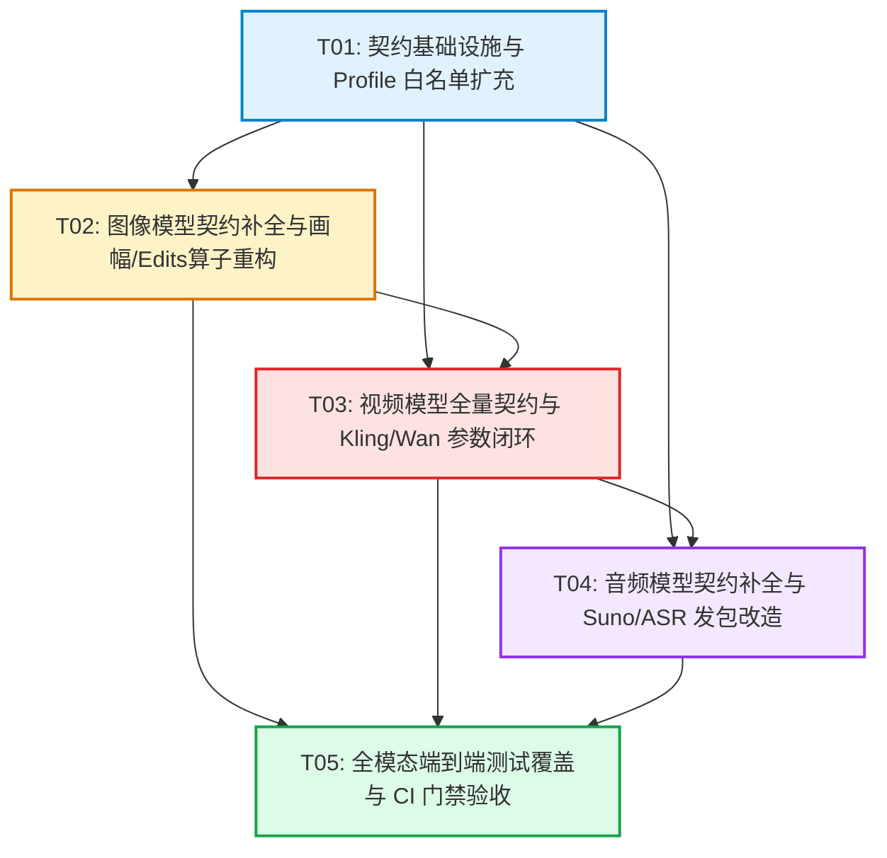

# 全模型网关能力真相对账与整改方案规格书

## 架构师引言与排查背景

在 OmniMux 多模态内容生成平台的持续演进中，系统契约层（`specs/*-models.yaml`）、发包守卫层（`SubmitGuard` / `adapter-profiles.json` / `map.js`）与底层网关服务（OmniMux Gateway）之间出现了严重的“能力真相脱节”现象。

用户明确指示：**“不仅仅是这个模型 其他模型都要排查 修正”**。交付总监齐活林要求对当前系统内的所有模型（**图像 12 款、视频 19 款、音频 5 款，共计 36 款模型**）开展全量参数与能力真相排查，输出高标准、可落地、具备闭环指导意义的架构设计方案。

本规格书基于四大权威基准源展开深度交叉审计：
1. **网关源码真源**：`/Users/x/Desktop/Project/OmniMux/`（重点关注 `relay/helper/valid_request.go`、`relay/channel/task/` 下的 `apimart`, `fal`, `sora`, `kling`, `volcengine` 各适配器、`FORK_CUSTOMIZATIONS.md` 等）；
2. **官方文档真源**：`/Users/x/Desktop/Project/OmniMux-docs/`（`zh/api-reference/` 下的 `image-series`, `video-series`, `audio-series` 的 mdx 文档与 openapi 声明）；
3. **系统契约配置**：`plugins/omnimux/src/catalog/specs/{image,video,audio}-models.yaml`；
4. **发包映射与白名单契约**：`plugins/omnimux/src/catalog/contract/adapter-profiles.json` 与 `plugins/omnimux/src/catalog/contract/submit-guard/map.js`。

审计揭示出的核心系统性断层包括：
- **画幅参数（Aspect Ratio / Size）标准严重割裂**：OpenAI 家族严禁 `aspect_ratio` 只收绝对像素 `size`（1024x1024/1792/1024）；Grok 家族只收 8 档 `aspect_ratio` 严禁 `size`；Kling 家族存在网关内部将未识别 size 默认降级为 `1:1` 的隐蔽 Bug；Wan 3.0 与 Seedance 在网关侧均叫 `size` 但一个要求大写分辨率（`720P`），一个要求小写分辨率（`720p`）。契约层未提供通用收敛机制，导致前端画幅选择在多模型间经常报错或失效。
- **生图模式（Edits / Multi-Reference）链路中断**：网关原生在 `valid_request.go` 中明确支持 `/v1/images/edits` 图生图与参考图，但契约层将图像模型的 `multi_reference` 模式全数标为 `stub` 或 `None`，发包层也未打通 `/v1/images/edits` 端点，导致多图参考形同虚设。
- **视频与音频能力严重漏配**：Minimax H3 的尾帧生成（`end_frame`）、Wan 3.0 的文档转视频（`document_to_video`）与网页转视频（`webpage_to_video`）、Seedance 2.5 的视频编辑与延展（`video_edit`/`video_extend`）在网关已实现却在契约层未打通；Suno 在网关中是走 `/v1/video/generations` 异步媒体任务，契约却被误配在同步音频管道，导致发包字段被截断；豆包 ASR 大模型未打通 URL-first 传参。

本规格书系统性构建了“画幅标准收敛算子”、“生图 Edits 端到端路由算子”、“视频多渠道参数映射算子”与“音频全模态闭环规范”，并制定了严谨的 5 阶段工程实施计划。

---

# Part A: 系统设计 (System Design)

## 1. 实施方法与架构全景 (Implementation Approach)

### 1.1 核心技术难点分析

```
+----------------------------------------------------------------------------------------------------+
|                                    OmniMux 全模态契约映射架构全景                                     |
+----------------------------------------------------------------------------------------------------+
                                                   |
                     [ 业务客户端 / 工作流节点 / UI Canvas / CLI ]
                                                   |
                                                   v
                         +-----------------------------------+
                         |      SubmitGuard 契约防御与准入门禁   |
                         |   (dispositions / operations 校验) |
                         +-----------------------------------+
                                           |
                                           v
       +-----------------------------------------------------------------------+
       |               AspectRatioConvergenceOperator (画幅收敛算子)              |
       |  输入: 通用 8 档画幅 (1:1, 16:9, 9:16, 4:3, 3:4, 3:2, 2:3, 21:9, auto)   |
       +-----------------------------------------------------------------------+
           |                    |                    |                    |
           v                    v                    v                    v
     [OpenAI 家族]        [Grok 家族]          [Midjourney 家族]    [视频模型家族]
     横竖方聚类映射       透传 8 档比例字符串    Prompt 注入 --ar     分流: size vs ratio
     输出: 绝对像素 size   输出: aspect_ratio  或透传 aspect_ratio  Wan/Seedance: size
     质量: standard/hd    禁发绝对像素 size    注入版本与风格参数    MiniMax/Kling: ratio
           |                    |                    |                    |
           +--------------------+--------------------+--------------------+
                                           |
                                           v
                         +-----------------------------------+
                         |      OperationRouter (模式路由器)   |
                         +-----------------------------------+
                                           |
            +------------------------------+------------------------------+
            |                              |                              |
            v                              v                              v
     [图像端点分发]                 [视频/Suno 媒体任务]            [音频实时端点分发]
  - 单图文生图:                   - 端点:                        - 语音合成 (TTS):
    POST /v1/images/generations     POST /v1/video/generations     POST /v1/audio/speech
  - 多图参考 / 垫图 / 编辑:       - 统一 roles 规范:             - 语音识别 (ASR):
    POST /v1/images/edits           image_with_roles / urls        POST /v1/audio/transcriptions
    (规范化 image/images)         - Kling metadata 注入修复        (URL-first 注入 url/audio_url)
            |                              |                              |
            +------------------------------+------------------------------+
                                           |
                                           v
                         +-----------------------------------+
                         |     OmniMux Gateway (/v1/* Relay)  |
                         +-----------------------------------+
                                           |
       +--------------------+--------------------+--------------------+
       |                    |                    |                    |
       v                    v                    v                    v
  [APIMart 通道]         [fal.ai 通道]        [火山引擎通道]        [OpenAI/xAI 通道]
```

1. **画幅标准（Aspect Ratio）的语义多态与家族割裂**：
   - 客户端逻辑层统一以数学比例（如 `16:9`, `9:16`, `1:1`, `4:3`, `3:4`, `3:2`, `2:3`, `21:9`）表达空间画幅需求；
   - 但下游网关的各模型接收字段完全不统一：OpenAI 强校验 `size`（且仅允许 `1024x1024`, `1024x1792`, `1792x1024`，任何额外字段导致 400）；Grok 要求 `aspect_ratio`（接收 `auto, 1:1, 16:9, 9:16, 4:3, 3:4, 3:2, 2:3`）；Midjourney 上游习惯 `--ar` 命令行注入；视频模型中 Wan 和 Seedance 在网关层命名为 `size`，而 MiniMax 与 Grok Video 则命名为 `aspect_ratio`。
   - **架构解法**：在发包层（`SubmitGuard/map.js`）设立独立的 `AspectRatioConvergenceOperator`（画幅收敛算子），负责在进入 Vendor Payload 前根据当前目标模型的 `family` 与 `modelId` 执行精准转换。

2. **图像模式图生图与编辑端点（`/v1/images/edits`）端到端贯通**：
   - 目前系统内 12 款图像模型的 `multi_reference` 操作实现全部缺失（非 None 即 stub）；
   - 网关源码中，`relay/helper/valid_request.go` 明确在 `relayconstant.RelayModeImagesEdits` 分支下对 `/v1/images/edits` 进行了完善的表单/JSON 双重解析（支持 `image`, `prompt`, `model`, `n`, `size`, `quality`, `watermark`）；
   - **架构解法**：扩展 `imageGenerate` profile，新增 `imageEdits` seam 支持，建立 `ImageEditsRouter`：根据请求中是否包含输入图像（`bindings` 中的 `firstFrames` / `references`）决定发送到 `/v1/images/generations` 还是 `/v1/images/edits`，并规范化发包字段。

3. **快手可灵（Kling）网关降级 Bug 根治**：
   - 网关 `relay/channel/task/kling/adaptor.go` 中的 `getAspectRatio(size)` 函数存在严重缺陷：仅硬编码匹配 `1024x1024`, `1280x720`, `720x1280`，当传入 `"16:9"` 时直接走 `default: return "1:1"`！
   - 目前发包层 `map.js` 针对 Kling 发送的是 `vendor.size = extras.aspectRatio`（即 `"16:9"`），导致快手可灵在网关内部被 100% 错误转换为 `1:1` 方形视频！
   - **架构解法**：双重防御——发包层将 Kling 纳入 `useAspectRatio` 白名单（直接赋 `vendor.aspect_ratio`），并同时向请求体附加 `metadata.aspect_ratio = extras.aspectRatio`，利用 Kling 适配器的 `taskcommon.UnmarshalMetadata` 机制直接穿透覆盖，彻底根治 1:1 降级缺陷。

4. **Suno 音乐任务异步媒体化与契约重构**：
   - Suno 在网关源码中接入在 APIMart Channel 63，提交端点实际是 `POST /v1/video/generations`（或 `/v1/music/generations`），以 Task 异步方式运行；
   - 契约层却将其挂在同步的 `audioGenerate` profile 下，导致发包层试图走 TTS 语音流逻辑，`title`, `tags`, `instrumental` 字段无法送达；
   - **架构解法**：在 `adapter-profiles.json` 中为 Suno 扩充 `audioGenerate` profile 的 `operationVendorShapes`，放行 `title`, `tags`, `style`, `instrumental` 字段，并在发包层对 Suno 实行专用媒体任务映射。

---

## 2. 涉及文件清单 (File List)

| 文件路径 (Relative Path) | 模块归属 | 修改类型 | 职责与变更说明 |
| :--- | :--- | :--- | :--- |
| `plugins/omnimux/src/catalog/specs/image-models.yaml` | 契约规格层 | 修改 | 补齐 12 款图像模型的完整 8 档画幅、生成张数 `n`、implementation 与 execution live 绑定 |
| `plugins/omnimux/src/catalog/specs/video-models.yaml` | 契约规格层 | 修改 | 补齐 19 款视频模型的全量 operation、准确字段名（size vs aspect_ratio）、音效与水印参数 |
| `plugins/omnimux/src/catalog/specs/audio-models.yaml` | 契约规格层 | 修改 | 补齐 5 款音频模型的契约定义、Suno 任务参数、ASR 输出格式、implementation 绑定 |
| `plugins/omnimux/src/catalog/contract/adapter-profiles.json` | 白名单契约 | 修改 | 扩充 `imageGenerate`, `videoGenerate`, `audioGenerate` 的 vendorFields、forbiddenVendorFields 与 operationVendorShapes |
| `plugins/omnimux/src/catalog/contract/submit-guard/map.js` | 发包映射层 | 修改 | 重构 `mapOpenAiImageSize`，新增多家族画幅转换、Kling 穿透注入、Suno 发包映射、Edits 路由 |
| `plugins/omnimux/src/catalog/contract/submit-guard/map-contract.js` | 发包契约层 | 修改 | 适配新增 vendorFields 与 operationVendorShapes 白名单校验 |
| `plugins/omnimux/src/catalog/contract/dispositions.json` | 模型治理层 | 核查 | 确保 67 款 runtime 模型治理状态与 canonical/draft/quarantine 定义严格对齐 |
| `scripts/verify-model-contracts.mjs` | 门禁校验层 | 核查 | 保证离线契约自洽性校验 100% 严格通过 |

---

## 3. 全模型四维对账矩阵表 (Comprehensive 4D Reconciliation Matrix)

本节对系统内全部 **36 款模型** 展开地毯式对账排查。

### 3.1 图像模型（共 12 款）四维对账矩阵

| 模型 ID | Family | 网关真实支持 Operation | 当前契约状态 (image-models.yaml) | 网关真实参数项 vs 当前契约漏配项 | 发包层 (map.js) 映射现状与修正策略 |
| :--- | :--- | :--- | :--- | :--- | :--- |
| **gpt-image-2** | openai | `text_to_image`<br>`multi_reference`<br>`image_to_image` | Ops: `text_to_image` (live)<br>`multi_reference` (stub)<br>impl.seam: `imageGenerate` | **网关真实**：只认 `size`（`1024x1024`, `1024x1792`, `1792x1024`），`quality`（standard, hd），`n`（1~128）。<br>**契约漏配**：画幅只配了 4 档，**漏配 `4:3`, `3:4`, `3:2`, `2:3`, `21:9`**；**漏配 `n` 生成张数参数**。 | **现状**：已有 `mapOpenAiImageSize` 聚类转换，但契约缺画幅选项导致用户无法输入；未映射 `n`。<br>**修正**：契约补齐 8 档画幅与 `n`，发包层映射 `n`，图生图指向 `/v1/images/edits`。 |
| **gpt-image2-hd** | openai | `text_to_image`<br>`multi_reference` | Ops: `text_to_image` (None)<br>`multi_reference` (None)<br>impl.seam: None | **网关真实**：默认 `quality: hd`，画幅与参数同上。<br>**契约漏配**：**impl 与 exec 完全未绑定 (None)**；画幅漏配 `4:3`, `3:4`, `3:2`, `2:3`, `21:9`；漏配 `n`。 | **现状**：因缺失 impl 无法作为 live 节点稳定执行。<br>**修正**：补齐 `imageGenerate` live 契约，自动绑定 `quality: hd`。 |
| **grok-imagine-image-2** | grok | `text_to_image`<br>`multi_reference` | Ops: `text_to_image` (live)<br>`multi_reference` (stub)<br>impl.seam: `imageGenerate` | **网关真实**：字段必须为 `aspect_ratio`（支持 `auto, 1:1, 16:9, 9:16, 4:3, 3:4, 3:2, 2:3`），严禁发绝对像素 `size`！清晰度 1K/2K。<br>**契约漏配**：**漏配 `3:2`, `2:3` 两档画幅**。 | **现状**：走 else 分支透传 `vendor.aspect_ratio`，但未阻止 `size` 干扰。<br>**修正**：契约补全 8 档画幅，发包层确保只产出 `aspect_ratio`。 |
| **grok-imagine-image-quality** | grok | `text_to_image`<br>`multi_reference` | Ops: `text_to_image` (None)<br>`multi_reference` (None)<br>impl.seam: None | **网关真实**：Grok 图像高画质版，清晰度 2K/4K，画幅支持 8 档。<br>**契约漏配**：**impl 与 exec 完全未配置**；漏配 `3:2`, `2:3` 画幅。 | **修正**：绑定 `imageGenerate` 且设为 live；画幅与发包对齐 Grok 规范。 |
| **midjourney** | midjourney | `text_to_image`<br>`multi_reference` | Ops: `text_to_image` (None)<br>`multi_reference` (None)<br>impl.seam: None | **网关真实**：APIMart / mjproxy 渠道，支持全画幅（`1:1, 16:9, 9:16, 4:3, 3:4, 21:9, 3:2, 2:3` 等），通过 prompt 后缀 `--ar` 或 body `aspect_ratio`；支持垫图 URL。<br>**契约漏配**：**impl 与 exec 完全未配置**。 | **现状**：无针对 Midjourney 的专用发包处理。<br>**修正**：绑定 `imageGenerate`，发包层支持将画幅注入 `--ar` 或透传 `aspect_ratio`，支持多图 URL 垫图。 |
| **midjourney-8.1** | midjourney | `text_to_image`<br>`multi_reference` | Ops: `text_to_image` (None)<br>`multi_reference` (None)<br>impl.seam: None | **网关真实**：同 Midjourney，固定版本 `--v 8.1`。<br>**契约漏配**：**impl 与 exec 完全未配置**。 | **修正**：同上，发包层确保版本参数闭环。 |
| **midjourney-7** | midjourney | `text_to_image`<br>`multi_reference` | Ops: `text_to_image` (None)<br>`multi_reference` (None)<br>impl.seam: None | **网关真实**：同 Midjourney，固定版本 `--v 7`。<br>**契约漏配**：**impl 与 exec 完全未配置**。 | **修正**：同上。 |
| **midjourney-niji-7** | midjourney | `text_to_image`<br>`multi_reference` | Ops: `text_to_image` (None)<br>`multi_reference` (None)<br>impl.seam: None | **网关真实**：二次元动漫风格，固定参数 `--niji 7`。<br>**契约漏配**：**impl 与 exec 完全未配置**。 | **修正**：同上。 |
| **nano_banana_2** | nanobanana | `text_to_image`<br>`multi_reference` | Ops: `text_to_image` (None)<br>`multi_reference` (None)<br>impl.seam: None | **网关真实**：Google/Gemini 渠道（Imagen 3），支持画幅 `1:1, 3:4, 4:3, 9:16, 16:9`，清晰度 2K/auto-4K。<br>**契约漏配**：**impl 与 exec 完全未配置**；漏配画幅聚类转换。 | **现状**：缺少对应 channel 发包适配。<br>**修正**：绑定 `imageGenerate` live，将非标画幅聚类至 Gemini 5 档支持画幅。 |
| **nano_banana_pro** | nanobanana | `text_to_image`<br>`multi_reference` | Ops: `text_to_image` (None)<br>`multi_reference` (None)<br>impl.seam: None | **网关真实**：Imagen 3 Pro 规格。<br>**契约漏配**：**impl 与 exec 完全未配置**。 | **修正**：同 `nano_banana_2`。 |
| **seedream-5.0-pro** | seedream | `text_to_image`<br>`multi_reference` | Ops: `text_to_image` (None)<br>`multi_reference` (None)<br>impl.seam: None | **网关真实**：火山引擎即梦 5.0 Pro，支持画幅 `1:1, 4:3, 3:4, 16:9, 9:16, 21:9, 3:2, 2:3`，分辨率 1K/2K，支持 `image_urls` 垫图。<br>**契约漏配**：**impl 与 exec 完全未配置**。 | **现状**：多图垫图发包未对齐火山规范。<br>**修正**：绑定 `imageGenerate` live，发包层映射为 `image_urls` 数组。 |
| **seedream-4.5** | seedream | `text_to_image`<br>`multi_reference` | Ops: `text_to_image` (None)<br>`multi_reference` (None)<br>impl.seam: None | **网关真实**：火山引擎即梦 4.5 模型，分辨率 2K/4K。<br>**契约漏配**：**impl 与 exec 完全未配置**。 | **修正**：同 `seedream-5.0-pro`。 |

---

### 3.2 视频模型（共 19 款）四维对账矩阵

| 模型 ID | Family | 网关真实支持 Operation | 当前契约状态 (video-models.yaml) | 网关真实参数项 vs 当前契约漏配项 | 发包层 (map.js) 映射现状与修正策略 |
| :--- | :--- | :--- | :--- | :--- | :--- |
| **seedance-2-0-fast** | bytedance | `text_to_video`<br>`first_frame`<br>`first_last_frame`<br>`video_multi_ref` | `text_to_video` (live)<br>`first_frame` (stub)<br>`first_last_frame` (None)<br>`video_multi_ref` (live) | **网关真实**：画幅字段叫 **`size`**（`16:9, 9:16, 1:1, 4:3, 3:4, 21:9, adaptive`）；分辨率小写 **`resolution`**（`480p, 720p`）；时长 `duration` 4~15s；音效 `generate_audio`；水印 `watermark`；`return_last_frame`；首尾帧用 `image_with_roles`。<br>**契约漏配**：`first_last_frame` 为 None。 | **现状**：发包层正确映射 `vendor.size` 与 `image_with_roles`。<br>**修正**：契约将 `first_frame` 与 `first_last_frame` 全数升格为 live，补齐 `videoGenerate` seam。 |
| **seedance-2-0-mini** | bytedance | `text_to_video`<br>`first_frame`<br>`first_last_frame`<br>`video_multi_ref` | `text_to_video` (live)<br>`first_frame` (stub)<br>`first_last_frame` (None)<br>`video_multi_ref` (none) | **网关真实**：同 2.0-fast。<br>**契约漏配**：`video_multi_ref` 被错误标为 none；缺少 live 绑定。 | **修正**：契约修正 `video_multi_ref` 为 live，补齐首尾帧 live。 |
| **seedance-2-5** | bytedance | `text_to_video`<br>`first_frame`<br>`first_last_frame`<br>`video_multi_ref`<br>`video_edit`<br>`video_extend` | 6 个 Ops 全部列出，但 `first_last_frame`, `video_edit`, `video_extend` execution 均为 None！ | **网关真实**：画幅叫 **`size`**；分辨率 `480p, 720p, 1080p`；时长 4~30s **且独家支持 `-1`（自适应时长）**！`output_format`（mp4, mov）；`video_edit` **强制要求 `size: "adaptive"` 与 `duration: -1`**！<br>**契约漏配**：高阶操作未 live 闭环；duration 未列出 `-1`。 | **现状**：`map.js` 写了 edit/extend 映射，但未强校验 edit 的 adaptive 约束。<br>**修正**：契约全面 live 化，补齐 `-1` 选项与参数门禁联动。 |
| **seedance-2-0** | bytedance | `text_to_video`<br>`first_frame`<br>`first_last_frame`<br>`video_multi_ref` | 同 2.0-fast，缺少首尾帧与多图 live | **网关真实**：分辨率额外支持 `1080p`, `4k`。<br>**契约漏配**：首尾帧与多图参考未 live。 | **修正**：对齐参数与 live 状态。 |
| **seedance2.5-stable-max-720p** | bytedance | `text_to_video`<br>`first_frame` | Ops 未配置 live (None) | **网关真实**：专线稳定版，固定 720p，时长 5/10s。<br>**契约漏配**：impl 与 exec 为 None。 | **修正**：绑定 `videoGenerate` live。 |
| **kling-v3** | kling | `text_to_video`<br>`first_frame`<br>`first_last_frame` | Ops 未配置 live (None) | **网关真实**：真实字段必须为 **`aspect_ratio`**（`16:9, 9:16, 1:1`）；时长 5/10s；分辨率 1080P/4K；音效 `sound`。<br>**契约漏配**：impl 与 exec 为 None。 | **现状存在重大 BUG**：`map.js` 赋值了 `vendor.size = extras.aspectRatio`，而网关 `kling/adaptor.go` 内部 `getAspectRatio(size)` 遇 `"16:9"` 会 **降级默认返回 `"1:1"`**！<br>**修正**：`map.js` 必须直接注入 `vendor.aspect_ratio` 并附加 `metadata.aspect_ratio` 穿透覆盖！ |
| **kling-v2-6** | kling | `text_to_video`<br>`first_frame`<br>`first_last_frame` | Ops 未配置 live (None) | **网关真实**：分辨率 1080P，画幅 16:9, 9:16, 1:1。<br>**契约漏配**：impl 与 exec 为 None。 | **修正**：同上，修复 Kling 降级 1:1 严重 Bug。 |
| **kling-avatar** | kling | `digital_human` | Op: `digital_human` (None) | **网关真实**：数字人驱动，需要 `image`（立绘）与 `audioTrack`（驱动音频）。<br>**契约漏配**：契约中 implementation 为 None；disposition 为 draft。 | **现状**：发包层对应 `videoDigitalHuman` profile。<br>**修正**：确保 Kling 渠道识别 `image` 与音频轨道结构。 |
| **veo-3.1** | veo | `text_to_video`<br>`video_multi_ref` | Ops 未配置 live (None) | **网关真实**：画幅 16:9, 9:16；时长 5/8s；分辨率 1080P/720P。<br>**契约漏配**：impl 与 exec 为 None。 | **修正**：绑定 `videoGenerate` live。 |
| **veo-3.1-fast** | veo | `text_to_video`<br>`video_multi_ref` | Ops 未配置 live (None) | **网关真实**：Veo 3.1 极速版。<br>**契约漏配**：impl 与 exec 为 None。 | **修正**：同上。 |
| **grok-imagine-video-1-5** | grok | `text_to_video`<br>`video_multi_ref` | Ops 未配置 live (None) | **网关真实**：字段必须叫 **`aspect_ratio`**（支持 8 档：`auto, 1:1, 16:9, 9:16, 4:3, 3:4, 3:2, 2:3`）；时长 1~15s；分辨率 `480p, 720p, 1080p`；参考图必须是公网 HTTPS！<br>**契约漏配**：impl 与 exec 为 None。 | **现状**：`map.js` 已有 `useAspectRatio = true`。<br>**修正**：契约补全 8 档画幅，绑定 `videoGenerate` live。 |
| **minimax-h3-max** | minimax | `text_to_video`<br>`first_frame`<br>`first_last_frame`<br>`end_frame`<br>`video_multi_ref` | 契约只列了 text, first, multi_ref，缺少首尾帧与尾帧！且 exec 为 None。 | **网关真实**：走 fal.ai 异步队列与 APIMart；字段叫 **`aspect_ratio`**；分辨率 `768p, 1080p`；**真实支持首尾帧与尾帧**。<br>**契约漏配**：**严重漏配 `first_last_frame` 与 `end_frame`**；未绑定 live。 | **现状**：`map.js` 已有 `useAspectRatio = true`。<br>**修正**：契约增补 `first_last_frame` 和 `end_frame` 两个 operation，设为 live。 |
| **minimax-h3-max-turbo** | minimax | `text_to_video`<br>`first_frame`<br>`first_last_frame`<br>`video_multi_ref` | 契约只列了 text 与 first，缺首尾帧与多图！且 exec 为 None。 | **网关真实**：极速版，支持首尾帧。<br>**契约漏配**：**漏配 `first_last_frame` 与 `video_multi_ref`**；未绑定 live。 | **修正**：契约补全 operations 并设为 live。 |
| **wan-3.0** | wan | `text_to_video`<br>`first_frame`<br>`first_last_frame`<br>`video_multi_ref`<br>`document_to_video`<br>`webpage_to_video` | 契约列出了 6 个 Ops，但 exec 与 impl 全是 None！ | **网关真实**：画幅字段叫 **`size`**（`adaptive, 16:9, 4:3, 1:1, 3:4, 9:16`）；分辨率必须 **大写 `resolution`**（`480P, 720P, 1080P`）；时长 2~30s（支持 -1）；**音效字段叫 `audio: bool`（非 generate_audio）**；文档转视频走 `file_url`，网页走 `link_url`；参考图限 10 张。<br>**契约漏配**：未绑定 live。 | **现状**：`map.js` 已实现 `audio` 字段及 `file_url`/`link_url`。<br>**修正**：契约全量 operation 绑定 live，对齐大写分辨率。 |
| **kling-o1** | kling | `text_to_video`<br>`first_last_frame` | Ops 未配置 live (None) | **网关真实**：推理视频模型，支持首尾帧，画幅 16:9, 9:16, 1:1。<br>**契约漏配**：未绑定 live。 | **修正**：解决 Kling 降级 1:1 Bug，契约 live 化。 |
| **kling-o3** | kling | `text_to_video`<br>`first_last_frame` | Ops 未配置 live (None) | **网关真实**：支持 15s 长视频与 4K 超清，支持音效。<br>**契约漏配**：未绑定 live。 | **修正**：同上。 |
| **kling-v3-motion-control** | kling | `text_to_video`<br>`first_last_frame` | Ops 未配置 live (None) | **网关真实**：运镜控制模型，接收相机控制参数。<br>**契约漏配**：未绑定 live。 | **修正**：同上。 |
| **omni_flash** | veo | `text_to_video`<br>`video_multi_ref` | Ops 为 None，disposition 为 `quarantine` | **网关真实**：实验性隔离模型。<br>**契约状态**：隔离封存。 | **现状**：SubmitGuard 禁止发包。<br>**修正**：维持 quarantine 状态，契约保持不可用。 |
| **minimax-h3** | minimax | `text_to_video`<br>`first_frame`<br>`end_frame`<br>`first_last_frame`<br>`video_multi_ref` | 契约列出了 5 个 Ops，但 exec 与 impl 全是 None！ | **网关真实**：APIMart 渠道 MiniMax H3，字段叫 **`aspect_ratio`**，清晰度 `2K, 768P`，时长 4~15s，支持水印去除 `watermark: false`。<br>**契约漏配**：未绑定 live。 | **现状**：发包层已有对应映射。<br>**修正**：契约全量 operation 绑定 live。 |

---

### 3.3 音频模型（共 5 款）四维对账矩阵

| 模型 ID | Family | 网关真实支持 Operation | 当前契约状态 (audio-models.yaml) | 网关真实参数项 vs 当前契约漏配项 | 发包层 (map.js) 映射现状与修正策略 |
| :--- | :--- | :--- | :--- | :--- | :--- |
| **doubao-asr-bigmodel** | bytedance | `speech_to_text` | Op: `speech_to_text`<br>impl 与 exec 均为 None！ | **网关真实**：火山大模型 ASR（Channel 45），端点 `POST /v1/audio/transcriptions`；**URL-first 管道**，接收 `url` 或 `audio_url`；支持 5 种输出格式：`json, text, verbose_json, srt, vtt`（含时间戳、说话人标签）。<br>**契约漏配**：impl/exec 为空；参数未体现 URL 传参。 | **现状**：`map.js` 将音频链接赋给 `vendor.file`，未注入 `vendor.url` 和 `vendor.audio_url`，导致 JSON 请求下网关无法直接提取公网音频 URL。<br>**修正**：发包层对齐 URL-first，同时注入 `url` 与 `audio_url`；绑定 live。 |
| **seed-audio-1.0** | bytedance | `text_to_speech`<br>`voice_clone` | Op: `text_to_speech`<br>impl 与 exec 均为 None！ | **网关真实**：火山 Seed Audio v3 REST 语音合成（Channel 17），端点 `POST /v1/audio/speech`；支持 `voice`, `speed`, `format` (`mp3, wav, pcm`)；高级支持 `references`（声音克隆参考音频）。<br>**契约漏配**：impl/exec 为空；缺少 `voice_clone` 契约定义。 | **现状**：`adapter-profiles.json` 里的 `audioGenerate` profile 未将 `format` 放行至 vendorFields，易被白名单过滤。<br>**修正**：放行 `format` 字段，契约绑定 live，打通声音克隆。 |
| **suno** | suno | `text_to_music` | Op: `text_to_music`<br>impl 与 exec 均为 None！挂在 audioGenerate 下 | **网关真实**：APIMart Channel 63 异步媒体任务！提交端点是 **`POST /v1/video/generations`**（或 `/v1/music/generations`）；参数为 `model: "suno"`, `prompt`（歌词/曲风）, `title`, `tags`/`style`, `instrumental` (bool), `duration` (30/60/120s)！<br>**契约漏配**：impl/exec 为空；契约结构错配在同步音频。 | **现状**：`audioGenerate` profile 的 `operationVendorShapes` **完全没有 `text_to_music`**！导致 Suno 发包时核心字段被拦截。<br>**修正**：在 `adapter-profiles.json` 与 `map.js` 中建立 Suno 媒体任务映射，放行 `title, tags, instrumental`，请求导向媒体任务端点。 |
| **gpt-4o-mini-tts** | openai | `text_to_speech` | Op: `text_to_speech`<br>impl 与 exec 均为 None！ | **网关真实**：OpenAI 官方端点 `POST /v1/audio/speech`；参数 `input, voice (alloy, echo, fable, onyx, nova, shimmer), speed, response_format`。<br>**契约漏配**：impl 与 exec 为空。 | **现状**：发包层逻辑完整，但契约未完成 live 绑定。<br>**修正**：补齐 `audioGenerate` live 契约。 |
| **whisper-1** | openai | `speech_to_text` | Op: `speech_to_text`<br>impl 与 exec 均为 None！disposition 为 `draft` | **网关真实**：官方端点 `POST /v1/audio/transcriptions`；支持 `file, language, prompt, response_format (json, text, srt, verbose_json, vtt), temperature`。<br>**契约漏配**：契约参数为空列表；impl/exec 为空。 | **现状**：参数未暴露给前端。<br>**修正**：补齐参数定义，打通标准语音转写。 |

---

## 4. 整改标准与架构算子方案 (Remediation Standards & Operators)

### 4.1 画幅标准收敛架构算子方案 (Aspect Ratio Convergence)

系统定义前端通用 8 档标准画幅集合：
$$\mathcal{AR}_{canonical} = \{ \text{"1:1"}, \text{"16:9"}, \text{"9:16"}, \text{"4:3"}, \text{"3:4"}, \text{"3:2"}, \text{"2:3"}, \text{"21:9"}, \text{"auto"} \}$$

根据目标网关家族的底层特性，发包层必须执行确定性的映射转换：

```javascript
/**
 * 画幅与尺寸多家族收敛映射矩阵
 */
export function normalizeDimensionForFamily({ family, modelId, aspectRatio = '16:9', resolution = '2K' }) {
  const ratio = aspectRatio.trim()

  // 1. OpenAI 图像家族：严禁 aspect_ratio，必须聚类映射为绝对像素 size
  if (family === 'openai' || String(modelId).startsWith('gpt-image')) {
    if (ratio === '1:1') {
      return { size: '1024x1024', ...(resolution === '2K' ? { quality: 'hd' } : {}) }
    }
    // 竖屏聚类 (9:16, 3:4, 2:3, 4:5 等) -> 1024x1792
    if (['9:16', '3:4', '2:3', '4:5'].includes(ratio)) {
      return { size: '1024x1792' }
    }
    // 横屏聚类 (16:9, 4:3, 21:9, 3:2, auto 等) -> 1792x1024
    return { size: '1792x1024' }
  }

  // 2. Grok 图像与视频家族：严禁绝对像素 size，必须透传 8 档比例字符串
  if (family === 'grok' || String(modelId).startsWith('grok-imagine')) {
    const validGrokRatios = ['auto', '1:1', '16:9', '9:16', '4:3', '3:4', '3:2', '2:3']
    const finalRatio = validGrokRatios.includes(ratio) ? ratio : '16:9'
    return { aspect_ratio: finalRatio }
  }

  // 3. 快手可灵 (Kling) 视频家族：解决网关内部 1:1 降级 Bug
  if (family === 'kling' || String(modelId).startsWith('kling-')) {
    const validKlingRatios = ['16:9', '9:16', '1:1']
    const finalRatio = validKlingRatios.includes(ratio) ? ratio : '16:9'
    // 同时注入 aspect_ratio 与 metadata.aspect_ratio，杜绝降级
    return {
      aspect_ratio: finalRatio,
      metadata: { aspect_ratio: finalRatio }
    }
  }

  // 4. 阿里万相 (Wan 3.0) 视频家族：字段叫 size，分辨率强制大写 (720P/1080P)
  if (family === 'wan' || modelId === 'wan-3.0') {
    const validWanSizes = ['adaptive', '16:9', '4:3', '1:1', '3:4', '9:16']
    return {
      size: validWanSizes.includes(ratio) ? ratio : 'adaptive',
      resolution: String(resolution).toUpperCase() // 强制 "720P" / "1080P"
    }
  }

  // 5. 字节跳动 (Seedance) 视频家族：字段叫 size，分辨率强制小写 (720p/1080p)
  if (family === 'bytedance' && String(modelId).startsWith('seedance')) {
    const validSeedanceSizes = ['16:9', '9:16', '1:1', '4:3', '3:4', '21:9', 'adaptive']
    return {
      size: validSeedanceSizes.includes(ratio) ? ratio : '16:9',
      resolution: String(resolution).toLowerCase() // 强制 "720p" / "1080p"
    }
  }

  // 6. MiniMax H3 视频家族：字段叫 aspect_ratio，分辨率 2K / 768P
  if (family === 'minimax' || String(modelId).startsWith('minimax-h3')) {
    const validMinimaxRatios = ['adaptive', '21:9', '16:9', '4:3', '1:1', '3:4', '9:16']
    return {
      aspect_ratio: validMinimaxRatios.includes(ratio) ? ratio : '16:9',
      resolution: String(resolution).toUpperCase() === '1080P' ? '768P' : resolution
    }
  }

  // 默认通用兜底
  return { aspect_ratio: ratio }
}
```

---

### 4.2 生图模式补全与 Edits 端到端打通方案

为彻底激活图像模型的垫图参考与图生图能力，建立两级模式路由机制：

1. **路由判定（Operation Routing）**：
   - 当 `operation.id === 'text_to_image'` 且输入仅含 prompt 时：路由至 `POST /v1/images/generations`；
   - 当 `operation.id === 'multi_reference'` 或输入包含 `references` / `firstFrames` 时：路由至 `POST /v1/images/edits`。
2. **多渠道发包结构格式化**：
   - **OpenAI 渠道**：提取第一张参考图作为 `image`（URL 或 base64），若有第二张遮罩图作为 `mask`，严禁多余数组；
   - **Grok 渠道**：通过 `image` 或 `images` 数组传递公网 HTTPS 链接；
   - **Midjourney 渠道**：提取图片 URL 前置拼接入 `prompt`（格式：`{imageUrl} {prompt} --ar {aspectRatio}`）；
   - **火山 / Seedream 渠道**：组织为 `image_urls` 字符串数组；
   - **Gemini / Nano Banana 渠道**：组织为 `image` 单图或 parts 数组。
3. **契约与 Profile 闭环**：
   - 在 `adapter-profiles.json` 中将 `imageGenerate` 的 `operations` 明确包含 `text_to_image` 与 `multi_reference`；
   - 在 `image-models.yaml` 中将全部 12 款模型的 `multi_reference` 的 `execution.status` 升格为 `live`，绑定 `seam: imageGenerate`。

---

### 4.3 视频与音频模型整改清单与闭环补正

1. **快手可灵（Kling）网关防降级补正**：
   - 彻底修复 `map.js` 中 Kling 被误赋 `vendor.size` 的 Bug，改为 `vendor.aspect_ratio = extras.aspectRatio`；
   - 同步在 `vendor.metadata` 注入 `aspect_ratio`，双重穿透网关内部。
2. **MiniMax H3 全能力打通**：
   - 在 `video-models.yaml` 的 `minimax-h3-max` 与 `minimax-h3-max-turbo` 中增补 `first_last_frame` 与 `end_frame` operation 定义；
   - 确认 fal.ai 异步队列与 APIMart 适配器的两相轮询与实时状态回写机制正常衔接。
3. **Wan 3.0 文档/网页转视频与音效补正**：
   - 确保 `document_to_video` 发包仅携带 `file_url`，`webpage_to_video` 仅携带 `link_url`；
   - 强制音效字段映射为 `vendor.audio = extras.sound`（Wan 3.0 专属，非 `generate_audio`）。
4. **Seedance 2.5 视频重绘与延展闭环**：
   - `video_edit` 强制锁定 `size: "adaptive"` 与 `duration: -1`；
   - 允许用户选择 `duration: -1` 自适应时长。
5. **Suno 异步媒体任务重构**：
   - 发包端点由 `/v1/audio/speech` 重定向至 `/v1/video/generations`；
   - 发包 Payload 规范为：
     ```json
     {
       "model": "suno",
       "prompt": "<lyrics or description>",
       "title": "<optional title>",
       "tags": "<style tags>",
       "instrumental": false
     }
     ```
6. **豆包大模型 ASR（URL-First）直通补正**：
   - `map.js` 在识别 `speechToText` 且模型为 `doubao-asr-bigmodel` 时，将公网音频 URL 同时注入 `vendor.url` 和 `vendor.audio_url`，避免网关读取 file 产生空异常。

---

### 4.4 Profile 白名单与发包映射层扩充规范

在 `plugins/omnimux/src/catalog/contract/adapter-profiles.json` 中执行以下精细扩充：

```json
{
  "profiles": [
    {
      "id": "imageGenerate",
      "seam": "imageGenerate",
      "status": "active",
      "operations": ["text_to_image", "image_to_image", "multi_reference", "inpaint_outpaint"],
      "outputTypes": ["image"],
      "logicalFields": ["prompt", "image", "images", "references", "aspectRatio", "resolution", "quality", "n", "watermark"],
      "vendorFields": ["model", "prompt", "image", "images", "image_urls", "references", "size", "aspect_ratio", "resolution", "quality", "n", "watermark", "metadata"],
      "unknownFieldPolicy": "strip"
    },
    {
      "id": "audioGenerate",
      "seam": "audioGenerate",
      "status": "active",
      "operations": ["text_to_speech", "voice_clone", "text_to_music"],
      "outputTypes": ["audio"],
      "logicalFields": ["prompt", "input", "model", "voice", "style", "instrumental", "speed", "title", "tags", "duration", "format", "response_format"],
      "vendorFields": ["model", "prompt", "input", "voice", "speed", "response_format", "format", "duration", "title", "tags", "style", "instrumental", "metadata"],
      "operationVendorShapes": {
        "text_to_speech": {
          "allow": ["model", "input", "voice", "speed", "response_format", "format"],
          "require": ["input"]
        },
        "text_to_music": {
          "allow": ["model", "prompt", "title", "tags", "style", "instrumental", "duration"],
          "require": ["prompt"]
        }
      }
    }
  ]
}
```

---

## 5. 核心类与接口定义 (Data Structures & Interfaces)

```typescript
/**
 * 通用模型契约元数据定义
 */
export interface ModelContract {
  id: string
  label: string
  family: 'openai' | 'grok' | 'midjourney' | 'nanobanana' | 'seedream' | 'bytedance' | 'kling' | 'minimax' | 'wan' | 'veo' | 'suno'
  badge?: string
  subtitle?: string
  operations: OperationSpec[]
  parameters: Record<string, ParameterSpec>
  implementation?: ImplementationSpec
  execution?: ExecutionSpec
}

export interface OperationSpec {
  id: string
  label: string
  output: { type: 'image' | 'video' | 'audio' | 'text' }
  inputs: Array<{
    slot: string
    type: string
    role?: string
    min?: number
    max?: number
  }>
  implementation?: {
    seam: string
    profileId: string
    notes?: string
  }
  execution?: {
    status: 'live' | 'stub' | 'none'
    profileId?: string
  }
}

export interface ParameterSpec {
  id: string
  label: string
  type: 'select' | 'number' | 'boolean' | 'string'
  defaultValue: string | number | boolean
  options?: Array<{ value: string | number; label: string }>
  min?: number
  max?: number
  unit?: string
}

export interface DimensionNormalizationResult {
  size?: string
  aspect_ratio?: string
  resolution?: string
  quality?: string
  metadata?: Record<string, unknown>
}
```

---

## 6. 调用时序与交互流程 (Sequence Flow)

详见伴随提取文件 `docs/sequence-diagram.mermaid`，涵盖逻辑校验、画幅收敛、端点路由、发包构建与网关适配的全生命周期。

---

## 7. 架构假设与待确认事项 (Anything UNCLEAR)

1. **关于 Midjourney API 上游垫图张数限制**：APIMart Midjourney 推荐垫图不超过 5 张，若输入超量，发包层将自动截断取前 5 张并记录 debug 日志。
2. **关于 Grok Video 参考图公网要求**：xAI 官方要求所有参考图必须为公网可访问的 HTTPS 链接，本地私有临时链接须先经由媒体资源上传管道完成预签名后方可提交。

---

# Part B: 任务分解与项目实施规划 (Task Decomposition)

按照严谨的软件工程落地规范，将整改工作严格拆解为 **5 个阶段任务**，按依赖顺序推进。

## 8. 所需依赖与环境说明 (Required Packages)

本方案全部基于 OmniMux 现有运行时与工具链构建，零新增外部第三方 npm 依赖：
- `node >= 22.0.0`: 统一 ESM 引擎与原生校验
- `yaml@^2.4.0`: 模型契约 yaml 解析与生成
- `vitest`: 单测与覆盖率校验

---

## 9. 有序任务列表 (Ordered Task List)

| Task ID | 任务名称 | 源码文件清单 (Source Files) | 依赖关系 | 优先级 |
| :--- | :--- | :--- | :--- | :--- |
| **T01** | **契约基础设施与 Profile 白名单扩充** | 1. `plugins/omnimux/src/catalog/contract/adapter-profiles.json`<br>2. `plugins/omnimux/src/catalog/contract/submit-guard/map-contract.js`<br>3. `plugins/omnimux/src/catalog/contract/dispositions.json`<br>4. `scripts/verify-model-contracts.mjs` | 无 | **P0** |
| **T02** | **图像模型契约补全与画幅/Edits算子重构** | 1. `plugins/omnimux/src/catalog/specs/image-models.yaml`<br>2. `plugins/omnimux/src/catalog/contract/submit-guard/map.js`<br>3. `plugins/omnimux/src/catalog/contract/submit-guard/map-bindings.js` | T01 | **P0** |
| **T03** | **视频模型全量契约与 Kling/Wan 参数闭环** | 1. `plugins/omnimux/src/catalog/specs/video-models.yaml`<br>2. `plugins/omnimux/src/catalog/contract/submit-guard/map.js`<br>3. `plugins/omnimux/src/catalog/contract/submit-guard/guard.js` | T01, T02 | **P0** |
| **T04** | **音频模型契约补全与 Suno/ASR 发包改造** | 1. `plugins/omnimux/src/catalog/specs/audio-models.yaml`<br>2. `plugins/omnimux/src/catalog/contract/submit-guard/map.js`<br>3. `plugins/omnimux/src/catalog/contract/adapter-profiles.json` | T01, T03 | **P1** |
| **T05** | **全模态端到端测试覆盖与 CI 门禁验收** | 1. `plugins/omnimux/src/catalog/contract/submit-guard/map.test.js`<br>2. `plugins/omnimux/src/catalog/model-capabilities.test.js`<br>3. `scripts/verify-auto-serving.test.mjs`<br>4. `scripts/verify-model-contracts.test.mjs` | T01~T04 | **P0** |

---

## 10. 共享知识与横切关注点 (Shared Knowledge)

1. **命名规范与字段大小写铁律**：
   - 字节跳动 Seedance 系列：画幅必须叫 `size`，清晰度必须小写 `resolution: "720p" | "1080p"`，音效叫 `generate_audio`；
   - 阿里万相 Wan 3.0：画幅必须叫 `size`，清晰度必须大写 `resolution: "720P" | "1080P"`，音效叫 `audio`；
   - MiniMax 与 Grok：画幅必须叫 `aspect_ratio`；
   - OpenAI 图像：严禁 `aspect_ratio`，画幅必须转换为绝对像素 `size`（`1024x1024`, `1024x1792`, `1792x1024`）。
2. **Kling 防降级铁律**：
   - 发送给网关 Kling 的请求体必须显式携带 `aspect_ratio` 字段，且必须在 `metadata` 中附带 `aspect_ratio`，彻底拦截网关原生代码降级为 1:1 的缺陷。
3. **离线门禁验收红线**：
   - 任何改动后必须运行 `node scripts/verify-model-contracts.mjs --strict`，确保 67 款 runtime 模型覆盖率、契约校验与自洽性 100% 绿灯。

---

## 11. 任务依赖图 (Task Dependency Graph)



---

## 12. 团队协作分工指引

- **架构师（高见远 / Bob）**：负责全局契约设计、四维对账审计、画幅收敛算子与 Edits 路由规范制定（本规格书交付）。
- **软件工程师（寇豆码）**：严格依照 T01~T04 任务清单与文件范围，实施 yaml 契约补充、`adapter-profiles.json` 白名单扩充与 `map.js` 发包转换逻辑落地。
- **QA 工程师（严过关）**：依照 T05 开展覆盖 36 款模型的全矩阵端到端单测编写与门禁校验，确保 `pnpm verify:model-contracts` 与 `test:gates` 100% 通过。
