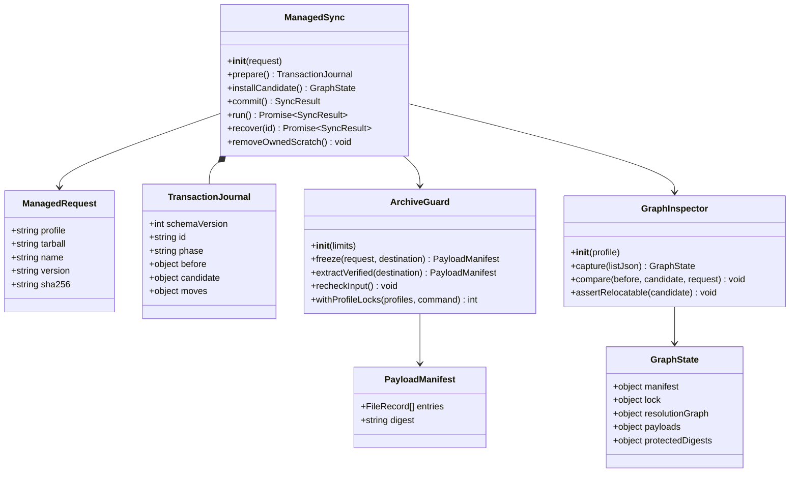
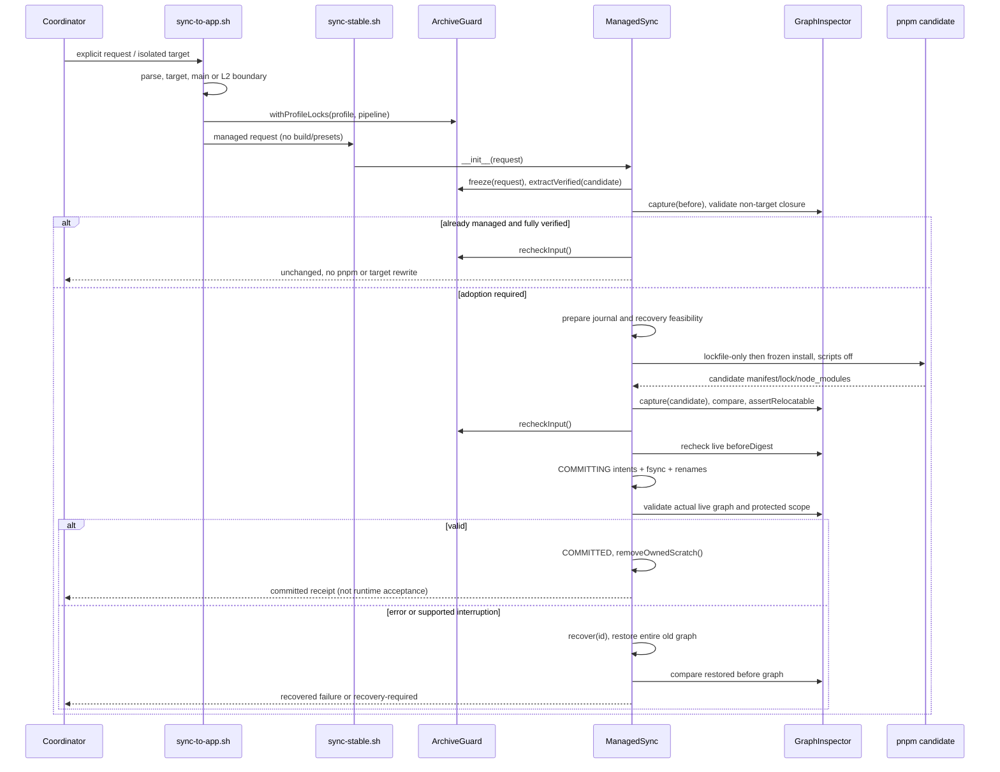
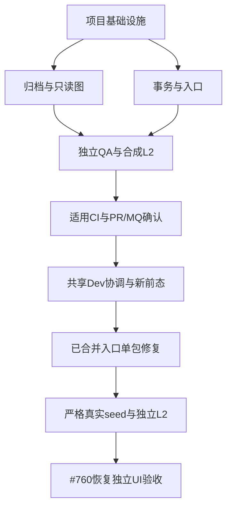

# Issue #778 — 单包 tarball 纳管架构与工程顺序

> **历史横幅（2026-09-09，PR-D）：** 下文状态句、固定 SHA 与「未合入」表述是撰写当时的任务快照，不是当前仓库或 Dev 事实。私有 store、frozen-offline、copy 隔离原则可被稳定基线迁移复用；本文件不因此改写历史 QA 正文。现行默认种子与 D→C→S 见 [稳定基线迁移规格](2026-09-09-stable-baseline-migration.md)。

状态：**定向补工中，工程 IS_PASS: NO；未最终集成、未合入、未修复 Dev**。冻结补工接缝和写集以 [followup §3、§7](issue-778-managed-tarball-followup.md) 为准；T01 阶段证据见 [T01 报告](../implementation/issue-778-t01-followup.md)。固定 base / 本轮 HEAD：`580234923268673562cacb5cd01aebdb780339e1`。上游：[完整 PRD](issue-778-managed-tarball-prd.md)，A01–A12 全部为 P0。本设计只扩展本仓 Shell / Node / pnpm 同步链；不引入 Web 技术栈。

## #839 精确转换增补

以下正文的阶段状态是 #778 历史设计，不是实时部署证明。同包转纳管合同保留；#839 仅增加 [dev-pipeline 中的 #765 viewer 转换例外](../contracts/dev-pipeline.md#839765-viewer-精确转换例外)。不修改外层 Shell、fork wrapper、依赖获取模块或 package scripts。

转换 request 包含 `transition.before={tarball,version,sha256,receiptId,receiptDigest,payloadDigest,sourceSpec,peerDependencies}` 与 `transition.after={version,sha256,payloadDigest,sourceSpec,sourceRepo,sourceCommit,qaReceipt,qaReceiptDigest,peerDependencies}`；before 与 after 均由独立安全归档清单和实际 source/installed 比较证明。终态 receipt 保留该转换身份，活动 journal schemaVersion=2；既有 schemaVersion=1 继续恢复。无转换请求时原纳管行为不变。

v2 source 写集只新增 `(目标source, 本事务old-generation/同一目标source)`，以及已有 candidate source→live；逆向移动只能引用 durable intent。未提交恢复不需要归档或网络；COMMITTED 只清理，不承诺回滚。显式反向转换绑定成功正向 receipt 并重新执行候选、全图、备份和事务验证。

目标唯一 occurrence 的 version/payload 可按两份归档投影，非目标 nodes/payload/modes/edges/bins/absent 不投影。锁只允许精确目标 package 项的 version（目录锁可能省略）及已验证 peer range 变化；importer locator、peer context、snapshot依赖边及全部非目标字段逐项冻结，不使用递归字符串替换。候选由真实 pnpm strict-peer 校验；新依赖获取范围不扩展。

工程测试与共享验收分开：本地 synthetic 事务、拒绝和恢复测试完成后交独立 QA；主理人按非 UI 工具 Git 门禁合入后才可执行共享 Dev 转换。viewer 既有独立 release QA 只作为输入证据，不重复其源码检查。

## Part A：系统设计

### 1. 实现选择与已核实能力

**结论：在现有入口增加互斥的 managed-tarball 模式，采用“冻结输入 → 私有候选依赖图 → 全图比较 → 短提交窗口 → 可恢复事务”。pnpm 只在候选目录运行，绝不在真实 profile 上试装。** 不给普通同步套用新内容过滤规则，不另建 deploy CLI。

| 已读依据（固定 base，除特别注明） | 能复用 / 不能据此承诺 |
| --- | --- |
| `scripts/sync-to-app.sh:48–115,153–259,498–521` | 目标解析、main 门槛、L2 显式目标白名单、稳定同步调用。现有非 Git / 缺 origin 跳过及只检查 ahead 不足以证明精确对齐；新模式必须补严格检查，不借这些路径放行。 |
| `scripts/sync-stable.sh:237–335,339–368,383–523` | 受管来源和 kit 前置校验有现成规则；普通路径过滤 test/node_modules、改 kit spec、改 bundle 次序，不适合原内容纳管。新模式必须在这些写入前分流。 |
| `scripts/sync-stable.sh:584–790` | 已有 pnpm 和包身份/打包清单核验；只恢复选中入口，不恢复 manifest/锁/全图，且 `npm pack --dry-run` 清单不等于 tarball 全清单。不能作为本模式事务保证。 |
| `scripts/materialize-with-rollback.sh:78–131` 与 `scripts/sync-targets.test.mjs:698–751` | 已认识到完整 node_modules 拓扑恢复的必要性；但只保存一个 source、无持久提交状态、失败后删除恢复目录。借鉴完整图边界，不嵌套调用此 wrapper、不再套一层 cp 回滚。 |
| `scripts/dev-env.sh:223–387,654–767` | 原样严格 seed 检查、相对 source/锁复制、私有 store 和真实 Host 启动可复用；不修改该文件。已有 start 以日志 URL 判成功，QA 另核 PID/监听与功能，不拿返回 0 作全部证明。 |
| `scripts/dev-env-deps.test.mjs` | 已有合成 seed 和假 Host/假 pnpm，适合负例，不是真实 L2 运行证据。 |
| `scripts/sync-targets.test.mjs` | 已有真实 pnpm 的本地 file 包、hoisted、同版本刷新、失败恢复测试；继续扩展，不重造 pnpm 安装器。 |
| `package.json`, `pnpm-lock.yaml`, `plugins/omnimux/package.json` | pnpm 固定 11.7.0；Node `^22.19.0 || >=24`；已有 `yaml@2.9.0`（Hub 依赖）、`node:test`；根脚本应声明自己直接消费的 yaml，不能依赖 Hub 私有路径解析。 |
| 桌面 fork `scripts/omnimux.mjs:25–57,148–153`（本轮只读） | `OMNIMUX_PRODUCT_DIR` 选产品树，sync 参数原样转发、cwd 为产品树。无需跨仓改动；tarball 要求绝对路径，避免调用 cwd 歧义。 |
| `scripts/impact-matrix.mjs`, `.github/workflows/quality-gate.yml` | 当前脚本/合同变更不自动要求浏览器；CI 未执行所有 sync 测试。需把新测试加入现有 CI，不改 required checks、判定器或标签机制。 |

完整读取的前序调查位于 repo `.worktrees/slot-mention-menu-760/docs/implementation/issue-760-dev-seed.md`。其 27 文件/hash/287 依赖均为历史；本轮没有读取真实 Dev payload，不声称它们仍成立。

**方案取舍：**
- 选择候选图 + 日志化短提交：旧 node_modules 在准备阶段不变，失败不依赖网络恢复；代价是临时磁盘和全清单扫描，以及必须协调无安装/seed 读取的提交窗口。
- 不选原地 `pnpm install` + 单入口备份：hoist、peer、锁、.bin/虚拟 store 会共同变化，无法保证一致前态。
- 不选全 profile 替换 / rebuild：会把配置、运行数据和凭据纳入交换面；超出单包授权。

### 2. 文件列表（后续工程，不是本轮写入清单）

| 文件 | 动作与职责 |
| --- | --- |
| `package.json`、`pnpm-lock.yaml` | 根工具直接声明已有版本 `yaml: 2.9.0`，增加 `test:managed-tarball`；禁止升级其他依赖。 |
| `.github/workflows/quality-gate.yml` | 现有 job 补装同版本 yaml、固定 pnpm、Python，增加新模式隔离测试；保留既有 job 名、触发、聚合与全部原检查。 |
| `scripts/sync-to-app.sh` | 新参数、严格目标/main 检查、锁覆盖整个目标写入区、无 build/kit 写/presets 的单包分支。 |
| `scripts/sync-stable.sh` | 新模式调用内部协调器；旧模式保留原行为但共用互斥锁和待恢复事务拒绝。 |
| `scripts/managed-tarball.mjs` | 唯一内部协调模块：解析请求、candidate pnpm、状态日志、提交、恢复、脱敏结果；无独立运维公开入口。 |
| `scripts/managed-tarball-archive.py` | Python 标准库：安全归档读取/清单/解包、严格 JSON、POSIX 文件锁 runner；不实现 pnpm/部署逻辑。 |
| `scripts/materialize-graph.mjs` | 只读 manifest/锁/安装图/完整文件树指纹，非目标比较、相对闭包验证；yaml 解析复用库。 |
| `scripts/managed-tarball.test.mjs` | 请求、安全归档、漂移、幂等、来源冲突、拒绝跨目标与脚本执行。 |
| `scripts/managed-tarball-transaction.test.mjs` | 真实 pnpm、全图保持、故障/中断恢复、搬迁重建。 |
| `scripts/managed-tarball-l2.test.mjs` | 合成 seed 经原 dev-env 初始化回归；真实 Host 验收由 QA 运行同一正式入口并留证。 |
| `scripts/sync-plugin-scope.test.mjs`、`scripts/sync-bypass.test.mjs`、`scripts/sync-targets.test.mjs` | 更新测试夹具所需脚本和生命周期配置；新增锁/待恢复拒绝，保留旧命名/全量模式断言。 |
| `docs/contracts/ops-entry.md`、`docs/contracts/dev-pipeline.md` | 记录显式纳管例外及恢复命令，不放宽 L2 或普通缺源规则。 |
| 本文、`docs/specs/issue-778-managed-tarball-class.mermaid`、`docs/specs/issue-778-managed-tarball-sequence.mermaid` | 设计真源与同任务图。 |

只读依赖：`scripts/resolve-omnimux-profile.sh`、`scripts/dev-env.sh`、`scripts/materialize-with-rollback.sh`、`scripts/impact-matrix.mjs`、`scripts/ci-verdict.mjs` 及已有测试/政策。不改插件源码、官方依赖/安装层、桌面 fork、App 或 #760 UI。

### 3. 参数、数据与安全契约

#### 3.1 公开 CLI

```sh
# 以下为待实现契约，不是本轮已执行命令；从桌面 fork 发起
OMNIMUX_PRODUCT_DIR="<已合并且干净的产品 main>" yarn omnimux:sync \
  --managed-tarball="<绝对本地.tgz路径>" \
  --expect-name=@crosery/dsh-viewer --expect-version=0.1.0 \
  --expect-sha256="<经授权来源重新核验的64位hex>" --target=dev

# 同一入口恢复未完成事务；只恢复，不继续新安装
OMNIMUX_PRODUCT_DIR="<同版本或兼容恢复器的干净main>" yarn omnimux:sync \
  --recover-managed-tarball="<transaction-id>" --target=dev
```

- 四个纳管参数均必填，只出现一次；精确版本为完整 SemVer 字符串（禁止 range/tag），完整 name 为单个合法 npm 包名。只接受已在 profile dependencies 存在、已安装且 name/version/payload 与输入一致的包；本次真实授权仅 viewer 0.1.0，不是增装任意包许可。
- 只接受本地绝对普通文件 `.tgz`/`.tar.gz`；不接受 URL、目录、stdin、glob、多包、软链接输入、特殊文件或多个目标。原输入在 profile/source/node_modules/事务区内部时拒绝。
- 与插件位置参数、`--skip-build`、`--prod/--dsh/--all` 及别名、混合/重复 target、非空 `OMNIMUX_SYNC_TARGETS` 冲突即 exit 2，不沿用“未知目标忽略”行为。
- 默认 Dev 或精确 `--target=dev`；唯一额外目标为 `$HOME/.dsh-dev/tasks/<task>` 下的隔离合成样本，必须显式 `--target=<任务根>` + 现有 `OMNIMUX_ALLOW_UNMERGED_TARGET=<同根>`。canonical identity 和祖先 lstat 双检，拒绝别名指向 Dev/Prod/官方目录、`..`、嵌套 task 和 profile symlink；不是泛化任意路径授权。
- Dev 新模式必须 Git 存在、branch=main、clean、HEAD=当前已核对 origin/main、主理人持有真实 MQ merge receipt；缺 origin/落后/领先均拒绝。恢复不要求原 tarball 存在，但须绑定同 profile/事务 schema；不引入“允许未合并 Dev”恢复旁路。
- helper 内部 request 使用 JSON stdin，不用 eval/命令拼接；pnpm 用 argv spawn。恢复模式与纳管身份参数互斥，txn ID 不得作为任意路径。

结果格式（stdout 最终一条 JSON，进度 stderr）：`{schemaVersion:1,status,phase,transactionId,target,name,version,sha256,beforeDigest,afterDigest,changedPaths,code,message,recovery}`。`status=committed|unchanged|recovered|rejected|recovery-required`；不打印 `.npmrc`/settings/token 或原始子进程敏感输出。exit：0 提交/幂等/恢复成功，2 参数，3 输入/安全，4 前态/并发/冲突，5 candidate/比较失败且目标未写，6 提交失败但已恢复，7 恢复不完整（阻止继续）。恢复成功与 seed 修复成功分开。

#### 3.2 归档与输入冻结

复用 Python `tarfile`、`gzip`、`hashlib`、`json.object_pairs_hook`、`os.open(dir_fd=..., O_NOFOLLOW)`，不用 shell `tar -x` 或自制 tar header parser。Python >=3.12，启动检查能力；本轮可用 Python 3.14.6。选用 `extractfile` 流式复制已批准的普通成员，不使用默认 extractall 信任策略。

固定限值：压缩输入 **128 MiB**，展开 payload **512 MiB**，单文件 **128 MiB**，归档成员 **10,000**（文件+目录），单路径 UTF-8 **1,024 bytes**，目录深度 **32**，package.json **1 MiB**，总解码 tar 流 **544 MiB**（含 header/PAX/padding）。限制实际读出字节，不只信 header。限值不是 CLI 可调旁路，超限须另行评估。

1. 对输入及祖先作 lstat/realpath；打开 no-follow FD，记录 dev/ino/size/mtime/ctime；从 FD 限量复制为事务私有只读冻结文件并计算 SHA256。原路径和 FD 在复制后及提交前重验身份/hash；任何漂移停止。归档检查和 pnpm 只消费冻结内容。
2. gzip 必须完整 EOF/CRC，拒绝截断和无效尾部；以限量解码层约束 tarfile 读取（包括扩展 header）。仅一个规范 `package/` 根，拒绝绝对/驱动器/UNC、反斜杠、NUL/控制字符、空段、`.`/`..`；禁止通过规范化“修好”非法路径。
3. 仅 regular file/directory；软/硬链接、FIFO/device/socket、sparse、未知类型拒绝。PAX/GNU 名称扩展只能解析为同样安全的有效路径；拒绝 linkpath、sparse、未知改变提取语义的扩展。检查重名、文件/目录冲突、大小写折叠/NFC 冲突，确保 macOS 大小写不敏感卷也不覆盖。隐式父目录可补建；重复显式成员拒绝。
4. 普通文件保留 bytes 和 `mode & 0777`；拒绝 setuid/setgid/sticky，拒绝不能被当前进程读取/遍历的权限。不恢复 uid/gid、ACL/xattr。目录先私有可写，全部完成后设最终模式。权限之外的内容不因 pack 的 files/.npmignore 规则过滤，包含 test、隐藏文件、内嵌普通 node_modules 成员。
5. package.json 必须 UTF-8、合法 JSON 对象；递归拒绝重复键、NaN/Infinity/尾随内容。name/version 精确相同；原始 package.json bytes 保留，不重写 peer/main/exports/dsh/patch。
6. 暂存根 0700；逐段 dir_fd/no-follow 创建、O_EXCL 写文件，写前/提交前检查 source 祖先和根 inode，防止已存在父 symlink 越界。目标 snapshot 已存在且全清单不同即拒绝，不覆盖；完全一致可复用。输入与已安装目标全 payload 比较，不只三个入口。

#### 3.3 状态模型与接口

下图为模块接口模型；实现使用函数模块+JSDoc 类型，不要求新增面向对象框架。

**补工冻结合同（T01 先行，不代表 T02/T03 已实现）：**

| Owner | 接缝 | 不可变保证 |
| --- | --- | --- |
| T02 | 保留 inspect/extract/lock/pending；`freeze(request, destination)`、`safeMove(profile, txnId, from, to, expected)`、`probeRecovery(paths)` | freeze 返回 entries/digest/identity；identity 数值用十进制字符串；safeMove 为 journal 四项白名单、dir_fd 锚定，返回两端身份；JSON 不传命令文本 |
| T02 | `GraphInspector.capture({listJson})`、compare、assertRelocatable；`prepareCandidateDependencies({candidate, privateRoot, beforeLock, request, config, runPnpm}) -> {lockDigest, storeRef, acquisition}` | 只写 candidate/privateRoot；先比非目标锁再安装，脱敏结果；允许同步 capture，由 T03 runner 预取 listJson |
| T03 | `runPnpm(argv, {cwd, env, signal}) -> Promise<{code, signal, stdout}>`；`ManagedSync.run/recover -> Promise<SyncResult>` | pnpm 11.7、限输出、超时、可终止并 wait；调用端 await，活动句柄不入 journal |
| T03→T01 | `RecoveryInput={transactionId, sourceProfileDigest, paths[2], sha256[2], mode[2]}` → `RecoveryReceipt={batchId, verified, digest}` | T03 两份非秘密 staging；T01 共享工具 capture＋独立恢复演练；未 verified 不进入 PREPARED；不增加公开 backup CLI |
| T01 | 公开 CLI 与 SyncResult schemaVersion:1 原样 | 普通同步不引入 managed 内容过滤，复制脚本的 fixture 带完整 helper 闭包 |

helper 当前 inspect/extract 异常 exit3、check-locks 无继承 FD exit10、lock 转发子命令码；pending 当前缺损 journal 行为仍待 T02 修复。T02/T03 必须保留这些既有 action 的调用兼容，并按动作/事务阶段映射：归档输入拒绝→Node3；前态/锁冲突→Node4；候选能力/图失败且未发布→Node5；发布失败且已完整恢复→Node6；恢复或 journal 不确定→Node7。exit10 仅为内部请求获得锁的握手，不能直接当成功。安全检查失败不能统一包装为 recovered；具体错误细分由 owner 实现并测试，不新增另一套公开 API。



`FileRecord={path,type,size,mode,sha256}`；symlink 只允许出现在经核验的 pnpm 安装图，另记 linkText/解析目标，不跟随到 profile 外扫描。`GraphState` 保存前态 raw manifest/lock 摘要、节点 identity/integrity/peer context、边、实际解析目的包、完整 payload 清单；protectedDigests 覆盖非目标 sources、workspace/.npmrc/patch、bundles、kit、settings/presets/data 哨兵（秘密仅 hash，不复制到证据）。未知布局或闭包无法完整枚举时停止，不报告“比较通过”。

### 4. 事务调用顺序与恢复

#### 4.1 私有候选与 pnpm 闭包

事务工作区为 profile 内 `.materialize-transactions/<id>/`：input、candidate、journal、old-generation。它是有限状态事务的活动数据，不是历史备份或第二套 profile；禁止定时副本、`.bak`、时间戳备份。**不要整份复制 live profile。** candidate 仅复制只读已验证的 managed sources、manifest、lock、workspace 配置；不复制 live node_modules、settings、数据或原 `.npmrc`。本模式不会 build、改 kit、prune、normalize bundles。

- 前态必须有锁、workspace、目标安装 payload；除明确目标外，所有 file 依赖精确受管且源/安装一致，禁止 link/self-reference/外部 tarball、不全的 source、kit 漂移、身份不符。对整个图检查，而非仅产品默认清单。kit 比较沿用权威源只读判定，绝不构建。目标只允许“当前输入 tarball spec”或“同内容受管 spec”，拒绝任意 registry/其它 tarball 换源。
- 前态已经是精确受管spec且source/installed完整清单、锁/图全部合规时，完成输入重验后直接返回unchanged；不运行pnpm，不创建第二个安装图。其余候选 manifest 仅替换 `dependencies[name]`，其余字段语义完全相等（bundle 数组逐项/顺序完全一致）。候选 source 保留完整清单，不能拿 node_modules 反向生成 source。
- 使用 repo 固定 pnpm 11.7.0，拒绝不兼容锁 schema。复用有效解析配置（nodeLinker/hoist/overrides/peer settings），但禁止 workspace 指向候选外、绝对 virtualStore/modulesDir、自定义 pnpmfile/config JS、package-manager 自动下载/切换等执行钩子。`.npmrc` 不复制：从只读配置提取非秘密、已支持的解析设置；未知且影响安装的配置拒绝，不能静默丢弃。私有 store 固定到事务区，无共享 store 写入。
- 所有阶段强制 `--ignore-scripts --ignore-pnpmfile --package-import-method=copy`，最后安装必须 `--frozen-lockfile --offline`；不用 `approve-builds`、`rebuild`，不新增 allowBuilds。移除外部 npm/pnpm config 与 NODE_OPTIONS 注入；HOME/config/cache/state/global-dir/TMP 全部私有，禁 Corepack 自动下载或切版。
- 候选锁生成后先比较非目标锁节点、边与 integrity；仅等价候选可用 pnpm 受控获取已锁定公开 registry 包到同一私有 store。目标 viewer 仍来自本地 tgz，不远端替换。拒绝凭据、未知 registry、git/任意 URL 和越权重定向。不能把含旧 viewer 外部 tarball 的前态锁直接 fetch，不手写 registry 子锁，不实现 pnpm CAS 搬运器。已有任务私有 cache 可直接离线复用；最终冻结离线安装证明闭包完整。获取与异常矩阵由 T02 实证，不把此设计当实现 PASS。
- 实际命令按两阶段：`corepack pnpm install --lockfile-only --no-frozen-lockfile <安全参数>` 仅候选生成必要锁；比较图通过后 `corepack pnpm install --frozen-lockfile --offline <安全参数>` 生成完整候选 node_modules。缓存准备不更改受管业务状态。工程须核对 11.7.0 的参数实际行为，故障/脚本哨兵证明参数生效；不以文档推导代替测试。
- 不假定 pnpm 只动一条锁：yaml `parseDocument` 拒绝重复键/错误，比较 `settings/importers/packages/snapshots`。仅将目标旧 tarball locator 映射到精确 managed directory locator；其 resolution/specifier 可变，其 name/version/peer context/依赖边/integrity 对应内容须等价。其他节点的 name/version/integrity、peer context 和依赖边不得变化；任何无关 lock 删除/新增、peer 重解或依赖升级即拒绝。
- 完整安装图比较使用 pnpm list JSON + lock snapshots，并用 Node `createRequire(...).resolve` 和文件路径验证每个声明依赖/peer 的实际目标（不 import/require 包代码）。记录 .bin 和嵌套/hoist 拓扑，布局可不同，但同一消费节点的解析身份与完整 payload 必须相同；非目标包缺文件、native/build 产物丢失、幽灵依赖用途无法判明均拒绝。不能只比较顶层 versions 或三个文件。
- 校验所有目标 tarball 普通文件/目录（字节+模式+路径），新源和安装 payload 全集合相等。pnpm directory file 重打包导致 files/.npmignore 丢成员时 **停止**，不手工补 node_modules、不修改 package.json、不改为新 tarball。对于已有 viewer 是否完全可保留，由新前态+真实 pnpm测试决定。
- 锁无输入路径、旧 profile/candidate 绝对路径或未受管 file；安装符号引用不回指 candidate/source 外部，.modules.yaml 的 store 指向保留的事务私有 cache 位置，不删除仍被元数据依赖的 cache。用不同目录仅 source/锁/非秘密必要配置重新冻结安装证明可搬迁，不复制原 node_modules/.npmrc。

#### 4.2 互斥、提交和中断

同 profile 的普通 sync 与新模式共用 Python `fcntl.flock` 非阻塞锁（稳定 lock 文件；不可删除后重建造成两把锁）。锁 runner 持有 FD 执行原同步体；Shell 私有 continuation 不得由环境布尔值免检，必须验证继承 FD 与 canonical profile lock inode。多目标普通 sync 按 canonical path 排序持锁防死锁，新模式仅一个。锁范围从首次目标写入前至结束，包括普通模式 kit/presets 阶段；两个脚本直接调用也不能避开锁/待恢复检查。不要改变旧模式业务逻辑。最小实现采用持锁runner重入原Shell脚本，重入重新解析argv并验证继承FD；原父进程不执行后续写入。sync-stable验证并复用相同FD，不二次申请导致死锁。禁止eval输入或仅凭环境变量声称已持锁。

锁只约束合作入口，不控制 App/人工/旧版本脚本。**主理人仍须协调窗口，暂停该 profile 的包安装、配置编辑及 seed 克隆；不假定文件锁能冻结公共进程。** 首次写前、commit 前复算受保护面和候选摘要。任何无关写入均拒绝；配置/数据不在事务写集，不通过回滚覆盖他人变化。运行 App 可继续处理已加载代码，但提交窗口不得发起新的依赖加载/seed 读取；不能确保安静窗口则不提交，若必须重启/停 App 需另行确认。

提交写集仅四项：目标 source（仅缺失时新建）、`package.json`、`pnpm-lock.yaml`、**整个 node_modules**。非目标 sources/workspace/.npmrc/bundles/config/data 不写。

1. `PREPARED`：全部安全、前态、磁盘空间、同文件系统、恢复权限校验完成；候选 graph 已验证。不能由 Git 恢复的最小非秘密 manifest/锁恢复点按 agent-backup 由执行 owner 捕获并实际恢复演练；依赖树不塞入通用 backup。Git 中干净脚本不冗余备份。
2. `COMMITTING` 前 fsync candidate 内容、journal、父目录。每次 rename 前写 intent 并 fsync，rename 后写结果；记录 src/dst、inode、内容 digest、旧 source 是否缺失，不能只记录一个“成功步骤号”。
3. 保留旧 manifest/lock；将 live 完整 node_modules **同文件系统 rename** 到 old-generation（不复制、非 hardlink 快照），随后将已验证候选 node_modules rename 到 live；安装目标新 source，再以 rename 发布 manifest/lock。可按反向顺序恢复每一步。旧源若已相同只引用不移动；失败时删除的只能是 txn 本轮创建且 digest 相符的 source/父 scope 目录。
4. 在实际 live 路径重做图解析与四项一致检查及保护面比较；成功 fsync 后写 `COMMITTED`。只有此状态才输出 committed；复制/安装成功不是完成。
5. COMMITTED 后清除活动旧图和不再需要的 candidate/input，保留小型脱敏 receipt。仍被 pnpm 元数据引用的私有 cache 保留为受管安装缓存，receipt 指出；下一次 pnpm操作必须能识别同一 cache。不新增后台清理计划。
6. 普通异常/SIGINT/SIGTERM：先终止并回收候选 pnpm 子进程，再恢复。commit 中 SIGKILL/进程崩溃：下一次任意 sync 检测非终态 journal 即拒绝；明确 `--recover-managed-tarball=<id>` 才恢复。恢复时先确认无原 worker/pnpm 存活、journal/profile/schema/路径/inode相符，再依据 intent+两端实际存在性反向归位；模糊/被他人改动时 exit 7，保留全部数据与锁保护，不强删。
7. 恢复不跑 pnpm、不依赖原 tgz/store/network；移回完整旧 node_modules、raw manifest/锁及 source 存在状态，完整对比 before graph+payload 后写 `ROLLED_BACK`。恢复前态可能仍是非受管 viewer，但必须与操作前一致且原依赖仍可解析。

**保证范围：**事务完成或受支持恢复完成后全图一致；不是 POSIX 多路径瞬时原子交换。进程中断后存在需恢复窗口，所有合作 sync 被阻止，环境 owner 在恢复前不得发布 seed。掉电耐久性依赖本地文件系统 fsync/rename，硬件损坏、磁盘永久不可写或不合作写者不承诺自动恢复，应保留现场 BLOCKED；不能把这一限制包装为成功。



### 5. 未决与实施前硬条件

设计无需用户再选择方案，但以下事实不能预先宣布已满足：
- 当前真实 viewer hash、完整 payload、安装图、配置/kit 状态；A11 窗口重新读。不得把历史 hash直接写进执行参数，也不得修改期望值迎合漂移。
- pnpm 11.7.0 对当前包目录 packing、peer/hoist、native 产物及私有 cache 的表现：T02/T03 真实隔离测试证明；不等价即停，不加入内容补丁或 build 许可。缓存获取和特定安装布局可能阻断真实操作，工程须在首次业务写入前报告。
- 真实 Host `$DSH_SRC` 已安装闭包能否启动：本轮未运行；不能靠新增官方依赖解决。若不完整，由主理人处理另一个有授权的安装层问题，不能改 seed gate。
- 原 main 有他人 Market/Hub 修改：不能 stash/reset/移动它们。合入后仍须由 owner提供真正干净、已对齐 main 操作面；不得将 #760/#765 等工作树源码作为 sync source。
- Python/同文件系统/配置能力不满足、共享窗口不具备，都是具体前置失败；不引入 fallback 原地安装。`agent-backup` 对非秘密配置可用，但全图恢复由事务负责；通用备份不保证应用一致性。

## Part B：工程任务与验收

### 6. 所需包与机制

- `yaml@2.9.0`：项目已有版本，提升为根工具直接 devDependency，解析 pnpm YAML AST/重复键；不新增官方包，不依赖 Hub 内部代码。
- `pnpm@11.7.0`（现有 packageManager）：唯一依赖图生成器，使用既有 corepack；不升级。
- Node 内建 `fs/path/crypto/child_process/module/test/assert`：协调、全清单、测试；根 engines 保持。
- Python >=3.12 标准库 `tarfile/gzip/json/hashlib/os/fcntl`：避免手写归档解析器与跨平台 stale PID 锁；无 pip 包。
- Bash、既有 profile resolver、Git、rsync（既有普通链）：复用，不新增部署框架。

参考能力依据：[pnpm install 官方文档源](https://github.com/pnpm/pnpm.io/blob/d650a727/docs/cli/install.md)、[pnpm settings 官方文档源](https://github.com/pnpm/pnpm.io/blob/d650a727/docs/settings.md)、[Python tarfile 文档源](https://github.com/python/cpython/blob/fad06746/Doc/library/tarfile.rst)、[yaml options](https://github.com/eemeli/yaml/blob/ce14587484822bffb0f7d31aefedcaf2dc0d0387/docs/03_options.md)。资料证明库能力，不证明本仓新实现已通过。

### 7. 任务列表（最多五项，按依赖）

| ID / 优先级 | 任务 | 源文件（每项至少三项） | 依赖 / 完成条件 |
| --- | --- | --- | --- |
| T01 / P0 | 项目基础设施 | `package.json`、`pnpm-lock.yaml`、`.github/workflows/quality-gate.yml`、`scripts/sync-to-app.sh` | 无；配置、依赖声明、入口占位/参数分流统一一项，失败默认关闭；CI 保留原 gates 并接入测试，不跑全 workspace install 触碰本地 kit。 |
| T02 / P0 | 安全输入与只读图核验 | `scripts/managed-tarball-archive.py`、`scripts/materialize-graph.mjs`、`scripts/managed-tarball.test.mjs` | T01；全归档清单、限额、重复 JSON、有效路径、非目标锁/解析/内容比较；可与 T03 的锁/journal 单元工作并行。 |
| T03 / P0 | 现有链事务集成与恢复 | `scripts/managed-tarball.mjs`、`scripts/sync-to-app.sh`、`scripts/sync-stable.sh`、`scripts/managed-tarball-transaction.test.mjs`、`scripts/sync-plugin-scope.test.mjs`、`scripts/sync-bypass.test.mjs`、`scripts/sync-targets.test.mjs` | T01；验收依赖 T02。候选 real pnpm、共享锁、准确 no-op、持久日志、每个 rename 故障和 kill 恢复；普通模式不回归。 |
| T04 / P0 | 独立 L2 与交付合同 | `scripts/managed-tarball-l2.test.mjs`、`docs/contracts/dev-pipeline.md`、`docs/contracts/ops-entry.md`、本文 | T02、T03；A01–A09 独立 QA，真实合成 L2；A10 MQ；A11/A12 合入后协调执行。T04 是证据/运行路线，不在本次架构阶段执行。 |

顺序：T01 → T02/T03模块自检 → T03集成 → T04独立QA/CI → MQ确认 → 协调Dev → 正式纳管 → 真实seed/L2 → #760独立QA。所有正式脚本/合同/CI改动按 **R1**，不走 `auto:run` 的 R2/R3无人值守通道。

### 8. 共享工程约束与可执行验收路线

#### 合并前：机制验证不依赖已经修好的真实 seed

1. 所有测试使用任务私有 HOME、source、store 和哨兵；显式禁用 credentials seed。测试 fixture只写自有范围，绝不读取真实 Dev 作为夹具。假 pnpm/假 Host 只标“单元/故障注入”，必须另有真实 pnpm和真实 Host。
2. 合成 profile 从受控本地样本建立：目标 scoped tarball包含 main/client/patch/peer、隐藏/test/嵌套文件、特殊模式；非目标至少两个包和传递/peer/hoisted依赖、kit 与 source 哨兵。初始目标以该合成 tarball安装，保存全前态；新模式纳管它。另测 files/.npmignore会导致缺成员的拒绝用例，不裁剪输入假通过。
3. 通过公开转发链验证参数：`OMNIMUX_PRODUCT_DIR=<本任务树> yarn omnimux:sync ... --target=$HOME/.dsh-dev/tasks/managed-tarball-778-seed`，同时设匹配 `OMNIMUX_ALLOW_UNMERGED_TARGET`；fixture profile名严格由现有resolver产生。无需修改fork或放宽main gate。只允许测试样本，不带#760未合并UI。
4. 成功后把该 **明确标注 synthetic** seed 通过原 `OMNIMUX_L2_SEED_PROFILE=<合成profile>` 输入正式 `yarn omnimux:dev start managed-tarball-778-l2 <本任务已有未改插件> --source=<本任务worktree>`。为免 start复制本机settings，预先在私有task home写无秘密合成settings，明确私有DSH_DEV_HOME/DSH_HOME；不拿环境默认fallback充当隔离。SOURCE精确本任务plugins，单link上限不变。
5. 两类验收分开：假DSH_SRC夹具覆盖严格seed拒绝和克隆行为；**真实已安装DSH_SRC** 启动证据覆盖A09，使用可启动的合成bundle/patch与必要官方base/web装配（来自安装层投影，不新增profile官方依赖）。保留task、SOURCE、commit、profile、URL/port、PID/启动时间、真实日志；核对服务注册/目标合成插件的可读RPC或HTTP业务返回、静态payload指纹与无装配错误，不能只有HTTP200。若现有接口不能表达断言，由测试样本在自己的bundle提供只读fixture端点，不加产品运行特性。
6. #778真实diff仅脚本/测试/合同，不改Host/Client/Stage/Electron行为：按 plugin-qa“纯逻辑/运行依赖”做上述集成，browser/Electron为 **N/A（理由：无UI或壳层行为变化）**，不是skip=PASS。独立QA核对 `impact-matrix` 真实diff；一旦实现扩展到UI/壳，按原矩阵加证据，不改判定器。
7. 普通命名sync、scope/bypass/targets/deps/source测试及 `pnpm test:gates` 全通过；新事务测试必须覆盖真实pnpm，而不是仅stub。已有fixture缺少 `plugin-lifecycle.mjs` 等依赖时只修夹具装配，不删断言/跳过失败。

建议工程命令（待执行）：

```sh
bash -n scripts/sync-to-app.sh scripts/sync-stable.sh
node --check scripts/managed-tarball.mjs
node --check scripts/materialize-graph.mjs
pnpm test:managed-tarball
node --test scripts/sync-plugin-scope.test.mjs scripts/sync-bypass.test.mjs scripts/sync-targets.test.mjs scripts/dev-env-deps.test.mjs scripts/dev-env-source.test.mjs
pnpm test:gates
git diff --check
```

| PRD | 工程/QA必须保留的最小证据 |
| --- | --- |
| A01–A03 | 四参数所有缺项/冲突、目标边界、wrong name/version/hash、校验后替换输入、链接/越界父、重名大小写/NFC、截断/扩展header炸弹、各限值边界；目标与边界外哨兵零写。 |
| A04–A06 | archive/source/installed完整清单；bundle/peer/main/exports/patch字节或语义原样；锁节点+边+实际解析+非目标完整payload比较；搬迁后禁用原输入、旧profile和旧node_modules仍可冻结重建。 |
| A07 | 非目标缺源/不合规file/kit漂移拒绝；相同输入无target写/不重复pnpm，冲突source拒绝；旧dev-env文件hash不变且严格负例仍失败。 |
| A08 | 解压/源准备/lock生成/install/每次commit rename/最终核验逐点失败；INT/TERM/KILL分别在准备和提交点；恢复器再次中断、日志损坏、外部漂移、第二个writer、磁盘满/rename/fsync失败；恢复完成全前态逐项一致，未完成exit7且后续sync拒绝。 |
| A09 | 原测试+新真实pnpm结果、独立真实Host合成L2身份/集成；mock和静态证据单独标注。 |
| A10 | #778独立diff无#760 UI，独立QA签收；全部适用GitHub required checks和MQ checks；读回MERGED/mergedAt/mergeCommit。 |
| A11–A12 | 主理人协调窗口/owner、新tarball与前态清单、正式入口命令退出码/receipt、后态完整差异、原严格seed检查和真实Dev→新L2身份/集成；不宣称公共App已重载。 |

#### 合入后：真实修复，不借合成环境冒充完成

- 主理人在QA/CI通过后按已获授权走交互式R1 PR/MQ，不能用label代替真实条件。**A11/A12明确是合入后验收，不反过来要求先修Dev才能合入支持代码**；合入前A09由严格合成L2满足，不降低质量门禁。
- MQ确认后协调正在读seed的任务停止克隆/写入，指定唯一执行owner；取得干净、已合并main操作面。主checkout他人修改不触碰；未具备clean main则等待owner解决，不stash，不偷偷改用未合并树。
- 重新只读验证实际tarball provenance/hash与viewer安装全清单、配置/kit/图；与授权来源不同则停。完成恢复可行性和缓存准备后，经唯一公开sync链仅纳管viewer；保存四项前后及非目标证明。
- 再用真实Dev作seed经**原**dev-env正式初始化全新隔离L2并验证Host/装配。公共App未默认重启；磁盘纳管成功、L2加载成功、viewer真实交互通过分别报告。#760的ego-browser + verify:live、PR合入仍由#760独立任务完成，不被#778替代。

### 9. 依赖图



## 本轮交付边界

只编写本设计和同任务图；未实施源码、安装依赖、运行pnpm测试或Host、访问真实Dev、commit/push/deploy、修改其他workspace或成员直连。架构完成可交工程；Issue #778 尚不具备关闭条件。
