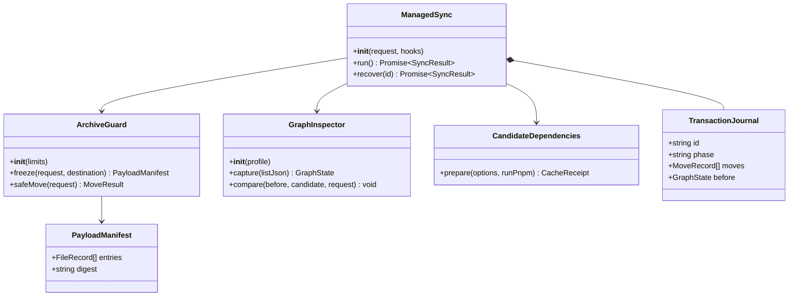
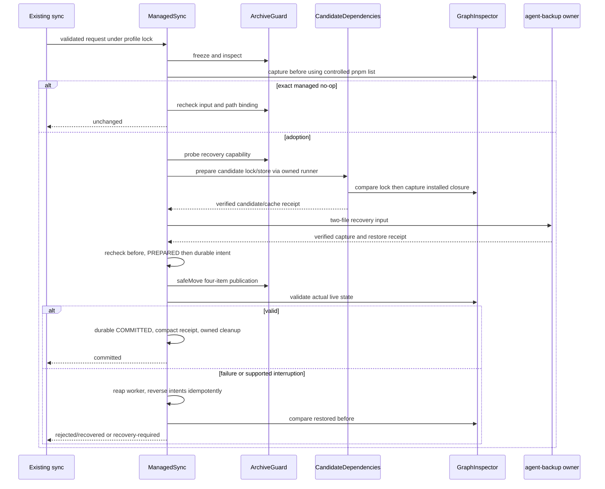
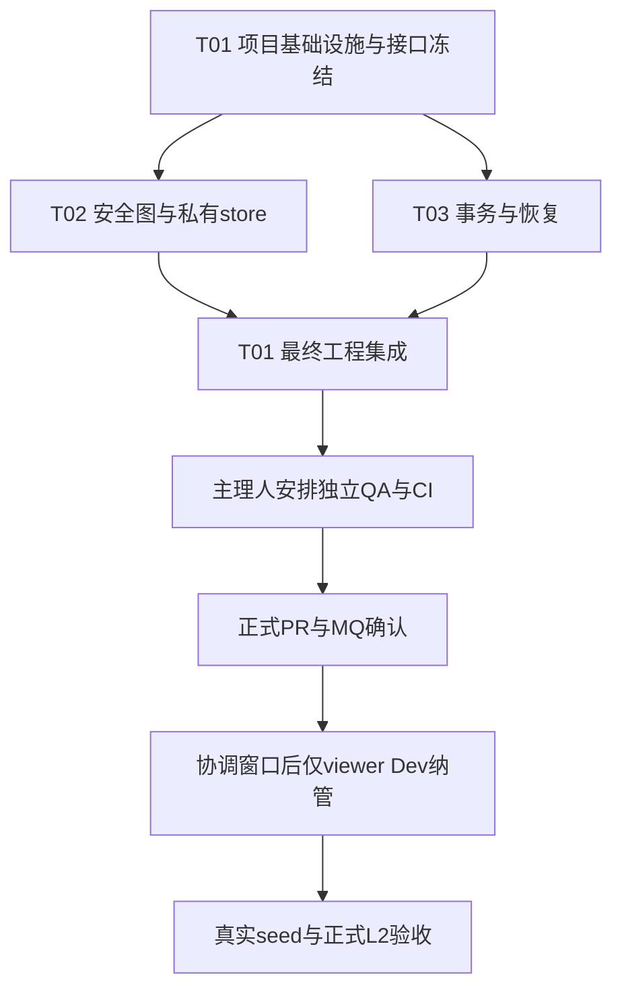

# Issue #778 — 有限设计复核与补工合同

**结论：IS_PASS: NO；可以继续定向工程，不是已交付，不具备合并或真实 Dev 操作条件。** 保留原 PRD A01–A12 全部 P0；本补充只纠正实现机制、细化可执行边界，不全面重写架构，不扩成通用软件发行系统。

## 1. 复核范围、证据与实现选择

- 固定 repo：`/Users/x/Desktop/Project/dsh-plugin/product/omnimux-dsh`；任务树：`.worktrees/managed-tarball-778`。
- 本轮核实 HEAD/base：`580234923268673562cacb5cd01aebdb780339e1`，未提交工程；只读 main 比较点：`0fe89ef047c687d156204fa48a177d92d590c6a4`。未 fetch、切分支、更新主树或执行工程测试。
- 完整读取：[PRD](issue-778-managed-tarball-prd.md) 1–83；[architecture](issue-778-managed-tarball-architecture.md) 分页 1–100、101–200、201–316；[工程报告](../implementation/issue-778-managed-tarball.md) 分页 1–50、51–91。另完整读取三个新实现模块及 release-policy fixture，定向读取合同、普通 sync 和原测试日志。
- 工程提供的结果：修订前 55/55，最终安全 32/32、定向 2/2、signals/relocation 4/4、scope/bypass/L2 15/15；targets 12/22、gates 121/128。不是本轮重跑，也不能拼成最终全绿。Host 44201 已启动后停止，尚无业务断言。
- 本轮证实：base→main 对两个 sync 脚本、targets/release-policy 测试、package.json、lock 无差异；任务对普通 sync 的增量主要为锁与 pending 检查。不能据此替代同环境运行归因。

**保留方案：**既有公开 sync → 私有候选完整图 → 比较 → 同文件系统四项发布 → journal 恢复。保留 Node/标准库 Python/pnpm/yaml，不增框架。

**拒绝方案：**原地试装加单入口回滚；全 profile rebuild；自制 registry CAS；为 native 执行构建；为目录 packing 丢文件补拷 node_modules。前者破坏一致性，后几项扩大授权或改变包内容。

## 2. 九类欠项裁定：最小必须修复与不必要扩展

| 欠项 | 必须补齐（均 P0） | 不需要／禁止 | 合同依据 |
| --- | --- | --- | --- |
| 普通 pnpm 刷新失败 | 先做 base/当前同条件对照；只有新增回归或确定为纳管后普通命名 sync 必经缺陷，才在原入口做最小修复 | 不凭 10 个失败重构普通安装器；不删锁、不手补入口、不默认全局 `--force` | PRD A07/A09；dev-pipeline 物化合同 |
| release-policy fixture | 复制脚本的三组 fixture 同步带上 `managed-tarball-archive.py`；确需时补独立 workspace 边界 | 不改 Alpha 产品策略、不删原断言、不用 stub 绕过新锁 | architecture §8 明确允许必要夹具装配；本次用户明确授权 |
| 图／embedded／native | pnpm list JSON、锁与磁盘发生实例三方核对；区分 tarball 自带 node_modules 与 pnpm 拓扑；native 文件完整内容比较 | 不因扩展名拒绝 `.node`；不运行构建；不支持任意包管理器／所有平台布局 | PRD A04–A06；architecture §4.1 |
| registry 私有 store | 支持锁定公开 registry 依赖进入私有 pnpm store，冻结安装、完整图不漂移 | 不造 CAS 搬运器、不全量镜像共享 cache、不写共享 store、不下载目标 viewer 替代 tgz | PRD §2 第35条、A05/A06；本次用户允许受控离线／在线私有获取 |
| 恢复可行性／备份 | 全候选空间、同 FS、正反 rename/权限/fsync 能力前检；最小非秘密 manifest/lock 恢复点与恢复演练 | 不备份全 profile/依赖树；不把备份工具当应用事务恢复器 | PRD 第37条、A08；architecture §4.2；agent-backup |
| 中断／IO／journal | 准备子进程回收、恢复再中断、各发布 rename 前后、ENOSPC/fsync/损坏日志明确状态 | 不承诺硬盘损坏或永久不可写自动修复；不要求所有故障排列的笛卡尔积 | PRD A08；architecture §4.2 保证范围 |
| receipt／漂移 | 活动 journal 保留恢复材料；终态压缩脱敏 receipt；PREPARING 外部漂移不得假称可覆盖恢复 | 不建审计平台、后台 GC、长留完整图；不删除仍被安装元数据引用的 cache | PRD A06/A08；architecture §4.2 第5条 |
| 解码内存／TOCTOU | 真正有界流读取，冻结输入不先无限 read；所有写入祖先 FD 锚定和竞态负例 | 不以 544MiB 解码上限宣称恒定内存；不靠 lstat 后路径 rename 防逃逸；不重写 tar parser | PRD A02/A03/第37条；architecture §3.2 |
| Host 业务证明 | 真实 Host 加载被纳管合成包，读取其只读业务结果并核对 payload/run 身份 | 不以监听或根路径 200 为 PASS；不把 #760 UI 或浏览器截图塞进本任务 | PRD A09；architecture §8；plugin-qa 适用矩阵 |

### 2.1 普通 sync 归因与条件性最小修复

现有 `sync-stable.sh:613–680` 移走选中安装入口后运行 pnpm；这段业务在 base 与比较 main 相同。**当前只有旧代码嫌疑，没有运行对照结论。** T01 在私有夹具内做四格对照：base 脚本＋原夹具、base 脚本＋必要隔离修正夹具、当前脚本＋同一修正夹具，以及纳管成功后的普通命名 sync。Node/pnpm 11.7.0、HOME、TMPDIR、workspace 发现边界、store、输入字节完全相同，输出具体失败 case/exit/入口与锁前后摘要。

- base 通过、当前失败：定位锁 runner 的 cwd/env/参数/fixture helper 回归，优先只修该接缝。
- 两者都失败且与纳管无因果关系：列为原基线或环境阻断，交主理人；不修无关旧缺陷、不降低 A09、required checks 或把失败标 N/A。
- 若证明纳管后既有命名 sync 必经相同缺陷：依据 A09 与 dev-pipeline 第45/47条，允许最小 pnpm 刷新纠正。先隔离验证 pnpm 支持的强制重装选项是否能在保留解析图/平台 optional 集合、禁脚本、私有 store 下仅恢复正确安装态；必须保留现有恢复和 fingerprint 验证。若选项引起额外解析／optional 安装，拒绝它，不转为删锁／改锁过滤／补拷。若最小方案不能成立，回传具体阻断，不默认给普通模式套整个新事务。

官方 install 文档说明 `--force` 可能安装不满足 cpu/os/arch 的 optionalDependencies；因此不能将其作为无条件一行补丁。原 gates 日志另明确 `Cannot find module 'react'`（149、168、206 行）及子夹具 pnpm **11.8.0 对 11.7.0** 冲突（239 行）；四个 live/stage 相关失败、一个 git-wt 聚合失败、targets、Alpha 共七项。不得简单写成“仅缺 jsdom”。先补正确隔离测试运行闭包和固定版本，不改 Stage/QA/版本门槛。

### 2.2 公开 registry 获取：可行性与安全合同

**裁定：公开依赖只读获取合理，属于恢复既有锁定安装闭包，不是新增／升级业务依赖。** PRD 禁止远端下载的是纳管目标输入；这里 viewer 仍必须来自授权本地 tgz。既有锁内公开 npm registry 依赖可由 pnpm 11.7.0 下载到候选私有 store；无需再次索要同范围许可。需要凭据、未知 registry、git/任意 URL、本地未受管依赖时停止，由主理人处理，不能静默转网络。

最小顺序：
1. 从已验证前态 sources/manifest/lock 建 candidate；仅替换 viewer spec。使用固定 pnpm `install --lockfile-only --no-frozen-lockfile` 生成候选锁，随后**先**比对非目标 lock 节点/边/integrity、manifest 和配置，拒绝漂移。
2. 候选锁已消除旧 viewer 外部 locator 后，复用 pnpm `fetch` 或等价的冻结 candidate install 向**同一私有 store**填充锁定包；最终 `install --frozen-lockfile --offline` 证明无网络依赖。不要拿仍含外部 viewer 的旧锁整份 fetch，不编造手写 registry 子锁。
3. 锁生成如需公开元数据，允许在 candidate 的受控获取阶段读取；任何新解析只可暂存在 candidate，比较不等价即失败且 live 四项零写。所有网络读取只面向已批准公开 registry 的锁定包，校验 integrity；拒绝锁中带认证信息/越权目标、重定向到未允许来源。
4. 各阶段 `--ignore-scripts --ignore-pnpmfile --package-import-method=copy`，禁配置执行、Corepack 自动下载/切版；HOME、store/cache/state/global-dir、日志和临时目录全部任务私有。只设 store-dir 不足以证明不写共享缓存。清除外部 npm/pnpm config、NODE_OPTIONS 等注入。
5. 若已有**任务私有**受控 cache，直接 offline 使用。只读共享 cache 可作为已核验数据来源，但 pnpm 的只读 side-effects 设置不等于整个 store 不写；没有成熟安全复用机制时，选择公开下载私有 store，不实现 CAS 私有格式复制器。
6. 最小实证为真实 registry 包的完整/缺失 cache、integrity 错误、断网、脚本哨兵、共享 store 前后摘要，以及搬迁后私有 store 冻结重建。可用任务内 registry HTTP fixture 定向故障，另有真实公开依赖私有获取证据；不能仅用两个 file 包代表 registry 可用。287 是历史图大小，不是要求构造恰好 287 个测试包或支持通用发行。

已核对官方源：[fetch](https://github.com/pnpm/pnpm.io/blob/d650a727425734598a1dea1904bea35a93fc0b83/docs/cli/fetch.md) 明确按锁/配置填充 virtual store、忽略 manifest；[install](https://github.com/pnpm/pnpm.io/blob/d650a727425734598a1dea1904bea35a93fc0b83/docs/cli/install.md) 明确 offline、frozen、lockfile-only、ignore-scripts 和 force 语义。**资料不证明 11.7.0 本仓实现已通过，参数与网络边界仍须工程实测。** T01 更新 dev-pipeline 第55条“仅离线”及架构 §4.1 的获取描述，保留最终冻结离线安装与全部安全限制。

### 2.3 图和 payload 的最小修正

`materialize-graph.mjs:130` 一律排除包下 node_modules，不能满足 embedded payload；`:131` 用 name/version/payload 合并节点，会把不同 peer/消费实例混为一体。补工必须以 **lock locator＋peer context＋安装 occurrence** 建节点，以 name/version/integrity/payload 作身份；同内容不同上下文不能折叠成一条边集合。

- `GraphInspector.capture` 交叉核验受控 `pnpm list --json --depth Infinity`、lock importers/packages/snapshots、磁盘实际解析。list 不是唯一真源；lock 中平台 optional 未安装必须记录有依据的 absent，不虚报缺包或全支持。
- payload 路径归属由批准 tarball/source 完整清单及 pnpm 的包根/锁映射共同确定。显式属于 archive 的 `node_modules/...` 仍是包内容；pnpm 创建的链接、虚拟 store、依赖目录单独归拓扑。歧义拒绝，不用目录名猜测。
- registry 原包内自带 native/预编译文件按普通 bytes/mode 保留。只有安装脚本能生成、缓存又无可核验同内容产物时，纳管前拒绝；不构建、不补文件、不悄悄丢产物。成功例和失败例都要有。
- 对同一 consumer 的 declared/peer 与现有可见 hoist 解析保持比较，避免丢失现有“幽灵依赖”行为；不新增任意未来 import 静态分析器，也不把未知布局放行。

### 2.4 恢复保证与最小备份

**支持：**当前 macOS/Linux 本地、提供所需 no-follow/dir_fd/flock/rename/fsync 能力的同 FS；合作写者受锁，提交窗口由 owner 协调。普通异常、INT/TERM、KILL／进程崩溃后显式恢复，以及恢复器再次中断，都必须有可重复验证。

**不承诺自动成功：**介质损坏、永久 ENOSPC/只读、不可用挂载、无法判定的 journal 损坏、他人改写旧图或祖先。必须 exit7、保留材料并阻止继续同步，不返回 recovered/committed；条件恢复后可重试有依据的恢复。不是降低 P0，而是兑现 PRD A08“恢复未完成必须明确失败”。

- 初次业务发布前测 source/manifest/lock/node_modules 及各父目录、candidate、old-generation 的 st_dev；验证正反 rename 权限和目录 fsync。空间估算覆盖所有 sources、候选完整安装、私有 store、冻结输入、journal／小文件余量；旧 node_modules rename 不再计一份复制。估算不能保证未来空间，运行中 IO 错误仍按事务处理。
- 区分准备的私有 scratch/稳定锁写入与业务四项写入；能力探测只在任务拥有位置创建并清理探针，不碰配置/数据。PREPARED 前所有恢复前提必须成立。
- 准备期间用可终止、可 wait 的子进程 runner，记录实际 worker/process-group 身份；INT/TERM 先终止并回收 pnpm 后清理/恢复。KILL 后原子树可能仍活着；恢复必须先证明已退出，不能仅凭 Node PID 死亡开始。PID 重用、未知归属保守拒绝，不强杀无关进程。
- journal intent 落盘后才 rename，结果落盘失败可由两端 inode/digest 判定；恢复步骤同样幂等、可再次中断。非终态目录无 journal、截断／未知 schema／非法 moves 也必须 gate，不能像当前 pending 逻辑仅跳过缺失 journal。
- 祖先安全不能靠“提交前再 lstat 一次”：Python helper 持有从可信祖先逐层打开的 directory FD，以 dir_fd/no-follow 执行创建与 rename，操作前后重验路径绑定；Node 不以绝对路径代替受保护写原语。防路径逃逸必测；不承诺抵抗拥有同用户完整写权限的任意恶意进程。
- 当前解码同时保存 compressed、decoded 和所有 member bytes，峰值超过“544MiB”标签。改为冻结文件＋有界 gzip/tar 流，成员逐块 hash/写入；manifest 只存元数据。tar/PAX、尾部/CRC、成员数与实际字节限额均保留。Node 冻结也须分块限量，不 `readFileSync` 后才检查长度。

**agent-backup 的真实接缝：**已读取共享工具源码，`capture --root` 同时确定 source 和归属；Git worktree 自动落主 checkout `.agent-backups/`。它不接受 repo 外 profile 路径，也没有 CLI `--storage-root`。因此“直接用 repo --root capture Dev manifest/lock”不是可执行方案。

最小做法是由 T03 从已冻结、非秘密且 hash/mode 校验的两份 raw 文件，生成 task worktree 内的**短命恢复输入 staging**（非主 checkout 源文件）；T01 执行 owner 用共享工具对这两个明确文件 capture，自动归入同仓主路径 `.agent-backups/`，再由工具 restore 到独立空目录，核对原 profile 前态的 bytes/mode 并将 batch/原路径/摘要绑定 journal。staging 仅用于工具接入，成功验证后删除本任务 staging，不保留第二套备份；任何验证/工具失败都不得发布。manifest/lock 含秘密则停止，不复制到证据。全图恢复仍只靠 old-generation，不调用工具手工覆盖 live profile。此操作已获必要恢复点授权，无需再问；不得改共享工具、主 checkout 源文件或秘密配置。通用工具的默认全局 index/已登记到期清理按既有政策执行，测试专用 registry override 只限隔离工具测试。

### 2.5 receipt 与 PREPARING 漂移

完整 before/candidate 仅保留在活动 journal；终态以原子写替换成不含文件清单的小 receipt：schema/id/profile 身份摘要、阶段、目标 name/version/hash、before/afterDigest、四项 changedPaths、backup batch、cache 引用和恢复结果。cache 引用不得复制认证 URL。建议终态 receipt 固定上限 64KiB；超限视为实现错误，不截断关键字段。

PREPARING 尚未移动任何 live 项时发现外部修改：不得把“当前非目标状态不等于旧 before”误当可自动覆盖对象。确认 worker 已退出、四项没有本事务写入且所有暂存均本事务所有后，可标 REJECTED/无发布并清理；有不确定性则 recovery-required。提交后发现外部改动只恢复仍能按 journal 明确识别的本事务项，不覆盖他人配置/数据；不确定就 exit7。终态 cleanup 中断可幂等继续，绝不能先丢恢复材料再写终态。

## 3. 文件与数据接口合同（补工范围，不是本轮代码变更）

保留现有 CLI、JSON stdout、退出码 0/2–7、GraphInspector 类和 helper action；仅添加内部深模块接缝。全部相对下述任务工作树。

| 接缝 / owner | 最小接口 | 保证 |
| --- | --- | --- |
| 归档／安全 FS，T02 | 现有 inspect/extract/lock/pending；新增内部 `freeze(request, destination)`、`safeMove(profile, txnId, from, to, expected)`、`probeRecovery(paths)` | freeze 返回 entries/digest/identity，identity 用十进制字符串避免纳秒 Number 精度丢失；safeMove 仅 journal 四项白名单、dir_fd 锚定，返回两端身份；JSON 不传可执行命令文本 |
| 图／store，T02 | `GraphInspector.capture({listJson})`、compare、assertRelocatable；`prepareCandidateDependencies({candidate, privateRoot, beforeLock, request, config, runPnpm}) -> {lockDigest, storeRef, acquisition}` | 新模块只写传入 candidate/privateRoot，不写 live；非目标锁先比对后安装；配置与结果脱敏；runPnpm 由 T03 注入 |
| 进程／事务，T03 | `runPnpm(argv, {cwd, env, signal}) -> Promise<{code, signal, stdout}>`；`ManagedSync.run/recover -> Promise<SyncResult>` | 统一 pnpm 11.7、有限输出、超时和子进程回收；活动句柄不入 journal；调用端 await，不能把 Promise 当成功 |
| 恢复点，T03→T01 | `RecoveryInput={transactionId, sourceProfileDigest, paths[2], sha256[2], mode[2]}` → `RecoveryReceipt={batchId, verified, digest}` | T03 写 staging，T01 用工具捕获与演练；未 verified 不进入 PREPARED；不新增公开 deploy/backup CLI |
| 集成，T01 | 公开 sync 参数／SyncResult schemaVersion:1 不变 | 普通链不引入 managed 内容过滤；所有 helper 复制夹具闭包完整 |

若维护同步 GraphInspector 接口更简单，可由协调器先用同一受控 runner 得到 list JSON 再注入，**不要求全模块异步重写**。旧测试里直接调用 run 的地方由所属 owner await。必须明确 python action 的返回错误码与 Node 3/4/5/7 映射，不把归档拒绝全部包装为成功清理。

## 4. 最小调用流程

此流程覆盖初始化、读取、目标四项更新、旧代清理与恢复；不新增包 CRUD 或 registry 服务。

## 5. 尚未证实及范围澄清

1. 普通 targets 失败尚无同环境 base 运行对照；本轮静态比较不是归因 PASS。
2. pnpm 11.7.0 的私有缓存／registry、embedded 和当前真实 native 图仍需定向实证；没有权限或内容等价证据就停，不降低安全要求。
3. 主路径 backup 授权已明确；工具接入需要上述两文件 staging，不虚构现有 CLI 参数。共享工具能力不改。
4. A01–A08 当前均只部分证明，不能因上述边界收敛改为 PASS。A09 FAIL；A10–A12 未执行。
5. 合成包业务端点只属于测试 fixture：在原 tarball 建立时就存在，纳管前后内容完全相同；禁止纳管时给 viewer 注入验收代码。真实 Host 通过正式 L2 start，读取固定只读响应／asset digest，断言实际包身份及装配，无配置错误。新增同次运行身份、断言结果、stop 结果；旧 44201 记录不复用为新结果。
6. 本任务没有 Client/Stage/壳层改动，browser/Electron 可为 N/A 并注明依据；若真实 diff 扩展该面，原 QA 矩阵照常适用，不能通过本报告豁免。

## 6. 所需依赖

- `pnpm@11.7.0`：现有固定版本；不升级，不默认下载另一版。
- `yaml@2.9.0`：既有根直接依赖变更；不追加包解析库。
- Node 内建 fs/crypto/module/child_process/test；Python >=3.12 的 tarfile/gzip/os/fcntl/json；不新增 pip/npm 运行依赖。
- 共享 agent-backup 工具只读使用，非本仓代码依赖，不复制或修改工具实现。

## 7. 三个互斥工程包（按依赖排序）

**并行规则：只由主理人派工；不得让多个代理在同一 dirty tree 任意改共享文件。各包仅编辑以下精确文件，在各自隔离树完成后由最终集成 owner 汇入；若因既有未提交快照暂不能安全分树，可按相同写集串行执行，禁止自行 stash/reset/commit 他人内容。** 新文件是有限内部接缝／测试，不是新运维入口。

### T01 / P0：项目基础设施与最终集成（最终工程 owner）

- **独占写范围：**`package.json`、`pnpm-lock.yaml`、`.github/workflows/quality-gate.yml`、`scripts/sync-to-app.sh`、`scripts/sync-stable.sh`、`scripts/sync-targets.test.mjs`、`scripts/sync-plugin-scope.test.mjs`、`scripts/sync-bypass.test.mjs`、`scripts/sync-release-policy.test.mjs`、`scripts/managed-tarball-l2.test.mjs`、`docs/contracts/dev-pipeline.md`、`docs/contracts/ops-entry.md`、`docs/specs/issue-778-managed-tarball-architecture.md` 及现有 class/sequence 图、`docs/implementation/issue-778-managed-tarball.md`。
- **依赖：**开始无依赖；最终集成等待 T02/T03。配置文件＋入口＋依赖声明全部归此包。先完成 baseline 对照、fixture/helper 装配、工具链环境定位；不得先动无关 Stage/git-wt 产品逻辑。
- **交付：**处理本报告2.1的条件性普通回归，登记新增测试、受控 cache 合同及 backup 演练；汇总 T02/T03 接口、全量最终测试、真实 Host 合成业务断言；提交最终 SHA/dirty diff 摘要与 A01–A09 矩阵给主理人，再由独立 QA 验收。
- **不能编辑：**T02/T03 模块和单测；接口问题回传 owner 修正，不在集成时横向补丁。只有原 owner 完成并明确交出文件所有权后，主理人才能指定集成 owner 接管。

### T02 / P0：安全归档、图与私有依赖获取

- **独占写范围：**`scripts/managed-tarball-archive.py`、`scripts/materialize-graph.mjs`、`scripts/managed-tarball.test.mjs`、新增 `scripts/materialize-cache.mjs`、新增 `scripts/materialize-cache.test.mjs`。
- **依赖：**T01 接口冻结即可开始，与 T03 并行；不等 T01 完成整个回归。使用注入 runner 与合成回执测试，不改协调模块。
- **交付：**有界解码和冻结、FD 锚定 safeMove/probe、missing/corrupt journal gate；发生实例图三方交叉、embedded/native 测试；registry 私有获取机制与 cache/integrity/无脚本/无共享写实证。保持现有 helper action，给 T03 提供最小可调用合同。
- **验收：**A02–A06 的正负例、所有归档边界不回退、offline 搬迁；未知／不等价状态清晰拒绝。提供新增接口与全部测试命令/exit，不宣布事务整体 PASS。

### T03 / P0：事务恢复与子进程生命周期

- **独占写范围：**`scripts/managed-tarball.mjs`、`scripts/managed-tarball-transaction.test.mjs`、新增 `scripts/managed-tarball-recovery.test.mjs`。
- **依赖：**T01 接口冻结；可先用符合合同的 stub 进行 journal 单测，最终真实集成依赖 T02。所有真实 pnpm 进程由本包 runner 统一管理，T02 不另起不可回收进程。
- **交付：**调用安全 FS／cache 接缝，全候选空间与恢复前检、两个非秘密恢复输入 staging、receipt schema 和上限、PREPARING 漂移分流、进程组回收、逆操作幂等、恢复二次中断及 IO 故障处理。
- **验收：**每个实际 rename 前后、准备和提交 INT/TERM/KILL、恢复再中断、ENOSPC/fsync/损坏 journal/外部漂移；恢复成功逐项回到前态；无法恢复 exit7 且后续 sync 拒绝；不得靠原 tgz/network/pnpm 恢复。

## 8. 共享验收与交接合同

- T01 是**唯一最终工程集成 owner**；主理人持有派工、跨包写权转移、独立 QA、PR/MQ 与后续 Dev 窗口责任。T02/T03 不自行启动真实 Dev 或发布。
- 最终工程在同一代码状态重新运行 `pnpm test:managed-tarball`（含新增 cache/recovery 测试）、scope/bypass/targets/release-policy、原 dev-env source/deps、`pnpm test:gates`、语法和 `git diff --check`；固定 pnpm 的子进程版本也须正确。不得把修订前 55/55 与后续局部结果合并为最终结果。
- 工具链准备只在任务私有位置／受控只读安装闭包，不跑会写本地 kit 或共享环境的 workspace install；缺环境可报阻断，但不删门禁或调断言。
- 故障矩阵按真实状态和边界覆盖，而非无限排列：每次发布 rename 前后全覆盖；准备/提交/恢复各代表中断；IO 错误覆盖 journal intent、数据交换、结果落盘、终态持久化。没有业务写入的重复纯函数无需每个行号注入一次。
- 日志结果只存脱敏摘要与 task/commit/profile/SOURCE/port/PID/时间身份；测试可记录精确 fixture 文件 hash，不能记录真实凭据或整份受保护数据。
- A01–A09 必须独立 QA 签收且适用 checks 全绿才进入 A10；A11/A12 是合并＋共享协调之后，不先修真实 Dev 去满足合并前 synthetic 验收。禁止删 viewer、改包内容、改 seed 检查、生产操作或公共 App 默认重启。

## 9. 依赖图与立即可执行下一步

主理人可立即将 T01 的 base/当前夹具对照与环境修复派出，同时将冻结接口交 T02/T03 定向补工。三个包最终均回 T01，工程报告仍为 NO 直到最终证据齐备；本报告本身不授予合并、真实 Dev 或跨仓代码修改。

本轮仅新增本文件；未改代码、未运行安装／Host／真实 Dev、未动主干或其他任务、未启动后台。文档复核完成不等于 #778 已交付。
