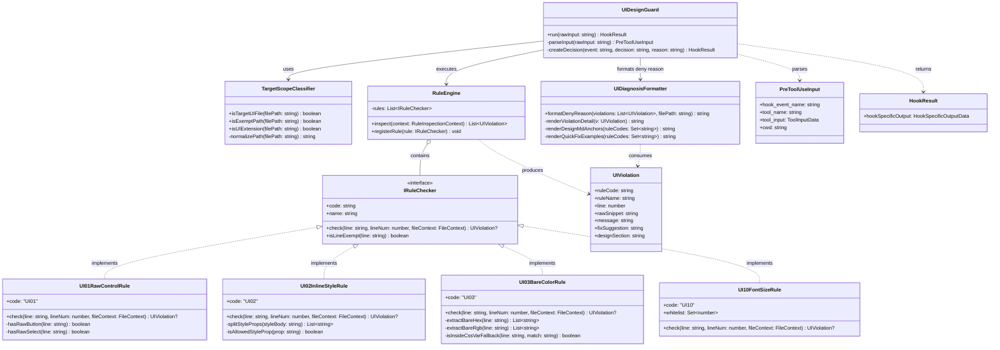
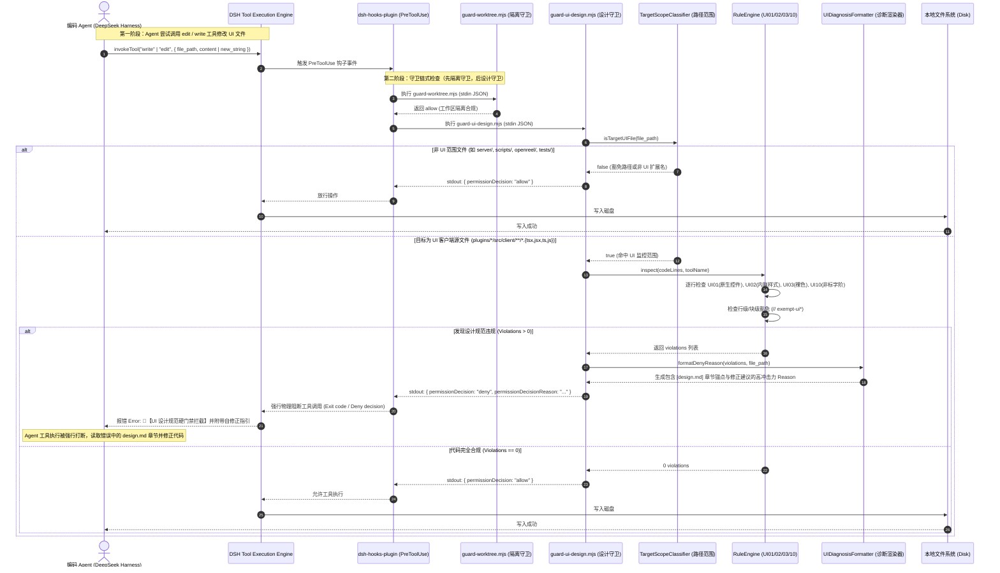
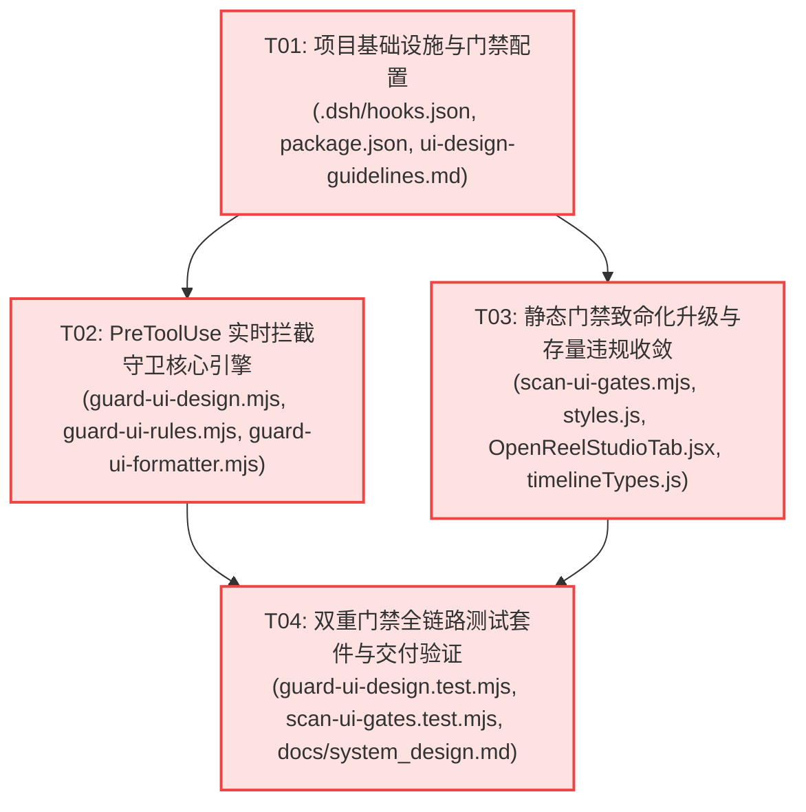

# 系统设计与任务分解规格书：OmniMux UI 设计规范「双重硬门禁」体系

## 架构师引言

在当前 OmniMux 多 Agent 并发与自动化研发中，开发 UI 界面的 Agent 频发出现不阅读根目录设计规范 `design.md`（权威等级 L1）的问题，导致在视图代码中产生硬编码颜色（裸色 Hex/RGB）、原生 `<button>` / `<select>` 控件、非标字阶（如 17px/22px）以及内联业务样式等违规代码。

传统基于本地手测或事后 PR Review 的弱约束不仅反馈周期长、修复成本高，且极易因 Agent 上下文丢失造成破窗效应。为此，本架构方案构建**“双重硬门禁”（Dual Hard-Gate）物理防御体系**：
1. **第一重防御：PreToolUse 运行时物理拦截（Write-Time Intervention）**：依托 `dsh-hooks-plugin`，在 Agent 调用 `write` 或 `edit` 工具落地代码前触发阻断（`permissionDecision: "deny"`），输出具备高视觉冲击力、明确代码位置、直接引用 `design.md` 对应章节（§1.1/§2.1/§2.2/§3/§4.2）与具体修正代码的错误诊断，强迫 Agent 无法闭环并立即自我修正。
2. **第二重防御：静态扫描与 CI 致命准入门禁（Commit/CI Fatal Gate）**：升级 `scripts/scan-ui-gates.mjs`，将裸色（UI03）与非标字阶（UI10）等由原来的 WARN 升级为致命 Exit Code 1（ERROR）；并将 `test:ui` 强行接入 `package.json` 的 `verify:gates`，确保任何绕过或遗漏的违规代码在本地校验、Git 提交与 CI/MQ 合流时 100% 被卡死。

---

# Part A: 系统设计 (System Design)

## 1. 技术方案与实现途径 (Implementation Approach)

### 1.1 核心技术挑战与应对策略

1. **PreToolUse 拦截的毫秒级时延要求（Performance & Latency Budget）**：
   - **痛点**：Hook 位于每次 Agent 调用 `write` / `edit` 工具的主执行路径上。如果检测脚本启动慢或执行复杂 AST 解析，将显著增加 Agent 思考与执行的时延（甚至触发 hook timeout）。
   - **应对方案**：
     - 采用 **Node.js 22+ 原生 ESM 纯轻量引擎**，零外部重量级 npm 依赖，进程冷启动控制在 20ms 内；
     - **两级分流剪枝**：
       * 第一级（路径白名单与黑名单判别）：非 UI 客户端路径（如 `scripts/`, `node_modules/`, `tests/`, `plugins/*/src/node/` 等）与非 UI 后缀（非 `.tsx`, `.jsx`, `.ts`, `.js`）在 **1ms 内瞬时放行（Exit 0 & allow）**；
       * 第二级（单行流式特征正则过滤）：针对进入作用域的代码，采用优化的高性能单行流式正则扫描，避开庞大的 AST 解析器，全文件扫描耗时控制在 5ms 内，总延迟严格保持在 < 50ms。

2. **`edit` 局部差异 vs `write` 全量内容的差异化拦截（Differential Detection Algorithm）**：
   - **痛点**：Agent 使用 `edit` 时只传入 `old_string` 与 `new_string`；若盲目读取并检查整个目标文件，会导致历史遗留技术债阻碍 Agent 修改无关代码（“改动局部却要替全盘历史负债买单”）；反之若只简单看 `new_string`，可能因缺少前后闭合上下文引发漏判或误判。
   - **应对方案**：
     - **首要追责区**：将 `tool_input.new_string` 设为第一审查区，针对 Agent 实际新增/篡改的代码片段逐行检查；
     - **真实行号投射**：若磁盘文件存在且可读，通过在原文件中定位 `old_string`，精确计算违规代码在目标文件中的**绝对行号**（如 `plugins/omnimux/src/client/Foo.tsx:142`）；若不可读或为纯文本片段，则降级显示在 `new_string` 中的相对行号；
     - **`write` 全量审查**：针对 `tool_input.content` 实施端到端全文行扫描。

3. **误报抑制与合规语法放行（False Positive Control）**：
   - **痛点**：合规代码中经常出现 CSS 变量回退值中的色值（如 `var(--dsw-alias-border, #e5e7eb)`）、SVG 矢量图标路径中的色值、关页保活逻辑 `display: open ? undefined : 'none'` 等。如果粗暴匹配色值将导致大面积误杀。
   - **应对方案**：
     - 深度识别 `var(--*, #hex)` 回退值模式并豁免；
     - 识别 `<path ... fill="#...">` 等 SVG 命名空间与定义；
     - 支持行级与局部块级豁免注释（`// exempt-ui01`, `// exempt-ui03`, `// exempt-ui10 <原因>`）。

4. **Agent 自修正强引导机制（High-Impact Feedback Loop）**：
   - **痛点**：Agent 被 `deny` 后，若只给一句模糊的 "invalid style"，Agent 会盲目重试甚至陷入死循环。
   - **应对方案**：设计结构化、高对比度、具备 Markdown 超链接与文档章节锚点的 `permissionDecisionReason` 模板，明确给出违规代码行、违规原因、必须阅读的 `[design.md](design.md)` 对应章节（如 `§1.1 Token 规范`、`§2.1 32px 控件基准`、`§2.2 8px 圆角体系`、`§3 色彩映射表`、`§4.2 字阶白名单`）以及开箱即用的 Before/After 修正代码，迫使 Agent 一步修正到位。

---

## 2. 系统文件清单 (File List)

所有脚本与配置文件统一归属并在工作树 `.worktrees/ui-design-guard` 内维护：

```text
omnimux-dsh/
├── .dsh/
│   └── hooks.json                                     # [修改] 注册 PreToolUse 链式执行 (guard-worktree -> guard-ui-design)
├── package.json                                       # [修改] verify:gates 链条接入 test:ui
├── scripts/
│   ├── guard-ui-design.mjs                            # [新建] PreToolUse 实时拦截守卫入口 (stdin/stdout 协议分发)
│   ├── guard-ui-rules.mjs                             # [新建] UI01/02/03/10 核心检测算法与豁免判定引擎
│   ├── guard-ui-formatter.mjs                         # [新建] 强冲击力自修正指引与诊断报告格式化器
│   ├── guard-ui-design.test.mjs                       # [新建] PreToolUse 守卫自动化单元测试
│   ├── scan-ui-gates.mjs                              # [修改] 升级 UI03/UI10 为致命 ERROR，强化 Exit 1 阻断
│   └── scan-ui-gates.test.mjs                         # [新建] 静态扫描门禁回归测试
├── docs/
│   ├── system_design.md                               # [新建] 系统架构设计与任务分解完整规格书 (本文件)
│   ├── class-diagram.mermaid                          # [新建] 类与数据结构契约图
│   ├── sequence-diagram.mermaid                       # [新建] 拦截与执行流序列图
│   └── contracts/
│       └── ui-design-guidelines.md                    # [修改] 同步双重门禁执行契约、规则升级与豁免语法规范
└── plugins/                                           # [治理] 清理/收敛存量 17 处 UI03/UI10 违规，确保门禁绿灯
    ├── omnimux/src/client/styles.js                   # 修复 5 处裸色硬编码
    ├── omnimux-clip/src/client/OpenReelStudioTab.jsx   # 修复 1 处裸色硬编码
    └── omnimux-clip/src/client/store/timelineTypes.js # 修复 10 处裸色硬编码
```

---

## 3. 数据结构与接口契约 (Data Structures and Interfaces)

### 3.1 类与模块架构模型（Mermaid classDiagram）

详见独立文件 `docs/class-diagram.mermaid`，其核心类关系如下：



### 3.2 判定范围与过滤算法契约 (Target Scope Contract)

- **UI 代码判定路径白名单**：
  - 路径包含 `plugins/<name>/src/client/**`
  - 扩展名必须属于集合：`.tsx`, `.jsx`, `.ts`, `.js`
- **排除与豁免路径黑名单（Exempt Paths）**：
  - 构建产物与依赖：`node_modules`, `dist`, `dist-harness`, `build`, `lib`, `.dsh`, `.workbuddy`
  - 测试与固件：`tests/`, `fixtures/`, `__tests__/`, `*.test.*`, `*.spec.*`
  - 既有外部集成与复杂引擎核心：`openreel`（Vendored 代码树）、`src/canvas/nodes`, `src/canvas/edges`, `src/canvas/handles`
  - 工程支撑：`scripts/`, `docs/`, `research/`
  - 样式与资产：`.css`, `.svg`, `.json`（SVG 内部 `#hex` 不作为裸色拦截）

### 3.3 四大核心规则检测逻辑

| 规则码 | 规则名称 | 违规特征匹配 | 豁免条件 | 推荐正解与对应文档章节 |
|---|---|---|---|---|
| **UI01** | 严禁原生控件 | `/<button\b/i` 或 `/<select\b/i`（小写 HTML 标签） | 行内含 `exempt-ui01` 或处于 `<svg>` 内部 | 使用 `dsh-ui-kit` 中的 `Button`/`IconButton`/`DropdownSelect` (`design.md §2.1 & §2.4`) |
| **UI02** | 严禁内联业务样式 | `style={{ ... }}` 中含有除 `--*` 变量与 `display: 'none'` 保活外的样式属性 | 行内含 `exempt-ui02` | 使用 CSS 类或声明 `--stage-*` CSS 变量 (`design.md §1.1`) |
| **UI03** | 严禁裸色硬编码 | 出现 `#hex` (3/4/6/8位) 或 `rgba?(...)` 且未包裹在 `var(...)` 内 | 位于 `var(--*, #hex)` 回退项、SVG 标签、constants 文件、行内 `exempt-ui03` | 消费官方语义 Token，如 `--dsw-alias-bg-base`, `--dsw-alias-label-primary` (`design.md §3`) |
| **UI10** | 必须遵循合规字阶 | `font-size: <N>px` 或 `fontSize: <N>` 且 `N` 不在白名单 `[9, 10, 11, 12, 13, 14, 15, 16, 18, 20, 24, 28, 32]` 中 | 行内标注 `// exempt-ui10 <特化场景原因>` | 调整至合规字阶梯度，如 Display 20px, Title 16px, Body 13px (`design.md §4.2`) |

---

## 4. 程序调用时序 (Program Call Flow)

详见独立文件 `docs/sequence-diagram.mermaid`，核心运行时拦截流如下：



---

## 5. 拦截响应模板设计 (High-Impact Reason Template)

当拦截触发时，`permissionDecisionReason` 必须提供不可忽视的视觉引导与结构化自修建议，标准格式设计如下：

```markdown
🚫【UI 设计规范硬门禁阻断】代码落地被物理打断！
────────────────────────────────────────────────────────
📍 违规文件: plugins/omnimux/src/client/components/CustomToolbar.tsx
❌ 检测到 2 处违反 L1 级设计规范：

[UI01] 第 45 行:
  代码: <button className="submit-btn" onClick={handleSubmit}>提交</button>
  原因: 严禁使用原生 HTML <button> 控件，破坏暗黑质感与焦点环系统。
  正解: 改用 `dsh-ui-kit` 的 `<Button>` 或 `<IconButton>`。
  必读: [design.md](design.md) §2.1 (32px 控件高基准) & §2.4 (原生控件禁止)

[UI03] 第 58 行:
  代码: backgroundColor: '#16181d', color: '#ffffff'
  原因: 存在未封装在 CSS 变量中的裸色硬编码 [#16181d, #ffffff]。
  正解: 强制消费官方语义 Token `var(--dsw-alias-bg-base)` 与 `var(--dsw-alias-label-primary)`。
  必读: [design.md](design.md) §1.1 (Token 规范) & §3 (色彩映射表与 Token 矩阵)

────────────────────────────────────────────────────────
💡 自我修正代码示范:
  - import { Button } from 'dsh-ui-kit'
  - <Button variant="primary" style={{ backgroundColor: 'var(--dsw-alias-bg-base)' }}>
如属特殊特化场景，请在违规行添加显式豁免注释: `// exempt-ui01 <业务理由>`
```

---

## 6. 不确定项与假设 (Anything UNCLEAR / Assumptions)

1. **`edit` 操作的追责边界**：
   - *假设*：Agent 在局部 `edit` 时，主要引发新违规的代码位于 `new_string` 中。为了避免由于修改历史遗留文件中的其他正常逻辑时被该文件既有的历史违规所误拦，守卫默认对 `new_string` 实施“新增代码 0 违规追责”；对于 `write` 操作，则严格实施“全文 0 违规追责”。
2. **存量代码 17 处 WARN 治理**：
   - *事实*：当前全仓存在 16 处 UI03 和 1 处 UI10 的 WARN 记录。静态门禁升级为致命 ERROR（Exit 1）的前提，是必须在同一任务中对这 17 处历史违规进行合规化收敛（替换为 `--dsw-*` Token 或按规范添加豁免注释），否则接入 `verify:gates` 后 CI 将即刻中断。

---

# Part B: 任务分解 (Task Decomposition)

严格遵循架构师任务分解硬性原则：
- **最大任务数**：**4 个任务**（严格 ≤ 5 个）
- **最小粒度**：每个任务至少包含 3 个相关文件
- **分组原则**：按基础设施、运行时拦截引擎、静态门禁升级与存量收敛、自动化测试与集成验证四层垂直闭环切分。

## 1. 依赖软件包 (Required Packages)

本方案坚持**零外部新依赖原则**，复用仓库已有的 Node.js 22 内置模块与工具：
- `node:fs`, `node:path`, `node:url`: 运行时环境内置
- `node:test`: 单元测试框架内置

## 2. 任务列表 (Task List)

### T01: 项目基础设施与门禁配置 (Infrastructure & Gate Hooks Setup)
- **Task ID**: `T01`
- **Task Name**: 项目基础设施与门禁配置 (Infrastructure & Gate Hooks Setup)
- **Priority**: `P0`
- **Dependencies**: None
- **Source Files**:
  1. `.dsh/hooks.json`: 注册 PreToolUse 链式执行守卫，针对 `edit|write` 绑定 `node scripts/guard-ui-design.mjs`。
  2. `package.json`: 将 `test:ui` 接入 `verify:gates` 串联检测流水线，确保门禁闭环。
  3. `docs/contracts/ui-design-guidelines.md`: 更新门禁规则契约，正式将 UI03/UI10 标记为致命门禁，规范化豁免注释语法规范。

### T02: PreToolUse 实时拦截守卫核心引擎 (Runtime Hook Guard Engine)
- **Task ID**: `T02`
- **Task Name**: PreToolUse 实时拦截守卫核心引擎 (Runtime Hook Guard Engine)
- **Priority**: `P0`
- **Dependencies**: `T01`
- **Source Files**:
  1. `scripts/guard-ui-design.mjs`: Hook 主入口，解析 stdin JSON，处理路径分流、调用规则引擎并输出 stdout 决策 JSON。
  2. `scripts/guard-ui-rules.mjs`: UI01（原生控件）、UI02（内联样式）、UI03（裸色）、UI10（非标字阶）核心算法引擎及豁免判定。
  3. `scripts/guard-ui-formatter.mjs`: 渲染强冲击力 `permissionDecisionReason`，生成精确行号、违规片段、`[design.md](design.md)` 必读章节与修正示范代码。

### T03: 静态门禁致命化升级与存量违规基线收敛 (Static Scanner Fatal Upgrade & Baseline Alignment)
- **Task ID**: `T03`
- **Task Name**: 静态门禁致命化升级与存量违规基线收敛 (Static Scanner Fatal Upgrade & Baseline Alignment)
- **Priority**: `P0`
- **Dependencies**: `T01`
- **Source Files**:
  1. `scripts/scan-ui-gates.mjs`: 将 UI03（裸色）与 UI10（字阶）由 `reportWarn` 升级为 `reportError`，实现 Exit Code 1 致命阻断。
  2. `plugins/omnimux/src/client/styles.js`: 收敛修复 5 处存量 UI03 裸色违规，替换为官方 `--dsw-alias-*` Token。
  3. `plugins/omnimux-clip/src/client/OpenReelStudioTab.jsx`: 收敛修复 1 处存量 UI03 裸色违规。
  4. `plugins/omnimux-clip/src/client/store/timelineTypes.js`: 收敛修复 10 处存量 UI03 裸色常量，对接 CSS 变量或添加规范豁免。

### T04: 双重门禁全链路测试套件与交付验证 (Verification & Test Suite)
- **Task ID**: `T04`
- **Task Name**: 双重门禁全链路测试套件与交付验证 (Verification & Test Suite)
- **Priority**: `P0`
- **Dependencies**: `T02`, `T03`
- **Source Files**:
  1. `scripts/guard-ui-design.test.mjs`: 针对 Hook 的端到端自动化测试（覆盖 write/edit、规则命中、豁免放行、非 UI 文件豁免、Windows 路径兼容器）。
  2. `scripts/scan-ui-gates.test.mjs`: 针对升级后的静态扫描器进行基线与回归测试（验证 0 违规通过及 Exit 1 致命阻断）。
  3. `docs/system_design.md`: 架构与落地验证记录，沉淀双重硬门禁运作手册。

---

## 3. 共享认知与开发规范 (Shared Knowledge)

```text
- 官方设计系统真源: 项目根目录的 [design.md](design.md) (L1 权威)，禁止任何形式的硬编码色值与私造调色板。
- 控件基准铁律: 32px 控件高度基准，8px 基础圆角，工具栏 flex-wrap: nowrap 单行流。
- 官方色彩真源: 100% 消费官方语义 Token `--dsw-alias-*` (如 --dsw-alias-bg-base, --dsw-alias-label-primary)。
- 控件选型强制: 严禁原生 <button> 与 <select>，统一从 dsh-ui-kit 导入 Button, IconButton, DropdownSelect。
- 字阶白名单: 严格遵循 [9, 10, 11, 12, 13, 14, 15, 16, 18, 20, 24, 28, 32]px。
- 豁免标准语法: 行尾或块前标注 `// exempt-ui01 <原因>`, `// exempt-ui03 <原因>`, `// exempt-ui10 <原因>`。
- DSH Hook 协议: 决策只能通过 stdout JSON 的 permissionDecision ("deny" | "allow") 与 permissionDecisionReason 表达；退出码不作为门禁判定依据。
```

---

## 4. 任务依赖关系图 (Task Dependency Graph)



---

# Part C: 边界条件与风险防范 (Edge Cases & Risk Mitigation)

### 1. 性能开销控制与防超时
- **风险**：DSH Hook 默认超时为 5 秒。若每次 Agent 写入操作耗时过长，将拖慢整体开发节奏。
- **防范策略**：
  - 严格保持 **< 50ms** 响应时间；
  - 路径前置短路：优先根据扩展名和文件路径判断，95% 以上的非 UI 客户端写操作（如写后端、配置、日志、测试）在 **1ms** 内直接判定 `allow` 并退出；
  - 避免全局正则多次回溯，采用预编译正则表达式。

### 2. 误报控制与智能回退
- **风险**：CSS 变量的回退值中带有默认颜色（如 `var(--dsw-alias-border, #e5e7eb)`），或者 `<path fill="#...">` 图标定义被误判为 UI03 裸色。
- **防范策略**：
  - 正则扫描时对当前行做语法感知判断，如检测到 `#hex` 前缀处于 `var(` 的括号作用域内，或者行内包含 `xmlns=` / `<svg` / `<path`，则自动豁免；
  - 对内联样式 `style={{ ... }}`，复用 `scan-ui-gates.mjs` 中成熟的 `splitStyleProps` 括号深度分词算法，避免因 `var(--x, #fff)` 内部的逗号导致分割破坏。

### 3. Windows / macOS 跨平台路径归一化
- **风险**：Windows 平台路径使用反斜杠 `\`，会导致 `filePath.includes('plugins/omnimux/src/client')` 判定失效，甚至引发安全逃逸。
- **防范策略**：
  - 接收到 `tool_input.file_path` 后，第一步执行 `const normalizedPath = filePath.replace(/\\/g, '/')`；
  - 采用相对路径计算 `path.relative(repoRoot, normalizedPath)` 进行全域安全解析。

### 4. Edit 局部修改的上下文丢失防范
- **风险**：Agent 使用 `edit` 工具时，如果 `new_string` 跨越了多个标签且行号未对齐，可能导致报告的行号偏离实际文件位置。
- **防范策略**：
  - 当目标文件在本地存在时，守卫引擎自动读取原文件并用 `indexOf(old_string)` 锚定修改的真实行号偏移量，将违规代码的准确物理行号（如 `CustomCard.tsx:42`）呈现给 Agent；
  - 若原文件不存在（极端情况），则降级标注为 `(片段修改第 N 行)`，绝不因行号计算异常而崩溃或放行违规。

### 5. 违规聚合报错，防止“打地鼠”死循环
- **风险**：如果一次写入包含 3 个违规（如 1 个 `<button>`，2 个 `#hex`），守卫若一次只报 1 个，Agent 修复后再次被拒，极易引发疲劳与重试失败。
- **防范策略**：
  - 守卫一次性扫描出当前代码片段中的**所有违规项**，并在 `permissionDecisionReason` 中统一聚合分段呈现，引导 Agent 一次性完成全部修复。
