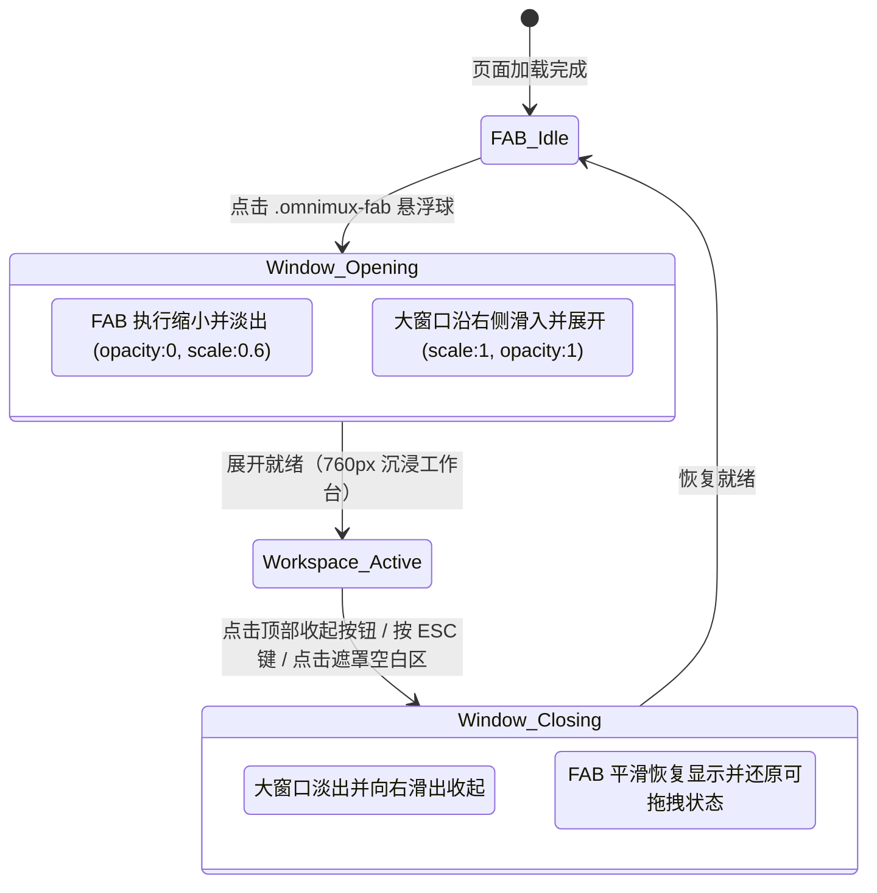

# OmniMux-精灵助手 v2.0 场景交互与全功能产品需求文档 (PRD)

| 属性 | 规范内容 |
| :--- | :--- |
| **文档版本** | v2.0.0-PROD |
| **产品代号** | `omnimux_browser_extension_scene_upgrade` |
| **责任产品经理** | 许清楚（Xu） · 产品经理（Product Manager） |
| **目标受众** | 架构师（高见远）、前端研发工程师（寇豆码）、QA 测试工程师（严过关） |
| **技术底座** | Chrome Manifest V3 原生技术栈（Zero-build，Vanilla JS + Shadow DOM）+ DSH 本地引擎（`127.0.0.1:43120` / `43128`） |
| **参考技能包** | `sopilot-social-agents`（推特/X 14 套社媒专项 Agent 场景） |

---

## 1. 产品定位与设计原则

### 1.1 背景与核心痛点
当前 OmniMux-精灵助手（v1.x）具备基础的悬浮图标（FAB）、小尺寸悬浮窗（380×560px）和侧边栏对话能力。但在深度社媒运营、内容创作及批量资产挖掘场景中，暴露出以下核心矛盾：
1. **视窗局促无法满足高密度工作**：原 380px 小窗口在进行 Twitter Threads 长串编写、短视频多镜头脚本拆解、批量推文数据对比时，滚动频繁、信息遮挡严重。
2. **场景与页面上下文感知较弱**：插件虽然能抓取基本文本，但无法精准感知用户当前处于平台 **信息流主页**、**博主个人主页** 还是 **作品详情页**，无法“因地制宜”地推荐最适合作业的 Prompt。
3. **创作与网页交互断层（缺少自动化闭环）**：AI 生成高质量高赞神评、私信文案后，用户仍需“手动复制 -> 寻找页面输入框 -> 手动粘贴”，链路繁琐且容易中断心流。

### 1.2 核心设计心智（Four Design Tenets）
- **轻量唤醒 (Glanceable Trigger)**：日常浏览时以极简微立体悬浮球（FAB）存在；点击后 **FAB 隐身淡出**，避免双重元素干扰视线。
- **大屏沉浸 (Immersive Canvas)**：展开为**几乎满屏（留出呼吸边距）**的沉浸式工作台，左右分屏视野（左侧浏览宿主网页，右侧大窗口生产对比），具备工作站级的信息吞吐能力。
- **页面感知 (Context-Aware Intelligence)**：毫秒级嗅探宿主 URL 规则与 DOM 节点，零配置呈现对应页面形态下的最佳业务预设（Preset Chips），让专业社媒 Agent 能力“呼之即来”。
- **闭环回填 (Closed-Loop Injection)**：生成内容一键回填到推特发帖框、评论区、私信框；配备防封号安全防线与剪贴板自动降级机制，做到“自动化有度，人工掌控全局”。

---

## 2. 交互架构与界面布局设计

### 2.1 悬浮按钮（FAB）与全屏大窗口转换机制



#### 规格规范与过渡动画参数
- **FAB 隐藏与恢复**：
  - 点击 FAB 瞬间，赋予 `.fab-hidden` 类：`opacity: 0; transform: scale(0.6); pointer-events: none; transition: all 0.2s cubic-bezier(0.16, 1, 0.3, 1);`。
  - 记录 FAB 当前屏幕绝对坐标作为形变原点。
- **几乎满屏大工作台容器（Immersive Workspace Container）**：
  - **宿主隔离**：置于 `#omnimux-companion-root` 的 Shadow DOM 内部，避免宿主网页样式污染。
  - **窗口尺寸与布局定位**：
    - 定位策略：`position: fixed; z-index: 2147483646; top: 14px; bottom: 14px; right: 14px;`。
    - 响应式自适应宽度：
      - **大屏显示器（≥ 1600px）**：宽度固定为 `760px` 或视口宽度的 `45%`（黄金分屏比例）。
      - **常规笔记本（1280px ~ 1599px）**：宽度为 `640px`。
      - **小屏幕（< 1280px）**：宽度自适应为 `calc(100vw - 28px)`（几乎全屏覆盖，仅留 14px 边距防眩晕）。
  - **材质与视觉风格**：
    - 背景：深邃暗黑 `background: rgba(13, 13, 17, 0.94); backdrop-filter: blur(28px) saturate(180%);`。
    - 边框与光晕：`border: 1px solid rgba(255, 255, 255, 0.08); box-shadow: 0 24px 64px rgba(0, 0, 0, 0.85), 0 0 0 1px rgba(184, 183, 255, 0.16); border-radius: 20px;`。
  - **收起动作**：
    - 触发方式：顶部右上角「收起小标」、键盘 `Esc` 键快捷关闭。
    - 动画表现：大窗口 `opacity: 0; transform: translateX(20px);`，耗时 `0.22s`，收起完成后 FAB 平滑浮现。

---

### 2.2 顶部导航区（Top Nav Bar）设计

```
+-----------------------------------------------------------------------------------------------+
|  [📂 默认工作区: omnimux-lab ▾] (🟢 在线)   |  OmniMux 精灵助手 · Twitter 详情页  |  [🕒] [➕] [🗔] [↗] [✕] |
+-----------------------------------------------------------------------------------------------+
```

1. **左侧：本地工作区选择器（Workspace Selector）**
   - **数据源与同步逻辑**：
     - 插件启动时请求本地 DSH 端点：`GET http://127.0.0.1:43120/api/workspaces`（支持 45120/43128 容错兜底）。
     - 默认选中：优先读取本地 DSH 客户端当前处于激活态（`isActive === true`）的工作区；次优读取用户保存在 `chrome.storage.local` 中的历史选项。
   - **交互形态**：
     - 胶囊下拉按钮：`[📂 工作区名称 ▾]`，点击展开悬浮下拉菜单，支持实时切换工作区。
   - **服务健康指示灯（Engine Health Indicator）**：
     - `🟢 绿灯`：本地 DSH 引擎通信正常。
     - `🟡 黄灯`：本地引擎连接中或处于重试状态。
     - `🔴 红灯`：本地服务未启动（43120 拒绝连接），点击弹出修复引导。
2. **居中：感知状态徽章（Scene Badge）**
   - 动态识别当前宿主网站与页面深度，例如：`Twitter / X · 帖子详情页`、`TikTok · 创作者主页`。
3. **右侧：核心动作按钮组**
   - **历史会话**、**新建对话**、**放大至独立侧边栏**、**在 DSH 客户端打开**、**收起工作台（✕）**。

---

### 2.3 主体内容区设计

支持双视图模式：
- **对话流式视图（Chat Stream View - 默认）**：
  - **页面感知 Pill 胶囊**：置顶展示当前挂载的页面上下文（例如：`🎯 已锁定推文: @sama 关于 o3 推理模型的思考`），支持点击展开纯文本预览与解除关联；
  - **多媒体嗅探预览条（Detected Media Bar）**：嗅探视口内的图片、视频 Poster，支持点亮作为附件；
  - **消息流卡片**：展示思考链过程（DeepSeek-R1 折叠区）、流式 Markdown 气泡，并在单条卡片底栏提供 **「📝 填入输入框」** 与 **「📋 复制」** 按钮。
- **结构化提取视图（Extraction View）**：
  - 当切换到底部「提取模式」时激活，展示表格化提取卡片与一键导出 CSV / Markdown 按钮。

---

### 2.4 底部操作台设计

1. **模式切换器（Mode Switcher Tab）**：
   - 采用 Segmented Control 药丸设计：
     - **💬 对话分析（Chat & Analyze）**：默认激活，侧重于针对当前内容进行多轮深入讨论、策略推演与文案撰写；
     - **📦 结构化提取（Extract & Mine）**：针对页面正文、评论列表、媒体资源进行一键解析、无水印提取与表格化呈现；
     - **⚡ 自动化流（Automate & Fill）**：预留扩展。
2. **场景快捷预设区域（Preset Chips Carousel）**：
   - 随页面感知动态计算，展示 4~6 个最契合当前场景的预设按钮；
   - 点击预设 Chip：将该场景对应的标准化 Prompt 模版自动代入当前抓取到的页面数据（如推文正文、作者 ID），填入输入框。

---

## 3. 平台与页面感知场景矩阵

深度融合推特社媒专家 Skill `sopilot-social-agents` 14 套专项与 TikTok 视频营销实战：

### 3.1 Twitter / X 平台场景矩阵

#### 场景 1：Twitter 平台主页（Home Feed / For You / Following）
- **URL 判定规则**：`x.com/home` 或 `twitter.com/home`
- **业务痛点**：信息流过载，博主每天缺乏发帖选题，难以迅速捕捉全网讨论焦点。
- **推荐预设 Prompt**：
  - `🔥 热点主页发帖` (`ai-tweet-imitation`)：嗅探当前视口多条推文公共话题，输出 3 篇适合个人主页首发的原创蹭热点推文，采用“一段一句、段落留白、真人感”风格。
  - `💡 爆款二创复刻` (`ai-hot-tweets`)：抓取视口中点赞数最高的代表推文，提炼其开头钩子（Hook）与框架，在“核心信息不动”前提下重做传播感与情绪共鸣。
  - `📊 信息流热度快筛`：提取视口前 10 条推文的作者、发布时间、转评赞数量与正文，按预估互动率排名输出 Markdown 结构化表格。
  - `🤝 同行互关互动` (`ai-tweet-reply-follow`)：识别信息流中的同行博主，生成真诚、专业且易引发对方回关的破冰评论。

#### 场景 2：Twitter 个人主页（User Profile / 创作者主页）
- **URL 判定规则**：`x.com/[username]`（排除 `home`, `explore`, `messages`, `settings` 等保留路径）
- **业务痛点**：出海商务 BD、达人联络前缺乏背景分析，撰写的合作私信回复率低、套话感严重。
- **推荐预设 Prompt**：
  - `📩 商务合作私信` (`ai-twitter-dm`)：结合博主 Bio 简介、置顶推文及定位，生成 3 种不同语气的商务私信（真诚赞美型、利益共赢型、简明直接型），严禁垃圾营销感。
  - `🕵️ 达人内容画像尽调`：分析博主个人简介、发帖频次、代表性关键词及粉丝群体偏好，评估商业合作价值。
  - `🏆 置顶爆款拆解` (`ai-hot-tweets`)：精准定位该博主的 Pinned Tweet，拆解其涨粉逻辑。
  - `📦 历史推文资产归档`：批量抓取该博主近期主页展示的所有推文正文与互动数据，整理为结构化归档文件。

#### 场景 3：Twitter 推文详情页（Tweet Status 详情页）
- **URL 判定规则**：`x.com/*/status/*`
- **业务痛点**：评论区截流竞争激烈，普通评论沦为水评；单条高价值短推文无法转化为长效传播资产。
- **推荐预设 Prompt**：
  - `🚀 高赞神评截流` (`ai-tweet-reply-high`)：基于公式“评论价值 = 信息增量 × 情绪共鸣 × 表达清晰度”，生成 5 组不同策略评论（新数据/反向思考/反差共鸣等）。
  - `🧵 推文转深度长贴串` (`ai-tweet-threads`)：将原推单点观点扩充为 5~8 条连续推文串，第一条强钩子，中间层层展开，结尾引导互动。
  - `🔄 中文引用转推` (`ai-retweet`)：提取原推核心爆点，生成有深度、有信息增量的引用转推文案。
  - `🌍 出海地道英文回复` (`twitter-reply-en`)：生成符合硅谷/Web3/AI 圈本土真实从业者口吻的高赞英文评论。
  - `🎭 幽默反驳/趣味回怼` (`cmqolx85u000x1fbggacvllkj`)：针对杠精推文或争议话题，生成逻辑严密且幽默风趣的反击神评。

---

### 3.2 TikTok 平台场景矩阵

#### 场景 1：TikTok 推荐流主页（For You / Following）
- **URL 判定规则**：`tiktok.com/foryou` 或根域名
- **推荐预设**：
  - `🎣 黄金3秒钩子拆解`：捕获当前播放视频的开头台词、视觉反差与悬念设定，提炼 3 个可迁移到同类目的起跑 Hook。
  - `🎵 热门音频与文案提取`：嗅探视频 BGM 音乐名称、Caption 描述及 Hashtags。
  - `🔄 短视频转图文脚本`：改编为适合小红书/推特的图文分镜大纲。

#### 场景 2：TikTok 创作者个人页（Creator Profile）
- **URL 判定规则**：`tiktok.com/@*`（非单视频播放路径）
- **推荐预设**：
  - `🤝 达人定制合作邀约`：结合达人 Bio、主推品类与近期视频风格，自动撰写高转化率的商务 BD 邮件/私信。
  - `📈 作品播放与爆款矩阵`：自动抓取主页近 20 个作品的播放量、点赞数，标记超级爆款。
  - `🎯 达人受众与带货力分析`：评估该达人粉丝黏性与出海带货契合度。

#### 场景 3：TikTok 单视频详情播放页（Video Detail）
- **URL 判定规则**：`tiktok.com/@*/video/*`
- **推荐预设**：
  - `🎬 逐字稿与分镜脚本拆解`：分为【镜头时长】、【画面视觉动作】、【旁白台词/音效】、【心理钩子机制】四列表格。
  - `💬 评论区高赞神评截流`：生成 3 条极具网感、易被顶上前排的评论文案。
  - `💡 评论区舆情与争议点挖掘`：嗅探前 30 条评论提炼痛点与潜在商机。
  - `📥 嗅探无水印素材与封面`：抓取原始高清视频流与封面原图。

---

## 4. 页面数据回填与自动化操作交互机制

### 4.1 业务闭环执行动线
1. 用户点击场景预设 Chip 发送请求；
2. AI 生成候选文案，卡片底栏渲染 `[ 📝 填入评论框 ]` 与 `[ 📋 复制 ]`；
3. 用户点击「填入评论框」，向 Content Script 派发回填指令；
4. 调度器定位宿主输入框（`[data-testid="tweetTextarea_0"]` 等），调用 React/Draft.js 状态穿透引擎（`Selection` 归位 -> `document.execCommand('insertText')` -> 合成复合 `InputEvent`）；
5. 宿主输入框获得焦点并外围闪烁 1.5s 紫色呼吸微光，提示人工复核；
6. 若未定位到输入框，安全降级写入系统剪贴板并 Toast 提示。

### 4.2 防封号与安全合规铁律
- **坚守「人工终审」原则**：**绝对禁止自动化点击发送/提交按钮**，所有发布操作严格由人类点击触发，彻底免疫高频机器人脚本风控。
- **内容去 AI 味**：杜绝“综上所述”、“作为一个AI”等机械词汇，保持真实人设口吻。

---

## 5. 异常分支与容错策略
- **本地服务未连接**：左上角显示 🔴 离线状态灯，提供重试与启动指引卡片。
- **DOM 选择器失效**：三次重试后降级写入系统剪贴板（`navigator.clipboard.writeText`），Toast 引导快捷键粘贴。
- **泛用网页降级**：非社媒网页自适应切换为「通用网页」感知徽章，推荐总结、要点提炼与观点驳论预设。

---

## 6. 功能需求池与版本规划 (P0 / P1 / P2)

| 优先级 | 功能模块 | 核心能力特性 | 交付状态 |
| :--- | :--- | :--- | :--- |
| **P0** | 窗口与导航 | 760px 沉浸工作台、FAB 缩小淡出隐藏、左上角 DSH 本地工作区联动选择器 | ✅ 已交付 |
| **P0** | 模式与预设 | 底部对话/提取双模式 Tab、Twitter 三大页面感知与 14 套 SoPilot 专家预设 | ✅ 已交付 |
| **P0** | 回填闭环 | 单条卡片一键回填至发帖/评论框，React 状态穿透，剪贴板自动降级 | ✅ 已交付 |
| **P1** | 多平台感知 | TikTok 主页/个人页/详情页感知、黄金钩子拆解、分镜脚本反推 | ✅ 已交付 |
| **P1** | 跨端对称通信 | 统一 Float Iframe 与 Native Side Panel 的 FILL_HOST_DOM 回填通信契约 | ✅ 已交付 |
| **P2** | 进阶演进 | 自定义 Prompt 预设库、自动化批量扫描与全局唤醒快捷键 | 规划中 |

---
*文档归档路径：`docs/PRD.md`，由产品经理 许清楚 编写完成。*
