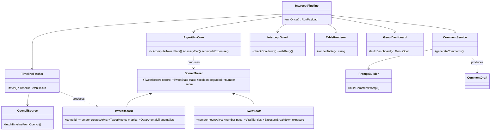
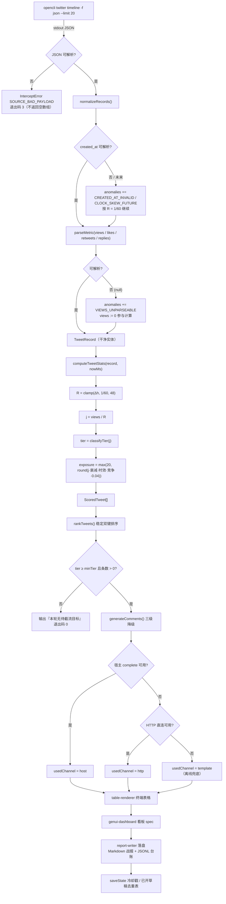
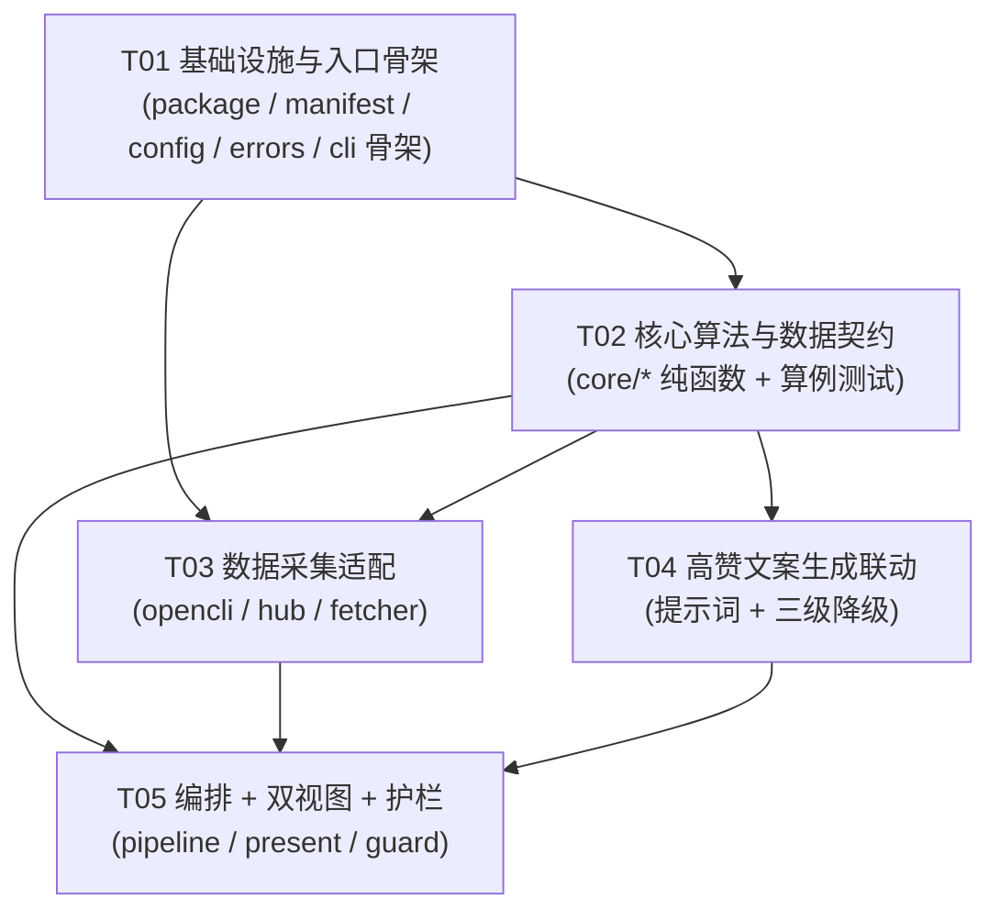

# 推特推文爆速检测与智能截流系统 — 系统设计 + 任务分解

> 作者：高见远（架构）｜输入：许清楚《推特推文爆速检测与智能截流系统 PRD》｜范围：新增独立插件 `plugins/omnimux-intercept/`，零新增 npm 运行时依赖，不改 hub 内部、不改官方 Harness、不新增跨插件契约。
>
> **证据标记约定**：**【实测】** = 本次已在本机跑通并核实的命令与输出；**【代码】** = 已读仓库源码核实；**【设计判断】** = 架构决策；**【待核实】** = 必须由工程师在实现时按真实返回确认，不得凭猜。

---

## 0. 本次设计的四个前置核实结论（先定案，再设计）

### 结论 ①：数据源 `opencli twitter timeline` 真实存在且 JSON 字段与算法输入对齐

**【实测】** `opencli --version` → `1.8.8`；`opencli twitter --help` 暴露 44 个子命令（含 `timeline` / `tweets` / `search` / `thread` / `notifications` / `bookmarks`）。`opencli twitter timeline --help` 明确给出：

| 关键事实 | 实测输出 |
| --- | --- |
| 命令形状 | `opencli twitter timeline [--type for-you\|following] [--limit N] [--top-by-engagement N]` |
| 默认批量 | `--limit` 默认 **20**，与 PRD「每批 20 条」完全一致 |
| JSON 通道 | `-f, --format <fmt>`，可选 `table, plain, json, yaml, md, csv` → 取 `-f json` |
| **输出列（决定算法可直接吃）** | `id, author, bio, text, likes, retweets, replies, views, created_at, url, has_media, media_urls, media_posters, card, quoted_tweet` |
| 已有排序能力 | `--top-by-engagement N` 内置权重 `likes×1 + retweets×3 + replies×2 + bookmarks×5 + log10(views+1)×0.5`（**与 PRD 要求的爆速排序不是一回事，仅作旁路参考，不采用**） |
| 会话模式 | `--window foreground\|background`、`--site-session ephemeral\|persistent`、`--keep-tab true\|false` → 后台静默抓取可行 |
| 访问域 | `Domain: x.com`，`Access: read` |

**【实测·环境阻塞（不改变架构，如实记录）】** 本次在本机执行 `opencli twitter timeline -f json --limit 3` 返回 `COMMAND_EXEC`：
`Pre-navigation to https://x.com failed: attach failed: Cannot access a chrome-extension:// URL of different extension.` → 属**本机浏览器桥接态问题**（扩展冲突 / 未登录），非适配器缺失。架构上按「源可用但有环境前提」设计，并在 T03 交付标准里强制要求该错误必须给出**可诊断提示**，而非静默空数组。

### 结论 ②：算法输入必须由**我们**算，OpenCLI 不提供「时速」

**【实测】** timeline 输出列无时速、无等级、无存活时长。`created_at` 是唯一时间字段，`views` 是唯一浏览量字段。因此 PRD 附录 A 的全套公式必须在本地实现为纯函数 —— 这正是本插件存在的理由，也决定了架构必须把「采集」与「计算」彻底分层（**采集层只做搬运与解析，一行业务公式都不许写**）。

### 结论 ③：高赞文案联动有两条既有资产可复用，不需要新造提示词

| 资产 | 位置 | 复用点 |
| --- | --- | --- |
| SoPilot 推特专项提示词 | `presets/tiktok-agent/skills/sopilot-social-agents/SKILL.md`（**【代码】** 已读：路由表列出 `ai-tweet-reply-high`＝高赞评论、`ai-retweet`＝中文引用转帖，另有 `ai-tweet-comment`/`ai-tweet-reply`） | 热评草稿读 `ai-tweet-reply-high.sys-prompt.md`；引用转发读 `ai-retweet.sys-prompt.md` |
| 一次性模型补全通道 | 【代码】`docs/contracts/hub.md:44,145`：`omnimux_text_complete`（= `textComplete`）走 `ctx.llm.stream` 单次调用，**无 tools、无 parent messages**，正是「批量生成 N 条短文案」的形态；进程内无 `ctx.llm` 时抛 `needs-provider` | LLM 第一通道 |
| 直连降级通道 | 【代码】`docs/contracts/hub.md:236`：`OMNIMUX_API_KEY` / `OMNIMUX_TOKEN`（缺失时从 `$DSH_HOME/.credentials.yaml` 解析） | 第二通道；两者都不可用 → 第三通道「离线模板」，功能不断链 |

因此文案层设计成**三级降级阶梯**（注入的 `complete()` → HTTP 直连 → 离线模板），永不因模型不可用而让整条链路失败。

### 结论 ④：写入位置必须先建工作树（仓库硬门禁）

**【代码】** `scripts/guard-worktree.mjs:41,43,366`：主检出下 `plugins/`、`scripts/`、`docs/` 的**未跟踪文件**会被 PreToolUse Hook 以 `untracked-protected-scope` 直接拒绝。本设计已按此纪律执行：产出落在 linked worktree
`omnimux-dsh-wt-twitter-intercept`（分支 `agent/omnimux-intercept-twitter-intercept`，基线 `origin/main@8b76a39fa`）。

> **命名空间决议（重要）**：仓库**已存在**根级 `docs/system_design.md`（44 KB，内容为《全模型网关能力真相对账与整改方案规格书》）以及根级 `docs/sequence-diagram.mermaid`、`docs/class-diagram.mermaid`，均属**其他**规格。本设计**不覆盖**它们，改为落在插件自有命名空间：`plugins/omnimux-intercept/docs/{system_design,sequence-diagram,class-diagram}`。理由：① 根级三文件名已被占用，覆盖即为破坏既有架构文档；② 插件内文档随插件包一起发布（`package.json` 的 `files` 含 `docs`），归属清晰、可独立交付。

---

# Part A：系统设计

## 1. 技术选型与实现方案

### 1.1 核心难点与对策

| # | 难点 | 风险 | 对策（本设计） |
| --- | --- | --- | --- |
| D1 | 爆速判定依赖**当前时间**，而单测必须确定性 | 测试随机飘红 / 问题复现不了 | 核心层**纯函数 + 显式 `nowMs` 入参**；`src/core/**` 内禁止出现 `Date.now()`，由 `purity.test.js` 静态断言锁定 |
| D2 | 数据源数值是**脏字符串**：`1.2k` / `3.4m` / `1.1b` / `12.7万` / `1,234` | 静默转 0 → 把爆款判成哑帖（最严重业务事故） | 解析失败**返回 `null` 且不吞错**；`null` 进算法统一按 `views=0` 处理并打 `degraded` 标记；T02 对 4 类单位 + 6 类脏输入做表驱动断言 |
| D3 | 数值必须**逐位对齐 PRD 附录 A**（浮点运算顺序不同会差 1） | 验收时算不出 PRD 样例值 | 公式逐字翻译，运算顺序固定，`Math.round` 只作用在最外层；T02 用固定边界算例锁死（见 §3.2） |
| D4 | 分级边界是**闭区间/开区间混合**（`j > 8000` 爆款、`1000 ≤ j ≤ 8000` 飙升、`j < 1000` 正常） | 8000 与 1000 归错档 | 单点断言：`7999.99 / 8000 / 8000.01 / 999.99 / 1000` 五条必须落对档 |
| D5 | 未来时间戳 / 空浏览量 / 零回复 | 负存活时长 → 时速暴涨伪爆款 | `R` 先夹到 `[1/60, 48]`；未来时间**不报错**、按 `R = 1/60` 计算并标 `CLOCK_SKEW_FUTURE`；`log10(0+1) = 0` 天然安全；`R ≥ 1/60 > 0`，无除零 |
| D6 | 浏览器桥接会挂（本次**已实测挂过**） | 用户看到空表却以为「今天没有爆款」 | 「源不可用」与「确实没有爆款」**在输出层必须可区分**：前者退出码 3 + 诊断行，后者退出码 0 |
| D7 | 平台风控 | 高频抓取导致账号受限 | 冷却闸（默认 90s）+ 指数退避（3 次，1s/2s/4s + 抖动）+ 单次运行硬上限；冷却状态**跨进程持久化**（不能只靠内存） |
| D8 | 模型接口不稳定 / 不可用 | 整条链路失败 | 三级降级阶梯；生成结果做长度与安全后置校验；LLM 异常只降级不抛出到主链路 |

### 1.2 框架与依赖选型

| 层 | 选型 | 理由 |
| --- | --- | --- |
| 运行时 | **Node.js ≥ 22.19**（仓库 `package.json` engines 已约束） | 用 `node --test`、`node:util.parseArgs`、`node:child_process`，零编译步骤 |
| 数据采集 | **OpenCLI 子进程**（`opencli twitter timeline -f json --limit 20`） | 平台登录态与反爬由 OpenCLI 负责；本插件**不重建采集**，只签子进程契约 |
| 采集降级 | **OmniMux hub 社媒数据**（`omnimux_social_data`，`platform=x` + `x/tweet` / `x/user-tweets`）【代码】`docs/contracts/hub.md:148` | 需要精确取单条或指定作者时间线时使用；主链路不依赖它，避免引入 key 依赖 |
| 计算引擎 | **自研纯函数模块**（零第三方） | 公式是业务资产，必须可测、可复现、可审计 |
| 文案生成 | `omnimux_text_complete` / `ctx.llm.stream` → HTTP 直连 → 离线模板 | 三级降级，主链路不被模型可用性绑架 |
| 终端呈现 | **自研表格渲染器**（零依赖，CJK 宽度对齐） | 为 14 列数据引 `cli-table3` 不划算；仓库已有「纯 Node 工具脚本」范式 |
| 看板呈现 | **GenUI spec 生成**（`dsh-ui` 组件词汇表） | 插件只**产出 spec**，渲染交给宿主或 Agent；插件不依赖 React、不进客户端构建 |
| 状态持久化 | 单文件 JSON：`$DSH_HOME/omnimux-intercept/state.json` | 与既有插件存储域范式一致（【代码】`plugins/omnimux-publish/dsh.manifest.json` 的 `storageDomains: ["$DSH_HOME/publish/"]`） |
| 样式 | **仅 CLI / Markdown / GenUI spec；本期不做 React 客户端** | PRD 未要求插件内嵌 Web 页；「交互式看板」由 GenUI 承载，避免无谓构建链与 `design.md` 合规面 |

### 1.3 架构模式：分层 + 依赖注入 + 单向数据流

```
            ┌──────────── 采集层（有副作用：进程 / 网络 / 文件） ────────────┐
   OpenCLI ─┤ collect/opencli-source.js · collect/hub-source.js             │──► TweetRecord[]
   Hub API ─┘ collect/timeline-fetcher.js · collect/parse-metrics.js        │
                                          │  TweetRecord[]（规范实体）
                                          ▼
            ┌──────────── 核心层（纯函数，零 I/O，零 Date.now） ────────────┐
            │ core/metrics.js    数值归一                                  │
            │ core/algorithm.js  时速 / 分级 / 曝光预测（附录 A 逐字实现）    │
            │ core/sort.js       稳定双键排序                              │
            └───────────────────────────────┬───────────────────────────────┘
                                          │  ScoredTweet[]（含推导字段）
                     ┌────────────────────┴────────────────────┐
                     ▼                                         ▼
   ┌──── 文案层（注入 complete()）────┐        ┌──── 呈现层（纯字符串/纯对象）────┐
   │ comment/prompt-templates.js      │        │ present/table-renderer.js        │
   │ comment/prompt-builder.js        │        │ present/genui-dashboard.js       │
   │ comment/comment-service.js       │        │ present/report-writer.js         │
   │ comment/complete-gateway.js      │        └──────────────────────────────────┘
   └──────────────────────────────────┘
                     ▲
   ┌──── 编排/护栏层（唯一允许读写状态与时间的地方）────┐
   │ src/cli.js · src/pipeline.js · src/guard.js · src/run-store.js │
   └───────────────────────────────────────────────────────────────┘
```

**三条硬边界（T01 建立、T05 端到端验证）**

1. `src/core/**` 不得 `import` 任何 `node:*` 模块，不得访问 `Date`、`process`、`fs`、`child_process` —— 由 `test/algorithm.test.js` 内的纯函数门禁静态扫描源码文本断言。
2. `src/present/**`、`src/comment/prompt-*.js` 必须是**输入 → 输出**的纯变换，不得写盘、不发网络（写盘只允许在 `present/report-writer.js` 与 `src/run-store.js`）。
3. 外部世界只有三个注入点：`{ fetchTimeline, complete, writeFile }`。**默认实现在 `src/cli.js` 里装配**，其余模块一律不 import 默认实现 —— 这是「可单测 + 可独立跑 + 可被宿主调度」三合一的唯一手段。

---

## 2. 模块划分与目录文件列表

新增插件根目录：**`plugins/omnimux-intercept/`**（命中 `pnpm-workspace.yaml` 的 `plugins/*` 通配，无需改工作区配置）。

```
plugins/omnimux-intercept/
├── package.json                          # 工作区成员；bin = intercept；test = node --test
├── dsh.manifest.json                     # 插件注册元数据（tier、tools、storageDomains、systemBinaries）
├── cordis.patch.yml                      # bundle patch（insert 自身 id）
├── tsconfig.json                         # checkJs 契约门禁（JSDoc → 类型检查）
├── README.md                             # 面向用户的使用说明（怎么跑、每个参数、输出在哪）
├── docs/
│   ├── system_design.md                  # 本文档
│   ├── sequence-diagram.mermaid          # 完整调用时序图
│   ├── class-diagram.mermaid             # 完整类图
│   ├── algorithm.md                      # 附录 A 公式的权威实现说明 + 边界算例表
│   └── shared/README.md                  # 对外共享契约：实体字段、错误码、退出码、状态目录
├── src/
│   ├── index.js                          # 【入口】插件定义：命令注册 / 帮助 / 装配（不产生副作用）
│   ├── cli.js                            # 【入口】命令行：参数解析、依赖装配、退出码
│   ├── pipeline.js                       # 【编排】单次运行的主编排（冷却→抓→算→排→生成→渲染→落盘）
│   ├── config.js                         # 配置与默认值 + 夹取（阈值/上限/冷却/超时）
│   ├── guard.js                          # 安全护栏：冷却闸、指数退避、窗口限流
│   ├── run-store.js                      # 状态读写：冷却戳、已开草稿推文去重、运行台账
│   ├── core/
│   │   ├── errors.js                     # InterceptError + 错误码 + 退出码映射
│   │   ├── algorithm.js                  # ★附录 A 唯一实现（纯函数）
│   │   ├── metrics.js                    # 数值归一 / 空值语义
│   │   └── sort.js                       # 双键稳定排序（可复现）
│   ├── collect/
│   │   ├── tweet.js                      # 领域实体 + 原始记录 → 规范实体（纯函数）
│   │   ├── parse-metrics.js              # k/m/b/万/逗号/全角 解析（纯函数）
│   │   ├── opencli-source.js             # OpenCLI 子进程适配（主数据源）
│   │   ├── hub-source.js                 # OmniMux hub 社媒数据降级适配
│   │   └── timeline-fetcher.js           # 组装采集：规范化 + 异常边界
│   ├── comment/
│   │   ├── comment-service.js            # 逐条生成热评草稿/引用转发（降级阶梯 + 后置校验）
│   │   ├── prompt-builder.js             # 数据 + 指标 + 原文 → 提示词（纯函数）
│   │   ├── prompt-templates.js           # 读取 SoPilot 提示词文件 + 内置离线兜底模板
│   │   └── complete-gateway.js           # 模型调用装配：宿主注入 → HTTP 直连 → 离线
│   └── present/
│       ├── table-renderer.js             # 终端富表格（CJK 对齐、分级标记、并列视图）
│       ├── genui-dashboard.js            # 生成 dsh-ui GenUI spec（≤8 组件、单主题一主组件）
│       └── report-writer.js              # Markdown 战报 + JSONL 运行台账落盘
└── test/
    ├── algorithm.test.js                 # 附录 A 公式 + 边界矩阵 + 纯函数门禁
    ├── parse-metrics.test.js             # 四类单位 + 六类脏输入
    ├── timeline.test.js                  # 采集层：argv 契约 / 错误码映射 / 异常标记
    ├── comment.test.js                   # 提示词 + 三级降级 + 后置校验
    ├── guard.test.js                     # 冷却 / 退避 / 限流
    ├── pipeline.test.js                  # 端到端（注入假数据源 + 假模型）
    ├── genui-dashboard.test.js           # spec 结构合法性（组件白名单 + 节点数上限）
    └── fixtures/
        ├── timeline.json                 # 真实结构快照（20 条，脱敏）
        └── timeline-dirty.json           # 异常夹具：未来时间 / 空 views / 1.1b / 12.7万 / 零回复
```

**分层职责一句话版**：`core` 只会算；`collect` 只负责把外部世界变成 `TweetRecord[]`；`comment` 只负责把一条推文变成一段可发布的文案；`present` 只负责把对象变成人能看的东西；`pipeline` 是唯一知道「顺序」的地方；`guard` 是唯一敢拦人的地方。

---

## 3. 核心数据结构与接口定义

> 语言策略：仓库既有插件是 **纯 ESM JavaScript + JSDoc 契约 + `tsc --noEmit` 门禁**（【代码】`plugins/omnimux-publish/package.json` 有 `typecheck:contracts: tsc -p tsconfig.json --noEmit`，源码无 `.ts`）。本设计沿用：下方接口以 **TypeScript 形式书写作为契约真源**，落到代码里是等价 JSDoc `@typedef`，由 T01 建的 `tsconfig.json` 校验。

### 3.1 实体与契约类型

```ts
/** 推文互动指标。null 表示「源未提供」，与 0 语义严格区分。 */
interface TweetMetrics {
  views: number | null
  likes: number | null
  retweets: number | null
  replies: number | null
  bookmarks: number | null
}

/** 采集层的规范实体：所有字段都已是干净类型，下游不再做解析。 */
interface TweetRecord {
  id: string
  author: string
  authorHandle: string
  text: string
  createdAtMs: number            // epoch ms（UTC），已解析
  url: string
  metrics: TweetMetrics
  hasMedia: boolean
  mediaUrls: string[]
  quotedTweetId: string | null
  source: 'opencli' | 'hub' | 'fixture'
  /** 采集阶段发现的数据缺陷（不可丢弃，必须透传到输出层） */
  anomalies: DataAnomaly[]
}

type DataAnomaly =
  | 'VIEWS_MISSING'      // views 字段缺失或为 null
  | 'VIEWS_UNPARSEABLE'  // 脏字符串解析失败
  | 'CLOCK_SKEW_FUTURE'  // created_at 在未来
  | 'CREATED_AT_INVALID' // created_at 无法解析
  | 'AUTHOR_MISSING'

type ViralTier = 'viral' | 'surging' | 'normal'

/** 算法层输出：一次计算的全部推导量（可审计，便于回放核对）。 */
interface TweetStats {
  hoursAlive: number         // R，已夹取到 [1/60, 48]
  hoursAliveRaw: number      // 未经夹取的原始差值（诊断用）
  pace: number               // j = views / R
  tier: ViralTier
  exposure: ExposureBreakdown
}

interface ExposureBreakdown {
  timeDecay: number      // clamp(6 - R * 0.35, 1.2, 6)
  freshnessBonus: number // clamp(1.28 - R / 18, 0.55, 1.28)
  competition: number    // clamp(1.14 - log10(replies + 1) * 0.22, 0.42, 1.08)
  baseRate: number       // 常量 0.04
  predicted: number      // max(20, round(j * timeDecay * freshnessBonus * competition * baseRate))
  floored: boolean       // true = 命中 20 下限（诊断用）
}

/** 核心层对外的唯一产物：实体 + 统计 + 数据健康度。 */
interface ScoredTweet {
  record: TweetRecord
  stats: TweetStats
  degraded: boolean        // 任一 anomaly 存在
  score: number            // = stats.exposure.predicted（排序主键之一）
}
```

### 3.2 附录 A 公式的**唯一实现**（逐字翻译，禁止改写）

| 量 | 公式（实现即此文本） | 边界处理 |
| --- | --- | --- |
| 存活小时 `R` | `(nowMs - createdAtMs) / 3_600_000` | **夹取**：`min(max(R, 1/60), 48)` |
| 时速 `j` | `views / R` | `views` 为 `null` → 视为 `0`；`R ≥ 1/60` 恒 > 0，无除零 |
| 分级 | `j > 8000` → `viral`；`1000 ≤ j ≤ 8000` → `surging`；`j < 1000` → `normal` | 五条边界断言：`7999.99 / 8000 / 8000.01 / 999.99 / 1000` |
| 时间衰减 | `clamp(6 - R * 0.35, 1.2, 6)` | `R=1/60 → 5.9941666…`（未触上限）；`R ≥ 13.714… → 1.2` |
| 时效加成 | `clamp(1.28 - R / 18, 0.55, 1.28)` | `R→0 → 1.28`；`R ≥ 13.14 → 0.55` |
| 竞争折扣 | `clamp(1.14 - Math.log10(replies + 1) * 0.22, 0.42, 1.08)` | `replies=0 → 1.14 → 夹到 1.08`；`replies=2000 → 0.42` |
| 曝光预测 | `Math.max(20, Math.round(j * timeDecay * freshnessBonus * competition * 0.04))` | `j=0 → 0 → 命中 20 下限，floored=true` |

**固定算例锚点**（T02 必须让这四条通过，防止实现漂移；`nowMs` 显式注入以消除时钟依赖）：

| # | 场景 | 输入 `(views, R 小时, replies)` | 期望 |
| --- | --- | --- | --- |
| A1 | 极新爆款 | `(120_000, 2, 3)` | `j = 60_000` → `viral`；`timeDecay = 6 - 0.7 = 5.3`、`freshnessBonus = 1.28 - 2/18 = 1.1688889`、`competition = 1.14 - log10(4)×0.22 = 1.0075468`；`predicted = round(60000 × 5.3 × 1.1688889 × 1.0075468 × 0.04) = 14980`（乘积 `14980.4745`） |
| A2 | 老帖飙升 | `(200_000, 40, 900)` | `j = 5_000` → `surging`；`timeDecay = 1.2`（触底）、`freshnessBonus = 0.55`（触底）、`competition = 1.14 - log10(901)×0.22 = 0.48995`；`predicted = round(5000 × 1.2 × 0.55 × 0.48995 × 0.04) = 65` |
| A3 | 零曝光兜底 | `(0, 10, 0)` | `j = 0` → `normal`；`predicted = 20`（命中下限），`floored = true` |
| A4 | 未来时间戳 | `(500, -3, 0)` | `R` 夹到 `1/60`，`anomalies` 含 `CLOCK_SKEW_FUTURE`，**不抛错** |

> **A1/A2 的完整推导（已用 Node 实跑核对，非手算估算）**：
> - A1：`timeDecay = clamp(6 - 2×0.35, 1.2, 6) = 5.3`；`freshnessBonus = clamp(1.28 - 2/18, 0.55, 1.28) = 1.1688888888888889`；`competition = clamp(1.14 - log10(4)×0.22, 0.42, 1.08) = clamp(1.0075468019078482, …) = 1.0075468019078482`；`60000 × 5.3 × 1.1688888888888889 × 1.0075468019078482 × 0.04 = 14980.474529913063 → 14980`。
> - A2：`timeDecay = clamp(6 - 14, …) = 1.2`（下限触发）；`freshnessBonus = clamp(1.28 - 40/18, …) = 0.55`（下限触发）；`competition = clamp(1.14 - log10(901)×0.22, …) = clamp(0.4899614…, …) = 0.4899614…`（**未触底**，`log10(901) = 2.9547250…`）；`5000 × 1.2 × 0.55 × 0.4899614… × 0.04 = 64.67… → 65`。
> - A3：`timeDecay = 2.5`、`freshnessBonus = 0.724444…`、`competition = 1.14 → 夹到 1.08`；`0 × … = 0 < 20` → `predicted = 20`，`floored = true`。
> - A4：`R` 由 `-3` 夹到 `1/60 = 0.0166667`；`j = 500 / 0.0166667 = 30000` → `viral`；`timeDecay = 5.9941666…`（**注意：未达 6 上限**，因 `R > 0`）。
>
> 四条算例的 `j`、`tier`、`hoursAlive` 必须与上表**逐位相等**。A2 是本套算例中唯一「衰减与时效双触底、竞争项未触底」的组合，专门用于锁死两类实现错误：把 clamp 写成 `Math.min/Math.max` 顺序颠倒，以及把 `log10` 误写成 `Math.log`。A4 专门用于锁死「未来时间直接报错」与「时间上限夹取方向写反」。

### 3.3 接口签名（契约）

```ts
// ── 核心层（纯函数，src/core/）
function clamp(value: number, min: number, max: number): number
function safeNumber(value: unknown): number | null
function parseMetric(raw: unknown): number | null                  // '12.7万' → 127000
function toHoursAlive(nowMs: number, createdAtMs: number): { hours: number, rawHours: number, clockSkew: boolean }
function classifyTier(pace: number): ViralTier
function computeExposure(j: number, hoursAlive: number, replies: number): ExposureBreakdown
function computeTweetStats(record: TweetRecord, nowMs: number): TweetStats
function scoreTweets(records: TweetRecord[], nowMs: number): ScoredTweet[]
function rankTweets(rows: ScoredTweet[], by: 'exposure' | 'pace'): ScoredTweet[]
function splitByTier(rows: ScoredTweet[]): { viral: ScoredTweet[], surging: ScoredTweet[], normal: ScoredTweet[] }

// ── 采集层（唯一允许 I/O 的边界，全部经注入的 runner）
interface SourceRunner { (argv: string[], options: { timeoutMs: number }): Promise<{ stdout: string, stderr: string, code: number }> }
interface TimelineFetchOptions { limit: number, type?: 'for-you' | 'following', chunkDelayMs?: number, signal?: AbortSignal }
interface TimelineFetchResult { records: TweetRecord[], source: TweetRecord['source'], fetchedAtMs: number, rawCount: number, warnings: string[] }
function fetchTimelineFromOpencli(options: TimelineFetchOptions, deps: { run: SourceRunner }): Promise<TimelineFetchResult>
function fetchTimelineFromHub(options: TimelineFetchOptions, deps: { request: (tool: string, args: object) => Promise<unknown> }): Promise<TimelineFetchResult>
function normalizeRecords(raw: unknown[], nowMs: number, source: TweetRecord['source']): TweetRecord[]

// ── 文案层（模型调用注入；无模型时自动落到模板）
interface CommentRequest { tweet: ScoredTweet, style: 'reply' | 'quote' | 'both', language?: 'zh' | 'en', maxChars?: number }
interface CommentDraft {
  tweetId: string
  reply: { text: string, strategy: string } | null
  quote: { text: string } | null
  usedChannel: 'host' | 'http' | 'template'
  warnings: string[]
}
interface CompleteFn { (input: { system: string, prompt: string, maxTokens?: number, signal?: AbortSignal }): Promise<string> }
function buildCommentPrompt(req: CommentRequest, template: PromptTemplate): { system: string, prompt: string }
function loadPromptTemplate(kind: 'reply-high' | 'quote', deps?: { readFile?: (p: string) => Promise<string> }): Promise<PromptTemplate>
function generateComments(reqs: CommentRequest[], deps: { complete: CompleteFn | null, template: PromptTemplate }): Promise<CommentDraft[]>
function resolveCompleteChannel(deps: { env?: Record<string, string | undefined>, fetcher?: typeof fetch }): CompleteFn | null

// ── 呈现层（纯变换；只有 report-writer 可以写盘）
function renderTable(rows: ScoredTweet[], options: { maxRows?: number, color?: boolean, showDegraded?: boolean }): string
function buildDashboard(rows: ScoredTweet[], drafts: CommentDraft[], meta: RunMeta): GenuiSpec
function renderMarkdownReport(payload: RunPayload): string
function writeReport(payload: RunPayload, deps: { writeFile: (path: string, content: string) => Promise<void> }): Promise<{ markdownPath: string, jsonlPath: string }>

// ── 护栏与状态
interface GuardDecision { allowed: boolean, reason?: 'cooldown-active' | 'window-limit', waitMs?: number, lastRunAtMs?: number }
function checkCooldown(state: PersistedState, nowMs: number, config: ResolvedConfig): GuardDecision
function withRetry<T>(fn: () => Promise<T>, options: { attempts: number, baseDelayMs: number, isRetryable: (e: unknown) => boolean, sleep: (ms: number) => Promise<void> }): Promise<T>
function loadState(paths: PluginPaths, deps: { readFile: (p: string) => Promise<string> }): Promise<PersistedState>
function saveState(paths: PluginPaths, state: PersistedState, deps: { writeFile: (p: string, c: string) => Promise<void> }): Promise<void>

// ── 编排（唯一知道顺序的地方）
interface RunOptions {
  limit: number
  type: 'for-you' | 'following'
  rankBy: 'exposure' | 'pace'
  minTier: ViralTier
  genui: boolean
  llm: 'auto' | 'off'
  outDir?: string
  dryRun: boolean          // 只算不生成文案、不落盘
  force: boolean           // 无视冷却
  source: 'opencli' | 'hub' | 'fixture'
  fixturePath?: string
  nowMs?: number           // 测试注入
}
function runOnce(options: RunOptions, deps: PipelineDeps): Promise<RunPayload>
```

### 3.4 类图

完整类图见 **[`class-diagram.mermaid`](class-diagram.mermaid)**（与本文档同目录）。要点：



---

## 4. 程序调用时序与数据流

### 4.1 完整时序

完整时序图见 **[`sequence-diagram.mermaid`](sequence-diagram.mermaid)**（14 个参与者、6 个阶段、含源不可用 / 参数非法 / 冷却中 / 清单为空 / `--dry-run` 五条异常与旁路分支）。该文件是本节时序的**唯一真源**，本文档不再重复内嵌，避免两处不一致。

主链路一句话版：`parseArgs → 冷却闸 → 采集（opencli 子进程）→ 规范化 → 纯函数计算 → 稳定排序 → 过滤 minTier → 三级降级生成文案 → 双视图渲染 → 落盘 → 状态回写`。每个箭头在时序图里都有对应的参与者与分支标签。

### 4.2 数据流（含异常边界收口点）



### 4.3 退出码契约（T05 必须逐条实现并断言）

| 退出码 | 含义 | 典型场景 |
| --- | --- | --- |
| `0` | 成功（**含「无待截流目标」**） | 正常一轮 |
| `2` | 参数错误 | 非法 `--limit` / 未知子命令 |
| `3` | 数据源不可用或载荷不可解析 | 浏览器桥接失败、x.com 不可达、JSON 损坏 |
| `4` | 冷却中且未加 `--force` | 距上次运行 < 90s |
| `5` | 内部错误 | 未预期异常（stack 只进日志，不进 stdout） |

> **退出码 `0` 与 `3` 的区别是本系统的业务底线**：绝不能让「抓取失败」伪装成「今天没有爆款」。

---

## 5. 依赖包与第三方能力清单

### 5.1 npm 依赖

```
（无新增运行时依赖）
```

全部使用 Node 内置能力：`node:child_process`（签 OpenCLI 子进程）、`node:fs/promises`、`node:path`、`node:os`、`node:crypto`（运行 id）、`node:util`（`parseArgs`）、`node:test`（测试）。
`devDependencies` 仅 `typescript` + `@types/node`，用于 T01 建的 JSDoc 契约门禁，与 `plugins/omnimux-publish` 既有范式一致。

> **否决备选**：`cli-table3`（14 列 + CJK 对齐用自研约 60 行更可控）；`commander`（`node:util.parseArgs` 足够）；`zod`（数据面窄，手写断言依赖更少）；`p-limit`（并发上限恒为 1，无意义）。

### 5.2 外部二进制 / 服务

| 能力 | 形态 | 契约 | 失败时 |
| --- | --- | --- | --- |
| **OpenCLI** | 本机 CLI 二进制，`opencli twitter timeline` | 【实测】v1.8.8，安装于 `/Users/x/.nvm/versions/node/v25.8.0/bin/opencli`；`-f json` 输出 §0 的 15 个字段 | 退出码 3 + 诊断行；`dsh.manifest.json` 的 `systemBinaries: ["opencli"]` 声明 |
| **OmniMux hub 社媒数据** | 宿主工具 `omnimux_social_data`【代码】`docs/contracts/hub.md:148` | `platform=x` + `capability=x/tweet` / `x/user-tweets` | 仅作降级源；不可用则退回 OpenCLI 主源 |
| **模型补全（第一通道）** | 宿主工具 `omnimux_text_complete`【代码】`docs/contracts/hub.md:44,145` | 单次 `ctx.llm.stream`，无 tools、无 parent messages | 缺失 → 走第二通道 |
| **模型补全（第二通道）** | HTTP `/v1/chat/completions` | `OMNIMUX_API_KEY`/`OMNIMUX_TOKEN`（或 `$DSH_HOME/.credentials.yaml`）+ 可选 `OMNIMUX_BASE_URL`【代码】`docs/contracts/hub.md:236` | 缺失 → 走第三通道 |
| **模型补全（第三通道）** | 内置离线模板 | 无需任何凭据，输出结构化草稿骨架 | 永不失败（「功能不断链」的保底） |
| **SoPilot 推特提示词** | `presets/tiktok-agent/skills/sopilot-social-agents/references/prompts/ai-tweet-reply-high.sys-prompt.md`、`ai-retweet.sys-prompt.md` | 【代码】文件存在，`SKILL.md` 路由表已列出 | 读不到 → 用内置精简模板，并写 `warnings += 'TEMPLATE_FALLBACK'` |

### 5.3 宿主能力面（本期**不使用**，明写以避免范围蔓延）

- **不**注册 Client Slot、**不**产出客户端 bundle、**不**引入 React —— 看板一律走 GenUI spec。
- **不**新增 hub seam、**不**改 `docs/contracts/hub.md`、**不**改 `plugins/omnimux/**`、**不**改官方 Harness。
- **不**做自动发布 / 自动点赞 / 自动关注 —— 本系统只产出**草稿**，发帖动作由人完成（与仓库「发布写入需显式授权」的边界一致）。

---

# Part B：任务分解

## 6. 任务分解列表（供工程师寇豆码严格按序实现）

> **通用纪律（每个任务都适用）**：① 只在工作树 `omnimux-dsh-wt-twitter-intercept` 内写文件；② 每个任务收尾必须 `node --test` 全绿且 `git diff --check` 干净；③ 交付标准的每一条都要有**可复现证据**（命令 + 输出），不接受「看起来对」。

### T01 · 项目基础设施与入口骨架 【P0】

| 项 | 内容 |
| --- | --- |
| **任务 ID** | T01 |
| **依赖** | 无 |
| **源文件** | `plugins/omnimux-intercept/package.json`<br>`plugins/omnimux-intercept/dsh.manifest.json`<br>`plugins/omnimux-intercept/cordis.patch.yml`<br>`plugins/omnimux-intercept/tsconfig.json`<br>`plugins/omnimux-intercept/src/cli.js`（骨架：`parseArgs` + `--help` 中文文本 + 退出码 2 分支；`scan` 先 `throw new Error('not-implemented')` 占位）<br>`plugins/omnimux-intercept/src/config.js`（默认值 + 夹取）<br>`plugins/omnimux-intercept/src/core/errors.js`（`InterceptError` + 错误码常量 + `EXIT_CODES` 映射） |
| **交付标准** | 1. `node plugins/omnimux-intercept/src/cli.js --help` 输出中文用法（含全部参数与退出码说明），退出码 0<br>2. `node plugins/omnimux-intercept/src/cli.js scan --limit abc` 退出码 **2** 并打印 `参数 --limit 必须是 1..200 的整数`<br>3. `corepack pnpm install` 后 `pnpm ls -r --depth -1` 含 `omnimux-intercept`（工作区成员识别成功）<br>4. `npx tsc -p plugins/omnimux-intercept/tsconfig.json --noEmit` 退出码 0<br>5. `config.js` 单测覆盖：`limit` 夹到 `[1, 200]`、`cooldownMs = 90_000`、`timeoutMs = 30_000`、`maxTweets = 200` |
| **配置默认值** | `limit: 20`、`type: 'for-you'`、`rankBy: 'exposure'`、`minTier: 'surging'`、`cooldownMs: 90_000`、`retry: { attempts: 3, baseDelayMs: 1000 }`、`timeoutMs: 30_000`、`maxTweets: 200`、`stateRoot: $DSH_HOME/omnimux-intercept/` |
| **禁止** | 此任务**不写**任何公式、不发起任何子进程、不改任何既有插件文件 |

### T02 · 核心算法与数据契约（纯函数层）【P0】

| 项 | 内容 |
| --- | --- |
| **任务 ID** | T02 |
| **依赖** | T01（仅需 `config.js` 与 `core/errors.js`） |
| **源文件** | `plugins/omnimux-intercept/src/core/algorithm.js`（★附录 A 唯一实现）<br>`plugins/omnimux-intercept/src/core/metrics.js`<br>`plugins/omnimux-intercept/src/core/sort.js`<br>`plugins/omnimux-intercept/src/collect/tweet.js`（实体 typedef + `normalizeRecords`）<br>`plugins/omnimux-intercept/test/algorithm.test.js`<br>`plugins/omnimux-intercept/test/parse-metrics.test.js`<br>`plugins/omnimux-intercept/test/fixtures/timeline-dirty.json` |
| **交付标准** | 1. §3.2 表格的 **A1–A4 四条算例**逐条通过；`j` / `tier` / `hoursAlive` 与表逐位相等<br>2. 分级边界 5 条断言全绿：`7999.99→surging`、`8000→surging`、`8000.01→viral`、`999.99→normal`、`1000→surging`<br>3. 脏字符串表驱动断言 ≥ 10 条：`'1.2k'→1200`、`'3.4m'→3_400_000`、`'1.1b'→1_100_000_000`、`'12.7万'→127_000`、`'1,234'→1234`、`''→null`、`'—'→null`、`undefined→null`、`'abc'→null`、`'-5'→null`<br>4. 纯函数门禁：断言 `src/core/**` 源码文本中**不出现** `Date.now`、`process.`、`require(`、`from 'node:`、`import fs`<br>5. 排序可复现：同输入连续两次 `rankTweets` 结果序列完全一致；同分按 `id` 升序稳定<br>6. `node --test plugins/omnimux-intercept/test` 全绿，且**不依赖当前真实时间**（`nowMs` 全部显式注入） |
| **关键约束** | 公式系数**禁止**调参凑测试；`null` 与 `0` 语义严格区分；所有输出数值必须 `Number.isFinite` 校验，非法值按契约取默认 |

### T03 · 数据采集适配与解析 【P0】

| 项 | 内容 |
| --- | --- |
| **任务 ID** | T03 |
| **依赖** | T01、T02（需 `TweetRecord` 契约与 `parseMetric`；与 T04 **互相独立、可并行**） |
| **源文件** | `plugins/omnimux-intercept/src/collect/opencli-source.js`<br>`plugins/omnimux-intercept/src/collect/hub-source.js`<br>`plugins/omnimux-intercept/src/collect/timeline-fetcher.js`<br>`plugins/omnimux-intercept/src/collect/parse-metrics.js`<br>`plugins/omnimux-intercept/test/timeline.test.js`<br>`plugins/omnimux-intercept/test/fixtures/timeline.json` |
| **交付标准** | 1. `opencli-source.js` 用**注入的 `run`**（不是直接 `spawn`）调用，参数数组精确为 `['twitter','timeline','-f','json','--limit', String(limit)]`，单测断言 argv<br>2. 子进程失败映射：非 0 退出 → `SOURCE_UNAVAILABLE`；stdout 非 JSON 或无数组 → `SOURCE_BAD_PAYLOAD`；**严禁返回空数组**<br>3. 本次实测错误串（`attach failed: Cannot access a chrome-extension:// URL`）必须被识别为 `SOURCE_UNAVAILABLE`，且 `hint` 给出可执行建议：「检查 OpenCLI 浏览器桥接（`opencli doctor`）与 x.com 登录态」<br>4. `normalizeRecords` 对 `test/fixtures/timeline-dirty.json` 输出精确的 `anomalies` 集合（未来时间 → `CLOCK_SKEW_FUTURE`、空 views → `VIEWS_MISSING`、`'abc'` → `VIEWS_UNPARSEABLE`）<br>5. `--limit 20` 而 CLI 返回 >20 条时截断到 20，并在 `warnings` 记录实际条数<br>6. 时间字段解析：支持 ISO 8601 与「N 分钟前 / N 小时前 / N 天前」相对格式（**【待核实】**：工程师必须用一次真实抓取确认 `created_at` 的**实际格式**并写进 fixture；若为相对时间，相对基准必须用注入的 `nowMs`，禁止 `Date.now()`）<br>7. `hub-source.js` 单测用假 `request` 覆盖 `{code,data}` 信封，字段映射到同一 `TweetRecord` |
| **风险提示** | 第 6 条是本任务**唯一**未知项。若真实格式与假设不符：**先改 fixture 再改实现**，并把结论回写 `docs/algorithm.md` |

### T04 · 高赞文案生成联动（提示词 + 三级降级）【P1】

| 项 | 内容 |
| --- | --- |
| **任务 ID** | T04 |
| **依赖** | T02（`ScoredTweet` 契约；与 T03 **互相独立、可并行**） |
| **源文件** | `plugins/omnimux-intercept/src/comment/prompt-templates.js`<br>`plugins/omnimux-intercept/src/comment/prompt-builder.js`<br>`plugins/omnimux-intercept/src/comment/comment-service.js`<br>`plugins/omnimux-intercept/src/comment/complete-gateway.js`<br>`plugins/omnimux-intercept/test/comment.test.js` |
| **交付标准** | 1. `loadPromptTemplate('reply-high')` 优先读 `presets/tiktok-agent/skills/sopilot-social-agents/references/prompts/ai-tweet-reply-high.sys-prompt.md`；读不到则回退内置模板并 `warnings += 'TEMPLATE_FALLBACK'`，**不抛错**<br>2. `buildCommentPrompt()` 为纯函数结果：同输入两次调用字符串完全相等（无时间戳、无随机 id 混入正文）<br>3. 提示词必须携带：原推全文、作者、存活时长 `R`、时速 `j`、分级、预估曝光、互动量（点赞/转推/回复），以及**「信息增量优先、禁止复述原文」**指令<br>4. 三级降级实测：注入的 `complete` 抛错 → 落到 template 且 `usedChannel === 'template'`；三条路径各有一个单测<br>5. 后置校验：文本为空 / 超过 `maxChars`（默认中文 220 字）/ 含联系方式（邮箱、`t.me`、手机号）→ 判不合格，**降级到模板**并写 `warnings`<br>6. 输出**只含纯文本**，控制字符与 Markdown 代码围栏被剥离<br>7. 单测全程不发真实网络（`fetcher` 注入假实现） |
| **禁止** | 不得把 `sopilot-social-agents` 提示词文件**复制**进插件（单一真源在 `presets/`）；只在运行时按路径读取 |

### T05 · 编排、双视图呈现、护栏与端到端验收 【P0】

| 项 | 内容 |
| --- | --- |
| **任务 ID** | T05 |
| **依赖** | T01、T02、T03、T04 |
| **源文件** | `plugins/omnimux-intercept/src/pipeline.js`<br>`plugins/omnimux-intercept/src/guard.js`<br>`plugins/omnimux-intercept/src/run-store.js`<br>`plugins/omnimux-intercept/src/present/table-renderer.js`<br>`plugins/omnimux-intercept/src/present/genui-dashboard.js`<br>`plugins/omnimux-intercept/src/present/report-writer.js`<br>`plugins/omnimux-intercept/src/index.js`<br>`plugins/omnimux-intercept/src/cli.js`（补齐真实编排与依赖装配）<br>`plugins/omnimux-intercept/test/pipeline.test.js`<br>`plugins/omnimux-intercept/test/guard.test.js`<br>`plugins/omnimux-intercept/test/genui-dashboard.test.js`<br>`plugins/omnimux-intercept/README.md`<br>`plugins/omnimux-intercept/docs/algorithm.md`<br>`plugins/omnimux-intercept/docs/shared/README.md` |
| **交付标准** | 1. **端到端（注入假数据源 + 假模型）**：`runOnce` 对 20 条 fixture 输出按预估曝光降序的清单；`viral` 条目全部带草稿，`normal` 条目零草稿<br>2. **退出码逐条断言**：`0`（正常 / 无目标）、`2`（参数）、`3`（源不可用：假 `run` 抛错）、`4`（冷却中）、`5`（注入内部异常）<br>3. **冷却闸**：连续两次 `runOnce`，第二次退出码 4 且 stdout 提示「距上次运行 87 秒，冷却 90 秒；加 `--force` 强制」；`--force` 时放行并写 `warnings += 'COOLDOWN_OVERRIDDEN'`<br>4. **指数退避**：注入 `sleep` 记录调用序列，断言 `[1000, 2000, 4000]`（±抖动）且第 4 次不再重试<br>5. **表格视图**：CJK 宽度对齐（含「万」「：」等全角）逐行等宽；超长推文按 40 字符截断加省略号；`degraded` 行带 `!` 警示列<br>6. **GenUI 看板**：`buildDashboard` 产出合法 spec —— 组件全部在 `dsh-ui` 白名单内、根节点 ≤ 8、嵌套 ≤ 8 层；含 1 个 `stat`（待截流条数）、1 个 `table`（候选清单）、`callout`（数据健康度，有 anomaly 时 tone 为 warning）<br>7. **两视图等价**：同一 `RunPayload` 的输出与 GenUI 表格行数、条目 id 顺序一致（防两个视图各算一遍）<br>8. **落盘**：`--out-dir` 下生成 `report-<runId>.md` 与 `runs.jsonl`；`--dry-run` 时两者都不产生<br>9. **去重**：同一推文连续两轮均命中时，第二轮草稿区标注「已生成过」且不重复生成（状态存 `state.json`）<br>10. `pnpm --filter omnimux-intercept test` 全绿；`git diff --check` 干净 |
| **范围声明** | 本任务**不做** React 客户端、不注册插件 Slot、不改 `design.md` 覆盖范围 |

### 任务依赖图



**关键路径**：`T01 → T02 → T03 → T05`（4 段）；**T04 与 T03 可并行**（唯一共同前提是 T02 的 `ScoredTweet` 契约）。
**给工程师的建议节奏**：先把 T02 的算例全部锚死（这是业务正确性的根），再并行推进 T03 与 T04，最后由 T05 缝合。

### 任务与文件对照（防漏项自检表）

| 任务 | 新建文件数 | 测试 | 文档 |
| --- | --- | --- | --- |
| T01 | 7 | 否（T02 起补） | 否 |
| T02 | 7 | ✅ 2 个测试 + 1 夹具 | 否 |
| T03 | 6 | ✅ 1 个测试 + 1 夹具 | 否 |
| T04 | 5 | ✅ 1 个测试 | 否 |
| T05 | 14 | ✅ 3 个测试 | ✅ README + 2 份文档 |
| **合计** | **39 个文件**（含 4 份文档、8 个测试、2 个夹具） | **8 个测试文件** | **4 份文档** |

---

## 7. 架构约束与共享约定（工程师必读，逐条可验证）

### 7.1 无副作用纯函数边界（硬门禁）

| 区域 | 允许 | 禁止 | 校验方式 |
| --- | --- | --- | --- |
| `src/core/**` | 纯计算、纯解析、纯排序 | 任何 `node:*` import、`Date.now()`、`process`、随机数、`console` | `algorithm.test.js` 内源码文本静态断言 |
| `src/collect/**` | 通过**注入**的 `run` / `request` 触达外部；纯解析 | 直接 `spawn` / 直接 `fetch` / 直接读 credentials | 单测必须能在零网络、零子进程下全绿 |
| `src/comment/**` | 通过注入的 `complete` 调模型；字符串变换 | 直接 HTTP（`complete-gateway.js` 内除外，且必须走注入的 `fetcher`） | 单测注入假 `fetcher` |
| `src/present/**` | 生成字符串 / 对象 / GenUI spec | 除 `report-writer.js` 外，任何文件系统写入 | 单测断言无 `fs` 引用（`report-writer` 白名单） |
| `pipeline.js` / `guard.js` / `run-store.js` / `cli.js` | 读时钟、读写状态、装配依赖、退出码 | 业务公式（必须调用 `core/`） | 断言「公式只出现在 `core/algorithm.js`」（`grep -c` 计数为 1） |

**时间纪律**：全仓只有一个「取当前时间」的入口 —— `pipeline.js` 里的 `const nowMs = options.nowMs ?? Date.now()`。其余任何位置出现 `Date.now()` 即为缺陷。

### 7.2 错误处理约定

```ts
class InterceptError extends Error {
  code: ErrorCode
  hint?: string        // 给用户的可执行建议（中文，必须可操作）
  retryable: boolean   // 决定是否进入重试
  cause?: unknown      // 原始错误，仅进日志，不进 stdout
}

type ErrorCode =
  | 'ARG_INVALID'        // 2  参数
  | 'SOURCE_UNAVAILABLE' // 3  源不可用（进程起不来 / x.com 不可达 / 浏览器桥接失败）
  | 'SOURCE_BAD_PAYLOAD' // 3  载荷不可解析
  | 'SOURCE_AUTH'        // 3  未登录 x.com
  | 'COOLDOWN_ACTIVE'    // 4  冷却中
  | 'LLM_UNAVAILABLE'    // 非致命：降级，不改变退出码
  | 'TEMPLATE_FALLBACK'  // 非致命：仅写 warnings
  | 'INTERNAL'           // 5  未预期
```

**三条铁律**

1. **「取不到数据」绝不返回空数组** —— 空数组只能表示「真的没有推文」。伪造空结果会让用户误判市场，是本系统唯一不可接受的失败模式。
2. **非致命降级必须留痕** —— 每次降级写 `warnings: string[]`，并最终出现在输出与 `runs.jsonl`。不允许静默降级。
3. **`hint` 必须可执行** —— 禁止「未知错误」这类无信息文案；必须给出下一步动作（跑什么命令、查什么登录态）。

### 7.3 日志规范

- 位置：`$DSH_HOME/omnimux-intercept/logs/run-<runId>.jsonl`，**JSON Lines**，每行一条。
- 单行结构固定：`{"ts":"2026-09-13T06:34:07.123Z","level":"info","event":"fetch.start","data":{...}}`
- `event` 命名空间（**仅这些**）：`run.start` `guard.check` `guard.block` `fetch.start` `fetch.done` `fetch.retry` `parse.done` `score.done` `rank.done` `llm.call` `llm.fallback` `render.table` `render.genui` `report.written` `run.done` `run.error`
- **脱敏**：日志与 stdout 严禁出现 token、cookie、`OMNIMUX_API_KEY` 值、credential 文件内容；`data` 里最多出现键名。
- stdout **只输出业务结果**；诊断与日志一律走 stderr / JSONL（保证 `intercept scan --format json | jq` 可管道）。
- `runId` = 运行开始时刻 UTC + 4 位随机十六进制（如 `20260913T063407Z-a1f3`），同一轮所有日志与落盘文件共享该 id。

### 7.4 数值与文本约定

- **数值**：所有对外数字均经 `Number.isFinite` 校验；`null` 与 `0` 不可互换（`views: null` → 计算按 0、输出显示 `—` 并标 degraded）。
- **时间**：内部一律 epoch ms；对外展示 `YYYY-MM-DD HH:mm:ss`（`Asia/Shanghai`）；日志与 JSONL 内绝对时间一律 ISO 8601 UTC。
- **文案**：面向用户的输出全中文；常量文案集中在 `present/` 与 `config.js`，禁止散落在逻辑分支里。
- **排序确定性**：主键 + `id` 升序兜底，保证同一输入在任何机器上输出同序（可做快照回归）。
- **单位显示**：`j` 显示为「每小时 N 次浏览」，超过 1 万用「万」；分级显示三档中文标签：`viral→爆款`、`surging→飙升`、`normal→正常`。

### 7.5 GenUI 看板约定（本期唯一「交互呈现」形态）

- 组件全部取自 GenUI 白名单（`stat` / `table` / `list` / `callout` / `badge` / `keyvalue` / `code`），**不**引入自定义组件。
- 一条回答一个主题一个主组件：主组件 = 候选清单 `table`（列：分级 / 作者 / 时速 / 存活 / 预估曝光 / 互动 / 推文摘要）；辅助 = `stat`（待截流条数）+ `callout`（数据健康度 + 降级通道说明）。
- 根节点 ≤ 8，嵌套 ≤ 8 层；发出前由 `genui-dashboard.test.js` 做结构校验（T05 标准 6）。
- 看板中推文摘要截断 60 字，**不做**多行展开，避免节点膨胀。

### 7.6 安全与合规护栏（PRD 第 5 条落地）

| 护栏 | 参数 | 行为 |
| --- | --- | --- |
| 请求冷却 | `cooldownMs = 90_000` | 冷却中拒绝运行（退出码 4），`--force` 可越过并留痕 |
| 指数退避 | `attempts = 3`，`baseDelayMs = 1000` | 仅对 `retryable` 错误；延时 `1000 / 2000 / 4000` + ±20% 抖动 |
| 窗口限流 | `chunkDelayMs = 2000` | 跨批次抓取之间强制间隔 |
| 条数硬上限 | `maxTweets = 200` | 超出截断 + `warnings` |
| 子进程超时 | `timeoutMs = 30_000` | 超时杀进程 → `SOURCE_UNAVAILABLE` |
| 边界防护 | R 夹取、未来时间、空 views、`log10(0+1)` | 见 §3.2 / §4.2，**不抛错、不产生伪爆款** |
| 写入面 | 只写 `$DSH_HOME/omnimux-intercept/` 与显式 `--out-dir` | 不写仓库、不写 `$DSH_HOME` 其他插件目录 |
| 动作面 | 仅产出**草稿** | 不自动发布 / 点赞 / 关注（发帖须人工） |

---

## 8. Anything UNCLEAR（待核实项与已做的假设）

| # | 不明确点 | 本设计的假设 | 谁在何时消除 |
| --- | --- | --- | --- |
| U1 | `created_at` 的**真实格式**（ISO 8601 还是「N 小时前」相对串） | 假设 ISO 8601，同时实现相对格式解析兜底 | **T03 工程师**首次真实抓取时确认，并把真实片段写进 `test/fixtures/timeline.json` |
| U2 | `views` 在**无浏览量**时的取值（`null` / `''` / 字段缺失） | 三种都按 `VIEWS_MISSING` 处理 | T03 同上 |
| U3 | OpenCLI 输出是否含 **bookmarks** | timeline 列表面**未列出** bookmarks，故 `TweetMetrics.bookmarks` 允许为 `null`；不影响 PRD 公式（公式只用 `replies`） | T03 顺手核实；若确实没有，`bookmarks` 保持可选、不参与任何计算 |
| U4 | 本机浏览器桥接当前报错（本次**实测** `attach failed … chrome-extension://`）是否为一时态 | 按**环境前提**处理：架构不依赖它可用，但必须能被诊断 | T03 交付 `hint` 文案；用户/工程师择机修桥接 |
| U5 | 「交互式看板」是否指 GenUI 而非独立 Web 页 | 判定为 **GenUI**（PRD 原文「GenUI / 交互式看板」并列，且仓库已有 GenUI 规范） | 若产品要独立 Web 页，需追加 T06（React 客户端 + `design.md` 合规），**属新增范围，须另行确认** |
| U6 | 是否需要多账号 / 关注列表作者维度抓取 | 本期只做**首页时间线**（`--type for-you\|following`）；作者维度留作 `--author` 扩展位（不在 T01–T05 范围） | 产品后续决策 |
| U7 | 热评语言（中文 / 英文 / 跟随原推） | 默认**中文**，`--lang en` 可切；提示词模板按语言选择 | 产品确认 |
| U8 | 是否要自动把草稿写回 X 发帖框（复用 `omnimux-browser` 闭环回填） | **不做**。本期只产出草稿文本；回填是既有插件的职责，本插件不越界 | 产品后续决策 |

---

## 9. 交付物清单

| 文件 | 内容 |
| --- | --- |
| `plugins/omnimux-intercept/docs/system_design.md` | 本文档（系统设计 + 任务分解完整合一） |
| `plugins/omnimux-intercept/docs/sequence-diagram.mermaid` | 完整调用时序图（§4.1 的展开版，含异常分支） |
| `plugins/omnimux-intercept/docs/class-diagram.mermaid` | 完整类图（实体 + 服务类 + 关系） |

> 三份产出均落在工作树 `omnimux-dsh-wt-twitter-intercept` 的**插件自有命名空间**下。**未**写入根级 `docs/`，原因见 §0 结论 ④：根级同名三文件属于既有《全模型网关能力真相对账》规格，覆盖即为破坏；且主检出 `docs/` 受 `scripts/guard-worktree.mjs:366` 的 `untracked-protected-scope` 保护。
