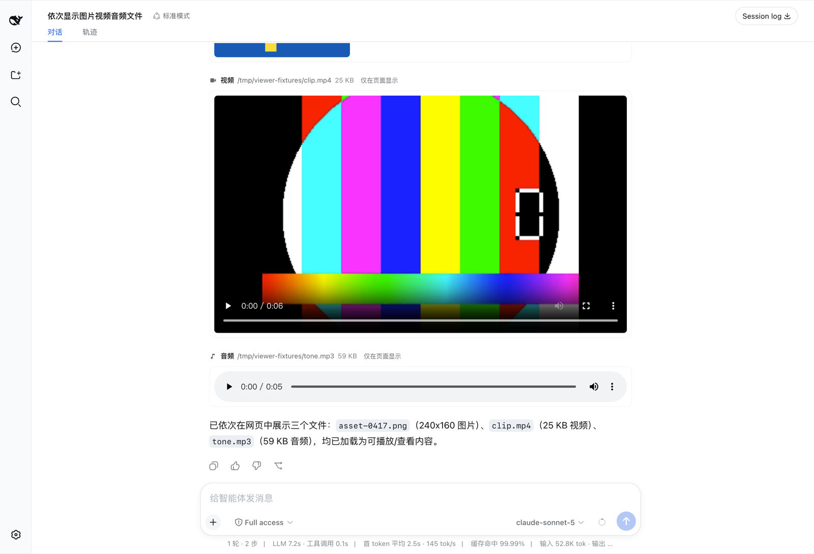
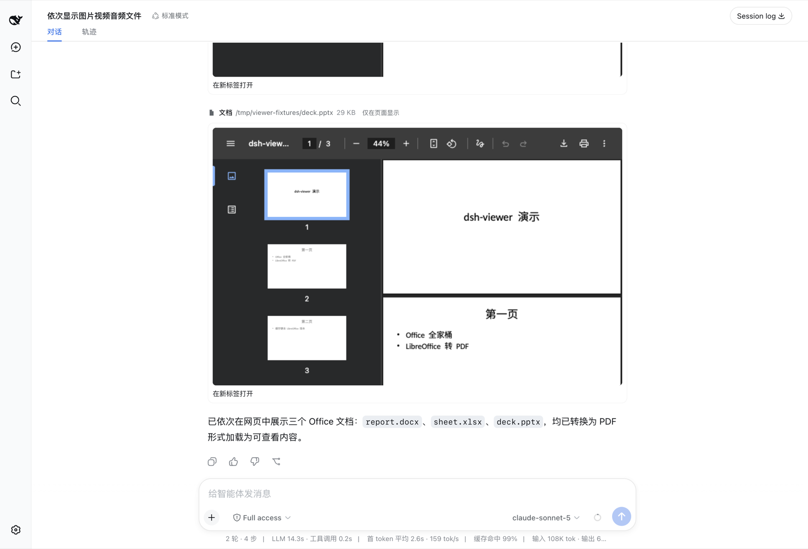
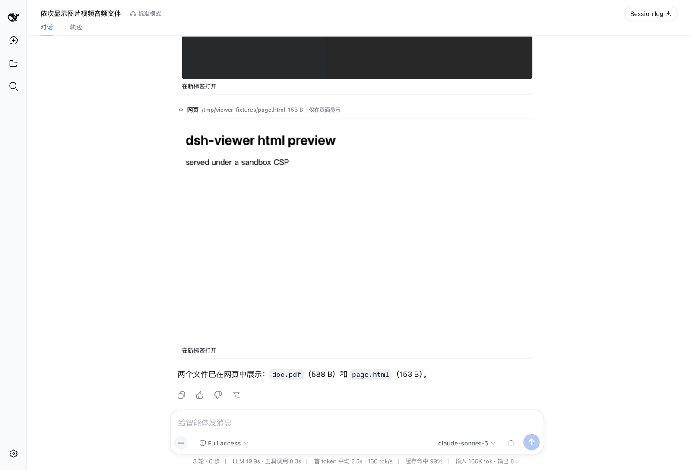

<div align="center">


# omnimux-viewer

**Everything renders.** One `display_file` tool that puts images, video, audio, PDF, Office documents and local web pages inline in the [DeepSeek Harness](https://github.com/deepseek-ai) web UI — with a real player, not a filename and a byte count.

[English](README.md) · [中文](README.zh.md) · MIT

</div>

---

## What it does

The harness ships `read_image`, whose job is to put a picture into **model context**. It refuses on a text-only route, it handles four raster formats, and the built-in web client draws no card for it — so the human in front of the screen sees one line of text.

This plugin inverts that. Its job is to put a file **on your screen**. A text-only model route is a normal outcome, not a refusal, and every medium a browser can play is in scope.

**36 file extensions across 6 render kinds:**

| Kind | Element | Extensions |
| --- | --- | --- |
| Image | `` + click-to-zoom lightbox | `png` `jpg` `jpeg` `webp` `gif` `svg` `avif` `bmp` `ico` `apng` |
| Video | `<video controls>`, seekable | `mp4` `m4v` `webm` `ogv` `mov` |
| Audio | `<audio controls>` | `mp3` `m4a` `aac` `wav` `flac` `ogg` `oga` `opus` |
| PDF | embedded viewer | `pdf` |
| Document | converted to PDF, embedded | `docx` `doc` `rtf` `odt` `xlsx` `xls` `ods` `pptx` `ppt` `odp` |
| Web page | sandboxed `<iframe>` | `html` `htm` |

Anything else still gets a card with its type, size and an open link — there is no kind that renders nothing.

On a model route that accepts image input, a `png` / `jpg` / `jpeg` / `webp` / `gif` **also** enters the model's own context, so one call both shows you the file and lets the model see it. Everything else is shown to you only, and the card says so.

## Screenshots

Images, video and audio in one turn — real players, real scrub bars:



Word, Excel and PowerPoint, converted on the host and embedded:



PDF and a local HTML page, live:



## Install

```sh
dsh plugin --profile web add omnimux-viewer
```

Then add the package name to `dsh.profile.bundles` in your profile's `package.json` and **restart the profile** — bundle membership changes do not hot-reload.

Office rendering additionally needs LibreOffice on `PATH` (or the macOS app bundle):

```sh
brew install --cask libreoffice     # macOS
```

Without it, every other format still works and a document card says exactly what is missing.

## How the bytes reach the page

Two channels, in priority order.

**A signed HTTP route** (`/crosery/dsh-viewer/asset`) streams from the host. It is the only channel that can carry video, audio, PDF or HTML, and the only one that supports range requests — which is what makes a `<video>` seekable at all.

**The durable attachment store** is the fallback. Images only, but it is irreplaceable in two cases: a filesystem backend that exposes no local path (a remote workspace), and rendering a shipped `read_image` result, which has an attachment and no URL.

They are not redundant: a raster on a vision route still goes through the attachment store, because that is the only way it also reaches the model.

## Security

The route **never accepts a path from the browser.** At tool time the host signs the resolved absolute path with a per-harness HMAC key; path and MAC travel together in the URL, and the route honours a path only after the MAC verifies.

- Key: 32 random bytes at `$DSH_HOME/.dsh-viewer-asset-key`, mode `0600`, generated on first use. A self-contained signature rather than an in-process token table, because cards must survive a restart — a card replayed from a months-old session log holds only the URL it was minted with.
- Tampering with the path, swapping keys, dropping the signature, or re-spelling the base64 with padding all return `404`. "Not signed by us" and "signed but the file is gone" return the *same* status, so a probe cannot learn whether a file exists.
- `text/html` and `image/svg+xml` ship with a `Content-Security-Policy` (`sandbox` and `default-src 'none'` respectively): navigating directly to such an asset would otherwise run its script on the app's origin. Everything carries `X-Content-Type-Options: nosniff`.
- Bytes stream with `createReadStream`, not `ctx.fs.readBytes` — the latter materializes the whole file in memory, and a two-hour video is precisely the case this plugin exists for.

## Configuration

Settings namespace `crosery-viewer`. Every default is the behaviour the plugin exists to provide; each flag gives one piece back.

| Field | Default | Turning it off |
| --- | --- | --- |
| `tool` | `true` | `display_file` is not registered at all |
| `redirectRead` | `true` | `read` may decode a raster into replacement characters again |
| `feedModel` | `true` | images are shown only, never added to model context |
| `supersedeReadImage` | `true` | the shipped `read_image` becomes visible to the model again |

Edit `$DSH_HOME/settings.yaml` — hot-reloaded, no restart.

## Design notes

**`read` on binary media is not an error.** The shipped filesystem provider samples the file head and throws `FS_NOT_TEXT` on a NUL byte, so `read` aimed at a PNG paints a red failure row with or without this plugin — for a file that exists and is one call away from being on screen. Neither obvious correction removes it: a `tools/pre-execute` denial materializes its own error, and a `tools/post-execute` decision cannot replace the value of a failed result. So the correction runs in the `tools/execute` around-dispatch waterfall and never calls `next()` — no filesystem I/O happens at all, and the authored success is re-projected through the owning tool's own `render` and `presentationMeta`, which replaces the persisted read metadata too. The result is an ordinary successful read whose one line points at `display_file`.

**One image entry point.** `read_image` and `display_file` overlap on exactly one thing — putting a raster into model context — and a model offered both uses both. Measured on a real 2.2 MB PNG: the same image entered context twice in one turn. `display_file` is a strict superset, so `read_image` is hidden per agent via `tools.restrict()` on `agent/created`, retried on `tools/change` because the shipped tool registers behind an async service injection.

**Nested `run_code` calls get no `presentationMeta`.** The registry projects it only for top-level calls, so a `display_file` invoked from inside `run_code` would render as a bare header. The model-facing envelope therefore carries `<media>`, `<bytes>` and `<asset>` elements, and the card rebuilds from its own envelope when metadata is absent — validated through the same narrowing the replay path uses.

**A PDF iframe must not be sandboxed.** `sandbox` without `allow-same-origin` gives an opaque origin, and Chrome's PDF viewer refuses to run there, showing "This page has been blocked by Chrome". Local HTML is the opposite case and keeps the sandbox.

## Development

```sh
npm install
npm run typecheck   # host and client are separate programs — see below
npm run build       # two .d.ts trees + two bundles
npm test            # 66 cases
```

Two tsconfigs are required, not fastidiousness: both halves augment the same `@deepseek-ai/cordis` `Context`, and `sessions` is `SessionStore` on the host but `ISessions` in the browser. One program seeing both augmentations silently resolves the wrong one, because `skipLibCheck` hides the conflict.

`tests/asset-route.test.ts` mounts the handler on a real `node:http` server and issues real requests — range correctness cannot be proven by unit-testing the parser. `tests/convert.test.ts` builds a DOCX with LibreOffice, converts it back, and asserts the artifact starts with `%PDF-`.

## Harness compatibility

Built and tested against the newest **coherent** harness train, `next` = `0.1.1-rc.2`, and the peer ranges carry an explicit prerelease branch so every `0.1.x` prerelease resolves — a naive broad range silently excludes them all.

`0.1.2-alpha.2` is deliberately **not** claimed. That train is published incomplete (`@deepseek-ai/dsh-client-runtime` has no build on it, so it cannot install as a set) and it drops `installSettingsSection` and `settingsNamespace` from `@deepseek-ai/dsh-settings` with no replacement in the published types. Claiming support would hand users an `ERESOLVE` or a runtime crash. The peer range therefore stops below `0.1.2`, and a scheduled CI job (`.github/workflows/harness-compat.yml`) re-tests against the `next` and `alpha` tags weekly and opens an issue the moment upstream moves — so the range widens on evidence, not optimism.

## Known limitations

- Local file paths only; URLs are not accepted.
- Video and audio duration/resolution are not in the card header — that needs `ffprobe`. The player shows them.
- Object URLs are revoked at page unload, bounding held blobs by the number of distinct attachments displayed in one page lifetime.
- On a remote workspace with no `processPath`, non-image media have no channel and the card says so.
- No transcoding: a codec the browser refuses (ProRes in a `.mov`) falls back to the `<video>` fallback text.

## License

MIT © Crosery
