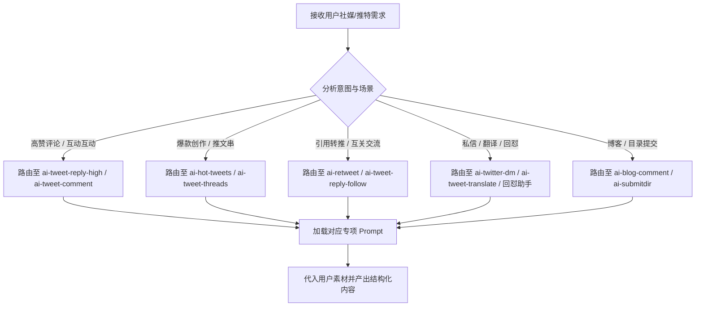

# SoPilot 社媒营销智能体路由中心（sopilot-social-agents）

本 Skill 汇集了源自 SoPilot 的 14 套社媒营销专项智能体提示词与表单配置，重点覆盖 Twitter / X 平台的深度运营场景（包括高赞互动、推文串改写、引用转推、热点模拟、私信沟通及回怼反驳等），以及博客外链与目录提交助手。

## 场景路由总表

当用户提出社媒文案、推特互动或营销任务时，根据下表智能路由至对应的专项提示词：

| 序号 | 场景类别 | 核心目标 / 触发关键词 | 智能体标识 (Slug) | 对应提示词文件 (位于 `references/prompts/`) |
| :--- | :--- | :--- | :--- | :--- |
| 1 | **推特互动** | 生成高赞评论、出彩神评、截流吸粉、信息增量 | `ai-tweet-reply-high` | `ai-tweet-reply-high.sys-prompt.md` |
| 2 | **爆款复刻** | 改写爆款推文、提炼钩子框架、二创爆款 | `ai-hot-tweets` | `ai-hot-tweets.sys-prompt.md` |
| 3 | **主页发帖** | 模仿热点生成推文、主页原创推文、蹭热点 | `ai-tweet-imitation` | `ai-tweet-imitation.sys-prompt.md` |
| 4 | **深度长文** | 单条推文改写为推文串 (Threads)、干货拆解 | `ai-tweet-threads` | `ai-tweet-threads.sys-prompt.md` |
| 5 | **转推引流** | 中文引用转帖 (Quote Tweet)、补充观点 | `ai-retweet` | `ai-retweet.sys-prompt.md` |
| 6 | **日常简评** | 简短评论、快速互动、破冰 | `ai-tweet-reply` | `ai-tweet-reply.sys-prompt.md` |
| 7 | **专业评论** | 高质量评论、专业探讨、技术交流 | `ai-tweet-comment` | `ai-tweet-comment.sys-prompt.md` |
| 8 | **互关促活** | 中文互关评论、建立同行联系、抱团交流 | `ai-tweet-reply-follow` | `ai-tweet-reply-follow.sys-prompt.md` |
| 9 | **出海英文** | 英文推文评论 (English Tweet Reply)、地道表达 | `twitter-reply-en` | `twitter-reply-en.sys-prompt.md` |
| 10 | **私信触达** | 生成推特私信 (DM)、商务洽谈、合作沟通 | `ai-twitter-dm` | `ai-twitter-dm.sys-prompt.md` |
| 11 | **出海翻译** | 翻译英文推文为中文 Threads、出海内容本土化 | `ai-tweet-translate` | `ai-tweet-translate.sys-prompt.md` |
| 12 | **趣味反驳** | 推特回怼助手、幽默梗图反驳、化解杠精 | `cmqolx85u000x1fbggacvllkj` | `cmqolx85u000x1fbggacvllkj.sys-prompt.md` |
| 13 | **博客推广** | AI博客评论助手、文章留言外链 | `ai-blog-comment` | `ai-blog-comment.sys-prompt.md` |
| 14 | **外链目录** | AI提交目录助手、产品导航站提交文案 | `ai-submitdir` | `ai-submitdir.sys-prompt.md` |

---

## 路由与执行流程

### 1. 意图识别与场景定位
- 分析用户输入的文本、推文链接、原推正文或发布目标。
- 命中上述路由表中的对应专项。若需求跨越多个场景（例如：既要改写为 Threads，又要准备首条引导评论），可依次路由执行。

### 2. 专项 Prompt 加载
- 专项提示词存放于本 skill 的 `references/prompts/<slug>.sys-prompt.md`。
- 执行时加载对应 Markdown 文件中的系统提示词规则。

### 3. 内容生成与质量准则
- **信息增量**：避免“写得真好”、“赞同”等无营养水评，必须补充新数据、案例、反思或反向思考。
- **节奏与断句**：短句为主，2~3 句一段，段落间空行，保持 Twitter 移动端的舒适阅读体验。
- **真实人设**：保持真实行业从业者或深度玩家口吻，严禁刻意 AI 腔调（如“作为一名人工智能…”、“综上所述…”）。

---

## 平台安全与规范
- 严格遵守 X / Twitter 社区准则，不得生成包含违规营销、仇恨言论、骚扰或恶意网络攻击的内容。
- 私信 (DM) 与评论生成应以建立真实合作与价值交流为目的，避免触发垃圾信息 (Spam) 判定。
