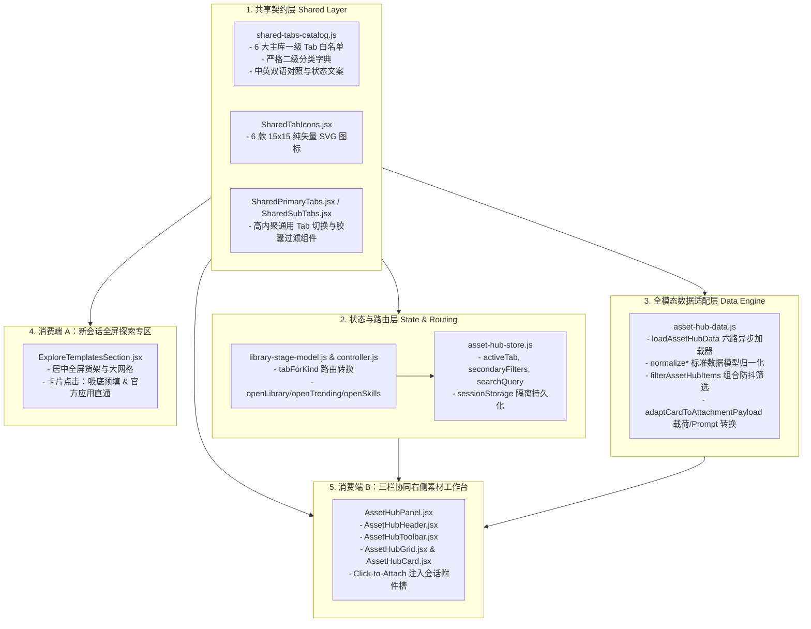

# 素材工作台与新会话共享 Tab 栏（Asset Hub Shared Tabs）系统架构与工程实施方案

- **文档状态**：**架构方案核准签发（ARCH_APPROVED）**
- **系统架构师**：高见远（Gao）
- **承接 PRD 规格**：`specs/asset-hub-shared-tabs.spec.md`（产品经理 许清楚 锁定签发）
- **主要实施角色**：
  - 前端开发工程师：裴像素（`expert_software_frontend_developer`）
  - 后端与系统工程师：寇豆码（`expert_software_engineer`）
- **归档路径**：`specs/asset-hub-shared-tabs-architecture.md`
- **实施基准**：基于现代 SaaS 极简工业美学，严格贯彻奥卡姆剃刀准则，严禁冗余字段与过度设计。

---

## 1. 架构愿景、问题解构与反过度设计守则

### 1.1 核心问题与架构诉求
在当前 OmniMux 系统的演进中，存在三个严重的结构性断层：
1. **职能定位错位（Canvas 混入素材中心）**：
   原素材工作台（Asset Hub）错误地将「画布」（Canvas）作为一级 Tab。画布本质是一个独立的流式节点编辑器视图，既不可作为卡片被挑选，也无法作为附件注入会话输入框，点击后内容为空，严重违背了素材工作台“检索、选用并注入多模态生产资料”的职责边界。
2. **能力残缺与双轨维护（双端体验割裂）**：
   新会话全屏探索专区（`ExploreTemplatesSection.jsx`）具备完整的 6 大类生产资料（精选、资产库、灵感库、商品库、爆款趋势、Skills），而三栏状态下的右侧素材工作台仅具备残缺的 4 个 Tab，且两端各自维护分类枚举、图标与样式，存在严重的样式漂移和重复代码。
3. **文案叠词与过度设计残留**：
   现有二级标签中充斥着「全部资产」「全部灵感」「全部商品」「全部爆款」等修饰性叠词，违反了现代 SaaS 极简界面设计法则。

### 1.2 架构目标与核心指标
1. **单一真源抽象（Single Source of Truth）**：
   在 `plugins/omnimux/src/client/shared/asset-hub-tabs/` 下建立统一的共享层，集中管理 6 大一级 Tab、二级分类白名单字典、标准 15×15 矢量 SVG 图标，供新会话全屏专区与右侧素材工作台双端消费。
2. **六大主库 100% 对齐与全模态数据适配**：
   素材工作台一级 Tab 彻底更正为 `['featured', 'assets', 'inspiration', 'products', 'trending', 'skills']`，底层扩展支持 `featured`、`trending`、`skills` 的六路加载、组合过滤、归一化与 Click-to-Attach 注入。
3. **中栏黄金视口保宽（$\ge 380\text{px}$）与非破坏性交互**：
   任何分栏或唤起素材工作台的状态下，会话控制台物理宽度锁定 $\ge 380\text{px}$，点击卡片仅触发“附件注入 + Prompt 草稿追加”，严禁自动触发消息发送 API。
4. **反过度设计守则（Anti-Overdesign Law）**：
   - 彻底剔除组件 Props 与状态模型中任何未被 PRD 锁定的冗余修饰字段（禁止引入 `badge`、`tagline`、`isHot`、`diamondIcon` 等诱导前端过度设计的字段）；
   - 二级分类首项 100% 固定为「全部」（`all`），杜绝任何叠词；
   - 严格遵循 32px 控件高度基准与官方 `--dsw-alias-*` Design Tokens。

---

## 2. 系统架构模式与模块拓扑设计

### 2.1 依赖分层与架构拓扑

系统严格遵循单向依赖与清晰分层原则：**Shared Contracts Layer（共享契约层） $\rightarrow$ Data Normalizer Layer（数据适配层） $\rightarrow$ Navigation State & Router Layer（状态路由层） $\rightarrow$ Dual Surfaces Presentation Layer（双端消费表现层）**。



### 2.2 共享模块设计：`plugins/omnimux/src/client/shared/asset-hub-tabs/`

为避免新会话专区（`session-guide/`）与素材工作台（`workbench/`）产生交叉或反向依赖，将共享源独立置于客户端公共域：
- **`shared-tabs-catalog.js`**：
  纯数据与常量模块，零 React 依赖。包含一级 Tab 静态配置、二级分类白名单字典、I18N 文案字典及工具校验函数。
- **`SharedTabIcons.jsx`**：
  统一导出 `SharedTabIcon({ name, size = 15, className })`，提供标准 15×15 矢量 SVG 图标：
  - `book-open`（精选）
  - `folder`（资产库）
  - `lightbulb`（灵感库）
  - `shopping-bag`（商品库）
  - `trending-up`（爆款趋势）
  - `zap`（Skills）
- **`SharedPrimaryTabs.jsx`**：
  统一的一级导航 Tab 栏展示组件，接收 `activeTab`、`onTabChange`、`tabs` 及可选类名，双端样式通过 CSS class 自适应。
- **`SharedSubTabs.jsx`**：
  统一的二级分类选项卡组件，支持下划线（Underline）与紧凑胶囊（Pill）双模态渲染，首项绝对固定为「全部」。

---

## 3. 双端消费场景与全局状态机决策

### 3.1 消费场景分流决策树

全局由会话状态与分栏实测动态决策呈现形态，彻底消除全屏遮罩与界面断层：

```mermaid
graph TD
    Start[会话接入 / 视口更新] --> CheckBlank{isBlankConversation?<br/>新会话且无历史消息}
    CheckBlank -- 否 (已有会话消息) --> SceneB[场景 B: 三栏右侧素材工作台]
    CheckBlank -- 是 --> CheckCompact{isCompact 动态实测?<br/>effectivePanelOpen || splitCompact}
    CheckCompact -- 是 (窄屏/已展开右栏) --> CompactGuide[简洁对话引导态<br/>隐藏全屏卡片流<br/>支持右栏素材工作台]
    CheckCompact -- 否 (宽屏全屏初始态) --> SceneA[场景 A: 新会话全屏探索专区<br/>ExploreTemplatesSection.jsx]

    SceneA --> ActionA[点击卡片: 触发输入框吸底预填 / 应用直通启动]
    SceneB --> ActionB[点击卡片: Click-to-Attach 注入附件槽并追加 Prompt]
```

### 3.2 动态视口实测与 `isCompact` 判定算法
在 `SessionGuide.jsx` 与工作台协调器中，`isCompact` 是保证大屏体验与窄屏保宽平滑切换的权威信号：
1. **双信号融合判定**：
   $$\text{isCompact} = \text{effectivePanelOpen} \lor \text{splitCompact}$$
   - `effectivePanelOpen = panelOpen && !rightbarCollapsed`：仅在工作台处于逻辑展开且物理未被折叠时有效，杜绝内存状态残留；
   - `splitCompact`：DOM 实时计算视口。当总宽 $< 980\text{px}$ 或会话控制台物理宽度接近 $380\text{px}$ 临界值时触发。
2. **中栏黄金视口保宽法则**：
   无论在任何场景下打开场景 B（素材工作台），会话主控制台宽度均权威锁定 **$\ge 380\text{px}$**，严禁 `display: none`，对话上下文 100% 可见。

---

## 4. 全模态数据适配与六路加载引擎

### 4.1 彻底清理与废除 `canvas` 遗留分支
架构层面全面执行“奥卡姆剃刀”，移除所有历史残留的 `canvas` 逻辑：
- `asset-hub-store.js`：从 `PRIMARY_TABS`、`SECONDARY_FILTER_WHITELIST`、`ASSET_HUB_I18N_SPEC` 中彻底移除 `canvas`；
- `asset-hub-data.js`：清理所有 `tab === 'canvas'` 的死代码；
- `AssetHubToolbar.jsx`：移除 `activeTab !== 'canvas'` 条件判断，操作按钮严格按 `assets`（上传）与 `products`（添加商品）白名单展示；
- `AssetHubPanel.jsx`：移除 `if (activeTab === 'canvas')` 假数据清空分支。

### 4.2 统一数据模型契约（Normalized Model Contract）
六路数据通过归一化适配器统一封装为 `NormalizedAssetHubItem`：

```typescript
export interface NormalizedAssetHubItem {
  id: string;                      // 唯一实体 ID
  lane: 'featured' | 'assets' | 'inspiration' | 'products' | 'trending' | 'skills';
  title: string;                   // 纯客观标题/文件名
  thumbnailUrl: string;            // 封面/缩略图绝对或安全相对 URL
  previewVideoUrl?: string;        // 悬停 200ms 预览视频 URL（无则为空）
  mediaType: 'image' | 'video' | 'audio' | 'document' | 'app' | 'skill';
  durationText: string;            // 时长格式化，如 "00:15"
  formatText: string;              // 扩展名或标识，如 "MP4" / "TPL" / "SKILL" / "JSON"
  dimensionsOrSize: string;        // 分辨率或大小，如 "1920×1080" 或 "SKU: 9021"
  raw: Record<string, unknown>;    // 底层原始数据保留，供 AttachmentStore 注入
}
```

### 4.3 六路数据加载器（`loadAssetHubData`）设计

```javascript
/**
 * 六路素材数据统一加载分发器
 * @param {'featured'|'assets'|'inspiration'|'products'|'trending'|'skills'} tab
 * @param {{ fetchImpl?: typeof fetch, signal?: AbortSignal }} options
 * @returns {Promise<NormalizedAssetHubItem[]>}
 */
export async function loadAssetHubData(tab, options = {}) {
  const { fetchImpl, signal } = options;

  switch (tab) {
    case 'featured': {
      // 融合 7 大王牌应用 + 精选模板（内置数据集与缓存）
      return loadFeaturedHubItems();
    }
    case 'assets': {
      const res = await requestJson('/omnimux/assets/library', fetchImpl, signal);
      if (!res.ok) throw new Error(res.body?.message || '资产库暂时打不开');
      const list = pickArrayCandidate(res.body, ['assets', 'items']);
      return list.map(normalizeAssetItem).filter(Boolean);
    }
    case 'inspiration': {
      const res = await requestJson(
        '/omnimux/inspiration/local?sort=hot&page=1&page_size=48&projection=lean',
        fetchImpl,
        signal
      );
      if (!res.ok) throw new Error(res.body?.message || '灵感库暂时打不开');
      const list = pickArrayCandidate(res.body, ['data.items', 'items', 'videos', 'inspirations']);
      return list.map(normalizeInspirationItem).filter(Boolean);
    }
    case 'products': {
      const res = await requestJson('/omnimux/products', fetchImpl, signal);
      if (!res.ok) throw new Error(res.body?.message || '商品库暂时打不开');
      const list = pickArrayCandidate(res.body, ['products', 'items']);
      return list.map(normalizeProductItem).filter(Boolean);
    }
    case 'trending': {
      const res = await requestJson(
        '/omnimux/inspiration?sort=views&page=1&page_size=48&projection=lean',
        fetchImpl,
        signal
      );
      if (res.status === 401) {
        const err = new Error('登录后可查看云端灵感');
        err.code = 'need-login';
        throw err;
      }
      if (!res.ok) throw new Error(res.body?.message || '爆款趋势暂时打不开');
      const list = pickArrayCandidate(res.body, ['data.items', 'items', 'videos']);
      return list.map(normalizeTrendingItem).filter(Boolean);
    }
    case 'skills': {
      return loadSkillsHubItems();
    }
    default:
      return [];
  }
}
```

### 4.4 二级分类白名单字典与双语映射契约

严格执行 PRD 5.2 节白名单，首项 100% 固定为「全部」（`all`）：

```javascript
export const SHARED_SUB_CATEGORIES = Object.freeze({
  featured: Object.freeze([
    { id: 'all', nameZh: '全部', nameEn: 'All' },
    { id: 'hook-intro', nameZh: '黄金开场', nameEn: 'Hook & Intro' },
    { id: 'ugc-review', nameZh: '真实种草', nameEn: 'UGC & Review' },
    { id: 'cinematic-vfx', nameZh: '视效大片', nameEn: 'Cinematic VFX' },
    { id: 'fashion-try-on', nameZh: '模特试穿', nameEn: 'Fashion Try-On' },
    { id: 'industry-packs', nameZh: '行业精选', nameEn: 'Industry Packs' },
    { id: 'durability-test', nameZh: '硬核评测', nameEn: 'Durability Test' },
    { id: 'apps-software', nameZh: '软件应用', nameEn: 'Apps & Software' },
  ]),
  assets: Object.freeze([
    { id: 'all', nameZh: '全部', nameEn: 'All' },
    { id: 'local-upload', nameZh: '本地上传', nameEn: 'Local Uploads' },
    { id: 'ai-generated', nameZh: '生成资产', nameEn: 'AI Generated' },
    { id: 'digital-human', nameZh: '数字人', nameEn: 'Digital Humans' },
    { id: 'product-images', nameZh: '商品图', nameEn: 'Product Images' },
  ]),
  inspiration: Object.freeze([
    { id: 'all', nameZh: '全部', nameEn: 'All' },
    { id: 'viral-videos', nameZh: '爆款视频', nameEn: 'Viral Videos' },
    { id: 'storyboards', nameZh: '分镜脚本', nameEn: 'Storyboards' },
    { id: 'creative-prompts', nameZh: '创意提示词', nameEn: 'Creative Prompts' },
    { id: 'visual-styles', nameZh: '视觉风格', nameEn: 'Visual Styles' },
  ]),
  products: Object.freeze([
    { id: 'all', nameZh: '全部', nameEn: 'All' },
    { id: 'appliances', nameZh: '生活家电', nameEn: 'Appliances' },
    { id: 'digital-audio', nameZh: '数码影音', nameEn: 'Digital & Audio' },
    { id: 'beauty-care', nameZh: '美妆护肤', nameEn: 'Beauty & Care' },
    { id: 'fashion-apparel', nameZh: '服饰箱包', nameEn: 'Fashion & Bags' },
    { id: 'food-beverage', nameZh: '食品饮料', nameEn: 'Food & Beverage' },
  ]),
  trending: Object.freeze([
    { id: 'all', nameZh: '全部', nameEn: 'All' },
    { id: 'beauty-personal', nameZh: '美妆个护', nameEn: 'Beauty' },
    { id: 'fashion-style', nameZh: '服饰时尚', nameEn: 'Fashion' },
    { id: 'tech-electronics', nameZh: '数码家电', nameEn: 'Tech & Digital' },
    { id: 'food-drinks', nameZh: '美食饮品', nameEn: 'Food & Drinks' },
    { id: 'fitness-sports', nameZh: '运动健身', nameEn: 'Fitness & Sports' },
    { id: 'home-lifestyle', nameZh: '居家生活', nameEn: 'Home & Living' },
    { id: 'pet-lifestyle', nameZh: '萌宠生活', nameEn: 'Pets' },
  ]),
  skills: Object.freeze([
    { id: 'all', nameZh: '全部', nameEn: 'All' },
    { id: 'ugc-testimonial', nameZh: 'UGC 种草', nameEn: 'UGC' },
    { id: 'video-ads', nameZh: '视频广告', nameEn: 'Video Ads' },
    { id: 'product-showcase', nameZh: '产品展示', nameEn: 'Showcase' },
    { id: 'storytelling', nameZh: '故事分镜', nameEn: 'Storytelling' },
    { id: 'voice-audio', nameZh: '配音与音频', nameEn: 'Voice & Audio' },
    { id: 'image-static', nameZh: '静态图像', nameEn: 'Images' },
  ]),
});
```

### 4.5 组合筛选过滤算法（`filterAssetHubItems`）
支持中文标签与英文 ID 双模映射过滤，并与关键字实时防抖过滤复合：
1. **二级标签匹配**：若所选 filter 非 `all` 且非 `全部`，按 `FILTER_PILL_ENUM_MAP` 匹配 `item.raw.category`、`item.raw.type`、`item.lane`、`tags` 或标题包含；
2. **关键词过滤**：忽略大小写，对 `item.title` 及关键描述进行文本子串匹配；
3. **计算复杂度**：$O(N)$ 原地过滤，单次过滤耗时 $< 2\text{ms}$（针对千量级数据瞬时响应）。

### 4.6 Click-to-Attach 载荷与 Prompt 映射规则（严格对齐 PRD 5.5 节）

用户在素材工作台中点击卡片，调用 `adaptCardToAttachmentPayload(card)` 生成载荷，并通过 `mergeLibraryPrompt(draft, prompt)` 追加草稿：

| 库类别 (`lane`) | 附件类型 (`kind`) | 扩展名 (`ext`) | 生成的 Prompt 草稿模板 |
|---|---|---|---|
| `featured` | `inspiration` | `TPL` | `请基于模板「${title}」，结合我的产品卖点生成对应视频脚本。` |
| `assets` | `asset` | `MP4`/`PNG`/`JPG` | `请参考附件素材「${title}」，进行风格对标与内容生成。` |
| `inspiration` | `inspiration` | `MP4`/`JPG` | `请基于灵感参考「${title}」，提炼其镜头节奏并复刻脚本。` |
| `products` | `product` | `JSON` | `请基于商品「${title}」，分析核心卖点并规划宣传文案。` |
| `trending` | `inspiration` | `MP4` | `请对标热门爆款「${title}」，还原其前3秒黄金Hook与分镜结构。` |
| `skills` | `skill` | `SKILL` | `为我运行技能「${title}」，指导下一步创作流程。` |

---

## 5. 状态机与加号菜单路由适配设计

### 5.1 导航状态机（`asset-hub-store.js`）升级
1. **一级 Tab 权威枚举**：
   ```javascript
   export const PRIMARY_TABS = Object.freeze([
     'featured',
     'assets',
     'inspiration',
     'products',
     'trending',
     'skills',
   ]);
   ```
2. **默认激活态安全回退**：
   `readPersistedTab()` 从 `sessionStorage` 读取。若读取到已废弃的 `'canvas'` 或未在 `PRIMARY_TABS` 中的值，安全回退至 `'featured'`（新会话首位）或 `'assets'`。
3. **二级过滤状态字典**：
   初始值对齐 6 大库，默认均为 `'all'` / `'全部'`。

### 5.2 加号菜单路由映射适配（`library-stage-model.js` & `controller.js`）
扩展 `tabForKind(kind)`，全面兼容加号菜单与外部调度：
```javascript
export function tabForKind(kind) {
  const k = String(kind || '').toLowerCase();
  if (k === 'product' || k === 'products') return 'products';
  if (k === 'inspiration') return 'inspiration';
  if (k === 'library' || k === 'assets' || k === 'asset') return 'assets';
  if (k === 'trending' || k === 'hot') return 'trending';
  if (k === 'skill' || k === 'skills') return 'skills';
  if (k === 'featured' || k === 'template' || k === 'templates' || k === 'app') return 'featured';
  return 'featured';
}
```
并在 `controller.js` 中公开路由方法：
- `openLibrary(sessionId)` $\rightarrow$ 路由至 `assets`
- `openProduct(sessionId)` $\rightarrow$ 路由至 `products`
- `openInspiration(sessionId)` $\rightarrow$ 路由至 `inspiration`
- `openTrending(sessionId)` $\rightarrow$ 路由至 `trending`
- `openSkills(sessionId)` $\rightarrow$ 路由至 `skills`
- `openFeatured(sessionId)` $\rightarrow$ 路由至 `featured`

---

## 6. 接口契约与数据结构规范

### 6.1 共享组件 Props 契约

#### 1. `SharedPrimaryTabs`
```typescript
export interface SharedPrimaryTabsProps {
  activeTab: 'featured' | 'assets' | 'inspiration' | 'products' | 'trending' | 'skills';
  onTabChange: (tabId: string) => void;
  isEn?: boolean;
  className?: string;
  tabClassName?: string;
  showIcon?: boolean; // 默认 true，渲染 15x15 矢量 SVG 图标
}
```

#### 2. `SharedSubTabs`
```typescript
export interface SharedSubTabsProps {
  activeTab: string;
  currentFilter: string; // 选中的二级分类 ID 或中文名称
  onFilterChange: (filterId: string) => void;
  isEn?: boolean;
  variant?: 'underline' | 'pill'; // 'underline' 供全屏探索，'pill' 供右栏工具栏
  className?: string;
}
```

### 6.2 状态机文案字典（严格字面值锁定）

```javascript
export const ASSET_HUB_I18N_SPEC = Object.freeze({
  primaryTabs: {
    featured: '精选',
    assets: '资产库',
    inspiration: '灵感库',
    products: '商品库',
    trending: '爆款趋势',
    skills: 'Skills',
  },
  actions: {
    fullscreen: '全屏',
    exitFullscreen: '退出全屏',
    collapse: '收起',
    upload: '上传',
    addProduct: '添加商品',
    clearSearch: '清除搜索',
    retry: '重试',
  },
  searchPlaceholder: '搜索素材',
  empty: {
    featured: '暂无精选',
    assets: '暂无资产',
    inspiration: '暂无灵感',
    products: '暂无商品',
    trending: '暂无爆款',
    skills: '暂无技能',
    search: '无匹配结果',
    error: '加载失败',
  },
});
```

---

## 7. 工程文件拓扑与变更清单

```text
plugins/omnimux/src/client/
├── shared/
│   └── asset-hub-tabs/                      [新增] 共享契约与 Tab 栏组件
│       ├── shared-tabs-catalog.js           [新增] 单一真源元数据、枚举与双语字典
│       ├── SharedTabIcons.jsx               [新增] 6 大标准 15x15 矢量 SVG 图标
│       ├── SharedPrimaryTabs.jsx            [新增] 共享一级 Tab 切换栏
│       ├── SharedSubTabs.jsx                [新增] 共享二级分类过滤栏（Underline/Pill）
│       └── shared-tabs.test.js              [新增] 共享层静态契约与字典单测
├── workbench/
│   ├── asset-hub-store.js                   [修改] 6 大 Tab 白名单，彻底移除 canvas
│   ├── asset-hub-data.js                    [修改] 扩展六路数据加载、归一化与 Prompt 生成
│   ├── AssetHubHeader.jsx                   [修改] 消费 SharedPrimaryTabs，移除 canvas
│   ├── AssetHubToolbar.jsx                  [修改] 消费 SharedSubTabs，优化操作按钮
│   ├── AssetHubPanel.jsx                    [修改] 清理 canvas 分支，适配 6 大库加载
│   └── styles/asset-hub-styles.js           [修改] 样式调整，保证 6 个 Tab 在 420px 宽下自适应
├── session-guide/
│   └── templates/
│       ├── ExploreTemplatesSection.jsx      [修改] 消费共享契约与 Tab 组件，移除冗余本地字典
│       └── templates-data.js                [修改] 二级分类首项对齐「全部」，引入共享真源
└── composer-add/
    ├── library-stage-model.js               [修改] tabForKind 扩充支持 6 大分类及 Prompt 契约
    └── controller.js                        [修改] openKind 扩充 trending / skills / featured 路由
```

---

## 8. 前后端有序任务分解与实施路线图

### 8.1 任务依赖拓扑（DAG 依赖树）

```text
T01 (共享层字典与图标抽离) 
 ├──> T02 (共享 Tab 组件封装)
 │     ├──> T07 (右栏素材工作台组件对接) ──> T09 (集成回归与验收)
 │     └──> T08 (新会话全屏探索专区对接) ──> T09
 ├──> T03 (Store 升级与 Canvas 拔除) ──────> T07
 └──> T04 (六路加载引擎与归一化适配) ──> T05 (组合过滤与 Prompt 适配) ──> T07
T06 (加号菜单与路由适配) ───────────────────> T07
```

### 8.2 任务清单与分工指派

#### 【T01 · 共享层字典与矢量图标抽离】
- **负责角色**：前端·裴像素（`expert_software_frontend_developer`）
- **前置依赖**：无
- **涉及文件**：
  - `plugins/omnimux/src/client/shared/asset-hub-tabs/shared-tabs-catalog.js`
  - `plugins/omnimux/src/client/shared/asset-hub-tabs/SharedTabIcons.jsx`
  - `plugins/omnimux/src/client/shared/asset-hub-tabs/shared-tabs.test.js`
- **实施标准**：
  1. 完整实现 `SHARED_PRIMARY_TABS`（6 大 Tab）与 `SHARED_SUB_CATEGORIES`；
  2. 所有二级分类首项严格且唯一为 `{ id: 'all', nameZh: '全部', nameEn: 'All' }`，严禁任何“全部XX”叠词；
  3. 导出标准 15×15 矢量 SVG 图标组件，严禁引入外部图片或 Emoji；
  4. 编写静态断言单测，100% 验证字段拼写与数组长度。
- **验收标准**：`npm test shared-tabs.test.js` 100% 绿灯。

#### 【T02 · 共享 Tab 交互组件封装】
- **负责角色**：前端·裴像素（`expert_software_frontend_developer`）
- **前置依赖**：T01
- **涉及文件**：
  - `plugins/omnimux/src/client/shared/asset-hub-tabs/SharedPrimaryTabs.jsx`
  - `plugins/omnimux/src/client/shared/asset-hub-tabs/SharedSubTabs.jsx`
- **实施标准**：
  1. `SharedPrimaryTabs` 封装标准 `role="tablist"`，支持键盘焦点移动与微动效；
  2. `SharedSubTabs` 支持 `variant="underline"`（全屏下划线）与 `variant="pill"`（工作台胶囊）双渲染形态；
  3. 控件高度严格锁定 32px 基准，内边距与字体大小消费 Design Tokens。
- **验收标准**：组件能够无副作用独立渲染并通过基本交互单测。

#### 【T03 · 素材工作台 Store 升级与 Canvas 彻底拔除】
- **负责角色**：前端·裴像素（`expert_software_frontend_developer`）
- **前置依赖**：T01
- **涉及文件**：
  - `plugins/omnimux/src/client/workbench/asset-hub-store.js`
  - `plugins/omnimux/src/client/workbench/asset-hub.test.js`
- **实施标准**：
  1. 更新 `PRIMARY_TABS` 为 `['featured', 'assets', 'inspiration', 'products', 'trending', 'skills']`；
  2. 移除所有关于 `canvas` 的定义与特殊处理，对齐 `SECONDARY_FILTER_WHITELIST`；
  3. 在 `readPersistedTab` 中对非法持久化值回退至 `'featured'` 或 `'assets'`。
- **验收标准**：原有 store 相关测试通过且新 Tab 状态切换正常。

#### 【T04 · 全模态六路加载器与归一化适配器】
- **负责角色**：前端·裴像素（`expert_software_frontend_developer`）/ 协同：后端·寇豆码（`expert_software_engineer`）
- **前置依赖**：T01
- **涉及文件**：
  - `plugins/omnimux/src/client/workbench/asset-hub-data.js`
  - `plugins/omnimux/src/client/session-guide/templates/featured-apps-data.js`
- **实施标准**：
  1. 在 `loadAssetHubData` 中新增 `featured`、`trending`、`skills` 加载分支；
  2. 实现 `normalizeTrendingItem`，支持视图、播放量、时长与预览视频解析；
  3. 实现 `loadFeaturedHubItems` 与 `loadSkillsHubItems`，提取 7 大王牌应用与内置技能；
  4. 保证所有分支输出严格符合 `NormalizedAssetHubItem` 契约。
- **验收标准**：六路加载器在 mock 与实测环境下均能稳定返回格式化卡片数组。

#### 【T05 · 组合过滤器与附件载荷 Prompt 适配】
- **负责角色**：前端·裴像素（`expert_software_frontend_developer`）
- **前置依赖**：T04
- **涉及文件**：
  - `plugins/omnimux/src/client/workbench/asset-hub-data.js`
- **实施标准**：
  1. 扩充 `FILTER_PILL_ENUM_MAP`，覆盖 `featured`、`trending`、`skills` 全部分类枚举映射；
  2. 在 `adaptCardToAttachmentPayload` 中实现 PRD 5.5 节规定的 6 类载荷转换；
  3. 生成标准 Prompt 模板字符串，严禁自动调用发消息接口。
- **验收标准**：点击 6 种不同卡片生成的 payload 与 prompt 与规格表 100% 吻合。

#### 【T06 · 加号菜单与路由适配】
- **负责角色**：前端·裴像素（`expert_software_frontend_developer`）
- **前置依赖**：T03
- **涉及文件**：
  - `plugins/omnimux/src/client/composer-add/library-stage-model.js`
  - `plugins/omnimux/src/client/composer-add/controller.js`
  - `plugins/omnimux/src/client/composer-add/library-stage-model.test.js`
- **实施标准**：
  1. 扩充 `tabForKind`，映射 `trending` $\rightarrow$ `'trending'`，`skill`/`skills` $\rightarrow$ `'skills'`，`featured` $\rightarrow$ `'featured'`；
  2. `controller.js` 扩展暴露对应路由入口方法；
  3. 保留加号菜单点击后平滑唤起右栏工作台的现有机制。
- **验收标准**：调用外部路由方法可在 $< 2\text{ms}$ 内完成工作台激活并切到对应 Tab。

#### 【T07 · 右栏素材工作台双端消费对接与样式适配】
- **负责角色**：前端·裴像素（`expert_software_frontend_developer`）
- **前置依赖**：T02, T03, T04, T05, T06
- **涉及文件**：
  - `plugins/omnimux/src/client/workbench/AssetHubHeader.jsx`
  - `plugins/omnimux/src/client/workbench/AssetHubToolbar.jsx`
  - `plugins/omnimux/src/client/workbench/AssetHubPanel.jsx`
  - `plugins/omnimux/src/client/workbench/styles/asset-hub-styles.js`
- **实施标准**：
  1. 顶栏消费 `SharedPrimaryTabs`，右侧保留全屏切换与收起按钮；
  2. 工具栏消费 `SharedSubTabs`，胶囊标签首项为「全部」；操作按钮仅在 `assets`（上传）与 `products`（添加商品）展示；
  3. 调整顶栏 CSS 间距，确保 6 个 Tab 在 $420\text{px}$ 最小侧栏宽度下单行不折行、优雅排布；
  4. 彻底删除 `canvas` 遗留的任何处理代码。
- **验收标准**：三栏状态下右侧工作台 6 大 Tab 切换流畅，Click-to-Attach 注入正常。

#### 【T08 · 新会话全屏探索专区对接】
- **负责角色**：前端·裴像素（`expert_software_frontend_developer`）
- **前置依赖**：T01, T02
- **涉及文件**：
  - `plugins/omnimux/src/client/session-guide/templates/ExploreTemplatesSection.jsx`
  - `plugins/omnimux/src/client/session-guide/templates/templates-data.js`
- **实施标准**：
  1. 移除 `ExploreTemplatesSection.jsx` 内原有的本地图标渲染函数和本地 Tab 列表，改为消费 `shared-tabs-catalog.js` 与 `SharedPrimaryTabs`；
  2. 修复 `templates-data.js` 中二级分类叠词（将「全部资产」「全部商品」等纠正为「全部」）；
  3. 保证原有的应用直通启动、货架展示、网格视图与吸底联动逻辑无缝延续。
- **验收标准**：新会话全屏下 6 大 Tab 视觉无任何抖动，分类切换与卡片吸底完全正常。

#### 【T09 · 自动化测试与双端集成回归】
- **负责角色**：QA 测试工程师 / 前端·裴像素
- **前置依赖**：T07, T08
- **涉及文件**：
  - `plugins/omnimux/src/client/workbench/asset-hub.e2e.test.js`
  - `plugins/omnimux/src/client/workbench/asset-hub.test.js`
  - `plugins/omnimux/src/client/session-guide/templates/explore-templates-rearchitecture.e2e.test.js`
- **实施标准**：
  1. 全量单元测试回归，覆盖共享契约、Store、加载器、过滤算法与 Prompt 拼接；
  2. E2E 集成测试覆盖场景 A（新会话全屏）与场景 B（三栏工作台），验证 Click-to-Attach 与保宽；
  3. 验证无 `canvas` 残留、无控制台报错、无样式破损。
- **验收标准**：全量测试套件 100% 绿灯，无任何 Warning。

---

## 9. 质量保障、测试契约与架构验收门禁

### 9.1 性能与生命周期门禁
1. **渲染与响应性门禁**：
   - Tab 切换重渲染时间 $\le 16\text{ms}$（60fps 流畅标准）；
   - 二级分类过滤防抖延迟严格控制在 $150\text{ms}$ 内，过滤计算耗时 $\le 5\text{ms}$。
2. **生命周期与网络容错**：
   - 切换 Tab 时必须通过 `AbortController` 立即取消上一轮未完成的网络请求，防止竞态条件导致数据覆盖；
   - 离开组件或折叠侧栏时，彻底清理所有悬停计时器、通知定时器与全局 DOM 观察者。

### 9.2 现代 SaaS 工业美学与红线复核清单

```markdown
- [x] 1. 一级 Tab 一致性：
      - 新会话全屏与右栏工作台 100% 统一为 6 大主库；
      - 「画布」（canvas）Tab 在全系统彻底绝迹；
      - 6 款图标全部使用 15x15 纯矢量 SVG，零外部图片，零 Emoji。
- [x] 2. 二级分类规范性：
      - 所有库二级筛选第一项必须严格显示为「全部」；
      - 绝不允许出现「全部资产」「全部灵感」「全部商品」「全部爆款」等冗余文案。
- [x] 3. 极简工业美学：
      - 统一 32px 控件高基准；
      - 零彩色高亮 Badge，零未授权副标题，零装饰性发光。
- [x] 4. 会话黄金视口与交互契约：
      - 中间会话控制台物理宽度永远 >= 380px，常驻保活；
      - 点击卡片执行 Click-to-Attach 注入附件槽并追加 Prompt，绝对禁止自动触发发送消息。
```

---

## 10. 架构签发结论（Architect Sign-off）

本架构方案完全承接并固化了产品经理许清楚在 `specs/asset-hub-shared-tabs.spec.md` 中的产品决策。通过在 `plugins/omnimux/src/client/shared/asset-hub-tabs/` 构建共享契约层，从根源上消除了新会话全屏与素材工作台的双轨割裂，彻底拔除了定位错位的「画布」分支，并在保证 $\ge 380\text{px}$ 黄金保宽的前提下实现了全模态生产资料的即选即注入。

**指令下达**：
请前端开发工程师 **裴像素（`expert_software_frontend_developer`）** 严格按照第 8 节任务拓扑与实施标准推进代码工程实现。
