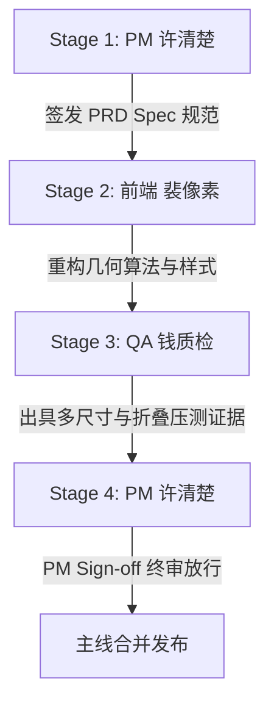

# 《新会话吸底输入框栏目页面（会话工作台）内部居中纠偏 PRD 原型与 UI 元素/文案字典规格（Spec Plan）》

**作者**：产品经理 许清楚（Xu）  
**执行角色**：架构师 高见远、前端开发 裴像素、质量保证 钱质检  
**版本**：v1.0 (2026-09-26)  
**状态**：已批准签发（Approved for Engineering Implementation）  
**关联任务**：吸底输入框居中参照系纠偏（从全局视口居中收敛至栏目页面内部居中）  

---

## 一、产品概况与目标（PRD Overview）

### 1. 业务背景与用户痛点原声
在 OmniMux 会话工作台的新会话欢迎页（Session Guide）与灵感复刻流中，底部输入框（Composer）支持在“顶部原位流式（Inline）”与“底部悬浮吸底（Docked）”之间随页面滚动平滑切换。
上个迭代中，输入框已实现与顶部原生上限（952px）的宽度对齐（方案 A）。但在带侧边栏的桌面端实际使用中，用户提出强烈体验缺陷反馈：
> **用户实测原声**：“输入框宽度正常了 但是 在会话区域靠左了？当前是全局居中？我要的是栏目页面的居中”。

当前输入框在视觉上明显偏向会话区域左侧，导致视线焦点错位，严重破坏了桌面端专业 SaaS 的排版平衡与沉浸感。

### 2. 现状技术根因深度剖析（Root Cause Analysis）
经产品与架构联合排查，确认该几何缺陷由**定位参照系错位与选择器穿透失效**引发：
1. **定位模式的绝对参照系断层**：
   - 吸底状态下的输入框采用 `position: fixed !important;` 脱离文档流，其定位基准原点是**浏览器最外层视口（Viewport / 100vw）**，而非会话工作台内部。
2. **选择器穿透失效导致退化为全屏**：
   - 现行 `dockGeometry(card, band)` 试图通过 `card?.closest?.('[data-conversation-scroll], [class*="centerCol"]')` 获取内容列边界。
   - 但在真实 DOM 树中，输入框容器 `[data-composer-seat]` 与主滚动区域 `[data-conversation-scroll]` 是**同级兄弟节点**，`Element.closest()` 仅向上沿着祖先链查找，根本无法查找到兄弟元素，导致查找结果恒为 `null`！
   - 查找失败后退化为 `rect = band.getBoundingClientRect()`。而 `band` 是宿主根节点 `root`（`[data-phase]`，宽度撑满 100vw，`left` 为 0）。
3. **全局居中算法吞噬了侧边栏宽度**：
   - 代码执行了全局居中计算：`left = rect.left + (rect.width - width) / 2 = (100vw - width) / 2`。
   - 桌面端左侧常驻有侧边栏（宽度 `var(--omnimux-sidebar-width, 280px)`，在扩展态可达 380px ~ 440px）；右侧才是真正的会话主工作区（栏目页面）。
   - **数值量化举例（以 2700px 超宽屏、280px 侧边栏、952px 输入框为例）**：
     - 会话栏目页面实际范围：`left = 280px`，`width = 2420px`；
     - 栏目页面理想居中位置：`left = 280 + (2420 - 952) / 2 = 1014px`，中心轴位于 `1490px`；
     - 当前全屏居中错误位置：`left = 0 + (2700 - 952) / 2 = 874px`，中心轴位于 `1350px`；
     - **几何偏差值**：输入框整整**向左偏移了 140px**（恰好为侧边栏宽度的一半：`280px / 2 = 140px`）！
     - 在栏目页面内，输入框左侧空白仅有 `594px`，而右侧空白多达 `874px`，形成极其明显的“靠左畸变”！

### 3. 方案目标与核心决策（Core Decisions）
1. **决策一：纠偏基准——锁定「栏目页面（会话工作台）」**：
   - 吸底输入框的居中锚定物由整个窗口强制纠偏为**右侧会话栏目工作区（`.dshDesktopConversationSurface` / `[data-conversation-scroll]`）**。
2. **决策二：鲁棒的多层级列边界探测算法（Column Geometry Probe）**：
   - 重构 `dockGeometry` 中的几何获取逻辑，通过全局文档探测、兄弟节点跨越及 CSS 变量协同读取真实工作区左边缘 `columnLeft` 与宽度 `columnWidth`。
3. **决策三：双轨保障（JS 动态计算 + CSS 声明协同）**：
   - JS 负责在视口变化、侧边栏折叠/展开、会话切换时毫秒级精准注入 `--omnimux-dock-left` 与 `--omnimux-dock-width`；
   - CSS 确保在动画与样式计算层具备兜底对齐能力。
4. **决策四：零过度设计红线（Anti-Overdesign Law）**：
   - 严禁为了“告知居中”而添加任何辅助标签、Badge、微调把手或气泡文字；
   - 收起操作项严格保持单一纯动词：中文「收起」/ 英文「Collapse」。

### 4. 明确不做事项（Non-Goals — 显式红线）
- **绝不破坏原生 952px 上限（方案 A）**：本次重构仅纠偏水平位移坐标 `left`，严禁擅自改动已通过验收的 952px 最大宽度基准；
- **绝不侵入 DSH 核心 DOM 树层级**：不强行将 fixed 输入框移入 overflow: hidden 的滚动容器内部，避免引起滚动剪裁或图层撕裂；
- **绝不添加居中文案或切换模式**：不向用户暴露“居中方式：全局/栏目”等冗余设置项；
- **绝不引入视觉跳动**：侧边栏在 280px 与 0px 切换展开/折叠时，输入框位移必须伴随平滑过渡，严禁出现跳帧或抖动。

---

## 二、信息架构与极简原型线框（Prototype Wireframe）

### 1. 宽屏常规态：错误现状（全局居中）vs 正确方案（栏目页面内部居中）对比

#### ❌ 错误现状：全局居中导致输入框在会话栏目内严重靠左
```
0px (屏幕左边缘)                                                                                  2700px (屏幕右边缘)
▼                                                                                                 ▼
┌──────────────────┬──────────────────────────────────────────────────────────────────────────────┐
│  左侧侧边栏      │  右侧栏目页面（会话工作台）                                                    │
│  width: 280px    │  left: 280px, width: 2420px, 中心轴: 1490px                                   │
│                  │                                                                              │
│  [会话列表]      │                                                                              │
│  [新建会话]      │           ┌────────────────────────────────────────┐                         │
│  [历史记录]      │           │ [data-composer-card] (952px)           │                         │
│                  │           │ 中心轴: 1350px (错误命中全屏中心)      │                         │
│                  │           └────────────────────────────────────────┘                         │
│                  │  ← 594px →                                          ←───────── 874px ──────→ │
│                  │  【左侧空白严重缩水】                                【右侧空白过大，视觉向左坍塌】│
└──────────────────┴──────────────────────────────────────────────────────────────────────────────┘
```

#### ✅ 正确方案：以会话栏目页面为唯一基准，实现内部绝对像素级居中
```
0px                                                                                               2700px
▼                                                                                                 ▼
┌──────────────────┬──────────────────────────────────────────────────────────────────────────────┐
│  左侧侧边栏      │  右侧栏目页面（会话工作台）                                                    │
│  width: 280px    │  left: 280px, width: 2420px, 中心轴: 1490px                                   │
│                  │                                                                              │
│  [会话列表]      │                                                              ┌────────┐      │
│  [新建会话]      │                                                              │ [收起] │      │
│  [历史记录]      │                    ┌─────────────────────────────────────────┴────────┐      │
│                  │                    │ [data-composer-card]                             │      │
│                  │                    │ width: 952px (方案 A 原生对齐)                   │      │
│                  │                    │ 中心轴: 1490px (与会话栏目中心完全重合)          │      │
│                  │                    │ left = 280 + (2420 - 952) / 2 = 1014px           │      │
│                  │                    └──────────────────────────────────────────────────┘      │
│                  │  ←───── 734px ────→                                   ←───── 734px ────→     │
│                  │  【左右空白严格对称 1:1，像素级居中于会话工作台】                              │
└──────────────────┴──────────────────────────────────────────────────────────────────────────────┘
```

---

### 2. 侧边栏折叠收起态（Sidebar Collapsed: width = 0px）
当侧边栏完全收起时，栏目页面覆盖 0px ~ 100vw 全屏，输入框平滑过渡至全屏中心，左右空白依然保持严格等距：
```
0px (侧边栏已折叠)                                                                                 2700px
▼                                                                                                 ▼
┌─────────────────────────────────────────────────────────────────────────────────────────────────┐
│  全屏会话工作台（left: 0px, width: 2700px）                                                     │
│                                                                                                 │
│                                                                                 ┌────────┐      │
│                                                                                 │ [收起] │      │
│                               ┌─────────────────────────────────────────────────┴────────┐      │
│                               │ [data-composer-card]                                     │      │
│                               │ width: 952px                                             │      │
│                               │ left = 0 + (2700 - 952) / 2 = 874px                      │      │
│                               └──────────────────────────────────────────────────────────┘      │
│  ←────────────── 874px ──────→                                  ←────────────── 874px ────────→ │
│  【全屏状态下自然对称居中】                                                                      │
└─────────────────────────────────────────────────────────────────────────────────────────────────┘
```

---

## 三、UI 元素与 SaaS 极简文案字典（UI & Copy Spec — 唯一真源）

### 1. UI 元素白名单与布局属性锁定表

| 区域 / 组件选择器 | 元素类型 | 允许渲染状态 | 核心几何与样式白名单属性 | 严禁附加项（显式红线） |
|---|---|---|---|---|
| `[data-omnimux-starter-host]` | 宿主根容器 | 常驻 | 承载由栏目居中算法动态注入的 CSS 变量：<br>`--omnimux-dock-left`<br>`--omnimux-dock-width`<br>`--omnimux-dock-bottom` | 严禁外层容器附加影响内部定位的 `transform`（防止破坏 fixed 坐标系）；严禁写死全屏居中的固定 left。 |
| `[data-composer-card]` (Inline 态) | 原生输入框 | 页面处于顶部可见范围 | `width: 100%!important;`<br>`max-width: var(--dsh-composer-card-max-width, 952px)!important;`<br>`margin-inline: auto!important;` | 严禁在 Inline 态生效任何吸底 fixed 样式；严禁在原位添加任何多余外边框或提示。 |
| `[data-composer-card]` (Docked 态) | 原生输入框 | 页面向下滚动且输入框离开顶部视口 | `position: fixed!important;`<br>`left: var(--omnimux-dock-left, 0px)!important;`<br>`width: var(--omnimux-dock-width, 100%)!important;`<br>`max-width: var(--dsh-composer-card-max-width, 952px)!important;`<br>`bottom: var(--omnimux-dock-bottom, 20px)!important;`<br>`z-index: 45!important;`<br>`transition: left 200ms cubic-bezier(0.16, 1, 0.3, 1), width 200ms cubic-bezier(0.16, 1, 0.3, 1);` | **【严禁项】**<br>1. 严禁使用全屏居中公式 `(100vw - width) / 2`；<br>2. 严禁出现 `max-width: none!important`；<br>3. 严禁添加“已居中”、“对齐”等任何状态 Badge；<br>4. 严禁添加装饰性阴影或彩色边框。 |
| `.omnimux-trending-undock` | 吸底收起气泡 | 仅在 Docked 吸底态浮现 | `position: fixed; z-index: 46;`<br>`left: calc(var(--omnimux-dock-left, 0px) + var(--omnimux-dock-width, 100%));`<br>`transform: translateX(calc(-100% - 4px));`<br>`bottom: calc(var(--omnimux-dock-bottom, 20px) + var(--omnimux-dock-card-height, 168px) + 8px);`<br>极简胶囊，中性边框。 | 严禁在 Inline 态显示；严禁附加删除 `×` 符号；严禁使用带品牌色的强提示底色。 |
| `.omx-attachment-dock` | 素材导轨 | 常驻卡片内 | `width: 100%!important;`<br>`max-width: 100%!important;`<br>`box-sizing: border-box!important;` | 严禁溢出 952px 卡片边界；左侧加号与素材首卡垂直严格左对齐。 |

---

### 2. 文案逐字锁定规范（Zero Overdesign，零多余废话）

| 控件对象 | 当前标准文案（中/英 逐字锁定） | 严禁文案（反面教材） | 决策依据与规范要求 |
|---|---|---|---|
| **吸底收起操作项** | 中文：`收起`<br>英文：`Collapse` | ❌ `收起输入框`<br>❌ `收起到底部`<br>❌ `栏目居中`<br>❌ `恢复默认位置` | 纯动词锁定。操作对象具象自明，禁止拖带名词宾语，禁止任何括号解释废话。 |
| **吸底状态提示** | **【无】零文案** | ❌ `输入框已居中于会话工作台`<br>❌ `自适应栏目宽度` | 界面自响应是理所当然的体验，严禁出现任何解释性 Toast、Tooltip、气泡或说明文字。 |
| **输入框占位符** | 原生注入文案保持 100% 原样 | ❌ `在会话工作台提问...`<br>❌ `已对齐栏目` | 严格由 DSH 原生协议下发，前端零篡改、零修饰。 |

---

## 四、技术实现架构指导（Architecture & Implementation Guidance）

供架构师高见远与前端开发裴像素对照实施：

### 1. 栏目工作区容器多层级精准探测算法（Column Geometry Probe）

废除原有的单纯 `card?.closest(...)` 祖先向上查找逻辑，在 `useComposerDocking.js` 与 `TrendingReplicateSection.jsx` 中统一采用**跨 DOM 穿透与 CSS 变量双轨探测器**：

```javascript
/**
 * 精准探测当前会话工作台（栏目页面）的视口几何范围。
 * 突破 closest 无法跨越兄弟节点的局限，支持侧边栏折叠/展开与多栏响应式。
 *
 * @param {Element | null} card 输入框卡片元素
 * @param {Element | null} band 输入框原位槽位宿主
 * @returns {{ left: number, width: number, right: number } | null}
 */
export function resolveConversationColumn(card, band) {
  const doc = card?.ownerDocument || band?.ownerDocument || (typeof document !== 'undefined' ? document : null);
  const win = doc?.defaultView || (typeof window !== 'undefined' ? window : null);
  if (!doc || !win) return null;

  // Level 1: 优先探测权威的会话工作台主容器
  // 覆盖原生会话表面、会话滚动容器以及三栏架构下的中间列 centerCol
  const surfaceSelectors = [
    '.dshDesktopConversationSurface',
    '[data-conversation-scroll]',
    '[class*="centerCol"]',
    '.dshDesktopFrame > [class*="conversation"]',
  ];

  for (const selector of surfaceSelectors) {
    const el = doc.querySelector(selector);
    if (el) {
      const rect = el.getBoundingClientRect();
      // 必须具有真实渲染尺寸，且宽度大于紧凑阈值
      if (rect && rect.width > 100) {
        return {
          left: Math.round(rect.left),
          width: Math.round(rect.width),
          right: Math.round(rect.right ?? (rect.left + rect.width)),
        };
      }
    }
  }

  // Level 2: 侧边栏宽度推导兜底（当容器正在重绘或选择器未命中时）
  let sidebarWidth = 0;
  const isLeftCollapsed = doc.documentElement?.hasAttribute('data-omnimux-left-collapsed') ||
    doc.body?.hasAttribute('data-omnimux-left-collapsed');

  if (!isLeftCollapsed && win.getComputedStyle) {
    const rootStyle = win.getComputedStyle(doc.documentElement);
    const parsedWidth = parseFloat(rootStyle.getPropertyValue('--omnimux-sidebar-width'));
    if (Number.isFinite(parsedWidth) && parsedWidth > 0) {
      sidebarWidth = parsedWidth;
    } else {
      // 检查真实侧边栏元素尺寸
      const sidebarEl = doc.querySelector('.dshDesktopSidebar, [data-sidebar], aside');
      const sideRect = sidebarEl?.getBoundingClientRect();
      if (sideRect && sideRect.width > 0 && sideRect.left >= 0) {
        sidebarWidth = sideRect.width;
      }
    }
  }

  const winWidth = win.innerWidth || doc.documentElement?.clientWidth || 0;
  if (winWidth > 0) {
    const colLeft = Math.max(0, Math.round(sidebarWidth));
    const colWidth = Math.max(0, Math.round(winWidth - colLeft));
    return {
      left: colLeft,
      width: colWidth,
      right: colLeft + colWidth,
    };
  }

  // Level 3: 最终安全退化保底
  const fallbackRect = band?.getBoundingClientRect?.() || card?.getBoundingClientRect?.();
  if (fallbackRect && fallbackRect.width > 0) {
    return {
      left: Math.max(0, Math.round(fallbackRect.left)),
      width: Math.round(fallbackRect.width),
      right: Math.round(fallbackRect.left + fallbackRect.width),
    };
  }

  return null;
}
```

---

### 2. 重构 `dockGeometry(card, band)` 居中公式

将居中锚点全面接入 `resolveConversationColumn`：

```javascript
/**
 * 计算吸底输入框的宽度与水平居中坐标。
 * 契约：严格以「会话栏目页面」内部水平居中，并对齐原生 952px 上限（方案 A）。
 */
export function dockGeometry(card, band) {
  // 1. 获取会话工作台栏目页面的真实几何范围
  const column = resolveConversationColumn(card, band);
  if (!column || column.width <= 0) return null;

  // 2. 栏目内部可用宽度计算（两侧各预留 12px 呼吸缓冲）
  const leftEdge = column.left + 12;
  const rightEdge = column.right - 12;
  const available = Math.max(0, rightEdge - leftEdge);
  if (!available) return null;

  // 3. 读取原生卡片最大宽度（952px 宽屏基准）
  let nativeMaxWidth = DOCK_MAX_WIDTH; // 952px
  const win = card?.ownerDocument?.defaultView || (typeof window !== 'undefined' ? window : null);
  if (win?.getComputedStyle && card) {
    const rootStyle = win.getComputedStyle(card);
    const parsedMax = parseFloat(rootStyle.getPropertyValue?.('--dsh-composer-card-max-width'));
    if (Number.isFinite(parsedMax) && parsedMax > 0) {
      nativeMaxWidth = parsedMax;
    }
  }

  // 4. 计算最终自适应宽度
  const demandWidth = measureInlineComposerDemand(card);
  const baseTargetWidth = Math.min(available, nativeMaxWidth);
  const width = Math.min(available, Math.max(baseTargetWidth, demandWidth));

  // 5. 【核心纠偏公式】：在栏目页面内部居中！
  // 栏目真实左边界 + (栏目总可用空间 - 输入框宽度) / 2
  const left = column.left + (column.width - width) / 2;

  return {
    width: Math.round(width),
    left: Math.round(left),
  };
}
```

---

### 3. 动态响应与侧边栏折叠/展开联动

为了保证在侧边栏折叠或展开（280px <-> 0px）时输入框立即重定位，必须建立动态重测机制：
1. **Window `resize` 事件全量监听**：已包含在 `useComposerDocking` 基础循环中；
2. **侧边栏展开/折叠过渡动画监听**：
   - 监听 `.dshDesktopFrame` 或 `document.documentElement` 上的 `transitionend` 事件；
   - 监听 `data-omnimux-left-collapsed` 属性变动的 `MutationObserver`，在属性变更第一帧触发 `writeGeometry()`，确保动画结束时绝对就位。
3. **CSS 平滑位移过渡**：
   - 为吸底卡片追加 `transition: left 200ms cubic-bezier(0.16, 1, 0.3, 1)`；
   - 当侧边栏发生收缩或展开时，输入框横向位移呈现流畅的物理跟随感，杜绝生硬闪现。

---

## 五、实施与验收计划（Implementation & Acceptance Plan）

### 1. 阶段分工与交付节拍



- **Stage 1（产品经理 许清楚）**：完成并下发 PRD、ASCII 线框原型与 Spec 文档（落盘至 `specs/composer-dock-column-centering.spec.md`）；
- **Stage 2（前端开发 裴像素）**：
  1. 在 `useComposerDocking.js` 与 `TrendingReplicateSection.jsx` 中实装 `resolveConversationColumn`，消除单一祖先节点依赖；
  2. 将吸底居中算法重构为 `column.left + (column.width - width) / 2`；
  3. 配置侧边栏展开/折叠属性监听与平滑位移过渡；
  4. 同步更新单测与 E2E 布局断言（重点补充侧边栏 280px / 440px / 0px 状态下的居中断言）；
- **Stage 3（质量保证 钱质检）**：在宽屏（2700px）、标准屏（1440px）、紧凑屏（900px）及侧边栏折叠/展开状态下验证栏目居中对称度，产出 QA 证据链；
- **Stage 4（产品经理 许清楚）**：执行 UI 元素与文案零过度设计终验，核发 `PM_SIGN_OFF: PASS`。

---

### 2. 量化验收条件（Acceptance Criteria）

- [ ] **AC-1（侧边栏展开态栏目内部居中验收）**：
  - 在视口宽度 2700px、侧边栏宽度 280px 场景下，会话栏目范围为 `[280px, 2700px]`（宽度 2420px）。
  - 吸底状态下的 `[data-composer-card]` 宽度为 952px，其计算坐标 `--omnimux-dock-left` 必须**严格为 1014px (误差 <= 1px)**；
  - 栏目左侧间距 `1014 - 280 = 734px`，右侧间距 `2700 - (1014 + 952) = 734px`，**左右间距绝对相等，严禁出现 874px 的全屏居中错误**。
- [ ] **AC-2（侧边栏扩展态动态适配验收）**：
  - 当侧边栏拖拽或配置为 440px 时，会话栏目宽度为 2260px；
  - 吸底输入框计算坐标自动调整为 `440 + (2260 - 952) / 2 = 1094px`，保持在 440px~2700px 范围内严格居中。
- [ ] **AC-3（侧边栏折叠收起态居中验收）**：
  - 当侧边栏折叠收起（`data-omnimux-left-collapsed` 或宽度为 0px）时，会话栏目覆盖全屏 2700px；
  - 吸底输入框计算坐标自动过渡至 `(2700 - 952) / 2 = 874px`，两侧边距各 874px，严格等距。
- [ ] **AC-4（窄屏与分栏紧凑态自适应居中验收）**：
  - 在分栏态或小屏（栏目宽度 <= 952px，如栏目宽度 712px）时，输入框自适应可用宽度（`712 - 24 = 688px`），并在该栏目内居中（左间距 12px，右间距 12px）。
- [ ] **AC-5（收起按钮联动对齐验收）**：
  - 无论 `--omnimux-dock-left` 如何随栏目位置变动，收起操作项 `.omnimux-trending-undock` 均紧密跟随并贴合输入框右上角（右外侧 4px 处），无分离、无偏移。
- [ ] **AC-6（零过度设计与文案红线验收）**：
  - 吸底收起按钮严格保持单动词「收起」/「Collapse」；
  - 严禁出现任何解释性气泡（如“已居中于工作区”）；
  - 严禁出现任何多余修饰性 Badge、装饰图标或括号废话。
- [ ] **AC-7（自动化测试 100% 通过）**：
  - 运行 `composer-docking.test.js`、`trending-interaction.test.js` 及相关 E2E，所有几何断言与状态机流转全部 PASS。
