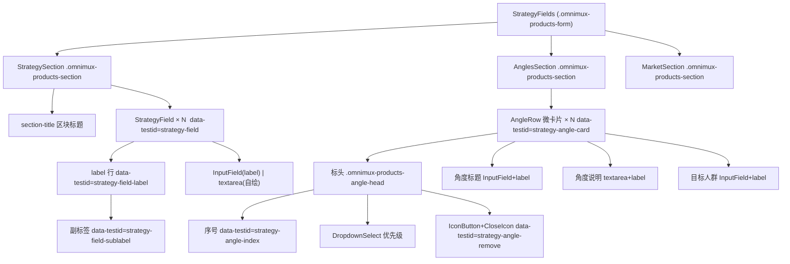

# 规格文档：产品战略定位表单 UI 极简重构（常驻字段标签 · 去伪节点 · 语义对齐 · 角度微卡片）

**文件：** `specs/strategy-form-ui-polish.spec.md` ｜ **优先级：** P0 ｜ **模块：** `plugins/omnimux-products/src/client`
**变更面：** Client / Stage / 表单（按 [plugin-qa](../docs/contracts/plugin-qa.md) 适用矩阵取「Client / Stage / 侧栏」一行）
**设计依据：** [design.md](../design.md)、[ui-design-guidelines.md](../docs/contracts/ui-design-guidelines.md)、[icon-design-standards.md](../docs/contracts/icon-design-standards.md)

---

## 1. 背景与问题定义

产品表单在「数字产品」类型下展开的六大品牌战略模块，是一屏之内信息密度最高的区域。当前实现存在四类互相叠加的可用性缺陷，用户已确认整体重构方案。

### 1.1 现象与根因（逐条附证据）

| # | 现象（用户旅程） | 根因 | 证据位置 |
|---|---|---|---|
| 1 | 用户填完「公司名称」再回头看，**整屏框线内一片空白**，无法分辨哪一格是公司网站、哪一格是产品品类；只能逐个点进去看清内容，或清空重填 | 所有战略字段**只传 `placeholder`、从不传常驻标签**。`placeholder` 一旦被内容占满即消失，字段失去唯一标识 | `ProductStrategyFields.jsx:105-136`、`186-220`、`266-289`、`304-326` 全部走 `placeholder` 分支；`InputField` 的 `label` 能力从未被使用（`dsh-ui-kit/src/field/InputField.tsx:8,47-54`） |
| 2 | 「身份与产品」「使命与愿景」区块中间**孤悬一行小字「每行一条」**，与上下任何输入框都无视觉归属关系，用户误读为某个字段的标签或说明 | 存在独立的 `{ type: 'hint', hintKey: 'strategy.listHint' }` **伪节点**，渲染为脱离字段栈的 `<p>`；同理「语调风格」区块在 `section.hintKey` 上挂了一层同类小字 | 伪节点：`ProductStrategyFields.jsx:63`、`74`；区块级：同文件 `53` + 渲染分支 `141`；渲染实现 `93-95` |
| 3 | 「解决的问题」这个框**永远是空的**，用户填不填都保存不上任何模型产出，白占一屏 | 前端渲染了 `identity_and_product.problems_solved`，归一化器也认得它，但**全部提示词都不产出该键**：指引词明确要求把痛点写进 `solutions` | 前端 `ProductStrategyFields.jsx:66`；归一化器 `brand-strategy.js:28,197,314`；提示词侧交叉验证：`grep -rn problems_solved src/prompts/` → **无任何命中**；`brand-strategy.v2.txt:41` 明确 `solutions` 为「先点明核心用户痛点，再说明产品如何系统性解决」 |
| 4 | 内容切入角度区**像一堵框框墙**：角度之间仅 6px 紧贴堆叠，无卡片容器、无标头、无圆角与底色，多个角度连成一整块，用户分不清「第 2 个角度在哪结束、第 3 个从哪里开始」，删除时不敢点 | `AngleRow` 直接复用区块容器类，外部网格 `gap: 6px` 紧贴；无序号标头；删除按钮无标签语义（`aria-label` 误用 `remove.confirm`），仅由 `IconButton variant="ghost"` 承载一个字符 `×`，无可见边框可依附 | `ProductStrategyFields.jsx:186`（复用 `omnimux-products-section`）、`185-207`（含 `199-206` 的 ghost 删除按钮与 `205` 的 `exempt-ui04` 豁免）；`styles.js:365-370`（`.omnimux-products-angle-row` gap 6px） |

### 1.2 同类缺陷（本次新发现，超出用户已逐条确认的四点，需拍板）

`mission_and_positioning.ownable_space` 下的 `category`（归属品类）与 `is_not`（非定位排除项）与问题 3 **完全同类**：

- 前端有框：`ProductStrategyFields.jsx:77-78`
- 归一化器认：`brand-strategy.js:34,201,320-323`
- **提示词不产出**：`brand-strategy.v2.txt:47-48` 的 `ownable_space` 只声明 `statement` 一个键；`brand-strategy.fallback-cot.txt:153` 同样只有 `statement`

即：这两个框在模型产出路径下同样**永远为空**。用户已确认的原则是「消除永远留空的无效框」，但未点名这两个字段，故列为 **§10 待拍板项 D2**，默认按与问题 3 一致的处置执行。

---

## 2. 目标与非目标

**目标**

1. 每个战略输入框都有**常驻可见的字段标签**，内容填满后字段仍可辨识。
2. 移除全部孤悬的「每行一条」伪节点，改写为字段标签旁的**内联副标签**。
3. 对齐提示词与前端表单的字段语义，消除模型路径下永远为空的无效框。
4. 每个切入角度呈现为**独立微卡片**，有清晰标头与舒适间距，消除框框墙。
5. 全程复用既有组件与设计令牌，不新增视觉语言。

**非目标（本次不做）**

- 不改动 `brand-strategy.v2.txt` / `fallback-cot.txt` 的输出契约（属模型契约变更，需单独回归）。
- 不改动 `brand-strategy.js` 归一化器对这些键的**接收能力**（已存库数据必须继续解析成功，见 §9「绝不」）。
- 不改动字段的数据结构、保存链路、导入链路与脏值判定逻辑。
- 不改动战略表单的分区归属、字段顺序（问题 3 的字段删除除外）。
- 不调整优先级取值域（见 §10 待拍板项 D4）。

---

## 3. 设计契约

### 3.1 常驻字段标签（Field Label）

**契约 L1 — 标签必须在内容填满后仍然可见。** 每个可输入字段在控件上方渲染一行常驻标签，与输入内容的存在与否无关。

**契约 L2 — 单一样式源，12px 浅灰。**

| 场景 | 实现路径 | 样式来源 |
|---|---|---|
| `<input>` 类字段（`type: 'input'`） | **复用** `dsh-ui-kit` 的 `InputField` 原生 `label` prop | kit 自带：`font-size:12px; line-height:16px; font-weight:500; color: var(--dsw-alias-label-secondary)`（`InputField.module.css`） |
| `<textarea>` 类字段（`type: 'list'` / `type: 'textarea'`） | kit **无 textarea 组件**（已核实 `dsh-ui-kit/src/index.ts` 导出清单与 `src/` 目录，无 textarea 家族），沿用插件自有 `.omnimux-products-textarea`，新增插件级标签包装 | 新增 `.omnimux-products-field-label`，**镜像 kit 的四个属性值**，不新造字号/颜色 |

> 说明：本仓库 `design.md` §4.2 字阶白名单含 12px，浅灰取 `--dsw-alias-label-secondary`（与既有 `.omnimux-products-label` 一致），两项均通过 UI10 / UI03 静态门禁。

**契约 L3 — 标签与控件的绑定。** 标签必须是控件可点击聚焦的关联元素：`InputField` 内部已由 `<label htmlFor>` 承载；textarea 分支由插件包装类同时提供 `<label htmlFor>` 与 `id`，禁止用 `<div>` 充当标签。

**契约 L4 — 标签文案。** 标签取字段名主干（纯名词），**不重复出现在 placeholder** 中。带格式提示的字段保留精简 placeholder，其余字段取消 placeholder，避免同一文案在标签与占位符中重复出现两次。

### 3.2 副标签：消除「每行一条」伪节点

**契约 S1 — 删除伪节点。** 从 `STRATEGY_SECTIONS` 中彻底移除：
- 两处字段级 `{ type: 'hint', hintKey: 'strategy.listHint' }`；
- 「语调风格」区块的 `hintKey` 属性；
- `StrategyField` 中 `field.type === 'hint'` 的渲染分支与 `StrategySection` 中的 `hintNode`；
- 字段结构类型中的 `hint` 变体（结构上不再允许出现无 `path` 的字段项，杜绝再次混入伪节点）。

**契约 S2 — 副标签内联到字段标签行。** 需要「每行一条」语义的字段，在标签行内右侧渲染副标签，形如 `产品供给 · 每行一项`：

```
[ 标签 12px label-secondary 500 ]  ·  [ 副标签 12px label-tertiary 400 ]
```

**契约 S3 — 副标签文案与本地化。** `strategy.listHint` 文案由「每行一条」改为「每行一项」（EN：`One item per line` → `One per line`），与用户确认的示例 `产品供给 · 每行一项` 一致。副标签为**纯文本**，分隔符用文本 `·`（不属 UI04 违禁字符集 `× ✕ ↑ ↓ ↗ ↘ ▶ ⏸ ⏹ ✓ ✔`，也不属 `Extended_Pictographic`）。

### 3.3 字段语义对齐（消除空框）

**契约 F1 — 合并痛点与对策。** 删除 `identity_and_product.problems_solved` 的**前端渲染**，`solutions` 字段的标签改为用户确认的完整语义：

> 标签：`核心解决方案（含痛点剖析与解决对策）` ｜ 副标签：`每行一项`

**契约 F2 — 数据层保持兼容。** 归一化器 `brand-strategy.js` 继续接收并保留 `problems_solved`；已存库产品的该字段值**不丢失、不报错、不变形**。本次只改渲染层。

**契约 F3 — 待决字段。** `ownable_space.category` / `ownable_space.is_not` 按 §10 待拍板项 D2 处置（默认：与 F1 一致，移除渲染、保留数据层兼容）。

### 3.4 切入角度微卡片（AngleRow Card）

**契约 C1 — 一角度一卡片。**

| 属性 | 取值 | 说明 |
|---|---|---|
| 圆角 | `8px` | 与 UI 规范「基础圆角 8px」一致；卡片属紧凑容器，不上探 10~12px |
| 边框 | `1px solid var(--dsw-alias-border-l2)` | 复用既有语义令牌 |
| 底色 | `var(--dsw-alias-bg-layer-1)` | 「轻微深层底色」，与表单底 `--dsw-alias-bg-base` 形成可测的层次差 |
| 内边距 | `12px` | 与区块内边距同源 |
| 卡片间距 | `10px` | 用户给定区间 10~12px，**取区间下限**：与外层 `.omnimux-products-form` 的 12px 区块间距拉开层级差，避免卡片间距等于区块间距而丢失分组感 |
| 卡片内层次间距 | `10px`（层间）、`6px`（标签与控件之间） | 层次分明 |

**契约 C2 — 卡片标头。** 标头单行，从左到右依次为：

| 位次 | 元素 | 契约 |
|---|---|---|
| 1 | 序号 | 文案 `角度 01`，序号按 `index + 1` **两位补零**；样式 12px / `--dsw-alias-label-secondary` / `font-weight:500` |
| 2 | 优先级 | **可编辑**，复用 kit `DropdownSelect`（原生 `<select>` 被 UI01 禁止），取值 1–5；目标宽度 88px（原网格列为 96px，标头改单行 flex 后收窄）；**若 kit 触发器的最小固有宽度大于 88px，则以 kit 最小宽度为准，不得为其覆写内边距或圆角** |
| 3 | 删除按钮 | **微型**，复用 kit `IconButton size="xs" variant="ghost"`，右对齐（`margin-left:auto`）；图标改用插件自有 `CloseIcon`（`src/client/icons.jsx:46-53`）矢量 SVG，**同时清退该处 `exempt-ui04` 历史字符豁免**；`aria-label` 改为语义化的 `strategy.removeAngle`（「删除该角度」），不再误用 `remove.confirm` |

**契约 C3 — 卡片内部三层输入区。** 顺序固定为：角度标题（`InputField`）→ 角度说明（`textarea` rows=2）→ 目标人群（`InputField`）；三层各带常驻标签 `角度标题` / `角度说明` / `目标人群`。

**契约 C4 — 行为不变。** 新增/删除/编辑角度的数据写入路径、10 个上限、写回字段（`content_angles[i].title/description/target_audience/priority`）与 `patchStrategy` 变形机制完全不变。

### 3.5 组件结构与测试选择器契约



为满足 Quality Loop「稳定定位器」要求，新增以下属性（kebab-case，沿用仓库既有 `data-testid` 约定，如 `wf-slot-wells` / `wf-input-hint`）：

| 属性 | 落点 | 值 |
|---|---|---|
| `data-testid="strategy-field"` | 每个字段容器 | — |
| `data-field-path` | 同上 | 字段路径，如 `identity_and_product.solutions` |
| `data-testid="strategy-field-label"` | 字段标签 | — |
| `data-testid="strategy-field-sublabel"` | 副标签 | 无副标签时不渲染该节点 |
| `data-testid="strategy-angle-card"` | 每个角度微卡片 | — |
| `data-angle-index` | 同上 | `0` 起 |
| `data-testid="strategy-angle-index"` | 序号 | 文本 `角度 01` |
| `data-testid="strategy-angle-remove"` | 删除按钮 | — |

---

## 4. 字段契约表（实现真相源）

标签文案取自现有 locale 键，**仅对三处做咬合精修**（剥离已移入副标签的后缀），其余复用原文案。

| # | path | 常驻标签（zh） | 副标签 | 控件 | placeholder（精简后） |
|---|---|---|---|---|---|
| 1 | `brand_basic_info.company.name` | 公司名称 | — | InputField | 空 |
| 2 | `brand_basic_info.company.website` | 公司网站 | — | InputField | `https://` |
| 3 | `brand_basic_info.company.locale` | 目标语言 | — | InputField | `留空为自动` |
| 4 | `brand_basic_info.product.name` | 战略产品名 | — | InputField | 空 |
| 5 | `brand_basic_info.product.category` | 产品品类 | — | InputField（span 2） | 空 |
| 6 | `tone_and_voice.dos` | 核心沟通要点 | 每行一项 | textarea list | 空 |
| 7 | `tone_and_voice.donts` | 品牌禁忌红线 | 每行一项 | textarea list | 空 |
| 8 | `identity_and_product.core_identity` | 核心定位 | — | textarea | 空 |
| 9 | `identity_and_product.product_offering` | 产品供给 | 每行一项 | textarea list | 空 |
| 10 | `identity_and_product.unique_advantage` | 差异化优势 | 每行一项 | textarea list | 空 |
| 11 | `identity_and_product.solutions` | 核心解决方案（含痛点剖析与解决对策） | 每行一项 | textarea list | 空 |
| — | ~~`identity_and_product.problems_solved`~~ | **移除渲染**（数据层保留） | — | — | — |
| 12 | `mission_and_positioning.mission` | 使命陈述 | — | textarea | 空 |
| 13 | `mission_and_positioning.differentiation` | 核心差异化 | 每行一项 | textarea list | 空 |
| 14 | `mission_and_positioning.ownable_space.statement` | 品牌核心心智定位 | — | InputField | 空 |
| 15 | `mission_and_positioning.ownable_space.category` | 归属品类 | — | InputField | 空（**待 D2**） |
| 16 | `mission_and_positioning.ownable_space.is_not` | 非定位排除项 | 每行一项 | textarea list | 空（**待 D2**） |

**文案精修清单（zh / en 同步）：**

| 键 | 现值 | 改为 |
|---|---|---|
| `strategy.listHint` | 每行一条 / One item per line | 每行一项 / One per line |
| `strategy.companyLocale` | 语言（留空为自动） | 目标语言 |
| `strategy.productName` | 战略产品名 (独立字段) | 战略产品名 |
| `strategy.ownableNot` | 非定位排除项 (每行一条) | 非定位排除项 |
| `strategy.solutions` | 解决方案 | 核心解决方案（含痛点剖析与解决对策） |
| `strategy.angleTitle` / `angleDesc` / `angleAudience` | 角度标题 / 角度说明 / 目标人群 | 复用（作为标签） |
| **新增** `strategy.angleIndex` | — | 角度 / Angle |
| **新增** `strategy.removeAngle` | — | 删除该角度 / Remove angle |
| **待清理** `strategy.problems` | 解决的问题 | 随 §1.1#3 处置一并移除（zh/en） |

---

## 5. 用户交互关键旅程

1. 用户打开数字产品编辑弹窗，战略模块默认展开 → 每个输入框**上方**都有 12px 浅灰标签；用户填满全部字段后，标签仍在原处，字段身份一目了然。
2. 用户看到「产品供给 **· 每行一项**」——副标签紧贴字段名右侧，一眼可知是多行列表输入；区块中不再出现任何悬空的小字。
3. 用户在「核心解决方案（含痛点剖析与解决对策）」中，按提示**先写痛点再写对策**，一行一条；原先那个永远空着的「解决的问题」框已不存在。
4. 用户浏览内容切入角度 → 每个角度是一张 8px 圆角、轻微深底、彼此间隔 10px 的独立微卡片；卡片顶部依次是 `角度 01`、可编辑的优先级、右侧微型删除按钮。
5. 用户点击某张卡片的删除按钮 → 该角度卡片即时移除，其余卡片序号自动重排（`角度 02` → `角度 01`），数据写回 `content_angles`。
6. 用户点击「添加角度」→ 新卡片以同一视觉规范追加到列表末尾，卡片间距保持一致。

---

## 6. 验收标准（可测试）

### 6.1 静态/结构断言（源码契约层）

| # | 断言 | 判定方式 |
|---|---|---|
| A1 | `ProductStrategyFields.jsx` 中**不再出现** `type: 'hint'` 与 `hintKey` | 源码断言 |
| A2 | 每个字段定义**必须**带标签来源（`labelKey` 或既有 `placeholderKey` 复用），不存在既无标签又无控件类型的字段项 | 源码断言 + 结构校验 |
| A3 | `angles` 区块渲染 `.omnimux-products-angle-list`，其 `gap` 为 10px | `styles.js` 断言 |
| A4 | 微卡片声明 `border-radius: 8px` 与 `background: var(--dsw-alias-bg-layer-1)` | `styles.js` 断言 |
| A5 | 角度删除按钮的图标来源为 `CloseIcon`，且该行不再带 `exempt-ui04` | 源码断言 |
| A6 | `locales.js` 中 `zh` 与 `en` 的键集合完全一致（新增/改写的键两侧同步） | 源码断言 |
| A7 | `.omnimux-products-field-label` 的四个属性值为 `12px / 16px / 500 / var(--dsw-alias-label-secondary)`，与 kit 一致 | `styles.js` 断言 |

### 6.2 真实浏览器断言（隔离 worktree，见 §7 Verify）

| # | 断言 | 判定方式 |
|---|---|---|
| B1 | 表单内每个 `[data-testid="strategy-field"]` 都含一个**非空** `[data-testid="strategy-field-label"]` | DOM 查询 + 文本非空校验 |
| B2 | `[data-field-path="identity_and_product.solutions"]` 的标签文本含「核心解决方案」，其副标签文本为「每行一项」 | DOM 查询 |
| B3 | **负断言**：全表单不存在 `[data-field-path="identity_and_product.problems_solved"]` | DOM 查询计数 = 0 |
| B4 | 在字段内填入长文本后，标签节点**仍存在**且 `getBoundingClientRect().height > 0`、`width > 0`（正几何） | 交互后重新查询 |
| B5 | 每个 `[data-testid="strategy-angle-card"]` 的 `border-radius` 为 `8px`，底色与表单底色的计算值不同 | `getComputedStyle` |
| B6 | 相邻两张角度卡片的垂直间距 ∈ `[10px, 12px]` | `getBoundingClientRect` 差值 |
| B7 | 卡片数量 = `content_angles.length`；`[data-testid="strategy-angle-index"]` 依序为 `角度 01`、`角度 02`… | DOM 查询 |
| B8 | 点击 `[data-testid="strategy-angle-remove"]` 后卡片数 -1，且序号重排连续 | 点击 + 复查 |
| B9 | 任一卡片内的三个输入区各自带标签，`height > 0` | DOM 查询 |

### 6.3 回归断言

| # | 断言 |
|---|---|
| C1 | 数字产品导入后，`solutions` 有值渲染、「核心解决方案」标签可见 |
| C2 | 含 `problems_solved` 的历史产品数据加载**不报错**，其余字段正常渲染 |
| C3 | 编辑任意字段后脏值标记与保存链路行为不变 |
| C4 | 角度新增/删除/编辑后保存，重新打开数据一致 |
| C5 | `pnpm --filter omnimux-products test` 现有用例全绿（含 `url-import-bar.test.js` 中 `problems_solved` / `ownable_space` 的归一化断言**不得修改**） |

---

## 7. 五阶段 Quality Loop 验收门禁

| 阶段 | 进入条件 | 本任务动作 | 退出证据（Green 判据） |
|---|---|---|---|
| **1. Spec** | 用户已确认重构方案 | 落盘本文件，含 §6 可测试验收标准与 §5 关键旅程 | `specs/strategy-form-ui-polish.spec.md` 存在于本任务未提交改动中（满足 `scripts/guard-quality-loop.mjs` 的 spec 归属判定：`specs/**/*.md` 且属当前任务变更） |
| **2. Code** | Spec 已落盘 | 按 §4 字段契约表与 §3 设计契约实施最小改动；样式一律进 `styles.js`，禁用内联 `style={{}}`（UI02） | 改动仅落在 §8 文件清单内；`node scripts/scan-ui-gates.mjs` exit 0 |
| **3. Verify** | Code 完成，**未写任何自动化用例** | 在**本任务隔离 worktree** 内启动本地服务（动态端口、自清理），用 ego-browser 或 `pnpm test:worktree-web` 打开产品表单：先实测 DOM，确认选择器后再取证据；执行 §6.2 全部断言，验证挂载、正几何、点击交互 | 保留截图 PNG + 结构化报告；**报告须绑定实际服务进程、端口、URL 与源码 SHA** |
| **4. Test** | Verify 取得真实 DOM 证据 | 以**已观测**结构固化自动化：§6.1 静态契约沿用 `src/client/*.test.js` 的 `node --test` + 源码断言风格（本插件无 React DOM 渲染器，已核实测试栈为 `node --test`）；§6.3 回归落入 `tests/e2e/*.spec.js` | 新增用例可在不启动浏览器时全绿；选择器与 §6.2 实测一致，无猜测选择器 |
| **5. Green** | Test 完成 | 跑全量相关检查；清理临时进程与端口 | 下列命令全部 exit 0，且无残留进程/端口 |

**§6.2 的 B 组断言属浏览器证据（Verify 阶段成果），不要求在本插件内建 React 渲染器来复现**——为一次性 UI 重构引入 DOM 测试框架属过度建设，违反架构简化原则。

### 验证命令

```bash
# 插件单测（含新增静态契约用例与既有回归）
pnpm --config.verify-deps-before-run=false --filter omnimux-products test

# UI 设计静态门禁（UI01~UI10 FATAL）
node scripts/scan-ui-gates.mjs

# Stage 契约
pnpm verify:stages

# 隔离 worktree 真实浏览器 Web 验证（Agent 侧验收基线）
pnpm test:worktree-web
```

---

## 8. 实施落点（文件清单）

| 文件 | 改动性质 |
|---|---|
| `plugins/omnimux-products/src/client/ProductStrategyFields.jsx` | 主改造：字段契约表、标签/副标签渲染、伪节点移除、`AngleRow` 微卡片与标头、`data-testid` 契约 |
| `plugins/omnimux-products/src/client/styles.js` | 新增字段标签、副标签、角度卡片列表/标头/序号样式（全部使用语义令牌，无硬编码颜色） |
| `plugins/omnimux-products/src/client/locales.js` | §4 文案精修清单（zh/en 同步） |
| `plugins/omnimux-products/src/client/icons.jsx` | 复用 `CloseIcon`；仅在需要新图标时增补（预期无需改动） |
| `plugins/omnimux-products/src/client/strategy-form-fields.test.js` | **新增**：§6.1 静态契约断言 |
| `plugins/omnimux-products/tests/e2e/strategy-form-fields.spec.js` | **新增**：§6.3 回归断言（数据层兼容性） |
| `plugins/omnimux-products/src/brand-strategy.js` | **预期不改**（F2 要求保持接收能力）；仅当 D2 采纳并需清理时按最小改动处理 |

---

## 9. 边界

- **总是**：新增/修改字段必须同时给出常驻标签与 `data-testid` 契约；样式进 `styles.js` 且只用 `var(--dsw-alias-*)`；`zh` 与 `en` 文案同步。
- **总是**：保留 `brand-strategy.js` 对 `problems_solved` / `ownable_space.category` / `ownable_space.is_not` 的解析能力，保证已存库产品不丢数据、不报错。
- **总是**：保留角度 10 个上限与既有写入路径。
- **先问**：§10 的 D2（待决字段处置）、D3（优先级取值域）、D4（placeholder 策略回退）。
- **绝不**：为了让断言变绿而修改 `url-import-bar.test.js` 中既有的归一化断言；绝不为本次 UI 重构引入 React DOM 测试框架；绝不改动提示词文件输出契约；绝不使用原生 `<select>`、Emoji/字符图标或内联样式。

---

## 10. 待拍板项与残留风险

| 编号 | 事项 | 默认处置（未拍板即按此执行） | 影响面 |
|---|---|---|---|
| **D1** | 历史产品已存的 `problems_solved` 值不再可见，是否需迁移进 `solutions` | **不迁移**：数据原样保留在库中（不可见但可往返），避免自动化改写用户既有战略数据 | 无代码影响 |
| **D2** | `ownable_space.category` / `is_not` 与问题 3 同类 | **同 F1 处置**：移除前端渲染、保留数据层兼容。备选方向：改提示词补齐这两个键的输出（属模型契约变更，需独立回归，不并入本次） | 2 个字段的可见性 |
| **D3** | 角度优先级：提示词声明 `1-3`（`brand-strategy.v2.txt:26`），UI 提供 `1-5` | **维持 1–5 不动**（属既有行为差异，非本次范围），仅记录 | 无 |
| **D4** | 取消 placeholder 后空框内无引导文字 | 按 §4 表执行（仅两处保留格式提示）。若人工复核认为需要输入示例，需为字段新增示例文案键，属范围外追加 | 文案工作量 |
| **D5** | 「优先级胶囊」的胶囊外观取决于 kit `DropdownSelect` 触发器自身圆角 | 先按 §3.4 C2 以紧凑形态呈现；若 §7 Verify 实测外观非胶囊，回退方案 B：标头放只读 `Badge` 胶囊，`DropdownSelect` 下移进卡片内部 | 标头布局 |

**残留风险**

1. `data-testid` 契约新增了 8 个属性，属对外可观测的 DOM 契约；后续若调整结构需同步 §6.2 与测试。
2. 本插件测试栈为 `node --test` 源码断言，**无语义化行为测试能力**；§6.2 的浏览器断言依赖每次 Verify 阶段的可复现执行，回归保护弱于常规 DOM 测试。此为既有工程约束，不在本次范围内改造。
3. 「轻量改动」承诺基于字段数量不变；若 D2 采纳方向 B（改提示词），工作量与回归面显著上升。
