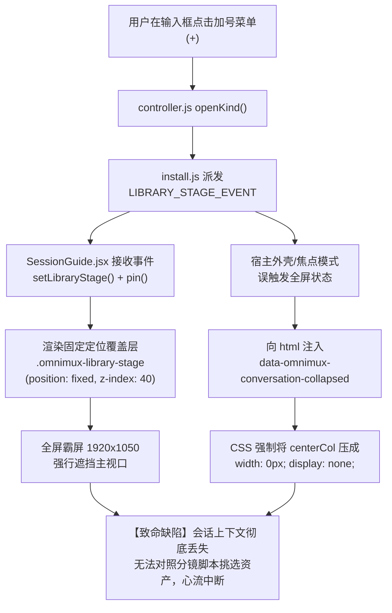
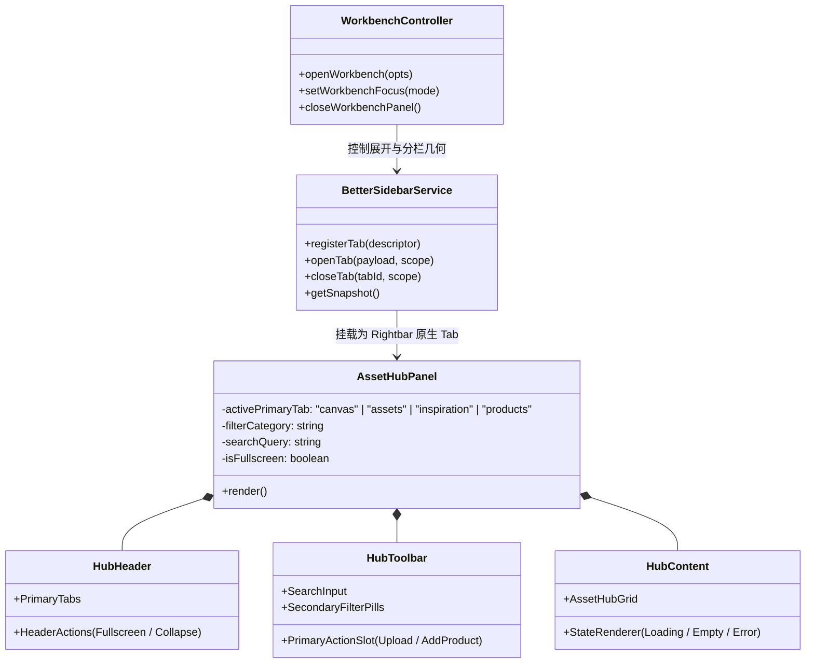
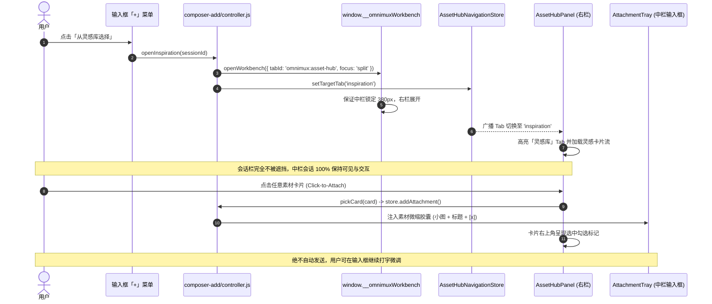

# 系统架构设计：三栏状态右侧素材工作台（Asset Hub）架构方案与实施清单

- **文档状态**：架构方案完成（Architect Approved）
- **架构师**：高见远（Gao）
- **依据规格**：`specs/three-column-asset-hub.spec.md`（产品经理 许清楚 签发锁定）
- **实施角色**：前端开发工程师（裴像素 · `expert_software_frontend_developer`）、系统与后端工程师（寇豆码 · `expert_software_engineer`）
- **关联缺陷**：Issue #2649（解决点击「+」加号菜单弹出全屏遮罩 / 会话折叠导致上下文丢失问题）
- **目标产出**：`specs/three-column-asset-hub-architecture.md`

---

## 1. 现状架构痛点与根因深度剖析（Root Cause Analysis）

在现有 OmniMux 桌面端与 Web 端的三栏交互流程中，用户在会话输入框底部点击「+」菜单并选择「从资产库/商品库/灵感库选择」时，系统会发生严重的“会话丢失与全屏阻断”缺陷。经全链路调用栈排查与 CDP 实测，其架构根因如下：



### 1.1 全屏霸屏遮罩（`.omnimux-library-stage`）的生命周期缺陷
1. **事件派发与接收链**：
   - 用户在输入框菜单点击时，`plugins/omnimux/src/client/composer-add/controller.js` 启动了一个选择器 operation，调用 `renderLibrary(model)`；
   - `plugins/omnimux/src/client/composer-add/install.js` 派发了全局 `LIBRARY_STAGE_EVENT`；
   - `plugins/omnimux/src/client/session-guide/SessionGuide.jsx` 监听了该事件，执行 `setLibraryStage(model)` 并调用 `pin({ id: LIBRARY_STAGE_DOCK_ID })`；
   - `SessionGuide.jsx` 进而渲染了 `<LibraryBrowser />`，其根容器带有类名 `.omnimux-library-stage`。
2. **样式布局损毁**：
   - 在 `plugins/omnimux/src/client/session-guide/styles.js` 中，`.omnimux-library-stage` 和 `#omnimux-composer-add-host:has([data-omnimux-library-stage])` 被声明为：
     ```css
     position: fixed;
     top: 0;
     left: var(--omnimux-library-stage-left, 0px);
     width: var(--omnimux-library-stage-width, 100%);
     height: 100%;
     z-index: 40;
     ```
   - 即使计算了 `--omnimux-library-stage-left`，在多栏与分栏模式下，由于 `pin` 强制修改宿主容器布局，直接在整个窗口上方糊死了一层 1920×1050 的固定视口覆盖层，破坏了所有工作区内容。

### 1.2 会话栏折叠隐藏（`conversation-collapse.js`）的误触与死锁
1. **折叠驱动成因**：
   - 在旧架构中，素材库被误定义为“独占型全屏舞台”（类似独立大图预览）。当触发时，外壳设置了 `data-rightbar-fullscreen="true"` 或触发了工作台独占焦点 `WORKBENCH_FOCUS.gui`；
   - `plugins/omnimux/src/client/workbench/fullscreen-collapse-sync.js` 检测到全屏属性后，向 `<html>` 注入 `data-omnimux-conversation-collapsed`；
   - `plugins/omnimux/src/client/conversation-collapse.js` 中的 `CONVERSATION_COLLAPSE_CSS` 极其暴力地向 `.dshDesktopConversationSurface` 和 `[class*="centerCol"]` 应用了以下样式：
     ```css
     flex: 0 0 0 !important;
     width: 0 !important;
     min-width: 0 !important;
     max-width: 0 !important;
     overflow: hidden !important;
     opacity: 0 !important;
     pointer-events: none !important;
     ```
2. **后果**：
   - 中间会话控制台物理宽度被直接清零，所有聊天记录、已生成分镜提示词、输入框附件区全部脱离视口（`width: 0px; display: none;`）。用户完全无法一边看分镜一边挑素材。

### 1.3 核心解耦原则：从“模态选择器”跃迁至“右栏常驻辅助工作台”
参考现代化多模态创作工具（CreatOK、Linear）的最佳实践：
- **中栏为主、右栏为辅**：会话栏是多模态 Prompt 调优与上下文交互的中心神经，无论右侧在做什么，中栏必须永驻（保持锁定 $\ge 380\text{px}$）；
- **内嵌右栏、消除模态**：挑选素材不是弹窗任务，而是第三栏工作台的常驻能力。点击加号菜单，只是把右侧工作台平滑唤起并定位到对应 Tab，会话绝对不断流。

---

## 2. 目标系统整体架构方案（System Architecture & Topology）

### 2.1 三栏协同拓扑与视口响应式网格模型

OmniMux 界面在标准视口（$\ge 1280\text{px}$）下划分为清晰的三栏架构：

```text
+-------------------------------------------------------------------------------------------------------------------------+
| OmniMux Desktop / Web (Host Window)                                                                                     |
+----------------------+----------------------------------------+---------------------------------------------------------+
| 1. 左栏：导航与会话   | 2. 中栏：会话控制台 (锁定 380px)        | 3. 右栏：素材与创作工作台 (弹性铺满剩余宽)                    |
| (.dshDesktopSidebar) | (.dshDesktopConversationSurface)       | (.dshDesktopRightbarSurface / AssetHubPanel)            |
| (Width: 260px)       | [Context & History & Composer]         | (Width: Calc(100vw - 260px - 380px))                    |
+----------------------+----------------------------------------+---------------------------------------------------------+
| - 新建会话            | 会话标题: 广告分镜脚本生成               | [顶栏 48px]  [画布] [资产库] [灵感库] [商品库]   [全屏] [收起] |
| - 历史列表            | -------------------------------------- | ------------------------------------------------------- |
| - 工作区切换          | AI 消息:                               | [筛选栏 40px] [搜索素材...   ] [全部] [本地上传]... [上传] |
|                      | 已为您生成 4 组分镜提示词：             | ------------------------------------------------------- |
|                      | 1. 镜头一：晨光中的咖啡特写...           | [卡片流 HubContent]                                     |
|                      | 2. 镜头二：冲泡萃取慢动作...             | +---------------+ +---------------+ +---------------+    |
|                      |                                        | | 素材卡片 1    | | 素材卡片 2    | | 素材卡片 3    |    |
|                      | [输入框]                               | | 晨光咖啡.mp4  | | 慢动作.mp4    | | 咖啡豆.png    |    |
|                      | +------------------------------------+ | +---------------+ +---------------+ +---------------+    |
|                      | | 附件槽: [晨光咖啡.mp4 x]           | | 响应式 3~4 列高密度网格                                |
|                      | | 帮我参考这个素材做二次渲染...      | | 点击卡片立即注入中间会话输入框附件槽                    |
|                      | | [+] [技能]                    [发送] | |                                                       |
|                      | +------------------------------------+ |                                                         |
+----------------------+----------------------------------------+---------------------------------------------------------+
```

#### 几何布局数学契约
设视口宽度为 $W_{\text{viewport}}$，左侧侧边栏宽度为 $W_{\text{rail}}$（展开态 260px，收起态 0px），中间会话栏宽度为 $W_{\text{chat}}$，右侧工作台宽度为 $W_{\text{panel}}$：
1. **三栏激活态**（右侧边栏素材工作台开启）：
   - $W_{\text{chat}} = 380\text{px}$（硬性保宽，严禁压缩）；
   - $W_{\text{stage}} = W_{\text{viewport}} - W_{\text{rail}}$；
   - $W_{\text{panel}} = \max(280\text{px}, W_{\text{stage}} - 380\text{px})$。
2. **右栏收起态**（用户点击收起或折叠）：
   - $W_{\text{panel}} = 0\text{px}$；
   - $W_{\text{chat}} = W_{\text{stage}}$（会话栏平滑填满视口）。
3. **右栏全屏检视态**（用户明确点击右上角全屏）：
   - $W_{\text{panel}} = W_{\text{viewport}}$ 或 $W_{\text{stage}}$（覆盖中栏提供沉浸式高密度挑片视口）；
   - 此时触发全屏，允许中栏暂时被遮挡；
   - 退出全屏（按 `Esc` 或点 `退出全屏`）后立即精准恢复状态 1（$W_{\text{chat}} = 380\text{px}$）。

### 2.2 工作台集成架构：`AssetHubPanel` 挂载与 betterSidebar 契约

废弃分散的各 Stage 模态，在右侧边栏（Rightbar）注册统一的右栏素材工作台主容器 `AssetHubPanel.jsx`。



1. **统一工作台 Tab ID**：
   - 声明 `ASSET_HUB_TAB_ID = 'omnimux:asset-hub'`；
   - 在 `plugins/omnimux/src/client/index.js` 中向 `betterSidebar` 注册该 Tab。
2. **一级 Tab 内部路由解耦**：
   - `AssetHubPanel` 内部持有受控状态机，支持在 `画布` (`canvas`)、`资产库` (`assets`)、`灵感库` (`inspiration`)、`商品库` (`products`) 之间毫秒级平滑切换，避免频繁卸载与挂载右栏 iframe 或外壳。
   - 当切换到 `canvas` 时，渲染节点创作画布视图；
   - 当切换到 `assets` / `inspiration` / `products` 时，统一由 `HubToolbar` 和 `HubContent`（`AssetHubGrid`）承载高密度卡片网格。

### 2.3 输入框加号菜单（Composer Add）与右栏路由通信架构

加号菜单不再派发阻断式的 `LIBRARY_STAGE_EVENT`，改为直接与 `workbench` 协同，调用标准的 Tab 激活通道。



### 2.4 即选即注入（Click-to-Attach）Store 通道架构

素材点选完全依赖单例 `AttachmentStore`（`plugins/omnimux/src/client/attachments/store.ts`），建立响应式数据通道：

1. **无弹窗无确认**：点击卡片时，触发卡片微按压动画（`scale(0.98)`）并直接构造标准 payload 存入 `AttachmentStore`。
2. **数据标准化转换契约**：
   - **资产库（Assets）**：
     ```json
     {
       "sourcePlugin": "omnimux",
       "kind": "asset",
       "entityId": "ast_12345",
       "title": "晨光咖啡_01.mp4",
       "extension": "MP4",
       "relativePath": "assets/ast_12345.mp4",
       "previewUrl": "http://127.0.0.1:43120/assets/ast_12345_thumb.webp",
       "metadata": { "duration": 15, "dimensions": "1080x1920" }
     }
     ```
   - **灵感库（Inspiration）**：
     ```json
     {
       "sourcePlugin": "omnimux-inspiration",
       "kind": "video",
       "entityId": "insp_67890",
       "title": "慢动作萃取.mp4",
       "previewUrl": "http://127.0.0.1:43120/insp/thumb.webp",
       "metadata": { "inspiration": { "id": "insp_67890", "category": "food" } }
     }
     ```
   - **商品库（Products）**：
     ```json
     {
       "sourcePlugin": "omnimux-products",
       "kind": "product",
       "entityId": "prod_11223",
       "title": "精品冷萃咖啡豆",
       "extension": "JSON",
       "relativePath": "products/prod_11223.json",
       "previewUrl": "http://127.0.0.1:43120/products/bean.webp",
       "metadata": { "product": { "id": "prod_11223", "name": "精品冷萃咖啡豆", "sku": "CF-001" } }
     }
     ```
3. **已选状态响应式联动**：
   - 卡片组件订阅当前会话的 `AttachmentStore` 附件列表；
   - 通过实体指纹 `fingerprint` 进行 O(1) 匹配；命中时在卡片右上角显示蓝色高亮勾选圈；若用户在中栏输入框附件胶囊点击 `[×]` 删除该附件，卡片勾选圈自动响应式取消。

### 2.5 全屏检视与收起专注模式架构

1. **右上角操作组（HeaderActions）**：
   - `FullscreenButton`：
     - 未全屏态：点击调用 `enterHostRightSidebarFullscreen(document)`，右栏以平滑过渡动画展开，中栏暂时折叠供用户进行大图比对；图标提示切换为 `退出全屏`；
     - 全屏态：点击或按键盘 `Esc` 键，调用 `exitHostRightSidebarFullscreen(document)`，宿主退出全屏，中栏自动恢复 380px，无任何布局跳动或白屏；
   - `CollapseButton`：
     - 点击调用 `workbench.closeWorkbenchPanel()`；
     - 右栏向右侧边缘平滑滑出折叠，中栏平滑填满视口。

---

## 3. 数据结构、状态模型与接口契约（Data Contracts & Interfaces）

遵循奥卡姆剃刀准则，**严禁预留任何修饰性或诱导过度设计的字段**（如禁止 `badge`、`tagline`、`diamondIcon`、`fireIcon` 等）。

### 3.1 导航与路由状态模型（`AssetHubNavModel`）

```typescript
export type PrimaryTabId = 'canvas' | 'assets' | 'inspiration' | 'products';

export interface AssetHubNavState {
  /** 当前选中的一级 Tab */
  activeTab: PrimaryTabId;
  /** 当前各 Tab 下选中的二级筛选标签，默认为 '全部' */
  secondaryFilters: Record<PrimaryTabId, string>;
  /** 搜索关键词，按 Tab 独立缓存或全局单例 */
  searchQuery: string;
  /** 是否处于全屏沉浸态 */
  isFullscreen: boolean;
}

export interface AssetHubNavStore {
  getSnapshot(): AssetHubNavState;
  subscribe(listener: () => void): () => void;
  setActiveTab(tab: PrimaryTabId): void;
  setSecondaryFilter(tab: PrimaryTabId, filter: string): void;
  setSearchQuery(query: string): void;
  setIsFullscreen(fullscreen: boolean): void;
}
```

### 3.2 素材实体卡片统一模型（`AssetItem`）

```typescript
export type AssetMediaType = 'video' | 'image' | 'audio' | 'document';

export interface AssetItem {
  /** 实体唯一 ID */
  id: string;
  /** 所属频道/分类 */
  lane: 'assets' | 'inspiration' | 'products';
  /** 素材标题/文件名（客观展示，截断显示） */
  title: string;
  /** 封面缩略图地址 */
  thumbnailUrl: string;
  /** 悬停静音预览视频地址（可选） */
  previewVideoUrl?: string;
  /** 媒体物理类型 */
  mediaType: AssetMediaType;
  /** 客观时长标记，如 '00:15' */
  durationText?: string;
  /** 客观格式标记，如 'PNG' | 'MP4' */
  formatText: string;
  /** 客观物理分辨率或文件大小，如 '1080×1920' 或 '24.5 MB' */
  dimensionsOrSize?: string;
  /** 底层原始数据引用 */
  raw: any;
}
```

### 3.3 二级筛选标签字典契约（严格白名单）

```typescript
export const SECONDARY_FILTER_WHITELIST: Record<PrimaryTabId, readonly string[]> = Object.freeze({
  canvas: [], // 画布无二级标签
  assets: ['全部', '本地上传', '生成资产', '数字人', '商品图'],
  inspiration: ['全部', '爆款视频', '分镜脚本', '创意提示词', '视觉风格'],
  products: ['全部', '商品主图', '模特展示', '卖点细节', '场景切片'],
});
```

### 3.4 状态机文案字典（严格字面值锁定）

```typescript
export const ASSET_HUB_I18N_SPEC = Object.freeze({
  primaryTabs: {
    canvas: '画布',
    assets: '资产库',
    inspiration: '灵感库',
    products: '商品库',
  },
  actions: {
    fullscreen: '全屏',
    exitFullscreen: '退出全屏',
    collapse: '收起',
    upload: '上传',
    addProduct: '添加商品',
    clearSearch: '清除搜索',
    retry: '重试',
  },
  searchPlaceholder: '搜索素材',
  empty: {
    assets: '暂无资产',
    inspiration: '暂无灵感',
    products: '暂无商品',
    search: '无匹配结果',
    error: '加载失败',
  },
});
```

---

## 4. 文件目录规划与模块重构图谱（File Structure & Modifications）

```text
plugins/omnimux/src/client/
├── workbench/
│   ├── AssetHubPanel.jsx                  # [新增] 右栏素材工作台主容器（Tab栏+工具栏+内容区）
│   ├── AssetHubHeader.jsx                 # [新增] 顶栏（一级Tab白名单 + 全屏/收起操作组）
│   ├── AssetHubToolbar.jsx                # [新增] 筛选栏（32px搜索框 + 二级筛选胶囊 + 上传按钮）
│   ├── AssetHubGrid.jsx                   # [新增] 响应式 3~4 列卡片流与空态/加载态状态机
│   ├── AssetHubCard.jsx                   # [新增] 极简素材卡片（微按压 + 悬停静音播放 + 勾选框）
│   ├── asset-hub-store.js                 # [新增] 导航与筛选状态管理器（轻量响应式Store）
│   ├── geometry.js                        # [修改] 固化三栏几何契约：中栏锁定 380px，右栏自适应吸收
│   ├── split-layout.js                    # [修改] 确保加号菜单唤起工作台时强制 split 模式
│   └── styles/
│       └── asset-hub.css                  # [新增] 工作台专属样式（100% 官方 Token，32px 控件，8px 圆角）
├── composer-add/
│   ├── controller.js                      # [修改] 加号菜单点击直接路由至 AssetHubStore，废除模态弹出
│   ├── install.js                         # [修改] 移除 LIBRARY_STAGE_EVENT 派发与全屏 fallback 容器
│   └── library-stage-model.js             # [修改/整理] 提取数据加载适配器供 AssetHubGrid 复用
├── session-guide/
│   ├── SessionGuide.jsx                   # [修改] 彻底剔除 LIBRARY_STAGE_EVENT 监听、pin 及全屏组件
│   ├── LibraryBrowser.jsx                 # [废弃/重构] 逻辑迁移至 AssetHubGrid，删除 fixed 全屏DOM
│   └── styles.js                          # [修改] 彻底删除 .omnimux-library-stage 的 position: fixed 规则
└── index.js                               # [修改] 在 betterSidebar 注册 ASSET_HUB_TAB_ID，挂载 AssetHubPanel
```

---

## 5. 前后端有序实施任务拆解（Task Decomposition & Execution Plan）

为确保前端工程师（裴像素）与后端工程师（寇豆码）无歧义、高效落地，将全部重构任务拆解为 8 个串并联任务。

### 5.1 任务拓扑图（Dependency Graph）

```text
[T01 几何与保宽契约改造] ───────────────┐
                                          ▼
[T02 状态管理器与通信总线] ───────► [T04 加号菜单路由与注入改造]
                                          │
[T03 AssetHubPanel UI组件集群] ──────────┼──► [T06 废除旧遮罩与样式清理] ──► [T07 E2E质量验收与CDP核验]
                                          │
[T05 卡片数据加载与接口适配] ────────────┘
```

### 5.2 任务清单明细表

| 任务编号 | 任务名称 | 负责角色 | 前置依赖 | 涉及核心文件路径 | 核心验收标准 |
|---|---|---|---|---|---|
| **T01** | 三栏几何契约升级与中栏保宽锁定 | 前端·裴像素 | 无 | `workbench/geometry.js`<br>`workbench/split-layout.js` | 当 `omnimux:asset-hub` 打开时，中栏宽度锁定为 380px，`conversation-collapse` 绝对不被触发；右栏自适应吸收剩余可用宽。 |
| **T02** | AssetHub 导航状态机与路由总线实现 | 前端·裴像素 | 无 | `workbench/asset-hub-store.js` | 实现受控的一级 Tab 与二级 Filter 状态管理，提供 `setActiveTab`、`setFilter`，支持会话级状态持久化。 |
| **T03** | 右栏素材工作台组件集群开发 | 前端·裴像素 | T02 | `workbench/AssetHubPanel.jsx`<br>`workbench/AssetHubHeader.jsx`<br>`workbench/AssetHubToolbar.jsx`<br>`workbench/AssetHubGrid.jsx`<br>`workbench/AssetHubCard.jsx`<br>`workbench/styles/asset-hub.css` | 100% 匹配 PRD 文案白名单（一级Tab、二级筛选首项「全部」）；32px 控件高基准；8px 圆角；单行工具栏不折行；无违规图标。 |
| **T04** | 加号菜单与输入框即选即注入（Click-to-Attach）联调 | 前端·裴像素 | T01, T02 | `composer-add/controller.js`<br>`composer-add/install.js` | 点击加号菜单「从资产库/灵感库/商品库选择」平滑展开右栏并切换 Tab，中栏零中断；点击卡片直接写入 `AttachmentStore`，不自动提交。 |
| **T05** | 素材中枢多路数据加载与查询接口适配 | 后端·寇豆码 | 无 | `composer-add/library-stage-model.js`<br>`workbench/asset-hub-data.js` | 统一封装资产库、灵感库、商品库的数据获取与搜索过滤，支持 300ms 防抖，空态与异常错误结构规范化。 |
| **T06** | 彻底拔除全屏遮罩 `LibraryStage` 与历史遗留清理 | 前端·裴像素 | T03, T04 | `session-guide/SessionGuide.jsx`<br>`session-guide/LibraryBrowser.jsx`<br>`session-guide/styles.js` | DOM 中绝对不存在 `.omnimux-library-stage` 与 `#omnimux-composer-add-host`；中栏绝无 `display: none`。 |
| **T07** | 全屏大图检视与 Esc/收起交互闭环 | 前端·裴像素 | T03, T04 | `workbench/AssetHubHeader.jsx`<br>`workbench/host-fullscreen.js` | 点击右上角全屏平滑放大，按 Esc 或点击退出全屏精准回退三栏；点击收起正常折叠右栏。 |
| **T08** | 全自动化单元测试与端到端回归验证 | 前端/QA | T01~T07 | `tests/e2e/three-column-asset-hub.spec.js`<br>`workbench/asset-hub.test.js` | 自动化单测 100% 通过；E2E 验证在 1280px/1440px/1920px 视口下中栏宽度恒 $\ge 380\text{px}$，上下文零丢失。 |

---

## 6. 任务实施技术细节规范（Task Implementation Specs）

### 6.1 T01：三栏几何与中栏 380px 保宽契约（`geometry.js` / `split-layout.js`）
- **修改点**：
  1. 在 `geometry.js` 中增加 `isAssetHubActive(state)` 谓词；
  2. 当 `isAssetHubActive` 为真时，调整 `workbenchConversationGeometryPx`：
     - 将 `budget.chatWidth` 明确约束锁定为 `380px`；
     - `visibleStage` 减去 380px 全部赋予右栏 `targetWidth`；
  3. 在 `split-layout.js` 中，加号菜单打开工作台时，显式传入 `mode: WORKBENCH_FOCUS.split`，阻止任何自动退入 `gui` 的逻辑。

### 6.2 T02 & T03：AssetHub 组件集群与设计契约（`design.md` 落地）
- **设计系统硬性合规**：
  1. **控件高度（UI01）**：搜索框 `height: 32px;`，上传按钮 `height: 32px;`，二级筛选胶囊高度 `28px`（`--btn-sm`）；
  2. **圆角（UI02）**：卡片容器 `10px`，输入框与按钮 `8px`，二级筛选 Chip `9999px`（标准胶囊）；
  3. **色彩与主题（UI03）**：全部变量采用 `--dsw-alias-bg-layer-*`、`--dsw-alias-border-*`、`--dsw-alias-label-*`，零私有颜色硬编码；
  4. **图标（UI04）**：全屏、收起、搜索、关闭、勾选全部使用纯矢量 SVG 图标（优先 `@deepseek-ai/dsh-client-ui-primitives` 或内联 SVG），严禁字符与 Emoji；
  5. **单行不折行（UI05）**：`AssetHubToolbar` 声明 `flex-wrap: nowrap;`，搜索框 `flex: 1 1 160px; max-width: 240px;`，次级按钮 `margin-left: auto;`。

### 6.3 T04：加号菜单与输入框即选即注入（Click-to-Attach）
- **修改 `composer-add/controller.js`**：
  ```javascript
  // 改造前：
  function openKind(sessionId, kind) {
    const operation = begin(sessionId, kind)
    if (operation) render(operation)
  }
  
  // 改造后：
  function openKind(sessionId, kind) {
    const target = resolveSessionId(sessionId)
    if (!target) return
    const tabMap = { library: 'assets', product: 'products', inspiration: 'inspiration' }
    const targetTab = tabMap[kind] || 'assets'
    
    // 1. 唤起右侧边栏素材工作台（保活 split 分栏模式，中栏锁定 380px）
    window.__omnimuxWorkbench?.openWorkbench?.({
      tabId: 'omnimux:asset-hub',
      focus: 'split',
      sessionId: target,
    })
    
    // 2. 派发内部 Tab 切换事件
    assetHubNavStore.setActiveTab(targetTab)
  }
  ```
- **点击卡片注入逻辑**：
  ```javascript
  function handleCardClick(card, sessionId) {
    const payload = adaptCardToAttachmentPayload(card)
    const result = attachmentStore.addAttachment(sessionId, payload)
    if (!result.ok) {
      if (result.reason === 'duplicate') toast.show('该素材已在附件中')
      else if (result.reason === 'quota-exceeded') toast.show('附件数量已达上限 (最多 8 个)')
    }
  }
  ```

### 6.4 T06：彻底清除全屏 fixed 遮罩与遗留代码
- 搜索并移除所有 `pin({ id: LIBRARY_STAGE_DOCK_ID })`；
- 在 `SessionGuide.jsx` 中移除 `LIBRARY_STAGE_EVENT` 与 `libraryStage` 渲染分支；
- 在 `styles.js` 中删除 `.omnimux-library-stage`、`.omnimux-library-stage-grid` 等 70 余行 fixed 覆盖层 CSS；
- 确保运行测试后，在全屏幕点击加号菜单，DOM 中无任何遮罩类名。

---

## 7. 质量门禁与验收标准（Quality & Verification Gates）

| 验收维度 | 验收门禁标准 | 验证方式 |
|---|---|---|
| **会话常驻（Zero Context Loss）** | 在 1280px / 1440px / 1920px 视口下点击加号菜单任意项，中栏会话宽度恒等于 380px，DOM 中无 `display: none`，无 `.omnimux-library-stage` 覆盖层。 | CDP / Playwright 自动化断言：`expect(chatWidth).toBeGreaterThanOrEqual(380)` |
| **Tab 路由响应性** | 加号菜单到右栏 Tab 激活耗时 $\le 100\text{ms}$，无白屏、无未捕获异常。 | Performance API / 自动化用例计时 |
| **文案与 UI 白名单符合度** | 一级 Tab（画布、资产库、灵感库、商品库）与二级筛选标签（全部、本地上传...）100% 匹配 PRD，无 `🔥`、`💎`、`HOT` 等非法修饰。 | `scripts/guard-ui-rules.mjs` 扫描 + 文本断言 |
| **即选即注入（Click-to-Attach）** | 点击卡片，中栏输入框附件槽在 50ms 内渲染对应胶囊；不自动发送消息；卡片右上角显示勾选圈；输入框点 `[×]` 卡片勾选同步取消。 | E2E 交互测试用例 |
| **全屏与收起稳定性** | 点击右上角全屏平滑放大，按 Esc 键立即恢复三栏分栏（中栏恢复 380px）；点击收起右栏收起，中栏自适应填满。 | 手动验证 + E2E 状态机覆盖测试 |

---

## 8. 总结与实施交接

本架构方案从系统底层彻底解耦了“加号素材选择”与“全屏模态阻断”，将素材能力升级为原生三栏辅助工作台。
- **前端工程师（裴像素）** 可依据本方案中的第 3、4、5 节直接执行 T01、T02、T03、T04、T06、T07；
- **系统与后端工程师（寇豆码）** 可依据第 3.2 节与第 5 节执行 T05 数据接口适配；
- 系统架构高内聚、低耦合，完全符合奥卡姆剃刀原则与 DeepSeek Harness 原生 UI 契约。
